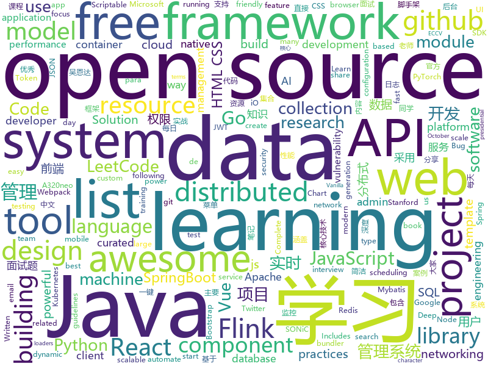

# 2020-10-14
See what the GitHub community is most excited about.

## python
+ [FGVC](https://github.com/vt-vl-lab/FGVC)(**73 stars today**): [ECCV 2020] Flow-edge Guided Video Completion
+ [Real-Time-Voice-Cloning](https://github.com/CorentinJ/Real-Time-Voice-Cloning)(**259 stars today**): Clone a voice in 5 seconds to generate arbitrary speech in real-time
+ [Home-Assistant-custom-components-Xiaomi-Cloud-Map-Extractor](https://github.com/PiotrMachowski/Home-Assistant-custom-components-Xiaomi-Cloud-Map-Extractor)(**9 stars today**): This custom integration provides a way to present a live view of a map for a Xiaomi vacuum.
+ [h4cker](https://github.com/The-Art-of-Hacking/h4cker)(**285 stars today**): This repository is primarily maintained by Omar Santos and includes thousands of resources related to ethical hacking / penetration testing, digital forensics and incident response (DFIR), vulnerability research, exploit development, reverse engineering, and more.
+ [horovod](https://github.com/horovod/horovod)(**10 stars today**): Distributed training framework for TensorFlow, Keras, PyTorch, and Apache MXNet.
+ [twint](https://github.com/twintproject/twint)(**166 stars today**): An advanced Twitter scraping & OSINT tool written in Python that doesn't use Twitter's API, allowing you to scrape a user's followers, following, Tweets and more while evading most API limitations.
+ [django-rest-framework](https://github.com/encode/django-rest-framework)(**11 stars today**): Web APIs for Django.🎸
+ [system-design-primer](https://github.com/donnemartin/system-design-primer)(**163 stars today**): Learn how to design large-scale systems. Prep for the system design interview. Includes Anki flashcards.
+ [ascii-webcam](https://github.com/micodeyt/ascii-webcam)(**69 stars today**): 
+ [nni](https://github.com/microsoft/nni)(**6 stars today**): An open source AutoML toolkit for automate machine learning lifecycle, including feature engineering, neural architecture search, model compression and hyper-parameter tuning.
+ [mmf](https://github.com/facebookresearch/mmf)(**3 stars today**): A modular framework for vision & language multimodal research from Facebook AI Research (FAIR)
+ [boto3](https://github.com/boto/boto3)(**6 stars today**): AWS SDK for Python
+ [black](https://github.com/psf/black)(**11 stars today**): The uncompromising Python code formatter
+ [Awesome-Bugbounty-Writeups](https://github.com/devanshbatham/Awesome-Bugbounty-Writeups)(**48 stars today**): A curated list of bugbounty writeups (Bug type wise) , inspired from https://github.com/ngalongc/bug-bounty-reference
+ [LeetCode_Algorithms](https://github.com/noisefilter19/LeetCode_Algorithms)(**11 stars today**): A collection of solutions for Medium/Hard LeetCode problems. Educational resource
+ [big_screen](https://github.com/TurboWay/big_screen)(**59 stars today**): 数据大屏可视化
+ [CppCoreGuidelines](https://github.com/isocpp/CppCoreGuidelines)(**18 stars today**): The C++ Core Guidelines are a set of tried-and-true guidelines, rules, and best practices about coding in C++
+ [bpytop](https://github.com/aristocratos/bpytop)(**18 stars today**): Linux/OSX/FreeBSD resource monitor
+ [prefect](https://github.com/PrefectHQ/prefect)(**14 stars today**): The easiest way to automate your data
+ [models](https://github.com/PaddlePaddle/models)(**7 stars today**): Pre-trained and Reproduced Deep Learning Models （『飞桨』官方模型库，包含多种学术前沿和工业场景验证的深度学习模型）
+ [bar_chart_race](https://github.com/dexplo/bar_chart_race)(**19 stars today**): Create animated bar chart races in Python with matplotlib
+ [ckan](https://github.com/ckan/ckan)(**1 stars today**): CKAN is an open-source DMS (data management system) for powering data hubs and data portals. CKAN makes it easy to publish, share and use data. It powers catalog.data.gov, europeandataportal.eu/data, data.humdata.org among many other sites.
+ [awesome-python](https://github.com/vinta/awesome-python)(**53 stars today**): A curated list of awesome Python frameworks, libraries, software and resources
+ [posthog](https://github.com/PostHog/posthog)(**8 stars today**): 🦔PostHog is developer-friendly, open-source product analytics.
+ [pytorch-lightning](https://github.com/PyTorchLightning/pytorch-lightning)(**34 stars today**): The lightweight PyTorch wrapper for high-performance AI research. Scale your models, not the boilerplate.

## java
+ [base-admin](https://github.com/huanzi-qch/base-admin)(**71 stars today**): Base Admin一套简单通用的后台管理系统，主要功能有：权限管理、菜单管理、用户管理，系统设置、实时日志，实时监控，API加密，以及登录用户修改密码、配置个性菜单等
+ [advanced-java](https://github.com/doocs/advanced-java)(**265 stars today**): 😮互联网 Java 工程师进阶知识完全扫盲：涵盖高并发、分布式、高可用、微服务、海量数据处理等领域知识，后端同学必看，前端同学也可学习
+ [ar-cptext](https://github.com/cyrildiagne/ar-cptext)(**54 stars today**): AR Copy Paste - Text Proto
+ [elasticsearch](https://github.com/elastic/elasticsearch)(**54 stars today**): Open Source, Distributed, RESTful Search Engine
+ [COLA](https://github.com/alibaba/COLA)(**7 stars today**): Clean Object-oriented & Layered Architecture
+ [tomcat](https://github.com/apache/tomcat)(**10 stars today**): Apache Tomcat
+ [GitHub-Chinese-Top-Charts](https://github.com/kon9chunkit/GitHub-Chinese-Top-Charts)(**20 stars today**): 🇨🇳GitHub中文排行榜，帮助你发现高分优秀中文项目、更高效地吸收国人的优秀经验成果；榜单每周更新一次，敬请关注！
+ [easy163](https://github.com/ndroi/easy163)(**54 stars today**): 安卓端一键解锁网易云音乐，无须 ROOT
+ [xxl-job](https://github.com/xuxueli/xxl-job)(**16 stars today**): A distributed task scheduling framework.（分布式任务调度平台XXL-JOB）
+ [hive](https://github.com/apache/hive)(**3 stars today**): Apache Hive
+ [momo-code-sec-inspector-java](https://github.com/momosecurity/momo-code-sec-inspector-java)(**112 stars today**): IDEA静态代码安全审计及漏洞一键修复插件
+ [vhr](https://github.com/lenve/vhr)(**36 stars today**): 微人事是一个前后端分离的人力资源管理系统，项目采用SpringBoot+Vue开发。
+ [java-design-patterns](https://github.com/iluwatar/java-design-patterns)(**91 stars today**): Design patterns implemented in Java
+ [dbeaver](https://github.com/dbeaver/dbeaver)(**28 stars today**): Free universal database tool and SQL client
+ [zuihou-admin-cloud](https://github.com/zuihou/zuihou-admin-cloud)(**39 stars today**): 基于SpringCloud(Hoxton.SR7) + SpringBoot(2.2.9.RELEASE) 的SaaS 微服务脚手架，具有统一授权、认证后台管理系统，其中包含具备用户管理、资源权限管理、网关API、分布式事务、大文件断点分片续传等多个模块，支持多业务系统并行开发，可以作为后端服务的开发脚手架。代码简洁，架构清晰，适合学习和直接项目中使用。核心技术采用Nacos、Fegin、Ribbon、Zuul、Hystrix、JWT Token、Mybatis、SpringBoot、Redis、RibbitMQ等主要框架和中间件。
+ [flink-learning](https://github.com/zhisheng17/flink-learning)(**14 stars today**): flink learning blog. http://www.flink-learning.com 含 Flink 入门、概念、原理、实战、性能调优、源码解析等内容。涉及 Flink Connector、Metrics、Library、DataStream API、Table API & SQL 等内容的学习案例，还有 Flink 落地应用的大型项目案例（PVUV、日志存储、百亿数据实时去重、监控告警）分享。欢迎大家支持我的专栏《大数据实时计算引擎 Flink 实战与性能优化》
+ [AntennaPod](https://github.com/AntennaPod/AntennaPod)(**23 stars today**): A podcast manager for Android
+ [arthas](https://github.com/alibaba/arthas)(**13 stars today**): Alibaba Java Diagnostic Tool Arthas/Alibaba Java诊断利器Arthas
+ [pulsar](https://github.com/apache/pulsar)(**9 stars today**): Apache Pulsar - distributed pub-sub messaging system
+ [AndroidUtilCode](https://github.com/Blankj/AndroidUtilCode)(**10 stars today**): 🔥Android developers should collect the following utils(updating).
+ [react-native-push-notification](https://github.com/zo0r/react-native-push-notification)(**5 stars today**): React Native Local and Remote Notifications
+ [spring-boot](https://github.com/spring-projects/spring-boot)(**28 stars today**): Spring Boot
+ [nacos](https://github.com/alibaba/nacos)(**17 stars today**): an easy-to-use dynamic service discovery, configuration and service management platform for building cloud native applications.
+ [spring-framework](https://github.com/spring-projects/spring-framework)(**19 stars today**): Spring Framework
+ [bazel](https://github.com/bazelbuild/bazel)(**9 stars today**): a fast, scalable, multi-language and extensible build system

## unknown
+ [free-programming-books](https://github.com/EbookFoundation/free-programming-books)(**361 stars today**): 📚Freely available programming books
+ [awesome-youtubers](https://github.com/JoseDeFreitas/awesome-youtubers)(**62 stars today**): ▶️An awesome list containing awesome YouTubers that teach about technology.
+ [developer-roadmap](https://github.com/kamranahmedse/developer-roadmap)(**440 stars today**): Roadmap to becoming a web developer in 2020
+ [AI_Curriculum](https://github.com/Machine-Learning-Tokyo/AI_Curriculum)(**118 stars today**): Open Deep Learning and Reinforcement Learning lectures from top Universities like Stanford, MIT, UC Berkeley.
+ [The-NLP-Pandect](https://github.com/ivan-bilan/The-NLP-Pandect)(**102 stars today**): A comprehensive reference for all topics related to Natural Language Processing
+ [coding-interview-university](https://github.com/jwasham/coding-interview-university)(**397 stars today**): A complete computer science study plan to become a software engineer.
+ [HowToHunt](https://github.com/KathanP19/HowToHunt)(**120 stars today**): Tutorials and Things to Do while Hunting Vulnerability.
+ [Flutter-Course-Resources](https://github.com/londonappbrewery/Flutter-Course-Resources)(**9 stars today**): Learn to Code While Building Apps - The Complete Flutter Development Bootcamp
+ [awesome-interview-questions](https://github.com/MaximAbramchuck/awesome-interview-questions)(**19 stars today**): A curated awesome list of lists of interview questions. Feel free to contribute!🎓
+ [OnJava8](https://github.com/LingCoder/OnJava8)(**53 stars today**): 《On Java 8》中文版，又名《Java编程思想》 第5版
+ [extended-exercise-windows](https://github.com/holman/extended-exercise-windows)(**23 stars today**): A list of startups that have employee-friendly terms for exercising your options past 90 days.
+ [post-mortems](https://github.com/danluu/post-mortems)(**208 stars today**): A collection of postmortems. Sorry for the delay in merging PRs!
+ [fucking-algorithm](https://github.com/labuladong/fucking-algorithm)(**128 stars today**): 刷算法全靠套路，认准 labuladong 就够了！English version supported! Crack LeetCode, not only how, but also why.
+ [Licensing](https://github.com/AaronDinnage/Licensing)(**4 stars today**): Microsoft 365 licensing diagrams
+ [awesome-spider](https://github.com/facert/awesome-spider)(**12 stars today**): 爬虫集合
+ [stanford-cs-229-machine-learning](https://github.com/afshinea/stanford-cs-229-machine-learning)(**12 stars today**): VIP cheatsheets for Stanford's CS 229 Machine Learning
+ [gitignore](https://github.com/github/gitignore)(**49 stars today**): A collection of useful .gitignore templates
+ [xiaozhi](https://github.com/qq449245884/xiaozhi)(**7 stars today**): 
+ [JavaFamily](https://github.com/AobingJava/JavaFamily)(**48 stars today**): 【Java面试+Java学习指南】 一份涵盖大部分Java程序员所需要掌握的核心知识。
+ [eng-practices](https://github.com/google/eng-practices)(**11 stars today**): Google's Engineering Practices documentation
+ [gpt-3](https://github.com/openai/gpt-3)(**24 stars today**): GPT-3: Language Models are Few-Shot Learners
+ [Python-Core-50-Courses](https://github.com/jackfrued/Python-Core-50-Courses)(**9 stars today**): Python语言基础50课
+ [vagas](https://github.com/frontendbr/vagas)(**10 stars today**): 🔬Espaço para divulgação de vagas para front-enders.
+ [awesome-java](https://github.com/Snailclimb/awesome-java)(**23 stars today**): Collection of awesome Java project on Github(Github 上非常棒的 Java 开源项目集合).
+ [Learn-Vim](https://github.com/iggredible/Learn-Vim)(**10 stars today**): A book for learning the Vim editor the smart way.

## javascript
+ [Luckysheet](https://github.com/mengshukeji/Luckysheet)(**442 stars today**): Luckysheet is an online spreadsheet like excel that is powerful, simple to configure, and completely open source.
+ [fonos](https://github.com/fonoster/fonos)(**239 stars today**): 🚀An open-source alternative to Twilio.
+ [Scriptables](https://github.com/im3x/Scriptables)(**69 stars today**): iOS14桌面组件神器（Scriptable）开发框架、教程、精美脚本分享
+ [bootstrap](https://github.com/twbs/bootstrap)(**41 stars today**): The most popular HTML, CSS, and JavaScript framework for developing responsive, mobile first projects on the web.
+ [lerna](https://github.com/lerna/lerna)(**28 stars today**): 🐉A tool for managing JavaScript projects with multiple packages.
+ [reactjs.org](https://github.com/reactjs/reactjs.org)(**54 stars today**): The React documentation website
+ [webpack](https://github.com/webpack/webpack)(**93 stars today**): A bundler for javascript and friends. Packs many modules into a few bundled assets. Code Splitting allows for loading parts of the application on demand. Through "loaders", modules can be CommonJs, AMD, ES6 modules, CSS, Images, JSON, Coffeescript, LESS, ... and your custom stuff.
+ [incubator-echarts](https://github.com/apache/incubator-echarts)(**22 stars today**): A powerful, interactive charting and data visualization library for browser
+ [vue-test-utils](https://github.com/vuejs/vue-test-utils)(**3 stars today**): 🔬Utilities for testing Vue components
+ [Rocket.Chat](https://github.com/RocketChat/Rocket.Chat)(**9 stars today**): The ultimate Free Open Source Solution for team communications.
+ [Scriptable](https://github.com/GideonSenku/Scriptable)(**15 stars today**): A iOS app named Scriptable's scripts
+ [laravel-mix](https://github.com/JeffreyWay/laravel-mix)(**9 stars today**): The power of webpack, distilled for the rest of us.
+ [material-ui](https://github.com/mui-org/material-ui)(**28 stars today**): React components for faster and easier web development. Build your own design system, or start with Material Design.
+ [react-virtualized](https://github.com/bvaughn/react-virtualized)(**11 stars today**): React components for efficiently rendering large lists and tabular data
+ [vue](https://github.com/vuejs/vue)(**49 stars today**): 🖖Vue.js is a progressive, incrementally-adoptable JavaScript framework for building UI on the web.
+ [nodebestpractices](https://github.com/goldbergyoni/nodebestpractices)(**35 stars today**): ✅The Node.js best practices list (October 2020)
+ [OpenAPI-Specification](https://github.com/OAI/OpenAPI-Specification)(**13 stars today**): The OpenAPI Specification Repository
+ [rollup](https://github.com/rollup/rollup)(**9 stars today**): Next-generation ES module bundler
+ [fe-interview](https://github.com/haizlin/fe-interview)(**16 stars today**): 前端面试每日 3+1，以面试题来驱动学习，提倡每日学习与思考，每天进步一点！每天早上5点纯手工发布面试题（死磕自己，愉悦大家），3000+道前端面试题全面覆盖，HTML/CSS/JavaScript/Vue/React/Nodejs/TypeScript/ECMAScritpt/Webpack/Jquery/小程序/软技能……
+ [Hack-Tools](https://github.com/LasCC/Hack-Tools)(**24 stars today**): The all-in-one Red Team extension for Web Pentester🛠
+ [AdminLTE](https://github.com/ColorlibHQ/AdminLTE)(**12 stars today**): AdminLTE - Free admin dashboard template based on Bootstrap 4
+ [Vue.Draggable](https://github.com/SortableJS/Vue.Draggable)(**18 stars today**): Vue drag-and-drop component based on Sortable.js
+ [vant](https://github.com/youzan/vant)(**18 stars today**): Lightweight Mobile UI Components built on Vue
+ [fingerprintjs](https://github.com/fingerprintjs/fingerprintjs)(**14 stars today**): Modern & flexible browser fingerprinting library
+ [ws](https://github.com/websockets/ws)(**10 stars today**): Simple to use, blazing fast and thoroughly tested WebSocket client and server for Node.js

## html
+ [awfice](https://github.com/zserge/awfice)(**119 stars today**): The world smallest office suite
+ [a32nx](https://github.com/flybywiresim/a32nx)(**15 stars today**): The A32NX Project is a community driven open source project to create a free Airbus A320neo in Microsoft Flight Simulator that is as close to reality as possible. It aims to enhance the default A320neo by improving the systems depth and functionality to bring it up to payware-level, all for free.
+ [tidytuesday](https://github.com/rfordatascience/tidytuesday)(**7 stars today**): Official repo for the #tidytuesday project
+ [html-css](https://github.com/gustavoguanabara/html-css)(**139 stars today**): Curso de HTML5 e CSS3
+ [machine-learning-systems-design](https://github.com/chiphuyen/machine-learning-systems-design)(**14 stars today**): A booklet on machine learning systems design with exercises
+ [SONiC](https://github.com/Azure/SONiC)(**3 stars today**): Landing page for Software for Open Networking in the Cloud (SONiC) - http://azure.github.io/SONiC/
+ [keep-a-changelog](https://github.com/olivierlacan/keep-a-changelog)(**13 stars today**): If you build software, keep a changelog.
+ [workshops](https://github.com/ansible/workshops)(**4 stars today**): Training Course for Ansible Automation Platform
+ [Coursera-ML-AndrewNg-Notes](https://github.com/fengdu78/Coursera-ML-AndrewNg-Notes)(**15 stars today**): 吴恩达老师的机器学习课程个人笔记
+ [email-templates](https://github.com/ColorlibHQ/email-templates)(**2 stars today**): Free HTML email templates for Mailchimp and other emails services
+ [us-potus-model](https://github.com/TheEconomist/us-potus-model)(**5 stars today**): Code for a dynamic multilevel Bayesian model to predict US presidential elections. Written in R and Stan.
+ [django-DefectDojo](https://github.com/DefectDojo/django-DefectDojo)(**3 stars today**): DefectDojo is an open-source application vulnerability correlation and security orchestration tool.
+ [awesome-streamlit](https://github.com/MarcSkovMadsen/awesome-streamlit)(**4 stars today**): The purpose of this project is to share knowledge on how awesome Streamlit is and can be
+ [charts](https://github.com/bitnami/charts)(**3 stars today**): Helm Charts
+ [deeplearning_ai_books](https://github.com/fengdu78/deeplearning_ai_books)(**12 stars today**): deeplearning.ai（吴恩达老师的深度学习课程笔记及资源）
+ [github-markdown-css](https://github.com/sindresorhus/github-markdown-css)(**1 stars today**): The minimal amount of CSS to replicate the GitHub Markdown style
+ [JavaScript30](https://github.com/wesbos/JavaScript30)(**10 stars today**): 30 Day Vanilla JS Challenge
+ [openwrt-packages](https://github.com/kenzok8/openwrt-packages)(**11 stars today**): openwet常用软件包
+ [purecss-character](https://github.com/cyanharlow/purecss-character)(**13 stars today**): Pure HTML/CSS drawing - game character creation scene style. Hand-coded entirely in HTML & CSS.
+ [ML-notes](https://github.com/Sakura-gh/ML-notes)(**11 stars today**): notes about machine learning
+ [ggstatsplot](https://github.com/IndrajeetPatil/ggstatsplot)(**3 stars today**): Enhancing `ggplot2` plots with statistical analysis📊🎨📣
+ [torvenyek](https://github.com/badicsalex/torvenyek)(**11 stars today**): Magyar törvények git repo
+ [startbootstrap-sb-admin-2](https://github.com/StartBootstrap/startbootstrap-sb-admin-2)(**11 stars today**): A free, open source, Bootstrap admin theme created by Start Bootstrap
+ [calico](https://github.com/projectcalico/calico)(**3 stars today**): Cloud native networking and network security
+ [RuoYi](https://github.com/yangzongzhuan/RuoYi)(**4 stars today**): (RuoYi)官方仓库 基于SpringBoot的权限管理系统 易读易懂、界面简洁美观。 核心技术采用Spring、MyBatis、Shiro没有任何其它重度依赖。直接运行即可用

## go
+ [v2ray-core](https://github.com/v2fly/v2ray-core)(**188 stars today**): A platform for building proxies to bypass network restrictions.
+ [bubbletea](https://github.com/charmbracelet/bubbletea)(**513 stars today**): A powerful little TUI framework🏗
+ [nebula](https://github.com/slackhq/nebula)(**24 stars today**): A scalable overlay networking tool with a focus on performance, simplicity and security
+ [go-micro](https://github.com/micro/go-micro)(**21 stars today**): A Go standard library for microservices
+ [go-sqlmock](https://github.com/DATA-DOG/go-sqlmock)(**4 stars today**): Sql mock driver for golang to test database interactions
+ [etcd](https://github.com/etcd-io/etcd)(**19 stars today**): Distributed reliable key-value store for the most critical data of a distributed system
+ [cadvisor](https://github.com/google/cadvisor)(**4 stars today**): Analyzes resource usage and performance characteristics of running containers.
+ [sarama](https://github.com/Shopify/sarama)(**5 stars today**): Sarama is a Go library for Apache Kafka 0.8, and up.
+ [bit](https://github.com/chriswalz/bit)(**557 stars today**): Bit is a modern Git CLI
+ [helmfile](https://github.com/roboll/helmfile)(**4 stars today**): Deploy Kubernetes Helm Charts
+ [LeetCode-Go](https://github.com/halfrost/LeetCode-Go)(**44 stars today**): ✅Solutions to LeetCode by Go, 100% test coverage, runtime beats 100% / LeetCode 题解
+ [kubernetes](https://github.com/kubernetes/kubernetes)(**33 stars today**): Production-Grade Container Scheduling and Management
+ [tidb](https://github.com/pingcap/tidb)(**13 stars today**): TiDB is an open source distributed HTAP database compatible with the MySQL protocol
+ [autoscaler](https://github.com/kubernetes/autoscaler)(**4 stars today**): Autoscaling components for Kubernetes
+ [eggos](https://github.com/icexin/eggos)(**36 stars today**): A Go unikernel running on x86 bare metal
+ [squirrel](https://github.com/Masterminds/squirrel)(**5 stars today**): Fluent SQL generation for golang
+ [protobuf](https://github.com/golang/protobuf)(**4 stars today**): Go support for Google's protocol buffers
+ [jwt-go](https://github.com/dgrijalva/jwt-go)(**5 stars today**): Golang implementation of JSON Web Tokens (JWT)
+ [redis](https://github.com/go-redis/redis)(**15 stars today**): Type-safe Redis client for Golang
+ [kubebuilder](https://github.com/kubernetes-sigs/kubebuilder)(**8 stars today**): Kubebuilder - SDK for building Kubernetes APIs using CRDs
+ [rancher](https://github.com/rancher/rancher)(**14 stars today**): Complete container management platform
+ [pg](https://github.com/go-pg/pg)(**7 stars today**): Golang ORM with focus on PostgreSQL features and performance
+ [govmomi](https://github.com/vmware/govmomi)(**4 stars today**): Go library for the VMware vSphere API
+ [pulumi](https://github.com/pulumi/pulumi)(**17 stars today**): Pulumi - Modern Infrastructure as Code. Any cloud, any language🚀
+ [viper](https://github.com/spf13/viper)(**19 stars today**): Go configuration with fangs

## WordCloud

