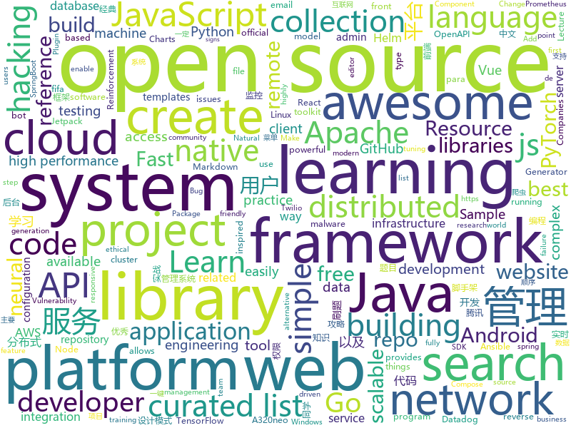

# 2020-10-15
See what the GitHub community is most excited about.

## python
+ [FGVC](https://github.com/vt-vl-lab/FGVC)(**127 stars today**): [ECCV 2020] Flow-edge Guided Video Completion
+ [Real-Time-Voice-Cloning](https://github.com/CorentinJ/Real-Time-Voice-Cloning)(**267 stars today**): Clone a voice in 5 seconds to generate arbitrary speech in real-time
+ [nni](https://github.com/microsoft/nni)(**8 stars today**): An open source AutoML toolkit for automate machine learning lifecycle, including feature engineering, neural architecture search, model compression and hyper-parameter tuning.
+ [ansible-for-devops](https://github.com/geerlingguy/ansible-for-devops)(**8 stars today**): Ansible for DevOps examples.
+ [GHunt](https://github.com/mxrch/GHunt)(**159 stars today**): 🕵️‍♂️Investigate Google Accounts with emails.
+ [h4cker](https://github.com/The-Art-of-Hacking/h4cker)(**234 stars today**): This repository is primarily maintained by Omar Santos and includes thousands of resources related to ethical hacking / penetration testing, digital forensics and incident response (DFIR), vulnerability research, exploit development, reverse engineering, and more.
+ [math-worksheet-generator](https://github.com/januschung/math-worksheet-generator)(**40 stars today**): Create basic addition, subtraction and multiplication practice questions with the answer sheet
+ [mlflow](https://github.com/mlflow/mlflow)(**10 stars today**): Open source platform for the machine learning lifecycle
+ [horovod](https://github.com/horovod/horovod)(**38 stars today**): Distributed training framework for TensorFlow, Keras, PyTorch, and Apache MXNet.
+ [Home-Assistant-custom-components-Xiaomi-Cloud-Map-Extractor](https://github.com/PiotrMachowski/Home-Assistant-custom-components-Xiaomi-Cloud-Map-Extractor)(**20 stars today**): This custom integration provides a way to present a live view of a map for a Xiaomi vacuum.
+ [Awesome-Bugbounty-Writeups](https://github.com/devanshbatham/Awesome-Bugbounty-Writeups)(**30 stars today**): A curated list of bugbounty writeups (Bug type wise) , inspired from https://github.com/ngalongc/bug-bounty-reference
+ [glacX2020](https://github.com/rafael-rfzorzi/glacX2020)(**18 stars today**): 
+ [black](https://github.com/psf/black)(**17 stars today**): The uncompromising Python code formatter
+ [pytorch-lightning](https://github.com/PyTorchLightning/pytorch-lightning)(**25 stars today**): The lightweight PyTorch wrapper for high-performance AI research. Scale your models, not the boilerplate.
+ [moto](https://github.com/spulec/moto)(**6 stars today**): A library that allows you to easily mock out tests based on AWS infrastructure.
+ [jina](https://github.com/jina-ai/jina)(**11 stars today**): An easier way to build neural search in the cloud
+ [transformers](https://github.com/huggingface/transformers)(**60 stars today**): 🤗Transformers: State-of-the-art Natural Language Processing for Pytorch and TensorFlow 2.0.
+ [NSVF](https://github.com/facebookresearch/NSVF)(**20 stars today**): Open source code for the paper of Neural Sparse Voxel Fields.
+ [LeetCode_Algorithms](https://github.com/noisefilter19/LeetCode_Algorithms)(**21 stars today**): A collection of solutions for Medium/Hard LeetCode problems. Educational resource
+ [MONAI](https://github.com/Project-MONAI/MONAI)(**6 stars today**): AI Toolkit for Healthcare Imaging
+ [tuya-convert](https://github.com/ct-Open-Source/tuya-convert)(**7 stars today**): A collection of scripts to flash Tuya IoT devices to alternative firmwares
+ [ray](https://github.com/ray-project/ray)(**15 stars today**): An open source framework that provides a simple, universal API for building distributed applications. Ray is packaged with RLlib, a scalable reinforcement learning library, and Tune, a scalable hyperparameter tuning library.
+ [wemake-python-styleguide](https://github.com/wemake-services/wemake-python-styleguide)(**6 stars today**): The strictest and most opinionated python linter ever!
+ [integrations-core](https://github.com/DataDog/integrations-core)(**0 stars today**): Core integrations of the Datadog Agent
+ [nerve](https://github.com/PaytmLabs/nerve)(**9 stars today**): NERVE Continuous Vulnerability Scanner

## java
+ [advanced-java](https://github.com/doocs/advanced-java)(**184 stars today**): 😮互联网 Java 工程师进阶知识完全扫盲：涵盖高并发、分布式、高可用、微服务、海量数据处理等领域知识，后端同学必看，前端同学也可学习
+ [base-admin](https://github.com/huanzi-qch/base-admin)(**87 stars today**): Base Admin一套简单通用的后台管理系统，主要功能有：权限管理、菜单管理、用户管理，系统设置、实时日志，实时监控，API加密，以及登录用户修改密码、配置个性菜单等
+ [strimzi-kafka-operator](https://github.com/strimzi/strimzi-kafka-operator)(**3 stars today**): Apache Kafka running on Kubernetes
+ [momo-code-sec-inspector-java](https://github.com/momosecurity/momo-code-sec-inspector-java)(**70 stars today**): IDEA静态代码安全审计及漏洞一键修复插件
+ [elasticsearch](https://github.com/elastic/elasticsearch)(**100 stars today**): Open Source, Distributed, RESTful Search Engine
+ [Hystrix](https://github.com/Netflix/Hystrix)(**17 stars today**): Hystrix is a latency and fault tolerance library designed to isolate points of access to remote systems, services and 3rd party libraries, stop cascading failure and enable resilience in complex distributed systems where failure is inevitable.
+ [androidx](https://github.com/androidx/androidx)(**29 stars today**): Development environment for Jetpack Android extension libraries. Synchronized with Jetpack's primary development branch on AOSP.
+ [GitHub-Chinese-Top-Charts](https://github.com/kon9chunkit/GitHub-Chinese-Top-Charts)(**28 stars today**): 🇨🇳GitHub中文排行榜，帮助你发现高分优秀中文项目、更高效地吸收国人的优秀经验成果；榜单每周更新一次，敬请关注！
+ [aws-lambda-developer-guide](https://github.com/awsdocs/aws-lambda-developer-guide)(**2 stars today**): The AWS Lambda Developer Guide
+ [epoxy](https://github.com/airbnb/epoxy)(**2 stars today**): Epoxy is an Android library for building complex screens in a RecyclerView
+ [itstack-demo-design](https://github.com/fuzhengwei/itstack-demo-design)(**10 stars today**): 《重学Java设计模式「22个互联网真实案例实战」》技术好就一定能写出好代码吗？不能！再漂亮的马桶放到厨房都略显尴尬！无论是家里装修还是上道开车，只有通过实战才能快速将理论转变为技能。毕竟设计模式也是源于 克里斯托佛·亚历山大 的著作 《建筑模式语言》。
+ [react-native-push-notification](https://github.com/zo0r/react-native-push-notification)(**9 stars today**): React Native Local and Remote Notifications
+ [xxl-job](https://github.com/xuxueli/xxl-job)(**20 stars today**): A distributed task scheduling framework.（分布式任务调度平台XXL-JOB）
+ [debezium](https://github.com/debezium/debezium)(**5 stars today**): Change data capture for a variety of databases. Please log issues at https://issues.redhat.com/browse/DBZ.
+ [AntennaPod](https://github.com/AntennaPod/AntennaPod)(**22 stars today**): A podcast manager for Android
+ [junit4](https://github.com/junit-team/junit4)(**3 stars today**): A programmer-oriented testing framework for Java.
+ [openapi-generator](https://github.com/OpenAPITools/openapi-generator)(**12 stars today**): OpenAPI Generator allows generation of API client libraries (SDK generation), server stubs, documentation and configuration automatically given an OpenAPI Spec (v2, v3)
+ [retrofit](https://github.com/square/retrofit)(**12 stars today**): A type-safe HTTP client for Android and the JVM
+ [tutorials](https://github.com/eugenp/tutorials)(**11 stars today**): Just Announced - "Learn Spring Security OAuth":
+ [easy163](https://github.com/ndroi/easy163)(**53 stars today**): 安卓端一键解锁网易云音乐，无须 ROOT
+ [druid](https://github.com/alibaba/druid)(**11 stars today**): 阿里巴巴计算平台事业部出品，为监控而生的数据库连接池
+ [camel](https://github.com/apache/camel)(**3 stars today**): Apache Camel is an open source integration framework that empowers you to quickly and easily integrate various systems consuming or producing data.
+ [zuihou-admin-cloud](https://github.com/zuihou/zuihou-admin-cloud)(**35 stars today**): 基于SpringCloud(Hoxton.SR7) + SpringBoot(2.2.9.RELEASE) 的SaaS 微服务脚手架，具有统一授权、认证后台管理系统，其中包含具备用户管理、资源权限管理、网关API、分布式事务、大文件断点分片续传等多个模块，支持多业务系统并行开发，可以作为后端服务的开发脚手架。代码简洁，架构清晰，适合学习和直接项目中使用。核心技术采用Nacos、Fegin、Ribbon、Zuul、Hystrix、JWT Token、Mybatis、SpringBoot、Redis、RibbitMQ等主要框架和中间件。
+ [lucene-solr](https://github.com/apache/lucene-solr)(**3 stars today**): Apache Lucene and Solr open-source search software
+ [flowable-engine](https://github.com/flowable/flowable-engine)(**7 stars today**): A compact and highly efficient workflow and Business Process Management (BPM) platform for developers, system admins and business users.

## unknown
+ [awesome-mlops](https://github.com/visenger/awesome-mlops)(**226 stars today**): A curated list of references for MLOps
+ [awesome-youtubers](https://github.com/JoseDeFreitas/awesome-youtubers)(**225 stars today**): ▶️An awesome list containing awesome YouTubers that teach about technology.
+ [free-programming-books](https://github.com/EbookFoundation/free-programming-books)(**377 stars today**): 📚Freely available programming books
+ [leetcode-master](https://github.com/youngyangyang04/leetcode-master)(**12 stars today**): LeetCode 刷题攻略：配思维导图，各个类型的经典题目刷题顺序、经典算法模板，以及详细图解和视频题解。这里精选的题目都不是孤立的，而是由浅入深一脉相承的，相信只要按照刷题攻略上的顺序来学习，一定会有所收获！给个star支持一下吧！
+ [developer-roadmap](https://github.com/kamranahmedse/developer-roadmap)(**470 stars today**): Roadmap to becoming a web developer in 2020
+ [coding-interview-university](https://github.com/jwasham/coding-interview-university)(**291 stars today**): A complete computer science study plan to become a software engineer.
+ [The-NLP-Pandect](https://github.com/ivan-bilan/The-NLP-Pandect)(**104 stars today**): A comprehensive reference for all topics related to Natural Language Processing
+ [PENTESTING-BIBLE](https://github.com/blaCCkHatHacEEkr/PENTESTING-BIBLE)(**22 stars today**): Learn ethical hacking.Learn about reconnaissance,windows/linux hacking,attacking web technologies,and pen testing wireless networks.Resources for learning malware analysis and reverse engineering.
+ [gameday](https://github.com/twilio/gameday)(**22 stars today**): A collection of Twilio SRE's Gameday Templates
+ [weekly](https://github.com/dt-fe/weekly)(**13 stars today**): 前端精读周刊
+ [vagas](https://github.com/frontendbr/vagas)(**14 stars today**): 🔬Espaço para divulgação de vagas para front-enders.
+ [geckodriver](https://github.com/mozilla/geckodriver)(**8 stars today**): WebDriver for Firefox
+ [gitignore](https://github.com/github/gitignore)(**59 stars today**): A collection of useful .gitignore templates
+ [PoC-in-GitHub](https://github.com/nomi-sec/PoC-in-GitHub)(**12 stars today**): 📡PoC auto collect from GitHub. Be careful malware.
+ [awesome-malware-analysis](https://github.com/rshipp/awesome-malware-analysis)(**8 stars today**): Defund the Police.
+ [AI_Curriculum](https://github.com/Machine-Learning-Tokyo/AI_Curriculum)(**123 stars today**): Open Deep Learning and Reinforcement Learning lectures from top Universities like Stanford, MIT, UC Berkeley.
+ [awesome-self-supervised-learning](https://github.com/jason718/awesome-self-supervised-learning)(**9 stars today**): A curated list of awesome self-supervised methods
+ [OnJava8](https://github.com/LingCoder/OnJava8)(**40 stars today**): 《On Java 8》中文版，又名《Java编程思想》 第5版
+ [awesome-vue](https://github.com/vuejs/awesome-vue)(**20 stars today**): 🎉A curated list of awesome things related to Vue.js
+ [common-words](https://github.com/yoksel/common-words)(**6 stars today**): 🧐Слова, часто используемые в CSS-классах
+ [learn-python3](https://github.com/michaelliao/learn-python3)(**4 stars today**): Learn Python 3 Sample Code
+ [COVID-19](https://github.com/pcm-dpc/COVID-19)(**5 stars today**): COVID-19 Italia - Monitoraggio situazione
+ [awesome-spider](https://github.com/facert/awesome-spider)(**15 stars today**): 爬虫集合
+ [awesome-command-line-apps](https://github.com/herrbischoff/awesome-command-line-apps)(**15 stars today**): 🐚Use your terminal shell to do awesome things.
+ [siber-guvenlik-sss](https://github.com/LuNiZz/siber-guvenlik-sss)(**2 stars today**): SSS sorulari burada...

## javascript
+ [fonos](https://github.com/fonoster/fonos)(**399 stars today**): 🚀An open-source alternative to Twilio.
+ [venom](https://github.com/orkestral/venom)(**8 stars today**): Venom is a high-performance system developed with JavaScript to create a bot for WhatsApp
+ [Luckysheet](https://github.com/mengshukeji/Luckysheet)(**385 stars today**): Luckysheet is an online spreadsheet like excel that is powerful, simple to configure, and completely open source.
+ [javascript](https://github.com/airbnb/javascript)(**35 stars today**): JavaScript Style Guide
+ [three.js](https://github.com/mrdoob/three.js)(**29 stars today**): JavaScript 3D library.
+ [remote-jobs](https://github.com/remoteintech/remote-jobs)(**5 stars today**): A list of semi to fully remote-friendly companies in tech.
+ [marktext](https://github.com/marktext/marktext)(**24 stars today**): 📝A simple and elegant markdown editor, available for Linux, macOS and Windows.
+ [ecars](https://github.com/trailheadapps/ecars)(**6 stars today**): Sample application for Lightning Web Components and Salesforce Platform runtime and compute capabilities. Part of the sample gallery. Electric car manufacturer use case. Get inspired and learn best practices.
+ [Vue.Draggable](https://github.com/SortableJS/Vue.Draggable)(**20 stars today**): Vue drag-and-drop component based on Sortable.js
+ [TIMSDK](https://github.com/tencentyun/TIMSDK)(**3 stars today**): 腾讯云即时通信 IM 服务，国内下载镜像：
+ [gutenberg](https://github.com/WordPress/gutenberg)(**3 stars today**): The Block Editor project for WordPress and beyond. Plugin is available from the official repository.
+ [react-boilerplate](https://github.com/react-boilerplate/react-boilerplate)(**15 stars today**): 🔥A highly scalable, offline-first foundation with the best developer experience and a focus on performance and best practices.
+ [strapi](https://github.com/strapi/strapi)(**46 stars today**): 🚀Open source Node.js Headless CMS to easily build customisable APIs
+ [gatsby](https://github.com/gatsbyjs/gatsby)(**16 stars today**): Build blazing fast, modern apps and websites with React
+ [Baileys](https://github.com/adiwajshing/Baileys)(**3 stars today**): Lightweight full-featured typescript/javascript WhatsApp Web API
+ [Scriptables](https://github.com/im3x/Scriptables)(**68 stars today**): iOS14桌面组件神器（Scriptable）开发框架、教程、精美脚本分享
+ [Fifa21-AutoBuyer](https://github.com/chithakumar13/Fifa21-AutoBuyer)(**4 stars today**): Fifa 21 AutoBuyer / Snipping Bot for fifa 21 ultimate team web app
+ [elasticsearch-head](https://github.com/mobz/elasticsearch-head)(**5 stars today**): A web front end for an elastic search cluster
+ [locomotive-scroll](https://github.com/locomotivemtl/locomotive-scroll)(**15 stars today**): 🛤Detection of elements in viewport & smooth scrolling with parallax.
+ [react-grid-layout](https://github.com/STRML/react-grid-layout)(**14 stars today**): A draggable and resizable grid layout with responsive breakpoints, for React.
+ [nuxt.js](https://github.com/nuxt/nuxt.js)(**20 stars today**): The Intuitive Vue Framework
+ [aws-sdk-js](https://github.com/aws/aws-sdk-js)(**3 stars today**): AWS SDK for JavaScript in the browser and Node.js
+ [webpack-cli](https://github.com/webpack/webpack-cli)(**2 stars today**): Webpack's Command Line Interface
+ [hiring-without-whiteboards](https://github.com/poteto/hiring-without-whiteboards)(**15 stars today**): ⭐️Companies that don't have a broken hiring process
+ [deck.gl](https://github.com/visgl/deck.gl)(**5 stars today**): WebGL2 powered geospatial visualization layers

## html
+ [awfice](https://github.com/zserge/awfice)(**262 stars today**): The world smallest office suite
+ [html-css](https://github.com/gustavoguanabara/html-css)(**53 stars today**): Curso de HTML5 e CSS3
+ [nlw3-discovery-happy](https://github.com/guilhermecapitao/nlw3-discovery-happy)(**10 stars today**): 
+ [a32nx](https://github.com/flybywiresim/a32nx)(**16 stars today**): The A32NX Project is a community driven open source project to create a free Airbus A320neo in Microsoft Flight Simulator that is as close to reality as possible. It aims to enhance the default A320neo by improving the systems depth and functionality to bring it up to payware-level, all for free.
+ [HacktoberFest2020](https://github.com/bajajvinamr/HacktoberFest2020)(**6 stars today**): Make your first PR! ~ A beginner-friendly repository. Add your profile, a blog, or any program under any language (it can be anything from a hello-world program to a complex data structure algorithm) or update the existing one. Just make sure to add the file under the correct directory. Happy hacking!
+ [workshops](https://github.com/ansible/workshops)(**8 stars today**): Training Course for Ansible Automation Platform
+ [learning-area](https://github.com/mdn/learning-area)(**5 stars today**): Github repo for the MDN Learning Area.
+ [Markdown-Resume](https://github.com/CyC2018/Markdown-Resume)(**7 stars today**): ⭐️Markdown 简历模版
+ [helm-charts](https://github.com/prometheus-community/helm-charts)(**12 stars today**): Prometheus community Helm charts
+ [intro.js](https://github.com/usablica/intro.js)(**4 stars today**): A better way for new feature introduction and step-by-step users guide for your website and project.
+ [helm-charts](https://github.com/DataDog/helm-charts)(**2 stars today**): Helm charts for Datadog products
+ [calico](https://github.com/projectcalico/calico)(**6 stars today**): Cloud native networking and network security
+ [Geektoberfest-Main](https://github.com/GeekHaven/Geektoberfest-Main)(**0 stars today**): This is the starting point of Geektoberfest! Have a look at the readme for Rules and Guidelines, you can also contribute to the collaborative website in this repo!
+ [lectures](https://github.com/uo-ec607/lectures)(**2 stars today**): Lecture notes for EC 607
+ [keep-a-changelog](https://github.com/olivierlacan/keep-a-changelog)(**7 stars today**): If you build software, keep a changelog.
+ [charts](https://github.com/bitnami/charts)(**3 stars today**): Helm Charts
+ [qcloud-documents](https://github.com/tencentyun/qcloud-documents)(**0 stars today**): 腾讯云官方文档
+ [Cerberus](https://github.com/TedGoas/Cerberus)(**2 stars today**): A few simple, but solid patterns for responsive HTML email templates and newsletters. Even in Outlook and Gmail.
+ [startbootstrap-sb-admin-2](https://github.com/StartBootstrap/startbootstrap-sb-admin-2)(**3 stars today**): A free, open source, Bootstrap admin theme created by Start Bootstrap
+ [JavaScript30](https://github.com/wesbos/JavaScript30)(**9 stars today**): 30 Day Vanilla JS Challenge
+ [RateMySupervisor](https://github.com/kgco/RateMySupervisor)(**3 stars today**): 永久免费开源的导师评价数据、数据爬虫、无需编程基础的展示网页以及新信息补充平台
+ [tidytuesday](https://github.com/rfordatascience/tidytuesday)(**10 stars today**): Official repo for the #tidytuesday project
+ [mxgraph](https://github.com/jgraph/mxgraph)(**3 stars today**): mxGraph is a fully client side JavaScript diagramming library
+ [sagan](https://github.com/spring-io/sagan)(**3 stars today**): The spring.io site and reference application
+ [kubespray](https://github.com/kubernetes-sigs/kubespray)(**2 stars today**): Deploy a Production Ready Kubernetes Cluster

## go
+ [grpc-gateway](https://github.com/grpc-ecosystem/grpc-gateway)(**11 stars today**): gRPC to JSON proxy generator following the gRPC HTTP spec
+ [vitess](https://github.com/vitessio/vitess)(**10 stars today**): Vitess is a database clustering system for horizontal scaling of MySQL.
+ [pulumi](https://github.com/pulumi/pulumi)(**15 stars today**): Pulumi - Modern Infrastructure as Code. Any cloud, any language🚀
+ [bubbletea](https://github.com/charmbracelet/bubbletea)(**282 stars today**): A powerful little TUI framework🏗
+ [packer](https://github.com/hashicorp/packer)(**5 stars today**): Packer is a tool for creating identical machine images for multiple platforms from a single source configuration.
+ [fasthttp](https://github.com/valyala/fasthttp)(**24 stars today**): Fast HTTP package for Go. Tuned for high performance. Zero memory allocations in hot paths. Up to 10x faster than net/http
+ [telegraf](https://github.com/influxdata/telegraf)(**2 stars today**): The plugin-driven server agent for collecting & reporting metrics.
+ [caddy](https://github.com/caddyserver/caddy)(**17 stars today**): Fast, multi-platform web server with automatic HTTPS
+ [magma](https://github.com/magma/magma)(**0 stars today**): Platform for building access networks and modular network services
+ [vault](https://github.com/hashicorp/vault)(**20 stars today**): A tool for secrets management, encryption as a service, and privileged access management
+ [client_golang](https://github.com/prometheus/client_golang)(**5 stars today**): Prometheus instrumentation library for Go applications
+ [terraform](https://github.com/hashicorp/terraform)(**18 stars today**): Terraform enables you to safely and predictably create, change, and improve infrastructure. It is an open source tool that codifies APIs into declarative configuration files that can be shared amongst team members, treated as code, edited, reviewed, and versioned.
+ [govalidator](https://github.com/asaskevich/govalidator)(**2 stars today**): [Go] Package of validators and sanitizers for strings, numerics, slices and structs
+ [cli](https://github.com/docker/cli)(**4 stars today**): The Docker CLI
+ [terraform-provider-aws](https://github.com/terraform-providers/terraform-provider-aws)(**5 stars today**): Terraform AWS provider
+ [temporal](https://github.com/temporalio/temporal)(**32 stars today**): Temporal service and CLI
+ [postgres-operator](https://github.com/zalando/postgres-operator)(**4 stars today**): Postgres operator creates and manages PostgreSQL clusters running in Kubernetes
+ [compose-cli](https://github.com/docker/compose-cli)(**7 stars today**): Easily run your Compose application to the cloud with compose-cli
+ [harbor](https://github.com/goharbor/harbor)(**16 stars today**): An open source trusted cloud native registry project that stores, signs, and scans content.
+ [webrtc](https://github.com/pion/webrtc)(**13 stars today**): Pure Go implementation of the WebRTC API
+ [terraform-provider-azurerm](https://github.com/terraform-providers/terraform-provider-azurerm)(**2 stars today**): Terraform provider for Azure Resource Manager
+ [traefik](https://github.com/traefik/traefik)(**25 stars today**): The Cloud Native Application Proxy
+ [opa](https://github.com/open-policy-agent/opa)(**13 stars today**): An open source, general-purpose policy engine.
+ [v2ray-core](https://github.com/v2fly/v2ray-core)(**103 stars today**): A platform for building proxies to bypass network restrictions.
+ [prometheus](https://github.com/prometheus/prometheus)(**16 stars today**): The Prometheus monitoring system and time series database.

## WordCloud

