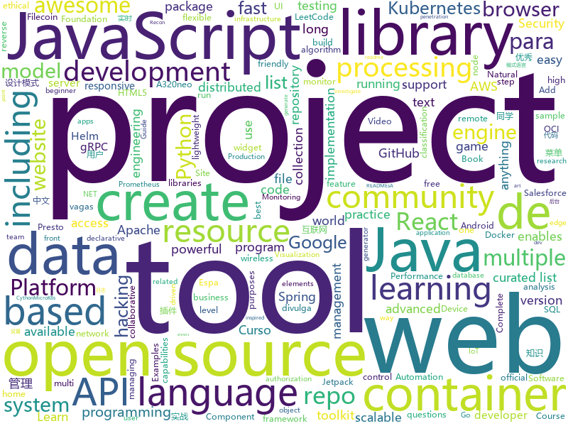

# 2020-10-16
See what the GitHub community is most excited about.

## python
+ [nni](https://github.com/microsoft/nni)(**72 stars today**): An open source AutoML toolkit for automate machine learning lifecycle, including feature engineering, neural architecture search, model compression and hyper-parameter tuning.
+ [insightface](https://github.com/deepinsight/insightface)(**27 stars today**): Face Analysis Project on MXNet
+ [transformers](https://github.com/huggingface/transformers)(**69 stars today**): 🤗Transformers: State-of-the-art Natural Language Processing for Pytorch and TensorFlow 2.0.
+ [practical-python](https://github.com/dabeaz-course/practical-python)(**13 stars today**): Practical Python Programming (course by @dabeaz)
+ [GitDorker](https://github.com/obheda12/GitDorker)(**119 stars today**): A Python program to scrape secrets from GitHub through usage of a large repository of dorks.
+ [GHunt](https://github.com/mxrch/GHunt)(**283 stars today**): 🕵️‍♂️Investigate Google Accounts with emails.
+ [manim](https://github.com/3b1b/manim)(**30 stars today**): Animation engine for explanatory math videos
+ [ansible-for-devops](https://github.com/geerlingguy/ansible-for-devops)(**76 stars today**): Ansible for DevOps examples.
+ [Real-Time-Voice-Cloning](https://github.com/CorentinJ/Real-Time-Voice-Cloning)(**189 stars today**): Clone a voice in 5 seconds to generate arbitrary speech in real-time
+ [XSStrike](https://github.com/s0md3v/XSStrike)(**10 stars today**): Most advanced XSS scanner.
+ [core](https://github.com/home-assistant/core)(**32 stars today**): 🏡Open source home automation that puts local control and privacy first
+ [gym](https://github.com/openai/gym)(**15 stars today**): A toolkit for developing and comparing reinforcement learning algorithms.
+ [airflow](https://github.com/apache/airflow)(**23 stars today**): Apache Airflow - A platform to programmatically author, schedule, and monitor workflows
+ [bpytop](https://github.com/aristocratos/bpytop)(**86 stars today**): Linux/OSX/FreeBSD resource monitor
+ [FGVC](https://github.com/vt-vl-lab/FGVC)(**111 stars today**): [ECCV 2020] Flow-edge Guided Video Completion
+ [FavFreak](https://github.com/devanshbatham/FavFreak)(**25 stars today**): Making Favicon.ico based Recon Great again !
+ [deep-learning-for-image-processing](https://github.com/WZMIAOMIAO/deep-learning-for-image-processing)(**6 stars today**): deep learning for image processing including classification and object-detection etc.
+ [spaCy](https://github.com/explosion/spaCy)(**26 stars today**): 💫Industrial-strength Natural Language Processing (NLP) with Python and Cython
+ [microk8s](https://github.com/ubuntu/microk8s)(**33 stars today**): MicroK8s is a small, fast, single-package Kubernetes for developers, IoT and edge.
+ [math-worksheet-generator](https://github.com/januschung/math-worksheet-generator)(**98 stars today**): Create basic addition, subtraction and multiplication practice questions with the answer sheet
+ [incubator-superset](https://github.com/apache/incubator-superset)(**13 stars today**): Apache Superset is a Data Visualization and Data Exploration Platform
+ [aws-cdk-examples](https://github.com/aws-samples/aws-cdk-examples)(**4 stars today**): Example projects using the AWS CDK
+ [LeetCode_Algorithms](https://github.com/noisefilter19/LeetCode_Algorithms)(**10 stars today**): A collection of solutions for Medium/Hard LeetCode problems. Educational resource
+ [wifite2](https://github.com/derv82/wifite2)(**4 stars today**): Rewrite of the popular wireless network auditor, "wifite"
+ [h4cker](https://github.com/The-Art-of-Hacking/h4cker)(**229 stars today**): This repository is primarily maintained by Omar Santos and includes thousands of resources related to ethical hacking / penetration testing, digital forensics and incident response (DFIR), vulnerability research, exploit development, reverse engineering, and more.

## java
+ [strimzi-kafka-operator](https://github.com/strimzi/strimzi-kafka-operator)(**96 stars today**): Apache Kafka running on Kubernetes
+ [GitHub-Chinese-Top-Charts](https://github.com/kon9chunkit/GitHub-Chinese-Top-Charts)(**73 stars today**): 🇨🇳GitHub中文排行榜，帮助你发现高分优秀中文项目、更高效地吸收国人的优秀经验成果；榜单每周更新一次，敬请关注！
+ [advanced-java](https://github.com/doocs/advanced-java)(**144 stars today**): 😮互联网 Java 工程师进阶知识完全扫盲：涵盖高并发、分布式、高可用、微服务、海量数据处理等领域知识，后端同学必看，前端同学也可学习
+ [base-admin](https://github.com/huanzi-qch/base-admin)(**89 stars today**): Base Admin一套简单通用的后台管理系统，主要功能有：权限管理、菜单管理、用户管理，系统设置、实时日志，实时监控，API加密，以及登录用户修改密码、配置个性菜单等
+ [itstack-demo-design](https://github.com/fuzhengwei/itstack-demo-design)(**20 stars today**): 《重学Java设计模式「22个互联网真实案例实战」》技术好就一定能写出好代码吗？不能！再漂亮的马桶放到厨房都略显尴尬！无论是家里装修还是上道开车，只有通过实战才能快速将理论转变为技能。毕竟设计模式也是源于 克里斯托佛·亚历山大 的著作 《建筑模式语言》。
+ [react-native-video](https://github.com/react-native-video/react-native-video)(**4 stars today**): A <Video /> component for react-native
+ [tutorials](https://github.com/eugenp/tutorials)(**20 stars today**): Just Announced - "Learn Spring Security OAuth":
+ [androidx](https://github.com/androidx/androidx)(**25 stars today**): Development environment for Jetpack Android extension libraries. Synchronized with Jetpack's primary development branch on AOSP.
+ [antlr4](https://github.com/antlr/antlr4)(**6 stars today**): ANTLR (ANother Tool for Language Recognition) is a powerful parser generator for reading, processing, executing, or translating structured text or binary files.
+ [views-widgets-samples](https://github.com/android/views-widgets-samples)(**18 stars today**): Multiple samples showing the best practices in views-widgets on Android.
+ [resilience4j](https://github.com/resilience4j/resilience4j)(**6 stars today**): Resilience4j is a fault tolerance library designed for Java8 and functional programming
+ [Hacktoberfest2020](https://github.com/Cullyege/Hacktoberfest2020)(**5 stars today**): Make your Hacktoberfest 2020 contribution here! Win stickers and a T-shirt on completing 4 pull requests. (Specially for beginners)! :D
+ [testcontainers-java](https://github.com/testcontainers/testcontainers-java)(**5 stars today**): Testcontainers is a Java library that supports JUnit tests, providing lightweight, throwaway instances of common databases, Selenium web browsers, or anything else that can run in a Docker container.
+ [beam](https://github.com/apache/beam)(**3 stars today**): Apache Beam is a unified programming model for Batch and Streaming
+ [graphql-java](https://github.com/graphql-java/graphql-java)(**7 stars today**): GraphQL Java implementation
+ [thingsboard](https://github.com/thingsboard/thingsboard)(**3 stars today**): Open-source IoT Platform - Device management, data collection, processing and visualization.
+ [presto](https://github.com/prestosql/presto)(**0 stars today**): Home of the community managed version of Presto, the distributed SQL query engine for big data, under the auspices of the Presto Software Foundation.
+ [bazel](https://github.com/bazelbuild/bazel)(**11 stars today**): a fast, scalable, multi-language and extensible build system
+ [swagger-core](https://github.com/swagger-api/swagger-core)(**3 stars today**): Examples and server integrations for generating the Swagger API Specification, which enables easy access to your REST API
+ [momo-code-sec-inspector-java](https://github.com/momosecurity/momo-code-sec-inspector-java)(**52 stars today**): IDEA静态代码安全审计及漏洞一键修复插件
+ [BaseRecyclerViewAdapterHelper](https://github.com/CymChad/BaseRecyclerViewAdapterHelper)(**14 stars today**): BRVAH:Powerful and flexible RecyclerAdapter
+ [arthas](https://github.com/alibaba/arthas)(**17 stars today**): Alibaba Java Diagnostic Tool Arthas/Alibaba Java诊断利器Arthas
+ [hive](https://github.com/apache/hive)(**3 stars today**): Apache Hive
+ [grpc-java](https://github.com/grpc/grpc-java)(**2 stars today**): The Java gRPC implementation. HTTP/2 based RPC
+ [spring-authorization-server](https://github.com/spring-projects-experimental/spring-authorization-server)(**18 stars today**): A community-driven project led by the Spring Security team and is focused on delivering Authorization Server support to the Spring community

## unknown
+ [awesome-youtubers](https://github.com/JoseDeFreitas/awesome-youtubers)(**401 stars today**): ▶️An awesome list containing awesome YouTubers that teach about technology.
+ [fucking-algorithm](https://github.com/labuladong/fucking-algorithm)(**169 stars today**): 刷算法全靠套路，认准 labuladong 就够了！English version supported! Crack LeetCode, not only how, but also why.
+ [free-programming-books](https://github.com/EbookFoundation/free-programming-books)(**356 stars today**): 📚Freely available programming books
+ [gustavoguanabara.github.io](https://github.com/gustavoguanabara/gustavoguanabara.github.io)(**23 stars today**): Página do perfil
+ [awesome-mlops](https://github.com/visenger/awesome-mlops)(**196 stars today**): A curated list of references for MLOps
+ [anes-repository](https://github.com/gamedilong/anes-repository)(**24 stars today**): vscode插件小霸王remote仓库
+ [security-research](https://github.com/google/security-research)(**45 stars today**): This project hosts security advisories and their accompanying proof-of-concepts related to research conducted at Google which impact non-Google owned code.
+ [Best-websites-a-programmer-should-visit](https://github.com/sdmg15/Best-websites-a-programmer-should-visit)(**23 stars today**): 🔗Some useful websites for programmers.
+ [vagas](https://github.com/backend-br/vagas)(**6 stars today**): ✌️Espaço para divulgação de vagas para backenders
+ [PENTESTING-BIBLE](https://github.com/blaCCkHatHacEEkr/PENTESTING-BIBLE)(**7 stars today**): Learn ethical hacking.Learn about reconnaissance,windows/linux hacking,attacking web technologies,and pen testing wireless networks.Resources for learning malware analysis and reverse engineering.
+ [javascript-questions](https://github.com/lydiahallie/javascript-questions)(**13 stars today**): A long list of (advanced) JavaScript questions, and their explanations✨
+ [vagas](https://github.com/frontendbr/vagas)(**11 stars today**): 🔬Espaço para divulgação de vagas para front-enders.
+ [awesome-readme](https://github.com/matiassingers/awesome-readme)(**17 stars today**): A curated list of awesome READMEs
+ [awesome-actions](https://github.com/sdras/awesome-actions)(**15 stars today**): A curated list of awesome actions to use on GitHub
+ [you-dont-know-js-ru](https://github.com/azat-io/you-dont-know-js-ru)(**3 stars today**): 📚Russian translation of "You Don't Know JS" book series
+ [FIPs](https://github.com/filecoin-project/FIPs)(**3 stars today**): The Filecoin Improvement Proposal repository
+ [design-resources-for-developers](https://github.com/bradtraversy/design-resources-for-developers)(**27 stars today**): Curated list of design and UI resources from stock photos, web templates, CSS frameworks, UI libraries, tools and much more
+ [pix-api](https://github.com/bacen/pix-api)(**13 stars today**): API Pix: O Sistema de Pagamentos Instantâneos do Brasil.
+ [CV-pretrained-model](https://github.com/balavenkatesh3322/CV-pretrained-model)(**9 stars today**): A collection of computer vision pre-trained models.
+ [postman-salesforce-apis](https://github.com/forcedotcom/postman-salesforce-apis)(**8 stars today**): Salesforce API Postman Collection
+ [twindle](https://github.com/twindle-co/twindle)(**8 stars today**): Twindle - an open source project for beginners
+ [CVPR2020-Paper-Code-Interpretation](https://github.com/extreme-assistant/CVPR2020-Paper-Code-Interpretation)(**7 stars today**): cvpr2020/cvpr2019／cvpr2018/cvpr2017 papers，极市团队整理
+ [AspNetCore-Developer-Roadmap](https://github.com/MoienTajik/AspNetCore-Developer-Roadmap)(**6 stars today**): Roadmap to becoming an ASP.NET Core developer in 2021
+ [Python-programming-exercises](https://github.com/zhiwehu/Python-programming-exercises)(**50 stars today**): 100+ Python challenging programming exercises

## javascript
+ [venom](https://github.com/orkestral/venom)(**55 stars today**): Venom is a high-performance system developed with JavaScript to create a bot for WhatsApp
+ [fonos](https://github.com/fonoster/fonos)(**322 stars today**): 🚀An open-source alternative to Twilio.
+ [remote-jobs](https://github.com/remoteintech/remote-jobs)(**23 stars today**): A list of semi to fully remote-friendly companies in tech.
+ [next.js](https://github.com/vercel/next.js)(**53 stars today**): The React Framework
+ [cypress](https://github.com/cypress-io/cypress)(**36 stars today**): Fast, easy and reliable testing for anything that runs in a browser.
+ [wp-calypso](https://github.com/Automattic/wp-calypso)(**5 stars today**): The JavaScript and API powered WordPress.com
+ [yup](https://github.com/jquense/yup)(**22 stars today**): Dead simple Object schema validation
+ [react](https://github.com/facebook/react)(**64 stars today**): A declarative, efficient, and flexible JavaScript library for building user interfaces.
+ [tiptap](https://github.com/ueberdosis/tiptap)(**8 stars today**): A renderless rich-text editor for Vue.js
+ [odoo](https://github.com/odoo/odoo)(**22 stars today**): Odoo. Open Source Apps To Grow Your Business.
+ [Weather-Cal](https://github.com/mzeryck/Weather-Cal)(**26 stars today**): This is a Scriptable widget that lets you display, position, and format multiple elements, including dates and events, weather information, battery level, and more. You can even create your own elements.
+ [gatsby](https://github.com/gatsbyjs/gatsby)(**21 stars today**): Build blazing fast, modern apps and websites with React
+ [lerna](https://github.com/lerna/lerna)(**32 stars today**): 🐉A tool for managing JavaScript projects with multiple packages.
+ [tasks](https://github.com/rolling-scopes-school/tasks)(**3 stars today**): 
+ [react-grid-layout](https://github.com/STRML/react-grid-layout)(**18 stars today**): A draggable and resizable grid layout with responsive breakpoints, for React.
+ [bigbluebutton](https://github.com/bigbluebutton/bigbluebutton)(**9 stars today**): Complete open source web conferencing system.
+ [axios](https://github.com/axios/axios)(**39 stars today**): Promise based HTTP client for the browser and node.js
+ [ecars](https://github.com/trailheadapps/ecars)(**4 stars today**): Sample application for Lightning Web Components and Salesforce Platform runtime and compute capabilities. Part of the sample gallery. Electric car manufacturer use case. Get inspired and learn best practices.
+ [cypress-documentation](https://github.com/cypress-io/cypress-documentation)(**1 stars today**): Cypress Documentation including Guides, API, Plugins, Examples, & FAQ.
+ [emoji-cheat-sheet](https://github.com/ikatyang/emoji-cheat-sheet)(**31 stars today**): A markdown version emoji cheat sheet
+ [responsively-app](https://github.com/responsively-org/responsively-app)(**76 stars today**): A modified web browser that helps in responsive web development. A web developer's must have dev-tool.
+ [babel](https://github.com/babel/babel)(**8 stars today**): 🐠Babel is a compiler for writing next generation JavaScript.
+ [sequelize](https://github.com/sequelize/sequelize)(**11 stars today**): An easy-to-use multi SQL dialect ORM for Node.js
+ [joi](https://github.com/sideway/joi)(**14 stars today**): The most powerful data validation library for JS
+ [engine](https://github.com/cocos-creator/engine)(**5 stars today**): Cocos Creator is a complete package of game development tools and workflow, including a game engine, resource management, scene editing, game preview, debug and publish one project to multiple platforms.

## html
+ [html-css](https://github.com/gustavoguanabara/html-css)(**523 stars today**): Curso de HTML5 e CSS3
+ [awfice](https://github.com/zserge/awfice)(**275 stars today**): The world smallest office suite
+ [javascript](https://github.com/gustavoguanabara/javascript)(**36 stars today**): Curso de JavaScript
+ [helm-charts](https://github.com/prometheus-community/helm-charts)(**2 stars today**): Prometheus community Helm charts
+ [a32nx](https://github.com/flybywiresim/a32nx)(**14 stars today**): The A32NX Project is a community driven open source project to create a free Airbus A320neo in Microsoft Flight Simulator that is as close to reality as possible. It aims to enhance the default A320neo by improving the systems depth and functionality to bring it up to payware-level, all for free.
+ [Spoon-Knife](https://github.com/octocat/Spoon-Knife)(**1 stars today**): This repo is for demonstration purposes only.
+ [workshops](https://github.com/ansible/workshops)(**2 stars today**): Training Course for Ansible Automation Platform
+ [Geektoberfest-Main](https://github.com/GeekHaven/Geektoberfest-Main)(**4 stars today**): This is the starting point of Geektoberfest! Have a look at the readme for Rules and Guidelines, you can also contribute to the collaborative website in this repo!
+ [sasinator](https://github.com/Faust-o/sasinator)(**10 stars today**): 
+ [charts](https://github.com/bitnami/charts)(**5 stars today**): Helm Charts
+ [learning-area](https://github.com/mdn/learning-area)(**3 stars today**): Github repo for the MDN Learning Area.
+ [raytracing.github.io](https://github.com/RayTracing/raytracing.github.io)(**7 stars today**): Main Web Site (Online Books)
+ [intro.js](https://github.com/usablica/intro.js)(**12 stars today**): A better way for new feature introduction and step-by-step users guide for your website and project.
+ [helm-charts](https://github.com/DataDog/helm-charts)(**1 stars today**): Helm charts for Datadog products
+ [foundation-sites](https://github.com/foundation/foundation-sites)(**6 stars today**): The most advanced responsive front-end framework in the world. Quickly create prototypes and production code for sites that work on any kind of device.
+ [web-moderno](https://github.com/cod3rcursos/web-moderno)(**3 stars today**): 
+ [rellax](https://github.com/dixonandmoe/rellax)(**4 stars today**): Lightweight, vanilla javascript parallax library
+ [cursoemvideo-html5](https://github.com/cursoemvideo/cursoemvideo-html5)(**19 stars today**): Material do Curso de HTML5 e CSS3 do Curso em Vídeo
+ [website](https://github.com/dotnet-foundation/website)(**3 stars today**): The .NET Foundation's website
+ [tiny-slider](https://github.com/ganlanyuan/tiny-slider)(**5 stars today**): Vanilla javascript slider for all purposes.
+ [tidytuesday](https://github.com/rfordatascience/tidytuesday)(**7 stars today**): Official repo for the #tidytuesday project
+ [HacktoberFest2020](https://github.com/bajajvinamr/HacktoberFest2020)(**5 stars today**): Make your first PR! ~ A beginner-friendly repository. Add your profile, a blog, or any program under any language (it can be anything from a hello-world program to a complex data structure algorithm) or update the existing one. Just make sure to add the file under the correct directory. Happy hacking!
+ [fastText](https://github.com/facebookresearch/fastText)(**6 stars today**): Library for fast text representation and classification.
+ [kubespray](https://github.com/kubernetes-sigs/kubespray)(**7 stars today**): Deploy a Production Ready Kubernetes Cluster
+ [embeddedsw](https://github.com/Xilinx/embeddedsw)(**0 stars today**): Xilinx Embedded Software (embeddedsw) Development

## go
+ [boundary](https://github.com/hashicorp/boundary)(**376 stars today**): Boundary enables identity-based access management for dynamic infrastructure.
+ [temporal](https://github.com/temporalio/temporal)(**65 stars today**): Temporal service and CLI
+ [casbin](https://github.com/casbin/casbin)(**13 stars today**): An authorization library that supports access control models like ACL, RBAC, ABAC in Golang
+ [thanos](https://github.com/thanos-io/thanos)(**6 stars today**): Highly available Prometheus setup with long term storage capabilities. A CNCF Incubating project.
+ [lotus](https://github.com/filecoin-project/lotus)(**24 stars today**): Implementation of the Filecoin protocol, written in Go
+ [grpc-gateway](https://github.com/grpc-ecosystem/grpc-gateway)(**64 stars today**): gRPC to JSON proxy generator following the gRPC HTTP spec
+ [moby](https://github.com/moby/moby)(**7 stars today**): Moby Project - a collaborative project for the container ecosystem to assemble container-based systems
+ [prometheus](https://github.com/prometheus/prometheus)(**18 stars today**): The Prometheus monitoring system and time series database.
+ [opentelemetry-collector](https://github.com/open-telemetry/opentelemetry-collector)(**4 stars today**): OpenTelemetry Collector
+ [kubernetes](https://github.com/kubernetes/kubernetes)(**40 stars today**): Production-Grade Container Scheduling and Management
+ [earlybird](https://github.com/americanexpress/earlybird)(**49 stars today**): 
+ [terraform](https://github.com/hashicorp/terraform)(**28 stars today**): Terraform enables you to safely and predictably create, change, and improve infrastructure. It is an open source tool that codifies APIs into declarative configuration files that can be shared amongst team members, treated as code, edited, reviewed, and versioned.
+ [terraform-provider-aws](https://github.com/terraform-providers/terraform-provider-aws)(**7 stars today**): Terraform AWS provider
+ [eksctl](https://github.com/weaveworks/eksctl)(**3 stars today**): The official CLI for Amazon EKS
+ [podman](https://github.com/containers/podman)(**30 stars today**): Podman: A tool for managing OCI containers and pods
+ [charts](https://github.com/helm/charts)(**10 stars today**): Curated applications for Kubernetes
+ [external-dns](https://github.com/kubernetes-sigs/external-dns)(**3 stars today**): Configure external DNS servers (AWS Route53, Google CloudDNS and others) for Kubernetes Ingresses and Services
+ [grpc-go](https://github.com/grpc/grpc-go)(**10 stars today**): The Go language implementation of gRPC. HTTP/2 based RPC
+ [alertmanager](https://github.com/prometheus/alertmanager)(**1 stars today**): Prometheus Alertmanager
+ [cli](https://github.com/docker/cli)(**2 stars today**): The Docker CLI
+ [runc](https://github.com/opencontainers/runc)(**3 stars today**): CLI tool for spawning and running containers according to the OCI specification
+ [kit](https://github.com/go-kit/kit)(**11 stars today**): A standard library for microservices.
+ [nightingale](https://github.com/didi/nightingale)(**45 stars today**): 💡A Distributed and High-Performance Monitoring System
+ [cadence](https://github.com/uber/cadence)(**16 stars today**): Cadence is a distributed, scalable, durable, and highly available orchestration engine to execute asynchronous long-running business logic in a scalable and resilient way.
+ [pgx](https://github.com/jackc/pgx)(**8 stars today**): PostgreSQL driver and toolkit for Go

## WordCloud

