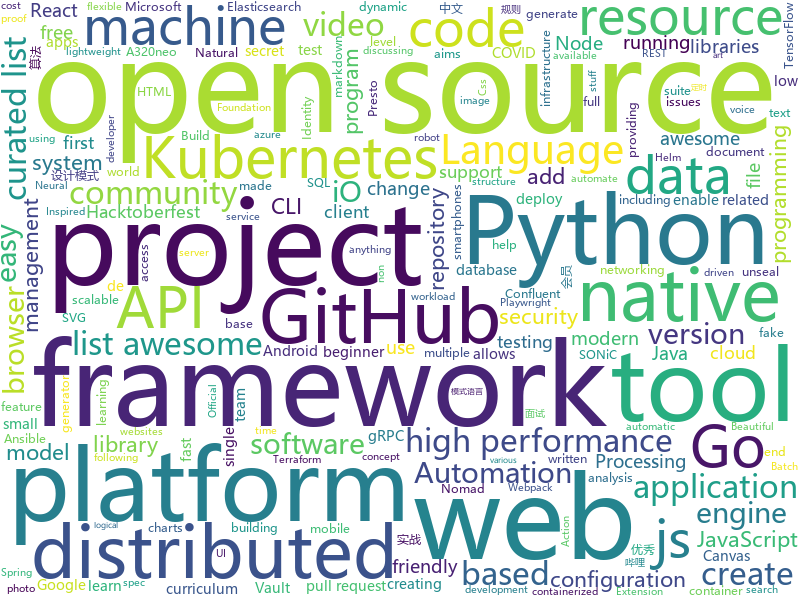

# 2020-10-17
See what the GitHub community is most excited about.

## python
+ [nni](https://github.com/microsoft/nni)(**188 stars today**): An open source AutoML toolkit for automate machine learning lifecycle, including feature engineering, neural architecture search, model compression and hyper-parameter tuning.
+ [GitDorker](https://github.com/obheda12/GitDorker)(**150 stars today**): A Python program to scrape secrets from GitHub through usage of a large repository of dorks.
+ [practical-python](https://github.com/dabeaz-course/practical-python)(**54 stars today**): Practical Python Programming (course by @dabeaz)
+ [ansible-for-devops](https://github.com/geerlingguy/ansible-for-devops)(**132 stars today**): Ansible for DevOps examples.
+ [playwright-python](https://github.com/microsoft/playwright-python)(**113 stars today**): Python version of the Playwright testing and automation library.
+ [pandasgui](https://github.com/adamerose/pandasgui)(**55 stars today**): A GUI for Pandas DataFrames
+ [keras-ncp](https://github.com/mlech26l/keras-ncp)(**52 stars today**): Code repository of the paper Neural circuit policies enabling auditable autonomy published in Nature Machine Intelligence
+ [bpytop](https://github.com/aristocratos/bpytop)(**174 stars today**): Linux/OSX/FreeBSD resource monitor
+ [awesome-python](https://github.com/vinta/awesome-python)(**53 stars today**): A curated list of awesome Python frameworks, libraries, software and resources
+ [spaCy](https://github.com/explosion/spaCy)(**28 stars today**): 💫Industrial-strength Natural Language Processing (NLP) with Python and Cython
+ [manim](https://github.com/3b1b/manim)(**55 stars today**): Animation engine for explanatory math videos
+ [transformers](https://github.com/huggingface/transformers)(**121 stars today**): 🤗Transformers: State-of-the-art Natural Language Processing for Pytorch and TensorFlow 2.0.
+ [insightface](https://github.com/deepinsight/insightface)(**63 stars today**): Face Analysis Project on MXNet
+ [FavFreak](https://github.com/devanshbatham/FavFreak)(**15 stars today**): Making Favicon.ico based Recon Great again !
+ [visidata](https://github.com/saulpw/visidata)(**26 stars today**): A terminal spreadsheet multitool for discovering and arranging data
+ [microk8s](https://github.com/ubuntu/microk8s)(**93 stars today**): MicroK8s is a small, fast, single-package Kubernetes for developers, IoT and edge.
+ [Top2Vec](https://github.com/ddangelov/Top2Vec)(**14 stars today**): Top2Vec learns jointly embedded topic, document and word vectors.
+ [rasa](https://github.com/RasaHQ/rasa)(**9 stars today**): 💬Open source machine learning framework to automate text- and voice-based conversations: NLU, dialogue management, connect to Slack, Facebook, and more - Create chatbots and voice assistants
+ [Anonymous](https://github.com/H1R0GH057/Anonymous)(**13 stars today**): 
+ [airflow](https://github.com/apache/airflow)(**17 stars today**): Apache Airflow - A platform to programmatically author, schedule, and monitor workflows
+ [stylegan2](https://github.com/NVlabs/stylegan2)(**17 stars today**): StyleGAN2 - Official TensorFlow Implementation
+ [youtube-dl](https://github.com/ytdl-org/youtube-dl)(**47 stars today**): Command-line program to download videos from YouTube.com and other video sites
+ [fastapi](https://github.com/tiangolo/fastapi)(**45 stars today**): FastAPI framework, high performance, easy to learn, fast to code, ready for production
+ [cookiecutter-data-science](https://github.com/drivendata/cookiecutter-data-science)(**7 stars today**): A logical, reasonably standardized, but flexible project structure for doing and sharing data science work.
+ [frappe](https://github.com/frappe/frappe)(**3 stars today**): Low Code Open Source Framework in Python and JS

## java
+ [strimzi-kafka-operator](https://github.com/strimzi/strimzi-kafka-operator)(**177 stars today**): Apache Kafka running on Kubernetes
+ [GitHub-Chinese-Top-Charts](https://github.com/kon9chunkit/GitHub-Chinese-Top-Charts)(**71 stars today**): 🇨🇳GitHub中文排行榜，帮助你发现高分优秀中文项目、更高效地吸收国人的优秀经验成果；榜单每周更新一次，敬请关注！
+ [itstack-demo-design](https://github.com/fuzhengwei/itstack-demo-design)(**66 stars today**): 《重学Java设计模式「22个互联网真实案例实战」》技术好就一定能写出好代码吗？不能！再漂亮的马桶放到厨房都略显尴尬！无论是家里装修还是上道开车，只有通过实战才能快速将理论转变为技能。毕竟设计模式也是源于 克里斯托佛·亚历山大 的著作 《建筑模式语言》。
+ [beam](https://github.com/apache/beam)(**6 stars today**): Apache Beam is a unified programming model for Batch and Streaming
+ [Hacktoberfest2020](https://github.com/Cullyege/Hacktoberfest2020)(**5 stars today**): Make your Hacktoberfest 2020 contribution here! Win stickers and a T-shirt on completing 4 pull requests. (Specially for beginners)! :D
+ [seata](https://github.com/seata/seata)(**9 stars today**): 🔥Seata is an easy-to-use, high-performance, open source distributed transaction solution.
+ [sonarqube-community-branch-plugin](https://github.com/mc1arke/sonarqube-community-branch-plugin)(**3 stars today**): A plugin that allows branch analysis and pull request decoration in the Community version of Sonarqube
+ [lucene-solr](https://github.com/apache/lucene-solr)(**4 stars today**): Apache Lucene and Solr open-source search software
+ [presto](https://github.com/prestosql/presto)(**4 stars today**): Home of the community managed version of Presto, the distributed SQL query engine for big data, under the auspices of the Presto Software Foundation.
+ [antlr4](https://github.com/antlr/antlr4)(**10 stars today**): ANTLR (ANother Tool for Language Recognition) is a powerful parser generator for reading, processing, executing, or translating structured text or binary files.
+ [keycloak](https://github.com/keycloak/keycloak)(**10 stars today**): Open Source Identity and Access Management For Modern Applications and Services
+ [cucumber](https://github.com/cucumber/cucumber)(**2 stars today**): Cucumber monorepo - building blocks for Cucumber in various languages
+ [capacitor](https://github.com/ionic-team/capacitor)(**10 stars today**): Build cross-platform Native Progressive Web Apps for iOS, Android, and the Web⚡️
+ [karate](https://github.com/intuit/karate)(**5 stars today**): Test Automation Made Simple
+ [spring-authorization-server](https://github.com/spring-projects-experimental/spring-authorization-server)(**10 stars today**): A community-driven project led by the Spring Security team and is focused on delivering Authorization Server support to the Spring community
+ [OpenBot](https://github.com/intel-isl/OpenBot)(**4 stars today**): OpenBot leverages smartphones as brains for low-cost robots. We have designed a small electric vehicle that costs about $50 and serves as a robot body. Our software stack for Android smartphones supports advanced robotics workloads such as person following and real-time autonomous navigation.
+ [janusgraph](https://github.com/JanusGraph/janusgraph)(**2 stars today**): JanusGraph: an open-source, distributed graph database
+ [testcontainers-java](https://github.com/testcontainers/testcontainers-java)(**5 stars today**): Testcontainers is a Java library that supports JUnit tests, providing lightweight, throwaway instances of common databases, Selenium web browsers, or anything else that can run in a Docker container.
+ [debezium](https://github.com/debezium/debezium)(**3 stars today**): Change data capture for a variety of databases. Please log issues at https://issues.redhat.com/browse/DBZ.
+ [Leaf](https://github.com/Meituan-Dianping/Leaf)(**8 stars today**): Distributed ID Generate Service
+ [grpc-java](https://github.com/grpc/grpc-java)(**4 stars today**): The Java gRPC implementation. HTTP/2 based RPC
+ [burpdeveltraining](https://github.com/doyensec/burpdeveltraining)(**58 stars today**): Material for the training "Developing Burp Suite Extensions – From Manual Testing to Security Automation"
+ [HacktoberFest](https://github.com/tarunsinghofficial/HacktoberFest)(**16 stars today**): Simply add your details and Get a chance to earn a free tshirt!✅
+ [Syberry-Academy-Test-Task-For-Developers](https://github.com/lanavasilieva/Syberry-Academy-Test-Task-For-Developers)(**1 stars today**): 
+ [BILIBILI-HELPER](https://github.com/JunzhouLiu/BILIBILI-HELPER)(**54 stars today**): 利用GitHub Action定时任务实现B站，哔哩哔哩（Bilibili）每日自动投币，签到，银瓜子兑换硬币，领取大会员福利，大会员月底给自己充电等。每天轻松获取65经验值。赶快和我一起成为Lv6吧！

## unknown
+ [Python-programming-exercises](https://github.com/zhiwehu/Python-programming-exercises)(**46 stars today**): 100+ Python challenging programming exercises
+ [project-based-learning](https://github.com/tuvtran/project-based-learning)(**117 stars today**): Curated list of project-based tutorials
+ [security-research](https://github.com/google/security-research)(**21 stars today**): This project hosts security advisories and their accompanying proof-of-concepts related to research conducted at Google which impact non-Google owned code.
+ [awesome-for-beginners](https://github.com/MunGell/awesome-for-beginners)(**50 stars today**): A list of awesome beginners-friendly projects.
+ [awesome-youtubers](https://github.com/JoseDeFreitas/awesome-youtubers)(**208 stars today**): ▶️An awesome list containing awesome YouTubers that teach about technology.
+ [COVID-19](https://github.com/pcm-dpc/COVID-19)(**6 stars today**): COVID-19 Italia - Monitoraggio situazione
+ [design-resources-for-developers](https://github.com/bradtraversy/design-resources-for-developers)(**34 stars today**): Curated list of design and UI resources from stock photos, web templates, CSS frameworks, UI libraries, tools and much more
+ [fucking-algorithm](https://github.com/labuladong/fucking-algorithm)(**208 stars today**): 刷算法全靠套路，认准 labuladong 就够了！English version supported! Crack LeetCode, not only how, but also why.
+ [gustavoguanabara.github.io](https://github.com/gustavoguanabara/gustavoguanabara.github.io)(**34 stars today**): Página do perfil
+ [Best-websites-a-programmer-should-visit](https://github.com/sdmg15/Best-websites-a-programmer-should-visit)(**21 stars today**): 🔗Some useful websites for programmers.
+ [CVE-2020-16947](https://github.com/0neb1n/CVE-2020-16947)(**56 stars today**): PoC of CVE-2020-16947 (Microsoft Outlook RCE vulnerablility)
+ [awesome-mlops](https://github.com/visenger/awesome-mlops)(**119 stars today**): A curated list of references for MLOps
+ [Testnet3-Challenges](https://github.com/Concordium/Testnet3-Challenges)(**31 stars today**): This repo is dedicated to Concordium Incentivized Testnet3.
+ [awesome-cpp](https://github.com/fffaraz/awesome-cpp)(**28 stars today**): A curated list of awesome C++ (or C) frameworks, libraries, resources, and shiny things. Inspired by awesome-... stuff.
+ [Documents](https://github.com/TrustedWebPromotionCouncil/Documents)(**14 stars today**): 
+ [COVID-19](https://github.com/CSSEGISandData/COVID-19)(**20 stars today**): Novel Coronavirus (COVID-19) Cases, provided by JHU CSSE
+ [awesome-actions](https://github.com/sdras/awesome-actions)(**16 stars today**): A curated list of awesome actions to use on GitHub
+ [free-programming-books](https://github.com/EbookFoundation/free-programming-books)(**268 stars today**): 📚Freely available programming books
+ [gpt-3](https://github.com/openai/gpt-3)(**17 stars today**): GPT-3: Language Models are Few-Shot Learners
+ [cloudflare-2020-general-engineering-assignment](https://github.com/cloudflare-hiring/cloudflare-2020-general-engineering-assignment)(**21 stars today**): 
+ [open-source-cs](https://github.com/ForrestKnight/open-source-cs)(**7 stars today**): Video discussing this curriculum:
+ [pix-api](https://github.com/bacen/pix-api)(**5 stars today**): API Pix: O Sistema de Pagamentos Instantâneos do Brasil.
+ [rfcs](https://github.com/npm/rfcs)(**5 stars today**): Public change requests for the npm CLI & associated tooling
+ [open-source-cs-python](https://github.com/ForrestKnight/open-source-cs-python)(**9 stars today**): Video discussing this curriculum:

## javascript
+ [headless-recorder](https://github.com/checkly/headless-recorder)(**905 stars today**): Headless recorder is a Chrome extension that records your browser interactions and generates a Puppeteer or Playwright script.
+ [remote-jobs](https://github.com/remoteintech/remote-jobs)(**162 stars today**): A list of semi to fully remote-friendly companies in tech.
+ [stayaway-app](https://github.com/stayawayinesctec/stayaway-app)(**20 stars today**): Official repository for the STAYAWAY COVID mobile application
+ [FE-Interview](https://github.com/lgwebdream/FE-Interview)(**19 stars today**): 前端面试必备题库，1000+面试真题，Html、Css、JavaScript、Vue、React、Node、TypeScript、Webpack、算法、网络与安全、浏览器
+ [venom](https://github.com/orkestral/venom)(**145 stars today**): Venom is a high-performance system developed with JavaScript to create a bot for WhatsApp
+ [fonos](https://github.com/fonoster/fonos)(**240 stars today**): 🚀An open-source alternative to Twilio.
+ [freeCodeCamp](https://github.com/freeCodeCamp/freeCodeCamp)(**91 stars today**): freeCodeCamp.org's open source codebase and curriculum. Learn to code at home.
+ [vanilla-node-rest-api](https://github.com/bradtraversy/vanilla-node-rest-api)(**26 stars today**): REST API using Node.js without a framework
+ [next.js](https://github.com/vercel/next.js)(**48 stars today**): The React Framework
+ [cube.js](https://github.com/cube-js/cube.js)(**11 stars today**): 📊Cube.js — Open-Source Analytical API Platform
+ [webpack-boilerplate](https://github.com/taniarascia/webpack-boilerplate)(**24 stars today**): 📦‎ A sensible webpack 5 boilerplate.
+ [responsively-app](https://github.com/responsively-org/responsively-app)(**68 stars today**): A modified web browser that helps in responsive web development. A web developer's must have dev-tool.
+ [ios_rule_script](https://github.com/blackmatrix7/ios_rule_script)(**85 stars today**): iOS平台的分流规则、复写规则和一些自动化脚本。
+ [gatsby](https://github.com/gatsbyjs/gatsby)(**25 stars today**): Build blazing fast, modern apps and websites with React
+ [faker.js](https://github.com/Marak/faker.js)(**18 stars today**): generate massive amounts of realistic fake data in Node.js and the browser
+ [classsed-graphql-mern-apollo](https://github.com/hidjou/classsed-graphql-mern-apollo)(**8 stars today**): 
+ [locomotive-scroll](https://github.com/locomotivemtl/locomotive-scroll)(**37 stars today**): 🛤Detection of elements in viewport & smooth scrolling with parallax.
+ [outline](https://github.com/outline/outline)(**11 stars today**): The fastest wiki and knowledge base for growing teams. Beautiful, feature rich, and markdown compatible.
+ [framework7](https://github.com/framework7io/framework7)(**3 stars today**): Full featured HTML framework for building iOS & Android apps
+ [lib-jitsi-meet](https://github.com/jitsi/lib-jitsi-meet)(**2 stars today**): A low-level JS video API that allows adding a completely custom video experience to web apps.
+ [fabric.js](https://github.com/fabricjs/fabric.js)(**11 stars today**): Javascript Canvas Library, SVG-to-Canvas (& canvas-to-SVG) Parser
+ [ember.js](https://github.com/emberjs/ember.js)(**5 stars today**): Ember.js - A JavaScript framework for creating ambitious web applications
+ [react-native-website](https://github.com/facebook/react-native-website)(**3 stars today**): The site and docs for React Native
+ [json-server](https://github.com/typicode/json-server)(**27 stars today**): Get a full fake REST API with zero coding in less than 30 seconds (seriously)
+ [Detox](https://github.com/wix/Detox)(**10 stars today**): Gray box end-to-end testing and automation framework for mobile apps

## html
+ [awfice](https://github.com/zserge/awfice)(**220 stars today**): The world smallest office suite
+ [html-css](https://github.com/gustavoguanabara/html-css)(**246 stars today**): Curso de HTML5 e CSS3
+ [sasinator](https://github.com/Faust-o/sasinator)(**14 stars today**): 
+ [HacktoberFest2020](https://github.com/bajajvinamr/HacktoberFest2020)(**8 stars today**): Make your first PR! ~ A beginner-friendly repository. Add your profile, a blog, or any program under any language (it can be anything from a hello-world program to a complex data structure algorithm) or update the existing one. Just make sure to add the file under the correct directory. Happy hacking!
+ [a32nx](https://github.com/flybywiresim/a32nx)(**8 stars today**): The A32NX Project is a community driven open source project to create a free Airbus A320neo in Microsoft Flight Simulator that is as close to reality as possible. It aims to enhance the default A320neo by improving the systems depth and functionality to bring it up to payware-level, all for free.
+ [website](https://github.com/dotnet-foundation/website)(**8 stars today**): The .NET Foundation's website
+ [javascript](https://github.com/gustavoguanabara/javascript)(**52 stars today**): Curso de JavaScript
+ [us-potus-model](https://github.com/TheEconomist/us-potus-model)(**23 stars today**): Code for a dynamic multilevel Bayesian model to predict US presidential elections. Written in R and Stan.
+ [hacktoberfest](https://github.com/AliceWonderland/hacktoberfest)(**3 stars today**): Participate in Hacktoberfest by contributing to any Open Source project on GitHub! Here is a starter project for first time contributors. #hacktoberfest
+ [cp-helm-charts](https://github.com/confluentinc/cp-helm-charts)(**0 stars today**): The Confluent Platform Helm charts enable you to deploy Confluent Platform services on Kubernetes for development, test, and proof of concept environments.
+ [quickstart-js](https://github.com/firebase/quickstart-js)(**3 stars today**): Firebase Quickstart Samples for Web
+ [ecma262](https://github.com/tc39/ecma262)(**3 stars today**): Status, process, and documents for ECMA-262
+ [OpenClash](https://github.com/vernesong/OpenClash)(**12 stars today**): A Clash Client For OpenWrt
+ [wpt](https://github.com/web-platform-tests/wpt)(**3 stars today**): Test suites for Web platform specs — including WHATWG, W3C, and others
+ [TileScroll](https://github.com/codrops/TileScroll)(**10 stars today**): Scroll animations for image grids using Locomotive Scroll
+ [Poke-Dex](https://github.com/AM1CODES/Poke-Dex)(**4 stars today**): This is a small webpage that allows user to add their favourite Pokémons! This project aims to help people in creating their first pull requests and participating in Hacktoberfest 2020.
+ [partner-contact](https://github.com/OCA/partner-contact)(**0 stars today**): Odoo Partner and Contact related addons
+ [Learn-Coding](https://github.com/SpooderManEXE/Learn-Coding)(**3 stars today**): Don't forget to give me a⭐️
+ [helm-charts](https://github.com/prometheus-community/helm-charts)(**3 stars today**): Prometheus community Helm charts
+ [awesome-angular](https://github.com/PatrickJS/awesome-angular)(**3 stars today**): 📄A curated list of awesome Angular resources
+ [html](https://github.com/whatwg/html)(**1 stars today**): HTML Standard
+ [cloud_haiku](https://github.com/do-community/cloud_haiku)(**0 stars today**): Community-made poetry about infrastructure
+ [calico](https://github.com/projectcalico/calico)(**2 stars today**): Cloud native networking and network security
+ [ansible-os-hardening](https://github.com/dev-sec/ansible-os-hardening)(**2 stars today**): This Ansible role provides numerous security-related configurations, providing all-round base protection.
+ [SONiC](https://github.com/Azure/SONiC)(**2 stars today**): Landing page for Software for Open Networking in the Cloud (SONiC) - http://azure.github.io/SONiC/

## go
+ [waypoint](https://github.com/hashicorp/waypoint)(**487 stars today**): A tool to build, deploy, and release any application on any platform.
+ [boundary](https://github.com/hashicorp/boundary)(**308 stars today**): Boundary enables identity-based access management for dynamic infrastructure.
+ [photoprism](https://github.com/photoprism/photoprism)(**28 stars today**): Personal Photo Management powered by Go and Google TensorFlow
+ [temporal](https://github.com/temporalio/temporal)(**70 stars today**): Temporal service and CLI
+ [runc](https://github.com/opencontainers/runc)(**7 stars today**): CLI tool for spawning and running containers according to the OCI specification
+ [glow](https://github.com/charmbracelet/glow)(**95 stars today**): Render markdown on the CLI, with pizzazz! 💅🏻
+ [grpc-gateway](https://github.com/grpc-ecosystem/grpc-gateway)(**53 stars today**): gRPC to JSON proxy generator following the gRPC HTTP spec
+ [fiber](https://github.com/gofiber/fiber)(**45 stars today**): ⚡️Fiber is an Express inspired web framework written in Go with☕️
+ [elastic](https://github.com/olivere/elastic)(**6 stars today**): Elasticsearch client for Go.
+ [argo](https://github.com/argoproj/argo)(**10 stars today**): Argo Workflows: Get stuff done with Kubernetes.
+ [minio](https://github.com/minio/minio)(**13 stars today**): High Performance, Kubernetes Native Object Storage
+ [cockroach](https://github.com/cockroachdb/cockroach)(**13 stars today**): CockroachDB - the open source, cloud-native distributed SQL database.
+ [go-diagrams](https://github.com/blushft/go-diagrams)(**46 stars today**): Create beautiful system diagrams with Go
+ [cobra](https://github.com/spf13/cobra)(**16 stars today**): A Commander for modern Go CLI interactions
+ [cadence](https://github.com/uber/cadence)(**20 stars today**): Cadence is a distributed, scalable, durable, and highly available orchestration engine to execute asynchronous long-running business logic in a scalable and resilient way.
+ [bank-vaults](https://github.com/banzaicloud/bank-vaults)(**7 stars today**): A Vault swiss-army knife: a K8s operator, Go client with automatic token renewal, automatic configuration, multiple unseal options and more. A CLI tool to init, unseal and configure Vault (auth methods, secret engines). Direct secret injection into Pods.
+ [nomad](https://github.com/hashicorp/nomad)(**10 stars today**): Nomad is an easy-to-use, flexible, and performant workload orchestrator that can deploy a mix of microservice, batch, containerized, and non-containerized applications. Nomad is easy to operate and scale and has native Consul and Vault integrations.
+ [nats-server](https://github.com/nats-io/nats-server)(**6 stars today**): High-Performance server for NATS, the cloud native messaging system.
+ [go-cache](https://github.com/patrickmn/go-cache)(**3 stars today**): An in-memory key:value store/cache (similar to Memcached) library for Go, suitable for single-machine applications.
+ [terraform](https://github.com/hashicorp/terraform)(**27 stars today**): Terraform enables you to safely and predictably create, change, and improve infrastructure. It is an open source tool that codifies APIs into declarative configuration files that can be shared amongst team members, treated as code, edited, reviewed, and versioned.
+ [terraform-provider-azurerm](https://github.com/terraform-providers/terraform-provider-azurerm)(**3 stars today**): Terraform provider for Azure Resource Manager
+ [gvisor](https://github.com/google/gvisor)(**8 stars today**): Application Kernel for Containers
+ [argo-cd](https://github.com/argoproj/argo-cd)(**7 stars today**): Declarative continuous deployment for Kubernetes.
+ [beats](https://github.com/elastic/beats)(**4 stars today**): 🐠Beats - Lightweight shippers for Elasticsearch & Logstash
+ [packer](https://github.com/hashicorp/packer)(**8 stars today**): Packer is a tool for creating identical machine images for multiple platforms from a single source configuration.

## WordCloud

