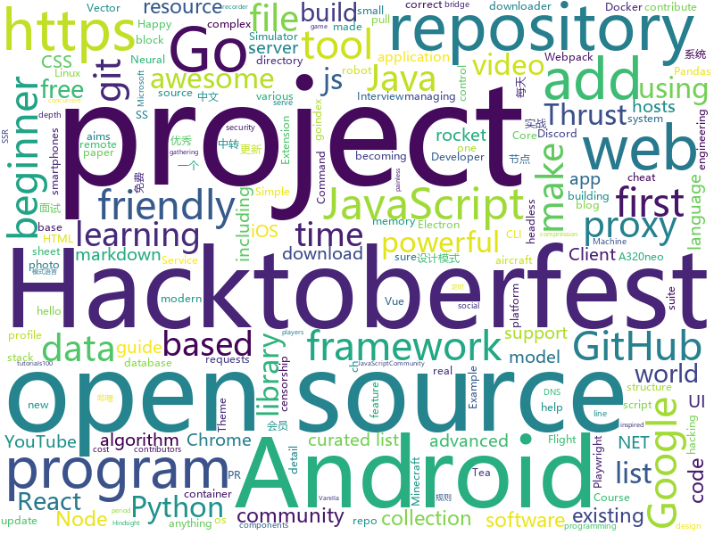

# 2020-10-18
See what the GitHub community is most excited about.

## python
+ [nni](https://github.com/microsoft/nni)(**183 stars today**): An open source AutoML toolkit for automate machine learning lifecycle, including feature engineering, neural architecture search, model compression and hyper-parameter tuning.
+ [Python](https://github.com/TheAlgorithms/Python)(**104 stars today**): All Algorithms implemented in Python
+ [GitDorker](https://github.com/obheda12/GitDorker)(**119 stars today**): A Python program to scrape secrets from GitHub through usage of a large repository of dorks.
+ [pandasgui](https://github.com/adamerose/pandasgui)(**74 stars today**): A GUI for Pandas DataFrames
+ [practical-python](https://github.com/dabeaz-course/practical-python)(**172 stars today**): Practical Python Programming (course by @dabeaz)
+ [ansible-for-devops](https://github.com/geerlingguy/ansible-for-devops)(**108 stars today**): Ansible for DevOps examples.
+ [zipline](https://github.com/quantopian/zipline)(**12 stars today**): Zipline, a Pythonic Algorithmic Trading Library
+ [d2l-vn](https://github.com/aivivn/d2l-vn)(**5 stars today**): Bản dịch cuốn sách "Dive into Deep Learning"
+ [faceswap](https://github.com/deepfakes/faceswap)(**25 stars today**): Deepfakes Software For All
+ [Real_Time_Image_Animation](https://github.com/anandpawara/Real_Time_Image_Animation)(**18 stars today**): The Project is real time application in opencv using first order model
+ [keras-ncp](https://github.com/mlech26l/keras-ncp)(**62 stars today**): Code repository of the paper Neural circuit policies enabling auditable autonomy published in Nature Machine Intelligence
+ [mindsdb](https://github.com/mindsdb/mindsdb)(**7 stars today**): Predictive AI layer for existing databases.
+ [playwright-python](https://github.com/microsoft/playwright-python)(**93 stars today**): Python version of the Playwright testing and automation library.
+ [sherlock](https://github.com/sherlock-project/sherlock)(**24 stars today**): 🔎Hunt down social media accounts by username across social networks
+ [jukebox](https://github.com/openai/jukebox)(**15 stars today**): Code for the paper "Jukebox: A Generative Model for Music"
+ [gibMacOS](https://github.com/corpnewt/gibMacOS)(**13 stars today**): Py2/py3 script that can download macOS components direct from Apple
+ [deep-learning-for-image-processing](https://github.com/WZMIAOMIAO/deep-learning-for-image-processing)(**30 stars today**): deep learning for image processing including classification and object-detection etc.
+ [bpytop](https://github.com/aristocratos/bpytop)(**132 stars today**): Linux/OSX/FreeBSD resource monitor
+ [full-stack-fastapi-postgresql](https://github.com/tiangolo/full-stack-fastapi-postgresql)(**16 stars today**): Full stack, modern web application generator. Using FastAPI, PostgreSQL as database, Docker, automatic HTTPS and more.
+ [spotify-downloader](https://github.com/spotDL/spotify-downloader)(**12 stars today**): Download Spotify playlists from YouTube with albumart and metadata
+ [yfinance](https://github.com/ranaroussi/yfinance)(**11 stars today**): Yahoo! Finance market data downloader (+faster Pandas Datareader)
+ [youtube-dl](https://github.com/ytdl-org/youtube-dl)(**42 stars today**): Command-line program to download videos from YouTube.com and other video sites
+ [pihello](https://github.com/pavelgar/pihello)(**13 stars today**): Fetch and display Pi-hole statistics in terminal
+ [Hacktoberfest-2020](https://github.com/Ishaan28malik/Hacktoberfest-2020)(**12 stars today**): Make this Hacktoberfest a learning period and contribute to Great Open Source Projects.
+ [volatility](https://github.com/volatilityfoundation/volatility)(**3 stars today**): An advanced memory forensics framework

## java
+ [itstack-demo-design](https://github.com/fuzhengwei/itstack-demo-design)(**49 stars today**): 《重学Java设计模式「22个互联网真实案例实战」》技术好就一定能写出好代码吗？不能！再漂亮的马桶放到厨房都略显尴尬！无论是家里装修还是上道开车，只有通过实战才能快速将理论转变为技能。毕竟设计模式也是源于 克里斯托佛·亚历山大 的著作 《建筑模式语言》。
+ [igniter](https://github.com/trojan-gfw/igniter)(**7 stars today**): A trojan client for Android (UNDER CONSTRUCTION).
+ [BILIBILI-HELPER](https://github.com/JunzhouLiu/BILIBILI-HELPER)(**62 stars today**): 利用GitHub Action定时任务实现B站，哔哩哔哩（Bilibili）每日自动投币，签到，银瓜子兑换硬币，领取大会员福利，大会员月底给自己充电等。每天轻松获取65经验值。赶快和我一起成为Lv6吧！
+ [NewPipe](https://github.com/TeamNewPipe/NewPipe)(**23 stars today**): A libre lightweight streaming front-end for Android.
+ [Hacktoberfest2020](https://github.com/Cullyege/Hacktoberfest2020)(**7 stars today**): Make your Hacktoberfest 2020 contribution here! Win stickers and a T-shirt on completing 4 pull requests. (Specially for beginners)! :D
+ [hazelcast](https://github.com/hazelcast/hazelcast)(**3 stars today**): Open Source In-Memory Data Grid
+ [termux-app](https://github.com/termux/termux-app)(**10 stars today**): Android terminal and Linux environment - app repository.
+ [OpenBot](https://github.com/intel-isl/OpenBot)(**8 stars today**): OpenBot leverages smartphones as brains for low-cost robots. We have designed a small electric vehicle that costs about $50 and serves as a robot body. Our software stack for Android smartphones supports advanced robotics workloads such as person following and real-time autonomous navigation.
+ [AntennaPod](https://github.com/AntennaPod/AntennaPod)(**2 stars today**): A podcast manager for Android
+ [Hacktoberfest2020_](https://github.com/kaustubhgupta/Hacktoberfest2020_)(**4 stars today**): Use this repository to contribute quality code in languages you are comfortable with during the Hacktoberfest event. Do not make this repo act like a source of +1
+ [forwordpanel](https://github.com/xiaoli123/forwordpanel)(**19 stars today**): 开源中转面板,中转系统
+ [spring-boot-admin](https://github.com/codecentric/spring-boot-admin)(**5 stars today**): Admin UI for administration of spring boot applications
+ [quickstart-android](https://github.com/firebase/quickstart-android)(**9 stars today**): Firebase Quickstart Samples for Android
+ [cucumber](https://github.com/cucumber/cucumber)(**2 stars today**): Cucumber monorepo - building blocks for Cucumber in various languages
+ [CoreNLP](https://github.com/stanfordnlp/CoreNLP)(**4 stars today**): Stanford CoreNLP: A Java suite of core NLP tools.
+ [ghidra](https://github.com/NationalSecurityAgency/ghidra)(**11 stars today**): Ghidra is a software reverse engineering (SRE) framework
+ [MinecraftForge](https://github.com/MinecraftForge/MinecraftForge)(**5 stars today**): Modifications to the Minecraft base files to assist in compatibility between mods.
+ [libgdx](https://github.com/libgdx/libgdx)(**7 stars today**): Desktop/Android/HTML5/iOS Java game development framework
+ [GitHub-Chinese-Top-Charts](https://github.com/kon9chunkit/GitHub-Chinese-Top-Charts)(**32 stars today**): 🇨🇳GitHub中文排行榜，帮助你发现高分优秀中文项目、更高效地吸收国人的优秀经验成果；榜单每周更新一次，敬请关注！
+ [MCinaBox](https://github.com/AOF-Dev/MCinaBox)(**5 stars today**): MCinaBox - A Minecraft Java Edition Launcher on Android
+ [android-interview-questions](https://github.com/MindorksOpenSource/android-interview-questions)(**4 stars today**): Your Cheat Sheet For Android Interview - Android Interview Questions
+ [hadoop](https://github.com/apache/hadoop)(**4 stars today**): Apache Hadoop
+ [baritone](https://github.com/cabaletta/baritone)(**9 stars today**): google maps for block game
+ [Anki-Android](https://github.com/ankidroid/Anki-Android)(**5 stars today**): AnkiDroid: Anki on Android
+ [Signal-Android](https://github.com/signalapp/Signal-Android)(**10 stars today**): A private messenger for Android.

## unknown
+ [cloudflare-2020-general-engineering-assignment](https://github.com/cloudflare-hiring/cloudflare-2020-general-engineering-assignment)(**27 stars today**): 
+ [design-resources-for-developers](https://github.com/bradtraversy/design-resources-for-developers)(**41 stars today**): Curated list of design and UI resources from stock photos, web templates, CSS frameworks, UI libraries, tools and much more
+ [project-based-learning](https://github.com/tuvtran/project-based-learning)(**129 stars today**): Curated list of project-based tutorials
+ [Python-programming-exercises](https://github.com/zhiwehu/Python-programming-exercises)(**77 stars today**): 100+ Python challenging programming exercises
+ [awesome-for-beginners](https://github.com/MunGell/awesome-for-beginners)(**27 stars today**): A list of awesome beginners-friendly projects.
+ [Best-websites-a-programmer-should-visit](https://github.com/sdmg15/Best-websites-a-programmer-should-visit)(**16 stars today**): 🔗Some useful websites for programmers.
+ [Awesome-Hacking](https://github.com/Hack-with-Github/Awesome-Hacking)(**25 stars today**): A collection of various awesome lists for hackers, pentesters and security researchers
+ [AspNetCore-Developer-Roadmap](https://github.com/MoienTajik/AspNetCore-Developer-Roadmap)(**213 stars today**): Roadmap to becoming an ASP.NET Core developer in 2021
+ [open-source-cs](https://github.com/ForrestKnight/open-source-cs)(**17 stars today**): Video discussing this curriculum:
+ [cloudflare-2020-systems-engineering-assignment](https://github.com/cloudflare-hiring/cloudflare-2020-systems-engineering-assignment)(**8 stars today**): 
+ [imersao-dados-2-2020](https://github.com/alura-cursos/imersao-dados-2-2020)(**43 stars today**): 
+ [design-patterns-for-humans](https://github.com/kamranahmedse/design-patterns-for-humans)(**18 stars today**): An ultra-simplified explanation to design patterns
+ [NewGrad-2021](https://github.com/Pitt-CSC/NewGrad-2021)(**25 stars today**): A collection of New Grad full time roles in SWE, Quant, and PM.
+ [gustavoguanabara.github.io](https://github.com/gustavoguanabara/gustavoguanabara.github.io)(**35 stars today**): Página do perfil
+ [awesome-hacktoberfest-2020](https://github.com/OtacilioN/awesome-hacktoberfest-2020)(**9 stars today**): A curated list of awesome Hacktoberfest 2020 repositories, guides and resources
+ [hosts](https://github.com/googlehosts/hosts)(**7 stars today**): 镜像：https://scaffrey.coding.net/p/hosts/git / https://git.qvq.network/googlehosts/hosts
+ [bootcamp-gostack-desafios](https://github.com/rocketseat-education/bootcamp-gostack-desafios)(**7 stars today**): Repositório contendo todos os desafios dos módulos do Bootcamp Gostack
+ [Share-SSR-V2ray](https://github.com/selierlin/Share-SSR-V2ray)(**5 stars today**): 🃏Free SS/SSR/V2ray 免费分享节点账号信息网站
+ [You-Dont-Know-JS](https://github.com/getify/You-Dont-Know-JS)(**48 stars today**): A book series on JavaScript. @YDKJS on twitter.
+ [CV-pretrained-model](https://github.com/balavenkatesh3322/CV-pretrained-model)(**17 stars today**): A collection of computer vision pre-trained models.
+ [discordjs-bot-guide](https://github.com/AnIdiotsGuide/discordjs-bot-guide)(**4 stars today**): The basic new coder friendly "idiot's guide", Created by Hindsight#2020 and maintained by the community.
+ [security-research](https://github.com/google/security-research)(**42 stars today**): This project hosts security advisories and their accompanying proof-of-concepts related to research conducted at Google which impact non-Google owned code.
+ [anes-repository](https://github.com/gamedilong/anes-repository)(**50 stars today**): vscode插件小霸王remote仓库
+ [FIPs](https://github.com/filecoin-project/FIPs)(**2 stars today**): The Filecoin Improvement Proposal repository
+ [Modeling-TVCd-Rocket-in-Simulink](https://github.com/mathworks/Modeling-TVCd-Rocket-in-Simulink)(**7 stars today**): Code in this repository is discussed in this BPS.Space YouTube video on modeling a thrust vector controlled rocket in Simulink. Thrust Vectoring or Thrust Vector control is the ability of an aircraft or a rocket's propulsion system to manipulate the direction of its thrust to control the rocket or aircrafts attitude or angular velocity.

## javascript
+ [stayaway-app](https://github.com/stayawayinesctec/stayaway-app)(**29 stars today**): Official repository for the STAYAWAY COVID mobile application
+ [remote-jobs](https://github.com/remoteintech/remote-jobs)(**410 stars today**): A list of semi to fully remote-friendly companies in tech.
+ [ios_rule_script](https://github.com/blackmatrix7/ios_rule_script)(**53 stars today**): iOS平台的分流规则、复写规则和一些自动化脚本。
+ [headless-recorder](https://github.com/checkly/headless-recorder)(**595 stars today**): Headless recorder is a Chrome extension that records your browser interactions and generates a Puppeteer or Playwright script.
+ [discord.js](https://github.com/discordjs/discord.js)(**13 stars today**): A powerful JavaScript library for interacting with the Discord API
+ [outline](https://github.com/outline/outline)(**10 stars today**): The fastest wiki and knowledge base for growing teams. Beautiful, feature rich, and markdown compatible.
+ [RSSHub](https://github.com/DIYgod/RSSHub)(**15 stars today**): 🍰Everything is RSSible
+ [opensource.guide](https://github.com/github/opensource.guide)(**9 stars today**): 📚Community guides for open source creators
+ [classsed-graphql-mern-apollo](https://github.com/hidjou/classsed-graphql-mern-apollo)(**5 stars today**): 
+ [Hacktoberfest-2020](https://github.com/OpenSourceTogether/Hacktoberfest-2020)(**22 stars today**): Welcome to Open-source! Simply add your details to contributors | Repo for Hacktoberfest 2020✅
+ [fullstack-course4](https://github.com/jhu-ep-coursera/fullstack-course4)(**10 stars today**): Example code for HTML, CSS, and Javascript for Web Developers Coursera Course
+ [FE-Interview](https://github.com/lgwebdream/FE-Interview)(**39 stars today**): 前端面试必备题库，1000+面试真题，Html、Css、JavaScript、Vue、React、Node、TypeScript、Webpack、算法、网络与安全、浏览器
+ [zhaopp](https://github.com/gdtool/zhaopp)(**67 stars today**): 一个Google Drive搜索引擎 https://GeZhong.vip
+ [Ghost](https://github.com/TryGhost/Ghost)(**19 stars today**): 👻The #1 headless Node.js CMS for professional publishing
+ [Hacktoberfest](https://github.com/acmbvp/Hacktoberfest)(**6 stars today**): Make your first PR! ~ A beginner-friendly repository made specifically for open source beginners. Add your profile, a blog or any program under any language (it can be anything from a hello-world program to a complex data structure algorithm) or update the existing one. Just make sure to add the file under the correct directory. Happy hacking!
+ [fspackages](https://github.com/Working-Title-MSFS-Mods/fspackages)(**12 stars today**): Working Title FS Packages
+ [react-developer-roadmap](https://github.com/adam-golab/react-developer-roadmap)(**39 stars today**): Roadmap to becoming a React developer
+ [vanilla-node-rest-api](https://github.com/bradtraversy/vanilla-node-rest-api)(**14 stars today**): REST API using Node.js without a framework
+ [shields](https://github.com/badges/shields)(**12 stars today**): Concise, consistent, and legible badges in SVG and raster format
+ [zigbee2mqtt](https://github.com/Koenkk/zigbee2mqtt)(**7 stars today**): Zigbee🐝to MQTT bridge🌉, get rid of your proprietary Zigbee bridges🔨
+ [goindex-theme-acrou](https://github.com/Aicirou/goindex-theme-acrou)(**6 stars today**): This is a goindex theme.一个goindex的扩展主题。
+ [inertia](https://github.com/inertiajs/inertia)(**7 stars today**): Inertia.js lets you quickly build modern single-page React, Vue and Svelte apps using classic server-side routing and controllers.
+ [nginx-proxy-manager](https://github.com/jc21/nginx-proxy-manager)(**9 stars today**): Docker container for managing Nginx proxy hosts with a simple, powerful interface
+ [Chrome-Extension_SpigotNotifier](https://github.com/mrk-9/Chrome-Extension_SpigotNotifier)(**2 stars today**): Chrome Extension, javascript, Chrome Web store: https://chrome.google.com/webstore/detail/spigot-notifier/dpkibifcklglomemgflhamcdohfobfpd
+ [webpack-boilerplate](https://github.com/taniarascia/webpack-boilerplate)(**31 stars today**): 📦‎ A sensible webpack 5 boilerplate.

## html
+ [hacktoberfest](https://github.com/AliceWonderland/hacktoberfest)(**5 stars today**): Participate in Hacktoberfest by contributing to any Open Source project on GitHub! Here is a starter project for first time contributors. #hacktoberfest
+ [HacktoberFest2020](https://github.com/bajajvinamr/HacktoberFest2020)(**15 stars today**): Make your first PR! ~ A beginner-friendly repository. Add your profile, a blog, or any program under any language (it can be anything from a hello-world program to a complex data structure algorithm) or update the existing one. Just make sure to add the file under the correct directory. Happy hacking!
+ [training-kit](https://github.com/github/training-kit)(**11 stars today**): Open source cheat sheets for Git and GitHub
+ [Keiko-Corp](https://github.com/zero-to-mastery/Keiko-Corp)(**2 stars today**): HTML challenge for Hacktoberfest 2020
+ [node-ytdl-core](https://github.com/fent/node-ytdl-core)(**3 stars today**): YouTube video downloader in javascript.
+ [zphisher](https://github.com/htr-tech/zphisher)(**4 stars today**): Automated Phishing Tool
+ [k3s-ansible](https://github.com/rancher/k3s-ansible)(**2 stars today**): 
+ [electron-api-demos](https://github.com/electron/electron-api-demos)(**8 stars today**): Explore the Electron APIs
+ [OpenClash](https://github.com/vernesong/OpenClash)(**9 stars today**): A Clash Client For OpenWrt
+ [TinDog-Start](https://github.com/londonappbrewery/TinDog-Start)(**3 stars today**): 
+ [javascript](https://github.com/gustavoguanabara/javascript)(**32 stars today**): Curso de JavaScript
+ [cloud_haiku](https://github.com/do-community/cloud_haiku)(**1 stars today**): Community-made poetry about infrastructure
+ [hugo-PaperMod](https://github.com/adityatelange/hugo-PaperMod)(**5 stars today**): SSG Hugo | Theme - PaperMod
+ [awesome-piracy](https://github.com/Igglybuff/awesome-piracy)(**13 stars today**): A curated list of awesome warez and piracy links
+ [ISASTM](https://github.com/Manawyrm/ISASTM)(**9 stars today**): STM32-based ISA-over-USB-adapter
+ [ru.javascript.info](https://github.com/javascript-tutorial/ru.javascript.info)(**4 stars today**): Современный учебник JavaScript
+ [urban-octo-telegram](https://github.com/coding-boot-camp/urban-octo-telegram)(**0 stars today**): 
+ [a32nx](https://github.com/flybywiresim/a32nx)(**21 stars today**): The A32NX Project is a community driven open source project to create a free Airbus A320neo in Microsoft Flight Simulator that is as close to reality as possible. It aims to enhance the default A320neo by improving the systems depth and functionality to bring it up to payware-level, all for free.
+ [JavaScript30](https://github.com/wesbos/JavaScript30)(**12 stars today**): 30 Day Vanilla JS Challenge
+ [wpt](https://github.com/web-platform-tests/wpt)(**1 stars today**): Test suites for Web platform specs — including WHATWG, W3C, and others
+ [node.umelabs.dev](https://github.com/umelabs/node.umelabs.dev)(**7 stars today**): 每天20:00点更新免费SS/SSR节点
+ [B787-XE](https://github.com/lmk02/B787-XE)(**6 stars today**): A modification of the Microsoft Flight Simulator 2020 787-10
+ [website](https://github.com/dotnet-foundation/website)(**8 stars today**): The .NET Foundation's website
+ [awfice](https://github.com/zserge/awfice)(**114 stars today**): The world smallest office suite
+ [Poke-Dex](https://github.com/AM1CODES/Poke-Dex)(**6 stars today**): This is a small webpage that allows user to add their favourite Pokémons! This project aims to help people in creating their first pull requests and participating in Hacktoberfest 2020.

## go
+ [glow](https://github.com/charmbracelet/glow)(**777 stars today**): Render markdown on the CLI, with pizzazz! 💅🏻
+ [waypoint](https://github.com/hashicorp/waypoint)(**430 stars today**): A tool to build, deploy, and release any application on any platform.
+ [fiber](https://github.com/gofiber/fiber)(**41 stars today**): ⚡️Fiber is an Express inspired web framework written in Go with☕️
+ [glamour](https://github.com/charmbracelet/glamour)(**20 stars today**): Stylesheet-based markdown rendering for your CLI apps 💇🏻‍♀️
+ [charm](https://github.com/charmbracelet/charm)(**18 stars today**): The Charm Tool and Library🌟
+ [go-password-validator](https://github.com/lane-c-wagner/go-password-validator)(**19 stars today**): Validate the Strength of a Password in Go
+ [temporal](https://github.com/temporalio/temporal)(**39 stars today**): Temporal service and CLI
+ [bubbles](https://github.com/charmbracelet/bubbles)(**28 stars today**): TUI components for Bubble Tea🧁
+ [PhoneInfoga](https://github.com/sundowndev/PhoneInfoga)(**3 stars today**): Advanced information gathering & OSINT framework for phone numbers
+ [clash](https://github.com/Dreamacro/clash)(**25 stars today**): A rule-based tunnel in Go.
+ [Cloudreve](https://github.com/cloudreve/Cloudreve)(**15 stars today**): 🌩支持多家云存储的云盘系统 (A project helps you build your own cloud in minutes)
+ [amongusdiscord](https://github.com/denverquane/amongusdiscord)(**11 stars today**): Discord Bot to automute Among Us players at round transitions, in conjunction with https://github.com/denverquane/amonguscapture
+ [photoprism](https://github.com/photoprism/photoprism)(**23 stars today**): Personal Photo Management powered by Go and Google TensorFlow
+ [dnscrypt-proxy](https://github.com/DNSCrypt/dnscrypt-proxy)(**7 stars today**): dnscrypt-proxy 2 - A flexible DNS proxy, with support for encrypted DNS protocols.
+ [buildkit](https://github.com/moby/buildkit)(**10 stars today**): concurrent, cache-efficient, and Dockerfile-agnostic builder toolkit
+ [podman](https://github.com/containers/podman)(**39 stars today**): Podman: A tool for managing OCI containers and pods
+ [gohalt](https://github.com/1pkg/gohalt)(**66 stars today**): Gohalt👮‍♀🛑: Fast; Simple; Powerful; Go Throttler library
+ [gitea](https://github.com/go-gitea/gitea)(**18 stars today**): Git with a cup of tea, painless self-hosted git service
+ [client](https://github.com/keybase/client)(**10 stars today**): Keybase Go Library, Client, Service, OS X, iOS, Android, Electron
+ [fzf](https://github.com/junegunn/fzf)(**22 stars today**): 🌸A command-line fuzzy finder
+ [mux](https://github.com/gorilla/mux)(**13 stars today**): A powerful HTTP router and URL matcher for building Go web servers with🦍
+ [statik](https://github.com/rakyll/statik)(**3 stars today**): Embed files into a Go executable
+ [lantern](https://github.com/getlantern/lantern)(**16 stars today**): Lantern官方版本下载 蓝灯 翻墙 代理 科学上网 外网 加速器 梯子 路由 lantern proxy vpn censorship-circumvention censorship gfw accelerator
+ [Amass](https://github.com/OWASP/Amass)(**10 stars today**): In-depth Attack Surface Mapping and Asset Discovery
+ [sftpgo](https://github.com/drakkan/sftpgo)(**14 stars today**): Fully featured and highly configurable SFTP server with optional FTP/S and WebDAV support. It can serve local filesystem, S3, GCS

## WordCloud

