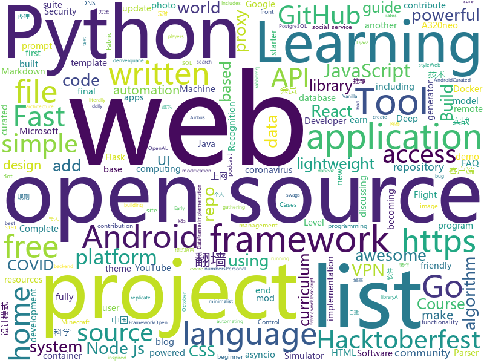

# 2020-10-20
See what the GitHub community is most excited about.

## python
+ [Python](https://github.com/TheAlgorithms/Python)(**229 stars today**): All Algorithms implemented in Python
+ [practical-python](https://github.com/dabeaz-course/practical-python)(**137 stars today**): Practical Python Programming (course by @dabeaz)
+ [nni](https://github.com/microsoft/nni)(**222 stars today**): An open source AutoML toolkit for automate machine learning lifecycle, including feature engineering, neural architecture search, model compression and hyper-parameter tuning.
+ [pandasgui](https://github.com/adamerose/pandasgui)(**93 stars today**): A GUI for Pandas DataFrames
+ [lambda-networks](https://github.com/lucidrains/lambda-networks)(**208 stars today**): Implementation of LambdaNetworks, a new approach to image recognition that reaches SOTA with less compute
+ [system-design-primer](https://github.com/donnemartin/system-design-primer)(**113 stars today**): Learn how to design large-scale systems. Prep for the system design interview. Includes Anki flashcards.
+ [Instagram](https://github.com/Pure-L0G1C/Instagram)(**4 stars today**): Bruteforce attack for Instagram
+ [faceswap](https://github.com/deepfakes/faceswap)(**32 stars today**): Deepfakes Software For All
+ [full-stack-fastapi-postgresql](https://github.com/tiangolo/full-stack-fastapi-postgresql)(**15 stars today**): Full stack, modern web application generator. Using FastAPI, PostgreSQL as database, Docker, automatic HTTPS and more.
+ [numpy](https://github.com/numpy/numpy)(**13 stars today**): The fundamental package for scientific computing with Python.
+ [sherlock](https://github.com/sherlock-project/sherlock)(**13 stars today**): 🔎Hunt down social media accounts by username across social networks
+ [core](https://github.com/home-assistant/core)(**26 stars today**): 🏡Open source home automation that puts local control and privacy first
+ [microblog](https://github.com/miguelgrinberg/microblog)(**1 stars today**): A microblogging web application written in Python and Flask that I developed as part of my Flask Mega-Tutorial series.
+ [keras](https://github.com/keras-team/keras)(**15 stars today**): Deep Learning for humans
+ [wifiphisher](https://github.com/wifiphisher/wifiphisher)(**2 stars today**): The Rogue Access Point Framework
+ [kivy](https://github.com/kivy/kivy)(**11 stars today**): Open source UI framework written in Python, running on Windows, Linux, macOS, Android and iOS
+ [public-apis](https://github.com/public-apis/public-apis)(**74 stars today**): A collective list of free APIs for use in software and web development.
+ [Anonymous](https://github.com/H1R0GH057/Anonymous)(**4 stars today**): 
+ [zipline](https://github.com/quantopian/zipline)(**11 stars today**): Zipline, a Pythonic Algorithmic Trading Library
+ [covid-19-data](https://github.com/owid/covid-19-data)(**7 stars today**): Data on COVID-19 (coronavirus) confirmed cases, deaths, and tests • All countries • Updated daily by Our World in Data
+ [python-telegram-bot](https://github.com/python-telegram-bot/python-telegram-bot)(**10 stars today**): We have made you a wrapper you can't refuse
+ [aiogram](https://github.com/aiogram/aiogram)(**3 stars today**): Is a pretty simple and fully asynchronous framework for Telegram Bot API written in Python 3.7 with asyncio and aiohttp.
+ [SonoffLAN](https://github.com/AlexxIT/SonoffLAN)(**2 stars today**): Control Sonoff Devices with eWeLink (original) firmware over LAN and/or Cloud from Home Assistant
+ [sanctuary-zero](https://github.com/t0xic0der/sanctuary-zero)(**2 stars today**): A command-line bound implementation of secure synchronous lightweight chatroom with zero logging and total transience built using WebSockets, Fernet Cryptography, Asyncio and Prompt Toolkit
+ [cython](https://github.com/cython/cython)(**13 stars today**): The most widely used Python to C compiler

## java
+ [itstack-demo-design](https://github.com/fuzhengwei/itstack-demo-design)(**234 stars today**): 《重学Java设计模式「22个互联网真实案例实战」》技术好就一定能写出好代码吗？不能！再漂亮的马桶放到厨房都略显尴尬！无论是家里装修还是上道开车，只有通过实战才能快速将理论转变为技能。毕竟设计模式也是源于 克里斯托佛·亚历山大 的著作 《建筑模式语言》。
+ [BILIBILI-HELPER](https://github.com/JunzhouLiu/BILIBILI-HELPER)(**120 stars today**): 利用GitHub Action定时任务实现B站，哔哩哔哩（Bilibili）每日自动投币，签到，银瓜子兑换硬币，领取大会员福利，大会员月底给自己充电等。每天轻松获取65经验值。赶快和我一起成为Lv6吧！
+ [SmartTubeNext](https://github.com/yuliskov/SmartTubeNext)(**29 stars today**): Better YouTube experience on Android TV
+ [Algorithms](https://github.com/williamfiset/Algorithms)(**19 stars today**): A collection of algorithms and data structures
+ [liquibase](https://github.com/liquibase/liquibase)(**9 stars today**): Main Liquibase Source
+ [Hacktoberfest2020_](https://github.com/kaustubhgupta/Hacktoberfest2020_)(**0 stars today**): Use this repository to contribute quality code in languages you are comfortable with during the Hacktoberfest event. Do not make this repo act like a source of +1
+ [fabric](https://github.com/FabricMC/fabric)(**3 stars today**): Essential hooks and patches for modding with Fabric.
+ [Essentials](https://github.com/EssentialsX/Essentials)(**1 stars today**): The essential plugin suite for Minecraft servers.
+ [Mindustry](https://github.com/Anuken/Mindustry)(**11 stars today**): A sandbox tower defense game
+ [Hacktoberfest2020](https://github.com/atyant-yadav/Hacktoberfest2020)(**11 stars today**): A repo for new open source contributers to begin with open source contribution. Contribute and earn awesome swags.
+ [NewPipe](https://github.com/TeamNewPipe/NewPipe)(**20 stars today**): A libre lightweight streaming front-end for Android.
+ [sodium-fabric](https://github.com/jellysquid3/sodium-fabric)(**4 stars today**): A Fabric mod designed to improve frame rates and reduce micro-stutter
+ [MinecraftForge](https://github.com/MinecraftForge/MinecraftForge)(**4 stars today**): Modifications to the Minecraft base files to assist in compatibility between mods.
+ [HacktoberFest](https://github.com/tarunsinghofficial/HacktoberFest)(**6 stars today**): Simply add your details and Get a chance to earn a free tshirt!✅
+ [Signal-Android](https://github.com/signalapp/Signal-Android)(**7 stars today**): A private messenger for Android.
+ [spring-security-oauth](https://github.com/Baeldung/spring-security-oauth)(**0 stars today**): Just Announced - "Learn Spring Security OAuth":
+ [jenkins](https://github.com/jenkinsci/jenkins)(**7 stars today**): Jenkins automation server
+ [openhab-core](https://github.com/openhab/openhab-core)(**1 stars today**): Core framework of openHAB
+ [lwjgl3](https://github.com/LWJGL/lwjgl3)(**1 stars today**): LWJGL is a Java library that enables cross-platform access to popular native APIs useful in the development of graphics (OpenGL, Vulkan), audio (OpenAL), parallel computing (OpenCL, CUDA) and XR (OpenVR, LibOVR) applications.
+ [ripme](https://github.com/RipMeApp/ripme)(**4 stars today**): Downloads albums in bulk
+ [Cognizant_Early_Engagement](https://github.com/RitamChakraborty/Cognizant_Early_Engagement)(**2 stars today**): Solutions for the Cognizant Early Engagement learning platform.
+ [Hacktoberfest2020](https://github.com/Cullyege/Hacktoberfest2020)(**3 stars today**): Make your Hacktoberfest 2020 contribution here! Win stickers and a T-shirt on completing 4 pull requests. (Specially for beginners)! :D
+ [java-bucket](https://github.com/jason1210/java-bucket)(**3 stars today**): java技术栈全家桶集成：springboot，dubbo，zookeeper，elasticsearch，feign，rabbitmq，redisson，shardingjdbc
+ [antlr4](https://github.com/antlr/antlr4)(**12 stars today**): ANTLR (ANother Tool for Language Recognition) is a powerful parser generator for reading, processing, executing, or translating structured text or binary files.
+ [AntennaPod](https://github.com/AntennaPod/AntennaPod)(**9 stars today**): A podcast manager for Android

## unknown
+ [design-resources-for-developers](https://github.com/bradtraversy/design-resources-for-developers)(**150 stars today**): Curated list of design and UI resources from stock photos, web templates, CSS frameworks, UI libraries, tools and much more
+ [AspNetCore-Developer-Roadmap](https://github.com/MoienTajik/AspNetCore-Developer-Roadmap)(**76 stars today**): Roadmap to becoming an ASP.NET Core developer in 2021
+ [COVID-19](https://github.com/CSSEGISandData/COVID-19)(**22 stars today**): Novel Coronavirus (COVID-19) Cases, provided by JHU CSSE
+ [cloudflare-2020-general-engineering-assignment](https://github.com/cloudflare-hiring/cloudflare-2020-general-engineering-assignment)(**26 stars today**): 
+ [open-source-cs-python](https://github.com/ForrestKnight/open-source-cs-python)(**11 stars today**): Video discussing this curriculum:
+ [JAVA-000](https://github.com/JAVA-000/JAVA-000)(**2 stars today**): 
+ [Profiles](https://github.com/DivineEngine/Profiles)(**6 stars today**): 🌐Dial-up Internet access
+ [open-source-cs](https://github.com/ForrestKnight/open-source-cs)(**14 stars today**): Video discussing this curriculum:
+ [gpt-3](https://github.com/openai/gpt-3)(**19 stars today**): GPT-3: Language Models are Few-Shot Learners
+ [awesome-osint](https://github.com/jivoi/awesome-osint)(**11 stars today**): 😱A curated list of amazingly awesome OSINT
+ [cloudflare-2020-systems-engineering-assignment](https://github.com/cloudflare-hiring/cloudflare-2020-systems-engineering-assignment)(**3 stars today**): 
+ [project-based-learning](https://github.com/tuvtran/project-based-learning)(**52 stars today**): Curated list of project-based tutorials
+ [Interactive_Tools](https://github.com/Machine-Learning-Tokyo/Interactive_Tools)(**15 stars today**): Interactive Tools for Machine Learning, Deep Learning and Math
+ [Learn-Vim](https://github.com/iggredible/Learn-Vim)(**11 stars today**): A book for learning the Vim editor the smart way.
+ [1024app-android](https://github.com/yuuwill/1024app-android)(**7 stars today**): 草榴官方客户端，小草客户端，Android
+ [Projects](https://github.com/karan/Projects)(**7 stars today**): 📃A list of practical projects that anyone can solve in any programming language.
+ [ready-projects](https://github.com/irinainina/ready-projects)(**0 stars today**): 
+ [Python-Core-50-Courses](https://github.com/jackfrued/Python-Core-50-Courses)(**10 stars today**): Python语言基础50课
+ [fucking-algorithm](https://github.com/labuladong/fucking-algorithm)(**108 stars today**): 刷算法全靠套路，认准 labuladong 就够了！English version supported! Crack LeetCode, not only how, but also why.
+ [datasharing](https://github.com/jtleek/datasharing)(**2 stars today**): The Leek group guide to data sharing
+ [Resources-for-Beginner-Bug-Bounty-Hunters](https://github.com/nahamsec/Resources-for-Beginner-Bug-Bounty-Hunters)(**6 stars today**): A list of resources for those interested in getting started in bug bounties
+ [DCA](https://github.com/Evalle/DCA)(**2 stars today**): Docker Certified Associate Exam Preparation Guide
+ [messaging-security-2020](https://github.com/rung/messaging-security-2020)(**7 stars today**): The State of Messaging Security 2020: メールおよびメッセージングアプリのセキュリティプロトコルの現在
+ [anes-repository](https://github.com/gamedilong/anes-repository)(**56 stars today**): vscode插件小霸王remote仓库
+ [curriculum](https://github.com/cncf/curriculum)(**6 stars today**): 📚Open Source Curriculum for CNCF Certification Courses

## javascript
+ [nodebestpractices](https://github.com/goldbergyoni/nodebestpractices)(**194 stars today**): ✅The Node.js best practices list (October 2020)
+ [realworld](https://github.com/gothinkster/realworld)(**114 stars today**): "The mother of all demo apps" — Exemplary fullstack Medium.com clone powered by React, Angular, Node, Django, and many more🏅
+ [remote-jobs](https://github.com/remoteintech/remote-jobs)(**433 stars today**): A list of semi to fully remote-friendly companies in tech.
+ [zhaopp](https://github.com/gdtool/zhaopp)(**57 stars today**): 一个Google Drive搜索引擎 https://GeZhong.vip
+ [discord.js](https://github.com/discordjs/discord.js)(**54 stars today**): A powerful JavaScript library for interacting with the Discord API
+ [html5-boilerplate](https://github.com/h5bp/html5-boilerplate)(**88 stars today**): A professional front-end template for building fast, robust, and adaptable web apps or sites.
+ [vanilla-node-rest-api](https://github.com/bradtraversy/vanilla-node-rest-api)(**12 stars today**): REST API using Node.js without a framework
+ [javascript](https://github.com/airbnb/javascript)(**38 stars today**): JavaScript Style Guide
+ [RSSHub](https://github.com/DIYgod/RSSHub)(**16 stars today**): 🍰Everything is RSSible
+ [react-redux-realworld-example-app](https://github.com/gothinkster/react-redux-realworld-example-app)(**7 stars today**): Exemplary real world application built with React + Redux
+ [fullstack-course4](https://github.com/jhu-ep-coursera/fullstack-course4)(**5 stars today**): Example code for HTML, CSS, and Javascript for Web Developers Coursera Course
+ [webpack-boilerplate](https://github.com/taniarascia/webpack-boilerplate)(**40 stars today**): 📦‎ A sensible webpack 5 boilerplate.
+ [react-developer-roadmap](https://github.com/adam-golab/react-developer-roadmap)(**22 stars today**): Roadmap to becoming a React developer
+ [nlw-03-discovery](https://github.com/rocketseat-education/nlw-03-discovery)(**26 stars today**): Projeto construído durante o Next Level Week #03
+ [ios_rule_script](https://github.com/blackmatrix7/ios_rule_script)(**35 stars today**): iOS平台的分流规则、复写规则和一些自动化脚本。
+ [stayaway-app](https://github.com/stayawayinesctec/stayaway-app)(**35 stars today**): Official repository for the STAYAWAY COVID mobile application
+ [opensource.guide](https://github.com/github/opensource.guide)(**11 stars today**): 📚Community guides for open source creators
+ [react-challenge-amazon-clone](https://github.com/CleverProgrammers/react-challenge-amazon-clone)(**5 stars today**): 
+ [QuantumultX](https://github.com/Orz-3/QuantumultX)(**3 stars today**): 
+ [YesPlayMusic](https://github.com/qier222/YesPlayMusic)(**103 stars today**): 高颜值的第三方网易云播放器
+ [complete-node-bootcamp](https://github.com/jonasschmedtmann/complete-node-bootcamp)(**3 stars today**): Starter files, final projects and FAQ for my Complete Node.js Bootcamp
+ [classsed-graphql-mern-apollo](https://github.com/hidjou/classsed-graphql-mern-apollo)(**5 stars today**): 
+ [web.dev](https://github.com/GoogleChrome/web.dev)(**7 stars today**): The frontend, backend, and content source code for web.dev
+ [complete-javascript-course](https://github.com/jonasschmedtmann/complete-javascript-course)(**7 stars today**): Starter files, final projects and FAQ for my Complete JavaScript course
+ [bypass-paywalls-chrome](https://github.com/iamadamdev/bypass-paywalls-chrome)(**27 stars today**): Bypass Paywalls web browser extension for Chrome and Firefox.

## html
+ [Server](https://github.com/PanDownloadServer/Server)(**159 stars today**): PanDownload的个人维护版本
+ [a32nx](https://github.com/flybywiresim/a32nx)(**7 stars today**): The A32NX Project is a community driven open source project to create a free Airbus A320neo in Microsoft Flight Simulator that is as close to reality as possible. It aims to enhance the default A320neo by improving the systems depth and functionality to bring it up to payware-level, all for free.
+ [zphisher](https://github.com/htr-tech/zphisher)(**5 stars today**): Automated Phishing Tool
+ [HacktoberFest2020](https://github.com/bajajvinamr/HacktoberFest2020)(**8 stars today**): Make your first PR! ~ A beginner-friendly repository. Add your profile, a blog, or any program under any language (it can be anything from a hello-world program to a complex data structure algorithm) or update the existing one. Just make sure to add the file under the correct directory. Happy hacking!
+ [hacktoberfest](https://github.com/AliceWonderland/hacktoberfest)(**5 stars today**): Participate in Hacktoberfest by contributing to any Open Source project on GitHub! Here is a starter project for first time contributors. #hacktoberfest
+ [wpt](https://github.com/web-platform-tests/wpt)(**1 stars today**): Test suites for Web platform specs — including WHATWG, W3C, and others
+ [JavaScript30](https://github.com/wesbos/JavaScript30)(**12 stars today**): 30 Day Vanilla JS Challenge
+ [charts](https://github.com/k8s-at-home/charts)(**4 stars today**): Charts here get packaged into https://k8s-at-home.com/charts/
+ [awesome-piracy](https://github.com/Igglybuff/awesome-piracy)(**12 stars today**): A curated list of awesome warez and piracy links
+ [home-assistant.io](https://github.com/home-assistant/home-assistant.io)(**3 stars today**): 📘Home Assistant User documentation
+ [Keiko-Corp](https://github.com/zero-to-mastery/Keiko-Corp)(**1 stars today**): HTML challenge for Hacktoberfest 2020
+ [github-markdown-css](https://github.com/sindresorhus/github-markdown-css)(**2 stars today**): The minimal amount of CSS to replicate the GitHub Markdown style
+ [py4e](https://github.com/csev/py4e)(**1 stars today**): Web site for www.py4e.com and source to the Python 3.0 textbook
+ [B787-XE](https://github.com/lmk02/B787-XE)(**2 stars today**): A modification of the Microsoft Flight Simulator 2020 787-10
+ [beautiful-jekyll](https://github.com/daattali/beautiful-jekyll)(**5 stars today**): ✨Build a beautiful and simple website in literally minutes. Demo at https://beautifuljekyll.com
+ [fluxion](https://github.com/FluxionNetwork/fluxion)(**5 stars today**): Fluxion is a remake of linset by vk496 with enhanced functionality.
+ [html](https://github.com/whatwg/html)(**3 stars today**): HTML Standard
+ [ISASTM](https://github.com/Manawyrm/ISASTM)(**4 stars today**): STM32-based ISA-over-USB-adapter
+ [hugo-coder](https://github.com/luizdepra/hugo-coder)(**1 stars today**): A minimalist blog theme for hugo.
+ [beginner-javascript](https://github.com/wesbos/beginner-javascript)(**5 stars today**): Slam Dunk JavaScript
+ [18S191](https://github.com/mitmath/18S191)(**3 stars today**): Course 18.S191 at MIT, fall 2020 - Introduction to computational thinking with Julia:
+ [quickstart-js](https://github.com/firebase/quickstart-js)(**1 stars today**): Firebase Quickstart Samples for Web
+ [OpenClash](https://github.com/vernesong/OpenClash)(**3 stars today**): A Clash Client For OpenWrt
+ [learning-area](https://github.com/mdn/learning-area)(**1 stars today**): Github repo for the MDN Learning Area.
+ [vpncn.github.io](https://github.com/vpncn/vpncn.github.io)(**2 stars today**): 2020中国翻墙软件VPN推荐指南，以及对比VPS自建、SSR机场、蓝灯、WireGuard、V2ray、老王VPN等科学上网软件与翻墙方法的优缺点，中国最新科学上网翻墙VPN梯子推荐，稳定好用。

## go
+ [glow](https://github.com/charmbracelet/glow)(**525 stars today**): Render markdown on the CLI, with pizzazz! 💅🏻
+ [fiber](https://github.com/gofiber/fiber)(**228 stars today**): ⚡️Fiber is an Express inspired web framework written in Go with☕️
+ [earthly](https://github.com/earthly/earthly)(**22 stars today**): Build automation for the container era
+ [amongusdiscord](https://github.com/denverquane/amongusdiscord)(**6 stars today**): Discord Bot to automute Among Us players at round transitions, in conjunction with https://github.com/denverquane/amonguscapture
+ [temporal](https://github.com/temporalio/temporal)(**25 stars today**): Temporal service and CLI
+ [duf](https://github.com/muesli/duf)(**67 stars today**): Disk Usage/Free Utility
+ [podsync](https://github.com/mxpv/podsync)(**18 stars today**): Turn YouTube or Vimeo channels, users, or playlists into podcast feeds
+ [waypoint](https://github.com/hashicorp/waypoint)(**213 stars today**): A tool to build, deploy, and release any application on any platform.
+ [PhoneInfoga](https://github.com/sundowndev/PhoneInfoga)(**9 stars today**): Advanced information gathering & OSINT framework for phone numbers
+ [photoprism](https://github.com/photoprism/photoprism)(**24 stars today**): Personal Photo Management powered by Go and Google TensorFlow
+ [crowdsec](https://github.com/crowdsecurity/crowdsec)(**471 stars today**): Crowdsec - An open-source, lightweight agent to detect and respond to bad behaviours. It also automatically benefits from our global community-wide IP reputation database.
+ [yay](https://github.com/Jguer/yay)(**6 stars today**): Yet another Yogurt - An AUR Helper written in Go
+ [oh-my-posh3](https://github.com/JanDeDobbeleer/oh-my-posh3)(**14 stars today**): A prompt theme engine for any shell.
+ [esbuild](https://github.com/evanw/esbuild)(**60 stars today**): An extremely fast JavaScript bundler and minifier
+ [vault](https://github.com/hashicorp/vault)(**19 stars today**): A tool for secrets management, encryption as a service, and privileged access management
+ [dnscrypt-proxy](https://github.com/DNSCrypt/dnscrypt-proxy)(**9 stars today**): dnscrypt-proxy 2 - A flexible DNS proxy, with support for encrypted DNS protocols.
+ [pomerium](https://github.com/pomerium/pomerium)(**6 stars today**): Pomerium is an identity-aware access proxy.
+ [go-git](https://github.com/go-git/go-git)(**15 stars today**): A highly extensible Git implementation in pure Go.
+ [charm](https://github.com/charmbracelet/charm)(**7 stars today**): The Charm Tool and Library🌟
+ [gohalt](https://github.com/1pkg/gohalt)(**52 stars today**): Gohalt👮‍♀🛑: Fast; Simple; Powerful; Go Throttler library
+ [parser](https://github.com/pingcap/parser)(**5 stars today**): A MySQL Compatible SQL Parser
+ [recipes](https://github.com/gofiber/recipes)(**9 stars today**): 📁Examples for🚀Fiber
+ [watchtower](https://github.com/containrrr/watchtower)(**15 stars today**): A process for automating Docker container base image updates.
+ [clash](https://github.com/Dreamacro/clash)(**20 stars today**): A rule-based tunnel in Go.
+ [annie](https://github.com/iawia002/annie)(**32 stars today**): 👾Fast, simple and clean video downloader

## WordCloud

