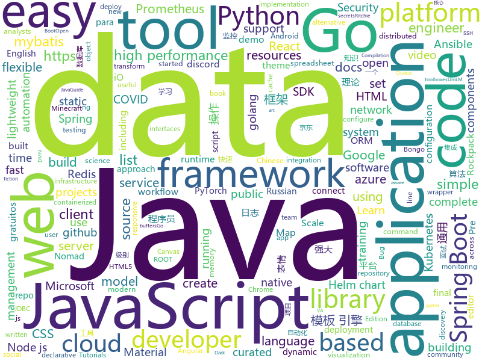

# 2020-10-24
See what the GitHub community is most excited about.

## python
+ [ru-gpts](https://github.com/sberbank-ai/ru-gpts)(**134 stars today**): Russian GPT3 models.
+ [scalene](https://github.com/emeryberger/scalene)(**189 stars today**): Scalene: a high-performance, high-precision CPU and memory profiler for Python
+ [pytorch-lightning](https://github.com/PyTorchLightning/pytorch-lightning)(**69 stars today**): The lightweight PyTorch wrapper for high-performance AI research. Scale your models, not the boilerplate.
+ [ansible](https://github.com/ansible/ansible)(**45 stars today**): Ansible is a radically simple IT automation platform that makes your applications and systems easier to deploy and maintain. Automate everything from code deployment to network configuration to cloud management, in a language that approaches plain English, using SSH, with no agents to install on remote systems. https://docs.ansible.com.
+ [wtfpython](https://github.com/satwikkansal/wtfpython)(**190 stars today**): What the f*ck Python?
+ [pytorch-image-models](https://github.com/rwightman/pytorch-image-models)(**98 stars today**): PyTorch image models, scripts, pretrained weights -- (SE)ResNet/ResNeXT, DPN, EfficientNet, MixNet, MobileNet-V3/V2, MNASNet, Single-Path NAS, FBNet, and more
+ [checkov](https://github.com/bridgecrewio/checkov)(**9 stars today**): Prevent cloud misconfigurations during build-time for Terraform, Cloudformation, Kubernetes, Serverless framework and other infrastructure-as-code-languages with Checkov by Bridgecrew.
+ [Practical-Ethical-Hacking-Resources](https://github.com/Gr1mmie/Practical-Ethical-Hacking-Resources)(**20 stars today**): Compilation of Resources from TCM's Practical Ethical Hacking Udemy Course
+ [TensorFlowTTS](https://github.com/TensorSpeech/TensorFlowTTS)(**6 stars today**): 😝TensorFlowTTS: Real-Time State-of-the-art Speech Synthesis for Tensorflow 2 (supported including English, Korean, Chinese and Easy to adapt for other languages)
+ [PayloadsAllTheThings](https://github.com/swisskyrepo/PayloadsAllTheThings)(**29 stars today**): A list of useful payloads and bypass for Web Application Security and Pentest/CTF
+ [pandasgui](https://github.com/adamerose/pandasgui)(**202 stars today**): A GUI for Pandas DataFrames
+ [azure-sdk-for-python](https://github.com/Azure/azure-sdk-for-python)(**2 stars today**): This repository is for active development of the Azure SDK for Python. For consumers of the SDK we recommend visiting our public developer docs at https://docs.microsoft.com/en-us/python/azure/ or our versioned developer docs at https://azure.github.io/azure-sdk-for-python.
+ [Teams-Auto-Joiner](https://github.com/TobiasPankner/Teams-Auto-Joiner)(**5 stars today**): Python script to automatically join Microsoft Teams meetings.
+ [whale](https://github.com/dataframehq/whale)(**24 stars today**): 🐳The stupidly simple data discovery tool.
+ [sherlock](https://github.com/sherlock-project/sherlock)(**29 stars today**): 🔎Hunt down social media accounts by username across social networks
+ [zulip](https://github.com/zulip/zulip)(**10 stars today**): Zulip server and webapp - powerful open source team chat
+ [fastapi](https://github.com/tiangolo/fastapi)(**52 stars today**): FastAPI framework, high performance, easy to learn, fast to code, ready for production
+ [dbt](https://github.com/fishtown-analytics/dbt)(**14 stars today**): dbt (data build tool) enables data analysts and engineers to transform their data using the same practices that software engineers use to build applications.
+ [DeepLearningExamples](https://github.com/NVIDIA/DeepLearningExamples)(**11 stars today**): Deep Learning Examples
+ [anomaly-detection-resources](https://github.com/yzhao062/anomaly-detection-resources)(**18 stars today**): Anomaly detection related books, papers, videos, and toolboxes
+ [unilm](https://github.com/microsoft/unilm)(**5 stars today**): UniLM - Unified Language Model Pre-training / Pre-training for NLP and Beyond
+ [dreampower](https://github.com/dreamnettech/dreampower)(**4 stars today**): DeepNude with DreamNet improvements.

## java
+ [jdk](https://github.com/openjdk/jdk)(**29 stars today**): JDK main-line development
+ [Auto.js](https://github.com/hyb1996/Auto.js)(**117 stars today**): A UiAutomator on android, does not need root access(安卓平台上的JavaScript自动化工具)
+ [nacos](https://github.com/alibaba/nacos)(**37 stars today**): an easy-to-use dynamic service discovery, configuration and service management platform for building cloud native applications.
+ [jsoncat](https://github.com/Snailclimb/jsoncat)(**25 stars today**): 仿 Spring Boot 但不同于 Spring Boot 的一个轻量级的 HTTP 框架
+ [spring-boot-tutorial](https://github.com/RameshMF/spring-boot-tutorial)(**8 stars today**): 100+ Spring Boot Articles, Tutorials, Video tutorials, Projects, Guides, Source code examples etc
+ [Geyser](https://github.com/GeyserMC/Geyser)(**17 stars today**): A bridge/proxy allowing you to connect to Minecraft: Java Edition servers with Minecraft: Bedrock edition.
+ [hutool](https://github.com/looly/hutool)(**68 stars today**): A set of tools that keep Java sweet.
+ [EhViewer](https://github.com/seven332/EhViewer)(**8 stars today**): [DEPRECATED] An Unofficial E-Hentai Application for Android
+ [tutorials](https://github.com/eugenp/tutorials)(**21 stars today**): Just Announced - "Learn Spring Security OAuth":
+ [easy163](https://github.com/ndroi/easy163)(**20 stars today**): 安卓端一键解锁网易云音乐，无须 ROOT
+ [JavaGuide](https://github.com/Snailclimb/JavaGuide)(**95 stars today**): 「Java学习+面试指南」一份涵盖大部分Java程序员所需要掌握的核心知识。准备 Java 面试，首选 JavaGuide！
+ [camunda-bpm-platform](https://github.com/camunda/camunda-bpm-platform)(**5 stars today**): Flexible framework for workflow and decision automation with BPMN and DMN. Integration with Spring, Spring Boot, CDI.
+ [hive](https://github.com/apache/hive)(**3 stars today**): Apache Hive
+ [hbase](https://github.com/apache/hbase)(**5 stars today**): Apache HBase
+ [Mindustry](https://github.com/Anuken/Mindustry)(**8 stars today**): A sandbox tower defense game
+ [HikariCP](https://github.com/brettwooldridge/HikariCP)(**12 stars today**): 光 HikariCP・A solid, high-performance, JDBC connection pool at last.
+ [reactor-netty](https://github.com/reactor/reactor-netty)(**2 stars today**): TCP/HTTP/UDP client/server with Reactor over Netty
+ [COLA](https://github.com/alibaba/COLA)(**14 stars today**): Clean Object-oriented & Layered Architecture
+ [java](https://github.com/kubernetes-client/java)(**2 stars today**): Official Java client library for kubernetes
+ [spring-boot](https://github.com/spring-projects/spring-boot)(**27 stars today**): Spring Boot
+ [thingsboard](https://github.com/thingsboard/thingsboard)(**7 stars today**): Open-source IoT Platform - Device management, data collection, processing and visualization.
+ [JDA](https://github.com/DV8FromTheWorld/JDA)(**4 stars today**): Java wrapper for the popular chat & VOIP service: Discord https://discord.com
+ [spring-boot-demo](https://github.com/xkcoding/spring-boot-demo)(**27 stars today**): spring boot demo 是一个用来深度学习并实战 spring boot 的项目，目前总共包含 65 个集成demo，已经完成 53 个。 该项目已成功集成 actuator(监控)、admin(可视化监控)、logback(日志)、aopLog(通过AOP记录web请求日志)、统一异常处理(json级别和页面级别)、freemarker(模板引擎)、thymeleaf(模板引擎)、Beetl(模板引擎)、Enjoy(模板引擎)、JdbcTemplate(通用JDBC操作数据库)、JPA(强大的ORM框架)、mybatis(强大的ORM框架)、通用Mapper(快速操作Mybatis)、PageHelper(通用的Mybatis分页插件)、mybatis-plus(快速操作M…
+ [redisson](https://github.com/redisson/redisson)(**16 stars today**): Redisson - Redis Java client with features of In-Memory Data Grid. Over 50 Redis based Java objects and services: Set, Multimap, SortedSet, Map, List, Queue, Deque, Semaphore, Lock, AtomicLong, Map Reduce, Publish / Subscribe, Bloom filter, Spring Cache, Tomcat, Scheduler, JCache API, Hibernate, MyBatis, RPC, local cache ...
+ [wiremock](https://github.com/tomakehurst/wiremock)(**7 stars today**): A tool for mocking HTTP services

## unknown
+ [coding-interview-university](https://github.com/jwasham/coding-interview-university)(**183 stars today**): A complete computer science study plan to become a software engineer.
+ [ShameCom](https://github.com/ShameCom/ShameCom)(**571 stars today**): 收集校招污点公司或组织，帮助学弟学妹避雷。互联网不曾遗忘！
+ [hacker-laws-zh](https://github.com/nusr/hacker-laws-zh)(**306 stars today**): 💻📖对开发人员有用的定律、理论、原则和模式。(Laws, Theories, Principles and Patterns that developers will find useful.)
+ [Reflection_Summary](https://github.com/sladesha/Reflection_Summary)(**25 stars today**): 算法理论基础知识应知应会
+ [Interview_Question_for_Beginner](https://github.com/JaeYeopHan/Interview_Question_for_Beginner)(**102 stars today**): 👦👧Technical-Interview guidelines written for those who started studying programming. I wish you all the best.👾
+ [awesome-android-security](https://github.com/saeidshirazi/awesome-android-security)(**52 stars today**): A curated list of Android Security materials and resources For Pentesters and Bug Hunters
+ [100-days-of-angular](https://github.com/angular-vietnam/100-days-of-angular)(**3 stars today**): Series độc quyền cung cấp bởi thành viên của Angular Vietnam về các chủ đề liên quan tới Angular trong vòng 100 ngày.
+ [google-cloud-4-words](https://github.com/gregsramblings/google-cloud-4-words)(**16 stars today**): The Google Cloud Developer's Cheat Sheet
+ [open-source-cs-python](https://github.com/ForrestKnight/open-source-cs-python)(**19 stars today**): Video discussing this curriculum:
+ [COVID-19](https://github.com/pcm-dpc/COVID-19)(**9 stars today**): COVID-19 Italia - Monitoraggio situazione
+ [you-dont-know-js-ru](https://github.com/azat-io/you-dont-know-js-ru)(**7 stars today**): 📚Russian translation of "You Don't Know JS" book series
+ [data-engineer-roadmap](https://github.com/datastacktv/data-engineer-roadmap)(**19 stars today**): Roadmap to becoming a data engineer in 2020
+ [chromium](https://github.com/chromium/chromium)(**18 stars today**): The official GitHub mirror of the Chromium source
+ [COVID-19](https://github.com/CSSEGISandData/COVID-19)(**23 stars today**): Novel Coronavirus (COVID-19) Cases, provided by JHU CSSE
+ [awesome-falsehood](https://github.com/kdeldycke/awesome-falsehood)(**15 stars today**): 😱Falsehoods Programmers Believe in
+ [dracula-theme](https://github.com/dracula/dracula-theme)(**16 stars today**): 🧛🏻‍♂️ Dark theme for all the things!
+ [recursos-gratuitos](https://github.com/iuricode/recursos-gratuitos)(**26 stars today**): 🌈Um repositório com conteúdos gratuitos para sites e materiais gratuitos para estudos.
+ [architect-awesome](https://github.com/xingshaocheng/architect-awesome)(**21 stars today**): 后端架构师技术图谱
+ [ituring_books](https://github.com/ChenyangGao/ituring_books)(**6 stars today**): 图灵程序设计丛书分享
+ [JavaBooks](https://github.com/itwanger/JavaBooks)(**44 stars today**): Java 程序员常读书单整理，附下载地址，助力构建最强知识体系。但不限于 Java，包括设计模式、计算机网络、操作系统、数据库、数据结构与算法、大数据、架构、管理等等。
+ [awesome-gcp-certifications](https://github.com/sathishvj/awesome-gcp-certifications)(**4 stars today**): Google Cloud Platform Certification resources.
+ [covid-policy-tracker](https://github.com/OxCGRT/covid-policy-tracker)(**3 stars today**): Systematic dataset of Covid-19 policy, from Oxford University
+ [learn-regex](https://github.com/ziishaned/learn-regex)(**13 stars today**): Learn regex the easy way
+ [css](https://github.com/airbnb/css)(**4 stars today**): A mostly reasonable approach to CSS and Sass.
+ [roadmap](https://github.com/npm/roadmap)(**37 stars today**): npm public roadmap

## javascript
+ [edex-ui](https://github.com/GitSquared/edex-ui)(**395 stars today**): A cross-platform, customizable science fiction terminal emulator with advanced monitoring & touchscreen support.
+ [node](https://github.com/nodejs/node)(**108 stars today**): Node.js JavaScript runtime✨🐢🚀✨
+ [scripts](https://github.com/lxk0301/scripts)(**125 stars today**): 京东薅羊毛工具, 京东水果、宠物、种豆 aff 互助讨论组：https://t.me/JD_fruit_pet
+ [create-react-app](https://github.com/facebook/create-react-app)(**91 stars today**): Set up a modern web app by running one command.
+ [complete-javascript-course](https://github.com/jonasschmedtmann/complete-javascript-course)(**122 stars today**): Starter files, final projects and FAQ for my Complete JavaScript course
+ [widevine-l3-decryptor](https://github.com/tomer8007/widevine-l3-decryptor)(**147 stars today**): A Chrome extension that demonstrates bypassing Widevine L3 DRM
+ [react](https://github.com/facebook/react)(**120 stars today**): A declarative, efficient, and flexible JavaScript library for building user interfaces.
+ [bongo.cat](https://github.com/Externalizable/bongo.cat)(**428 stars today**): Hit the bongos like Bongo Cat!
+ [quasar](https://github.com/quasarframework/quasar)(**23 stars today**): Quasar Framework - Build high-performance VueJS user interfaces in record time
+ [fullstack-course4](https://github.com/jhu-ep-coursera/fullstack-course4)(**10 stars today**): Example code for HTML, CSS, and Javascript for Web Developers Coursera Course
+ [d3](https://github.com/d3/d3)(**28 stars today**): Bring data to life with SVG, Canvas and HTML.📊📈🎉
+ [svelte](https://github.com/sveltejs/svelte)(**406 stars today**): Cybernetically enhanced web apps
+ [taobao-11-11](https://github.com/hyue418/taobao-11-11)(**263 stars today**): 2020双十一|双11全民养猫|超级星秀猫自动化脚本，支持淘宝+支付宝自动做喵币任务【全额奖励，防检测】
+ [jexcel](https://github.com/paulhodel/jexcel)(**11 stars today**): jExcel is a lightweight vanilla javascript plugin to create amazing web-based interactive tables and spreadsheets compatible with Excel or any other spreadsheet software.
+ [react-native-calendars](https://github.com/wix/react-native-calendars)(**4 stars today**): React Native Calendar Components🗓️📆
+ [rockpack](https://github.com/AlexSergey/rockpack)(**16 stars today**): Rockpack is a complex approach for bundling, logging, testing, SEO, SSR and more, for React application. Rockpack is create-react-app on steroids.
+ [monaco-editor](https://github.com/microsoft/monaco-editor)(**15 stars today**): A browser based code editor
+ [react-virtualized](https://github.com/bvaughn/react-virtualized)(**25 stars today**): React components for efficiently rendering large lists and tabular data
+ [iOS-Widgets](https://github.com/ThisIsBenny/iOS-Widgets)(**11 stars today**): Collection of iOS Widgets
+ [APlayer](https://github.com/MoePlayer/APlayer)(**4 stars today**): 🍭Wow, such a beautiful HTML5 music player
+ [vanillawebprojects](https://github.com/bradtraversy/vanillawebprojects)(**7 stars today**): Mini projects built with HTML5, CSS & JavaScript. No frameworks or libraries
+ [x-spreadsheet](https://github.com/myliang/x-spreadsheet)(**23 stars today**): A web-based JavaScript（canvas） spreadsheet
+ [quill](https://github.com/quilljs/quill)(**11 stars today**): Quill is a modern WYSIWYG editor built for compatibility and extensibility.
+ [microsoft-authentication-library-for-js](https://github.com/AzureAD/microsoft-authentication-library-for-js)(**5 stars today**): Microsoft Authentication Library (MSAL) for JS
+ [ChineseBQB](https://github.com/zhaoolee/ChineseBQB)(**50 stars today**): 🇨🇳Chinese sticker pack,More joy / 表情包的博物馆, Github最有毒的仓库, 中国表情包大集合, 聚欢乐~

## html
+ [wpt](https://github.com/web-platform-tests/wpt)(**2 stars today**): Test suites for Web platform specs — including WHATWG, W3C, and others
+ [node-ytdl-core](https://github.com/fent/node-ytdl-core)(**12 stars today**): YouTube video downloader in javascript.
+ [charts](https://github.com/bitnami/charts)(**7 stars today**): Helm Charts
+ [Fur](https://github.com/MonkSoul/Fur)(**32 stars today**): 🐮Fur 是 .NET 5 平台下企业应用开发最佳实践框架。（v1.0.0-rc.final.20）
+ [helm-charts](https://github.com/prometheus-community/helm-charts)(**9 stars today**): Prometheus community Helm charts
+ [tidytuesday](https://github.com/rfordatascience/tidytuesday)(**3 stars today**): Official repo for the #tidytuesday project
+ [30-Days-of-Python](https://github.com/codingforentrepreneurs/30-Days-of-Python)(**3 stars today**): A New Version of 30 Days of Python is nearly here. Get started today.
+ [phpstan](https://github.com/phpstan/phpstan)(**6 stars today**): PHP Static Analysis Tool - discover bugs in your code without running it!
+ [matrix-docker-ansible-deploy](https://github.com/spantaleev/matrix-docker-ansible-deploy)(**5 stars today**): Matrix (An open network for secure, decentralized communication) server setup using Ansible and Docker
+ [Screenshot-to-code](https://github.com/emilwallner/Screenshot-to-code)(**37 stars today**): A neural network that transforms a design mock-up into a static website.
+ [tails](https://github.com/thedevdojo/tails)(**18 stars today**): Tails is a (no-config) copy'n paste library of templates and components crafted using TailwindCSS
+ [openshift-docs](https://github.com/openshift/openshift-docs)(**1 stars today**): OpenShift 3 and 4 product and community documentation
+ [samples](https://github.com/GoogleChrome/samples)(**5 stars today**): A repo containing samples tied to new functionality in each release of Google Chrome.
+ [va.gov-team](https://github.com/department-of-veterans-affairs/va.gov-team)(**2 stars today**): Public resources for building on and in support of VA.gov. Visit complete Knowledge Hub:
+ [responsive-html-email-template](https://github.com/leemunroe/responsive-html-email-template)(**6 stars today**): A free simple responsive HTML email template
+ [helm-charts](https://github.com/codecentric/helm-charts)(**0 stars today**): A curated set of Helm charts brought to you by codecentric
+ [learning-library](https://github.com/oracle/learning-library)(**2 stars today**): Learning Material for Oracle Technologies
+ [222-responsive-icon-nav-css](https://github.com/fireship-io/222-responsive-icon-nav-css)(**3 stars today**): A Simple Responsive Animated CSS Icon Navbar
+ [flexboxgrid](https://github.com/kristoferjoseph/flexboxgrid)(**3 stars today**): Grid based on CSS3 flexbox
+ [eks-charts](https://github.com/aws/eks-charts)(**0 stars today**): Amazon EKS Helm chart repository
+ [hexo-theme-zhaoo](https://github.com/izhaoo/hexo-theme-zhaoo)(**3 stars today**): 🐳A simple theme for Hexo
+ [csswg-drafts](https://github.com/w3c/csswg-drafts)(**3 stars today**): CSS Working Group Editor Drafts
+ [amundsen](https://github.com/amundsen-io/amundsen)(**2 stars today**): Amundsen is a metadata driven application for improving the productivity of data analysts, data scientists and engineers when interacting with data.
+ [k3s-ansible](https://github.com/rancher/k3s-ansible)(**2 stars today**): 
+ [learnyounode](https://github.com/workshopper/learnyounode)(**3 stars today**): Learn You The Node.js For Much Win! An intro to Node.js via a set of self-guided workshops.

## go
+ [eggos](https://github.com/icexin/eggos)(**282 stars today**): A Go unikernel running on x86 bare metal
+ [consul](https://github.com/hashicorp/consul)(**12 stars today**): Consul is a distributed, highly available, and data center aware solution to connect and configure applications across dynamic, distributed infrastructure.
+ [statsviz](https://github.com/arl/statsviz)(**147 stars today**): 🚀Instant live visualization of your Go application runtime statistics (GC, MemStats, etc.) in the browser
+ [prometheus](https://github.com/prometheus/prometheus)(**24 stars today**): The Prometheus monitoring system and time series database.
+ [otto](https://github.com/robertkrimen/otto)(**17 stars today**): A JavaScript interpreter in Go (golang)
+ [nomad](https://github.com/hashicorp/nomad)(**6 stars today**): Nomad is an easy-to-use, flexible, and performant workload orchestrator that can deploy a mix of microservice, batch, containerized, and non-containerized applications. Nomad is easy to operate and scale and has native Consul and Vault integrations.
+ [btcd](https://github.com/btcsuite/btcd)(**3 stars today**): An alternative full node bitcoin implementation written in Go (golang)
+ [golangci-lint](https://github.com/golangci/golangci-lint)(**21 stars today**): Fast linters Runner for Go
+ [fabric-samples](https://github.com/hyperledger/fabric-samples)(**3 stars today**): 
+ [mattermost-server](https://github.com/mattermost/mattermost-server)(**23 stars today**): Open source Slack-alternative in Golang and React - Mattermost
+ [client-go](https://github.com/kubernetes/client-go)(**7 stars today**): Go client for Kubernetes.
+ [k3s](https://github.com/rancher/k3s)(**20 stars today**): Lightweight Kubernetes
+ [Chronos](https://github.com/amit-davidson/Chronos)(**40 stars today**): Chronos - A static race detector for the go language
+ [vegeta](https://github.com/tsenart/vegeta)(**10 stars today**): HTTP load testing tool and library. It's over 9000!
+ [protobuf](https://github.com/golang/protobuf)(**6 stars today**): Go support for Google's protocol buffers
+ [gotraining](https://github.com/ardanlabs/gotraining)(**8 stars today**): Go Training Class Material :
+ [client_golang](https://github.com/prometheus/client_golang)(**3 stars today**): Prometheus instrumentation library for Go applications
+ [redis](https://github.com/go-redis/redis)(**12 stars today**): Type-safe Redis client for Golang
+ [prometheus-operator](https://github.com/prometheus-operator/prometheus-operator)(**6 stars today**): Prometheus Operator creates/configures/manages Prometheus clusters atop Kubernetes
+ [awesome-go](https://github.com/avelino/awesome-go)(**41 stars today**): A curated list of awesome Go frameworks, libraries and software
+ [dgraph](https://github.com/dgraph-io/dgraph)(**11 stars today**): Native GraphQL Database with graph backend
+ [sops](https://github.com/mozilla/sops)(**23 stars today**): Simple and flexible tool for managing secrets
+ [ritchie-cli](https://github.com/ZupIT/ritchie-cli)(**4 stars today**): Ritchie CLI is an open source tool that allows to create, store and share any kind of automations, executing them through command lines, to run operations or start workflows⚙️🖥💡
+ [argo-cd](https://github.com/argoproj/argo-cd)(**8 stars today**): Declarative continuous deployment for Kubernetes.
+ [websocket](https://github.com/gorilla/websocket)(**17 stars today**): A fast, well-tested and widely used WebSocket implementation for Go.

## WordCloud

