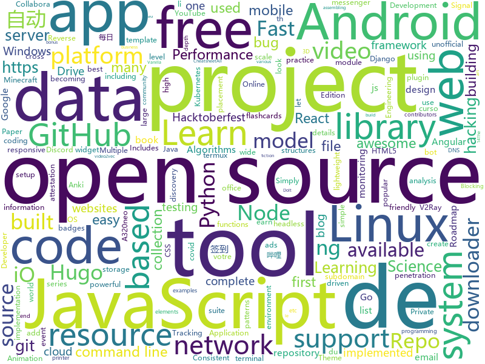

# 2020-11-01
See what the GitHub community is most excited about.

## python
+ [zipline](https://github.com/quantopian/zipline)(**221 stars today**): Zipline, a Pythonic Algorithmic Trading Library
+ [cuuhomientrung](https://github.com/Cuuhomientrung/cuuhomientrung)(**41 stars today**): Site hỗ trợ thông tin cứu hộ người dân miền Trung
+ [cheat.sh](https://github.com/chubin/cheat.sh)(**442 stars today**): the only cheat sheet you need
+ [yt-dlc](https://github.com/blackjack4494/yt-dlc)(**324 stars today**): media downloader for various sites.
+ [genshin-impact-helper](https://github.com/y1ndan/genshin-impact-helper)(**65 stars today**): Auto get Genshin Impact daily bonus by GitHub Actions. 米游社原神自动每日签到
+ [manim](https://github.com/3b1b/manim)(**427 stars today**): Animation engine for explanatory math videos
+ [public-apis](https://github.com/public-apis/public-apis)(**148 stars today**): A collective list of free APIs for use in software and web development.
+ [keras-ncp](https://github.com/mlech26l/keras-ncp)(**139 stars today**): Code repository of the paper Neural circuit policies enabling auditable autonomy published in Nature Machine Intelligence
+ [Tool-X](https://github.com/rajkumardusad/Tool-X)(**11 stars today**): Tool-X is a kali linux hacking Tool installer. Tool-X developed for termux and other Linux based systems. using Tool-X you can install almost 370+ hacking tools in termux app and other linux based distributions.
+ [hunter-dkim](https://github.com/robertdavidgraham/hunter-dkim)(**29 stars today**): Discusses how to verify DKIM signatures in old emails, namely one of the Hunter Biden emails in the news
+ [system-design-primer](https://github.com/donnemartin/system-design-primer)(**335 stars today**): Learn how to design large-scale systems. Prep for the system design interview. Includes Anki flashcards.
+ [fourier_neural_operator](https://github.com/zongyi-li/fourier_neural_operator)(**34 stars today**): 
+ [tinygrad](https://github.com/geohot/tinygrad)(**47 stars today**): You like pytorch? You like micrograd? You love tinygrad!❤️
+ [Cura](https://github.com/Ultimaker/Cura)(**9 stars today**): 3D printer / slicing GUI built on top of the Uranium framework
+ [python-cheatsheet](https://github.com/gto76/python-cheatsheet)(**25 stars today**): Comprehensive Python Cheatsheet
+ [Python](https://github.com/TheAlgorithms/Python)(**137 stars today**): All Algorithms implemented in Python
+ [pytube](https://github.com/nficano/pytube)(**26 stars today**): A lightweight, dependency-free Python library (and command-line utility) for downloading YouTube Videos.
+ [saleor](https://github.com/mirumee/saleor)(**26 stars today**): A modular, high performance, headless e-commerce platform built with Python, GraphQL, Django, and ReactJS.
+ [OctoPrint](https://github.com/OctoPrint/OctoPrint)(**5 stars today**): OctoPrint is the snappy web interface for your 3D printer!
+ [Object_Detection_Tracking](https://github.com/JunweiLiang/Object_Detection_Tracking)(**47 stars today**): Out-of-the-box code and models for CMU's object detection and tracking system for surveillance videos. Speed optimized Faster-RCNN model. Tensorflow based. Also supports EfficientDet. WACVW'20
+ [semgrep](https://github.com/returntocorp/semgrep)(**57 stars today**): Lightweight static analysis for many languages. Find bug variants with patterns that look like source code.
+ [Hacktoberfest-2020](https://github.com/Ishaan28malik/Hacktoberfest-2020)(**8 stars today**): Make this Hacktoberfest a learning period and contribute to Great Open Source Projects.
+ [vectorhub](https://github.com/vector-ai/vectorhub)(**63 stars today**): Library for easy discovery, and consumption of State-of-the-art models to turn data into vectors. (text2vec, image2vec, video2vec, graph2vec, bert, inception, etc)
+ [spleeter](https://github.com/deezer/spleeter)(**21 stars today**): Deezer source separation library including pretrained models.

## java
+ [Java](https://github.com/TheAlgorithms/Java)(**55 stars today**): All Algorithms implemented in Java
+ [android-developer-roadmap](https://github.com/MindorksOpenSource/android-developer-roadmap)(**19 stars today**): Android Developer Roadmap - A complete roadmap to learn Android App Development
+ [JavaCourseCodes](https://github.com/kimmking/JavaCourseCodes)(**21 stars today**): JavaCourse
+ [BilibiliTask](https://github.com/srcrs/BilibiliTask)(**212 stars today**): 哔哩哔哩(B站)自动完成每日任务，投币，点赞，直播签到，自动兑换银瓜子为硬币，自动送出即将过期礼物，漫画App签到。
+ [CobaltStrike](https://github.com/Freakboy/CobaltStrike)(**118 stars today**): CobaltStrike's source code
+ [AttestationDeplacement](https://github.com/AdrienPoupa/AttestationDeplacement)(**27 stars today**): Générez votre attestation de déplacement sur votre mobile à partir du document officiel.
+ [HacktoberFest](https://github.com/tarunsinghofficial/HacktoberFest)(**21 stars today**): Simply add your details and Get a chance to earn a free tshirt!✅
+ [CS-Notes](https://github.com/CyC2018/CS-Notes)(**303 stars today**): 📚技术面试必备基础知识、Leetcode、计算机操作系统、计算机网络、系统设计、Java、Python、C++
+ [termux-app](https://github.com/termux/termux-app)(**18 stars today**): Android terminal and Linux environment - app repository.
+ [Mindustry](https://github.com/Anuken/Mindustry)(**11 stars today**): A sandbox tower defense game
+ [data-structures](https://github.com/williamfiset/data-structures)(**9 stars today**): A collection of powerful data structures
+ [Intra](https://github.com/Jigsaw-Code/Intra)(**4 stars today**): An experimental tool that allows you to test new DNS-over-HTTPS services on Android
+ [Signal-Android](https://github.com/signalapp/Signal-Android)(**12 stars today**): A private messenger for Android.
+ [MusicBot](https://github.com/jagrosh/MusicBot)(**13 stars today**): 🎶A Discord music bot that's easy to set up and run yourself!
+ [Anki-Android](https://github.com/ankidroid/Anki-Android)(**7 stars today**): AnkiDroid: Anki flashcards on Android. Your secret trick to achieve superhuman information retention.
+ [traccar](https://github.com/traccar/traccar)(**8 stars today**): Traccar GPS Tracking System
+ [megabasterd](https://github.com/tonikelope/megabasterd)(**2 stars today**): Yet another unofficial (and ugly) cross-platform MEGA downloader/uploader/streaming suite.
+ [Geyser](https://github.com/GeyserMC/Geyser)(**17 stars today**): A bridge/proxy allowing you to connect to Minecraft: Java Edition servers with Minecraft: Bedrock edition.
+ [SparrowRecSys](https://github.com/wzhe06/SparrowRecSys)(**3 stars today**): A Deep Learning Recommender System
+ [animation-samples](https://github.com/android/animation-samples)(**6 stars today**): Multiple samples showing the best practices in animation on Android.
+ [k-9](https://github.com/k9mail/k-9)(**6 stars today**): K-9 Mail – Open Source Email App for Android
+ [androrat](https://github.com/wszf/androrat)(**2 stars today**): androrat
+ [myblog](https://github.com/shuleisanshi/myblog)(**149 stars today**): I think myblog is a very good project, which is divided into front-end module and back-end module. I have used the most popular SSM architecture to design the main frame and added many functions to my personal blog, such as: authority, comment, reply and recommend. these functions can also be used in the enterprise. We can practice this project …
+ [EhViewer](https://github.com/seven332/EhViewer)(**13 stars today**): [DEPRECATED] An Unofficial E-Hentai Application for Android
+ [Slimefun4](https://github.com/Slimefun/Slimefun4)(**1 stars today**): Slimefun 4 - A unique Spigot/Paper plugin that looks and feels like a modpack. We've been giving you backpacks, jetpacks, reactors and much more since 2013.

## unknown
+ [free-programming-books](https://github.com/EbookFoundation/free-programming-books)(**118 stars today**): 📚Freely available programming books
+ [key-book](https://github.com/datawhalechina/key-book)(**128 stars today**): 《机器学习理论导引》（宝箱书）的证明、案例、概念补充与参考文献讲解。在线阅读地址：https://datawhalechina.github.io/key-book/
+ [app-ideas](https://github.com/florinpop17/app-ideas)(**220 stars today**): A Collection of application ideas which can be used to improve your coding skills.
+ [developer-roadmap](https://github.com/kamranahmedse/developer-roadmap)(**1,138 stars today**): Roadmap to becoming a web developer in 2020
+ [COVID-19](https://github.com/pcm-dpc/COVID-19)(**8 stars today**): COVID-19 Italia - Monitoraggio situazione
+ [Chicken_McNuggets](https://github.com/mcdtaiwan/Chicken_McNuggets)(**20 stars today**): 「麥克鷄塊體」解密麥克鷄塊與他靈魂伴侶的糖醋醬之間的秘密訊息，所有想說的、不敢說的，就讓麥克鷄塊為你傳情達意吧！
+ [Privlege_Escalation](https://github.com/xChockax/Privlege_Escalation)(**44 stars today**): 
+ [awesome-reverse-engineering](https://github.com/alphaSeclab/awesome-reverse-engineering)(**18 stars today**): Reverse Engineering Resources About All Platforms(Windows/Linux/macOS/Android/iOS/IoT) And Every Aspect! (More than 3500 open source tools and 2300 posts&videos)
+ [awesome-for-beginners](https://github.com/MunGell/awesome-for-beginners)(**36 stars today**): A list of awesome beginners-friendly projects.
+ [computer-science](https://github.com/ossu/computer-science)(**239 stars today**): 🎓Path to a free self-taught education in Computer Science!
+ [PENTESTING-BIBLE](https://github.com/blaCCkHatHacEEkr/PENTESTING-BIBLE)(**25 stars today**): Learn ethical hacking.Learn about reconnaissance,windows/linux hacking,attacking web technologies,and pen testing wireless networks.Resources for learning malware analysis and reverse engineering.
+ [Flutter-Course-Resources](https://github.com/londonappbrewery/Flutter-Course-Resources)(**17 stars today**): Learn to Code While Building Apps - The Complete Flutter Development Bootcamp
+ [You-Dont-Know-JS](https://github.com/getify/You-Dont-Know-JS)(**42 stars today**): A book series on JavaScript. @YDKJS on twitter.
+ [awesome-datascience](https://github.com/academic/awesome-datascience)(**13 stars today**): 📝An awesome Data Science repository to learn and apply for real world problems.
+ [Resources-for-Beginner-Bug-Bounty-Hunters](https://github.com/nahamsec/Resources-for-Beginner-Bug-Bounty-Hunters)(**16 stars today**): A list of resources for those interested in getting started in bug bounties
+ [100-days-of-angular](https://github.com/angular-vietnam/100-days-of-angular)(**6 stars today**): Series độc quyền cung cấp bởi thành viên của Angular Vietnam về các chủ đề liên quan tới Angular trong vòng 100 ngày.
+ [awesome-pentest](https://github.com/enaqx/awesome-pentest)(**14 stars today**): A collection of awesome penetration testing resources, tools and other shiny things
+ [hosts](https://github.com/googlehosts/hosts)(**22 stars today**): 镜像：https://scaffrey.coding.net/p/hosts/git / https://git.qvq.network/googlehosts/hosts
+ [COVID-19](https://github.com/CSSEGISandData/COVID-19)(**24 stars today**): Novel Coronavirus (COVID-19) Cases, provided by JHU CSSE
+ [Z-Stack-firmware](https://github.com/Koenkk/Z-Stack-firmware)(**3 stars today**): Compilation instructions and hex files for Z-Stack firmwares
+ [TeachYourselfCS-CN](https://github.com/keithnull/TeachYourselfCS-CN)(**74 stars today**): TeachYourselfCS 的中文翻译 | A Chinese translation of TeachYourselfCS
+ [awesome-scalability](https://github.com/binhnguyennus/awesome-scalability)(**10 stars today**): The Patterns of Scalable, Reliable, and Performant Large-Scale Systems
+ [idiomatic.js](https://github.com/rwaldron/idiomatic.js)(**13 stars today**): Principles of Writing Consistent, Idiomatic JavaScript
+ [common-words](https://github.com/yoksel/common-words)(**4 stars today**): 🧐Слова, часто используемые в CSS-классах
+ [geckodriver](https://github.com/mozilla/geckodriver)(**4 stars today**): WebDriver for Firefox

## javascript
+ [attestation-deplacement-derogatoire-q4-2020](https://github.com/LAB-MI/attestation-deplacement-derogatoire-q4-2020)(**120 stars today**): attestation-deplacement-derogatoire-q4-2020 public
+ [semana-javascript-expert01](https://github.com/ErickWendel/semana-javascript-expert01)(**210 stars today**): Exemplos de código da primeira semana Javascript Expert
+ [AI-Expert-Roadmap](https://github.com/AMAI-GmbH/AI-Expert-Roadmap)(**586 stars today**): Roadmap to becoming an Artificial Intelligence Expert in 2020
+ [discord.js](https://github.com/discordjs/discord.js)(**16 stars today**): A powerful JavaScript library for interacting with the Discord API
+ [beginners-intro-javascript-node](https://github.com/microsoft/beginners-intro-javascript-node)(**220 stars today**): Beginner's Series: Introduction to JavaScript (Node.js)
+ [next.js](https://github.com/vercel/next.js)(**450 stars today**): The React Framework
+ [iptv](https://github.com/iptv-org/iptv)(**52 stars today**): Collection of 5000+ publicly available IPTV channels from all over the world
+ [bootstrap](https://github.com/twbs/bootstrap)(**54 stars today**): The most popular HTML, CSS, and JavaScript framework for developing responsive, mobile first projects on the web.
+ [freeCodeCamp](https://github.com/freeCodeCamp/freeCodeCamp)(**95 stars today**): freeCodeCamp.org's open source codebase and curriculum. Learn to code at home.
+ [javascript-algorithms](https://github.com/trekhleb/javascript-algorithms)(**456 stars today**): 📝Algorithms and data structures implemented in JavaScript with explanations and links to further readings
+ [edex-ui](https://github.com/GitSquared/edex-ui)(**322 stars today**): A cross-platform, customizable science fiction terminal emulator with advanced monitoring & touchscreen support.
+ [telekom-data-usage-widget](https://github.com/marcjulianschwarz/telekom-data-usage-widget)(**19 stars today**): Telekom Datennutzung Widget für iOS 14
+ [a32nx](https://github.com/flybywiresim/a32nx)(**27 stars today**): The A32NX Project is a community driven open source project to create a free Airbus A320neo in Microsoft Flight Simulator that is as close to reality as possible. It aims to enhance the default A320neo by improving the systems depth and functionality to bring it up to payware-level, all for free.
+ [Signal-Desktop](https://github.com/signalapp/Signal-Desktop)(**6 stars today**): Signal — Private Messenger for Windows, Mac, and Linux
+ [realworld](https://github.com/gothinkster/realworld)(**117 stars today**): "The mother of all demo apps" — Exemplary fullstack Medium.com clone powered by React, Angular, Node, Django, and many more🏅
+ [Ghost](https://github.com/TryGhost/Ghost)(**22 stars today**): 👻The #1 headless Node.js CMS for professional publishing
+ [shields](https://github.com/badges/shields)(**23 stars today**): Concise, consistent, and legible badges in SVG and raster format
+ [Weather-Cal](https://github.com/mzeryck/Weather-Cal)(**15 stars today**): This is a Scriptable widget that lets you display, position, and format multiple elements, including dates and events, weather information, battery level, and more. You can even create your own elements.
+ [Worn-Off-Keys-Discord-Js](https://github.com/AlexzanderFlores/Worn-Off-Keys-Discord-Js)(**6 stars today**): 
+ [react-fundamentals](https://github.com/kentcdodds/react-fundamentals)(**32 stars today**): Material for my React Fundamentals Workshop
+ [uBlock](https://github.com/gorhill/uBlock)(**42 stars today**): uBlock Origin - An efficient blocker for Chromium and Firefox. Fast and lean.
+ [online](https://github.com/CollaboraOnline/online)(**21 stars today**): Collabora Online is a collaborative online office suite based on LibreOffice technology. This is also the source for the Collabora Office apps for iOS and Android.
+ [node-red](https://github.com/node-red/node-red)(**51 stars today**): Low-code programming for event-driven applications
+ [Hacktoberfest-2020](https://github.com/OpenSourceTogether/Hacktoberfest-2020)(**11 stars today**): Welcome to Open-source! Simply add your details to contributors | Repo for Hacktoberfest 2020✅
+ [opensource.guide](https://github.com/github/opensource.guide)(**15 stars today**): 📚Community guides for open source creators

## html
+ [deplacement-covid-19](https://github.com/LAB-MI/deplacement-covid-19)(**3 stars today**): Service de génération de l'attestation de déplacement dérogatoire à présenter dans le cadre du confinement lié au virus covid-19
+ [hyperblog](https://github.com/freddier/hyperblog)(**68 stars today**): Un blog increíble para el curso de Git y Github de Platzi
+ [blackeye](https://github.com/An0nUD4Y/blackeye)(**7 stars today**): The ultimate phishing tool with 38 websites available!
+ [DetectionLab](https://github.com/clong/DetectionLab)(**7 stars today**): Automate the creation of a lab environment complete with security tooling and logging best practices
+ [Server](https://github.com/PanDownloadServer/Server)(**64 stars today**): PanDownload的个人维护版本
+ [ttv-ublock](https://github.com/odensc/ttv-ublock)(**25 stars today**): Blocking ads on Twitch with uBlock
+ [meghna-hugo](https://github.com/themefisher/meghna-hugo)(**3 stars today**): Meghna Hugo is a responsive one-page business template built with HTML5/CSS3, Hugo, JavaScript, and JQuery. The template is minimalist, lightweight, and fast loading.
+ [datasciencecoursera](https://github.com/mGalarnyk/datasciencecoursera)(**4 stars today**): Data Science Repo and blog for John Hopkins Coursera Courses. Please let me know if you have any questions.
+ [OpenClash](https://github.com/vernesong/OpenClash)(**12 stars today**): A Clash Client For OpenWrt
+ [hugo-PaperMod](https://github.com/adityatelange/hugo-PaperMod)(**6 stars today**): SSG Hugo | Theme - PaperMod
+ [JavaScript30](https://github.com/wesbos/JavaScript30)(**13 stars today**): 30 Day Vanilla JS Challenge
+ [web-api-auth-examples](https://github.com/spotify/web-api-auth-examples)(**1 stars today**): Basic examples to authenticate and fetch data using the Spotify Web API
+ [learning-area](https://github.com/mdn/learning-area)(**4 stars today**): Github repo for the MDN Learning Area.
+ [hacktoberfest](https://github.com/AliceWonderland/hacktoberfest)(**3 stars today**): Participate in Hacktoberfest by contributing to any Open Source project on GitHub! Here is a starter project for first time contributors. #hacktoberfest
+ [matrix-docker-ansible-deploy](https://github.com/spantaleev/matrix-docker-ansible-deploy)(**3 stars today**): Matrix (An open network for secure, decentralized communication) server setup using Ansible and Docker
+ [speedtest](https://github.com/librespeed/speedtest)(**12 stars today**): Self-hosted Speedtest for HTML5 and more. Easy setup, examples, configurable, mobile friendly. Supports PHP, Node, Multiple servers, and more
+ [CursosPlatzi](https://github.com/MineiToshio/CursosPlatzi)(**7 stars today**): Guía de resumen de los cursos de Platzi
+ [blog_os](https://github.com/phil-opp/blog_os)(**6 stars today**): Writing an OS in Rust
+ [fonts](https://github.com/google/fonts)(**4 stars today**): Font files available from Google Fonts
+ [free-v2ray](https://github.com/iwxf/free-v2ray)(**7 stars today**): 每天更新，分享免费V2Ray账号、订阅链接，V2Ray翻墙科学上网教程。
+ [node-ytdl-core](https://github.com/fent/node-ytdl-core)(**7 stars today**): YouTube video downloader in javascript.
+ [gohugo-theme-ananke](https://github.com/theNewDynamic/gohugo-theme-ananke)(**1 stars today**): Ananke: A theme for Hugo Sites
+ [Hacktoberfest2020](https://github.com/OpenSouceCode/Hacktoberfest2020)(**2 stars today**): Make your first Pull Request and earn a free tee from GitHub!
+ [repo-badges](https://github.com/dwyl/repo-badges)(**4 stars today**): ⭐Use repo badges (build passing, coverage, etc) in your readme/markdown file to signal code quality in a project.
+ [electron-api-demos](https://github.com/electron/electron-api-demos)(**3 stars today**): Explore the Electron APIs

## go
+ [subfinder](https://github.com/projectdiscovery/subfinder)(**11 stars today**): Subfinder is a subdomain discovery tool that discovers valid subdomains for websites. Designed as a passive framework to be useful for bug bounties and safe for penetration testing.
+ [sh](https://github.com/mvdan/sh)(**20 stars today**): A shell parser, formatter, and interpreter with bash support; includes shfmt
+ [flux2](https://github.com/fluxcd/flux2)(**121 stars today**): Kubernetes toolkit for assembling CD pipelines the GitOps way
+ [ebiten](https://github.com/hajimehoshi/ebiten)(**15 stars today**): A dead simple 2D game library for Go
+ [Amass](https://github.com/OWASP/Amass)(**10 stars today**): In-depth Attack Surface Mapping and Asset Discovery
+ [esbuild](https://github.com/evanw/esbuild)(**58 stars today**): An extremely fast JavaScript bundler and minifier
+ [annie](https://github.com/iawia002/annie)(**64 stars today**): 👾Fast, simple and clean video downloader
+ [go-echarts](https://github.com/go-echarts/go-echarts)(**60 stars today**): 🎨The adorable charts library for Golang
+ [AdGuardHome](https://github.com/AdguardTeam/AdGuardHome)(**34 stars today**): Network-wide ads & trackers blocking DNS server
+ [hugo](https://github.com/gohugoio/hugo)(**58 stars today**): The world’s fastest framework for building websites.
+ [telegram-bot-api](https://github.com/go-telegram-bot-api/telegram-bot-api)(**5 stars today**): Golang bindings for the Telegram Bot API
+ [terraform-provider-proxmox](https://github.com/Telmate/terraform-provider-proxmox)(**0 stars today**): Terraform provider plugin for proxmox
+ [nats-server](https://github.com/nats-io/nats-server)(**25 stars today**): High-Performance server for NATS, the cloud native messaging system.
+ [thola](https://github.com/inexio/thola)(**26 stars today**): A tool for monitoring and provisioning network devices written in Go.
+ [dasel](https://github.com/TomWright/dasel)(**166 stars today**): Query and update data structures from the command line. Comparable to jq/yq but supports JSON, TOML, YAML and XML with zero runtime dependencies.
+ [rclone](https://github.com/rclone/rclone)(**20 stars today**): "rsync for cloud storage" - Google Drive, Amazon Drive, S3, Dropbox, Backblaze B2, One Drive, Swift, Hubic, Cloudfiles, Google Cloud Storage, Yandex Files
+ [k3os](https://github.com/rancher/k3os)(**2 stars today**): Purpose-built OS for Kubernetes, fully managed by Kubernetes.
+ [metrics-server](https://github.com/kubernetes-sigs/metrics-server)(**7 stars today**): Cluster-wide aggregator of resource usage data.
+ [prysm](https://github.com/prysmaticlabs/prysm)(**3 stars today**): Go implementation of the Ethereum 2.0 blockchain
+ [v2ray-core](https://github.com/v2fly/v2ray-core)(**44 stars today**): A platform for building proxies to bypass network restrictions.
+ [glab](https://github.com/profclems/glab)(**29 stars today**): An open-source GitLab command line tool
+ [OpenDiablo2](https://github.com/OpenDiablo2/OpenDiablo2)(**7 stars today**): An open source re-implementation of Diablo 2
+ [nightingale](https://github.com/didi/nightingale)(**4 stars today**): 💡A Distributed and High-Performance Monitoring System
+ [clash](https://github.com/Dreamacro/clash)(**60 stars today**): A rule-based tunnel in Go.
+ [dolt](https://github.com/dolthub/dolt)(**8 stars today**): Dolt – It's Git for Data

## WordCloud

