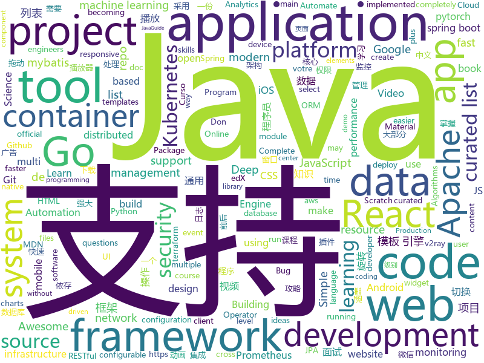

# 2020-11-03
See what the GitHub community is most excited about.

## python
+ [python-cheatsheet](https://github.com/gto76/python-cheatsheet)(**52 stars today**): Comprehensive Python Cheatsheet
+ [GHunt](https://github.com/mxrch/GHunt)(**255 stars today**): 🕵️‍♂️Investigate Google Accounts with emails.
+ [cheat.sh](https://github.com/chubin/cheat.sh)(**290 stars today**): the only cheat sheet you need
+ [horovod](https://github.com/horovod/horovod)(**15 stars today**): Distributed training framework for TensorFlow, Keras, PyTorch, and Apache MXNet.
+ [tinygrad](https://github.com/geohot/tinygrad)(**133 stars today**): You like pytorch? You like micrograd? You love tinygrad!❤️
+ [scikit-learn](https://github.com/scikit-learn/scikit-learn)(**17 stars today**): scikit-learn: machine learning in Python
+ [zipline](https://github.com/quantopian/zipline)(**106 stars today**): Zipline, a Pythonic Algorithmic Trading Library
+ [netbox](https://github.com/netbox-community/netbox)(**35 stars today**): IP address management (IPAM) and data center infrastructure management (DCIM) tool.
+ [incubator-superset](https://github.com/apache/incubator-superset)(**21 stars today**): Apache Superset is a Data Visualization and Data Exploration Platform
+ [workflow_automation](https://github.com/KalleHallden/workflow_automation)(**10 stars today**): 
+ [edx-platform](https://github.com/edx/edx-platform)(**2 stars today**): The Open edX platform, the software that powers edX!
+ [DeepLearningExamples](https://github.com/NVIDIA/DeepLearningExamples)(**5 stars today**): Deep Learning Examples
+ [doccano](https://github.com/doccano/doccano)(**10 stars today**): Open source text annotation tool for machine learning practitioner.
+ [deep-video-prior](https://github.com/ChenyangLEI/deep-video-prior)(**26 stars today**): Code for NeurIPS 2020 paper: Blind Video Temporal Consistency via Deep Video Prior
+ [HanLP](https://github.com/hankcs/HanLP)(**15 stars today**): 中文分词 词性标注 命名实体识别 依存句法分析 语义依存分析 新词发现 关键词短语提取 自动摘要 文本分类聚类 拼音简繁转换 自然语言处理
+ [gensim](https://github.com/RaRe-Technologies/gensim)(**8 stars today**): Topic Modelling for Humans
+ [semantic-segmentation](https://github.com/NVIDIA/semantic-segmentation)(**9 stars today**): Nvidia Semantic Segmentation monorepo
+ [iOS-DeviceSupport](https://github.com/iGhibli/iOS-DeviceSupport)(**8 stars today**): This repository holds the device support files for the iOS, and I will update it regularly.
+ [CenterTrack](https://github.com/xingyizhou/CenterTrack)(**4 stars today**): Simultaneous object detection and tracking using center points.
+ [Yet-Another-EfficientDet-Pytorch](https://github.com/zylo117/Yet-Another-EfficientDet-Pytorch)(**5 stars today**): The pytorch re-implement of the official efficientdet with SOTA performance in real time and pretrained weights.
+ [sentence-transformers](https://github.com/UKPLab/sentence-transformers)(**11 stars today**): Sentence Embeddings with BERT & XLNet
+ [keras_unet_plus_plus](https://github.com/AlphaJia/keras_unet_plus_plus)(**8 stars today**): keras implementation of unet plus plus
+ [ansible](https://github.com/ansible/ansible)(**21 stars today**): Ansible is a radically simple IT automation platform that makes your applications and systems easier to deploy and maintain. Automate everything from code deployment to network configuration to cloud management, in a language that approaches plain English, using SSH, with no agents to install on remote systems. https://docs.ansible.com.
+ [dbt](https://github.com/fishtown-analytics/dbt)(**5 stars today**): dbt (data build tool) enables data analysts and engineers to transform their data using the same practices that software engineers use to build applications.
+ [data-science-from-scratch](https://github.com/joelgrus/data-science-from-scratch)(**4 stars today**): code for Data Science From Scratch book

## java
+ [djl](https://github.com/awslabs/djl)(**29 stars today**): An Engine-Agnostic Deep Learning Framework in Java
+ [cp-ddd-framework](https://github.com/funkygao/cp-ddd-framework)(**32 stars today**): A lightweight flexible development framework for complex business architecture！轻量级业务中台开发框架，中台架构的顶层设计和完整解决方案！
+ [AttestationDeplacement](https://github.com/AdrienPoupa/AttestationDeplacement)(**18 stars today**): Générez votre attestation de déplacement sur votre mobile à partir du document officiel.
+ [Java](https://github.com/TheAlgorithms/Java)(**188 stars today**): All Algorithms implemented in Java
+ [elasticsearch](https://github.com/elastic/elasticsearch)(**20 stars today**): Open Source, Distributed, RESTful Search Engine
+ [JavaCourseCodes](https://github.com/kimmking/JavaCourseCodes)(**17 stars today**): JavaCourse
+ [JavaGuide](https://github.com/Snailclimb/JavaGuide)(**89 stars today**): 「Java学习+面试指南」一份涵盖大部分Java程序员所需要掌握的核心知识。准备 Java 面试，首选 JavaGuide！
+ [spring-boot-demo](https://github.com/xkcoding/spring-boot-demo)(**33 stars today**): spring boot demo 是一个用来深度学习并实战 spring boot 的项目，目前总共包含 65 个集成demo，已经完成 53 个。 该项目已成功集成 actuator(监控)、admin(可视化监控)、logback(日志)、aopLog(通过AOP记录web请求日志)、统一异常处理(json级别和页面级别)、freemarker(模板引擎)、thymeleaf(模板引擎)、Beetl(模板引擎)、Enjoy(模板引擎)、JdbcTemplate(通用JDBC操作数据库)、JPA(强大的ORM框架)、mybatis(强大的ORM框架)、通用Mapper(快速操作Mybatis)、PageHelper(通用的Mybatis分页插件)、mybatis-plus(快速操作M…
+ [iceberg](https://github.com/apache/iceberg)(**4 stars today**): Apache Iceberg
+ [graal](https://github.com/oracle/graal)(**10 stars today**): GraalVM: Run Programs Faster Anywhere🚀
+ [tutorials](https://github.com/eugenp/tutorials)(**23 stars today**): Just Announced - "Learn Spring Security OAuth":
+ [netty](https://github.com/netty/netty)(**18 stars today**): Netty project - an event-driven asynchronous network application framework
+ [XUI](https://github.com/xuexiangjys/XUI)(**11 stars today**): 💍一个简洁而优雅的Android原生UI框架，解放你的双手！
+ [GSYVideoPlayer](https://github.com/CarGuo/GSYVideoPlayer)(**14 stars today**): 视频播放器（IJKplayer、ExoPlayer、MediaPlayer），HTTPS，支持弹幕，外挂字幕，支持滤镜、水印、gif截图，片头广告、中间广告，多个同时播放，支持基本的拖动，声音、亮度调节，支持边播边缓存，支持视频自带rotation的旋转（90,270之类），重力旋转与手动旋转的同步支持，支持列表播放 ，列表全屏动画，视频加载速度，列表小窗口支持拖动，动画效果，调整比例，多分辨率切换，支持切换播放器，进度条小窗口预览，列表切换详情页面无缝播放，rtsp、concat、mpeg。
+ [react-native-image-picker](https://github.com/react-native-image-picker/react-native-image-picker)(**5 stars today**): 🌄A React Native module that allows you to use native UI to select media from the device library or directly from the camera.
+ [dubbo](https://github.com/apache/dubbo)(**15 stars today**): Apache Dubbo is a high-performance, java based, open source RPC framework.
+ [zookeeper](https://github.com/apache/zookeeper)(**8 stars today**): Apache ZooKeeper
+ [karate](https://github.com/intuit/karate)(**6 stars today**): Test Automation Made Simple
+ [eladmin](https://github.com/elunez/eladmin)(**16 stars today**): 项目基于 Spring Boot 2.1.0 、 Jpa、 Spring Security、redis、Vue的前后端分离的后台管理系统，项目采用分模块开发方式， 权限控制采用 RBAC，支持数据字典与数据权限管理，支持一键生成前后端代码，支持动态路由
+ [java](https://github.com/kubernetes-client/java)(**2 stars today**): Official Java client library for kubernetes
+ [checkstyle](https://github.com/checkstyle/checkstyle)(**4 stars today**): Checkstyle is a development tool to help programmers write Java code that adheres to a coding standard. By default it supports the Google Java Style Guide and Sun Code Conventions, but is highly configurable. It can be invoked with an ANT task and a command line program.
+ [pulsar](https://github.com/apache/pulsar)(**4 stars today**): Apache Pulsar - distributed pub-sub messaging system
+ [keycloak](https://github.com/keycloak/keycloak)(**9 stars today**): Open Source Identity and Access Management For Modern Applications and Services
+ [quarkus](https://github.com/quarkusio/quarkus)(**13 stars today**): Quarkus: Supersonic Subatomic Java.

## unknown
+ [Cybersecurity](https://github.com/harisqazi1/Cybersecurity)(**34 stars today**): This is meant to assist people looking for entry level Cybersecurity jobs, as well as study up on skills that they can put on their resume.
+ [app-ideas](https://github.com/florinpop17/app-ideas)(**301 stars today**): A Collection of application ideas which can be used to improve your coding skills.
+ [architect-awesome](https://github.com/xingshaocheng/architect-awesome)(**51 stars today**): 后端架构师技术图谱
+ [COVID-19](https://github.com/pcm-dpc/COVID-19)(**6 stars today**): COVID-19 Italia - Monitoraggio situazione
+ [awesome-android-security](https://github.com/saeidshirazi/awesome-android-security)(**25 stars today**): A curated list of Android Security materials and resources For Pentesters and Bug Hunters
+ [AspNetCore-Developer-Roadmap](https://github.com/MoienTajik/AspNetCore-Developer-Roadmap)(**81 stars today**): Roadmap to becoming an ASP.NET Core developer in 2021
+ [awesome](https://github.com/sindresorhus/awesome)(**66 stars today**): 😎Awesome lists about all kinds of interesting topics
+ [kubernetes-the-hard-way](https://github.com/kelseyhightower/kubernetes-the-hard-way)(**20 stars today**): Bootstrap Kubernetes the hard way on Google Cloud Platform. No scripts.
+ [AreWeRustYet](https://github.com/UgurcanAkkok/AreWeRustYet)(**37 stars today**): Awesome list of "Are We *thing* Yet" for Rust
+ [frontend-development](https://github.com/developer-resources/frontend-development)(**252 stars today**): A curated list of resources for Frontend development
+ [Chicken_McNuggets](https://github.com/mcdtaiwan/Chicken_McNuggets)(**49 stars today**): 「麥克鷄塊體」解密麥克鷄塊與他靈魂伴侶的糖醋醬之間的秘密訊息，所有想說的、不敢說的，就讓麥克鷄塊為你傳情達意吧！
+ [JavaBooks](https://github.com/itwanger/JavaBooks)(**33 stars today**): Java 程序员常读书单整理，附下载地址，助力构建最强知识体系。但不限于 Java，包括设计模式、计算机网络、操作系统、数据库、数据结构与算法、大数据、架构、管理等等。
+ [UltimateWDACBypassList](https://github.com/bohops/UltimateWDACBypassList)(**7 stars today**): A centralized resource for previously documented WDAC bypass techniques
+ [abap-platform-rap-opensap](https://github.com/SAP-samples/abap-platform-rap-opensap)(**13 stars today**): Samples for the openSAP course "Building Apps with the ABAP RESTful Application Programming model (RAP)."
+ [you-dont-know-js-ru](https://github.com/azat-io/you-dont-know-js-ru)(**10 stars today**): 📚Russian translation of "You Don't Know JS" book series
+ [nuclei-templates](https://github.com/projectdiscovery/nuclei-templates)(**6 stars today**): Community curated list of templates for the nuclei engine to find a security vulnerability in application.
+ [ztm-python-cheat-sheet](https://github.com/aneagoie/ztm-python-cheat-sheet)(**7 stars today**): 
+ [Flutter-Course-Resources](https://github.com/londonappbrewery/Flutter-Course-Resources)(**11 stars today**): Learn to Code While Building Apps - The Complete Flutter Development Bootcamp
+ [awesome-mlops](https://github.com/visenger/awesome-mlops)(**9 stars today**): A curated list of references for MLOps
+ [JavaFamily](https://github.com/AobingJava/JavaFamily)(**39 stars today**): 【Java面试+Java学习指南】 一份涵盖大部分Java程序员所需要掌握的核心知识。
+ [ue4-style-guide](https://github.com/Allar/ue4-style-guide)(**2 stars today**): An attempt to make Unreal Engine 4 projects more consistent
+ [Learn-Vim](https://github.com/iggredible/Learn-Vim)(**35 stars today**): A book for learning the Vim editor the smart way.
+ [dockprom](https://github.com/stefanprodan/dockprom)(**5 stars today**): Docker hosts and containers monitoring with Prometheus, Grafana, cAdvisor, NodeExporter and AlertManager
+ [runtimelab](https://github.com/dotnet/runtimelab)(**4 stars today**): This repo is for experimentation and exploring new ideas that may or may not make it into the main dotnet/runtime repo.
+ [awesome-interview-questions](https://github.com/MaximAbramchuck/awesome-interview-questions)(**12 stars today**): A curated awesome list of lists of interview questions. Feel free to contribute!🎓

## javascript
+ [edex-ui](https://github.com/GitSquared/edex-ui)(**451 stars today**): A cross-platform, customizable science fiction terminal emulator with advanced monitoring & touchscreen support.
+ [AI-Expert-Roadmap](https://github.com/AMAI-GmbH/AI-Expert-Roadmap)(**524 stars today**): Roadmap to becoming an Artificial Intelligence Expert in 2020
+ [attestation-deplacement-derogatoire-q4-2020](https://github.com/LAB-MI/attestation-deplacement-derogatoire-q4-2020)(**72 stars today**): attestation-deplacement-derogatoire-q4-2020 public
+ [algorithm-visualizer](https://github.com/algorithm-visualizer/algorithm-visualizer)(**39 stars today**): 🎆Interactive Online Platform that Visualizes Algorithms from Code
+ [corona-widget](https://github.com/rphl/corona-widget)(**15 stars today**): COVID-19 Inzidenz-Widget für iOS innerhalb Deutschlands🇩🇪(Kreis/Stadt + Bundesland + Trend)
+ [material-ui](https://github.com/mui-org/material-ui)(**30 stars today**): React components for faster and easier web development. Build your own design system, or start with Material Design.
+ [netron](https://github.com/lutzroeder/netron)(**26 stars today**): Visualizer for neural network, deep learning, and machine learning models
+ [jitsi-meet](https://github.com/jitsi/jitsi-meet)(**16 stars today**): Jitsi Meet - Secure, Simple and Scalable Video Conferences that you use as a standalone app or embed in your web application.
+ [lerna](https://github.com/lerna/lerna)(**23 stars today**): 🐉A tool for managing JavaScript projects with multiple packages.
+ [in-quiz-questions](https://github.com/Ebazhanov/in-quiz-questions)(**11 stars today**): Linkedin quiz assessment, answers and questions (aws-lambda, rest-api, javascript, react, git, html, jquery, maven, mongodb, xml, java, css, python ...) ответы на квиз
+ [Weather-Cal](https://github.com/mzeryck/Weather-Cal)(**11 stars today**): This is a Scriptable widget that lets you display, position, and format multiple elements, including dates and events, weather information, battery level, and more. You can even create your own elements.
+ [Fast-GitHub](https://github.com/fhefh2015/Fast-GitHub)(**47 stars today**): 国内Github下载很慢，用上了这个插件后，下载速度嗖嗖嗖的~！
+ [wechat-app-mall](https://github.com/EastWorld/wechat-app-mall)(**20 stars today**): 微信小程序商城，微信小程序微店
+ [bootstrap](https://github.com/twbs/bootstrap)(**37 stars today**): The most popular HTML, CSS, and JavaScript framework for developing responsive, mobile first projects on the web.
+ [umami](https://github.com/mikecao/umami)(**39 stars today**): Umami is a simple, fast, website analytics alternative to Google Analytics.
+ [react-big-calendar](https://github.com/jquense/react-big-calendar)(**7 stars today**): gcal/outlook like calendar component
+ [react-select](https://github.com/JedWatson/react-select)(**19 stars today**): The Select Component for React.js
+ [appium](https://github.com/appium/appium)(**14 stars today**): 📱Automation for iOS, Android, and Windows Apps.
+ [undici](https://github.com/nodejs/undici)(**26 stars today**): An HTTP/1.1 client, written from scratch for Node.js
+ [react](https://github.com/typescript-cheatsheets/react)(**45 stars today**): Cheatsheets for experienced React developers getting started with TypeScript
+ [lazysizes](https://github.com/aFarkas/lazysizes)(**8 stars today**): High performance and SEO friendly lazy loader for images (responsive and normal), iframes and more, that detects any visibility changes triggered through user interaction, CSS or JavaScript without configuration.
+ [hiring-without-whiteboards](https://github.com/poteto/hiring-without-whiteboards)(**12 stars today**): ⭐️Companies that don't have a broken hiring process
+ [cypress](https://github.com/cypress-io/cypress)(**23 stars today**): Fast, easy and reliable testing for anything that runs in a browser.
+ [svelte](https://github.com/sveltejs/svelte)(**40 stars today**): Cybernetically enhanced web apps
+ [gatsby](https://github.com/gatsbyjs/gatsby)(**20 stars today**): Build blazing fast, modern apps and websites with React

## html
+ [zju-icicles](https://github.com/QSCTech/zju-icicles)(**60 stars today**): 浙江大学课程攻略共享计划
+ [v2-ui](https://github.com/sprov065/v2-ui)(**41 stars today**): 支持多协议多用户的 v2ray 面板，Support multi-protocol multi-user v2ray panel
+ [ML-notes](https://github.com/Sakura-gh/ML-notes)(**9 stars today**): notes about machine learning
+ [phpstan](https://github.com/phpstan/phpstan)(**7 stars today**): PHP Static Analysis Tool - discover bugs in your code without running it!
+ [html-css](https://github.com/gustavoguanabara/html-css)(**23 stars today**): Curso de HTML5 e CSS3
+ [content](https://github.com/mdn/content)(**31 stars today**): The content behind MDN Web Docs
+ [Covid19-French-Auth](https://github.com/GetLuko/Covid19-French-Auth)(**1 stars today**): 
+ [helm-charts](https://github.com/prometheus-community/helm-charts)(**9 stars today**): Prometheus community Helm charts
+ [REKCARC-TSC-UHT](https://github.com/PKUanonym/REKCARC-TSC-UHT)(**45 stars today**): 清华大学计算机系课程攻略 Guidance for courses in Department of Computer Science and Technology, Tsinghua University
+ [Early-Vote-2020G](https://github.com/ElectProject/Early-Vote-2020G)(**5 stars today**): Tracker for 2020 general election early vote (mail and in-person) activity
+ [docsy](https://github.com/google/docsy)(**3 stars today**): A set of Hugo doc templates for launching open source content.
+ [DetectionLab](https://github.com/clong/DetectionLab)(**15 stars today**): Automate the creation of a lab environment complete with security tooling and logging best practices
+ [hyperblog](https://github.com/freddier/hyperblog)(**25 stars today**): Un blog increíble para el curso de Git y Github de Platzi
+ [charts](https://github.com/bitnami/charts)(**6 stars today**): Helm Charts
+ [learning-area](https://github.com/mdn/learning-area)(**3 stars today**): Github repo for the MDN Learning Area.
+ [raytracing.github.io](https://github.com/RayTracing/raytracing.github.io)(**6 stars today**): Main Web Site (Online Books)
+ [EIPs](https://github.com/ethereum/EIPs)(**6 stars today**): The Ethereum Improvement Proposal repository
+ [JavaScript30](https://github.com/wesbos/JavaScript30)(**9 stars today**): 30 Day Vanilla JS Challenge
+ [AR.js](https://github.com/jeromeetienne/AR.js)(**3 stars today**): Efficient Augmented Reality for the Web - 60fps on mobile!
+ [kubelabs](https://github.com/collabnix/kubelabs)(**10 stars today**): Kubernetes - Beginners | Intermediate | Advanced
+ [machine-learning-systems-design](https://github.com/chiphuyen/machine-learning-systems-design)(**5 stars today**): A booklet on machine learning systems design with exercises
+ [awesome-piracy](https://github.com/Igglybuff/awesome-piracy)(**15 stars today**): A curated list of awesome warez and piracy links
+ [javascript-for-r](https://github.com/JohnCoene/javascript-for-r)(**12 stars today**): JavaScript for R CRC Book
+ [tidytuesday](https://github.com/rfordatascience/tidytuesday)(**4 stars today**): Official repo for the #tidytuesday project
+ [windmill-dashboard](https://github.com/estevanmaito/windmill-dashboard)(**3 stars today**): 📊A multi theme, completely accessible, ready for production dashboard.

## go
+ [hugo](https://github.com/gohugoio/hugo)(**37 stars today**): The world’s fastest framework for building websites.
+ [nitro](https://github.com/asim/nitro)(**25 stars today**): Nitro (formerly known as Go Micro) is a blazingly fast framework for distributed app development.
+ [bit](https://github.com/chriswalz/bit)(**198 stars today**): Bit is a modern Git CLI
+ [prometheus](https://github.com/prometheus/prometheus)(**21 stars today**): The Prometheus monitoring system and time series database.
+ [kubernetes](https://github.com/kubernetes/kubernetes)(**37 stars today**): Production-Grade Container Scheduling and Management
+ [moby](https://github.com/moby/moby)(**17 stars today**): Moby Project - a collaborative project for the container ecosystem to assemble container-based systems
+ [pterm](https://github.com/pterm/pterm)(**53 stars today**): ✨A modern go module to beautify console output. Featuring charts, progressbars, tables, trees and many more🚀It's completely configurable and 100% cross-platform compatible.
+ [charts](https://github.com/helm/charts)(**7 stars today**): Curated applications for Kubernetes
+ [Mastering_Go_ZH_CN](https://github.com/hantmac/Mastering_Go_ZH_CN)(**55 stars today**): 《Mastering GO》中文译本，《玩转 GO》。
+ [golangci-lint](https://github.com/golangci/golangci-lint)(**18 stars today**): Fast linters Runner for Go
+ [terraform-provider-aws](https://github.com/hashicorp/terraform-provider-aws)(**6 stars today**): Terraform AWS provider
+ [ko](https://github.com/google/ko)(**15 stars today**): Build and deploy Go applications on Kubernetes
+ [flannel](https://github.com/coreos/flannel)(**6 stars today**): flannel is a network fabric for containers, designed for Kubernetes
+ [prometheus-operator](https://github.com/prometheus-operator/prometheus-operator)(**9 stars today**): Prometheus Operator creates/configures/manages Prometheus clusters atop Kubernetes
+ [terraform-provider-azurerm](https://github.com/terraform-providers/terraform-provider-azurerm)(**1 stars today**): Terraform provider for Azure Resource Manager
+ [aws-sdk-go](https://github.com/aws/aws-sdk-go)(**6 stars today**): AWS SDK for the Go programming language.
+ [serving](https://github.com/knative/serving)(**5 stars today**): Kubernetes-based, scale-to-zero, request-driven compute
+ [go-sqlmock](https://github.com/DATA-DOG/go-sqlmock)(**0 stars today**): Sql mock driver for golang to test database interactions
+ [runc](https://github.com/opencontainers/runc)(**5 stars today**): CLI tool for spawning and running containers according to the OCI specification
+ [temporal](https://github.com/temporalio/temporal)(**2 stars today**): Temporal service and CLI
+ [gosec](https://github.com/securego/gosec)(**7 stars today**): Golang security checker
+ [Go](https://github.com/TheAlgorithms/Go)(**22 stars today**): Algorithms Implemented in GoLang
+ [terraformer](https://github.com/GoogleCloudPlatform/terraformer)(**9 stars today**): CLI tool to generate terraform files from existing infrastructure (reverse Terraform). Infrastructure to Code
+ [govalidator](https://github.com/asaskevich/govalidator)(**8 stars today**): [Go] Package of validators and sanitizers for strings, numerics, slices and structs
+ [flux](https://github.com/fluxcd/flux)(**9 stars today**): The GitOps Kubernetes operator

## WordCloud

