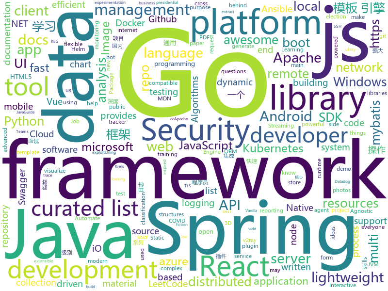

# 2020-11-04
See what the GitHub community is most excited about.

## python
+ [Mobile-Security-Framework-MobSF](https://github.com/MobSF/Mobile-Security-Framework-MobSF)(**56 stars today**): Mobile Security Framework (MobSF) is an automated, all-in-one mobile application (Android/iOS/Windows) pen-testing, malware analysis and security assessment framework capable of performing static and dynamic analysis.
+ [GHunt](https://github.com/mxrch/GHunt)(**398 stars today**): 🕵️‍♂️Investigate Google Accounts with emails.
+ [youtube-dl](https://github.com/l1ving/youtube-dl)(**260 stars today**): A fork of youtube-dl, for archival purposes.
+ [python-cheatsheet](https://github.com/gto76/python-cheatsheet)(**356 stars today**): Comprehensive Python Cheatsheet
+ [trape](https://github.com/jofpin/trape)(**37 stars today**): People tracker on the Internet: OSINT analysis and research tool by Jose Pino
+ [PaddleX](https://github.com/PaddlePaddle/PaddleX)(**37 stars today**): PaddlePaddle Entire Process Development Toolkit（『飞桨』深度学习全流程开发工具）
+ [incubator-superset](https://github.com/apache/incubator-superset)(**35 stars today**): Apache Superset is a Data Visualization and Data Exploration Platform
+ [MedMNIST](https://github.com/MedMNIST/MedMNIST)(**65 stars today**): MedMNIST Classification Decathlon: A Lightweight AutoML Benchmark for Medical Image Analysis
+ [avatarify](https://github.com/alievk/avatarify)(**21 stars today**): Avatars for Zoom, Skype and other video-conferencing apps.
+ [ansible](https://github.com/ansible/ansible)(**36 stars today**): Ansible is a radically simple IT automation platform that makes your applications and systems easier to deploy and maintain. Automate everything from code deployment to network configuration to cloud management, in a language that approaches plain English, using SSH, with no agents to install on remote systems. https://docs.ansible.com.
+ [cheat.sh](https://github.com/chubin/cheat.sh)(**392 stars today**): the only cheat sheet you need
+ [Universal_HamRadio_Remote_HTML5](https://github.com/F4HTB/Universal_HamRadio_Remote_HTML5)(**8 stars today**): Universal HamRadio Remote HTML5 interface
+ [netbox](https://github.com/netbox-community/netbox)(**49 stars today**): IP address management (IPAM) and data center infrastructure management (DCIM) tool.
+ [viztracer](https://github.com/gaogaotiantian/viztracer)(**69 stars today**): VizTracer is a low-overhead logging/debugging/profiling tool that can trace and visualize your python code execution.
+ [scipy](https://github.com/scipy/scipy)(**7 stars today**): Scipy library main repository
+ [cupy](https://github.com/cupy/cupy)(**15 stars today**): NumPy-like API accelerated with CUDA
+ [pifuhd](https://github.com/facebookresearch/pifuhd)(**58 stars today**): High-Resolution 3D Human Digitization from A Single Image.
+ [horovod](https://github.com/horovod/horovod)(**74 stars today**): Distributed training framework for TensorFlow, Keras, PyTorch, and Apache MXNet.
+ [animal-matting](https://github.com/JizhiziLi/animal-matting)(**71 stars today**): Github repository for the paper End-to-end Animal Image Matting
+ [airflow](https://github.com/apache/airflow)(**24 stars today**): Apache Airflow - A platform to programmatically author, schedule, and monitor workflows
+ [netbox-docker](https://github.com/netbox-community/netbox-docker)(**9 stars today**): 🐳Docker Image of NetBox
+ [GitHack](https://github.com/lijiejie/GitHack)(**11 stars today**): A `.git` folder disclosure exploit
+ [qiling](https://github.com/qilingframework/qiling)(**18 stars today**): Qiling Advanced Binary Emulation Framework
+ [microsoft-teams-class-attender](https://github.com/teja156/microsoft-teams-class-attender)(**30 stars today**): A bot to attend classes on microsoft teams
+ [algorithms](https://github.com/keon/algorithms)(**46 stars today**): Minimal examples of data structures and algorithms in Python

## java
+ [ExoPlayer](https://github.com/google/ExoPlayer)(**28 stars today**): An extensible media player for Android
+ [LeetCodeAnimation](https://github.com/MisterBooo/LeetCodeAnimation)(**102 stars today**): Demonstrate all the questions on LeetCode in the form of animation.（用动画的形式呈现解LeetCode题目的思路）
+ [Java](https://github.com/TheAlgorithms/Java)(**230 stars today**): All Algorithms implemented in Java
+ [cp-ddd-framework](https://github.com/funkygao/cp-ddd-framework)(**114 stars today**): A lightweight flexible development framework for complex business architecture！轻量级业务中台开发框架，中台架构的顶层设计和完整解决方案！
+ [JavaGuide](https://github.com/Snailclimb/JavaGuide)(**150 stars today**): 「Java学习+面试指南」一份涵盖大部分Java程序员所需要掌握的核心知识。准备 Java 面试，首选 JavaGuide！
+ [react-native-push-notification](https://github.com/zo0r/react-native-push-notification)(**4 stars today**): React Native Local and Remote Notifications
+ [Mindustry](https://github.com/Anuken/Mindustry)(**24 stars today**): A sandbox tower defense game
+ [flink-cdc-connectors](https://github.com/ververica/flink-cdc-connectors)(**21 stars today**): Change Data Capture (CDC) Connectors for Apache Flink
+ [tiktok_source](https://github.com/augustgl/tiktok_source)(**30 stars today**): Full source code to the android tiktok app.
+ [djl](https://github.com/awslabs/djl)(**125 stars today**): An Engine-Agnostic Deep Learning Framework in Java
+ [schema-registry](https://github.com/confluentinc/schema-registry)(**5 stars today**): Confluent Schema Registry for Kafka
+ [Java-WebSocket](https://github.com/TooTallNate/Java-WebSocket)(**11 stars today**): A barebones WebSocket client and server implementation written in 100% Java.
+ [JavaCourseCodes](https://github.com/kimmking/JavaCourseCodes)(**20 stars today**): JavaCourse
+ [spring-boot-demo](https://github.com/xkcoding/spring-boot-demo)(**85 stars today**): spring boot demo 是一个用来深度学习并实战 spring boot 的项目，目前总共包含 65 个集成demo，已经完成 53 个。 该项目已成功集成 actuator(监控)、admin(可视化监控)、logback(日志)、aopLog(通过AOP记录web请求日志)、统一异常处理(json级别和页面级别)、freemarker(模板引擎)、thymeleaf(模板引擎)、Beetl(模板引擎)、Enjoy(模板引擎)、JdbcTemplate(通用JDBC操作数据库)、JPA(强大的ORM框架)、mybatis(强大的ORM框架)、通用Mapper(快速操作Mybatis)、PageHelper(通用的Mybatis分页插件)、mybatis-plus(快速操作M…
+ [okhttp](https://github.com/square/okhttp)(**17 stars today**): Square’s meticulous HTTP client for the JVM, Android, and GraalVM.
+ [pravega](https://github.com/pravega/pravega)(**16 stars today**): Pravega - Streaming as a new software defined storage primitive
+ [allure2](https://github.com/allure-framework/allure2)(**7 stars today**): Allure Framework is a flexible lightweight multi-language test reporting tool. It provides clear graphical reports and allows everyone involved in the development process extract maximum of information from everyday testing process.
+ [azure-sdk-for-java](https://github.com/Azure/azure-sdk-for-java)(**2 stars today**): This repository is for active development of the Azure SDK for Java. For consumers of the SDK we recommend visiting our public developer docs at https://docs.microsoft.com/en-us/java/azure/ or our versioned developer docs at https://azure.github.io/azure-sdk-for-java.
+ [groovy](https://github.com/apache/groovy)(**3 stars today**): Apache Groovy: A powerful multi-faceted programming language for the JVM platform
+ [XUI](https://github.com/xuexiangjys/XUI)(**30 stars today**): 💍一个简洁而优雅的Android原生UI框架，解放你的双手！
+ [SpringAll](https://github.com/wuyouzhuguli/SpringAll)(**39 stars today**): 循序渐进，学习Spring Boot、Spring Boot & Shiro、Spring Batch、Spring Cloud、Spring Cloud Alibaba、Spring Security & Spring Security OAuth2，博客Spring系列源码：https://mrbird.cc
+ [kylin](https://github.com/apache/kylin)(**2 stars today**): Apache Kylin
+ [zuul](https://github.com/Netflix/zuul)(**45 stars today**): Zuul is a gateway service that provides dynamic routing, monitoring, resiliency, security, and more.
+ [ksql](https://github.com/confluentinc/ksql)(**10 stars today**): The event streaming database purpose-built for stream processing applications
+ [spring-boot](https://github.com/spring-projects/spring-boot)(**39 stars today**): Spring Boot

## unknown
+ [Cybersecurity](https://github.com/harisqazi1/Cybersecurity)(**156 stars today**): This is meant to assist people looking for entry level Cybersecurity jobs, as well as study up on skills that they can put on their resume.
+ [architect-awesome](https://github.com/xingshaocheng/architect-awesome)(**86 stars today**): 后端架构师技术图谱
+ [design-resources-for-developers](https://github.com/bradtraversy/design-resources-for-developers)(**97 stars today**): Curated list of design and UI resources from stock photos, web templates, CSS frameworks, UI libraries, tools and much more
+ [frontend-development](https://github.com/developer-resources/frontend-development)(**154 stars today**): A curated list of resources for Frontend development
+ [runtimelab](https://github.com/dotnet/runtimelab)(**5 stars today**): This repo is for experimentation and exploring new ideas that may or may not make it into the main dotnet/runtime repo.
+ [awesome-android-security](https://github.com/saeidshirazi/awesome-android-security)(**84 stars today**): A curated list of Android Security materials and resources For Pentesters and Bug Hunters
+ [app-ideas](https://github.com/florinpop17/app-ideas)(**378 stars today**): A Collection of application ideas which can be used to improve your coding skills.
+ [COVID-19](https://github.com/pcm-dpc/COVID-19)(**26 stars today**): COVID-19 Italia - Monitoraggio situazione
+ [Python-programming-exercises](https://github.com/zhiwehu/Python-programming-exercises)(**32 stars today**): 100+ Python challenging programming exercises
+ [awesome-vue](https://github.com/vuejs/awesome-vue)(**53 stars today**): 🎉A curated list of awesome things related to Vue.js
+ [you-dont-know-js-ru](https://github.com/azat-io/you-dont-know-js-ru)(**12 stars today**): 📚Russian translation of "You Don't Know JS" book series
+ [Specs](https://github.com/CocoaPods/Specs)(**3 stars today**): The CocoaPods Master Repo
+ [awesome-public-datasets](https://github.com/awesomedata/awesome-public-datasets)(**65 stars today**): A topic-centric list of HQ open datasets.
+ [1](https://github.com/XNM6/1)(**6 stars today**): 直播平台回家页
+ [GNNPapers](https://github.com/thunlp/GNNPapers)(**14 stars today**): Must-read papers on graph neural networks (GNN)
+ [every-programmer-should-know](https://github.com/mtdvio/every-programmer-should-know)(**24 stars today**): A collection of (mostly) technical things every software developer should know about
+ [awesome-readme](https://github.com/matiassingers/awesome-readme)(**13 stars today**): A curated list of awesome READMEs
+ [ztm-python-cheat-sheet](https://github.com/aneagoie/ztm-python-cheat-sheet)(**8 stars today**): 
+ [kubernetes-network-policy-recipes](https://github.com/ahmetb/kubernetes-network-policy-recipes)(**5 stars today**): Example recipes for Kubernetes Network Policies that you can just copy paste
+ [awesome-sysadmin](https://github.com/kahun/awesome-sysadmin)(**9 stars today**): A curated list of amazingly awesome open source sysadmin resources inspired by Awesome PHP.
+ [leetcode_company_wise_questions](https://github.com/MysteryVaibhav/leetcode_company_wise_questions)(**11 stars today**): This is a repository containing the list of company wise questions available on leetcode premium
+ [bestJavaer](https://github.com/crisxuan/bestJavaer)(**35 stars today**): 这是一个成为更好的Java程序员的系列教程
+ [Git-Commands](https://github.com/joshnh/Git-Commands)(**7 stars today**): A list of commonly used Git commands
+ [postman-app-support](https://github.com/postmanlabs/postman-app-support)(**3 stars today**): Postman helps you be more efficient while working with APIs. Using Postman, you can construct complex HTTP requests quickly, organize them in collections and share them with your co-workers.
+ [NanUI](https://github.com/NetDimension/NanUI)(**64 stars today**): NanUI is an open source .NET project for .NET / .NET Core developers who want to use front-end technologies such as HTML5 / CSS3 to build user interfaces for Windows Form applications.

## javascript
+ [edex-ui](https://github.com/GitSquared/edex-ui)(**875 stars today**): A cross-platform, customizable science fiction terminal emulator with advanced monitoring & touchscreen support.
+ [algorithm-visualizer](https://github.com/algorithm-visualizer/algorithm-visualizer)(**237 stars today**): 🎆Interactive Online Platform that Visualizes Algorithms from Code
+ [AI-Expert-Roadmap](https://github.com/AMAI-GmbH/AI-Expert-Roadmap)(**472 stars today**): Roadmap to becoming an Artificial Intelligence Expert in 2020
+ [nik_parse.js](https://github.com/bachors/nik_parse.js)(**71 stars today**): Parse Nomor Induk Kependudukan (NIK) KTP Menggunakan Javascript
+ [supabase](https://github.com/supabase/supabase)(**77 stars today**): Website, docs, and client libraries. Follow to stay updated about our public Beta.
+ [corona-widget](https://github.com/rphl/corona-widget)(**35 stars today**): COVID-19 Inzidenz-Widget für iOS innerhalb Deutschlands🇩🇪(Kreis/Stadt + Bundesland + Trend)
+ [vue](https://github.com/vuejs/vue)(**116 stars today**): 🖖Vue.js is a progressive, incrementally-adoptable JavaScript framework for building UI on the web.
+ [microsoft-authentication-library-for-js](https://github.com/AzureAD/microsoft-authentication-library-for-js)(**8 stars today**): Microsoft Authentication Library (MSAL) for JS
+ [dtale](https://github.com/man-group/dtale)(**56 stars today**): Visualizer for pandas data structures
+ [Fast-GitHub](https://github.com/fhefh2015/Fast-GitHub)(**101 stars today**): 国内Github下载很慢，用上了这个插件后，下载速度嗖嗖嗖的~！
+ [dayjs](https://github.com/iamkun/dayjs)(**76 stars today**): ⏰Day.js 2KB immutable date-time library alternative to Moment.js with the same modern API
+ [wp-calypso](https://github.com/Automattic/wp-calypso)(**8 stars today**): The JavaScript and API powered WordPress.com
+ [nextjs-aws-s3](https://github.com/leerob/nextjs-aws-s3)(**47 stars today**): Example Next.js app to upload photos to an S3 bucket.
+ [joeisdone.github.io](https://github.com/joeisdone/joeisdone.github.io)(**24 stars today**): Joe Is Done
+ [ffmpeg.wasm](https://github.com/ffmpegwasm/ffmpeg.wasm)(**84 stars today**): FFmpeg for browser and node, powered by WebAssembly
+ [select2](https://github.com/select2/select2)(**6 stars today**): Select2 is a jQuery based replacement for select boxes. It supports searching, remote data sets, and infinite scrolling of results.
+ [pdfmake](https://github.com/bpampuch/pdfmake)(**8 stars today**): Client/server side PDF printing in pure JavaScript
+ [whatsapp-bot](https://github.com/ArugaZ/whatsapp-bot)(**9 stars today**): Whatsapp Bot - Node Js
+ [the-super-tiny-compiler](https://github.com/jamiebuilds/the-super-tiny-compiler)(**23 stars today**): ⛄Possibly the smallest compiler ever
+ [jsPDF](https://github.com/MrRio/jsPDF)(**19 stars today**): Client-side JavaScript PDF generation for everyone.
+ [Leaflet](https://github.com/Leaflet/Leaflet)(**31 stars today**): 🍃JavaScript library for mobile-friendly interactive maps
+ [lando](https://github.com/lando/lando)(**8 stars today**): A local development and DevOps tool for all your projects that is fast, easy, powerful and liberating
+ [Recoil](https://github.com/facebookexperimental/Recoil)(**48 stars today**): Recoil is an experimental state management library for React apps. It provides several capabilities that are difficult to achieve with React alone, while being compatible with the newest features of React.
+ [react](https://github.com/typescript-cheatsheets/react)(**63 stars today**): Cheatsheets for experienced React developers getting started with TypeScript
+ [winXP](https://github.com/ShizukuIchi/winXP)(**85 stars today**): 🏁Web based Windows XP desktop recreation.

## html
+ [content](https://github.com/mdn/content)(**36 stars today**): The content behind MDN Web Docs
+ [Covid19-French-Auth](https://github.com/GetLuko/Covid19-French-Auth)(**7 stars today**): 
+ [html-css](https://github.com/gustavoguanabara/html-css)(**26 stars today**): Curso de HTML5 e CSS3
+ [learning-area](https://github.com/mdn/learning-area)(**7 stars today**): Github repo for the MDN Learning Area.
+ [glTF](https://github.com/KhronosGroup/glTF)(**5 stars today**): glTF – Runtime 3D Asset Delivery
+ [charts](https://github.com/bitnami/charts)(**8 stars today**): Helm Charts
+ [us-potus-model](https://github.com/TheEconomist/us-potus-model)(**35 stars today**): Code for a dynamic multilevel Bayesian model to predict US presidential elections. Written in R and Stan.
+ [helm-charts](https://github.com/DataDog/helm-charts)(**0 stars today**): Helm charts for Datadog products
+ [tidytuesday](https://github.com/rfordatascience/tidytuesday)(**9 stars today**): Official repo for the #tidytuesday project
+ [v-calendar](https://github.com/nathanreyes/v-calendar)(**4 stars today**): A lightweight, dependency-free plugin for building attributed calendars in Vue.js
+ [calico](https://github.com/projectcalico/calico)(**5 stars today**): Cloud native networking and network security
+ [oneAPI-samples](https://github.com/oneapi-src/oneAPI-samples)(**1 stars today**): Samples for Intel oneAPI toolkits
+ [fastText](https://github.com/facebookresearch/fastText)(**10 stars today**): Library for fast text representation and classification.
+ [swagger-codegen](https://github.com/swagger-api/swagger-codegen)(**10 stars today**): swagger-codegen contains a template-driven engine to generate documentation, API clients and server stubs in different languages by parsing your OpenAPI / Swagger definition.
+ [kubeasz](https://github.com/easzlab/kubeasz)(**8 stars today**): 使用Ansible脚本安装K8S集群，介绍组件交互原理，方便直接，不受国内网络环境影响
+ [zju-icicles](https://github.com/QSCTech/zju-icicles)(**68 stars today**): 浙江大学课程攻略共享计划
+ [embeddedsw](https://github.com/Xilinx/embeddedsw)(**1 stars today**): Xilinx Embedded Software (embeddedsw) Development
+ [msteams-docs](https://github.com/MicrosoftDocs/msteams-docs)(**0 stars today**): Source for the Microsoft Teams developer platform documentation.
+ [DetectionLab](https://github.com/clong/DetectionLab)(**21 stars today**): Automate the creation of a lab environment complete with security tooling and logging best practices
+ [tagify](https://github.com/yairEO/tagify)(**6 stars today**): 🔖lightweight, efficient Tags input component in Vanilla JS / React / Angular / Vue
+ [hospitalmanagement](https://github.com/sumitkumar1503/hospitalmanagement)(**2 stars today**): Hospital Management System || Python Django
+ [v2-ui](https://github.com/sprov065/v2-ui)(**36 stars today**): 支持多协议多用户的 v2ray 面板，Support multi-protocol multi-user v2ray panel
+ [eks-charts](https://github.com/aws/eks-charts)(**5 stars today**): Amazon EKS Helm chart repository
+ [ai-edu](https://github.com/microsoft/ai-edu)(**18 stars today**): AI education materials for Chinese students, teachers and IT professionals.
+ [Early-Vote-2020G](https://github.com/ElectProject/Early-Vote-2020G)(**5 stars today**): Tracker for 2020 general election early vote (mail and in-person) activity

## go
+ [Mastering_Go_ZH_CN](https://github.com/hantmac/Mastering_Go_ZH_CN)(**117 stars today**): 《Mastering GO》中文译本，《玩转 GO》。
+ [origin](https://github.com/openshift/origin)(**12 stars today**): Conformance test suite for OpenShift
+ [nitro](https://github.com/asim/nitro)(**49 stars today**): Nitro (formerly known as Go Micro) is a blazingly fast framework for distributed app development.
+ [distribution](https://github.com/docker/distribution)(**5 stars today**): The Docker toolset to pack, ship, store, and deliver content
+ [nvm-windows](https://github.com/coreybutler/nvm-windows)(**25 stars today**): A node.js version management utility for Windows. Ironically written in Go.
+ [telegraf](https://github.com/influxdata/telegraf)(**11 stars today**): The plugin-driven server agent for collecting & reporting metrics.
+ [temporal](https://github.com/temporalio/temporal)(**21 stars today**): Temporal service and CLI
+ [hugo](https://github.com/gohugoio/hugo)(**312 stars today**): The world’s fastest framework for building websites.
+ [kind](https://github.com/kubernetes-sigs/kind)(**17 stars today**): Kubernetes IN Docker - local clusters for testing Kubernetes
+ [frp](https://github.com/fatedier/frp)(**55 stars today**): A fast reverse proxy to help you expose a local server behind a NAT or firewall to the internet.
+ [gotraining](https://github.com/ardanlabs/gotraining)(**19 stars today**): Go Training Class Material :
+ [minio](https://github.com/minio/minio)(**38 stars today**): High Performance, Kubernetes Native Object Storage
+ [swag](https://github.com/swaggo/swag)(**9 stars today**): Automatically generate RESTful API documentation with Swagger 2.0 for Go.
+ [etcd](https://github.com/etcd-io/etcd)(**33 stars today**): Distributed reliable key-value store for the most critical data of a distributed system
+ [serving](https://github.com/knative/serving)(**7 stars today**): Kubernetes-based, scale-to-zero, request-driven compute
+ [buildkit](https://github.com/moby/buildkit)(**15 stars today**): concurrent, cache-efficient, and Dockerfile-agnostic builder toolkit
+ [sarama](https://github.com/Shopify/sarama)(**9 stars today**): Sarama is a Go library for Apache Kafka 0.8, and up.
+ [govalidator](https://github.com/asaskevich/govalidator)(**15 stars today**): [Go] Package of validators and sanitizers for strings, numerics, slices and structs
+ [clair](https://github.com/quay/clair)(**9 stars today**): Vulnerability Static Analysis for Containers
+ [cert-manager](https://github.com/jetstack/cert-manager)(**12 stars today**): Automatically provision and manage TLS certificates in Kubernetes
+ [pterm](https://github.com/pterm/pterm)(**81 stars today**): ✨A modern go module to beautify console output. Featuring charts, progressbars, tables, trees, and many more🚀It's completely configurable and 100% cross-platform compatible.
+ [aws-sdk-go](https://github.com/aws/aws-sdk-go)(**8 stars today**): AWS SDK for the Go programming language.
+ [kit](https://github.com/go-kit/kit)(**21 stars today**): A standard library for microservices.
+ [gocron](https://github.com/jasonlvhit/gocron)(**12 stars today**): A Golang Job Scheduling Package.
+ [logrus](https://github.com/sirupsen/logrus)(**26 stars today**): Structured, pluggable logging for Go.

## WordCloud

