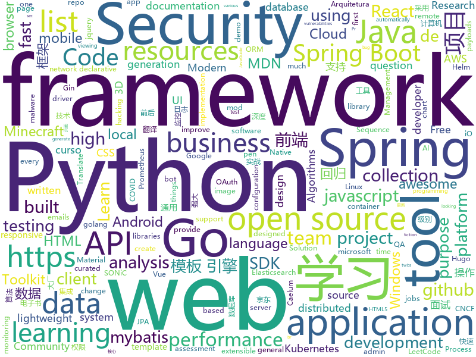

# 2020-11-05
See what the GitHub community is most excited about.

## python
+ [youtube-dl](https://github.com/l1ving/youtube-dl)(**278 stars today**): A fork of youtube-dl, for archival purposes.
+ [Mobile-Security-Framework-MobSF](https://github.com/MobSF/Mobile-Security-Framework-MobSF)(**177 stars today**): Mobile Security Framework (MobSF) is an automated, all-in-one mobile application (Android/iOS/Windows) pen-testing, malware analysis and security assessment framework capable of performing static and dynamic analysis.
+ [GHunt](https://github.com/mxrch/GHunt)(**242 stars today**): 🕵️‍♂️Investigate Google Accounts with emails.
+ [python-cheatsheet](https://github.com/gto76/python-cheatsheet)(**279 stars today**): Comprehensive Python Cheatsheet
+ [trape](https://github.com/jofpin/trape)(**146 stars today**): People tracker on the Internet: OSINT analysis and research tool by Jose Pino
+ [incubator-superset](https://github.com/apache/incubator-superset)(**199 stars today**): Apache Superset is a Data Visualization and Data Exploration Platform
+ [PayloadsAllTheThings](https://github.com/swisskyrepo/PayloadsAllTheThings)(**23 stars today**): A list of useful payloads and bypass for Web Application Security and Pentest/CTF
+ [CheatSheetSeries](https://github.com/OWASP/CheatSheetSeries)(**23 stars today**): The OWASP Cheat Sheet Series was created to provide a concise collection of high value information on specific application security topics.
+ [pifuhd](https://github.com/facebookresearch/pifuhd)(**35 stars today**): High-Resolution 3D Human Digitization from A Single Image.
+ [learn-python3](https://github.com/jerry-git/learn-python3)(**8 stars today**): Jupyter notebooks for teaching/learning Python 3
+ [eth2.0-deposit-cli](https://github.com/ethereum/eth2.0-deposit-cli)(**27 stars today**): Secure key generation for eth2 deposits
+ [wav2letter](https://github.com/facebookresearch/wav2letter)(**5 stars today**): Facebook AI Research's Automatic Speech Recognition Toolkit
+ [eth2.0-specs](https://github.com/ethereum/eth2.0-specs)(**26 stars today**): Ethereum 2.0 Specifications
+ [PaddleX](https://github.com/PaddlePaddle/PaddleX)(**49 stars today**): PaddlePaddle Entire Process Development Toolkit（『飞桨』深度学习全流程开发工具）
+ [microsoft-teams-class-attender](https://github.com/teja156/microsoft-teams-class-attender)(**39 stars today**): A bot to attend classes on microsoft teams
+ [py-googletrans](https://github.com/ssut/py-googletrans)(**4 stars today**): (unofficial) Googletrans: Free and Unlimited Google translate API for Python. Translates totally free of charge.
+ [fairseq](https://github.com/pytorch/fairseq)(**27 stars today**): Facebook AI Research Sequence-to-Sequence Toolkit written in Python.
+ [pytorch3d](https://github.com/facebookresearch/pytorch3d)(**6 stars today**): PyTorch3D is FAIR's library of reusable components for deep learning with 3D data
+ [Deep-Learning-Papers-Reading-Roadmap](https://github.com/floodsung/Deep-Learning-Papers-Reading-Roadmap)(**17 stars today**): Deep Learning papers reading roadmap for anyone who are eager to learn this amazing tech!
+ [dask](https://github.com/dask/dask)(**7 stars today**): Parallel computing with task scheduling
+ [haystack](https://github.com/deepset-ai/haystack)(**5 stars today**): 🔍Transformers at scale for question answering & neural search. Using NLP via a modular Retriever-Reader-Pipeline. Supporting DPR, Elasticsearch, HuggingFace's Modelhub...
+ [aws-cdk-examples](https://github.com/aws-samples/aws-cdk-examples)(**7 stars today**): Example projects using the AWS CDK
+ [uiautomator2](https://github.com/openatx/uiautomator2)(**9 stars today**): Android Uiautomator2 Python Wrapper
+ [Computer-Networking-A-Top-Down-Approach-NOTES](https://github.com/moranzcw/Computer-Networking-A-Top-Down-Approach-NOTES)(**5 stars today**): 《计算机网络－自顶向下方法(原书第6版)》编程作业，Wireshark实验文档的翻译和解答。
+ [aiogram](https://github.com/aiogram/aiogram)(**6 stars today**): Is a pretty simple and fully asynchronous framework for Telegram Bot API written in Python 3.7 with asyncio and aiohttp.

## java
+ [presto](https://github.com/prestodb/presto)(**5 stars today**): The official home of the Presto distributed SQL query engine for big data
+ [hello-algorithm](https://github.com/geekxh/hello-algorithm)(**21 stars today**): 🌍东半球最酷的学习项目 | 1、我写的三十万字算法图解 2、千本开源电子书 3、100 张思维导图 4、100 篇大厂面经 5、30 个学习专题🚀🚀🚀右上角点个 star，加入我们万人学习群！English Supported！
+ [LeetCodeAnimation](https://github.com/MisterBooo/LeetCodeAnimation)(**148 stars today**): Demonstrate all the questions on LeetCode in the form of animation.（用动画的形式呈现解LeetCode题目的思路）
+ [cp-ddd-framework](https://github.com/funkygao/cp-ddd-framework)(**28 stars today**): A lightweight flexible development framework for complex business architecture！轻量级业务中台开发框架，中台架构的顶层设计和完整解决方案！
+ [dynmap](https://github.com/webbukkit/dynmap)(**3 stars today**): A set of Minecraft mods that provide a real time web-based map system for various Minecraft server implementations.
+ [jetty.project](https://github.com/eclipse/jetty.project)(**3 stars today**): Eclipse Jetty® - Web Container & Clients - supports HTTP/2, HTTP/1.1, HTTP/1.0, websocket, servlets, and more
+ [ExoPlayer](https://github.com/google/ExoPlayer)(**77 stars today**): An extensible media player for Android
+ [opentelemetry-java](https://github.com/open-telemetry/opentelemetry-java)(**5 stars today**): OpenTelemetry Java SDK
+ [SpringAll](https://github.com/wuyouzhuguli/SpringAll)(**38 stars today**): 循序渐进，学习Spring Boot、Spring Boot & Shiro、Spring Batch、Spring Cloud、Spring Cloud Alibaba、Spring Security & Spring Security OAuth2，博客Spring系列源码：https://mrbird.cc
+ [keycloak](https://github.com/keycloak/keycloak)(**7 stars today**): Open Source Identity and Access Management For Modern Applications and Services
+ [skywalking](https://github.com/apache/skywalking)(**27 stars today**): APM, Application Performance Monitoring System
+ [openapi-generator](https://github.com/OpenAPITools/openapi-generator)(**14 stars today**): OpenAPI Generator allows generation of API client libraries (SDK generation), server stubs, documentation and configuration automatically given an OpenAPI Spec (v2, v3)
+ [spring-boot-demo](https://github.com/xkcoding/spring-boot-demo)(**34 stars today**): spring boot demo 是一个用来深度学习并实战 spring boot 的项目，目前总共包含 65 个集成demo，已经完成 53 个。 该项目已成功集成 actuator(监控)、admin(可视化监控)、logback(日志)、aopLog(通过AOP记录web请求日志)、统一异常处理(json级别和页面级别)、freemarker(模板引擎)、thymeleaf(模板引擎)、Beetl(模板引擎)、Enjoy(模板引擎)、JdbcTemplate(通用JDBC操作数据库)、JPA(强大的ORM框架)、mybatis(强大的ORM框架)、通用Mapper(快速操作Mybatis)、PageHelper(通用的Mybatis分页插件)、mybatis-plus(快速操作M…
+ [lithium-fabric](https://github.com/jellysquid3/lithium-fabric)(**1 stars today**): A Fabric mod designed to improve the general performance of Minecraft without breaking things
+ [react-native-push-notification](https://github.com/zo0r/react-native-push-notification)(**4 stars today**): React Native Local and Remote Notifications
+ [schema-registry](https://github.com/confluentinc/schema-registry)(**2 stars today**): Confluent Schema Registry for Kafka
+ [flink](https://github.com/apache/flink)(**15 stars today**): Apache Flink
+ [eladmin](https://github.com/elunez/eladmin)(**45 stars today**): 项目基于 Spring Boot 2.1.0 、 Jpa、 Spring Security、redis、Vue的前后端分离的后台管理系统，项目采用分模块开发方式， 权限控制采用 RBAC，支持数据字典与数据权限管理，支持一键生成前后端代码，支持动态路由
+ [tsunami-security-scanner](https://github.com/google/tsunami-security-scanner)(**2 stars today**): Tsunami is a general purpose network security scanner with an extensible plugin system for detecting high severity vulnerabilities with high confidence.
+ [AppAuth-Android](https://github.com/openid/AppAuth-Android)(**2 stars today**): Android client SDK for communicating with OAuth 2.0 and OpenID Connect providers.
+ [JavaGuide](https://github.com/Snailclimb/JavaGuide)(**77 stars today**): 「Java学习+面试指南」一份涵盖大部分Java程序员所需要掌握的核心知识。准备 Java 面试，首选 JavaGuide！
+ [jib](https://github.com/GoogleContainerTools/jib)(**8 stars today**): 🏗Build container images for your Java applications.
+ [ksql](https://github.com/confluentinc/ksql)(**5 stars today**): The event streaming database purpose-built for stream processing applications
+ [tutorials](https://github.com/eugenp/tutorials)(**12 stars today**): Just Announced - "Learn Spring Security OAuth":
+ [flowable-engine](https://github.com/flowable/flowable-engine)(**4 stars today**): A compact and highly efficient workflow and Business Process Management (BPM) platform for developers, system admins and business users.

## unknown
+ [100-days-of-python](https://github.com/appbrewery/100-days-of-python)(**53 stars today**): 100 Days of Code in Python
+ [design-resources-for-developers](https://github.com/bradtraversy/design-resources-for-developers)(**237 stars today**): Curated list of design and UI resources from stock photos, web templates, CSS frameworks, UI libraries, tools and much more
+ [Cybersecurity](https://github.com/harisqazi1/Cybersecurity)(**147 stars today**): This is meant to assist people looking for entry level Cybersecurity jobs, as well as study up on skills that they can put on their resume.
+ [architect-awesome](https://github.com/xingshaocheng/architect-awesome)(**111 stars today**): 后端架构师技术图谱
+ [COVID-19](https://github.com/pcm-dpc/COVID-19)(**12 stars today**): COVID-19 Italia - Monitoraggio situazione
+ [QA_bible](https://github.com/Vladislav610/QA_bible)(**7 stars today**): Библия QA/тестировщика это 200++ страниц обновляемой смеси ответов на вопросы с реальных собеседований на QA, перевода интересного контента с зарубежных ресурсов и агрегации материала с отечественных.
+ [bugbounty-cheatsheet](https://github.com/EdOverflow/bugbounty-cheatsheet)(**7 stars today**): A list of interesting payloads, tips and tricks for bug bounty hunters.
+ [CSBook](https://github.com/iCSToCS/CSBook)(**11 stars today**): 计算机类常用电子书整理，并且附带下载链接，包括Java，Python，Linux，Go，C，C++，数据结构与算法，人工智能，计算机基础，面试，设计模式，数据库，前端等书籍
+ [git-flight-rules](https://github.com/k88hudson/git-flight-rules)(**27 stars today**): Flight rules for git
+ [fucking-awesome-python](https://github.com/trananhkma/fucking-awesome-python)(**28 stars today**): awesome-python with⭐and🍴
+ [frontend-development](https://github.com/developer-resources/frontend-development)(**349 stars today**): A curated list of resources for Frontend development
+ [awesome-react-hooks](https://github.com/rehooks/awesome-react-hooks)(**5 stars today**): Awesome React Hooks
+ [Python](https://github.com/TwoWater/Python)(**20 stars today**): 最良心的 Python 教程：
+ [Ebook-Linear_Programming](https://github.com/Operations-Research-Science/Ebook-Linear_Programming)(**14 stars today**): 
+ [Red-Teaming-Toolkit](https://github.com/infosecn1nja/Red-Teaming-Toolkit)(**7 stars today**): A collection of open source and commercial tools that aid in red team operations.
+ [PENTESTING-BIBLE](https://github.com/blaCCkHatHacEEkr/PENTESTING-BIBLE)(**14 stars today**): Learn ethical hacking.Learn about reconnaissance,windows/linux hacking,attacking web technologies,and pen testing wireless networks.Resources for learning malware analysis and reverse engineering.
+ [awesome-pentest](https://github.com/enaqx/awesome-pentest)(**11 stars today**): A collection of awesome penetration testing resources, tools and other shiny things
+ [memorials](https://github.com/cncf/memorials)(**3 stars today**): 🕯️💐CNCF Community Memorials
+ [EffectiveModernCppChinese](https://github.com/kelthuzadx/EffectiveModernCppChinese)(**15 stars today**): 《Effective Modern C++》翻译 - 2020更新中
+ [awesome-remote-job](https://github.com/lukasz-madon/awesome-remote-job)(**6 stars today**): A curated list of awesome remote jobs and resources. Inspired by https://github.com/vinta/awesome-python
+ [Licensing](https://github.com/AaronDinnage/Licensing)(**1 stars today**): Microsoft 365 licensing diagrams
+ [apostila-oo-avancado-em-java](https://github.com/caelum/apostila-oo-avancado-em-java)(**9 stars today**): Apostila do curso Práticas de Design e Arquitetura de Código da Caelum. https://www.caelum.com.br/curso-design-arquitetura-de-aplicacoes-java
+ [datasharing](https://github.com/jtleek/datasharing)(**1 stars today**): The Leek group guide to data sharing
+ [COVID-19](https://github.com/CSSEGISandData/COVID-19)(**18 stars today**): Novel Coronavirus (COVID-19) Cases, provided by JHU CSSE
+ [every-programmer-should-know](https://github.com/mtdvio/every-programmer-should-know)(**11 stars today**): A collection of (mostly) technical things every software developer should know about

## javascript
+ [AI-Expert-Roadmap](https://github.com/AMAI-GmbH/AI-Expert-Roadmap)(**937 stars today**): Roadmap to becoming an Artificial Intelligence Expert in 2020
+ [edex-ui](https://github.com/GitSquared/edex-ui)(**578 stars today**): A cross-platform, customizable science fiction terminal emulator with advanced monitoring & touchscreen support.
+ [algorithm-visualizer](https://github.com/algorithm-visualizer/algorithm-visualizer)(**203 stars today**): 🎆Interactive Online Platform that Visualizes Algorithms from Code
+ [bypass-paywalls-chrome](https://github.com/iamadamdev/bypass-paywalls-chrome)(**45 stars today**): Bypass Paywalls web browser extension for Chrome and Firefox.
+ [scripts](https://github.com/lxk0301/scripts)(**79 stars today**): 京东薅羊毛工具, 京东水果、宠物、种豆等等
+ [Rocket.Chat](https://github.com/RocketChat/Rocket.Chat)(**10 stars today**): The ultimate Free Open Source Solution for team communications.
+ [ffmpeg.wasm](https://github.com/ffmpegwasm/ffmpeg.wasm)(**434 stars today**): FFmpeg for browser and node, powered by WebAssembly
+ [bootstrap](https://github.com/twbs/bootstrap)(**33 stars today**): The most popular HTML, CSS, and JavaScript framework for developing responsive, mobile first projects on the web.
+ [bootstrap-datepicker](https://github.com/uxsolutions/bootstrap-datepicker)(**2 stars today**): A datepicker for twitter bootstrap (@twbs)
+ [tad](https://github.com/antonycourtney/tad)(**27 stars today**): A desktop application for viewing and analyzing tabular data
+ [circleci-docs](https://github.com/circleci/circleci-docs)(**0 stars today**): Documentation for CircleCI.
+ [lando](https://github.com/lando/lando)(**10 stars today**): A local development and DevOps tool for all your projects that is fast, easy, powerful and liberating
+ [Daily-Interview-Question](https://github.com/Advanced-Frontend/Daily-Interview-Question)(**22 stars today**): 我是木易杨，公众号「高级前端进阶」作者，每天搞定一道前端大厂面试题，祝大家天天进步，一年后会看到不一样的自己。
+ [proshop_mern](https://github.com/bradtraversy/proshop_mern)(**5 stars today**): Shopping cart built with MERN & Redux
+ [docs](https://github.com/github/docs)(**13 stars today**): The open-source repo for docs.github.com
+ [react-router](https://github.com/ReactTraining/react-router)(**12 stars today**): Declarative routing for React
+ [clean-code-javascript](https://github.com/ryanmcdermott/clean-code-javascript)(**28 stars today**): 🛁Clean Code concepts adapted for JavaScript
+ [in-quiz-questions](https://github.com/Ebazhanov/in-quiz-questions)(**9 stars today**): Linkedin quiz assessment, answers and questions (aws-lambda, rest-api, javascript, react, git, html, jquery, maven, mongodb, xml, java, css, python ...) ответы на квиз
+ [grokking_algorithms](https://github.com/egonSchiele/grokking_algorithms)(**8 stars today**): Code for the book Grokking Algorithms (https://amzn.to/29rVyHf)
+ [lighthouse-ci](https://github.com/GoogleChrome/lighthouse-ci)(**57 stars today**): Automate running Lighthouse for every commit, viewing the changes, and preventing regressions
+ [material-table](https://github.com/mbrn/material-table)(**5 stars today**): Datatable for React based on material-ui's table with additional features
+ [odoo](https://github.com/odoo/odoo)(**13 stars today**): Odoo. Open Source Apps To Grow Your Business.
+ [nuxt.js](https://github.com/nuxt/nuxt.js)(**24 stars today**): The Intuitive Vue Framework
+ [sheetjs](https://github.com/SheetJS/sheetjs)(**20 stars today**): 📗SheetJS Community Edition -- Spreadsheet Data Toolkit
+ [quill](https://github.com/quilljs/quill)(**21 stars today**): Quill is a modern WYSIWYG editor built for compatibility and extensibility.

## html
+ [fastText](https://github.com/facebookresearch/fastText)(**6 stars today**): Library for fast text representation and classification.
+ [yari](https://github.com/mdn/yari)(**21 stars today**): Next-gen MDN platform
+ [content](https://github.com/mdn/content)(**19 stars today**): The content behind MDN Web Docs
+ [tiny-slider](https://github.com/ganlanyuan/tiny-slider)(**4 stars today**): Vanilla javascript slider for all purposes.
+ [html-css](https://github.com/gustavoguanabara/html-css)(**12 stars today**): Curso de HTML5 e CSS3
+ [helm-charts](https://github.com/DataDog/helm-charts)(**0 stars today**): Helm charts for Datadog products
+ [blog](https://github.com/biaochenxuying/blog)(**12 stars today**): 大前端技术为主，读书笔记、随笔、理财为辅，做个终身学习者。
+ [helm-charts](https://github.com/jenkinsci/helm-charts)(**0 stars today**): Jenkins community Helm charts
+ [web-moderno](https://github.com/cod3rcursos/web-moderno)(**4 stars today**): 
+ [SONiC](https://github.com/Azure/SONiC)(**0 stars today**): Landing page for Software for Open Networking in the Cloud (SONiC) - http://azure.github.io/SONiC/
+ [avancadev](https://github.com/codeedu/avancadev)(**45 stars today**): 
+ [Machine-Learning](https://github.com/Jack-Cherish/Machine-Learning)(**4 stars today**): ⚡机器学习实战（Python3）：kNN、决策树、贝叶斯、逻辑回归、SVM、线性回归、树回归
+ [learning-area](https://github.com/mdn/learning-area)(**7 stars today**): Github repo for the MDN Learning Area.
+ [charts](https://github.com/Kong/charts)(**0 stars today**): Helm chart for Kong
+ [glTF](https://github.com/KhronosGroup/glTF)(**3 stars today**): glTF – Runtime 3D Asset Delivery
+ [learning-library](https://github.com/oracle/learning-library)(**0 stars today**): Learning Material for Oracle Technologies
+ [lockphish](https://github.com/jaykali/lockphish)(**0 stars today**): Lockphish it's the first tool (07/04/2020) for phishing attacks on the lock screen, designed to grab Windows credentials, Android PIN and iPhone Passcode using a https link.
+ [django-DefectDojo](https://github.com/DefectDojo/django-DefectDojo)(**1 stars today**): DefectDojo is an open-source application vulnerability correlation and security orchestration tool.
+ [country-list](https://github.com/umpirsky/country-list)(**4 stars today**): 🌐List of all countries with names and ISO 3166-1 codes in all languages and data formats.
+ [arewewaylandyet](https://github.com/mpsq/arewewaylandyet)(**2 stars today**): Sources for https://arewewaylandyet.com
+ [foundation-emails](https://github.com/foundation/foundation-emails)(**0 stars today**): Quickly create responsive HTML emails that work on any device and client. Even Outlook.
+ [msteams-docs](https://github.com/MicrosoftDocs/msteams-docs)(**0 stars today**): Source for the Microsoft Teams developer platform documentation.
+ [CLRS](https://github.com/walkccc/CLRS)(**6 stars today**): 📚Solutions to Introduction to Algorithms Third Edition
+ [meghna-hugo](https://github.com/themefisher/meghna-hugo)(**2 stars today**): Meghna Hugo is a responsive one-page business template built with HTML5/CSS3, Hugo, JavaScript, and JQuery. The template is minimalist, lightweight, and fast loading.
+ [charts](https://github.com/rancher/charts)(**1 stars today**): 

## go
+ [argo-cd](https://github.com/argoproj/argo-cd)(**11 stars today**): Declarative continuous deployment for Kubernetes.
+ [aws-sdk-go](https://github.com/aws/aws-sdk-go)(**5 stars today**): AWS SDK for the Go programming language.
+ [HackBrowserData](https://github.com/moonD4rk/HackBrowserData)(**70 stars today**): Decrypt passwords/cookies/history/bookmarks from the browser. 一款可全平台运行的浏览器数据导出解密工具。
+ [opentelemetry-collector](https://github.com/open-telemetry/opentelemetry-collector)(**7 stars today**): OpenTelemetry Collector
+ [terraform](https://github.com/hashicorp/terraform)(**16 stars today**): Terraform enables you to safely and predictably create, change, and improve infrastructure. It is an open source tool that codifies APIs into declarative configuration files that can be shared amongst team members, treated as code, edited, reviewed, and versioned.
+ [gin](https://github.com/gin-gonic/gin)(**46 stars today**): Gin is a HTTP web framework written in Go (Golang). It features a Martini-like API with much better performance -- up to 40 times faster. If you need smashing performance, get yourself some Gin.
+ [webrtc](https://github.com/pion/webrtc)(**5 stars today**): Pure Go implementation of the WebRTC API
+ [nitro](https://github.com/asim/nitro)(**21 stars today**): Nitro (formerly known as Go Micro) is a blazingly fast framework for distributed app development.
+ [temporal](https://github.com/temporalio/temporal)(**4 stars today**): Temporal service and CLI
+ [thanos](https://github.com/thanos-io/thanos)(**8 stars today**): Highly available Prometheus setup with long term storage capabilities. A CNCF Incubating project.
+ [beats](https://github.com/elastic/beats)(**7 stars today**): 🐠Beats - Lightweight shippers for Elasticsearch & Logstash
+ [minio](https://github.com/minio/minio)(**25 stars today**): High Performance, Kubernetes Native Object Storage
+ [swag](https://github.com/swaggo/swag)(**15 stars today**): Automatically generate RESTful API documentation with Swagger 2.0 for Go.
+ [tidb](https://github.com/pingcap/tidb)(**9 stars today**): TiDB is an open source distributed HTAP database compatible with the MySQL protocol
+ [pgx](https://github.com/jackc/pgx)(**6 stars today**): PostgreSQL driver and toolkit for Go
+ [gocv](https://github.com/hybridgroup/gocv)(**5 stars today**): Go package for computer vision using OpenCV 4 and beyond.
+ [origin](https://github.com/openshift/origin)(**1 stars today**): Conformance test suite for OpenShift
+ [logrus](https://github.com/sirupsen/logrus)(**21 stars today**): Structured, pluggable logging for Go.
+ [ingress-nginx](https://github.com/kubernetes/ingress-nginx)(**15 stars today**): NGINX Ingress Controller for Kubernetes
+ [tailscale](https://github.com/tailscale/tailscale)(**2 stars today**): The easiest, most secure way to use WireGuard and 2FA.
+ [mock](https://github.com/golang/mock)(**5 stars today**): GoMock is a mocking framework for the Go programming language.
+ [cert-manager](https://github.com/jetstack/cert-manager)(**7 stars today**): Automatically provision and manage TLS certificates in Kubernetes
+ [loki](https://github.com/grafana/loki)(**19 stars today**): Like Prometheus, but for logs.
+ [kind](https://github.com/kubernetes-sigs/kind)(**6 stars today**): Kubernetes IN Docker - local clusters for testing Kubernetes
+ [go-sqlmock](https://github.com/DATA-DOG/go-sqlmock)(**9 stars today**): Sql mock driver for golang to test database interactions

## WordCloud

