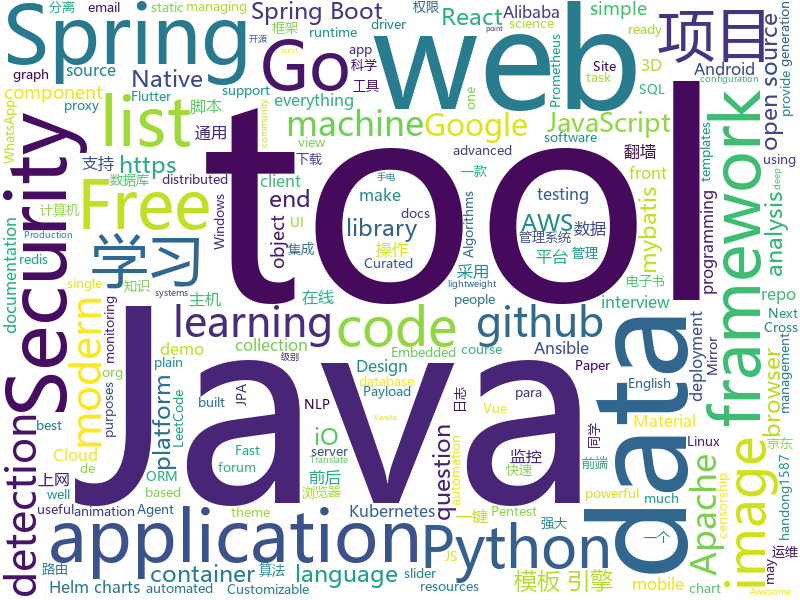

# 2020-11-06
See what the GitHub community is most excited about.

## python
+ [trape](https://github.com/jofpin/trape)(**146 stars today**): People tracker on the Internet: OSINT analysis and research tool by Jose Pino
+ [pifuhd](https://github.com/facebookresearch/pifuhd)(**35 stars today**): High-Resolution 3D Human Digitization from A Single Image.
+ [Mobile-Security-Framework-MobSF](https://github.com/MobSF/Mobile-Security-Framework-MobSF)(**225 stars today**): Mobile Security Framework (MobSF) is an automated, all-in-one mobile application (Android/iOS/Windows) pen-testing, malware analysis and security assessment framework capable of performing static and dynamic analysis.
+ [monkey](https://github.com/guardicore/monkey)(**66 stars today**): Infection Monkey - An automated pentest tool
+ [routersploit](https://github.com/threat9/routersploit)(**21 stars today**): Exploitation Framework for Embedded Devices
+ [GHunt](https://github.com/mxrch/GHunt)(**270 stars today**): 🕵️‍♂️Investigate Google Accounts with emails.
+ [python-cheatsheet](https://github.com/gto76/python-cheatsheet)(**212 stars today**): Comprehensive Python Cheatsheet
+ [microsoft-teams-class-attender](https://github.com/teja156/microsoft-teams-class-attender)(**19 stars today**): A bot to attend classes on microsoft teams
+ [NLP-progress](https://github.com/sebastianruder/NLP-progress)(**22 stars today**): Repository to track the progress in Natural Language Processing (NLP), including the datasets and the current state-of-the-art for the most common NLP tasks.
+ [incubator-superset](https://github.com/apache/incubator-superset)(**139 stars today**): Apache Superset is a Data Visualization and Data Exploration Platform
+ [pandas](https://github.com/pandas-dev/pandas)(**15 stars today**): Flexible and powerful data analysis / manipulation library for Python, providing labeled data structures similar to R data.frame objects, statistical functions, and much more
+ [SeleniumBase](https://github.com/seleniumbase/SeleniumBase)(**5 stars today**): 🏰🐉Python web automation & testing framework.✅🤖Fast, easy, & reliable.
+ [ML-From-Scratch](https://github.com/eriklindernoren/ML-From-Scratch)(**20 stars today**): Machine Learning From Scratch. Bare bones NumPy implementations of machine learning models and algorithms with a focus on accessibility. Aims to cover everything from linear regression to deep learning.
+ [FairMOT](https://github.com/ifzhang/FairMOT)(**5 stars today**): A simple baseline for one-shot multi-object tracking
+ [animal-matting](https://github.com/JizhiziLi/animal-matting)(**18 stars today**): Github repository for the paper End-to-end Animal Image Matting
+ [eth2.0-specs](https://github.com/ethereum/eth2.0-specs)(**10 stars today**): Ethereum 2.0 Specifications
+ [CheatSheetSeries](https://github.com/OWASP/CheatSheetSeries)(**13 stars today**): The OWASP Cheat Sheet Series was created to provide a concise collection of high value information on specific application security topics.
+ [hyperopt](https://github.com/hyperopt/hyperopt)(**8 stars today**): Distributed Asynchronous Hyperparameter Optimization in Python
+ [py-googletrans](https://github.com/ssut/py-googletrans)(**12 stars today**): (unofficial) Googletrans: Free and Unlimited Google translate API for Python. Translates totally free of charge.
+ [clinker](https://github.com/gamcil/clinker)(**14 stars today**): Gene cluster comparison figure generator
+ [PayloadsAllTheThings](https://github.com/swisskyrepo/PayloadsAllTheThings)(**37 stars today**): A list of useful payloads and bypass for Web Application Security and Pentest/CTF
+ [youtube-dl](https://github.com/l1ving/youtube-dl)(**241 stars today**): A fork of youtube-dl, for archival purposes.
+ [ansible](https://github.com/ansible/ansible)(**12 stars today**): Ansible is a radically simple IT automation platform that makes your applications and systems easier to deploy and maintain. Automate everything from code deployment to network configuration to cloud management, in a language that approaches plain English, using SSH, with no agents to install on remote systems. https://docs.ansible.com.
+ [dask](https://github.com/dask/dask)(**10 stars today**): Parallel computing with task scheduling
+ [CenterNet](https://github.com/xingyizhou/CenterNet)(**9 stars today**): Object detection, 3D detection, and pose estimation using center point detection:

## java
+ [eladmin](https://github.com/elunez/eladmin)(**67 stars today**): 项目基于 Spring Boot 2.1.0 、 Jpa、 Spring Security、redis、Vue的前后端分离的后台管理系统，项目采用分模块开发方式， 权限控制采用 RBAC，支持数据字典与数据权限管理，支持一键生成前后端代码，支持动态路由
+ [hello-algorithm](https://github.com/geekxh/hello-algorithm)(**97 stars today**): 🌍东半球最酷的学习项目 | 1、我写的三十万字算法图解 2、千本开源电子书 3、100 张思维导图 4、100 篇大厂面经 5、30 个学习专题🚀🚀🚀右上角点个 star，加入我们万人学习群！English Supported！
+ [dbeaver](https://github.com/dbeaver/dbeaver)(**46 stars today**): Free universal database tool and SQL client
+ [graal](https://github.com/oracle/graal)(**9 stars today**): GraalVM: Run Programs Faster Anywhere🚀
+ [LeetCodeAnimation](https://github.com/MisterBooo/LeetCodeAnimation)(**88 stars today**): Demonstrate all the questions on LeetCode in the form of animation.（用动画的形式呈现解LeetCode题目的思路）
+ [hadoop](https://github.com/apache/hadoop)(**1 stars today**): Apache Hadoop
+ [presto](https://github.com/prestodb/presto)(**91 stars today**): The official home of the Presto distributed SQL query engine for big data
+ [SpringAll](https://github.com/wuyouzhuguli/SpringAll)(**44 stars today**): 循序渐进，学习Spring Boot、Spring Boot & Shiro、Spring Batch、Spring Cloud、Spring Cloud Alibaba、Spring Security & Spring Security OAuth2，博客Spring系列源码：https://mrbird.cc
+ [spring-boot-demo](https://github.com/xkcoding/spring-boot-demo)(**53 stars today**): spring boot demo 是一个用来深度学习并实战 spring boot 的项目，目前总共包含 65 个集成demo，已经完成 53 个。 该项目已成功集成 actuator(监控)、admin(可视化监控)、logback(日志)、aopLog(通过AOP记录web请求日志)、统一异常处理(json级别和页面级别)、freemarker(模板引擎)、thymeleaf(模板引擎)、Beetl(模板引擎)、Enjoy(模板引擎)、JdbcTemplate(通用JDBC操作数据库)、JPA(强大的ORM框架)、mybatis(强大的ORM框架)、通用Mapper(快速操作Mybatis)、PageHelper(通用的Mybatis分页插件)、mybatis-plus(快速操作M…
+ [quarkus](https://github.com/quarkusio/quarkus)(**12 stars today**): Quarkus: Supersonic Subatomic Java.
+ [react-native-video](https://github.com/react-native-video/react-native-video)(**6 stars today**): A <Video /> component for react-native
+ [keycloak](https://github.com/keycloak/keycloak)(**9 stars today**): Open Source Identity and Access Management For Modern Applications and Services
+ [flink](https://github.com/apache/flink)(**16 stars today**): Apache Flink
+ [MPAndroidChart](https://github.com/PhilJay/MPAndroidChart)(**9 stars today**): A powerful🚀Android chart view / graph view library, supporting line- bar- pie- radar- bubble- and candlestick charts as well as scaling, panning and animations.
+ [rocketmq](https://github.com/apache/rocketmq)(**13 stars today**): Mirror of Apache RocketMQ
+ [tutorials](https://github.com/eugenp/tutorials)(**14 stars today**): Just Announced - "Learn Spring Security OAuth":
+ [arthas](https://github.com/alibaba/arthas)(**15 stars today**): Alibaba Java Diagnostic Tool Arthas/Alibaba Java诊断利器Arthas
+ [feign](https://github.com/OpenFeign/feign)(**6 stars today**): Feign makes writing java http clients easier
+ [netty-socketio](https://github.com/mrniko/netty-socketio)(**3 stars today**): Socket.IO server implemented on Java. Realtime java framework
+ [flutter_boost](https://github.com/alibaba/flutter_boost)(**5 stars today**): FlutterBoost is a Flutter plugin which enables hybrid integration of Flutter for your existing native apps with minimum efforts
+ [kafka](https://github.com/apache/kafka)(**10 stars today**): Mirror of Apache Kafka
+ [advanced-java](https://github.com/doocs/advanced-java)(**55 stars today**): 😮互联网 Java 工程师进阶知识完全扫盲：涵盖高并发、分布式、高可用、微服务、海量数据处理等领域知识，后端同学必看，前端同学也可学习
+ [vhr](https://github.com/lenve/vhr)(**13 stars today**): 微人事是一个前后端分离的人力资源管理系统，项目采用SpringBoot+Vue开发。
+ [tomcat](https://github.com/apache/tomcat)(**5 stars today**): Apache Tomcat
+ [jedis](https://github.com/redis/jedis)(**2 stars today**): A blazingly small and sane redis java client

## unknown
+ [100-days-of-python](https://github.com/appbrewery/100-days-of-python)(**134 stars today**): 100 Days of Code in Python
+ [design-resources-for-developers](https://github.com/bradtraversy/design-resources-for-developers)(**250 stars today**): Curated list of design and UI resources from stock photos, web templates, CSS frameworks, UI libraries, tools and much more
+ [architect-awesome](https://github.com/xingshaocheng/architect-awesome)(**93 stars today**): 后端架构师技术图谱
+ [CSBook](https://github.com/iCSToCS/CSBook)(**18 stars today**): 计算机类常用电子书整理，并且附带下载链接，包括Java，Python，Linux，Go，C，C++，数据结构与算法，人工智能，计算机基础，面试，设计模式，数据库，前端等书籍
+ [Free-Certifications](https://github.com/cloudcommunity/Free-Certifications)(**4 stars today**): Curated list of free courses & certifications
+ [javascript-questions](https://github.com/lydiahallie/javascript-questions)(**15 stars today**): A long list of (advanced) JavaScript questions, and their explanations✨
+ [awesome-object-detection](https://github.com/amusi/awesome-object-detection)(**6 stars today**): Awesome Object Detection based on handong1587 github: https://handong1587.github.io/deep_learning/2015/10/09/object-detection.html
+ [awesome-pentest](https://github.com/enaqx/awesome-pentest)(**19 stars today**): A collection of awesome penetration testing resources, tools and other shiny things
+ [vagas](https://github.com/frontendbr/vagas)(**11 stars today**): 🔬Espaço para divulgação de vagas para front-enders.
+ [Front-End-Checklist](https://github.com/thedaviddias/Front-End-Checklist)(**19 stars today**): 🗂The perfect Front-End Checklist for modern websites and meticulous developers
+ [what-happens-when](https://github.com/alex/what-happens-when)(**32 stars today**): An attempt to answer the age old interview question "What happens when you type google.com into your browser and press enter?"
+ [machine_learning_practico](https://github.com/elsonidoq/machine_learning_practico)(**3 stars today**): 
+ [datasharing](https://github.com/jtleek/datasharing)(**3 stars today**): The Leek group guide to data sharing
+ [dockprom](https://github.com/stefanprodan/dockprom)(**4 stars today**): Docker hosts and containers monitoring with Prometheus, Grafana, cAdvisor, NodeExporter and AlertManager
+ [gitignore](https://github.com/github/gitignore)(**43 stars today**): A collection of useful .gitignore templates
+ [Loon-Script](https://github.com/Tartarus2014/Loon-Script)(**3 stars today**): Loon脚本收集
+ [xiazai](https://github.com/xiaoshoudian/xiazai)(**79 stars today**): 小手电官方版本下载 小手电 翻墙 代理 科学上网 外网 加速器 梯子 路由 Xiaoshoudian proxy vpn censorship-circumvention censorship gfw accelerator
+ [applied-ml](https://github.com/eugeneyan/applied-ml)(**7 stars today**): 📚Papers by organizations sharing their work on applied data science & machine learning.
+ [xss-payload-list](https://github.com/payloadbox/xss-payload-list)(**5 stars today**): 🎯Cross Site Scripting ( XSS ) Vulnerability Payload List
+ [Interview_Question_for_Beginner](https://github.com/JaeYeopHan/Interview_Question_for_Beginner)(**8 stars today**): 👦👧Technical-Interview guidelines written for those who started studying programming. I wish you all the best.👾
+ [frontend](https://github.com/kottans/frontend)(**1 stars today**): Kottans frontend course🎓
+ [runtimelab](https://github.com/dotnet/runtimelab)(**11 stars today**): This repo is for experimentation and exploring new ideas that may or may not make it into the main dotnet/runtime repo.
+ [Cybersecurity](https://github.com/harisqazi1/Cybersecurity)(**89 stars today**): This is meant to assist people looking for entry level Cybersecurity jobs, as well as study up on skills that they can put on their resume.
+ [new-pac](https://github.com/Alvin9999/new-pac)(**23 stars today**): 科学上网/自由上网/翻墙/软件/方法，一键翻墙浏览器，免费shadowsocks/ss/ssr/v2ray/goflyway账号/节点分享，vps一键搭建脚本/教程
+ [WSL](https://github.com/microsoft/WSL)(**7 stars today**): Issues found on WSL

## javascript
+ [edex-ui](https://github.com/GitSquared/edex-ui)(**551 stars today**): A cross-platform, customizable science fiction terminal emulator with advanced monitoring & touchscreen support.
+ [scripts](https://github.com/lxk0301/scripts)(**137 stars today**): 京东薅羊毛工具, 京东水果、宠物、种豆等等
+ [grapesjs](https://github.com/artf/grapesjs)(**11 stars today**): Free and Open source Web Builder Framework. Next generation tool for building templates without coding
+ [Rocket.Chat](https://github.com/RocketChat/Rocket.Chat)(**15 stars today**): The ultimate Free Open Source Solution for team communications.
+ [AI-Expert-Roadmap](https://github.com/AMAI-GmbH/AI-Expert-Roadmap)(**550 stars today**): Roadmap to becoming an Artificial Intelligence Expert in 2020
+ [algorithm-visualizer](https://github.com/algorithm-visualizer/algorithm-visualizer)(**136 stars today**): 🎆Interactive Online Platform that Visualizes Algorithms from Code
+ [whatsapp-web.js](https://github.com/pedroslopez/whatsapp-web.js)(**15 stars today**): A WhatsApp client library for NodeJS that connects through the WhatsApp Web browser app
+ [clean-code-javascript](https://github.com/ryanmcdermott/clean-code-javascript)(**28 stars today**): 🛁Clean Code concepts adapted for JavaScript
+ [ffmpeg.wasm](https://github.com/ffmpegwasm/ffmpeg.wasm)(**326 stars today**): FFmpeg for browser and node, powered by WebAssembly
+ [slick](https://github.com/kenwheeler/slick)(**5 stars today**): the last carousel you'll ever need
+ [quill](https://github.com/quilljs/quill)(**36 stars today**): Quill is a modern WYSIWYG editor built for compatibility and extensibility.
+ [react-native-vector-icons](https://github.com/oblador/react-native-vector-icons)(**9 stars today**): Customizable Icons for React Native with support for NavBar/TabBar, image source and full styling.
+ [hexo-theme-fluid](https://github.com/fluid-dev/hexo-theme-fluid)(**13 stars today**): 🌊一款 Material Design 风格的 Hexo 主题 / An elegant Material-Design theme for Hexo
+ [swiper](https://github.com/nolimits4web/swiper)(**20 stars today**): Most modern mobile touch slider with hardware accelerated transitions
+ [react-native-swiper](https://github.com/leecade/react-native-swiper)(**5 stars today**): The best Swiper component for React Native.
+ [javascript](https://github.com/airbnb/javascript)(**31 stars today**): JavaScript Style Guide
+ [NodeBB](https://github.com/NodeBB/NodeBB)(**11 stars today**): Node.js based forum software built for the modern web
+ [jsPDF](https://github.com/MrRio/jsPDF)(**10 stars today**): Client-side JavaScript PDF generation for everyone.
+ [docs](https://github.com/github/docs)(**15 stars today**): The open-source repo for docs.github.com
+ [react-virtualized](https://github.com/bvaughn/react-virtualized)(**20 stars today**): React components for efficiently rendering large lists and tabular data
+ [joplin](https://github.com/laurent22/joplin)(**43 stars today**): Joplin - an open source note taking and to-do application with synchronization capabilities for Windows, macOS, Linux, Android and iOS. Forum: https://discourse.joplinapp.org/
+ [cropperjs](https://github.com/fengyuanchen/cropperjs)(**3 stars today**): JavaScript image cropper.
+ [samples](https://github.com/webrtc/samples)(**4 stars today**): WebRTC Web demos and samples
+ [spug](https://github.com/openspug/spug)(**8 stars today**): 开源运维平台：面向中小型企业设计的轻量级无Agent的自动化运维平台，整合了主机管理、主机批量执行、主机在线终端、文件在线上传下载、应用发布部署、在线任务计划、配置中心、监控、报警等一系列功能。
+ [noVNC](https://github.com/novnc/noVNC)(**7 stars today**): VNC client web application

## html
+ [nyt-2020-election-scraper](https://github.com/alex/nyt-2020-election-scraper)(**698 stars today**): 
+ [avancadev](https://github.com/codeedu/avancadev)(**26 stars today**): 
+ [ai-edu](https://github.com/microsoft/ai-edu)(**10 stars today**): AI education materials for Chinese students, teachers and IT professionals.
+ [hugo-book](https://github.com/alex-shpak/hugo-book)(**3 stars today**): Hugo documentation theme as simple as plain book
+ [html-css](https://github.com/gustavoguanabara/html-css)(**11 stars today**): Curso de HTML5 e CSS3
+ [argo-helm](https://github.com/argoproj/argo-helm)(**1 stars today**): ArgoProj Helm Charts
+ [kubespray](https://github.com/kubernetes-sigs/kubespray)(**5 stars today**): Deploy a Production Ready Kubernetes Cluster
+ [oneAPI-samples](https://github.com/oneapi-src/oneAPI-samples)(**2 stars today**): Samples for Intel oneAPI toolkits
+ [helm-charts](https://github.com/codecentric/helm-charts)(**0 stars today**): A curated set of Helm charts brought to you by codecentric
+ [embeddedsw](https://github.com/Xilinx/embeddedsw)(**0 stars today**): Xilinx Embedded Software (embeddedsw) Development
+ [fastText](https://github.com/facebookresearch/fastText)(**6 stars today**): Library for fast text representation and classification.
+ [helm-charts](https://github.com/DataDog/helm-charts)(**0 stars today**): Helm charts for Datadog products
+ [Front-end-Developer-Interview-Questions](https://github.com/h5bp/Front-end-Developer-Interview-Questions)(**13 stars today**): A list of helpful front-end related questions you can use to interview potential candidates, test yourself or completely ignore.
+ [helm-charts](https://github.com/prometheus-community/helm-charts)(**9 stars today**): Prometheus community Helm charts
+ [masonry](https://github.com/desandro/masonry)(**9 stars today**): 🏩Cascading grid layout plugin
+ [kolla-ansible](https://github.com/openstack/kolla-ansible)(**1 stars today**): Ansible deployment of the Kolla containers. Mirror of code maintained at opendev.org.
+ [ttv-ublock](https://github.com/odensc/ttv-ublock)(**29 stars today**): Blocking ads on Twitch with uBlock
+ [tiny-slider](https://github.com/ganlanyuan/tiny-slider)(**0 stars today**): Vanilla javascript slider for all purposes.
+ [openshift-docs](https://github.com/openshift/openshift-docs)(**0 stars today**): OpenShift 3 and 4 product and community documentation
+ [tagify](https://github.com/yairEO/tagify)(**5 stars today**): 🔖lightweight, efficient Tags input component in Vanilla JS / React / Angular / Vue
+ [glTF](https://github.com/KhronosGroup/glTF)(**4 stars today**): glTF – Runtime 3D Asset Delivery
+ [responsive-html-email-template](https://github.com/leemunroe/responsive-html-email-template)(**4 stars today**): A free simple responsive HTML email template
+ [docs](https://github.com/prometheus/docs)(**0 stars today**): Prometheus documentation: content and static site generator
+ [kubeasz](https://github.com/easzlab/kubeasz)(**9 stars today**): 使用Ansible脚本安装K8S集群，介绍组件交互原理，方便直接，不受国内网络环境影响
+ [yari](https://github.com/mdn/yari)(**11 stars today**): Next-gen MDN platform

## go
+ [HackBrowserData](https://github.com/moonD4rk/HackBrowserData)(**68 stars today**): Decrypt passwords/cookies/history/bookmarks from the browser. 一款可全平台运行的浏览器数据导出解密工具。
+ [argo-cd](https://github.com/argoproj/argo-cd)(**72 stars today**): Declarative continuous deployment for Kubernetes.
+ [knowledge](https://github.com/nikitavoloboev/knowledge)(**22 stars today**): Everything I know
+ [node_exporter](https://github.com/prometheus/node_exporter)(**4 stars today**): Exporter for machine metrics
+ [oauth2-proxy](https://github.com/oauth2-proxy/oauth2-proxy)(**4 stars today**): A reverse proxy that provides authentication with Google, Github or other providers.
+ [podman](https://github.com/containers/podman)(**11 stars today**): Podman: A tool for managing OCI containers and pods
+ [external-dns](https://github.com/kubernetes-sigs/external-dns)(**3 stars today**): Configure external DNS servers (AWS Route53, Google CloudDNS and others) for Kubernetes Ingresses and Services
+ [mongo-go-driver](https://github.com/mongodb/mongo-go-driver)(**6 stars today**): The Go driver for MongoDB
+ [beats](https://github.com/elastic/beats)(**7 stars today**): 🐠Beats - Lightweight shippers for Elasticsearch & Logstash
+ [charts](https://github.com/helm/charts)(**9 stars today**): Curated applications for Kubernetes
+ [aws-sdk-go](https://github.com/aws/aws-sdk-go)(**7 stars today**): AWS SDK for the Go programming language.
+ [go-github](https://github.com/google/go-github)(**3 stars today**): Go library for accessing the GitHub API
+ [alertmanager](https://github.com/prometheus/alertmanager)(**6 stars today**): Prometheus Alertmanager
+ [k3s](https://github.com/rancher/k3s)(**34 stars today**): Lightweight Kubernetes
+ [terraform-provider-aws](https://github.com/hashicorp/terraform-provider-aws)(**6 stars today**): Terraform AWS provider
+ [echo](https://github.com/labstack/echo)(**8 stars today**): High performance, minimalist Go web framework
+ [kubernetes](https://github.com/kubernetes/kubernetes)(**32 stars today**): Production-Grade Container Scheduling and Management
+ [pgx](https://github.com/jackc/pgx)(**10 stars today**): PostgreSQL driver and toolkit for Go
+ [sops](https://github.com/mozilla/sops)(**67 stars today**): Simple and flexible tool for managing secrets
+ [logrus](https://github.com/sirupsen/logrus)(**17 stars today**): Structured, pluggable logging for Go.
+ [mockery](https://github.com/vektra/mockery)(**7 stars today**): A mock code autogenerator for Golang
+ [mock](https://github.com/golang/mock)(**10 stars today**): GoMock is a mocking framework for the Go programming language.
+ [packer](https://github.com/hashicorp/packer)(**7 stars today**): Packer is a tool for creating identical machine images for multiple platforms from a single source configuration.
+ [dgraph](https://github.com/dgraph-io/dgraph)(**13 stars today**): Native GraphQL Database with graph backend
+ [copilot-cli](https://github.com/aws/copilot-cli)(**3 stars today**): The AWS Copilot CLI is a tool for developers to build, release and operate production ready containerized applications on Amazon ECS and AWS Fargate.

## WordCloud

