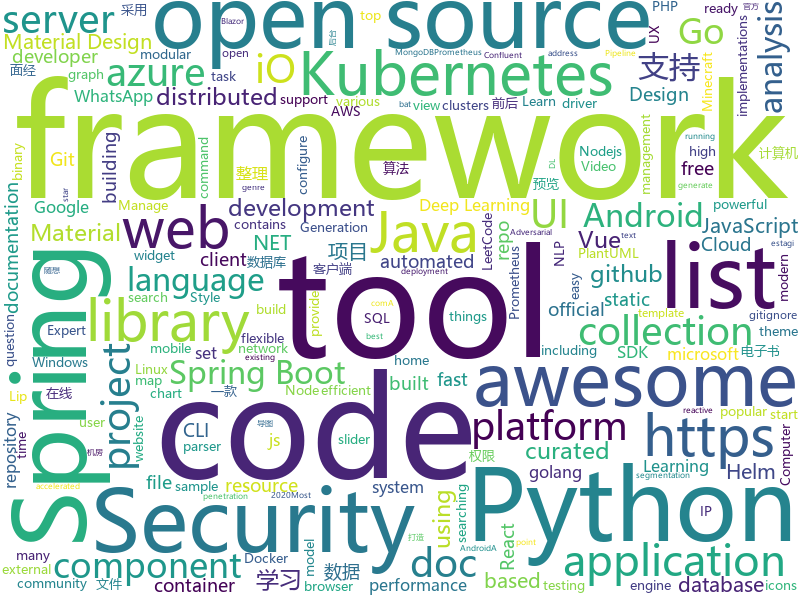

# 2020-11-07
See what the GitHub community is most excited about.

## python
+ [trape](https://github.com/jofpin/trape)(**215 stars today**): People tracker on the Internet: OSINT analysis and research tool by Jose Pino
+ [pifuhd](https://github.com/facebookresearch/pifuhd)(**207 stars today**): High-Resolution 3D Human Digitization from A Single Image.
+ [monkey](https://github.com/guardicore/monkey)(**258 stars today**): Infection Monkey - An automated pentest tool
+ [erpnext](https://github.com/frappe/erpnext)(**10 stars today**): Open Source Alternative to SAP
+ [python-cheatsheet](https://github.com/gto76/python-cheatsheet)(**265 stars today**): Comprehensive Python Cheatsheet
+ [cartography](https://github.com/lyft/cartography)(**42 stars today**): Cartography is a Python tool that consolidates infrastructure assets and the relationships between them in an intuitive graph view powered by a Neo4j database.
+ [haystack](https://github.com/deepset-ai/haystack)(**11 stars today**): 🔍Transformers at scale for question answering & neural search. Using NLP via a modular Retriever-Reader-Pipeline. Supporting DPR, Elasticsearch, HuggingFace's Modelhub...
+ [azure-sdk-for-python](https://github.com/Azure/azure-sdk-for-python)(**5 stars today**): This repository is for active development of the Azure SDK for Python. For consumers of the SDK we recommend visiting our public developer docs at https://docs.microsoft.com/en-us/python/azure/ or our versioned developer docs at https://azure.github.io/azure-sdk-for-python.
+ [celery](https://github.com/celery/celery)(**13 stars today**): Distributed Task Queue (development branch)
+ [RecBole](https://github.com/RUCAIBox/RecBole)(**108 stars today**): A unified, comprehensive and efficient recommendation library
+ [Mobile-Security-Framework-MobSF](https://github.com/MobSF/Mobile-Security-Framework-MobSF)(**190 stars today**): Mobile Security Framework (MobSF) is an automated, all-in-one mobile application (Android/iOS/Windows) pen-testing, malware analysis and security assessment framework capable of performing static and dynamic analysis.
+ [microsoft-teams-class-attender](https://github.com/teja156/microsoft-teams-class-attender)(**44 stars today**): A bot to attend classes on microsoft teams
+ [detectron2](https://github.com/facebookresearch/detectron2)(**28 stars today**): Detectron2 is FAIR's next-generation platform for object detection and segmentation.
+ [fastapi](https://github.com/tiangolo/fastapi)(**51 stars today**): FastAPI framework, high performance, easy to learn, fast to code, ready for production
+ [Wav2Lip](https://github.com/Rudrabha/Wav2Lip)(**19 stars today**): This repository contains the codes of "A Lip Sync Expert Is All You Need for Speech to Lip Generation In the Wild", published at ACM Multimedia 2020.
+ [routersploit](https://github.com/threat9/routersploit)(**116 stars today**): Exploitation Framework for Embedded Devices
+ [PyTorch-GAN](https://github.com/eriklindernoren/PyTorch-GAN)(**12 stars today**): PyTorch implementations of Generative Adversarial Networks.
+ [GHunt](https://github.com/mxrch/GHunt)(**282 stars today**): 🕵️‍♂️Investigate Google Accounts with emails.
+ [captum](https://github.com/pytorch/captum)(**5 stars today**): Model interpretability and understanding for PyTorch
+ [black](https://github.com/psf/black)(**17 stars today**): The uncompromising Python code formatter
+ [dgl](https://github.com/dmlc/dgl)(**9 stars today**): Python package built to ease deep learning on graph, on top of existing DL frameworks.
+ [Osmedeus](https://github.com/j3ssie/Osmedeus)(**9 stars today**): Fully automated offensive security framework for reconnaissance and vulnerability scanning
+ [iOS-DeviceSupport](https://github.com/iGhibli/iOS-DeviceSupport)(**26 stars today**): This repository holds the device support files for the iOS, and I will update it regularly.
+ [zhao](https://github.com/programthink/zhao)(**12 stars today**): 【编程随想】整理的《太子党关系网络》，专门揭露赵国的权贵
+ [qiskit](https://github.com/Qiskit/qiskit)(**6 stars today**): Qiskit is an open-source framework for working with noisy quantum computers at the level of pulses, circuits, and algorithms.

## java
+ [hello-algorithm](https://github.com/geekxh/hello-algorithm)(**231 stars today**): 🌍东半球最酷的学习项目 | 1、我写的三十万字算法图解 2、千本开源电子书 3、100 张思维导图 4、100 篇大厂面经 5、30 个学习专题🚀🚀🚀右上角点个 star，加入我们万人学习群！English Supported！
+ [dbeaver](https://github.com/dbeaver/dbeaver)(**253 stars today**): Free universal database tool and SQL client
+ [rocketmq](https://github.com/apache/rocketmq)(**17 stars today**): Mirror of Apache RocketMQ
+ [spring-petclinic](https://github.com/spring-projects/spring-petclinic)(**4 stars today**): A sample Spring-based application
+ [SpringAll](https://github.com/wuyouzhuguli/SpringAll)(**47 stars today**): 循序渐进，学习Spring Boot、Spring Boot & Shiro、Spring Batch、Spring Cloud、Spring Cloud Alibaba、Spring Security & Spring Security OAuth2，博客Spring系列源码：https://mrbird.cc
+ [eladmin](https://github.com/elunez/eladmin)(**67 stars today**): 项目基于 Spring Boot 2.1.0 、 Jpa、 Spring Security、redis、Vue的前后端分离的后台管理系统，项目采用分模块开发方式， 权限控制采用 RBAC，支持数据字典与数据权限管理，支持一键生成前后端代码，支持动态路由
+ [kkFileView](https://github.com/kekingcn/kkFileView)(**58 stars today**): 使用spring boot打造文件文档在线预览项目解决方案，支持doc、docx、ppt、pptx、xls、xlsx、zip、rar、mp4，mp3以及众多类文本如txt、html、xml、java、properties、sql、js、md、json、conf、ini、vue、php、py、bat、gitignore等文件在线预览
+ [dynmap](https://github.com/webbukkit/dynmap)(**4 stars today**): A set of Minecraft mods that provide a real time web-based map system for various Minecraft server implementations.
+ [ip2region](https://github.com/lionsoul2014/ip2region)(**46 stars today**): Ip2region is a offline IP location library with accuracy rate of 99.9% and 0.0x millseconds searching performance. DB file is ONLY a few megabytes with all IP address stored. binding for Java,PHP,C,Python,Nodejs,Golang,C#,lua. Binary,B-tree,Memory searching algorithm
+ [tutorials](https://github.com/eugenp/tutorials)(**17 stars today**): Just Announced - "Learn Spring Security OAuth":
+ [react-native-video](https://github.com/react-native-video/react-native-video)(**4 stars today**): A <Video /> component for react-native
+ [seata](https://github.com/seata/seata)(**17 stars today**): 🔥Seata is an easy-to-use, high-performance, open source distributed transaction solution.
+ [antlr4](https://github.com/antlr/antlr4)(**12 stars today**): ANTLR (ANother Tool for Language Recognition) is a powerful parser generator for reading, processing, executing, or translating structured text or binary files.
+ [checkstyle](https://github.com/checkstyle/checkstyle)(**6 stars today**): Checkstyle is a development tool to help programmers write Java code that adheres to a coding standard. By default it supports the Google Java Style Guide and Sun Code Conventions, but is highly configurable. It can be invoked with an ANT task and a command line program.
+ [elasticsearch](https://github.com/elastic/elasticsearch)(**31 stars today**): Open Source, Distributed, RESTful Search Engine
+ [views-widgets-samples](https://github.com/android/views-widgets-samples)(**9 stars today**): Multiple samples showing the best practices in views-widgets on Android.
+ [YCSB](https://github.com/brianfrankcooper/YCSB)(**5 stars today**): Yahoo! Cloud Serving Benchmark
+ [bazel](https://github.com/bazelbuild/bazel)(**10 stars today**): a fast, scalable, multi-language and extensible build system
+ [vert.x](https://github.com/eclipse-vertx/vert.x)(**6 stars today**): Vert.x is a tool-kit for building reactive applications on the JVM
+ [java](https://github.com/kubernetes-client/java)(**2 stars today**): Official Java client library for kubernetes
+ [epoxy](https://github.com/airbnb/epoxy)(**6 stars today**): Epoxy is an Android library for building complex screens in a RecyclerView
+ [otter](https://github.com/alibaba/otter)(**4 stars today**): 阿里巴巴分布式数据库同步系统(解决中美异地机房)
+ [micronaut-core](https://github.com/micronaut-projects/micronaut-core)(**5 stars today**): Micronaut Application Framework
+ [LeetCodeAnimation](https://github.com/MisterBooo/LeetCodeAnimation)(**75 stars today**): Demonstrate all the questions on LeetCode in the form of animation.（用动画的形式呈现解LeetCode题目的思路）
+ [quartz](https://github.com/quartz-scheduler/quartz)(**4 stars today**): Code for Quartz Scheduler

## unknown
+ [deep-learning-drizzle](https://github.com/kmario23/deep-learning-drizzle)(**72 stars today**): Drench yourself in Deep Learning, Reinforcement Learning, Machine Learning, Computer Vision, and NLP by learning from these exciting lectures!!
+ [EffectiveModernCppChinese](https://github.com/kelthuzadx/EffectiveModernCppChinese)(**171 stars today**): 《Effective Modern C++》翻译 - 2020更新中
+ [design-resources-for-developers](https://github.com/bradtraversy/design-resources-for-developers)(**279 stars today**): Curated list of design and UI resources from stock photos, web templates, CSS frameworks, UI libraries, tools and much more
+ [100-days-of-python](https://github.com/appbrewery/100-days-of-python)(**204 stars today**): 100 Days of Code in Python
+ [SuperTinyIcons](https://github.com/edent/SuperTinyIcons)(**499 stars today**): Under 1KB each! Super Tiny Icons are miniscule SVG versions of your favourite website and app logos
+ [1024app-android](https://github.com/yuuwill/1024app-android)(**10 stars today**): 草榴官方客户端，小草客户端，Android
+ [gitignore](https://github.com/github/gitignore)(**56 stars today**): A collection of useful .gitignore templates
+ [awesome-pentest](https://github.com/enaqx/awesome-pentest)(**17 stars today**): A collection of awesome penetration testing resources, tools and other shiny things
+ [whatsapp-ux-redesign](https://github.com/Codevickk/whatsapp-ux-redesign)(**55 stars today**): This is a whatsapp ux redesign i did. The aim of this project was to solidify my knowledge UX and UI design.
+ [vagas-junior-estagio](https://github.com/alinebastos/vagas-junior-estagio)(**29 stars today**): Empresas que constantemente oferecem vagas para junior e estagiários
+ [interview-questions](https://github.com/resumejob/interview-questions)(**163 stars today**): 根据超过 1700 篇真实面经整理的腾讯，阿里，字节跳动，Shopee，美团，滴滴高频面试题
+ [rfcs](https://github.com/vuejs/rfcs)(**8 stars today**): RFCs for substantial changes / feature additions to Vue core
+ [scientific-visualization-book](https://github.com/rougier/scientific-visualization-book)(**19 stars today**): ❗️WIP❗️An open access book on scientific visualization using python and matplotlib
+ [NewGrad-2021](https://github.com/Pitt-CSC/NewGrad-2021)(**5 stars today**): A collection of New Grad full time roles in SWE, Quant, and PM.
+ [red-kube](https://github.com/lightspin-tech/red-kube)(**20 stars today**): Red Team KubeCTL Cheat Sheet
+ [awesome-deep-learning](https://github.com/ChristosChristofidis/awesome-deep-learning)(**14 stars today**): A curated list of awesome Deep Learning tutorials, projects and communities.
+ [awesome-vue](https://github.com/vuejs/awesome-vue)(**43 stars today**): 🎉A curated list of awesome things related to Vue.js
+ [awesome-react](https://github.com/enaqx/awesome-react)(**22 stars today**): A collection of awesome things regarding React ecosystem
+ [C4-PlantUML](https://github.com/RicardoNiepel/C4-PlantUML)(**6 stars today**): C4-PlantUML combines the benefits of PlantUML and the C4 model for providing a simple way of describing and communicate software architectures
+ [Git-Commands](https://github.com/joshnh/Git-Commands)(**3 stars today**): A list of commonly used Git commands
+ [CSBook](https://github.com/iCSToCS/CSBook)(**20 stars today**): 计算机类常用电子书整理，并且附带下载链接，包括Java，Python，Linux，Go，C，C++，数据结构与算法，人工智能，计算机基础，面试，设计模式，数据库，前端等书籍
+ [games](https://github.com/leereilly/games)(**10 stars today**): 🎮A list of popular/awesome video games, add-ons, maps, etc. hosted on GitHub. Any genre. Any platform. Any engine.
+ [Awesome-Hacking](https://github.com/Hack-with-Github/Awesome-Hacking)(**46 stars today**): A collection of various awesome lists for hackers, pentesters and security researchers
+ [git-flight-rules](https://github.com/k88hudson/git-flight-rules)(**41 stars today**): Flight rules for git
+ [weekly](https://github.com/ruanyf/weekly)(**20 stars today**): 科技爱好者周刊，每周五发布

## javascript
+ [socket.io](https://github.com/socketio/socket.io)(**25 stars today**): Realtime application framework (Node.JS server)
+ [joplin](https://github.com/laurent22/joplin)(**58 stars today**): Joplin - an open source note taking and to-do application with synchronization capabilities for Windows, macOS, Linux, Android and iOS. Forum: https://discourse.joplinapp.org/
+ [wtfjs](https://github.com/denysdovhan/wtfjs)(**140 stars today**): 🤪A list of funny and tricky JavaScript examples
+ [react](https://github.com/facebook/react)(**80 stars today**): A declarative, efficient, and flexible JavaScript library for building user interfaces.
+ [plotly.js](https://github.com/plotly/plotly.js)(**11 stars today**): Open-source JavaScript charting library behind Plotly and Dash
+ [docs](https://github.com/github/docs)(**22 stars today**): The open-source repo for docs.github.com
+ [twitchAdSkip](https://github.com/Wilkolicious/twitchAdSkip)(**38 stars today**): 
+ [marked](https://github.com/markedjs/marked)(**28 stars today**): A markdown parser and compiler. Built for speed.
+ [kubernetes-external-secrets](https://github.com/godaddy/kubernetes-external-secrets)(**3 stars today**): Integrate external secret management systems with Kubernetes
+ [openlayers](https://github.com/openlayers/openlayers)(**5 stars today**): OpenLayers
+ [clean-code-javascript](https://github.com/ryanmcdermott/clean-code-javascript)(**31 stars today**): 🛁Clean Code concepts adapted for JavaScript
+ [simple-icons](https://github.com/simple-icons/simple-icons)(**19 stars today**): SVG icons for popular brands
+ [node-mongodb-native](https://github.com/mongodb/node-mongodb-native)(**10 stars today**): The Official MongoDB Node.js Driver
+ [mui-datatables](https://github.com/gregnb/mui-datatables)(**4 stars today**): Datatables for React using Material-UI - https://www.material-ui-datatables.com
+ [hexo-theme-fluid](https://github.com/fluid-dev/hexo-theme-fluid)(**19 stars today**): 🌊一款 Material Design 风格的 Hexo 主题 / An elegant Material-Design theme for Hexo
+ [nivo](https://github.com/plouc/nivo)(**11 stars today**): nivo provides a rich set of dataviz components, built on top of the awesome d3 and Reactjs libraries
+ [whatsapp-web.js](https://github.com/pedroslopez/whatsapp-web.js)(**18 stars today**): A WhatsApp client library for NodeJS that connects through the WhatsApp Web browser app
+ [corona-widget](https://github.com/rphl/corona-widget)(**20 stars today**): COVID-19 Inzidenz-Widget für iOS innerhalb Deutschlands🇩🇪(Kreis/Stadt + Bundesland + Trend)
+ [FileSaver.js](https://github.com/eligrey/FileSaver.js)(**18 stars today**): An HTML5 saveAs() FileSaver implementation
+ [material-ui](https://github.com/mui-org/material-ui)(**34 stars today**): React components for faster and easier web development. Build your own design system, or start with Material Design.
+ [AI-Expert-Roadmap](https://github.com/AMAI-GmbH/AI-Expert-Roadmap)(**575 stars today**): Roadmap to becoming an Artificial Intelligence Expert in 2020
+ [swiper](https://github.com/nolimits4web/swiper)(**30 stars today**): Most modern mobile touch slider with hardware accelerated transitions
+ [scripts](https://github.com/chavyleung/scripts)(**12 stars today**): 
+ [react-virtualized](https://github.com/bvaughn/react-virtualized)(**22 stars today**): React components for efficiently rendering large lists and tabular data
+ [thegreatsuspender](https://github.com/greatsuspender/thegreatsuspender)(**8 stars today**): A chrome extension for suspending all tabs to free up memory

## html
+ [nyt-2020-election-scraper](https://github.com/alex/nyt-2020-election-scraper)(**1,133 stars today**): 
+ [avancadev](https://github.com/codeedu/avancadev)(**46 stars today**): 
+ [swagger-codegen](https://github.com/swagger-api/swagger-codegen)(**7 stars today**): swagger-codegen contains a template-driven engine to generate documentation, API clients and server stubs in different languages by parsing your OpenAPI / Swagger definition.
+ [website](https://github.com/kubernetes/website)(**1 stars today**): Kubernetes website and documentation repo:
+ [QrGame](https://github.com/emeraldpowder/QrGame)(**3 stars today**): 
+ [helm-charts](https://github.com/prometheus-community/helm-charts)(**10 stars today**): Prometheus community Helm charts
+ [wpt](https://github.com/web-platform-tests/wpt)(**2 stars today**): Test suites for Web platform specs — including WHATWG, W3C, and others
+ [tiny-slider](https://github.com/ganlanyuan/tiny-slider)(**4 stars today**): Vanilla javascript slider for all purposes.
+ [MatBlazor](https://github.com/SamProf/MatBlazor)(**3 stars today**): Material Design components for Blazor and Razor Components
+ [cp-ansible](https://github.com/confluentinc/cp-ansible)(**0 stars today**): Ansible playbooks for the Confluent Platform
+ [ttv-ublock](https://github.com/odensc/ttv-ublock)(**25 stars today**): Blocking ads on Twitch with uBlock
+ [eks-charts](https://github.com/aws/eks-charts)(**2 stars today**): Amazon EKS Helm chart repository
+ [EIPs](https://github.com/ethereum/EIPs)(**7 stars today**): The Ethereum Improvement Proposal repository
+ [learning-library](https://github.com/oracle/learning-library)(**1 stars today**): Learning Material for Oracle Technologies
+ [home-assistant.io](https://github.com/home-assistant/home-assistant.io)(**7 stars today**): 📘Home Assistant User documentation
+ [awesome-compose](https://github.com/docker/awesome-compose)(**3 stars today**): Awesome Docker Compose samples
+ [kubespray](https://github.com/kubernetes-sigs/kubespray)(**5 stars today**): Deploy a Production Ready Kubernetes Cluster
+ [matrix-docker-ansible-deploy](https://github.com/spantaleev/matrix-docker-ansible-deploy)(**2 stars today**): Matrix (An open network for secure, decentralized communication) server setup using Ansible and Docker
+ [docs](https://github.com/prometheus/docs)(**0 stars today**): Prometheus documentation: content and static site generator
+ [startbootstrap-sb-admin-2](https://github.com/StartBootstrap/startbootstrap-sb-admin-2)(**4 stars today**): A free, open source, Bootstrap admin theme created by Start Bootstrap
+ [phpstan](https://github.com/phpstan/phpstan)(**3 stars today**): PHP Static Analysis Tool - discover bugs in your code without running it!
+ [helm-charts](https://github.com/codecentric/helm-charts)(**0 stars today**): A curated set of Helm charts brought to you by codecentric
+ [dotnet](https://github.com/microsoft/dotnet)(**4 stars today**): This repo is the official home of .NET on GitHub. It's a great starting point to find many .NET OSS projects from Microsoft and the community, including many that are part of the .NET Foundation.
+ [uikit](https://github.com/uikit/uikit)(**7 stars today**): A lightweight and modular front-end framework for developing fast and powerful web interfaces
+ [docker-development-youtube-series](https://github.com/marcel-dempers/docker-development-youtube-series)(**8 stars today**): 

## go
+ [terraform-provider-aws](https://github.com/hashicorp/terraform-provider-aws)(**9 stars today**): Terraform AWS provider
+ [helmfile](https://github.com/roboll/helmfile)(**10 stars today**): Deploy Kubernetes Helm Charts
+ [server](https://github.com/screego/server)(**21 stars today**): screen sharing for developers https://screego.net/
+ [external-dns](https://github.com/kubernetes-sigs/external-dns)(**7 stars today**): Configure external DNS servers (AWS Route53, Google CloudDNS and others) for Kubernetes Ingresses and Services
+ [HackBrowserData](https://github.com/moonD4rk/HackBrowserData)(**190 stars today**): Decrypt passwords/cookies/history/bookmarks from the browser. 一款可全平台运行的浏览器数据导出解密工具。
+ [knowledge](https://github.com/nikitavoloboev/knowledge)(**33 stars today**): Everything I know
+ [sops](https://github.com/mozilla/sops)(**79 stars today**): Simple and flexible tool for managing secrets
+ [go-cqhttp](https://github.com/Mrs4s/go-cqhttp)(**13 stars today**): cqhttp的golang实现，轻量、原生跨平台.
+ [terraform-provider-azurerm](https://github.com/terraform-providers/terraform-provider-azurerm)(**3 stars today**): Terraform provider for Azure Resource Manager
+ [k3s](https://github.com/rancher/k3s)(**37 stars today**): Lightweight Kubernetes
+ [argo-cd](https://github.com/argoproj/argo-cd)(**44 stars today**): Declarative continuous deployment for Kubernetes.
+ [mongo-go-driver](https://github.com/mongodb/mongo-go-driver)(**7 stars today**): The Go driver for MongoDB
+ [prometheus-operator](https://github.com/prometheus-operator/prometheus-operator)(**8 stars today**): Prometheus Operator creates/configures/manages Prometheus clusters atop Kubernetes
+ [mock](https://github.com/golang/mock)(**10 stars today**): GoMock is a mocking framework for the Go programming language.
+ [k9s](https://github.com/derailed/k9s)(**26 stars today**): 🐶Kubernetes CLI To Manage Your Clusters In Style!
+ [chaos-mesh](https://github.com/chaos-mesh/chaos-mesh)(**12 stars today**): A Chaos Engineering Platform for Kubernetes.
+ [fyne](https://github.com/fyne-io/fyne)(**20 stars today**): Cross platform GUI in Go based on Material Design
+ [rancher](https://github.com/rancher/rancher)(**12 stars today**): Complete container management platform
+ [tidb](https://github.com/pingcap/tidb)(**11 stars today**): TiDB is an open source distributed HTAP database compatible with the MySQL protocol
+ [logrus](https://github.com/sirupsen/logrus)(**18 stars today**): Structured, pluggable logging for Go.
+ [eksctl](https://github.com/weaveworks/eksctl)(**4 stars today**): The official CLI for Amazon EKS
+ [go-sqlmock](https://github.com/DATA-DOG/go-sqlmock)(**6 stars today**): Sql mock driver for golang to test database interactions
+ [dolt](https://github.com/dolthub/dolt)(**14 stars today**): Dolt – It's Git for Data
+ [moby](https://github.com/moby/moby)(**16 stars today**): Moby Project - a collaborative project for the container ecosystem to assemble container-based systems
+ [cli](https://github.com/docker/cli)(**5 stars today**): The Docker CLI

## WordCloud

