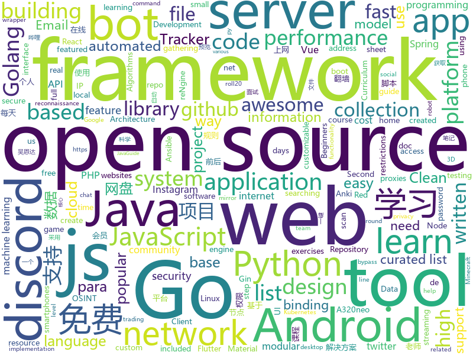

# 2020-11-09
See what the GitHub community is most excited about.

## python
+ [pifuhd](https://github.com/facebookresearch/pifuhd)(**815 stars today**): High-Resolution 3D Human Digitization from A Single Image.
+ [tinygrad](https://github.com/geohot/tinygrad)(**172 stars today**): You like pytorch? You like micrograd? You love tinygrad!❤️
+ [system-design-primer](https://github.com/donnemartin/system-design-primer)(**89 stars today**): Learn how to design large-scale systems. Prep for the system design interview. Includes Anki flashcards.
+ [monkey](https://github.com/guardicore/monkey)(**871 stars today**): Infection Monkey - An automated pentest tool
+ [Python](https://github.com/TheAlgorithms/Python)(**75 stars today**): All Algorithms implemented in Python
+ [sherlock](https://github.com/sherlock-project/sherlock)(**42 stars today**): 🔎Hunt down social media accounts by username across social networks
+ [trape](https://github.com/jofpin/trape)(**105 stars today**): People tracker on the Internet: OSINT analysis and research tool by Jose Pino
+ [scikit-learn](https://github.com/scikit-learn/scikit-learn)(**20 stars today**): scikit-learn: machine learning in Python
+ [bpytop](https://github.com/aristocratos/bpytop)(**40 stars today**): Linux/OSX/FreeBSD resource monitor
+ [core](https://github.com/home-assistant/core)(**21 stars today**): 🏡Open source home automation that puts local control and privacy first
+ [InstaPy](https://github.com/timgrossmann/InstaPy)(**8 stars today**): 📷Instagram Bot - Tool for automated Instagram interactions
+ [pytorch-original-transformer](https://github.com/gordicaleksa/pytorch-original-transformer)(**89 stars today**): My implementation of the original transformer model (Vaswani et al.). I've additionally included the playground.py file for visualizing otherwise seemingly hard concepts. Currently included IWSLT pretrained models.
+ [anki](https://github.com/ankitects/anki)(**8 stars today**): Anki for desktop computers
+ [gym](https://github.com/openai/gym)(**6 stars today**): A toolkit for developing and comparing reinforcement learning algorithms.
+ [modmail](https://github.com/kyb3r/modmail)(**4 stars today**): A feature rich discord Modmail bot
+ [QUANTAXIS](https://github.com/QUANTAXIS/QUANTAXIS)(**8 stars today**): QUANTAXIS 支持任务调度 分布式部署的 股票/期货/期权/港股/虚拟货币 数据/回测/模拟/交易/可视化/多账户 纯本地量化解决方案
+ [discord.py](https://github.com/Rapptz/discord.py)(**15 stars today**): An API wrapper for Discord written in Python.
+ [thenewboston-python-client](https://github.com/thenewboston-developers/thenewboston-python-client)(**9 stars today**): Python library for thenewboston.
+ [scrapy](https://github.com/scrapy/scrapy)(**12 stars today**): Scrapy, a fast high-level web crawling & scraping framework for Python.
+ [kivy](https://github.com/kivy/kivy)(**10 stars today**): Open source UI framework written in Python, running on Windows, Linux, macOS, Android and iOS
+ [Real-Time-Voice-Cloning](https://github.com/CorentinJ/Real-Time-Voice-Cloning)(**26 stars today**): Clone a voice in 5 seconds to generate arbitrary speech in real-time
+ [backtrader](https://github.com/mementum/backtrader)(**6 stars today**): Python Backtesting library for trading strategies
+ [OctoPrint](https://github.com/OctoPrint/OctoPrint)(**4 stars today**): OctoPrint is the snappy web interface for your 3D printer!
+ [fastapi](https://github.com/tiangolo/fastapi)(**37 stars today**): FastAPI framework, high performance, easy to learn, fast to code, ready for production
+ [machine_learning_examples](https://github.com/lazyprogrammer/machine_learning_examples)(**7 stars today**): A collection of machine learning examples and tutorials.

## java
+ [hello-algorithm](https://github.com/geekxh/hello-algorithm)(**304 stars today**): 🌍东半球最酷的学习项目 | 1、我写的三十万字算法图解 2、千本开源电子书 3、100 张思维导图 4、100 篇大厂面经 5、30 个学习专题🚀🚀🚀右上角点个 star，加入我们万人学习群！English Supported！
+ [Mindustry](https://github.com/Anuken/Mindustry)(**22 stars today**): A sandbox tower defense game
+ [BILIBILI-HELPER](https://github.com/JunzhouLiu/BILIBILI-HELPER)(**55 stars today**): 利用GitHub Action定时任务实现B站，哔哩哔哩（Bilibili）自动签到每日自动投币，银瓜子兑换硬币，领取大会员福利，大会员月底给自己充电等。每天轻松获取65经验值。赶快和我一起成为Lv6吧！
+ [easy163](https://github.com/ndroi/easy163)(**37 stars today**): 安卓端一键解锁网易云音乐，无须 ROOT
+ [OpenBot](https://github.com/intel-isl/OpenBot)(**10 stars today**): OpenBot leverages smartphones as brains for low-cost robots. We have designed a small electric vehicle that costs about $50 and serves as a robot body. Our software stack for Android smartphones supports advanced robotics workloads such as person following and real-time autonomous navigation.
+ [NewPipe](https://github.com/TeamNewPipe/NewPipe)(**32 stars today**): A libre lightweight streaming front-end for Android.
+ [eladmin](https://github.com/elunez/eladmin)(**67 stars today**): 项目基于 Spring Boot 2.1.0 、 Jpa、 Spring Security、redis、Vue的前后端分离的后台管理系统，项目采用分模块开发方式， 权限控制采用 RBAC，支持数据字典与数据权限管理，支持一键生成前后端代码，支持动态路由
+ [tech-interview-for-developer](https://github.com/gyoogle/tech-interview-for-developer)(**24 stars today**): 👶🏻 신입 개발자 전공 지식 & 기술 면접 백과사전📖
+ [EdXposed](https://github.com/ElderDrivers/EdXposed)(**8 stars today**): Elder driver Xposed Framework.
+ [ip2region](https://github.com/lionsoul2014/ip2region)(**113 stars today**): Ip2region is a offline IP location library with accuracy rate of 99.9% and 0.0x millseconds searching performance. DB file is ONLY a few megabytes with all IP address stored. binding for Java,PHP,C,Python,Nodejs,Golang,C#,lua. Binary,B-tree,Memory searching algorithm
+ [FairEmail](https://github.com/M66B/FairEmail)(**5 stars today**): Fully featured, open source, privacy friendly email app for Android
+ [kkFileView](https://github.com/kekingcn/kkFileView)(**74 stars today**): 使用spring boot打造文件文档在线预览项目解决方案，支持doc、docx、ppt、pptx、xls、xlsx、zip、rar、mp4，mp3以及众多类文本如txt、html、xml、java、properties、sql、js、md、json、conf、ini、vue、php、py、bat、gitignore等文件在线预览
+ [data-structures](https://github.com/williamfiset/data-structures)(**6 stars today**): A collection of powerful data structures
+ [MinecraftForge](https://github.com/MinecraftForge/MinecraftForge)(**6 stars today**): Modifications to the Minecraft base files to assist in compatibility between mods.
+ [NetGuard](https://github.com/M66B/NetGuard)(**2 stars today**): A simple way to block access to the internet per app
+ [libgdx](https://github.com/libgdx/libgdx)(**12 stars today**): Desktop/Android/HTML5/iOS Java game development framework
+ [JavaGuide](https://github.com/Snailclimb/JavaGuide)(**72 stars today**): 「Java学习+面试指南」一份涵盖大部分Java程序员所需要掌握的核心知识。准备 Java 面试，首选 JavaGuide！
+ [material-components-android](https://github.com/material-components/material-components-android)(**6 stars today**): Modular and customizable Material Design UI components for Android
+ [termux-app](https://github.com/termux/termux-app)(**7 stars today**): Android terminal and Linux environment - app repository.
+ [Signal-Server](https://github.com/signalapp/Signal-Server)(**9 stars today**): Server supporting the Signal Private Messenger applications on Android, Desktop, and iOS
+ [JDA](https://github.com/DV8FromTheWorld/JDA)(**9 stars today**): Java wrapper for the popular chat & VOIP service: Discord https://discord.com
+ [BTNotifierAndroid](https://github.com/RomascuAndrei/BTNotifierAndroid)(**0 stars today**): 
+ [amidst](https://github.com/toolbox4minecraft/amidst)(**4 stars today**): Advanced Minecraft Interface and Data/Structure Tracking
+ [RandomImage](https://github.com/unline2/RandomImage)(**82 stars today**): 一个能够获取随机图片的 Api，使用 SpringBoot 构建
+ [androrat](https://github.com/wszf/androrat)(**1 stars today**): androrat

## unknown
+ [100-days-of-python](https://github.com/appbrewery/100-days-of-python)(**520 stars today**): 100 Days of Code in Python
+ [php-programming-best-practices](https://github.com/TiendaNube/php-programming-best-practices)(**27 stars today**): Referencia para los desarrolladores de Tiendanube y para la comunidad de PHP.
+ [red-kube](https://github.com/lightspin-tech/red-kube)(**71 stars today**): Red Team KubeCTL Cheat Sheet
+ [TrackersListCollection](https://github.com/XIU2/TrackersListCollection)(**12 stars today**): 🎈Updated daily! A list of popular BitTorrent Trackers! / 每天更新！全网热门 BT Tracker 列表！
+ [first-contributions](https://github.com/firstcontributions/first-contributions)(**73 stars today**): 🚀✨Help beginners to contribute to open source projects
+ [vagas-junior-estagio](https://github.com/alinebastos/vagas-junior-estagio)(**17 stars today**): Empresas que constantemente oferecem vagas para junior e estagiários
+ [Xiaomi_Kernel_OpenSource](https://github.com/MiCode/Xiaomi_Kernel_OpenSource)(**0 stars today**): Xiaomi Mobile Phone Kernel OpenSource
+ [brunch](https://github.com/sebanc/brunch)(**6 stars today**): Boot ChromeOS on x86_64 PC (supports most Intel CPU/GPU or AMD Stoney Ridge)
+ [free](https://github.com/freefq/free)(**32 stars today**): 免费科学上网,免费翻墙,免费ssr,免费v2ray,免费vmess节点,免费节点,翻墙,蓝灯,谷歌商店
+ [rfcs](https://github.com/vuejs/rfcs)(**10 stars today**): RFCs for substantial changes / feature additions to Vue core
+ [Loon-Script](https://github.com/Tartarus2014/Loon-Script)(**2 stars today**): Loon脚本收集
+ [1](https://github.com/XNM6/1)(**3 stars today**): 直播平台回家页
+ [You-Dont-Know-JS](https://github.com/getify/You-Dont-Know-JS)(**35 stars today**): A book series on JavaScript. @YDKJS on twitter.
+ [flutter-beginners-tutorial](https://github.com/iamshaunjp/flutter-beginners-tutorial)(**3 stars today**): All course files for the Flutter Beginners playlist on The Net Ninja YouTube channel.
+ [ru-test-assignments](https://github.com/Hexlet/ru-test-assignments)(**3 stars today**): Тестовые задания для самостоятельного выполнения от разных it компаний
+ [abap-platform-rap-opensap](https://github.com/SAP-samples/abap-platform-rap-opensap)(**4 stars today**): Samples for the openSAP course "Building Apps with the ABAP RESTful Application Programming model (RAP)."
+ [fancyss_history_package](https://github.com/hq450/fancyss_history_package)(**6 stars today**): 科学上网插件的离线安装包储存在这里
+ [awesome-react](https://github.com/enaqx/awesome-react)(**20 stars today**): A collection of awesome things regarding React ecosystem
+ [COVID-19](https://github.com/CSSEGISandData/COVID-19)(**10 stars today**): Novel Coronavirus (COVID-19) Cases, provided by JHU CSSE
+ [Awesome-Hacking](https://github.com/Hack-with-Github/Awesome-Hacking)(**32 stars today**): A collection of various awesome lists for hackers, pentesters and security researchers
+ [Probable-Wordlists](https://github.com/berzerk0/Probable-Wordlists)(**2 stars today**): Version 2 is live! Wordlists sorted by probability originally created for password generation and testing - make sure your passwords aren't popular!
+ [CKAD-exercises](https://github.com/dgkanatsios/CKAD-exercises)(**10 stars today**): A set of exercises to prepare for Certified Kubernetes Application Developer exam by Cloud Native Computing Foundation
+ [awesome-iptv](https://github.com/iptv-org/awesome-iptv)(**4 stars today**): A curated list of resources related to IPTV
+ [Flutter-Course-Resources](https://github.com/londonappbrewery/Flutter-Course-Resources)(**7 stars today**): Learn to Code While Building Apps - The Complete Flutter Development Bootcamp
+ [curriculum](https://github.com/cncf/curriculum)(**3 stars today**): 📚Open Source Curriculum for CNCF Certification Courses

## javascript
+ [socket.io](https://github.com/socketio/socket.io)(**275 stars today**): Realtime application framework (Node.JS server)
+ [rengine](https://github.com/yogeshojha/rengine)(**31 stars today**): reNgine is an automated reconnaissance framework meant for gathering information during penetration testing of web applications. reNgine has customizable scan engines, which can be used to scan the websites, endpoints, and gather information.
+ [docs](https://github.com/github/docs)(**18 stars today**): The open-source repo for docs.github.com
+ [venom](https://github.com/orkestral/venom)(**12 stars today**): Venom is a high-performance system developed with JavaScript to create a bot for WhatsApp
+ [storybooks](https://github.com/bradtraversy/storybooks)(**6 stars today**): Node.js app with Google OAuth
+ [Scriptable](https://github.com/dompling/Scriptable)(**19 stars today**): 
+ [wtfjs](https://github.com/denysdovhan/wtfjs)(**168 stars today**): 🤪A list of funny and tricky JavaScript examples
+ [fspackages](https://github.com/Working-Title-MSFS-Mods/fspackages)(**9 stars today**): Working Title FS Packages
+ [QuantumultX](https://github.com/Orz-3/QuantumultX)(**5 stars today**): 
+ [opensource.guide](https://github.com/github/opensource.guide)(**10 stars today**): 📚Community guides for open source creators
+ [ios_rule_script](https://github.com/blackmatrix7/ios_rule_script)(**4 stars today**): iOS平台的分流规则、复写规则和一些自动化脚本。
+ [p5.js](https://github.com/processing/p5.js)(**11 stars today**): p5.js is a client-side JS platform that empowers artists, designers, students, and anyone to learn to code and express themselves creatively on the web. It is based on the core principles of Processing. http://twitter.com/p5xjs —
+ [Motrix](https://github.com/agalwood/Motrix)(**16 stars today**): A full-featured download manager.
+ [a32nx](https://github.com/flybywiresim/a32nx)(**9 stars today**): The A32NX Project is a community driven open source project to create a free Airbus A320neo in Microsoft Flight Simulator that is as close to reality as possible. It aims to enhance the default A320neo by improving the systems depth and functionality to bring it up to payware-level, all for free.
+ [react-fundamentals](https://github.com/kentcdodds/react-fundamentals)(**7 stars today**): Material for my React Fundamentals Workshop
+ [30-Days-Of-JavaScript](https://github.com/Asabeneh/30-Days-Of-JavaScript)(**9 stars today**): 30 days of JavaScript programming challenge is a step by step guide to learn JavaScript programming language in 30 days
+ [bip39](https://github.com/iancoleman/bip39)(**2 stars today**): A web tool for converting BIP39 mnemonic codes
+ [next-translate](https://github.com/vinissimus/next-translate)(**3 stars today**): i18n tool for Next.js 10🌍- Load page translations and use them in an easy way!
+ [OpenAPI-Specification](https://github.com/OAI/OpenAPI-Specification)(**14 stars today**): The OpenAPI Specification Repository
+ [RSSHub](https://github.com/DIYgod/RSSHub)(**15 stars today**): 🍰Everything is RSSible
+ [MagicMirror](https://github.com/MichMich/MagicMirror)(**8 stars today**): MagicMirror² is an open source modular smart mirror platform. With a growing list of installable modules, the MagicMirror² allows you to convert your hallway or bathroom mirror into your personal assistant.
+ [h5ai](https://github.com/lrsjng/h5ai)(**8 stars today**): HTTP web server index for Apache httpd, lighttpd and nginx.
+ [coc.nvim](https://github.com/neoclide/coc.nvim)(**22 stars today**): Intellisense engine for Vim8 & Neovim, full language server protocol support as VSCode
+ [cgm-remote-monitor](https://github.com/nightscout/cgm-remote-monitor)(**3 stars today**): nightscout web monitor
+ [freeCodeCamp](https://github.com/freeCodeCamp/freeCodeCamp)(**49 stars today**): freeCodeCamp.org's open source codebase and curriculum. Learn to code at home.

## html
+ [ansible-os-hardening](https://github.com/dev-sec/ansible-os-hardening)(**13 stars today**): This Ansible role provides numerous security-related configurations, providing all-round base protection.
+ [awesome-piracy](https://github.com/Igglybuff/awesome-piracy)(**10 stars today**): A curated list of awesome warez and piracy links
+ [machine-learning-systems-design](https://github.com/chiphuyen/machine-learning-systems-design)(**23 stars today**): A booklet on machine learning systems design with exercises
+ [Coursera-ML-AndrewNg-Notes](https://github.com/fengdu78/Coursera-ML-AndrewNg-Notes)(**17 stars today**): 吴恩达老师的机器学习课程个人笔记
+ [deeplearning_ai_books](https://github.com/fengdu78/deeplearning_ai_books)(**13 stars today**): deeplearning.ai（吴恩达老师的深度学习课程笔记及资源）
+ [QrGame](https://github.com/emeraldpowder/QrGame)(**1 stars today**): 
+ [avancadev](https://github.com/codeedu/avancadev)(**29 stars today**): 
+ [blackeye](https://github.com/An0nUD4Y/blackeye)(**3 stars today**): The ultimate phishing tool with 38 websites available!
+ [ESPEasy](https://github.com/letscontrolit/ESPEasy)(**4 stars today**): Easy MultiSensor device based on ESP8266
+ [loruki-website](https://github.com/bradtraversy/loruki-website)(**5 stars today**): Cloud hosting website
+ [discord-bot-client](https://github.com/Flam3rboy/discord-bot-client)(**3 stars today**): A custom version of discord, with bot login support
+ [shellphish](https://github.com/suljot/shellphish)(**4 stars today**): Phishing Tool for Instagram, Facebook, Twitter, Snapchat, Github
+ [gentelella](https://github.com/ColorlibHQ/gentelella)(**3 stars today**): Free Bootstrap 4 Admin Dashboard Template
+ [Server](https://github.com/PanDownloadServer/Server)(**39 stars today**): PanDownload的个人维护版本
+ [OpenClash](https://github.com/vernesong/OpenClash)(**7 stars today**): A Clash Client For OpenWrt
+ [chatcord](https://github.com/bradtraversy/chatcord)(**0 stars today**): Realtime chat app with rooms
+ [sdk-javascript](https://github.com/vadootvpeer/sdk-javascript)(**14 stars today**): 🚀Vadootv🚀p2p cdn javascript sdk, Reduce video streaming costs upto 90% and improve scalability by 6x
+ [ctf-wiki](https://github.com/ctf-wiki/ctf-wiki)(**7 stars today**): CTF Wiki Online. Come and join us, we need you!
+ [roll20-character-sheets](https://github.com/Roll20/roll20-character-sheets)(**1 stars today**): Character sheet templates created by the community for use in Roll20 VTT. Contact team@roll20.net if critical hotfixes need to be requested.
+ [openwrt-packages](https://github.com/kenzok8/openwrt-packages)(**5 stars today**): openwet常用软件包
+ [fluxion](https://github.com/FluxionNetwork/fluxion)(**4 stars today**): Fluxion is a remake of linset by vk496 with enhanced functionality.
+ [matrix-docker-ansible-deploy](https://github.com/spantaleev/matrix-docker-ansible-deploy)(**1 stars today**): Matrix (An open network for secure, decentralized communication) server setup using Ansible and Docker
+ [purple-states](https://github.com/geealbers/purple-states)(**2 stars today**): Traditional U.S. electoral maps not only illustrate polarization, they can exacerbate it. No state is strictly red or blue, they are all shades of purple.
+ [learning-area](https://github.com/mdn/learning-area)(**3 stars today**): Github repo for the MDN Learning Area.
+ [zenbot](https://github.com/DeviaVir/zenbot)(**3 stars today**): Zenbot is a command-line cryptocurrency trading bot using Node.js and MongoDB.

## go
+ [clash](https://github.com/Dreamacro/clash)(**31 stars today**): A rule-based tunnel in Go.
+ [gin](https://github.com/gin-gonic/gin)(**41 stars today**): Gin is a HTTP web framework written in Go (Golang). It features a Martini-like API with much better performance -- up to 40 times faster. If you need smashing performance, get yourself some Gin.
+ [ffuf](https://github.com/ffuf/ffuf)(**13 stars today**): Fast web fuzzer written in Go
+ [v2ray-core](https://github.com/v2ray/v2ray-core)(**14 stars today**): A platform for building proxies to bypass network restrictions.
+ [v2ray-core](https://github.com/v2fly/v2ray-core)(**47 stars today**): A platform for building proxies to bypass network restrictions.
+ [automuteus](https://github.com/denverquane/automuteus)(**10 stars today**): Discord Bot to automute Among Us players at round transitions, in conjunction with https://github.com/denverquane/amonguscapture
+ [dns](https://github.com/miekg/dns)(**5 stars today**): DNS library in Go
+ [wild-workouts-go-ddd-example](https://github.com/ThreeDotsLabs/wild-workouts-go-ddd-example)(**21 stars today**): Complete serverless application to show how to apply DDD, Clean Architecture, and CQRS by practical refactoring of a Go project.
+ [prysm](https://github.com/prysmaticlabs/prysm)(**8 stars today**): Go implementation of the Ethereum 2.0 blockchain
+ [bettercap](https://github.com/bettercap/bettercap)(**15 stars today**): The Swiss Army knife for 802.11, BLE and Ethernet networks reconnaissance and MITM attacks.
+ [discordgo](https://github.com/bwmarrin/discordgo)(**3 stars today**): (Golang) Go bindings for Discord
+ [PhoneInfoga](https://github.com/sundowndev/PhoneInfoga)(**14 stars today**): Advanced information gathering & OSINT framework for phone numbers
+ [tinygo](https://github.com/tinygo-org/tinygo)(**6 stars today**): Go compiler for small places. Microcontrollers, WebAssembly, and command-line tools. Based on LLVM.
+ [frp](https://github.com/fatedier/frp)(**34 stars today**): A fast reverse proxy to help you expose a local server behind a NAT or firewall to the internet.
+ [zpan](https://github.com/saltbo/zpan)(**37 stars today**): A self-host cloud disk base on the cloud storage./ 一个基于云存储的网盘系统，用于自建私人网盘或企业网盘。
+ [go-clean-arch](https://github.com/bxcodec/go-clean-arch)(**27 stars today**): Go (Golang) Clean Architecture based on Reading Uncle Bob's Clean Architecture
+ [go-patterns](https://github.com/tmrts/go-patterns)(**12 stars today**): Curated list of Go design patterns, recipes and idioms
+ [RxGo](https://github.com/ReactiveX/RxGo)(**24 stars today**): Reactive Extensions for the Go language.
+ [external-dns](https://github.com/kubernetes-sigs/external-dns)(**5 stars today**): Configure external DNS servers (AWS Route53, Google CloudDNS and others) for Kubernetes Ingresses and Services
+ [tailscale](https://github.com/tailscale/tailscale)(**4 stars today**): The easiest, most secure way to use WireGuard and 2FA.
+ [magma](https://github.com/magma/magma)(**0 stars today**): Platform for building access networks and modular network services
+ [ReverseProxy](https://github.com/ilanyu/ReverseProxy)(**0 stars today**): ReverseProxy in golang
+ [tempomail](https://github.com/kavishgr/tempomail)(**19 stars today**): Generate a custom Email Address in 1 Second and receive Emails.
+ [telegram-bot-api](https://github.com/go-telegram-bot-api/telegram-bot-api)(**7 stars today**): Golang bindings for the Telegram Bot API
+ [awesome-go](https://github.com/avelino/awesome-go)(**32 stars today**): A curated list of awesome Go frameworks, libraries and software

## WordCloud

