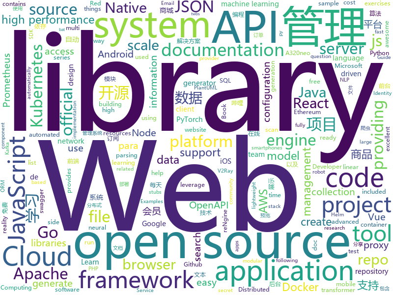

# 2020-11-10
See what the GitHub community is most excited about.

## python
+ [system-design-primer](https://github.com/donnemartin/system-design-primer)(**130 stars today**): Learn how to design large-scale systems. Prep for the system design interview. Includes Anki flashcards.
+ [pifuhd](https://github.com/facebookresearch/pifuhd)(**438 stars today**): High-Resolution 3D Human Digitization from A Single Image.
+ [pytorch-original-transformer](https://github.com/gordicaleksa/pytorch-original-transformer)(**57 stars today**): My implementation of the original transformer model (Vaswani et al.). I've additionally included the playground.py file for visualizing otherwise seemingly hard concepts. Currently included IWSLT pretrained models.
+ [allennlp](https://github.com/allenai/allennlp)(**7 stars today**): An open-source NLP research library, built on PyTorch.
+ [iOS-DeviceSupport](https://github.com/iGhibli/iOS-DeviceSupport)(**33 stars today**): This repository holds the device support files for the iOS, and I will update it regularly.
+ [airflow](https://github.com/apache/airflow)(**37 stars today**): Apache Airflow - A platform to programmatically author, schedule, and monitor workflows
+ [mlflow](https://github.com/mlflow/mlflow)(**15 stars today**): Open source platform for the machine learning lifecycle
+ [pytorch-lightning](https://github.com/PyTorchLightning/pytorch-lightning)(**31 stars today**): The lightweight PyTorch wrapper for high-performance AI research. Scale your models, not the boilerplate.
+ [django](https://github.com/django/django)(**45 stars today**): The Web framework for perfectionists with deadlines.
+ [mlfinlab](https://github.com/hudson-and-thames/mlfinlab)(**5 stars today**): MlFinLab helps portfolio managers and traders who want to leverage the power of machine learning by providing reproducible, interpretable, and easy to use tools.
+ [HanLP](https://github.com/hankcs/HanLP)(**17 stars today**): 中文分词 词性标注 命名实体识别 依存句法分析 语义依存分析 新词发现 关键词短语提取 自动摘要 文本分类聚类 拼音简繁转换 自然语言处理
+ [prefect](https://github.com/PrefectHQ/prefect)(**14 stars today**): The easiest way to automate your data
+ [Summer2021-Internships](https://github.com/Pitt-CSC/Summer2021-Internships)(**8 stars today**): Collection of Summer 2021 tech internships!
+ [monkey](https://github.com/guardicore/monkey)(**255 stars today**): Infection Monkey - An automated pentest tool
+ [QUANTAXIS](https://github.com/QUANTAXIS/QUANTAXIS)(**12 stars today**): QUANTAXIS 支持任务调度 分布式部署的 股票/期货/期权/港股/虚拟货币 数据/回测/模拟/交易/可视化/多账户 纯本地量化解决方案
+ [trax](https://github.com/google/trax)(**10 stars today**): Trax — Deep Learning with Clear Code and Speed
+ [kornia](https://github.com/kornia/kornia)(**37 stars today**): Open Source Differentiable Computer Vision Library for PyTorch
+ [Python-100-Days](https://github.com/jackfrued/Python-100-Days)(**88 stars today**): Python - 100天从新手到大师
+ [prophet](https://github.com/facebook/prophet)(**11 stars today**): Tool for producing high quality forecasts for time series data that has multiple seasonality with linear or non-linear growth.
+ [fastapi](https://github.com/tiangolo/fastapi)(**46 stars today**): FastAPI framework, high performance, easy to learn, fast to code, ready for production
+ [tinygrad](https://github.com/geohot/tinygrad)(**101 stars today**): You like pytorch? You like micrograd? You love tinygrad!❤️
+ [pydantic](https://github.com/samuelcolvin/pydantic)(**15 stars today**): Data parsing and validation using Python type hints
+ [localstack](https://github.com/localstack/localstack)(**32 stars today**): 💻A fully functional local AWS cloud stack. Develop and test your cloud & Serverless apps offline!
+ [haystack](https://github.com/deepset-ai/haystack)(**10 stars today**): 🔍Transformers at scale for question answering & neural search. Using NLP via a modular Retriever-Reader-Pipeline. Supporting DPR, Elasticsearch, HuggingFace's Modelhub...
+ [compose](https://github.com/docker/compose)(**14 stars today**): Define and run multi-container applications with Docker

## java
+ [hello-algorithm](https://github.com/geekxh/hello-algorithm)(**317 stars today**): 🌍东半球最酷的学习项目 | 1、我写的三十万字算法图解 2、千本开源电子书 3、100 张思维导图 4、100 篇大厂面经 5、30 个学习专题🚀🚀🚀右上角点个 star，加入我们万人学习群！English Supported！
+ [kkFileView](https://github.com/kekingcn/kkFileView)(**55 stars today**): 使用spring boot打造文件文档在线预览项目解决方案，支持doc、docx、ppt、pptx、xls、xlsx、zip、rar、mp4，mp3以及众多类文本如txt、html、xml、java、properties、sql、js、md、json、conf、ini、vue、php、py、bat、gitignore等文件在线预览
+ [Mindustry](https://github.com/Anuken/Mindustry)(**17 stars today**): A sandbox tower defense game
+ [testcontainers-java](https://github.com/testcontainers/testcontainers-java)(**7 stars today**): Testcontainers is a Java library that supports JUnit tests, providing lightweight, throwaway instances of common databases, Selenium web browsers, or anything else that can run in a Docker container.
+ [openapi-generator](https://github.com/OpenAPITools/openapi-generator)(**13 stars today**): OpenAPI Generator allows generation of API client libraries (SDK generation), server stubs, documentation and configuration automatically given an OpenAPI Spec (v2, v3)
+ [lucene-solr](https://github.com/apache/lucene-solr)(**5 stars today**): Apache Lucene and Solr open-source search software
+ [BILIBILI-HELPER](https://github.com/JunzhouLiu/BILIBILI-HELPER)(**50 stars today**): B站，哔哩哔哩（Bilibili）自动签到每日自动投币，银瓜子兑换硬币，领取大会员福利，大会员月底给自己充电等。每天轻松获取65经验值。赶快和我一起成为Lv6吧！
+ [lottie-android](https://github.com/airbnb/lottie-android)(**14 stars today**): Render After Effects animations natively on Android and iOS, Web, and React Native
+ [guacamole-client](https://github.com/apache/guacamole-client)(**1 stars today**): Mirror of Apache Guacamole Client
+ [quickstart-android](https://github.com/firebase/quickstart-android)(**6 stars today**): Firebase Quickstart Samples for Android
+ [mall](https://github.com/macrozheng/mall)(**68 stars today**): mall项目是一套电商系统，包括前台商城系统及后台管理系统，基于SpringBoot+MyBatis实现，采用Docker容器化部署。 前台商城系统包含首页门户、商品推荐、商品搜索、商品展示、购物车、订单流程、会员中心、客户服务、帮助中心等模块。 后台管理系统包含商品管理、订单管理、会员管理、促销管理、运营管理、内容管理、统计报表、财务管理、权限管理、设置等模块。
+ [halo](https://github.com/halo-dev/halo)(**19 stars today**): ✍An excellent open source blog publishing application. | 一个优秀的开源博客发布应用。
+ [kafka-manager](https://github.com/didi/kafka-manager)(**13 stars today**): 一站式Apache Kafka集群指标监控与运维管控平台
+ [tech-interview-for-developer](https://github.com/gyoogle/tech-interview-for-developer)(**26 stars today**): 👶🏻 신입 개발자 전공 지식 & 기술 면접 백과사전📖
+ [elasticsearch](https://github.com/elastic/elasticsearch)(**13 stars today**): Open Source, Distributed, RESTful Search Engine
+ [quarkus](https://github.com/quarkusio/quarkus)(**14 stars today**): Quarkus: Supersonic Subatomic Java.
+ [uid-generator](https://github.com/baidu/uid-generator)(**8 stars today**): UniqueID generator
+ [APIJSON](https://github.com/Tencent/APIJSON)(**72 stars today**): 🏆码云最有价值开源项目🚀后端接口和文档自动化，前端(客户端) 定制返回 JSON 的数据和结构！🏆Gitee Most Valuable Project🚀A JSON Transmission Protocol and an ORM Library for automatically providing APIs and Docs.
+ [aws-doc-sdk-examples](https://github.com/awsdocs/aws-doc-sdk-examples)(**5 stars today**): Welcome to the AWS Code Examples Repository. This repo contains code examples used in the AWS documentation, AWS SDK Developer Guides, and more. For more information, see the Readme.rst file below.
+ [mlkit](https://github.com/googlesamples/mlkit)(**8 stars today**): A collection of sample apps to demonstrate how to use Google's ML Kit APIs on Android and iOS
+ [keycloak](https://github.com/keycloak/keycloak)(**9 stars today**): Open Source Identity and Access Management For Modern Applications and Services
+ [canal](https://github.com/alibaba/canal)(**36 stars today**): 阿里巴巴 MySQL binlog 增量订阅&消费组件
+ [OpenBot](https://github.com/intel-isl/OpenBot)(**9 stars today**): OpenBot leverages smartphones as brains for low-cost robots. We have designed a small electric vehicle that costs about $50 and serves as a robot body. Our software stack for Android smartphones supports advanced robotics workloads such as person following and real-time autonomous navigation.
+ [drools](https://github.com/kiegroup/drools)(**3 stars today**): Drools is a rule engine, DMN engine and complex event processing (CEP) engine for Java.
+ [react-native-video](https://github.com/react-native-video/react-native-video)(**5 stars today**): A <Video /> component for react-native

## unknown
+ [100-days-of-python](https://github.com/appbrewery/100-days-of-python)(**183 stars today**): 100 Days of Code in Python
+ [first-contributions](https://github.com/firstcontributions/first-contributions)(**126 stars today**): 🚀✨Help beginners to contribute to open source projects
+ [awesome-javascript](https://github.com/sorrycc/awesome-javascript)(**47 stars today**): 🐢A collection of awesome browser-side JavaScript libraries, resources and shiny things.
+ [red-kube](https://github.com/lightspin-tech/red-kube)(**120 stars today**): Red Team KubeCTL Cheat Sheet
+ [GNNPapers](https://github.com/thunlp/GNNPapers)(**14 stars today**): Must-read papers on graph neural networks (GNN)
+ [HowToHunt](https://github.com/KathanP19/HowToHunt)(**12 stars today**): Tutorials and Things to Do while Hunting Vulnerability.
+ [binance-official-api-docs](https://github.com/binance-exchange/binance-official-api-docs)(**3 stars today**): Official Documentation for the Binance APIs and Streams
+ [awesome-gcp-certifications](https://github.com/sathishvj/awesome-gcp-certifications)(**4 stars today**): Google Cloud Platform Certification resources.
+ [php-programming-best-practices](https://github.com/TiendaNube/php-programming-best-practices)(**56 stars today**): Referencia para los desarrolladores de Tiendanube y para la comunidad de PHP.
+ [api-guidelines](https://github.com/microsoft/api-guidelines)(**9 stars today**): Microsoft REST API Guidelines
+ [vagas-junior-estagio](https://github.com/alinebastos/vagas-junior-estagio)(**17 stars today**): Empresas que constantemente oferecem vagas para junior e estagiários
+ [C4-PlantUML](https://github.com/RicardoNiepel/C4-PlantUML)(**3 stars today**): C4-PlantUML combines the benefits of PlantUML and the C4 model for providing a simple way of describing and communicate software architectures
+ [for-win](https://github.com/docker/for-win)(**2 stars today**): Bug reports for Docker Desktop for Windows
+ [javascript-questions](https://github.com/lydiahallie/javascript-questions)(**18 stars today**): A long list of (advanced) JavaScript questions, and their explanations✨
+ [win-zsh](https://github.com/DigitalMachinist/win-zsh)(**24 stars today**): A guide for setting up the nicest terminal Windows has ever had
+ [Red-Teaming-Toolkit](https://github.com/infosecn1nja/Red-Teaming-Toolkit)(**2 stars today**): A collection of open source and commercial tools that aid in red team operations.
+ [Script](https://github.com/NobyDa/Script)(**18 stars today**): This project is based on the scripting capabilities of two excellent iOS proxy tools, Quantumult X or Surge.
+ [you-dont-know-js-ru](https://github.com/azat-io/you-dont-know-js-ru)(**9 stars today**): 📚Russian translation of "You Don't Know JS" book series
+ [weekly](https://github.com/dt-fe/weekly)(**8 stars today**): 前端精读周刊
+ [free](https://github.com/wenyanjun/free)(**4 stars today**): idea, webStorm, pycharm, phpStorm 激活码 QQ技术交流③群 1093476453
+ [covid-19-data](https://github.com/nytimes/covid-19-data)(**10 stars today**): An ongoing repository of data on coronavirus cases and deaths in the U.S.
+ [CKAD-exercises](https://github.com/dgkanatsios/CKAD-exercises)(**6 stars today**): A set of exercises to prepare for Certified Kubernetes Application Developer exam by Cloud Native Computing Foundation
+ [awesome-scalability](https://github.com/binhnguyennus/awesome-scalability)(**21 stars today**): The Patterns of Scalable, Reliable, and Performant Large-Scale Systems
+ [JavaCollection](https://github.com/hansonwang99/JavaCollection)(**4 stars today**): Java开源项目之「自学编程之路」：学习指南+面试指南+资源分享+技术文章
+ [raft-zh_cn](https://github.com/maemual/raft-zh_cn)(**4 stars today**): Raft一致性算法论文的中文翻译

## javascript
+ [faker.js](https://github.com/Marak/faker.js)(**467 stars today**): generate massive amounts of realistic fake data in Node.js and the browser
+ [WebGL-Fluid-Simulation](https://github.com/PavelDoGreat/WebGL-Fluid-Simulation)(**263 stars today**): Play with fluids in your browser (works even on mobile)
+ [rengine](https://github.com/yogeshojha/rengine)(**76 stars today**): reNgine is an automated reconnaissance framework meant for gathering information during penetration testing of web applications. reNgine has customizable scan engines, which can be used to scan the websites, endpoints, and gather information.
+ [newbee-mall-vue3-app](https://github.com/newbee-ltd/newbee-mall-vue3-app)(**120 stars today**): 新蜂商城Vue3版本
+ [aos](https://github.com/michalsnik/aos)(**22 stars today**): Animate on scroll library
+ [plugins](https://github.com/rollup/plugins)(**17 stars today**): 🍣The one-stop shop for official Rollup plugins
+ [nuxt.js](https://github.com/nuxt/nuxt.js)(**23 stars today**): The Intuitive Vue Framework
+ [freeCodeCamp](https://github.com/freeCodeCamp/freeCodeCamp)(**55 stars today**): freeCodeCamp.org's open source codebase and curriculum. Learn to code at home.
+ [socket.io](https://github.com/socketio/socket.io)(**151 stars today**): Realtime application framework (Node.JS server)
+ [discord.js](https://github.com/discordjs/discord.js)(**16 stars today**): A powerful JavaScript library for interacting with the Discord API
+ [unlock-music](https://github.com/ix64/unlock-music)(**69 stars today**): Unlock encrypted music file in browser. 在浏览器中解锁加密的音乐文件。
+ [draggable](https://github.com/Shopify/draggable)(**7 stars today**): The JavaScript Drag & Drop library your grandparents warned you about.
+ [bootstrap-datepicker](https://github.com/uxsolutions/bootstrap-datepicker)(**4 stars today**): A datepicker for twitter bootstrap (@twbs)
+ [cgm-remote-monitor](https://github.com/nightscout/cgm-remote-monitor)(**3 stars today**): nightscout web monitor
+ [next.js](https://github.com/vercel/next.js)(**71 stars today**): The React Framework
+ [venom](https://github.com/orkestral/venom)(**16 stars today**): Venom is a high-performance system developed with JavaScript to create a bot for WhatsApp
+ [kubernetes-external-secrets](https://github.com/godaddy/kubernetes-external-secrets)(**4 stars today**): Integrate external secret management systems with Kubernetes
+ [lxk0301_scripts](https://github.com/LXK9301/lxk0301_scripts)(**19 stars today**): 
+ [bigbluebutton](https://github.com/bigbluebutton/bigbluebutton)(**9 stars today**): Complete open source web conferencing system.
+ [sequelize](https://github.com/sequelize/sequelize)(**15 stars today**): An easy-to-use multi SQL dialect ORM for Node.js
+ [Vulkan-Docs](https://github.com/KhronosGroup/Vulkan-Docs)(**2 stars today**): The Vulkan API Specification and related tools
+ [plotly.js](https://github.com/plotly/plotly.js)(**7 stars today**): Open-source JavaScript charting library behind Plotly and Dash
+ [vue-router](https://github.com/vuejs/vue-router)(**10 stars today**): 🚦The official router for Vue.js.
+ [react-jsonschema-form](https://github.com/rjsf-team/react-jsonschema-form)(**12 stars today**): A React component for building Web forms from JSON Schema.
+ [a32nx](https://github.com/flybywiresim/a32nx)(**10 stars today**): The A32NX Project is a community driven open source project to create a free Airbus A320neo in Microsoft Flight Simulator that is as close to reality as possible. It aims to enhance the default A320neo by improving the systems depth and functionality to bring it up to payware-level, all for free.

## html
+ [ansible-os-hardening](https://github.com/dev-sec/ansible-os-hardening)(**1 stars today**): This Ansible role provides numerous security-related configurations, providing all-round base protection.
+ [QrGame](https://github.com/emeraldpowder/QrGame)(**6 stars today**): 
+ [website](https://github.com/kubernetes/website)(**3 stars today**): Kubernetes website and documentation repo:
+ [charts](https://github.com/bitnami/charts)(**4 stars today**): Helm Charts
+ [free-v2ray](https://github.com/iwxf/free-v2ray)(**2 stars today**): 每天更新，分享免费V2Ray账号、订阅链接，V2Ray翻墙科学上网教程。
+ [fastText](https://github.com/facebookresearch/fastText)(**6 stars today**): Library for fast text representation and classification.
+ [swagger-codegen](https://github.com/swagger-api/swagger-codegen)(**7 stars today**): swagger-codegen contains a template-driven engine to generate documentation, API clients and server stubs in different languages by parsing your OpenAPI / Swagger definition.
+ [learning-area](https://github.com/mdn/learning-area)(**6 stars today**): Github repo for the MDN Learning Area.
+ [machine-learning-systems-design](https://github.com/chiphuyen/machine-learning-systems-design)(**11 stars today**): A booklet on machine learning systems design with exercises
+ [100knocks-preprocess](https://github.com/The-Japan-DataScientist-Society/100knocks-preprocess)(**4 stars today**): データサイエンス100本ノック（構造化データ加工編）
+ [web-moderno](https://github.com/cod3rcursos/web-moderno)(**2 stars today**): 
+ [Coursera-ML-AndrewNg-Notes](https://github.com/fengdu78/Coursera-ML-AndrewNg-Notes)(**21 stars today**): 吴恩达老师的机器学习课程个人笔记
+ [AR.js](https://github.com/jeromeetienne/AR.js)(**2 stars today**): Efficient Augmented Reality for the Web - 60fps on mobile!
+ [helm-charts](https://github.com/prometheus-community/helm-charts)(**7 stars today**): Prometheus community Helm charts
+ [moveit_tutorials](https://github.com/ros-planning/moveit_tutorials)(**0 stars today**): A sphinx-based centralized documentation repo for MoveIt
+ [patchwork](https://github.com/jlord/patchwork)(**1 stars today**): All the Git-it Workshop completers!
+ [rdkit](https://github.com/rdkit/rdkit)(**2 stars today**): The official sources for the RDKit library
+ [magic-modules](https://github.com/GoogleCloudPlatform/magic-modules)(**0 stars today**): Automatically generate Google Cloud Platform support for OSS IaaC Projects
+ [raytracing.github.io](https://github.com/RayTracing/raytracing.github.io)(**7 stars today**): Main Web Site (Online Books)
+ [html-css](https://github.com/gustavoguanabara/html-css)(**6 stars today**): Curso de HTML5 e CSS3
+ [RateMySupervisor](https://github.com/kgco/RateMySupervisor)(**11 stars today**): 永久免费开源的导师评价数据、数据爬虫、无需编程基础的展示网页以及新信息补充平台
+ [EIPs](https://github.com/ethereum/EIPs)(**4 stars today**): The Ethereum Improvement Proposal repository
+ [ai-edu](https://github.com/microsoft/ai-edu)(**16 stars today**): AI education materials for Chinese students, teachers and IT professionals.
+ [mxgraph](https://github.com/jgraph/mxgraph)(**5 stars today**): mxGraph is a fully client side JavaScript diagramming library
+ [kubespray](https://github.com/kubernetes-sigs/kubespray)(**6 stars today**): Deploy a Production Ready Kubernetes Cluster

## go
+ [gopsutil](https://github.com/shirou/gopsutil)(**17 stars today**): psutil for golang
+ [awesome-go](https://github.com/avelino/awesome-go)(**49 stars today**): A curated list of awesome Go frameworks, libraries and software
+ [oauth2](https://github.com/golang/oauth2)(**6 stars today**): Go OAuth2
+ [traefik](https://github.com/traefik/traefik)(**14 stars today**): The Cloud Native Application Proxy
+ [minikube](https://github.com/kubernetes/minikube)(**17 stars today**): Run Kubernetes locally
+ [apple-store-helper](https://github.com/hteen/apple-store-helper)(**14 stars today**): Apple Store iPhone预约助手
+ [go-ethereum](https://github.com/ethereum/go-ethereum)(**15 stars today**): Official Go implementation of the Ethereum protocol
+ [prometheus-operator](https://github.com/prometheus-operator/prometheus-operator)(**10 stars today**): Prometheus Operator creates/configures/manages Prometheus clusters atop Kubernetes
+ [oauth2-proxy](https://github.com/oauth2-proxy/oauth2-proxy)(**10 stars today**): A reverse proxy that provides authentication with Google, Github or other providers.
+ [kubeedge](https://github.com/kubeedge/kubeedge)(**6 stars today**): Kubernetes Native Edge Computing Framework (project under CNCF)
+ [crawlab](https://github.com/crawlab-team/crawlab)(**25 stars today**): Distributed web crawler admin platform for spiders management regardless of languages and frameworks. 分布式爬虫管理平台，支持任何语言和框架
+ [telegraf](https://github.com/influxdata/telegraf)(**6 stars today**): The plugin-driven server agent for collecting & reporting metrics.
+ [dex](https://github.com/dexidp/dex)(**4 stars today**): OpenID Connect Identity (OIDC) and OAuth 2.0 Provider with Pluggable Connectors
+ [terraform](https://github.com/hashicorp/terraform)(**21 stars today**): Terraform enables you to safely and predictably create, change, and improve infrastructure. It is an open source tool that codifies APIs into declarative configuration files that can be shared amongst team members, treated as code, edited, reviewed, and versioned.
+ [nats-server](https://github.com/nats-io/nats-server)(**5 stars today**): High-Performance server for NATS, the cloud native messaging system.
+ [client_golang](https://github.com/prometheus/client_golang)(**2 stars today**): Prometheus instrumentation library for Go applications
+ [charts](https://github.com/helm/charts)(**10 stars today**): Curated applications for Kubernetes
+ [grpc-gateway](https://github.com/grpc-ecosystem/grpc-gateway)(**8 stars today**): gRPC to JSON proxy generator following the gRPC HTTP spec
+ [xray-crack](https://github.com/zu1k/xray-crack)(**18 stars today**): xray社区高级版证书生成，仅供学习研究，正常使用请支持正版
+ [vault](https://github.com/hashicorp/vault)(**10 stars today**): A tool for secrets management, encryption as a service, and privileged access management
+ [k3s](https://github.com/rancher/k3s)(**28 stars today**): Lightweight Kubernetes
+ [magma](https://github.com/magma/magma)(**3 stars today**): Platform for building access networks and modular network services
+ [tempomail](https://github.com/kavishgr/tempomail)(**27 stars today**): Generate a custom Email Address in 1 Second and receive Emails.
+ [sarama](https://github.com/Shopify/sarama)(**5 stars today**): Sarama is a Go library for Apache Kafka 0.8, and up.
+ [RxGo](https://github.com/ReactiveX/RxGo)(**20 stars today**): Reactive Extensions for the Go language.

## WordCloud

