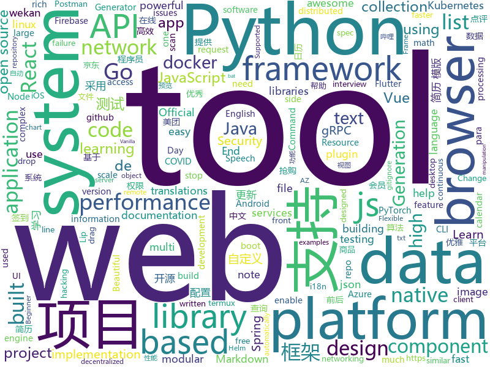

# 2020-11-11
See what the GitHub community is most excited about.

## python
+ [system-design-primer](https://github.com/donnemartin/system-design-primer)(**359 stars today**): Learn how to design large-scale systems. Prep for the system design interview. Includes Anki flashcards.
+ [manim](https://github.com/3b1b/manim)(**65 stars today**): Animation engine for explanatory math videos
+ [airflow](https://github.com/apache/airflow)(**44 stars today**): Apache Airflow - A platform to programmatically author, schedule, and monitor workflows
+ [rich](https://github.com/willmcgugan/rich)(**55 stars today**): Rich is a Python library for rich text and beautiful formatting in the terminal.
+ [cupy](https://github.com/cupy/cupy)(**5 stars today**): NumPy-like API accelerated with CUDA
+ [gym](https://github.com/openai/gym)(**18 stars today**): A toolkit for developing and comparing reinforcement learning algorithms.
+ [Photon](https://github.com/s0md3v/Photon)(**42 stars today**): Incredibly fast crawler designed for OSINT.
+ [jd-assistant](https://github.com/tychxn/jd-assistant)(**19 stars today**): 京东抢购助手：包含登录，查询商品库存/价格，添加/清空购物车，抢购商品(下单)，查询订单等功能
+ [saleor](https://github.com/mirumee/saleor)(**13 stars today**): A modular, high performance, headless e-commerce platform built with Python, GraphQL, Django, and ReactJS.
+ [Wav2Lip](https://github.com/Rudrabha/Wav2Lip)(**96 stars today**): This repository contains the codes of "A Lip Sync Expert Is All You Need for Speech to Lip Generation In the Wild", published at ACM Multimedia 2020.
+ [fastapi](https://github.com/tiangolo/fastapi)(**47 stars today**): FastAPI framework, high performance, easy to learn, fast to code, ready for production
+ [python-fire](https://github.com/google/python-fire)(**56 stars today**): Python Fire is a library for automatically generating command line interfaces (CLIs) from absolutely any Python object.
+ [pandas](https://github.com/pandas-dev/pandas)(**12 stars today**): Flexible and powerful data analysis / manipulation library for Python, providing labeled data structures similar to R data.frame objects, statistical functions, and much more
+ [FinalRecon](https://github.com/thewhiteh4t/FinalRecon)(**18 stars today**): The Last Web Recon Tool You'll Need
+ [dtale](https://github.com/man-group/dtale)(**33 stars today**): Visualizer for pandas data structures
+ [allennlp](https://github.com/allenai/allennlp)(**54 stars today**): An open-source NLP research library, built on PyTorch.
+ [cython](https://github.com/cython/cython)(**5 stars today**): The most widely used Python to C compiler
+ [rembg](https://github.com/danielgatis/rembg)(**34 stars today**): Rembg is a tool to remove images background.
+ [espnet](https://github.com/espnet/espnet)(**7 stars today**): End-to-End Speech Processing Toolkit
+ [dash](https://github.com/plotly/dash)(**15 stars today**): Analytical Web Apps for Python, R, Julia, and Jupyter. No JavaScript Required.
+ [yolov5](https://github.com/ultralytics/yolov5)(**39 stars today**): YOLOv5 in PyTorch > ONNX > CoreML > TFLite
+ [DeepFaceLab](https://github.com/iperov/DeepFaceLab)(**66 stars today**): DeepFaceLab is the leading software for creating deepfakes.
+ [Tool-X](https://github.com/rajkumardusad/Tool-X)(**58 stars today**): Tool-X is a kali linux hacking Tool installer. Tool-X developed for termux and other Linux based systems. using Tool-X you can install almost 370+ hacking tools in termux app and other linux based distributions.
+ [d2l-en](https://github.com/d2l-ai/d2l-en)(**16 stars today**): Interactive deep learning book with code, math, and discussions. Available in multi-frameworks.
+ [pifuhd](https://github.com/facebookresearch/pifuhd)(**263 stars today**): High-Resolution 3D Human Digitization from A Single Image.

## java
+ [hello-algorithm](https://github.com/geekxh/hello-algorithm)(**294 stars today**): 🌍东半球最酷的学习项目 | 1、我写的三十万字算法图解 2、千本开源电子书 3、100 张思维导图 4、100 篇大厂面经 5、30 个学习专题🚀🚀🚀右上角点个 star，加入我们万人学习群！English Supported！
+ [eladmin](https://github.com/elunez/eladmin)(**64 stars today**): 项目基于 Spring Boot 2.1.0 、 Jpa、 Spring Security、redis、Vue的前后端分离的后台管理系统，项目采用分模块开发方式， 权限控制采用 RBAC，支持数据字典与数据权限管理，支持一键生成前后端代码，支持动态路由
+ [kkFileView](https://github.com/kekingcn/kkFileView)(**69 stars today**): 使用spring boot打造文件文档在线预览项目解决方案，支持doc、docx、ppt、pptx、xls、xlsx、zip、rar、mp4，mp3以及众多类文本如txt、html、xml、java、properties、sql、js、md、json、conf、ini、vue、php、py、bat、gitignore等文件在线预览
+ [antlr4](https://github.com/antlr/antlr4)(**9 stars today**): ANTLR (ANother Tool for Language Recognition) is a powerful parser generator for reading, processing, executing, or translating structured text or binary files.
+ [BILIBILI-HELPER](https://github.com/JunzhouLiu/BILIBILI-HELPER)(**73 stars today**): B站，哔哩哔哩（Bilibili）自动签到每日自动投币，银瓜子兑换硬币，领取大会员福利，大会员月底给自己充电等。每天轻松获取65经验值。赶快和我一起成为Lv6吧！
+ [tutorials](https://github.com/eugenp/tutorials)(**23 stars today**): Just Announced - "Learn Spring Security OAuth":
+ [bazel](https://github.com/bazelbuild/bazel)(**10 stars today**): a fast, scalable, multi-language and extensible build system
+ [CalendarView](https://github.com/huanghaibin-dev/CalendarView)(**7 stars today**): Android上一个优雅、万能自定义UI、支持周视图、自定义周起始、性能高效的日历控件，支持热插拔实现的UI定制！支持标记、自定义颜色、农历、自定义月视图各种显示模式等。Canvas绘制，速度快、占用内存低，你真的想不到日历居然还可以如此优雅！An elegant, highly customized and high-performance Calendar Widget on Android.
+ [GitHub-Chinese-Top-Charts](https://github.com/kon9chunkit/GitHub-Chinese-Top-Charts)(**28 stars today**): 🇨🇳GitHub中文排行榜，帮助你发现高分优秀中文项目、更高效地吸收国人的优秀经验成果；榜单每周更新一次，敬请关注！
+ [Mindustry](https://github.com/Anuken/Mindustry)(**13 stars today**): A sandbox tower defense game
+ [alluxio](https://github.com/Alluxio/alluxio)(**2 stars today**): Alluxio, data orchestration for analytics and machine learning in the cloud
+ [openapi-generator](https://github.com/OpenAPITools/openapi-generator)(**8 stars today**): OpenAPI Generator allows generation of API client libraries (SDK generation), server stubs, documentation and configuration automatically given an OpenAPI Spec (v2, v3)
+ [pinpoint](https://github.com/pinpoint-apm/pinpoint)(**6 stars today**): APM, (Application Performance Management) tool for large-scale distributed systems.
+ [selenium](https://github.com/SeleniumHQ/selenium)(**10 stars today**): A browser automation framework and ecosystem.
+ [metersphere](https://github.com/metersphere/metersphere)(**63 stars today**): An open source continuous testing platform. MeterSphere 是一站式的开源企业级持续测试平台，涵盖测试跟踪、接口测试、性能测试、团队协作等功能，全面兼容 JMeter、Postman 等开源、主流标准。项目采用 SpringBoot 2.x + MyBatis + Vue.js + Element + Docker + Kafka + MySQL等开发。
+ [cat](https://github.com/dianping/cat)(**6 stars today**): CAT 作为服务端项目基础组件，提供了 Java, C/C++, Node.js, Python, Go 等多语言客户端，已经在美团点评的基础架构中间件框架（MVC框架，RPC框架，数据库框架，缓存框架等，消息队列，配置系统等）深度集成，为美团点评各业务线提供系统丰富的性能指标、健康状况、实时告警等。
+ [grpc-java](https://github.com/grpc/grpc-java)(**5 stars today**): The Java gRPC implementation. HTTP/2 based RPC
+ [Hystrix](https://github.com/Netflix/Hystrix)(**9 stars today**): Hystrix is a latency and fault tolerance library designed to isolate points of access to remote systems, services and 3rd party libraries, stop cascading failure and enable resilience in complex distributed systems where failure is inevitable.
+ [debezium](https://github.com/debezium/debezium)(**12 stars today**): Change data capture for a variety of databases. Please log issues at https://issues.redhat.com/browse/DBZ.
+ [react-native-video](https://github.com/react-native-video/react-native-video)(**5 stars today**): A <Video /> component for react-native
+ [code-examples](https://github.com/thombergs/code-examples)(**2 stars today**): A collection of code examples from blog posts etc.
+ [micronaut-core](https://github.com/micronaut-projects/micronaut-core)(**4 stars today**): Micronaut Application Framework
+ [BaseRecyclerViewAdapterHelper](https://github.com/CymChad/BaseRecyclerViewAdapterHelper)(**12 stars today**): BRVAH:Powerful and flexible RecyclerAdapter
+ [react-native-push-notification](https://github.com/zo0r/react-native-push-notification)(**3 stars today**): React Native Local and Remote Notifications
+ [flutter_boost](https://github.com/alibaba/flutter_boost)(**9 stars today**): FlutterBoost is a Flutter plugin which enables hybrid integration of Flutter for your existing native apps with minimum efforts

## unknown
+ [first-contributions](https://github.com/firstcontributions/first-contributions)(**189 stars today**): 🚀✨Help beginners to contribute to open source projects
+ [awesome-javascript](https://github.com/sorrycc/awesome-javascript)(**82 stars today**): 🐢A collection of awesome browser-side JavaScript libraries, resources and shiny things.
+ [AZ-900T0x-MicrosoftAzureFundamentals](https://github.com/MicrosoftLearning/AZ-900T0x-MicrosoftAzureFundamentals)(**2 stars today**): Microsoft Azure Fundamentals - AZ-900T00 and AZ-900T01
+ [red-kube](https://github.com/lightspin-tech/red-kube)(**129 stars today**): Red Team KubeCTL Cheat Sheet
+ [100-days-of-python](https://github.com/appbrewery/100-days-of-python)(**145 stars today**): 100 Days of Code in Python
+ [laravel-country-logomarks](https://github.com/caneco/laravel-country-logomarks)(**21 stars today**): The unofficial (but blessed) Laravel Country Logomarks
+ [awesome-superpeer](https://github.com/suadev/awesome-superpeer)(**14 stars today**): 
+ [Script](https://github.com/NobyDa/Script)(**15 stars today**): This project is based on the scripting capabilities of two excellent iOS proxy tools, Quantumult X or Surge.
+ [iPhoneOSDeviceSupport](https://github.com/filsv/iPhoneOSDeviceSupport)(**17 stars today**): Xcode iPhoneOS DeviceSupport files (6.0 - 14.2)
+ [COVID-19](https://github.com/pcm-dpc/COVID-19)(**5 stars today**): COVID-19 Italia - Monitoraggio situazione
+ [pix-api](https://github.com/bacen/pix-api)(**7 stars today**): API Pix: a API do Arranjo de Pagamentos Instantâneos Brasileiro.
+ [fucking-algorithm](https://github.com/labuladong/fucking-algorithm)(**343 stars today**): 刷算法全靠套路，认准 labuladong 就够了！English version supported! Crack LeetCode, not only how, but also why.
+ [awesome](https://github.com/sindresorhus/awesome)(**64 stars today**): 😎Awesome lists about all kinds of interesting topics
+ [architecture_decision_record](https://github.com/joelparkerhenderson/architecture_decision_record)(**6 stars today**): Architecture decision record (ADR) examples for software planning, IT leadership, and template documentation
+ [vagas](https://github.com/frontendbr/vagas)(**6 stars today**): 🔬Espaço para divulgação de vagas para front-enders.
+ [idiomatic.js](https://github.com/rwaldron/idiomatic.js)(**12 stars today**): Principles of Writing Consistent, Idiomatic JavaScript
+ [postman-app-support](https://github.com/postmanlabs/postman-app-support)(**2 stars today**): Postman helps you be more efficient while working with APIs. Using Postman, you can construct complex HTTP requests quickly, organize them in collections and share them with your co-workers.
+ [Beginner-Network-Pentesting](https://github.com/hmaverickadams/Beginner-Network-Pentesting)(**6 stars today**): Notes for Beginner Network Pentesting Course
+ [Free-Certifications](https://github.com/cloudcommunity/Free-Certifications)(**5 stars today**): Curated list of free courses & certifications
+ [ShameCom](https://github.com/ShameCom/ShameCom)(**17 stars today**): 收集校招污点公司或组织，帮助学弟学妹避雷。互联网不曾遗忘！
+ [learn-python3](https://github.com/michaelliao/learn-python3)(**2 stars today**): Learn Python 3 Sample Code
+ [gitignore](https://github.com/github/gitignore)(**56 stars today**): A collection of useful .gitignore templates
+ [QuantumultX](https://github.com/nzw9314/QuantumultX)(**10 stars today**): QuantumultX
+ [binance-official-api-docs](https://github.com/binance-exchange/binance-official-api-docs)(**4 stars today**): Official Documentation for the Binance APIs and Streams
+ [for-mac](https://github.com/docker/for-mac)(**6 stars today**): Bug reports for Docker Desktop for Mac

## javascript
+ [faker.js](https://github.com/Marak/faker.js)(**376 stars today**): generate massive amounts of realistic fake data in Node.js and the browser
+ [rengine](https://github.com/yogeshojha/rengine)(**115 stars today**): reNgine is an automated reconnaissance framework meant for information gathering during penetration testing of web applications. reNgine has customizable scan engines, which can be used to scan the websites, endpoints, and gather information.
+ [WebGL-Fluid-Simulation](https://github.com/PavelDoGreat/WebGL-Fluid-Simulation)(**213 stars today**): Play with fluids in your browser (works even on mobile)
+ [material-ui](https://github.com/mui-org/material-ui)(**28 stars today**): React components for faster and easier web development. Build your own design system, or start with Material Design.
+ [react-native-firebase](https://github.com/invertase/react-native-firebase)(**6 stars today**): 🔥A well-tested feature-rich modular Firebase implementation for React Native. Supports both iOS & Android platforms for all Firebase services.
+ [javascript](https://github.com/airbnb/javascript)(**38 stars today**): JavaScript Style Guide
+ [zonote](https://github.com/zonetti/zonote)(**60 stars today**): Cross-platform desktop note-taking app. Sticky notes with Markdown and Tabs. All in one .txt file.
+ [wekan](https://github.com/wekan/wekan)(**5 stars today**): The open-source kanban (built with Meteor). Keep variable/table/field names camelCase. For translations, only add Pull Request changes to wekan/i18n/en.i18n.json , other translations are done at https://transifex.com/wekan/wekan only.
+ [eslint-plugin-import](https://github.com/benmosher/eslint-plugin-import)(**3 stars today**): ESLint plugin with rules that help validate proper imports.
+ [JD_Sign_Action](https://github.com/ZHDeveloper/JD_Sign_Action)(**13 stars today**): 基于github actions的京东签到、领京豆
+ [ttv-ublock](https://github.com/odensc/ttv-ublock)(**42 stars today**): Blocking ads on that certain streaming website
+ [cypress](https://github.com/cypress-io/cypress)(**27 stars today**): Fast, easy and reliable testing for anything that runs in a browser.
+ [atom](https://github.com/atom/atom)(**18 stars today**): The hackable text editor
+ [next-translate](https://github.com/vinissimus/next-translate)(**9 stars today**): i18n tool for Next.js 10🌍- Load page translations and use them in an easy way!
+ [webpack-boilerplate](https://github.com/taniarascia/webpack-boilerplate)(**35 stars today**): 📦‎ A sensible webpack 5 boilerplate.
+ [mermaid](https://github.com/mermaid-js/mermaid)(**28 stars today**): Generation of diagram and flowchart from text in a similar manner as markdown
+ [sortablejs](https://github.com/SortableJS/sortablejs)(**18 stars today**): Create and reorder lists with drag-and-drop. For use with modern browsers and touch devices
+ [hubs](https://github.com/mozilla/hubs)(**7 stars today**): Duck-themed multi-user virtual spaces in WebVR. Built with A-Frame.
+ [react-jsonschema-form](https://github.com/rjsf-team/react-jsonschema-form)(**10 stars today**): A React component for building Web forms from JSON Schema.
+ [react-beautiful-dnd](https://github.com/atlassian/react-beautiful-dnd)(**16 stars today**): Beautiful and accessible drag and drop for lists with React
+ [plugins](https://github.com/rollup/plugins)(**13 stars today**): 🍣The one-stop shop for official Rollup plugins
+ [markdown-here](https://github.com/adam-p/markdown-here)(**21 stars today**): Google Chrome, Firefox, and Thunderbird extension that lets you write email in Markdown and render it before sending.
+ [carbon](https://github.com/carbon-design-system/carbon)(**5 stars today**): A design system built by IBM
+ [cropperjs](https://github.com/fengyuanchen/cropperjs)(**4 stars today**): JavaScript image cropper.
+ [QuantumultX](https://github.com/w37fhy/QuantumultX)(**16 stars today**): 同步和更新大佬脚本库，更新懒人配置

## html
+ [tidytuesday](https://github.com/rfordatascience/tidytuesday)(**10 stars today**): Official repo for the #tidytuesday project
+ [Front-end-Developer-Interview-Questions](https://github.com/h5bp/Front-end-Developer-Interview-Questions)(**26 stars today**): A list of helpful front-end related questions you can use to interview potential candidates, test yourself or completely ignore.
+ [remark](https://github.com/gnab/remark)(**10 stars today**): A simple, in-browser, markdown-driven slideshow tool.
+ [JavaScript30](https://github.com/wesbos/JavaScript30)(**13 stars today**): 30 Day Vanilla JS Challenge
+ [helm-charts](https://github.com/prometheus-community/helm-charts)(**10 stars today**): Prometheus community Helm charts
+ [html-css](https://github.com/gustavoguanabara/html-css)(**14 stars today**): Curso de HTML5 e CSS3
+ [calico](https://github.com/projectcalico/calico)(**3 stars today**): Cloud native networking and network security
+ [3d-force-graph](https://github.com/vasturiano/3d-force-graph)(**4 stars today**): 3D force-directed graph component using ThreeJS/WebGL
+ [solid](https://github.com/solid/solid)(**5 stars today**): Solid - Re-decentralizing the web (project directory)
+ [HelloFace](https://github.com/becauseofAI/HelloFace)(**5 stars today**): An awesome face technology repository.
+ [r-basic](https://github.com/joanby/r-basic)(**0 stars today**): Curso de introducción a la estadística descriptiva con R Studio
+ [aave-protocol](https://github.com/aave/aave-protocol)(**0 stars today**): Aave Protocol Version 1.0 - Decentralized Lending Pools
+ [learning-area](https://github.com/mdn/learning-area)(**7 stars today**): Github repo for the MDN Learning Area.
+ [awesome-resume](https://github.com/resumejob/awesome-resume)(**15 stars today**): 程序员简历例句，程序员简历范例，Java简历模版，Python简历模版，C++简历模版
+ [beginner-javascript](https://github.com/wesbos/beginner-javascript)(**3 stars today**): Slam Dunk JavaScript
+ [mxgraph](https://github.com/jgraph/mxgraph)(**5 stars today**): mxGraph is a fully client side JavaScript diagramming library
+ [boost](https://github.com/boostorg/boost)(**5 stars today**): Super-project for modularized Boost
+ [wpt](https://github.com/web-platform-tests/wpt)(**5 stars today**): Test suites for Web platform specs — including WHATWG, W3C, and others
+ [covid19-forecast-hub](https://github.com/reichlab/covid19-forecast-hub)(**1 stars today**): Projections of COVID-19, in standardized format
+ [fluxion](https://github.com/FluxionNetwork/fluxion)(**2 stars today**): Fluxion is a remake of linset by vk496 with enhanced functionality.
+ [v-calendar](https://github.com/nathanreyes/v-calendar)(**2 stars today**): A lightweight, dependency-free plugin for building attributed calendars in Vue.js
+ [charts](https://github.com/bitnami/charts)(**8 stars today**): Helm Charts
+ [matrix-docker-ansible-deploy](https://github.com/spantaleev/matrix-docker-ansible-deploy)(**6 stars today**): Matrix (An open network for secure, decentralized communication) server setup using Ansible and Docker
+ [eks-charts](https://github.com/aws/eks-charts)(**2 stars today**): Amazon EKS Helm chart repository
+ [charts](https://github.com/Kong/charts)(**0 stars today**): Helm chart for Kong

## go
+ [micro](https://github.com/micro/micro)(**44 stars today**): Micro is a platform for cloud native application development
+ [oauth2](https://github.com/golang/oauth2)(**3 stars today**): Go OAuth2
+ [magma](https://github.com/magma/magma)(**3 stars today**): Platform for building access networks and modular network services
+ [fiber](https://github.com/gofiber/fiber)(**34 stars today**): ⚡️Express inspired web framework written in Go
+ [scorecard](https://github.com/ossf/scorecard)(**75 stars today**): OSS Security Scorecards
+ [Coldfire](https://github.com/redcode-labs/Coldfire)(**49 stars today**): Golang malware development library
+ [go](https://github.com/golang/go)(**48 stars today**): The Go programming language
+ [helm](https://github.com/helm/helm)(**6 stars today**): The Kubernetes Package Manager
+ [ASCII-render](https://github.com/Vlad-Shevliakov/ASCII-render)(**3 stars today**): Spinning Donut🍩
+ [go-ethereum](https://github.com/ethereum/go-ethereum)(**19 stars today**): Official Go implementation of the Ethereum protocol
+ [autoscaler](https://github.com/kubernetes/autoscaler)(**5 stars today**): Autoscaling components for Kubernetes
+ [terraform-provider-azurerm](https://github.com/terraform-providers/terraform-provider-azurerm)(**4 stars today**): Terraform provider for Azure Resource Manager
+ [argo-cd](https://github.com/argoproj/argo-cd)(**7 stars today**): Declarative continuous deployment for Kubernetes.
+ [velero](https://github.com/vmware-tanzu/velero)(**4 stars today**): Backup and migrate Kubernetes applications and their persistent volumes
+ [gin](https://github.com/gin-gonic/gin)(**27 stars today**): Gin is a HTTP web framework written in Go (Golang). It features a Martini-like API with much better performance -- up to 40 times faster. If you need smashing performance, get yourself some Gin.
+ [runc](https://github.com/opencontainers/runc)(**7 stars today**): CLI tool for spawning and running containers according to the OCI specification
+ [gopsutil](https://github.com/shirou/gopsutil)(**11 stars today**): psutil for golang
+ [amazon-ecr-credential-helper](https://github.com/awslabs/amazon-ecr-credential-helper)(**2 stars today**): Automatically gets credentials for Amazon ECR on docker push/docker pull
+ [grpcurl](https://github.com/fullstorydev/grpcurl)(**11 stars today**): Like cURL, but for gRPC: Command-line tool for interacting with gRPC servers
+ [grpc-go](https://github.com/grpc/grpc-go)(**9 stars today**): The Go language implementation of gRPC. HTTP/2 based RPC
+ [groupcache](https://github.com/golang/groupcache)(**8 stars today**): groupcache is a caching and cache-filling library, intended as a replacement for memcached in many cases.
+ [bk-cmdb](https://github.com/Tencent/bk-cmdb)(**5 stars today**): 蓝鲸智云配置平台(BlueKing CMDB)
+ [go-tools](https://github.com/dominikh/go-tools)(**4 stars today**): Staticcheck - The advanced Go linter
+ [cilium](https://github.com/cilium/cilium)(**47 stars today**): eBPF-based Networking, Security, and Observability
+ [syzkaller](https://github.com/google/syzkaller)(**3 stars today**): syzkaller is an unsupervised coverage-guided kernel fuzzer

## WordCloud

