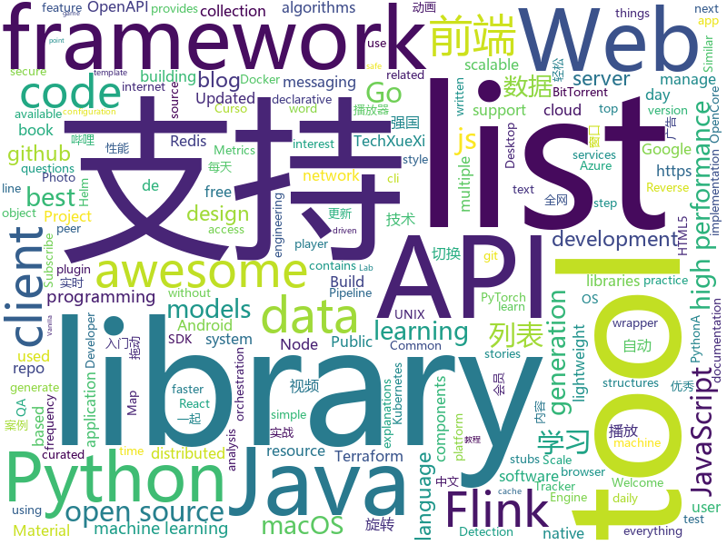

# 2020-11-14
See what the GitHub community is most excited about.

## python
+ [PathPlanning](https://github.com/zhm-real/PathPlanning)(**109 stars today**): Common used path planning algorithms with animations.
+ [gibMacOS](https://github.com/corpnewt/gibMacOS)(**98 stars today**): Py2/py3 script that can download macOS components direct from Apple
+ [30-Days-Of-Python](https://github.com/Asabeneh/30-Days-Of-Python)(**73 stars today**): 30 days of Python programming challenge is a step by step guide to learn Python programming language in 30 days.
+ [public-apis](https://github.com/public-apis/public-apis)(**221 stars today**): A collective list of free APIs for use in software and web development.
+ [Bringing-Old-Photos-Back-to-Life](https://github.com/microsoft/Bringing-Old-Photos-Back-to-Life)(**11 stars today**): Bringing Old Photo Back to Life (CVPR 2020 oral)
+ [yolov5](https://github.com/ultralytics/yolov5)(**40 stars today**): YOLOv5 in PyTorch > ONNX > CoreML > TFLite
+ [OSX-KVM](https://github.com/kholia/OSX-KVM)(**27 stars today**): Run macOS on QEMU/KVM. Only commercial support is available. With OpenCore + Big Sur support now!
+ [PRET](https://github.com/RUB-NDS/PRET)(**80 stars today**): Printer Exploitation Toolkit - The tool that made dumpster diving obsolete.
+ [kedro](https://github.com/quantumblacklabs/kedro)(**9 stars today**): A Python library that implements software engineering best-practice for data and ML pipelines.
+ [models](https://github.com/tensorflow/models)(**29 stars today**): Models and examples built with TensorFlow
+ [detectron2](https://github.com/facebookresearch/detectron2)(**19 stars today**): Detectron2 is FAIR's next-generation platform for object detection and segmentation.
+ [cython](https://github.com/cython/cython)(**4 stars today**): The most widely used Python to C compiler
+ [macadmin-scripts](https://github.com/munki/macadmin-scripts)(**61 stars today**): Scripts of possible interest to macOS admins
+ [sktime](https://github.com/alan-turing-institute/sktime)(**10 stars today**): A unified toolbox for machine learning with time series
+ [daily-hackernews](https://github.com/xueyuanl/daily-hackernews)(**5 stars today**): Daily hacker news top stories. Subscribe the hackernews daily top stories by watching this repo.
+ [pytorch-lightning](https://github.com/PyTorchLightning/pytorch-lightning)(**20 stars today**): The lightweight PyTorch wrapper for high-performance AI research. Scale your models, not the boilerplate.
+ [scikit-learn](https://github.com/scikit-learn/scikit-learn)(**18 stars today**): scikit-learn: machine learning in Python
+ [autoscraper](https://github.com/alirezamika/autoscraper)(**77 stars today**): A Smart, Automatic, Fast and Lightweight Web Scraper for Python
+ [ray](https://github.com/ray-project/ray)(**18 stars today**): An open source framework that provides a simple, universal API for building distributed applications. Ray is packaged with RLlib, a scalable reinforcement learning library, and Tune, a scalable hyperparameter tuning library.
+ [locust](https://github.com/locustio/locust)(**12 stars today**): Scalable user load testing tool written in Python
+ [bird-bot](https://github.com/natewong1313/bird-bot)(**33 stars today**): A Nintendo Switch checkout bot. Currently supports Walmart and Best buy
+ [insightface](https://github.com/deepinsight/insightface)(**12 stars today**): Face Analysis Project on MXNet
+ [ProperTree](https://github.com/corpnewt/ProperTree)(**8 stars today**): Cross platform GUI plist editor written in python.
+ [TechXueXi](https://github.com/TechXueXi/TechXueXi)(**10 stars today**): 学习强国 xuexiqiangguo 全网最好用学习强国助手：TechXueXi （懒人刷分工具 自动学习）技术强国，支持答题，下载地址：https://github.com/TechXueXi/TechXueXi/releases
+ [diff-match-patch](https://github.com/google/diff-match-patch)(**6 stars today**): Diff Match Patch is a high-performance library in multiple languages that manipulates plain text.

## java
+ [CobaltStrike](https://github.com/Freakboy/CobaltStrike)(**229 stars today**): CobaltStrike's source code
+ [redisson](https://github.com/redisson/redisson)(**32 stars today**): Redisson - Redis Java client with features of In-Memory Data Grid. Over 50 Redis based Java objects and services: Set, Multimap, SortedSet, Map, List, Queue, Deque, Semaphore, Lock, AtomicLong, Map Reduce, Publish / Subscribe, Bloom filter, Spring Cache, Tomcat, Scheduler, JCache API, Hibernate, MyBatis, RPC, local cache ...
+ [GitHub-Chinese-Top-Charts](https://github.com/kon9chunkit/GitHub-Chinese-Top-Charts)(**52 stars today**): 🇨🇳GitHub中文排行榜，帮助你发现高分优秀中文项目、更高效地吸收国人的优秀经验成果；榜单每周更新一次，敬请关注！
+ [ghidra](https://github.com/NationalSecurityAgency/ghidra)(**41 stars today**): Ghidra is a software reverse engineering (SRE) framework
+ [feast](https://github.com/feast-dev/feast)(**6 stars today**): Feature Store for Machine Learning
+ [PictureSelector](https://github.com/LuckSiege/PictureSelector)(**12 stars today**): Picture Selector Library for Android or 图片选择器
+ [dagli](https://github.com/linkedin/dagli)(**33 stars today**): Framework for defining machine learning models, including feature generation and transformations, as directed acyclic graphs (DAGs).
+ [libgdx](https://github.com/libgdx/libgdx)(**10 stars today**): Desktop/Android/HTML5/iOS Java game development framework
+ [pulsar](https://github.com/apache/pulsar)(**5 stars today**): Apache Pulsar - distributed pub-sub messaging system
+ [CS-Notes](https://github.com/CyC2018/CS-Notes)(**87 stars today**): 📚技术面试必备基础知识、Leetcode、计算机操作系统、计算机网络、系统设计、Java、Python、C++
+ [views-widgets-samples](https://github.com/android/views-widgets-samples)(**4 stars today**): Multiple samples showing the best practices in views-widgets on Android.
+ [zeebe](https://github.com/zeebe-io/zeebe)(**4 stars today**): Distributed Workflow Engine for Microservices Orchestration
+ [GSYVideoPlayer](https://github.com/CarGuo/GSYVideoPlayer)(**7 stars today**): 视频播放器（IJKplayer、ExoPlayer、MediaPlayer），HTTPS，支持弹幕，外挂字幕，支持滤镜、水印、gif截图，片头广告、中间广告，多个同时播放，支持基本的拖动，声音、亮度调节，支持边播边缓存，支持视频自带rotation的旋转（90,270之类），重力旋转与手动旋转的同步支持，支持列表播放 ，列表全屏动画，视频加载速度，列表小窗口支持拖动，动画效果，调整比例，多分辨率切换，支持切换播放器，进度条小窗口预览，列表切换详情页面无缝播放，rtsp、concat、mpeg。
+ [skywalking](https://github.com/apache/skywalking)(**19 stars today**): APM, Application Performance Monitoring System
+ [iceberg](https://github.com/apache/iceberg)(**3 stars today**): Apache Iceberg
+ [grpc-java](https://github.com/grpc/grpc-java)(**7 stars today**): The Java gRPC implementation. HTTP/2 based RPC
+ [graal](https://github.com/oracle/graal)(**15 stars today**): GraalVM: Run Programs Faster Anywhere🚀
+ [BILIBILI-HELPER](https://github.com/JunzhouLiu/BILIBILI-HELPER)(**37 stars today**): B站，哔哩哔哩（Bilibili）自动签到每日自动投币，银瓜子兑换硬币，领取大会员福利，大会员月底给自己充电等。每天轻松获取65经验值。赶快和我一起成为Lv6吧！
+ [openapi-generator](https://github.com/OpenAPITools/openapi-generator)(**14 stars today**): OpenAPI Generator allows generation of API client libraries (SDK generation), server stubs, documentation and configuration automatically given an OpenAPI Spec (v2, v3)
+ [strimzi-kafka-operator](https://github.com/strimzi/strimzi-kafka-operator)(**2 stars today**): Apache Kafka running on Kubernetes
+ [kubernetes-client](https://github.com/fabric8io/kubernetes-client)(**2 stars today**): Java client for Kubernetes & OpenShift
+ [java](https://github.com/thaycacac/java)(**0 stars today**): All source java, data structures and algorithms, lab java...
+ [flink-learning](https://github.com/zhisheng17/flink-learning)(**11 stars today**): flink learning blog. http://www.flink-learning.com 含 Flink 入门、概念、原理、实战、性能调优、源码解析等内容。涉及 Flink Connector、Metrics、Library、DataStream API、Table API & SQL 等内容的学习案例，还有 Flink 落地应用的大型项目案例（PVUV、日志存储、百亿数据实时去重、监控告警）分享。欢迎大家支持我的专栏《大数据实时计算引擎 Flink 实战与性能优化》
+ [guice](https://github.com/google/guice)(**4 stars today**): Guice (pronounced 'juice') is a lightweight dependency injection framework for Java 6 and above, brought to you by Google.
+ [liferay-portal](https://github.com/liferay/liferay-portal)(**2 stars today**): 

## unknown
+ [the-book-of-secret-knowledge](https://github.com/trimstray/the-book-of-secret-knowledge)(**88 stars today**): A collection of inspiring lists, manuals, cheatsheets, blogs, hacks, one-liners, cli/web tools and more.
+ [awesome](https://github.com/sindresorhus/awesome)(**219 stars today**): 😎Awesome lists about all kinds of interesting topics
+ [javascript-questions](https://github.com/lydiahallie/javascript-questions)(**110 stars today**): A long list of (advanced) JavaScript questions, and their explanations✨
+ [awesome-production-machine-learning](https://github.com/EthicalML/awesome-production-machine-learning)(**23 stars today**): A curated list of awesome open source libraries to deploy, monitor, version and scale your machine learning
+ [developer-roadmap](https://github.com/kamranahmedse/developer-roadmap)(**168 stars today**): Roadmap to becoming a web developer in 2020
+ [for-mac](https://github.com/docker/for-mac)(**22 stars today**): Bug reports for Docker Desktop for Mac
+ [leetcode_101](https://github.com/changgyhub/leetcode_101)(**77 stars today**): LeetCode 101：和你一起你轻松刷题（C++）
+ [widevine-l3-decryptor](https://github.com/tomer8007/widevine-l3-decryptor)(**8 stars today**): A Chrome extension that demonstrates bypassing Widevine L3 DRM
+ [free-programming-books](https://github.com/EbookFoundation/free-programming-books)(**124 stars today**): 📚Freely available programming books
+ [QA_bible](https://github.com/Vladislav610/QA_bible)(**7 stars today**): Библия QA/тестировщика это 200++ страниц обновляемой смеси ответов на вопросы с реальных собеседований на QA, перевода интересного контента с зарубежных ресурсов и агрегации материала с отечественных.
+ [trackerslist](https://github.com/ngosang/trackerslist)(**21 stars today**): Updated list of public BitTorrent trackers
+ [eloquente-javascript](https://github.com/braziljs/eloquente-javascript)(**5 stars today**): Tradução do livro Eloquent JavaScript - 2ª edição.
+ [awesome-vue](https://github.com/vuejs/awesome-vue)(**30 stars today**): 🎉A curated list of awesome things related to Vue.js
+ [SS-Rule-Snippet](https://github.com/Hackl0us/SS-Rule-Snippet)(**10 stars today**): 搜集、整理、维护 Surge / Quantumult / Shadowrocket / Surfboard / clash(X) 实用规则。
+ [coronavirus-data](https://github.com/nychealth/coronavirus-data)(**3 stars today**): 
+ [awesome-dotnet](https://github.com/quozd/awesome-dotnet)(**7 stars today**): A collection of awesome .NET libraries, tools, frameworks and software
+ [AMD_Vanilla](https://github.com/AMD-OSX/AMD_Vanilla)(**5 stars today**): Native AMD macOS via Clover & OpenCore
+ [Python](https://github.com/TwoWater/Python)(**19 stars today**): 最良心的 Python 教程：
+ [Music-Controller-Web-App-Tutorial](https://github.com/techwithtim/Music-Controller-Web-App-Tutorial)(**1 stars today**): 
+ [TrackersListCollection](https://github.com/XIU2/TrackersListCollection)(**25 stars today**): 🎈Updated daily! A list of popular BitTorrent Trackers! / 每天更新！全网热门 BT Tracker 列表！
+ [awesome-for-beginners](https://github.com/MunGell/awesome-for-beginners)(**81 stars today**): A list of awesome beginners-friendly projects.
+ [google-10000-english](https://github.com/first20hours/google-10000-english)(**3 stars today**): This repo contains a list of the 10,000 most common English words in order of frequency, as determined by n-gram frequency analysis of the Google's Trillion Word Corpus.
+ [roadmap](https://github.com/docker/roadmap)(**4 stars today**): Welcome to the Public Roadmap for All Things Docker! We welcome your ideas.
+ [WSL](https://github.com/microsoft/WSL)(**11 stars today**): Issues found on WSL
+ [You-Dont-Know-JS](https://github.com/getify/You-Dont-Know-JS)(**59 stars today**): A book series on JavaScript. @YDKJS on twitter.

## javascript
+ [clean-code-javascript](https://github.com/ryanmcdermott/clean-code-javascript)(**108 stars today**): 🛁Clean Code concepts adapted for JavaScript
+ [Web-Dev-For-Beginners](https://github.com/microsoft/Web-Dev-For-Beginners)(**111 stars today**): 24 Lessons, 12 Weeks, Get Started as a Web Developer
+ [faker.js](https://github.com/Marak/faker.js)(**383 stars today**): generate massive amounts of realistic fake data in Node.js and the browser
+ [Git-User-Switch](https://github.com/geongeorge/Git-User-Switch)(**137 stars today**): Switch git user and email at ease
+ [mermaid](https://github.com/mermaid-js/mermaid)(**35 stars today**): Generation of diagram and flowchart from text in a similar manner as markdown
+ [monaco-editor](https://github.com/microsoft/monaco-editor)(**15 stars today**): A browser based code editor
+ [notion-clone](https://github.com/konstantinmuenster/notion-clone)(**260 stars today**): Edit Notes like in Notion.so. Full-Stack App using React/Express.
+ [editly](https://github.com/mifi/editly)(**58 stars today**): Slick, declarative command line video editing & API
+ [javascript-algorithms](https://github.com/trekhleb/javascript-algorithms)(**109 stars today**): 📝Algorithms and data structures implemented in JavaScript with explanations and links to further readings
+ [koa](https://github.com/koajs/koa)(**13 stars today**): Expressive middleware for node.js using ES2017 async functions
+ [22120](https://github.com/c9fe/22120)(**262 stars today**): 🏛️22120 - Self-host the Internet with an Offline Archive. Like binaries? https://github.com/dosyago/22120/releases Similar to ArchiveBox, SingleFile and WebMemex, but gooderer.
+ [quasar](https://github.com/quasarframework/quasar)(**22 stars today**): Quasar Framework - Build high-performance VueJS user interfaces in record time
+ [three.js](https://github.com/mrdoob/three.js)(**28 stars today**): JavaScript 3D library.
+ [material-ui](https://github.com/mui-org/material-ui)(**37 stars today**): React components for faster and easier web development. Build your own design system, or start with Material Design.
+ [awx](https://github.com/ansible/awx)(**10 stars today**): AWX Project
+ [ramda](https://github.com/ramda/ramda)(**14 stars today**): 🐏Practical functional Javascript
+ [shaka-player](https://github.com/google/shaka-player)(**6 stars today**): JavaScript player library / DASH & HLS client / MSE-EME player
+ [Web](https://github.com/qianguyihao/Web)(**22 stars today**): 前端入门到进阶图文教程，超详细的Web前端学习笔记。从零开始学前端，做一名精致优雅的前端工程师。公众号「千古壹号」作者。
+ [tech-interview-handbook](https://github.com/yangshun/tech-interview-handbook)(**84 stars today**): 💯Materials to help you rock your next coding interview
+ [fullstack-course4](https://github.com/jhu-ep-coursera/fullstack-course4)(**10 stars today**): Example code for HTML, CSS, and Javascript for Web Developers Coursera Course
+ [webdriverio](https://github.com/webdriverio/webdriverio)(**6 stars today**): Next-gen browser and mobile automation test framework for Node.js
+ [Prebid.js](https://github.com/prebid/Prebid.js)(**0 stars today**): Setup and manage header bidding advertising partners without writing code or confusing line items. Prebid.js is open source and free.
+ [potree](https://github.com/potree/potree)(**6 stars today**): WebGL point cloud viewer for large datasets
+ [Awesome-Design-Tools](https://github.com/goabstract/Awesome-Design-Tools)(**15 stars today**): The best design tools and plugins for everything👉
+ [gpu.js](https://github.com/gpujs/gpu.js)(**17 stars today**): GPU Accelerated JavaScript

## html
+ [free-for-dev](https://github.com/ripienaar/free-for-dev)(**92 stars today**): A list of SaaS, PaaS and IaaS offerings that have free tiers of interest to devops and infradev
+ [Front-end-Developer-Interview-Questions](https://github.com/h5bp/Front-end-Developer-Interview-Questions)(**45 stars today**): A list of helpful front-end related questions you can use to interview potential candidates, test yourself or completely ignore.
+ [LearnCS8-Resume](https://github.com/JordanSchuetz/LearnCS8-Resume)(**167 stars today**): Resume template website for the LearnCS8 Lab 3
+ [tailwindcss-forms](https://github.com/tailwindlabs/tailwindcss-forms)(**33 stars today**): 
+ [my-little-crony](https://github.com/sophieehill/my-little-crony)(**11 stars today**): A visualization of the connections between Tory politicians and companies being awarded government contracts during the pandemic.
+ [RateMySupervisor](https://github.com/kgco/RateMySupervisor)(**12 stars today**): 永久免费开源的导师评价数据、数据爬虫、无需编程基础的展示网页以及新信息补充平台
+ [blackeye](https://github.com/x3rz/blackeye)(**7 stars today**): This is the updated version of blackeye with ngrok
+ [helm-charts](https://github.com/prometheus-community/helm-charts)(**8 stars today**): Prometheus community Helm charts
+ [blog_os](https://github.com/phil-opp/blog_os)(**13 stars today**): Writing an OS in Rust
+ [swagger-codegen](https://github.com/swagger-api/swagger-codegen)(**9 stars today**): swagger-codegen contains a template-driven engine to generate documentation, API clients and server stubs in different languages by parsing your OpenAPI / Swagger definition.
+ [html-css](https://github.com/gustavoguanabara/html-css)(**13 stars today**): Curso de HTML5 e CSS3
+ [Actions-OpenWrt](https://github.com/garypang13/Actions-OpenWrt)(**9 stars today**): Automatic unattended weekly builds of the current OpenWrt development master branch
+ [blog](https://github.com/biaochenxuying/blog)(**8 stars today**): 大前端技术为主，读书笔记、随笔、理财为辅，做个终身学习者。
+ [charts](https://github.com/airflow-helm/charts)(**3 stars today**): the home of the stable/airflow Helm chart
+ [pg-gelistirici](https://github.com/tubitak-bilgem-yte/pg-gelistirici)(**14 stars today**): Türkçe PostgreSQL Yönetici Dokümantasyonu
+ [cp-ansible](https://github.com/confluentinc/cp-ansible)(**0 stars today**): Ansible playbooks for the Confluent Platform
+ [django-DefectDojo](https://github.com/DefectDojo/django-DefectDojo)(**1 stars today**): DefectDojo is an open-source application vulnerability correlation and security orchestration tool.
+ [hugo-coder](https://github.com/luizdepra/hugo-coder)(**3 stars today**): A minimalist blog theme for hugo.
+ [MatBlazor](https://github.com/SamProf/MatBlazor)(**10 stars today**): Material Design components for Blazor and Razor Components
+ [learning-area](https://github.com/mdn/learning-area)(**4 stars today**): Github repo for the MDN Learning Area.
+ [JavaScript30](https://github.com/wesbos/JavaScript30)(**6 stars today**): 30 Day Vanilla JS Challenge
+ [hyperblog](https://github.com/freddier/hyperblog)(**6 stars today**): Un blog increíble para el curso de Git y Github de Platzi
+ [charts](https://github.com/bitnami/charts)(**6 stars today**): Helm Charts
+ [BigBookofR](https://github.com/oscarbaruffa/BigBookofR)(**6 stars today**): The biggest collection of R books (and maybe later some other resources too)
+ [calico](https://github.com/projectcalico/calico)(**3 stars today**): Cloud native networking and network security

## go
+ [cortex](https://github.com/cortexlabs/cortex)(**17 stars today**): Deploy machine learning models to production
+ [teler](https://github.com/kitabisa/teler)(**88 stars today**): Real-time HTTP Intrusion Detection
+ [cosmos-sdk](https://github.com/cosmos/cosmos-sdk)(**4 stars today**): ⛓️A Framework for Building High Value Public Blockchains✨
+ [sqlc](https://github.com/kyleconroy/sqlc)(**10 stars today**): Generate type safe Go from SQL
+ [go-ipfs](https://github.com/ipfs/go-ipfs)(**8 stars today**): IPFS implementation in Go
+ [aws-sdk-go](https://github.com/aws/aws-sdk-go)(**5 stars today**): AWS SDK for the Go programming language.
+ [photoprism](https://github.com/photoprism/photoprism)(**68 stars today**): Personal Photo Management powered by Go and Google TensorFlow
+ [k9s](https://github.com/derailed/k9s)(**23 stars today**): 🐶Kubernetes CLI To Manage Your Clusters In Style!
+ [nats-server](https://github.com/nats-io/nats-server)(**9 stars today**): High-Performance server for NATS, the cloud native messaging system.
+ [lazydocker](https://github.com/jesseduffield/lazydocker)(**10 stars today**): The lazier way to manage everything docker
+ [Modlishka](https://github.com/drk1wi/Modlishka)(**12 stars today**): Modlishka. Reverse Proxy.
+ [CBL-Mariner](https://github.com/microsoft/CBL-Mariner)(**13 stars today**): Linux OS for Azure 1P services and edge appliances
+ [terraform-provider-azurerm](https://github.com/terraform-providers/terraform-provider-azurerm)(**5 stars today**): Terraform provider for Azure Resource Manager
+ [redis](https://github.com/go-redis/redis)(**15 stars today**): Type-safe Redis client for Golang
+ [k0s](https://github.com/k0sproject/k0s)(**93 stars today**): k0s - Zero Friction Kubernetes
+ [client_golang](https://github.com/prometheus/client_golang)(**3 stars today**): Prometheus instrumentation library for Go applications
+ [gopass](https://github.com/gopasspw/gopass)(**5 stars today**): The slightly more awesome standard unix password manager for teams
+ [pipeline](https://github.com/tektoncd/pipeline)(**9 stars today**): A K8s-native Pipeline resource.
+ [terraform](https://github.com/hashicorp/terraform)(**13 stars today**): Terraform enables you to safely and predictably create, change, and improve infrastructure. It is an open source tool that codifies APIs into declarative configuration files that can be shared amongst team members, treated as code, edited, reviewed, and versioned.
+ [telegraf](https://github.com/influxdata/telegraf)(**8 stars today**): The plugin-driven server agent for collecting & reporting metrics.
+ [evilginx2](https://github.com/kgretzky/evilginx2)(**7 stars today**): Standalone man-in-the-middle attack framework used for phishing login credentials along with session cookies, allowing for the bypass of 2-factor authentication
+ [age](https://github.com/FiloSottile/age)(**9 stars today**): A simple, modern and secure encryption tool (and Go library) with small explicit keys, no config options, and UNIX-style composability.
+ [berty](https://github.com/berty/berty)(**8 stars today**): Berty is a secure peer-to-peer messaging app that works with or without internet access, cellular data or trust in the network
+ [magma](https://github.com/magma/magma)(**5 stars today**): Platform for building access networks and modular network services
+ [terragrunt](https://github.com/gruntwork-io/terragrunt)(**6 stars today**): Terragrunt is a thin wrapper for Terraform that provides extra tools for working with multiple Terraform modules.

## WordCloud

