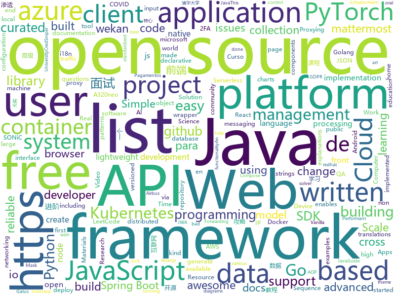

# 2020-11-17
See what the GitHub community is most excited about.

## python
+ [Bringing-Old-Photos-Back-to-Life](https://github.com/microsoft/Bringing-Old-Photos-Back-to-Life)(**694 stars today**): Bringing Old Photo Back to Life (CVPR 2020 oral)
+ [faker](https://github.com/joke2k/faker)(**130 stars today**): Faker is a Python package that generates fake data for you.
+ [arXiv2020-RIFE](https://github.com/hzwer/arXiv2020-RIFE)(**142 stars today**): RIFE: Real-Time Intermediate Flow Estimation for Video Frame Interpolation
+ [public-apis](https://github.com/public-apis/public-apis)(**244 stars today**): A collective list of free APIs for use in software and web development.
+ [pytorch-lightning](https://github.com/PyTorchLightning/pytorch-lightning)(**32 stars today**): The lightweight PyTorch wrapper for high-performance AI research. Scale your models, not the boilerplate.
+ [core](https://github.com/home-assistant/core)(**136 stars today**): 🏡Open source home automation that puts local control and privacy first
+ [pwManager](https://github.com/KalleHallden/pwManager)(**16 stars today**): 
+ [LibreASR](https://github.com/iceychris/LibreASR)(**74 stars today**): 💬An On-Premises, Streaming Speech Recognition System
+ [frigate](https://github.com/blakeblackshear/frigate)(**4 stars today**): NVR with realtime local object detection for IP cameras
+ [big-list-of-naughty-strings](https://github.com/minimaxir/big-list-of-naughty-strings)(**45 stars today**): The Big List of Naughty Strings is a list of strings which have a high probability of causing issues when used as user-input data.
+ [cpython](https://github.com/python/cpython)(**24 stars today**): The Python programming language
+ [models](https://github.com/tensorflow/models)(**35 stars today**): Models and examples built with TensorFlow
+ [qiling](https://github.com/qilingframework/qiling)(**8 stars today**): Qiling Advanced Binary Emulation Framework
+ [transformers](https://github.com/huggingface/transformers)(**62 stars today**): 🤗Transformers: State-of-the-art Natural Language Processing for Pytorch and TensorFlow 2.0.
+ [electrum](https://github.com/spesmilo/electrum)(**4 stars today**): Electrum Bitcoin Wallet
+ [Instagram-](https://github.com/Bitwise-01/Instagram-)(**8 stars today**): Bruteforce attack for Instagram
+ [recommenders](https://github.com/microsoft/recommenders)(**11 stars today**): Best Practices on Recommendation Systems
+ [hydra](https://github.com/facebookresearch/hydra)(**5 stars today**): Hydra is a framework for elegantly configuring complex applications
+ [youtube-dl-gui](https://github.com/MrS0m30n3/youtube-dl-gui)(**23 stars today**): A cross platform front-end GUI of the popular youtube-dl written in wxPython.
+ [PyTorch_YOLOv4](https://github.com/WongKinYiu/PyTorch_YOLOv4)(**14 stars today**): PyTorch implementation of YOLOv4
+ [poetry](https://github.com/python-poetry/poetry)(**14 stars today**): Python dependency management and packaging made easy.
+ [serverless-application-model](https://github.com/aws/serverless-application-model)(**6 stars today**): AWS Serverless Application Model (SAM) is an open-source framework for building serverless applications
+ [incubator-tvm](https://github.com/apache/incubator-tvm)(**10 stars today**): Open deep learning compiler stack for cpu, gpu and specialized accelerators
+ [fairseq](https://github.com/pytorch/fairseq)(**16 stars today**): Facebook AI Research Sequence-to-Sequence Toolkit written in Python.
+ [peewee](https://github.com/coleifer/peewee)(**7 stars today**): a small, expressive orm -- supports postgresql, mysql and sqlite

## java
+ [EhViewer](https://github.com/seven332/EhViewer)(**8 stars today**): [DEPRECATED] An Unofficial E-Hentai Application for Android
+ [JavaGuide](https://github.com/Snailclimb/JavaGuide)(**89 stars today**): 「Java学习+面试指南」一份涵盖大部分Java程序员所需要掌握的核心知识。准备 Java 面试，首选 JavaGuide！
+ [dagli](https://github.com/linkedin/dagli)(**23 stars today**): Framework for defining machine learning models, including feature generation and transformations, as directed acyclic graphs (DAGs).
+ [thingsboard](https://github.com/thingsboard/thingsboard)(**15 stars today**): Open-source IoT Platform - Device management, data collection, processing and visualization.
+ [jadx](https://github.com/skylot/jadx)(**39 stars today**): Dex to Java decompiler
+ [openvidu](https://github.com/OpenVidu/openvidu)(**8 stars today**): OpenVidu Platform main repository
+ [mockserver](https://github.com/mock-server/mockserver)(**1 stars today**): MockServer enables easy mocking of any system you integrate with via HTTP or HTTPS with clients written in Java, JavaScript and Ruby. MockServer also includes a proxy that introspects all proxied traffic including encrypted SSL traffic and supports Port Forwarding, Web Proxying (i.e. HTTP proxy), HTTPS Tunneling Proxying (using HTTP CONNECT) and…
+ [spring-cloud-kubernetes](https://github.com/spring-cloud/spring-cloud-kubernetes)(**2 stars today**): Kubernetes integration with Spring Cloud Discovery Client, Configuration, etc...
+ [keycloak](https://github.com/keycloak/keycloak)(**6 stars today**): Open Source Identity and Access Management For Modern Applications and Services
+ [hibernate-orm](https://github.com/hibernate/hibernate-orm)(**2 stars today**): Hibernate's core Object/Relational Mapping functionality
+ [ExoPlayer](https://github.com/google/ExoPlayer)(**14 stars today**): An extensible media player for Android
+ [quarkus](https://github.com/quarkusio/quarkus)(**12 stars today**): Quarkus: Supersonic Subatomic Java.
+ [jvm-sandbox](https://github.com/alibaba/jvm-sandbox)(**8 stars today**): Real - time non-invasive AOP framework container based on JVM
+ [skija](https://github.com/JetBrains/skija)(**103 stars today**): Skia bindings for Java
+ [azure-sdk-for-java](https://github.com/Azure/azure-sdk-for-java)(**1 stars today**): This repository is for active development of the Azure SDK for Java. For consumers of the SDK we recommend visiting our public developer docs at https://docs.microsoft.com/en-us/java/azure/ or our versioned developer docs at https://azure.github.io/azure-sdk-for-java.
+ [debezium](https://github.com/debezium/debezium)(**8 stars today**): Change data capture for a variety of databases. Please log issues at https://issues.redhat.com/browse/DBZ.
+ [pulsar](https://github.com/apache/pulsar)(**6 stars today**): Apache Pulsar - distributed pub-sub messaging system
+ [jabref](https://github.com/JabRef/jabref)(**5 stars today**): Graphical Java application for managing BibTeX and biblatex (.bib) databases
+ [spring-boot-examples](https://github.com/ityouknow/spring-boot-examples)(**20 stars today**): about learning Spring Boot via examples. Spring Boot 教程、技术栈示例代码，快速简单上手教程。
+ [java-design-patterns](https://github.com/iluwatar/java-design-patterns)(**22 stars today**): Design patterns implemented in Java
+ [aws-lambda-developer-guide](https://github.com/awsdocs/aws-lambda-developer-guide)(**6 stars today**): The AWS Lambda Developer Guide
+ [spring-framework](https://github.com/spring-projects/spring-framework)(**27 stars today**): Spring Framework
+ [jib](https://github.com/GoogleContainerTools/jib)(**8 stars today**): 🏗Build container images for your Java applications.
+ [elasticsearch](https://github.com/elastic/elasticsearch)(**19 stars today**): Open Source, Distributed, RESTful Search Engine
+ [capacitor](https://github.com/ionic-team/capacitor)(**4 stars today**): Build cross-platform Native Progressive Web Apps for iOS, Android, and the Web⚡️

## unknown
+ [free-programming-books](https://github.com/EbookFoundation/free-programming-books)(**293 stars today**): 📚Freely available programming books
+ [awesome](https://github.com/sindresorhus/awesome)(**639 stars today**): 😎Awesome lists about all kinds of interesting topics
+ [javascript-questions](https://github.com/lydiahallie/javascript-questions)(**442 stars today**): A long list of (advanced) JavaScript questions, and their explanations✨
+ [awesome-for-beginners](https://github.com/MunGell/awesome-for-beginners)(**174 stars today**): A list of awesome beginners-friendly projects.
+ [makair](https://github.com/makers-for-life/makair)(**63 stars today**): 🫁 The first open-source ventilator tested on human patients. Mass-producible at a low cost (~2000€).
+ [pix-api](https://github.com/bacen/pix-api)(**10 stars today**): API Pix: a API do Arranjo de Pagamentos Instantâneos Brasileiro.
+ [xcode-hardware-performance](https://github.com/ashfurrow/xcode-hardware-performance)(**31 stars today**): Results from running Xcode on a non-trivial open source project using various Macs
+ [QA_bible](https://github.com/Vladislav610/QA_bible)(**4 stars today**): Библия QA/тестировщика это 200++ страниц обновляемой смеси ответов на вопросы с реальных собеседований на QA, перевода интересного контента с зарубежных ресурсов и агрегации материала с отечественных.
+ [blog](https://github.com/yygmind/blog)(**6 stars today**): 我是木易杨，公众号「高级前端进阶」作者，跟着我每周重点攻克一个前端面试重难点。接下来让我带你走进高级前端的世界，在进阶的路上，共勉！
+ [vagas](https://github.com/frontendbr/vagas)(**9 stars today**): 🔬Espaço para divulgação de vagas para front-enders.
+ [Public-APIs](https://github.com/n0shake/Public-APIs)(**3 stars today**): 📚A public list of APIs from round the web.
+ [AD-Pentest-Notes](https://github.com/chriskaliX/AD-Pentest-Notes)(**60 stars today**): 用于记录内网渗透(域渗透)学习 :-)
+ [awesome-production-machine-learning](https://github.com/EthicalML/awesome-production-machine-learning)(**13 stars today**): A curated list of awesome open source libraries to deploy, monitor, version and scale your machine learning
+ [leetcode_101](https://github.com/changgyhub/leetcode_101)(**36 stars today**): LeetCode 101：和你一起你轻松刷题（C++）
+ [computer-science](https://github.com/ossu/computer-science)(**33 stars today**): 🎓Path to a free self-taught education in Computer Science!
+ [the-incredible-pytorch](https://github.com/ritchieng/the-incredible-pytorch)(**24 stars today**): The Incredible PyTorch: a curated list of tutorials, papers, projects, communities and more relating to PyTorch.
+ [COVID-19](https://github.com/CSSEGISandData/COVID-19)(**17 stars today**): Novel Coronavirus (COVID-19) Cases, provided by JHU CSSE
+ [awesome-wechat-weapp](https://github.com/justjavac/awesome-wechat-weapp)(**26 stars today**): 微信小程序开发资源汇总💯
+ [awesome-scalability](https://github.com/binhnguyennus/awesome-scalability)(**14 stars today**): The Patterns of Scalable, Reliable, and Performant Large-Scale Systems
+ [Interview_Question_for_Beginner](https://github.com/JaeYeopHan/Interview_Question_for_Beginner)(**14 stars today**): 👦👧Technical-Interview guidelines written for those who started studying programming. I wish you all the best.👾
+ [reverse-interview](https://github.com/viraptor/reverse-interview)(**20 stars today**): Questions to ask the company during your interview
+ [awesome-public-datasets](https://github.com/awesomedata/awesome-public-datasets)(**20 stars today**): A topic-centric list of HQ open datasets.
+ [coronavirus-data](https://github.com/nychealth/coronavirus-data)(**0 stars today**): 
+ [ShameCom](https://github.com/ShameCom/ShameCom)(**23 stars today**): 收集校招污点公司或组织，帮助学弟学妹避雷。互联网不曾遗忘！
+ [shareOI](https://github.com/hzwer/shareOI)(**66 stars today**): 算法竞赛课件分享

## javascript
+ [Web-Dev-For-Beginners](https://github.com/microsoft/Web-Dev-For-Beginners)(**1,047 stars today**): 24 Lessons, 12 Weeks, Get Started as a Web Developer
+ [BrasilAPI](https://github.com/BrasilAPI/BrasilAPI)(**390 stars today**): Vamos transformar o Brasil em uma API?
+ [homebridgeStatusWidget](https://github.com/lwitzani/homebridgeStatusWidget)(**29 stars today**): 
+ [javascript-algorithms](https://github.com/trekhleb/javascript-algorithms)(**350 stars today**): 📝Algorithms and data structures implemented in JavaScript with explanations and links to further readings
+ [beautiful-react-diagrams](https://github.com/antonioru/beautiful-react-diagrams)(**66 stars today**): A tiny collection of lightweight React components for building diagrams with ease💎
+ [clean-code-javascript](https://github.com/ryanmcdermott/clean-code-javascript)(**366 stars today**): 🛁Clean Code concepts adapted for JavaScript
+ [iptv](https://github.com/iptv-org/iptv)(**250 stars today**): Collection of 5000+ publicly available IPTV channels from all over the world
+ [FFCreator](https://github.com/tnfe/FFCreator)(**171 stars today**): 一个基于node.js的高速短视频加工库 A fast short video processing library based on node.js
+ [tech-interview-handbook](https://github.com/yangshun/tech-interview-handbook)(**250 stars today**): 💯Materials to help you rock your next coding interview
+ [buster](https://github.com/dessant/buster)(**18 stars today**): Captcha solver extension for humans
+ [a32nx](https://github.com/flybywiresim/a32nx)(**9 stars today**): The A32NX Project is a community driven open source project to create a free Airbus A320neo in Microsoft Flight Simulator that is as close to reality as possible. It aims to enhance the default A320neo by improving the systems depth and functionality to bring it up to payware-level, all for free.
+ [mattermost-webapp](https://github.com/mattermost/mattermost-webapp)(**2 stars today**): Webapp of Mattermost server: https://github.com/mattermost/mattermost-server
+ [cypress](https://github.com/cypress-io/cypress)(**26 stars today**): Fast, easy and reliable testing for anything that runs in a browser.
+ [wekan](https://github.com/wekan/wekan)(**10 stars today**): The open-source kanban (built with Meteor). Keep variable/table/field names camelCase. For translations, only add Pull Request changes to wekan/i18n/en.i18n.json , other translations are done at https://transifex.com/wekan/wekan only.
+ [odoo](https://github.com/odoo/odoo)(**13 stars today**): Odoo. Open Source Apps To Grow Your Business.
+ [Inputmask](https://github.com/RobinHerbots/Inputmask)(**2 stars today**): Input Mask plugin
+ [tailwind-landing-page-template](https://github.com/cruip/tailwind-landing-page-template)(**30 stars today**): Simple Light is a free landing page template built on top of TailwindCSS and fully coded in React. Made by
+ [jose](https://github.com/panva/jose)(**9 stars today**): Universal "JSON Web Almost Everything" - JWA, JWS, JWE, JWT, JWK with no dependencies
+ [react](https://github.com/facebook/react)(**66 stars today**): A declarative, efficient, and flexible JavaScript library for building user interfaces.
+ [QuantumultX](https://github.com/Orz-3/QuantumultX)(**11 stars today**): 
+ [axios](https://github.com/axios/axios)(**43 stars today**): Promise based HTTP client for the browser and node.js
+ [react-window](https://github.com/bvaughn/react-window)(**10 stars today**): React components for efficiently rendering large lists and tabular data
+ [cookieconsent](https://github.com/osano/cookieconsent)(**5 stars today**): A free solution to the EU, GDPR, and California Cookie Laws
+ [discord.js](https://github.com/discordjs/discord.js)(**9 stars today**): A powerful JavaScript library for interacting with the Discord API
+ [underscore](https://github.com/jashkenas/underscore)(**3 stars today**): JavaScript's utility _ belt

## html
+ [free-for-dev](https://github.com/ripienaar/free-for-dev)(**370 stars today**): A list of SaaS, PaaS and IaaS offerings that have free tiers of interest to devops and infradev
+ [charts](https://github.com/bitnami/charts)(**4 stars today**): Helm Charts
+ [hyperblog](https://github.com/freddier/hyperblog)(**8 stars today**): Un blog increíble para el curso de Git y Github de Platzi
+ [covid19-forecast-hub](https://github.com/reichlab/covid19-forecast-hub)(**2 stars today**): Projections of COVID-19, in standardized format
+ [zju-icicles](https://github.com/QSCTech/zju-icicles)(**50 stars today**): 浙江大学课程攻略共享计划
+ [JavaScript30](https://github.com/wesbos/JavaScript30)(**16 stars today**): 30 Day Vanilla JS Challenge
+ [CKSS-Certified-Kubernetes-Security-Specialist](https://github.com/ibrahimjelliti/CKSS-Certified-Kubernetes-Security-Specialist)(**12 stars today**): This repository is a collection of resources to prepare for the Certified Kubernetes Security Specialist (CKSS) exam.
+ [home-assistant.io](https://github.com/home-assistant/home-assistant.io)(**3 stars today**): 📘Home Assistant User documentation
+ [hugo-book](https://github.com/alex-shpak/hugo-book)(**3 stars today**): Hugo documentation theme as simple as plain book
+ [ai-edu](https://github.com/microsoft/ai-edu)(**10 stars today**): AI education materials for Chinese students, teachers and IT professionals.
+ [moveit_tutorials](https://github.com/ros-planning/moveit_tutorials)(**0 stars today**): A sphinx-based centralized documentation repo for MoveIt
+ [awesome-compose](https://github.com/docker/awesome-compose)(**6 stars today**): Awesome Docker Compose samples
+ [SONiC](https://github.com/Azure/SONiC)(**2 stars today**): Landing page for Software for Open Networking in the Cloud (SONiC) - http://azure.github.io/SONiC/
+ [html-css](https://github.com/gustavoguanabara/html-css)(**8 stars today**): Curso de HTML5 e CSS3
+ [foundation-sites](https://github.com/foundation/foundation-sites)(**2 stars today**): The most advanced responsive front-end framework in the world. Quickly create prototypes and production code for sites that work on any kind of device.
+ [screenfull.js](https://github.com/sindresorhus/screenfull.js)(**4 stars today**): Simple wrapper for cross-browser usage of the JavaScript Fullscreen API
+ [favorites-web](https://github.com/cloudfavorites/favorites-web)(**3 stars today**): 云收藏 Spring Boot 2.X 开源项目
+ [RateMySupervisor](https://github.com/kgco/RateMySupervisor)(**17 stars today**): 永久免费开源的导师评价数据、数据爬虫、无需编程基础的展示网页以及新信息补充平台
+ [Java-Interview-Advanced](https://github.com/shishan100/Java-Interview-Advanced)(**2 stars today**): 中华石杉--互联网Java进阶面试训练营
+ [kartu-pelajar](https://github.com/erzetid/kartu-pelajar)(**3 stars today**): Coba
+ [magic-modules](https://github.com/GoogleCloudPlatform/magic-modules)(**0 stars today**): Automatically generate Google Cloud Platform support for OSS IaaC Projects
+ [calico](https://github.com/projectcalico/calico)(**3 stars today**): Cloud native networking and network security
+ [helm-charts](https://github.com/codecentric/helm-charts)(**1 stars today**): A curated set of Helm charts brought to you by codecentric
+ [REKCARC-TSC-UHT](https://github.com/PKUanonym/REKCARC-TSC-UHT)(**43 stars today**): 清华大学计算机系课程攻略 Guidance for courses in Department of Computer Science and Technology, Tsinghua University
+ [CredSniper](https://github.com/ustayready/CredSniper)(**8 stars today**): CredSniper is a phishing framework written with the Python micro-framework Flask and Jinja2 templating which supports capturing 2FA tokens.

## go
+ [k0s](https://github.com/k0sproject/k0s)(**352 stars today**): k0s - Zero Friction Kubernetes
+ [crowdsec](https://github.com/crowdsecurity/crowdsec)(**46 stars today**): Crowdsec - An open-source, lightweight agent to detect and respond to bad behaviours. It also automatically benefits from our global community-wide IP reputation database.
+ [colly](https://github.com/gocolly/colly)(**16 stars today**): Elegant Scraper and Crawler Framework for Golang
+ [gatus](https://github.com/TwinProduction/gatus)(**54 stars today**): ⛑Gatus - Automated service health dashboard
+ [LeetCode-Go](https://github.com/halfrost/LeetCode-Go)(**163 stars today**): ✅Solutions to LeetCode by Go, 100% test coverage, runtime beats 100% / LeetCode 题解
+ [charts](https://github.com/helm/charts)(**11 stars today**): ⚠️(OBSOLETE) Curated applications for Kubernetes
+ [air](https://github.com/cosmtrek/air)(**14 stars today**): ☁️Live reload for Go apps
+ [containerd](https://github.com/containerd/containerd)(**3 stars today**): An open and reliable container runtime
+ [kraken](https://github.com/uber/kraken)(**12 stars today**): P2P Docker registry capable of distributing TBs of data in seconds
+ [go-ipfs](https://github.com/ipfs/go-ipfs)(**4 stars today**): IPFS implementation in Go
+ [grpc-go](https://github.com/grpc/grpc-go)(**9 stars today**): The Go language implementation of gRPC. HTTP/2 based RPC
+ [rancher](https://github.com/rancher/rancher)(**8 stars today**): Complete container management platform
+ [go-echarts](https://github.com/go-echarts/go-echarts)(**21 stars today**): 🎨The adorable charts library for Golang
+ [waypoint](https://github.com/hashicorp/waypoint)(**12 stars today**): A tool to build, deploy, and release any application on any platform.
+ [terraform-provider-azurerm](https://github.com/terraform-providers/terraform-provider-azurerm)(**4 stars today**): Terraform provider for Azure Resource Manager
+ [ingress-nginx](https://github.com/kubernetes/ingress-nginx)(**14 stars today**): NGINX Ingress Controller for Kubernetes
+ [go-elasticsearch](https://github.com/elastic/go-elasticsearch)(**6 stars today**): The official Go client for Elasticsearch
+ [terraform](https://github.com/hashicorp/terraform)(**17 stars today**): Terraform enables you to safely and predictably create, change, and improve infrastructure. It is an open source tool that codifies APIs into declarative configuration files that can be shared amongst team members, treated as code, edited, reviewed, and versioned.
+ [nats.go](https://github.com/nats-io/nats.go)(**2 stars today**): Golang client for NATS, the cloud native messaging system.
+ [MailHog](https://github.com/mailhog/MailHog)(**12 stars today**): Web and API based SMTP testing
+ [opentelemetry-collector](https://github.com/open-telemetry/opentelemetry-collector)(**4 stars today**): OpenTelemetry Collector
+ [kubebuilder](https://github.com/kubernetes-sigs/kubebuilder)(**5 stars today**): Kubebuilder - SDK for building Kubernetes APIs using CRDs
+ [trivy](https://github.com/aquasecurity/trivy)(**8 stars today**): A Simple and Comprehensive Vulnerability Scanner for Containers, Suitable for CI
+ [kratos](https://github.com/ory/kratos)(**22 stars today**): Never build user login, user registration, 2fa, profile management ever again! Works on any operating system, cloud, with any programming language, user interface, and user experience! Written in Go.
+ [skaffold](https://github.com/GoogleContainerTools/skaffold)(**4 stars today**): Easy and Repeatable Kubernetes Development

## WordCloud

