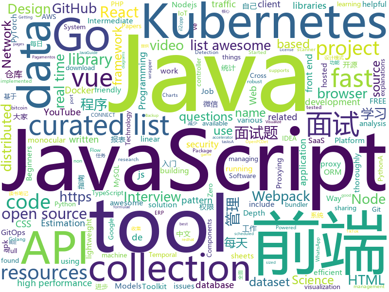

# 2020-11-18
See what the GitHub community is most excited about.

## python
+ [youtube-dl](https://github.com/ytdl-org/youtube-dl)(**2,336 stars today**): Command-line program to download videos from YouTube.com and other video sites
+ [Packer-Fuzzer](https://github.com/rtcatc/Packer-Fuzzer)(**109 stars today**): Packer Fuzzer is a fast and efficient scanner for security detection of websites constructed by javascript module bundler such as Webpack.
+ [Bringing-Old-Photos-Back-to-Life](https://github.com/microsoft/Bringing-Old-Photos-Back-to-Life)(**694 stars today**): Bringing Old Photo Back to Life (CVPR 2020 oral)
+ [CPM-Generate](https://github.com/TsinghuaAI/CPM-Generate)(**104 stars today**): Chinese Pre-Trained Language Models (CPM-LM) Version-I
+ [arXiv2020-RIFE](https://github.com/hzwer/arXiv2020-RIFE)(**113 stars today**): RIFE: Real-Time Intermediate Flow Estimation for Video Frame Interpolation
+ [pytorch-lightning](https://github.com/PyTorchLightning/pytorch-lightning)(**88 stars today**): The lightweight PyTorch wrapper for high-performance AI research. Scale your models, not the boilerplate.
+ [faker](https://github.com/joke2k/faker)(**213 stars today**): Faker is a Python package that generates fake data for you.
+ [you-get](https://github.com/soimort/you-get)(**78 stars today**): ⏬Dumb downloader that scrapes the web
+ [TikTok-Api](https://github.com/davidteather/TikTok-Api)(**13 stars today**): The Unofficial TikTok API Wrapper In Python
+ [python-patterns](https://github.com/faif/python-patterns)(**17 stars today**): A collection of design patterns/idioms in Python
+ [pwManager](https://github.com/KalleHallden/pwManager)(**11 stars today**): 
+ [bitcoinbook](https://github.com/bitcoinbook/bitcoinbook)(**7 stars today**): Mastering Bitcoin 2nd Edition - Programming the Open Blockchain
+ [prophet](https://github.com/facebook/prophet)(**14 stars today**): Tool for producing high quality forecasts for time series data that has multiple seasonality with linear or non-linear growth.
+ [ml-hypersim](https://github.com/apple/ml-hypersim)(**28 stars today**): The Hypersim Toolkit is a set of tools for generating photorealistic synthetic datasets from V-Ray scenes.
+ [OpenPCDet](https://github.com/open-mmlab/OpenPCDet)(**7 stars today**): OpenPCDet Toolbox for LiDAR-based 3D Object Detection.
+ [pyserial](https://github.com/pyserial/pyserial)(**6 stars today**): Python serial port access library
+ [PARL](https://github.com/PaddlePaddle/PARL)(**23 stars today**): A high-performance distributed training framework for Reinforcement Learning
+ [numpy-100](https://github.com/rougier/numpy-100)(**10 stars today**): 100 numpy exercises (with solutions)
+ [pashmak](https://github.com/parsampsh/pashmak)(**8 stars today**): The Pashmak Programming Language
+ [namedivider-python](https://github.com/rskmoi/namedivider-python)(**29 stars today**): A tool for dividing the Japanese full name into a family name and a given name.
+ [youtube-dl-gui](https://github.com/MrS0m30n3/youtube-dl-gui)(**23 stars today**): A cross platform front-end GUI of the popular youtube-dl written in wxPython.
+ [T-GCN](https://github.com/lehaifeng/T-GCN)(**4 stars today**): Temporal Graph Convolutional Network for Urban Traffic Flow Prediction Method
+ [faceswap](https://github.com/deepfakes/faceswap)(**34 stars today**): Deepfakes Software For All
+ [pytorch_geometric_temporal](https://github.com/benedekrozemberczki/pytorch_geometric_temporal)(**13 stars today**): A Temporal Extension Library for PyTorch Geometric
+ [peewee](https://github.com/coleifer/peewee)(**6 stars today**): a small, expressive orm -- supports postgresql, mysql and sqlite

## java
+ [skija](https://github.com/JetBrains/skija)(**528 stars today**): Skia bindings for Java
+ [ObjectiveSql](https://github.com/braisdom/ObjectiveSql)(**77 stars today**): ObjectiveSQL is an ORM framework in Java base on ActiveRecord pattern, which encourages rapid development and clean, codes with the least and convention over configuration.
+ [java-design-patterns](https://github.com/iluwatar/java-design-patterns)(**36 stars today**): Design patterns implemented in Java
+ [quarkus](https://github.com/quarkusio/quarkus)(**13 stars today**): Quarkus: Supersonic Subatomic Java.
+ [shenandoah-visualizer](https://github.com/openjdk/shenandoah-visualizer)(**21 stars today**): 
+ [debezium](https://github.com/debezium/debezium)(**9 stars today**): Change data capture for a variety of databases. Please log issues at https://issues.redhat.com/browse/DBZ.
+ [jabref](https://github.com/JabRef/jabref)(**3 stars today**): Graphical Java application for managing BibTeX and biblatex (.bib) databases
+ [thingsboard](https://github.com/thingsboard/thingsboard)(**21 stars today**): Open-source IoT Platform - Device management, data collection, processing and visualization.
+ [MiDaS](https://github.com/intel-isl/MiDaS)(**8 stars today**): Code for robust monocular depth estimation described in "Ranftl et. al., Towards Robust Monocular Depth Estimation: Mixing Datasets for Zero-shot Cross-dataset Transfer, TPAMI 2020"
+ [springCloud](https://github.com/acloudyh/springCloud)(**5 stars today**): 尚硅谷springCloud学习
+ [CtCI-6th-Edition](https://github.com/careercup/CtCI-6th-Edition)(**9 stars today**): Cracking the Coding Interview 6th Ed. Solutions
+ [jsoup](https://github.com/jhy/jsoup)(**2 stars today**): jsoup: Java HTML Parser, with best of DOM, CSS, and jquery
+ [mockserver](https://github.com/mock-server/mockserver)(**9 stars today**): MockServer enables easy mocking of any system you integrate with via HTTP or HTTPS with clients written in Java, JavaScript and Ruby. MockServer also includes a proxy that introspects all proxied traffic including encrypted SSL traffic and supports Port Forwarding, Web Proxying (i.e. HTTP proxy), HTTPS Tunneling Proxying (using HTTP CONNECT) and…
+ [jshERP](https://github.com/jishenghua/jshERP)(**9 stars today**): 华夏ERP基于SpringBoot框架和SaaS模式，立志为中小企业提供开源好用的ERP软件，目前专注进销存+财务功能。主要模块有零售管理、采购管理、销售管理、仓库管理、财务管理、报表查询、系统管理等。支持预付款、收入支出、仓库调拨、组装拆卸、订单等特色功能。拥有库存状况、出入库统计等报表。同时对角色和权限进行了细致全面控制，精确到每个按钮和菜单。
+ [JavaGuide](https://github.com/Snailclimb/JavaGuide)(**87 stars today**): 「Java学习+面试指南」一份涵盖大部分Java程序员所需要掌握的核心知识。准备 Java 面试，首选 JavaGuide！
+ [ShedLock](https://github.com/lukas-krecan/ShedLock)(**3 stars today**): Distributed lock for your scheduled tasks
+ [FakerAndroid](https://github.com/Efaker/FakerAndroid)(**12 stars today**): A tool translate a apk file to stantard android project include so hook api and il2cpp c++ scaffolding when apk is a unity il2cpp game.
+ [google-signin](https://github.com/react-native-google-signin/google-signin)(**3 stars today**): Google Sign-in for your React Native applications
+ [arthas](https://github.com/alibaba/arthas)(**21 stars today**): Alibaba Java Diagnostic Tool Arthas/Alibaba Java诊断利器Arthas
+ [ipscan](https://github.com/angryip/ipscan)(**1 stars today**): Angry IP Scanner - fast and friendly network scanner
+ [ShiroScan](https://github.com/fupinglee/ShiroScan)(**8 stars today**): Shiro RememberMe 1.2.4 反序列化漏洞图形化检测工具(Shiro-550)
+ [jadx](https://github.com/skylot/jadx)(**35 stars today**): Dex to Java decompiler
+ [xdm](https://github.com/subhra74/xdm)(**6 stars today**): Powerfull download accelerator and video downloader
+ [druid](https://github.com/apache/druid)(**5 stars today**): Apache Druid: a high performance real-time analytics database.
+ [docker-java](https://github.com/docker-java/docker-java)(**6 stars today**): Java Docker API Client

## unknown
+ [awesome-reMarkable](https://github.com/reHackable/awesome-reMarkable)(**494 stars today**): A curated list of projects related to the reMarkable tablet
+ [free-programming-books](https://github.com/EbookFoundation/free-programming-books)(**331 stars today**): 📚Freely available programming books
+ [pix-api](https://github.com/bacen/pix-api)(**17 stars today**): API Pix: a API do Arranjo de Pagamentos Instantâneos Brasileiro.
+ [awesome-healthcare](https://github.com/kakoni/awesome-healthcare)(**45 stars today**): Curated list of awesome open source healthcare software, libraries, tools and resources.
+ [data-science-learning-resources](https://github.com/bradleyboehmke/data-science-learning-resources)(**17 stars today**): A collection of machine learning resources that I've found helpful (I only post what I've read!)
+ [jetbrains-agent-latest](https://github.com/Mike-bel/jetbrains-agent-latest)(**4 stars today**): Intellij IDEA License Activation
+ [makair](https://github.com/makers-for-life/makair)(**116 stars today**): 🫁 The first open-source ventilator tested on human patients. Mass-producible at a low cost (~2000€).
+ [annotated_research_papers](https://github.com/AakashKumarNain/annotated_research_papers)(**3 stars today**): This repo contains annotated research papers that I found really good and useful
+ [awesome-php](https://github.com/ziadoz/awesome-php)(**6 stars today**): A curated list of amazingly awesome PHP libraries, resources and shiny things.
+ [build-your-own-x](https://github.com/danistefanovic/build-your-own-x)(**105 stars today**): 🤓Build your own (insert technology here)
+ [awesome-for-beginners](https://github.com/MunGell/awesome-for-beginners)(**125 stars today**): A list of awesome beginners-friendly projects.
+ [awesome-react-components](https://github.com/brillout/awesome-react-components)(**16 stars today**): Curated List of React Components & Libraries.
+ [Security-List](https://github.com/Penetrum-Security/Security-List)(**230 stars today**): Opensource security tools list
+ [perf-book](https://github.com/nnethercote/perf-book)(**413 stars today**): The Rust Performance Book
+ [javascript-questions](https://github.com/lydiahallie/javascript-questions)(**204 stars today**): A long list of (advanced) JavaScript questions, and their explanations✨
+ [xcode-hardware-performance](https://github.com/ashfurrow/xcode-hardware-performance)(**23 stars today**): Results from running Xcode on a non-trivial open source project using various Macs
+ [roadmap](https://github.com/docker/roadmap)(**12 stars today**): Welcome to the Public Roadmap for All Things Docker! We welcome your ideas.
+ [datasharing](https://github.com/jtleek/datasharing)(**6 stars today**): The Leek group guide to data sharing
+ [applied-ml](https://github.com/eugeneyan/applied-ml)(**9 stars today**): 📚Papers by organizations sharing their work on applied data science & machine learning.
+ [Tools-to-Design-or-Visualize-Architecture-of-Neural-Network](https://github.com/ashishpatel26/Tools-to-Design-or-Visualize-Architecture-of-Neural-Network)(**9 stars today**): Tools to Design or Visualize Architecture of Neural Network
+ [ladder](https://github.com/unidbaas/ladder)(**14 stars today**): 梯子约拍小程序-前端
+ [awesome-remote-job](https://github.com/lukasz-madon/awesome-remote-job)(**6 stars today**): A curated list of awesome remote jobs and resources. Inspired by https://github.com/vinta/awesome-python
+ [effects-bibliography](https://github.com/yallop/effects-bibliography)(**4 stars today**): A collaborative bibliography of work related to the theory and practice of computational effects
+ [DevYouTubeList](https://github.com/ErikCH/DevYouTubeList)(**3 stars today**): List of Development YouTube Channels

## javascript
+ [Web-Dev-For-Beginners](https://github.com/microsoft/Web-Dev-For-Beginners)(**1,226 stars today**): 24 Lessons, 12 Weeks, Get Started as a Web Developer
+ [javascript-algorithms](https://github.com/trekhleb/javascript-algorithms)(**474 stars today**): 📝Algorithms and data structures implemented in JavaScript with explanations and links to further readings
+ [BrasilAPI](https://github.com/BrasilAPI/BrasilAPI)(**257 stars today**): Vamos transformar o Brasil em uma API?
+ [beautiful-react-diagrams](https://github.com/antonioru/beautiful-react-diagrams)(**228 stars today**): A tiny collection of lightweight React components for building diagrams with ease💎
+ [ttv-ublock](https://github.com/odensc/ttv-ublock)(**54 stars today**): Blocking ads on that certain streaming website
+ [gh-pages-url-shortener](https://github.com/nelsontky/gh-pages-url-shortener)(**72 stars today**): Minimal URL shortener that can be entirely hosted on GitHub pages.
+ [fe-interview](https://github.com/haizlin/fe-interview)(**47 stars today**): 前端面试每日 3+1，以面试题来驱动学习，提倡每日学习与思考，每天进步一点！每天早上5点纯手工发布面试题（死磕自己，愉悦大家），3000+道前端面试题全面覆盖，HTML/CSS/JavaScript/Vue/React/Nodejs/TypeScript/ECMAScritpt/Webpack/Jquery/小程序/软技能……
+ [iptv](https://github.com/iptv-org/iptv)(**175 stars today**): Collection of 5000+ publicly available IPTV channels from all over the world
+ [Quantumult-X](https://github.com/crossutility/Quantumult-X)(**2 stars today**): 
+ [fetch](https://github.com/github/fetch)(**6 stars today**): A window.fetch JavaScript polyfill.
+ [react](https://github.com/facebook/react)(**80 stars today**): A declarative, efficient, and flexible JavaScript library for building user interfaces.
+ [intl-tel-input](https://github.com/jackocnr/intl-tel-input)(**4 stars today**): A JavaScript plugin for entering and validating international telephone numbers
+ [bitcore](https://github.com/bitpay/bitcore)(**3 stars today**): A full stack for bitcoin and blockchain-based applications
+ [Daily-Interview-Question](https://github.com/Advanced-Frontend/Daily-Interview-Question)(**44 stars today**): 我是木易杨，公众号「高级前端进阶」作者，每天搞定一道前端大厂面试题，祝大家天天进步，一年后会看到不一样的自己。
+ [cep-promise](https://github.com/BrasilAPI/cep-promise)(**64 stars today**): Busca por CEP integrado diretamente aos serviços dos Correios, ViaCEP e outros (Node.js e Browser)
+ [front-end-interview-handbook](https://github.com/yangshun/front-end-interview-handbook)(**38 stars today**): 🕸No-bullshit answers to the famous h5bp "Front-end Job Interview Questions"
+ [getting-started](https://github.com/docker/getting-started)(**10 stars today**): Getting started with Docker
+ [vue-h5-template](https://github.com/sunniejs/vue-h5-template)(**6 stars today**): 🎉vue搭建移动端开发,基于vue-cli4.0+webpack 4+vant ui + sass+ rem适配方案+axios封装，构建手机端模板脚手架
+ [FE-Interview](https://github.com/lgwebdream/FE-Interview)(**30 stars today**): 前端面试必备题库，1000+面试真题，Html、Css、JavaScript、Vue、React、Node、TypeScript、Webpack、算法、网络与安全、浏览器
+ [ws](https://github.com/websockets/ws)(**29 stars today**): Simple to use, blazing fast and thoroughly tested WebSocket client and server for Node.js
+ [whatsapp-web.js](https://github.com/pedroslopez/whatsapp-web.js)(**10 stars today**): A WhatsApp client library for NodeJS that connects through the WhatsApp Web browser app
+ [mapbox-gl-js](https://github.com/mapbox/mapbox-gl-js)(**7 stars today**): Interactive, thoroughly customizable maps in the browser, powered by vector tiles and WebGL
+ [cube.js](https://github.com/cube-js/cube.js)(**14 stars today**): 📊Cube.js — Open-Source Analytical API Platform
+ [vue2-happyfri](https://github.com/bailicangdu/vue2-happyfri)(**5 stars today**): vue2 + vue-router + vuex 入门项目
+ [wxapkg-convertor](https://github.com/ezshine/wxapkg-convertor)(**7 stars today**): 一个反编译微信小程序的工具，仓库也收集各种微信小程序/小游戏.wxapkg文件

## html
+ [tools](https://github.com/googlecodelabs/tools)(**6 stars today**): Codelabs management & hosting tools
+ [free_r_tips](https://github.com/business-science/free_r_tips)(**12 stars today**): Free R-Tips is a FREE Newsletter provided by Business Science. It comes with bite-sized code tutorials every Tuesday.
+ [blog](https://github.com/biaochenxuying/blog)(**29 stars today**): 大前端技术为主，读书笔记、随笔、理财为辅，做个终身学习者。
+ [taskmanager-13](https://github.com/htmlacademy-ecmascript/taskmanager-13)(**1 stars today**): Демо-проект «Менеджер задач» для курса «JavaScript. Архитектура клиентских приложений»
+ [kubelabs](https://github.com/collabnix/kubelabs)(**9 stars today**): Kubernetes - Beginners | Intermediate | Advanced
+ [Modern-HTML-Starter-Template](https://github.com/harryheman/Modern-HTML-Starter-Template)(**10 stars today**): Modern HTML Starter Template
+ [html](https://github.com/whatwg/html)(**5 stars today**): HTML Standard
+ [Front-end-Developer-Interview-Questions](https://github.com/h5bp/Front-end-Developer-Interview-Questions)(**46 stars today**): A list of helpful front-end related questions you can use to interview potential candidates, test yourself or completely ignore.
+ [REKCARC-TSC-UHT](https://github.com/PKUanonym/REKCARC-TSC-UHT)(**17 stars today**): 清华大学计算机系课程攻略 Guidance for courses in Department of Computer Science and Technology, Tsinghua University
+ [training-kit](https://github.com/github/training-kit)(**2 stars today**): Open source cheat sheets for Git and GitHub
+ [fundament](https://github.com/ligangcode/fundament)(**14 stars today**): code for fund
+ [ImportJSON](https://github.com/bradjasper/ImportJSON)(**2 stars today**): Import JSON into Google Sheets, this library adds various ImportJSON functions to your spreadsheet
+ [ru.javascript.info](https://github.com/javascript-tutorial/ru.javascript.info)(**4 stars today**): Современный учебник JavaScript
+ [kubernetes-goat](https://github.com/madhuakula/kubernetes-goat)(**2 stars today**): Kubernetes Goat is "Vulnerable by Design" Kubernetes Cluster.
+ [phpstan](https://github.com/phpstan/phpstan)(**5 stars today**): PHP Static Analysis Tool - discover bugs in your code without running it!
+ [free-for-dev](https://github.com/ripienaar/free-for-dev)(**134 stars today**): A list of SaaS, PaaS and IaaS offerings that have free tiers of interest to devops and infradev
+ [awesome-angular](https://github.com/PatrickJS/awesome-angular)(**3 stars today**): 📄A curated list of awesome Angular resources
+ [charts](https://github.com/bitnami/charts)(**8 stars today**): Helm Charts
+ [Front-end-Web-Development-Interview-Question](https://github.com/paddingme/Front-end-Web-Development-Interview-Question)(**5 stars today**): 前端开发面试题大收集，前端面试集锦❤️💝💘
+ [fluxion](https://github.com/FluxionNetwork/fluxion)(**3 stars today**): Fluxion is a remake of linset by vk496 with enhanced functionality.
+ [formulae.brew.sh](https://github.com/Homebrew/formulae.brew.sh)(**2 stars today**): 🏎An online formulae browser for Homebrew
+ [node-interview](https://github.com/ElemeFE/node-interview)(**14 stars today**): How to pass the Node.js interview of ElemeFE.
+ [hyperblog](https://github.com/freddier/hyperblog)(**10 stars today**): Un blog increíble para el curso de Git y Github de Platzi
+ [CKSS-Certified-Kubernetes-Security-Specialist](https://github.com/ibrahimjelliti/CKSS-Certified-Kubernetes-Security-Specialist)(**5 stars today**): This repository is a collection of resources to prepare for the Certified Kubernetes Security Specialist (CKSS) exam.
+ [AvStackDocs](https://github.com/ty6815/AvStackDocs)(**2 stars today**): 音视频基础知识整理和相关协议文档说明

## go
+ [k0s](https://github.com/k0sproject/k0s)(**706 stars today**): k0s - Zero Friction Kubernetes
+ [tidb](https://github.com/pingcap/tidb)(**56 stars today**): TiDB is an open source distributed HTAP database compatible with the MySQL protocol
+ [statsview](https://github.com/go-echarts/statsview)(**54 stars today**): 🚀A real-time Golang runtime stats visualization profiler
+ [ion](https://github.com/pion/ion)(**4 stars today**): Distributed RTC System by pure Go and Flutter
+ [go-echarts](https://github.com/go-echarts/go-echarts)(**28 stars today**): 🎨The adorable charts library for Golang
+ [flux2](https://github.com/fluxcd/flux2)(**11 stars today**): Open and extensible continuous delivery solution for Kubernetes. Powered by GitOps Toolkit.
+ [velero](https://github.com/vmware-tanzu/velero)(**4 stars today**): Backup and migrate Kubernetes applications and their persistent volumes
+ [aws-controllers-k8s](https://github.com/aws/aws-controllers-k8s)(**17 stars today**): AWS Controllers for Kubernetes (ACK) is a project enabling you to manage AWS services from Kubernetes
+ [Mastering_Go_Second_Edition_Zh_CN](https://github.com/hantmac/Mastering_Go_Second_Edition_Zh_CN)(**19 stars today**): Mastering Go 第二版中文版来袭！
+ [the-way-to-go_ZH_CN](https://github.com/unknwon/the-way-to-go_ZH_CN)(**64 stars today**): 《The Way to Go》中文译本，中文正式名《Go 入门指南》
+ [esbuild](https://github.com/evanw/esbuild)(**36 stars today**): An extremely fast JavaScript bundler and minifier
+ [golang-notes](https://github.com/cch123/golang-notes)(**6 stars today**): Go source code analysis(zh-cn)
+ [podman](https://github.com/containers/podman)(**23 stars today**): Podman: A tool for managing OCI containers and pods
+ [task](https://github.com/go-task/task)(**6 stars today**): A task runner / simpler Make alternative written in Go
+ [golang-design-pattern](https://github.com/senghoo/golang-design-pattern)(**9 stars today**): 设计模式 Golang实现－《研磨设计模式》读书笔记
+ [helm](https://github.com/helm/helm)(**13 stars today**): The Kubernetes Package Manager
+ [air](https://github.com/cosmtrek/air)(**16 stars today**): ☁️Live reload for Go apps
+ [actions-runner-controller](https://github.com/summerwind/actions-runner-controller)(**8 stars today**): Kubernetes controller for GitHub Actions self-hosted runnners
+ [terraform-provider-aws](https://github.com/hashicorp/terraform-provider-aws)(**7 stars today**): Terraform AWS provider
+ [tailscale](https://github.com/tailscale/tailscale)(**15 stars today**): The easiest, most secure way to use WireGuard and 2FA.
+ [ferry](https://github.com/lanyulei/ferry)(**31 stars today**): 本系统是集工单统计、任务钩子、权限管理、灵活配置流程与模版等等于一身的开源工单系统，当然也可以称之为工作流引擎。 致力于减少跨部门之间的沟通，自动任务的执行，提升工作效率与工作质量，减少不必要的工作量与人为出错率。
+ [influxdb](https://github.com/influxdata/influxdb)(**22 stars today**): Scalable datastore for metrics, events, and real-time analytics
+ [MailHog](https://github.com/mailhog/MailHog)(**10 stars today**): Web and API based SMTP testing
+ [nitro](https://github.com/asim/nitro)(**16 stars today**): Nitro (formerly known as Go Micro) is a blazingly fast framework for distributed app development, IoT, edge and p2p.
+ [flux](https://github.com/fluxcd/flux)(**9 stars today**): The GitOps Kubernetes operator

## WordCloud

