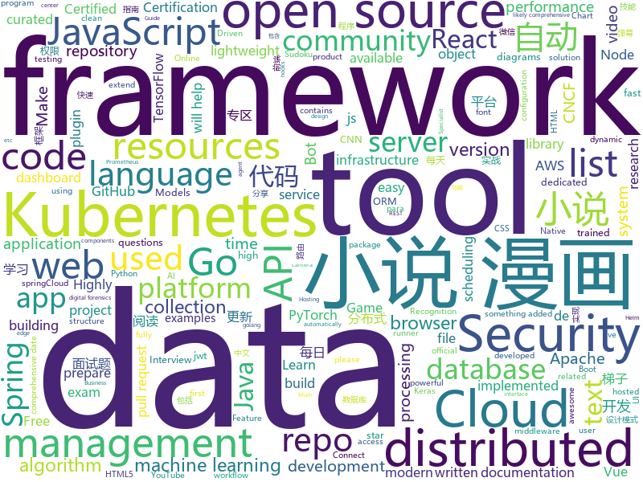

# 2020-11-19
See what the GitHub community is most excited about.

## python
+ [youtube-dl](https://github.com/ytdl-org/youtube-dl)(**2,018 stars today**): Command-line program to download videos from YouTube.com and other video sites
+ [CPM-Generate](https://github.com/TsinghuaAI/CPM-Generate)(**133 stars today**): Chinese Pre-Trained Language Models (CPM-LM) Version-I
+ [genshin-impact-helper](https://github.com/y1ndan/genshin-impact-helper)(**48 stars today**): Auto get Genshin Impact daily bonus by GitHub Actions. 米游社原神自动每日签到
+ [scikit-learn](https://github.com/scikit-learn/scikit-learn)(**22 stars today**): scikit-learn: machine learning in Python
+ [pytorch-lightning](https://github.com/PyTorchLightning/pytorch-lightning)(**137 stars today**): The lightweight PyTorch wrapper for high-performance AI research. Scale your models, not the boilerplate.
+ [faker](https://github.com/joke2k/faker)(**218 stars today**): Faker is a Python package that generates fake data for you.
+ [horovod](https://github.com/horovod/horovod)(**11 stars today**): Distributed training framework for TensorFlow, Keras, PyTorch, and Apache MXNet.
+ [restler-fuzzer](https://github.com/microsoft/restler-fuzzer)(**15 stars today**): RESTler is the first stateful REST API fuzzing tool for automatically testing cloud services through their REST APIs and finding security and reliability bugs in these services.
+ [bips](https://github.com/bitcoin/bips)(**4 stars today**): Bitcoin Improvement Proposals
+ [checkov](https://github.com/bridgecrewio/checkov)(**15 stars today**): Prevent cloud misconfigurations during build-time for Terraform, Cloudformation, Kubernetes, Serverless framework and other infrastructure-as-code-languages with Checkov by Bridgecrew.
+ [SkyAR](https://github.com/jiupinjia/SkyAR)(**116 stars today**): Dynamic sky replacement and harmonization in videos
+ [tornado](https://github.com/tornadoweb/tornado)(**9 stars today**): Tornado is a Python web framework and asynchronous networking library, originally developed at FriendFeed.
+ [zulip](https://github.com/zulip/zulip)(**9 stars today**): Zulip server and webapp - powerful open source team chat
+ [netbox](https://github.com/netbox-community/netbox)(**8 stars today**): IP address management (IPAM) and data center infrastructure management (DCIM) tool.
+ [incubator-superset](https://github.com/apache/incubator-superset)(**15 stars today**): Apache Superset is a Data Visualization and Data Exploration Platform
+ [Mycodo](https://github.com/kizniche/Mycodo)(**8 stars today**): An environmental monitoring and regulation system
+ [SimpleHTR](https://github.com/githubharald/SimpleHTR)(**6 stars today**): Handwritten Text Recognition (HTR) system implemented with TensorFlow.
+ [elyra](https://github.com/elyra-ai/elyra)(**5 stars today**): Elyra extends JupyterLab Notebooks with an AI centric approach.
+ [Sudoku-Solver-AI](https://github.com/1nfinityLoop/Sudoku-Solver-AI)(**16 stars today**): I made a real time Sudoku solver using the camera, it looks for the edges of the Sudoku in the frame, extracts it, solves it and overlays the solution on the puzzle itself. For the digit recognition, I used a CNN, trained using Keras with printed characters from the different ubuntu fonts. For the image processing part, I used OpenCV for the edg…
+ [jupyterhub](https://github.com/jupyterhub/jupyterhub)(**5 stars today**): Multi-user server for Jupyter notebooks
+ [DeepLearningExamples](https://github.com/NVIDIA/DeepLearningExamples)(**14 stars today**): Deep Learning Examples
+ [PhoenixBot](https://github.com/Strip3s/PhoenixBot)(**3 stars today**): Phoenix Bot - A Bird Bot Resurrection
+ [Detectron](https://github.com/facebookresearch/Detectron)(**10 stars today**): FAIR's research platform for object detection research, implementing popular algorithms like Mask R-CNN and RetinaNet.
+ [transformers](https://github.com/huggingface/transformers)(**80 stars today**): 🤗Transformers: State-of-the-art Natural Language Processing for Pytorch and TensorFlow 2.0.
+ [game-and-watch-hacking](https://github.com/ghidraninja/game-and-watch-hacking)(**12 stars today**): This repository contains scripts for working with the Nintendo Game and Watch

## java
+ [ObjectiveSql](https://github.com/braisdom/ObjectiveSql)(**111 stars today**): ObjectiveSQL is an ORM framework in Java base on ActiveRecord pattern, which encourages rapid development and clean, codes with the least and convention over configuration.
+ [skija](https://github.com/JetBrains/skija)(**324 stars today**): Skia bindings for Java
+ [shardingsphere](https://github.com/apache/shardingsphere)(**22 stars today**): Distributed database middleware
+ [druid](https://github.com/alibaba/druid)(**11 stars today**): 阿里巴巴计算平台事业部出品，为监控而生的数据库连接池
+ [feast](https://github.com/feast-dev/feast)(**8 stars today**): Feature Store for Machine Learning
+ [dou-api](https://github.com/adandou/dou-api)(**9 stars today**): 梯子🍀🍀推荐梯子的指南🔥🔥蓝灯 翻墙 代理 科学上网 外网 加速器 梯子 路由
+ [Java](https://github.com/TheAlgorithms/Java)(**25 stars today**): All Algorithms implemented in Java
+ [fiction_house](https://github.com/201206030/fiction_house)(**57 stars today**): 小说精品屋是一个多平台（web、安卓app、微信小程序）、功能完善的屏幕自适应小说阅读弹幕网站，包含精品小说专区、轻小说专区和漫画专区。包括小说/漫画分类、小说/漫画搜索、小说/漫画排行、完本小说/漫画、小说/漫画评分、小说/漫画在线阅读、小说/漫画书架、小说/漫画阅读记录、小说下载、小说弹幕、小说/漫画自动采集/更新/纠错、小说内容自动分享到微博、邮件自动推广、链接自动推送到百度搜索引擎等功能。
+ [itstack-demo-design](https://github.com/fuzhengwei/itstack-demo-design)(**22 stars today**): 小傅哥微信：fustack |《重学Java设计模式「22个互联网真实案例实战」》技术好就一定能写出好代码吗？不能！再漂亮的马桶放到厨房都略显尴尬！无论是家里装修还是上道开车，只有通过实战才能快速将理论转变为技能。毕竟设计模式也是源于 克里斯托佛·亚历山大 的著作 《建筑模式语言》。
+ [dbeaver](https://github.com/dbeaver/dbeaver)(**31 stars today**): Free universal database tool and SQL client
+ [liugh-parent](https://github.com/qq53182347/liugh-parent)(**12 stars today**): SpringBoot+SpringCloud Oauth2+JWT+MybatisPlus实现Restful快速开发后端脚手架
+ [aws-doc-sdk-examples](https://github.com/awsdocs/aws-doc-sdk-examples)(**8 stars today**): Welcome to the AWS Code Examples Repository. This repo contains code examples used in the AWS documentation, AWS SDK Developer Guides, and more. For more information, see the Readme.rst file below.
+ [spring-boot](https://github.com/spring-projects/spring-boot)(**27 stars today**): Spring Boot
+ [springCloud](https://github.com/acloudyh/springCloud)(**7 stars today**): 尚硅谷springCloud学习
+ [groovy](https://github.com/apache/groovy)(**1 stars today**): Apache Groovy: A powerful multi-faceted programming language for the JVM platform
+ [QMUI_Android](https://github.com/Tencent/QMUI_Android)(**7 stars today**): 提高 Android UI 开发效率的 UI 库
+ [tutorials](https://github.com/eugenp/tutorials)(**15 stars today**): Just Announced - "Learn Spring Security OAuth":
+ [cassandra](https://github.com/apache/cassandra)(**11 stars today**): Mirror of Apache Cassandra
+ [Ehviewer_CN_SXJ](https://github.com/shuaixiaojie/Ehviewer_CN_SXJ)(**7 stars today**): 因为ehviewer近一年多没更新了，所以想copy过来试着更新下
+ [incubator-dolphinscheduler](https://github.com/apache/incubator-dolphinscheduler)(**9 stars today**): Dolphin Scheduler is a distributed and easy-to-extend visual workflow scheduling platform, dedicated to solving the complex dependencies in data processing, making the scheduling system out of the box for data processing.(分布式易扩展的可视化工作流任务调度)
+ [autopsy](https://github.com/sleuthkit/autopsy)(**2 stars today**): Autopsy® is a digital forensics platform and graphical interface to The Sleuth Kit® and other digital forensics tools. It can be used by law enforcement, military, and corporate examiners to investigate what happened on a computer. You can even use it to recover photos from your camera's memory card.
+ [ysoserial](https://github.com/frohoff/ysoserial)(**6 stars today**): A proof-of-concept tool for generating payloads that exploit unsafe Java object deserialization.
+ [SpringBoot-Labs](https://github.com/YunaiV/SpringBoot-Labs)(**23 stars today**): 一个涵盖六个专栏：Spring Boot 2.X、Spring Cloud、Spring Cloud Alibaba、Dubbo、分布式消息队列、分布式事务的仓库。希望胖友小手一抖，右上角来个 Star，感恩 1024
+ [kylin](https://github.com/apache/kylin)(**3 stars today**): Apache Kylin
+ [sonarqube-community-branch-plugin](https://github.com/mc1arke/sonarqube-community-branch-plugin)(**3 stars today**): A plugin that allows branch analysis and pull request decoration in the Community version of Sonarqube

## unknown
+ [ScaledYOLOv4](https://github.com/WongKinYiu/ScaledYOLOv4)(**123 stars today**): 
+ [awesome-healthcare](https://github.com/kakoni/awesome-healthcare)(**105 stars today**): Curated list of awesome open source healthcare software, libraries, tools and resources.
+ [resources](https://github.com/PatWalters/resources)(**11 stars today**): A Highly Opinionated List of Open Source Cheminformatics Resources
+ [perf-book](https://github.com/nnethercote/perf-book)(**116 stars today**): The Rust Performance Book
+ [awesome-gcp-certifications](https://github.com/sathishvj/awesome-gcp-certifications)(**10 stars today**): Google Cloud Platform Certification resources.
+ [free-programming-books](https://github.com/EbookFoundation/free-programming-books)(**258 stars today**): 📚Freely available programming books
+ [data-science-learning-resources](https://github.com/bradleyboehmke/data-science-learning-resources)(**108 stars today**): A collection of machine learning resources that I've found helpful (I only post what I've read!)
+ [pix-api](https://github.com/bacen/pix-api)(**48 stars today**): API Pix: a API do Arranjo de Pagamentos Instantâneos Brasileiro.
+ [Certified-Kubernetes-Security-Specialist](https://github.com/walidshaari/Certified-Kubernetes-Security-Specialist)(**29 stars today**): Online resources that will help you prepare for taking the CNCF/Linux Foundation CKS 2020 "Kubernetes Certified Security Specialist" Certification exam. with time, This is not likely the comprehensive up to date list - please make a pull request if there something that should be added here.
+ [awesome-reMarkable](https://github.com/reHackable/awesome-reMarkable)(**150 stars today**): A curated list of projects related to the reMarkable tablet
+ [awesome-lowcode](https://github.com/taowen/awesome-lowcode)(**60 stars today**): 国内低代码平台从业者交流
+ [sig-security](https://github.com/cncf/sig-security)(**35 stars today**): 😎CNCF Special Interest Group on Security -- secure access, policy control, privacy, auditing, explainability and more!
+ [swift-style-guide](https://github.com/raywenderlich/swift-style-guide)(**14 stars today**): The official Swift style guide for raywenderlich.com.
+ [build-your-own-x](https://github.com/danistefanovic/build-your-own-x)(**79 stars today**): 🤓Build your own (insert technology here)
+ [landscape](https://github.com/cncf/landscape)(**8 stars today**): 🌄The Cloud Native Interactive Landscape filters and sorts hundreds of projects and products, and shows details including GitHub stars, funding or market cap, first and last commits, contributor counts, headquarters location, and recent tweets.
+ [Kubernetes-Certified-Administrator](https://github.com/walidshaari/Kubernetes-Certified-Administrator)(**6 stars today**): Online resources that will help you prepare for taking the CNCF CKA 2020 "Kubernetes Certified Administrator" Certification exam. with time, This is not likely the comprehensive up to date list - please make a pull request if there something that should be added here.
+ [open-source-cs](https://github.com/ForrestKnight/open-source-cs)(**10 stars today**): Video discussing this curriculum:
+ [Flutter-Course-Resources](https://github.com/londonappbrewery/Flutter-Course-Resources)(**3 stars today**): Learn to Code While Building Apps - The Complete Flutter Development Bootcamp
+ [Specs](https://github.com/CocoaPods/Specs)(**1 stars today**): The CocoaPods Master Repo
+ [awesome-osint](https://github.com/jivoi/awesome-osint)(**6 stars today**): 😱A curated list of amazingly awesome OSINT
+ [vagas](https://github.com/backend-br/vagas)(**5 stars today**): ✌️Espaço para divulgação de vagas para backenders
+ [project](https://github.com/servo/project)(**25 stars today**): A repo for the Servo Project
+ [CS-Interview-Knowledge-Map](https://github.com/InterviewMap/CS-Interview-Knowledge-Map)(**20 stars today**): Build the best interview map. The current content includes JS, network, browser related, performance optimization, security, framework, Git, data structure, algorithm, etc.
+ [kubecon2020](https://github.com/DataStax-Academy/kubecon2020)(**7 stars today**): 
+ [modern-cpp-features](https://github.com/AnthonyCalandra/modern-cpp-features)(**9 stars today**): A cheatsheet of modern C++ language and library features.

## javascript
+ [beautiful-react-diagrams](https://github.com/antonioru/beautiful-react-diagrams)(**634 stars today**): A tiny collection of lightweight React components for building diagrams with ease💎
+ [javascript-algorithms](https://github.com/trekhleb/javascript-algorithms)(**402 stars today**): 📝Algorithms and data structures implemented in JavaScript with explanations and links to further readings
+ [nuxt.js](https://github.com/nuxt/nuxt.js)(**21 stars today**): The Intuitive Vue Framework
+ [Web-Dev-For-Beginners](https://github.com/microsoft/Web-Dev-For-Beginners)(**969 stars today**): 24 Lessons, 12 Weeks, Get Started as a Web Developer
+ [BrasilAPI](https://github.com/BrasilAPI/BrasilAPI)(**210 stars today**): Vamos transformar o Brasil em uma API?
+ [Font-Awesome](https://github.com/FortAwesome/Font-Awesome)(**43 stars today**): The iconic SVG, font, and CSS toolkit
+ [next.js](https://github.com/vercel/next.js)(**63 stars today**): The React Framework
+ [fe-interview](https://github.com/haizlin/fe-interview)(**96 stars today**): 前端面试每日 3+1，以面试题来驱动学习，提倡每日学习与思考，每天进步一点！每天早上5点纯手工发布面试题（死磕自己，愉悦大家），3000+道前端面试题全面覆盖，HTML/CSS/JavaScript/Vue/React/Nodejs/TypeScript/ECMAScritpt/Webpack/Jquery/小程序/软技能……
+ [venom](https://github.com/orkestral/venom)(**4 stars today**): Venom is a high-performance system developed with JavaScript to create a bot for WhatsApp
+ [drawio-desktop](https://github.com/jgraph/drawio-desktop)(**46 stars today**): Official electron build of diagrams.net
+ [reactjs-interview-questions](https://github.com/sudheerj/reactjs-interview-questions)(**10 stars today**): List of top 500 ReactJS Interview Questions & Answers....Coding exercise questions are coming soon!!
+ [odoo](https://github.com/odoo/odoo)(**13 stars today**): Odoo. Open Source Apps To Grow Your Business.
+ [svelte](https://github.com/sveltejs/svelte)(**42 stars today**): Cybernetically enhanced web apps
+ [ttv-ublock](https://github.com/odensc/ttv-ublock)(**58 stars today**): Blocking ads on that certain streaming website
+ [browsh](https://github.com/browsh-org/browsh)(**145 stars today**): A fully-modern text-based browser, rendering to TTY and browsers
+ [react](https://github.com/facebook/react)(**83 stars today**): A declarative, efficient, and flexible JavaScript library for building user interfaces.
+ [whatsapp-bot](https://github.com/ArugaZ/whatsapp-bot)(**5 stars today**): Whatsapp Bot - Node Js
+ [eslint-plugin-import](https://github.com/benmosher/eslint-plugin-import)(**4 stars today**): ESLint plugin with rules that help validate proper imports.
+ [beautiful-react-hooks](https://github.com/beautifulinteractions/beautiful-react-hooks)(**28 stars today**): 🔥A collection of beautiful and (hopefully) useful React hooks to speed-up your components and hooks development🔥
+ [proshop_mern](https://github.com/bradtraversy/proshop_mern)(**7 stars today**): Shopping cart built with MERN & Redux
+ [ava](https://github.com/avajs/ava)(**5 stars today**): Node.js test runner that lets you develop with confidence🚀
+ [semantic-release](https://github.com/semantic-release/semantic-release)(**11 stars today**): 📦🚀Fully automated version management and package publishing
+ [cypress](https://github.com/cypress-io/cypress)(**21 stars today**): Fast, easy and reliable testing for anything that runs in a browser.
+ [Scriptables](https://github.com/im3x/Scriptables)(**6 stars today**): iOS14桌面组件神器（Scriptable）开发框架、教程、精美脚本分享
+ [redash](https://github.com/getredash/redash)(**6 stars today**): Make Your Company Data Driven. Connect to any data source, easily visualize, dashboard and share your data.

## html
+ [machine-learning-systems-design](https://github.com/chiphuyen/machine-learning-systems-design)(**23 stars today**): A booklet on machine learning systems design with exercises
+ [gh-pages-url-shortener](https://github.com/nelsontky/gh-pages-url-shortener)(**119 stars today**): Minimal URL shortener that can be entirely hosted on GitHub pages.
+ [tools](https://github.com/googlecodelabs/tools)(**12 stars today**): Codelabs management & hosting tools
+ [html-css](https://github.com/gustavoguanabara/html-css)(**10 stars today**): Curso de HTML5 e CSS3
+ [charts](https://github.com/bitnami/charts)(**11 stars today**): Helm Charts
+ [fastText](https://github.com/facebookresearch/fastText)(**11 stars today**): Library for fast text representation and classification.
+ [simple-html-invoice-template](https://github.com/sparksuite/simple-html-invoice-template)(**2 stars today**): A modern, clean, and very simple responsive HTML invoice template.
+ [helm-charts](https://github.com/prometheus-community/helm-charts)(**5 stars today**): Prometheus community Helm charts
+ [text-to-handwriting](https://github.com/saurabhdaware/text-to-handwriting)(**7 stars today**): So your teacher asked you to upload written assignments? Hate writing assigments? This tool will help you convert your text to handwriting xD
+ [speedtest](https://github.com/librespeed/speedtest)(**10 stars today**): Self-hosted Speedtest for HTML5 and more. Easy setup, examples, configurable, mobile friendly. Supports PHP, Node, Multiple servers, and more
+ [free_r_tips](https://github.com/business-science/free_r_tips)(**3 stars today**): Free R-Tips is a FREE Newsletter provided by Business Science. It comes with bite-sized code tutorials every Tuesday.
+ [taskmanager-13](https://github.com/htmlacademy-ecmascript/taskmanager-13)(**1 stars today**): Демо-проект «Менеджер задач» для курса «JavaScript. Архитектура клиентских приложений»
+ [tailwindcss-forms](https://github.com/tailwindlabs/tailwindcss-forms)(**52 stars today**): 
+ [covid-19](https://github.com/rozierguillaume/covid-19)(**2 stars today**): How does COVID-19 spread around the world? Charts, data, dashboards and interpretations...
+ [CKSS-Certified-Kubernetes-Security-Specialist](https://github.com/ibrahimjelliti/CKSS-Certified-Kubernetes-Security-Specialist)(**3 stars today**): This repository is a collection of resources to prepare for the Certified Kubernetes Security Specialist (CKSS) exam.
+ [kubernetes-goat](https://github.com/madhuakula/kubernetes-goat)(**3 stars today**): Kubernetes Goat is "Vulnerable by Design" Kubernetes Cluster.
+ [node-ytdl-core](https://github.com/fent/node-ytdl-core)(**5 stars today**): YouTube video downloader in javascript.
+ [gentelella](https://github.com/ColorlibHQ/gentelella)(**4 stars today**): Free Bootstrap 4 Admin Dashboard Template
+ [ha-floorplan](https://github.com/pkozul/ha-floorplan)(**1 stars today**): Floorplan for Home Assistant
+ [chart-doctor](https://github.com/ft-interactive/chart-doctor)(**2 stars today**): Sample files to accompany the FT's Chart Doctor column
+ [openshift-docs](https://github.com/openshift/openshift-docs)(**0 stars today**): OpenShift 3 and 4 product and community documentation
+ [coding-interview](https://github.com/doocs/coding-interview)(**2 stars today**): 😀代码面试题集，包括剑指 Offer、编程之美等
+ [helm-charts](https://github.com/jenkinsci/helm-charts)(**0 stars today**): Jenkins community Helm charts
+ [website](https://github.com/kubernetes/website)(**7 stars today**): Kubernetes website and documentation repo:
+ [django-DefectDojo](https://github.com/DefectDojo/django-DefectDojo)(**2 stars today**): DefectDojo is an open-source application vulnerability correlation and security orchestration tool.

## go
+ [tidb](https://github.com/pingcap/tidb)(**41 stars today**): TiDB is an open source distributed HTAP database compatible with the MySQL protocol
+ [telegraf](https://github.com/influxdata/telegraf)(**7 stars today**): The plugin-driven server agent for collecting & reporting metrics.
+ [task](https://github.com/go-task/task)(**9 stars today**): A task runner / simpler Make alternative written in Go
+ [crowdsec](https://github.com/crowdsecurity/crowdsec)(**20 stars today**): Crowdsec - An open-source, lightweight agent to detect and respond to bad behaviours. It also automatically benefits from our global community-wide IP reputation database.
+ [thanos](https://github.com/thanos-io/thanos)(**14 stars today**): Highly available Prometheus setup with long term storage capabilities. A CNCF Incubating project.
+ [consul](https://github.com/hashicorp/consul)(**20 stars today**): Consul is a distributed, highly available, and data center aware solution to connect and configure applications across dynamic, distributed infrastructure.
+ [nitro](https://github.com/asim/nitro)(**48 stars today**): Nitro (formerly known as Go Micro) is a blazingly fast framework for distributed app development, IoT, edge and p2p.
+ [agones](https://github.com/googleforgames/agones)(**6 stars today**): Dedicated Game Server Hosting and Scaling for Multiplayer Games on Kubernetes
+ [filebrowser](https://github.com/filebrowser/filebrowser)(**35 stars today**): 📂Web File Browser which can be used as a middleware or standalone app.
+ [enhancements](https://github.com/kubernetes/enhancements)(**2 stars today**): Enhancements tracking repo for Kubernetes
+ [traefik](https://github.com/traefik/traefik)(**19 stars today**): The Cloud Native Application Proxy
+ [the-way-to-go_ZH_CN](https://github.com/unknwon/the-way-to-go_ZH_CN)(**84 stars today**): 《The Way to Go》中文译本，中文正式名《Go 入门指南》
+ [kubernetes](https://github.com/kubernetes/kubernetes)(**33 stars today**): Production-Grade Container Scheduling and Management
+ [sqlx](https://github.com/jmoiron/sqlx)(**11 stars today**): general purpose extensions to golang's database/sql
+ [7days-golang](https://github.com/geektutu/7days-golang)(**25 stars today**): 7 days golang programs from scratch (web framework Gee, distributed cache GeeCache, object relational mapping ORM framework GeeORM, rpc framework GeeRPC etc) 7天用Go动手写/从零实现系列
+ [kubevirt](https://github.com/kubevirt/kubevirt)(**4 stars today**): Kubernetes Virtualization API and runtime in order to define and manage virtual machines.
+ [charts](https://github.com/helm/charts)(**5 stars today**): ⚠️(OBSOLETE) Curated applications for Kubernetes
+ [opentelemetry-collector-contrib](https://github.com/open-telemetry/opentelemetry-collector-contrib)(**0 stars today**): Contrib repository for the OpenTelemetry Collector
+ [k0s](https://github.com/k0sproject/k0s)(**242 stars today**): k0s - Zero Friction Kubernetes
+ [argo](https://github.com/argoproj/argo)(**16 stars today**): Argo Workflows: Get stuff done with Kubernetes.
+ [viper](https://github.com/spf13/viper)(**17 stars today**): Go configuration with fangs
+ [nvm-windows](https://github.com/coreybutler/nvm-windows)(**20 stars today**): A node.js version management utility for Windows. Ironically written in Go.
+ [vault](https://github.com/hashicorp/vault)(**9 stars today**): A tool for secrets management, encryption as a service, and privileged access management
+ [gin-vue-admin](https://github.com/flipped-aurora/gin-vue-admin)(**23 stars today**): 基于gin+vue搭建的后台管理系统框架，集成jwt鉴权，权限管理，动态路由，分页封装，多点登录拦截，资源权限，上传下载，代码生成器，表单生成器等基础功能，五分钟一套CURD前后端代码包含数据库的快感你不要体验一下吗~,更多功能正在开发中，欢迎issue和pr~
+ [eksctl](https://github.com/weaveworks/eksctl)(**5 stars today**): The official CLI for Amazon EKS

## WordCloud

