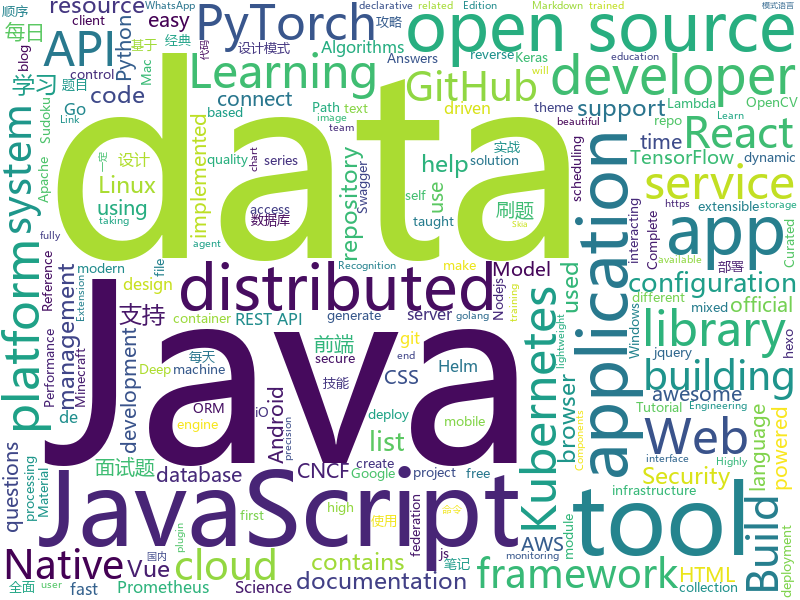

# 2020-11-20
See what the GitHub community is most excited about.

## python
+ [nvidia-bot](https://github.com/Hari-Nagarajan/nvidia-bot)(**11 stars today**): Tool to help us buy a GPU in 2020
+ [genshin-impact-helper](https://github.com/y1ndan/genshin-impact-helper)(**53 stars today**): Auto get Genshin Impact daily bonus by GitHub Actions. 米游社原神自动每日签到
+ [manim](https://github.com/3b1b/manim)(**57 stars today**): Animation engine for explanatory math videos
+ [Sudoku-Solver-AI](https://github.com/1nfinityLoop/Sudoku-Solver-AI)(**14 stars today**): I made a real time Sudoku solver using the camera, it looks for the edges of the Sudoku in the frame, extracts it, solves it and overlays the solution on the puzzle itself. For the digit recognition, I used a CNN, trained using Keras with printed characters from the different ubuntu fonts. For the image processing part, I used OpenCV for the edg…
+ [game-and-watch-hacking](https://github.com/ghidraninja/game-and-watch-hacking)(**15 stars today**): This repository contains scripts for working with the Nintendo Game and Watch
+ [jarm](https://github.com/salesforce/jarm)(**32 stars today**): 
+ [ansible](https://github.com/ansible/ansible)(**21 stars today**): Ansible is a radically simple IT automation platform that makes your applications and systems easier to deploy and maintain. Automate everything from code deployment to network configuration to cloud management, in a language that approaches plain English, using SSH, with no agents to install on remote systems. https://docs.ansible.com.
+ [QUANTAXIS](https://github.com/QUANTAXIS/QUANTAXIS)(**19 stars today**): QUANTAXIS 支持任务调度 分布式部署的 股票/期货/期权/港股/虚拟货币 数据/回测/模拟/交易/可视化/多账户 纯本地量化解决方案
+ [stable-baselines3](https://github.com/DLR-RM/stable-baselines3)(**4 stars today**): PyTorch version of Stable Baselines, improved implementations of reinforcement learning algorithms.
+ [scikit-learn](https://github.com/scikit-learn/scikit-learn)(**72 stars today**): scikit-learn: machine learning in Python
+ [pytorch-tutorial](https://github.com/yunjey/pytorch-tutorial)(**25 stars today**): PyTorch Tutorial for Deep Learning Researchers
+ [imaginaire](https://github.com/NVlabs/imaginaire)(**18 stars today**): NVIDIA PyTorch GAN library with distributed and mixed precision support
+ [restler-fuzzer](https://github.com/microsoft/restler-fuzzer)(**26 stars today**): RESTler is the first stateful REST API fuzzing tool for automatically testing cloud services through their REST APIs and finding security and reliability bugs in these services.
+ [helm-charts](https://github.com/elastic/helm-charts)(**3 stars today**): You know, for Kubernetes
+ [erpnext](https://github.com/frappe/erpnext)(**6 stars today**): Free and Open Source Alternative to SAP
+ [SkyAR](https://github.com/jiupinjia/SkyAR)(**92 stars today**): Dynamic sky replacement and harmonization in videos
+ [Mycodo](https://github.com/kizniche/Mycodo)(**9 stars today**): An environmental monitoring and regulation system
+ [SimpleHTR](https://github.com/githubharald/SimpleHTR)(**19 stars today**): Handwritten Text Recognition (HTR) system implemented with TensorFlow.
+ [horovod](https://github.com/horovod/horovod)(**9 stars today**): Distributed training framework for TensorFlow, Keras, PyTorch, and Apache MXNet.
+ [localstack](https://github.com/localstack/localstack)(**25 stars today**): 💻A fully functional local AWS cloud stack. Develop and test your cloud & Serverless apps offline!
+ [redis-py](https://github.com/andymccurdy/redis-py)(**5 stars today**): Redis Python Client
+ [apex](https://github.com/NVIDIA/apex)(**14 stars today**): A PyTorch Extension: Tools for easy mixed precision and distributed training in Pytorch
+ [transformers](https://github.com/huggingface/transformers)(**69 stars today**): 🤗Transformers: State-of-the-art Natural Language Processing for Pytorch and TensorFlow 2.0.
+ [open_model_zoo](https://github.com/openvinotoolkit/open_model_zoo)(**4 stars today**): Pre-trained Deep Learning models and demos (high quality and extremely fast)
+ [streamlit](https://github.com/streamlit/streamlit)(**17 stars today**): Streamlit — The fastest way to build data apps in Python

## java
+ [soul](https://github.com/dromara/soul)(**14 stars today**): High-Performance Java API Gateway
+ [graal](https://github.com/oracle/graal)(**13 stars today**): GraalVM: Run Programs Faster Anywhere🚀
+ [SuperMarket](https://github.com/GoogleLLP/SuperMarket)(**46 stars today**): 设计精良的网上商城系统，包括前端、后端、数据库、负载均衡、数据库缓存等，使用SpringCloud框架，基于Java开发。该项目可部署到服务器上，不断完善中……
+ [capacitor](https://github.com/ionic-team/capacitor)(**5 stars today**): Build cross-platform Native Progressive Web Apps for iOS, Android, and the Web⚡️
+ [NewPipe](https://github.com/TeamNewPipe/NewPipe)(**34 stars today**): A libre lightweight streaming front-end for Android.
+ [ObjectiveSql](https://github.com/braisdom/ObjectiveSql)(**101 stars today**): ObjectiveSQL is an ORM framework in Java base on ActiveRecord pattern, which encourages rapid development and clean, codes with the least and convention over configuration.
+ [skija](https://github.com/JetBrains/skija)(**120 stars today**): Skia bindings for Java
+ [spring-framework](https://github.com/spring-projects/spring-framework)(**38 stars today**): Spring Framework
+ [jib](https://github.com/GoogleContainerTools/jib)(**9 stars today**): 🏗Build container images for your Java applications.
+ [elasticsearch](https://github.com/elastic/elasticsearch)(**34 stars today**): Open Source, Distributed, RESTful Search Engine
+ [super-jadx](https://github.com/pkilller/super-jadx)(**43 stars today**): Add new features for reverse engineering, such as: renaming of classes, fields, methods, variables, reference graphs and more.
+ [itstack-demo-design](https://github.com/fuzhengwei/itstack-demo-design)(**21 stars today**): 小傅哥微信：fustack |《重学Java设计模式「22个互联网真实案例实战」》技术好就一定能写出好代码吗？不能！再漂亮的马桶放到厨房都略显尴尬！无论是家里装修还是上道开车，只有通过实战才能快速将理论转变为技能。毕竟设计模式也是源于 克里斯托佛·亚历山大 的著作 《建筑模式语言》。
+ [ExoPlayer](https://github.com/google/ExoPlayer)(**13 stars today**): An extensible media player for Android
+ [jvm](https://github.com/doocs/jvm)(**10 stars today**): 🤗JVM 底层原理知识总结
+ [Java](https://github.com/TheAlgorithms/Java)(**20 stars today**): All Algorithms implemented in Java
+ [HikariCP](https://github.com/brettwooldridge/HikariCP)(**9 stars today**): 光 HikariCP・A solid, high-performance, JDBC connection pool at last.
+ [spring-boot](https://github.com/spring-projects/spring-boot)(**27 stars today**): Spring Boot
+ [javacv](https://github.com/bytedeco/javacv)(**7 stars today**): Java interface to OpenCV, FFmpeg, and more
+ [spring-graalvm-native](https://github.com/spring-projects-experimental/spring-graalvm-native)(**4 stars today**): Spring Native for GraalVM
+ [quarkus](https://github.com/quarkusio/quarkus)(**8 stars today**): Quarkus: Supersonic Subatomic Java.
+ [gnirehtet](https://github.com/Genymobile/gnirehtet)(**20 stars today**): Gnirehtet provides reverse tethering for Android
+ [aws-lambda-developer-guide](https://github.com/awsdocs/aws-lambda-developer-guide)(**6 stars today**): The AWS Lambda Developer Guide
+ [DataSphereStudio](https://github.com/WeBankFinTech/DataSphereStudio)(**5 stars today**): DataSphereStudio is a one stop data application development& management portal, covering scenarios including data exchange, desensitization/cleansing, analysis/mining, quality measurement, visualization, and task scheduling.
+ [Geyser](https://github.com/GeyserMC/Geyser)(**6 stars today**): A bridge/proxy allowing you to connect to Minecraft: Java Edition servers with Minecraft: Bedrock edition.
+ [nacos](https://github.com/alibaba/nacos)(**30 stars today**): an easy-to-use dynamic service discovery, configuration and service management platform for building cloud native applications.

## unknown
+ [upptime](https://github.com/upptime/upptime)(**341 stars today**): ⬆️Uptime monitor and status page powered by GitHub
+ [computer-science](https://github.com/ossu/computer-science)(**102 stars today**): 🎓Path to a free self-taught education in Computer Science!
+ [sig-security](https://github.com/cncf/sig-security)(**29 stars today**): 😎CNCF Special Interest Group on Security -- secure access, policy control, privacy, auditing, explainability and more!
+ [Python-Core-50-Courses](https://github.com/jackfrued/Python-Core-50-Courses)(**35 stars today**): Python语言基础50课
+ [data-science](https://github.com/ossu/data-science)(**11 stars today**): 📊Path to a free self-taught education in Data Science!
+ [Certified-Kubernetes-Security-Specialist](https://github.com/walidshaari/Certified-Kubernetes-Security-Specialist)(**26 stars today**): Online resources that will help you prepare for taking the CNCF/Linux Foundation CKS 2020 "Kubernetes Certified Security Specialist" Certification exam. with time, This is not likely the comprehensive up to date list - please make a pull request if there something that should be added here.
+ [COVID-19](https://github.com/CSSEGISandData/COVID-19)(**24 stars today**): Novel Coronavirus (COVID-19) Cases, provided by JHU CSSE
+ [awesome-lowcode](https://github.com/taowen/awesome-lowcode)(**37 stars today**): 国内低代码平台从业者交流
+ [Flutter-Course-Resources](https://github.com/londonappbrewery/Flutter-Course-Resources)(**7 stars today**): Learn to Code While Building Apps - The Complete Flutter Development Bootcamp
+ [TIcomBoulos](https://github.com/tiantifascista/TIcomBoulos)(**20 stars today**): 
+ [siyuan](https://github.com/siyuan-note/siyuan)(**119 stars today**): 📕思源笔记是一款 Markdown 块级引用和双向链接的网状笔记应用，支持 Windows、Mac 和 Linux，可在浏览器上直接使用，支持移动端适配。SiYuan is a Markdown Block-Reference and Bidirectional-Link note-taking application, supports Windows, Mac and Linux, can be used directly on the browser, and supports mobile-end adaptation.
+ [developer-portfolios](https://github.com/emmabostian/developer-portfolios)(**14 stars today**): A list of developer portfolios for your inspiration
+ [go](https://github.com/datasciencemasters/go)(**21 stars today**): The Open Source Data Science Masters
+ [ScaledYOLOv4](https://github.com/WongKinYiu/ScaledYOLOv4)(**73 stars today**): 
+ [You-Dont-Know-JS](https://github.com/getify/You-Dont-Know-JS)(**44 stars today**): A book series on JavaScript. @YDKJS on twitter.
+ [awesome-healthcare](https://github.com/kakoni/awesome-healthcare)(**125 stars today**): Curated list of awesome open source healthcare software, libraries, tools and resources.
+ [leetcode-master](https://github.com/youngyangyang04/leetcode-master)(**17 stars today**): LeetCode 刷题攻略：配思维导图，各个类型的经典题目刷题顺序、经典算法模板，以及详细图解和视频题解。这里精选的题目都不是孤立的，而是由浅入深一脉相承的，相信只要按照刷题攻略上的顺序来学习，一定会有所收获！给个star支持一下吧！
+ [KaggleNotebooks](https://github.com/ushareng/KaggleNotebooks)(**4 stars today**): Repository for Kaggle Notebooks
+ [interpretability-tutorial-emnlp2020](https://github.com/Eric-Wallace/interpretability-tutorial-emnlp2020)(**35 stars today**): Materials for the EMNLP 2020 Tutorial on "Interpreting Predictions of NLP Models"
+ [awesome-semantic-segmentation](https://github.com/mrgloom/awesome-semantic-segmentation)(**10 stars today**): 🤘awesome-semantic-segmentation
+ [selling-partner-api-docs](https://github.com/amzn/selling-partner-api-docs)(**6 stars today**): This repository contains documentation for developers to use to call Selling Partner APIs.
+ [Hello-World](https://github.com/octocat/Hello-World)(**0 stars today**): My first repository on GitHub!
+ [awesome-vue](https://github.com/vuejs/awesome-vue)(**28 stars today**): 🎉A curated list of awesome things related to Vue.js
+ [chromium](https://github.com/chromium/chromium)(**8 stars today**): The official GitHub mirror of the Chromium source
+ [developer-roadmap](https://github.com/kamranahmedse/developer-roadmap)(**125 stars today**): Roadmap to becoming a web developer in 2020

## javascript
+ [nuxt.js](https://github.com/nuxt/nuxt.js)(**151 stars today**): The Intuitive Vue Framework
+ [proshop_mern](https://github.com/bradtraversy/proshop_mern)(**7 stars today**): Shopping cart built with MERN & Redux
+ [module-federation-examples](https://github.com/module-federation/module-federation-examples)(**9 stars today**): Implementation examples of module federation , by the creators of module federation
+ [beautiful-react-diagrams](https://github.com/beautifulinteractions/beautiful-react-diagrams)(**286 stars today**): 💎A collection of lightweight React components and hooks to build diagrams with ease💎
+ [gatsby](https://github.com/gatsbyjs/gatsby)(**19 stars today**): Build blazing fast, modern apps and websites with React
+ [swiper](https://github.com/nolimits4web/swiper)(**17 stars today**): Most modern mobile touch slider with hardware accelerated transitions
+ [eslint-plugin-import](https://github.com/benmosher/eslint-plugin-import)(**4 stars today**): ESLint plugin with rules that help validate proper imports.
+ [next.js](https://github.com/vercel/next.js)(**166 stars today**): The React Framework
+ [fe-interview](https://github.com/haizlin/fe-interview)(**122 stars today**): 前端面试每日 3+1，以面试题来驱动学习，提倡每日学习与思考，每天进步一点！每天早上5点纯手工发布面试题（死磕自己，愉悦大家），3000+道前端面试题全面覆盖，HTML/CSS/JavaScript/Vue/React/Nodejs/TypeScript/ECMAScritpt/Webpack/Jquery/小程序/软技能……
+ [svelte](https://github.com/sveltejs/svelte)(**39 stars today**): Cybernetically enhanced web apps
+ [react](https://github.com/facebook/react)(**55 stars today**): A declarative, efficient, and flexible JavaScript library for building user interfaces.
+ [reactjs-interview-questions](https://github.com/sudheerj/reactjs-interview-questions)(**14 stars today**): List of top 500 ReactJS Interview Questions & Answers....Coding exercise questions are coming soon!!
+ [wp-calypso](https://github.com/Automattic/wp-calypso)(**2 stars today**): The JavaScript and API powered WordPress.com
+ [react-native-calendars](https://github.com/wix/react-native-calendars)(**7 stars today**): React Native Calendar Components🗓️📆
+ [tailwindcss.com](https://github.com/tailwindlabs/tailwindcss.com)(**20 stars today**): 
+ [whatsapp-web.js](https://github.com/pedroslopez/whatsapp-web.js)(**15 stars today**): A WhatsApp client library for NodeJS that connects through the WhatsApp Web browser app
+ [discord.js](https://github.com/discordjs/discord.js)(**9 stars today**): A powerful JavaScript library for interacting with the Discord API
+ [swagger-ui](https://github.com/swagger-api/swagger-ui)(**12 stars today**): Swagger UI is a collection of HTML, JavaScript, and CSS assets that dynamically generate beautiful documentation from a Swagger-compliant API.
+ [hiring-without-whiteboards](https://github.com/poteto/hiring-without-whiteboards)(**10 stars today**): ⭐️Companies that don't have a broken hiring process
+ [node](https://github.com/nodejs/node)(**34 stars today**): Node.js JavaScript runtime✨🐢🚀✨
+ [in-quiz-questions](https://github.com/Ebazhanov/in-quiz-questions)(**11 stars today**): Linkedin quiz assessment, answers and questions (aws-lambda, rest-api, javascript, react, git, html, jquery, maven, mongodb, xml, java, css, python ...) ответы на квиз
+ [javascript-algorithms](https://github.com/trekhleb/javascript-algorithms)(**258 stars today**): 📝Algorithms and data structures implemented in JavaScript with explanations and links to further readings
+ [react-native](https://github.com/facebook/react-native)(**40 stars today**): A framework for building native apps with React.
+ [vue-router](https://github.com/vuejs/vue-router)(**11 stars today**): 🚦The official router for Vue.js.
+ [mapbox-gl-js](https://github.com/mapbox/mapbox-gl-js)(**8 stars today**): Interactive, thoroughly customizable maps in the browser, powered by vector tiles and WebGL

## html
+ [swagger-codegen](https://github.com/swagger-api/swagger-codegen)(**8 stars today**): swagger-codegen contains a template-driven engine to generate documentation, API clients and server stubs in different languages by parsing your OpenAPI / Swagger definition.
+ [charts](https://github.com/bitnami/charts)(**11 stars today**): Helm Charts
+ [kubespray](https://github.com/kubernetes-sigs/kubespray)(**12 stars today**): Deploy a Production Ready Kubernetes Cluster
+ [hyperblog](https://github.com/freddier/hyperblog)(**8 stars today**): Un blog increíble para el curso de Git y Github de Platzi
+ [styleguide](https://github.com/google/styleguide)(**9 stars today**): Style guides for Google-originated open-source projects
+ [home-assistant.io](https://github.com/home-assistant/home-assistant.io)(**4 stars today**): 📘Home Assistant User documentation
+ [learning-area](https://github.com/mdn/learning-area)(**2 stars today**): Github repo for the MDN Learning Area.
+ [amundsen](https://github.com/amundsen-io/amundsen)(**7 stars today**): Amundsen is a metadata driven application for improving the productivity of data analysts, data scientists and engineers when interacting with data.
+ [tailwindcss-forms](https://github.com/tailwindlabs/tailwindcss-forms)(**19 stars today**): 
+ [18S191](https://github.com/mitmath/18S191)(**4 stars today**): Course 18.S191 at MIT, fall 2020 - Introduction to computational thinking with Julia:
+ [va.gov-team](https://github.com/department-of-veterans-affairs/va.gov-team)(**0 stars today**): Public resources for building on and in support of VA.gov. Visit complete Knowledge Hub:
+ [hexo-theme-matery](https://github.com/blinkfox/hexo-theme-matery)(**12 stars today**): A beautiful hexo blog theme with material design and responsive design.一个基于材料设计和响应式设计而成的全面、美观的Hexo主题。国内访问：http://blinkfox.com
+ [masonry](https://github.com/desandro/masonry)(**2 stars today**): 🏩Cascading grid layout plugin
+ [html-css](https://github.com/gustavoguanabara/html-css)(**5 stars today**): Curso de HTML5 e CSS3
+ [text-to-handwriting](https://github.com/saurabhdaware/text-to-handwriting)(**11 stars today**): So your teacher asked you to upload written assignments? Hate writing assigments? This tool will help you convert your text to handwriting xD
+ [harbor-helm](https://github.com/goharbor/harbor-helm)(**0 stars today**): The helm chart to deploy Harbor
+ [learning-library](https://github.com/oracle/learning-library)(**0 stars today**): Learning Material for Oracle Technologies
+ [linux-command](https://github.com/jaywcjlove/linux-command)(**7 stars today**): Linux命令大全搜索工具，内容包含Linux命令手册、详解、学习、搜集。https://git.io/linux
+ [machine-learning-systems-design](https://github.com/chiphuyen/machine-learning-systems-design)(**11 stars today**): A booklet on machine learning systems design with exercises
+ [tidytuesday](https://github.com/rfordatascience/tidytuesday)(**3 stars today**): Official repo for the #tidytuesday project
+ [sketch-measure](https://github.com/utom/sketch-measure)(**4 stars today**): Make it a fun to create spec for developers and teammates
+ [msteams-docs](https://github.com/MicrosoftDocs/msteams-docs)(**0 stars today**): Source for the Microsoft Teams developer platform documentation.
+ [helm-charts](https://github.com/vmware-tanzu/helm-charts)(**0 stars today**): Contains Helm charts for Kubernetes related open source tools
+ [hugo-theme-stack](https://github.com/CaiJimmy/hugo-theme-stack)(**3 stars today**): Card-style Hugo theme designed for bloggers
+ [oneAPI-samples](https://github.com/oneapi-src/oneAPI-samples)(**0 stars today**): Samples for Intel oneAPI toolkits

## go
+ [istio](https://github.com/istio/istio)(**23 stars today**): Connect, secure, control, and observe services.
+ [kubevela](https://github.com/oam-dev/kubevela)(**66 stars today**): An Easy-to-use yet Fully Extensible App Platform based on Kubernetes and Open Application Model.
+ [chaos-mesh](https://github.com/chaos-mesh/chaos-mesh)(**12 stars today**): A Chaos Engineering Platform for Kubernetes.
+ [thanos](https://github.com/thanos-io/thanos)(**9 stars today**): Highly available Prometheus setup with long term storage capabilities. A CNCF Incubating project.
+ [consul](https://github.com/hashicorp/consul)(**11 stars today**): Consul is a distributed, highly available, and data center aware solution to connect and configure applications across dynamic, distributed infrastructure.
+ [vault](https://github.com/hashicorp/vault)(**7 stars today**): A tool for secrets management, encryption as a service, and privileged access management
+ [viper](https://github.com/spf13/viper)(**17 stars today**): Go configuration with fangs
+ [tidb](https://github.com/pingcap/tidb)(**24 stars today**): TiDB is an open source distributed HTAP database compatible with the MySQL protocol
+ [kubernetes](https://github.com/kubernetes/kubernetes)(**38 stars today**): Production-Grade Container Scheduling and Management
+ [terraform](https://github.com/hashicorp/terraform)(**18 stars today**): Terraform enables you to safely and predictably create, change, and improve infrastructure. It is an open source tool that codifies APIs into declarative configuration files that can be shared amongst team members, treated as code, edited, reviewed, and versioned.
+ [filebrowser](https://github.com/filebrowser/filebrowser)(**36 stars today**): 📂Web File Browser which can be used as a middleware or standalone app.
+ [terraform-provider-azurerm](https://github.com/terraform-providers/terraform-provider-azurerm)(**6 stars today**): Terraform provider for Azure Resource Manager
+ [rf](https://github.com/rsc/rf)(**31 stars today**): A refactoring tool for Go
+ [sqlx](https://github.com/jmoiron/sqlx)(**11 stars today**): general purpose extensions to golang's database/sql
+ [loki](https://github.com/grafana/loki)(**23 stars today**): Like Prometheus, but for logs.
+ [rook](https://github.com/rook/rook)(**6 stars today**): Storage Orchestration for Kubernetes
+ [prometheus](https://github.com/prometheus/prometheus)(**29 stars today**): The Prometheus monitoring system and time series database.
+ [eksctl](https://github.com/weaveworks/eksctl)(**3 stars today**): The official CLI for Amazon EKS
+ [argo-cd](https://github.com/argoproj/argo-cd)(**11 stars today**): Declarative continuous deployment for Kubernetes.
+ [goreleaser](https://github.com/goreleaser/goreleaser)(**10 stars today**): Deliver Go binaries as fast and easily as possible
+ [cilium](https://github.com/cilium/cilium)(**19 stars today**): eBPF-based Networking, Security, and Observability
+ [gorm](https://github.com/go-gorm/gorm)(**25 stars today**): The fantastic ORM library for Golang, aims to be developer friendly
+ [sarama](https://github.com/Shopify/sarama)(**3 stars today**): Sarama is a Go library for Apache Kafka 0.8, and up.
+ [telegraf](https://github.com/influxdata/telegraf)(**7 stars today**): The plugin-driven server agent for collecting & reporting metrics.
+ [protobuf](https://github.com/golang/protobuf)(**4 stars today**): Go support for Google's protocol buffers

## WordCloud

