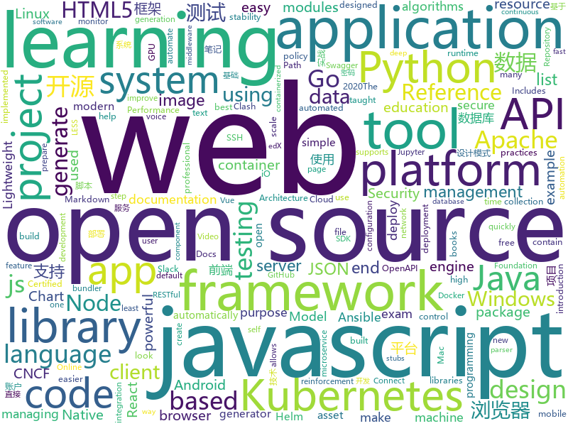

# 2020-11-21
See what the GitHub community is most excited about.

## python
+ [Python](https://github.com/TheAlgorithms/Python)(**265 stars today**): All Algorithms implemented in Python
+ [awesome-python](https://github.com/vinta/awesome-python)(**172 stars today**): A curated list of awesome Python frameworks, libraries, software and resources
+ [learn-python](https://github.com/trekhleb/learn-python)(**78 stars today**): 📚Playground and cheatsheet for learning Python. Collection of Python scripts that are split by topics and contain code examples with explanations.
+ [learn-python3](https://github.com/jerry-git/learn-python3)(**64 stars today**): Jupyter notebooks for teaching/learning Python 3
+ [gradslam](https://github.com/gradslam/gradslam)(**104 stars today**): gradslam is an open source differentiable dense SLAM library for PyTorch
+ [ansible](https://github.com/ansible/ansible)(**24 stars today**): Ansible is a radically simple IT automation platform that makes your applications and systems easier to deploy and maintain. Automate everything from code deployment to network configuration to cloud management, in a language that approaches plain English, using SSH, with no agents to install on remote systems. https://docs.ansible.com.
+ [manim](https://github.com/3b1b/manim)(**66 stars today**): Animation engine for explanatory math videos
+ [system-design-primer](https://github.com/donnemartin/system-design-primer)(**202 stars today**): Learn how to design large-scale systems. Prep for the system design interview. Includes Anki flashcards.
+ [genshin-impact-helper](https://github.com/y1ndan/genshin-impact-helper)(**67 stars today**): Auto get Genshin Impact daily bonus by GitHub Actions. 米游社原神自动每日签到
+ [models](https://github.com/tensorflow/models)(**23 stars today**): Models and examples built with TensorFlow
+ [nvidia-bot](https://github.com/Hari-Nagarajan/nvidia-bot)(**44 stars today**): Tool to help us buy a GPU in 2020
+ [edx-platform](https://github.com/edx/edx-platform)(**4 stars today**): The Open edX platform, the software that powers edX!
+ [airflow](https://github.com/apache/airflow)(**25 stars today**): Apache Airflow - A platform to programmatically author, schedule, and monitor workflows
+ [streamlit](https://github.com/streamlit/streamlit)(**22 stars today**): Streamlit — The fastest way to build data apps in Python
+ [safaribooks](https://github.com/lorenzodifuccia/safaribooks)(**9 stars today**): Download and generate EPUB of your favorite books from O'Reilly Learning (aka Safari Books Online) library.
+ [cascadia-code](https://github.com/microsoft/cascadia-code)(**57 stars today**): This is a fun, new monospaced font that includes programming ligatures and is designed to enhance the modern look and feel of the Windows Terminal.
+ [jupyterhub](https://github.com/jupyterhub/jupyterhub)(**8 stars today**): Multi-user server for Jupyter notebooks
+ [pytorch-CycleGAN-and-pix2pix](https://github.com/junyanz/pytorch-CycleGAN-and-pix2pix)(**20 stars today**): Image-to-Image Translation in PyTorch
+ [Python-100-Days](https://github.com/jackfrued/Python-100-Days)(**98 stars today**): Python - 100天从新手到大师
+ [semgrep](https://github.com/returntocorp/semgrep)(**9 stars today**): Lightweight static analysis for many languages. Find bug variants with patterns that look like source code.
+ [rasa](https://github.com/RasaHQ/rasa)(**14 stars today**): 💬Open source machine learning framework to automate text- and voice-based conversations: NLU, dialogue management, connect to Slack, Facebook, and more - Create chatbots and voice assistants
+ [gym](https://github.com/openai/gym)(**14 stars today**): A toolkit for developing and comparing reinforcement learning algorithms.
+ [django-rest-framework](https://github.com/encode/django-rest-framework)(**15 stars today**): Web APIs for Django.🎸
+ [QUANTAXIS](https://github.com/QUANTAXIS/QUANTAXIS)(**16 stars today**): QUANTAXIS 支持任务调度 分布式部署的 股票/期货/期权/港股/虚拟货币 数据/回测/模拟/交易/可视化/多账户 纯本地量化解决方案
+ [pytorch3d](https://github.com/facebookresearch/pytorch3d)(**13 stars today**): PyTorch3D is FAIR's library of reusable components for deep learning with 3D data

## java
+ [shardingsphere](https://github.com/apache/shardingsphere)(**35 stars today**): Distributed database middleware
+ [SuperMarket](https://github.com/GoogleLLP/SuperMarket)(**60 stars today**): 设计精良的网上商城系统，包括前端、后端、数据库、负载均衡、数据库缓存等，使用SpringCloud框架，基于Java开发。该项目可部署到服务器上，不断完善中……
+ [soul](https://github.com/dromara/soul)(**59 stars today**): High-Performance Java API Gateway
+ [APIJSON](https://github.com/Tencent/APIJSON)(**227 stars today**): 🏆码云最有价值开源项目🚀后端接口和文档自动化，前端(客户端) 定制返回 JSON 的数据和结构！🏆Gitee Most Valuable Project🚀A JSON Transmission Protocol and an ORM Library for automatically providing APIs and Docs.
+ [itstack-demo-design](https://github.com/fuzhengwei/itstack-demo-design)(**33 stars today**): 小傅哥微信：fustack |《重学Java设计模式「22个互联网真实案例实战」》技术好就一定能写出好代码吗？不能！再漂亮的马桶放到厨房都略显尴尬！无论是家里装修还是上道开车，只有通过实战才能快速将理论转变为技能。毕竟设计模式也是源于 克里斯托佛·亚历山大 的著作 《建筑模式语言》。
+ [CS-Notes](https://github.com/CyC2018/CS-Notes)(**101 stars today**): 📚技术面试必备基础知识、Leetcode、计算机操作系统、计算机网络、系统设计、Java、Python、C++
+ [Mindustry](https://github.com/Anuken/Mindustry)(**19 stars today**): A sandbox tower defense game
+ [micronaut-core](https://github.com/micronaut-projects/micronaut-core)(**10 stars today**): Micronaut Application Framework
+ [gnirehtet](https://github.com/Genymobile/gnirehtet)(**25 stars today**): Gnirehtet provides reverse tethering for Android
+ [camel](https://github.com/apache/camel)(**5 stars today**): Apache Camel is an open source integration framework that empowers you to quickly and easily integrate various systems consuming or producing data.
+ [elasticsearch](https://github.com/elastic/elasticsearch)(**23 stars today**): Open Source, Distributed, RESTful Search Engine
+ [openapi-generator](https://github.com/OpenAPITools/openapi-generator)(**13 stars today**): OpenAPI Generator allows generation of API client libraries (SDK generation), server stubs, documentation and configuration automatically given an OpenAPI Spec (v2, v3)
+ [fastjson](https://github.com/alibaba/fastjson)(**17 stars today**): A fast JSON parser/generator for Java.
+ [okhttp](https://github.com/square/okhttp)(**18 stars today**): Square’s meticulous HTTP client for the JVM, Android, and GraalVM.
+ [calcite](https://github.com/apache/calcite)(**5 stars today**): Apache Calcite
+ [metersphere](https://github.com/metersphere/metersphere)(**92 stars today**): An open source continuous testing platform. MeterSphere 是一站式的开源企业级持续测试平台，涵盖测试跟踪、接口测试、性能测试、团队协作等功能，全面兼容 JMeter、Postman 等开源、主流标准。项目采用 SpringBoot 2.x + MyBatis + Vue.js + Element + Docker + Kafka + MySQL等开发。
+ [resilience4j](https://github.com/resilience4j/resilience4j)(**9 stars today**): Resilience4j is a fault tolerance library designed for Java8 and functional programming
+ [tutorials](https://github.com/eugenp/tutorials)(**24 stars today**): Just Announced - "Learn Spring Security OAuth":
+ [hadoop](https://github.com/apache/hadoop)(**3 stars today**): Apache Hadoop
+ [react-native-video](https://github.com/react-native-video/react-native-video)(**1 stars today**): A <Video /> component for react-native
+ [NewPipe](https://github.com/TeamNewPipe/NewPipe)(**18 stars today**): A libre lightweight streaming front-end for Android.
+ [selenium](https://github.com/SeleniumHQ/selenium)(**11 stars today**): A browser automation framework and ecosystem.
+ [antlr4](https://github.com/antlr/antlr4)(**10 stars today**): ANTLR (ANother Tool for Language Recognition) is a powerful parser generator for reading, processing, executing, or translating structured text or binary files.
+ [druid](https://github.com/apache/druid)(**4 stars today**): Apache Druid: a high performance real-time analytics database.
+ [capacitor](https://github.com/ionic-team/capacitor)(**9 stars today**): Build cross-platform Native Progressive Web Apps for iOS, Android, and the Web⚡️

## unknown
+ [data-science](https://github.com/ossu/data-science)(**115 stars today**): 📊Path to a free self-taught education in Data Science!
+ [Python-programming-exercises](https://github.com/zhiwehu/Python-programming-exercises)(**95 stars today**): 100+ Python challenging programming exercises
+ [project-based-learning](https://github.com/tuvtran/project-based-learning)(**168 stars today**): Curated list of project-based tutorials
+ [upptime](https://github.com/upptime/upptime)(**416 stars today**): ⬆️Uptime monitor and status page powered by GitHub
+ [computer-science](https://github.com/ossu/computer-science)(**162 stars today**): 🎓Path to a free self-taught education in Computer Science!
+ [Certified-Kubernetes-Security-Specialist](https://github.com/walidshaari/Certified-Kubernetes-Security-Specialist)(**117 stars today**): Online resources that will help you prepare for taking the CNCF/Linux Foundation CKS 2020 "Kubernetes Certified Security Specialist" Certification exam. with time, This is not likely the comprehensive up to date list - please make a pull request if there something that should be added here.
+ [CKA-Preparation](https://github.com/mgonzalezo/CKA-Preparation)(**15 stars today**): Repository with some reference information about the CKA exam, tips & tricks and Reference URLs.
+ [TIcomBoulos](https://github.com/tiantifascista/TIcomBoulos)(**15 stars today**): 
+ [CKAD-exercises](https://github.com/dgkanatsios/CKAD-exercises)(**9 stars today**): A set of exercises to prepare for Certified Kubernetes Application Developer exam by Cloud Native Computing Foundation
+ [sig-security](https://github.com/cncf/sig-security)(**71 stars today**): 😎CNCF Special Interest Group on Security -- secure access, policy control, privacy, auditing, explainability and more!
+ [Xiaomi_Kernel_OpenSource](https://github.com/MiCode/Xiaomi_Kernel_OpenSource)(**10 stars today**): Xiaomi Mobile Phone Kernel OpenSource
+ [Cheatsheet-God](https://github.com/OlivierLaflamme/Cheatsheet-God)(**92 stars today**): Penetration Testing Reference Bank - OSCP / PTP & PTX Cheatsheet
+ [models](https://github.com/forensic-architecture/models)(**78 stars today**): 3d models and other assets for investigations.
+ [nanominer](https://github.com/nanopool/nanominer)(**4 stars today**): Nanominer is a versatile tool for mining cryptocurrencies on GPUs and CPUs.
+ [Tools-to-Design-or-Visualize-Architecture-of-Neural-Network](https://github.com/ashishpatel26/Tools-to-Design-or-Visualize-Architecture-of-Neural-Network)(**35 stars today**): Tools to Design or Visualize Architecture of Neural Network
+ [PandaOCR](https://github.com/miaomiaosoft/PandaOCR)(**10 stars today**): PandaOCR - 多功能OCR图文识别+翻译+朗读+弹窗+公式+表格+图床+搜图+二维码
+ [Python-Core-50-Courses](https://github.com/jackfrued/Python-Core-50-Courses)(**53 stars today**): Python语言基础50课
+ [1mb-club](https://github.com/bradleytaunt/1mb-club)(**75 stars today**): An exclusive members-only club for web pages weighing less than 1 megabyte
+ [Fastbot_Android](https://github.com/bytedance/Fastbot_Android)(**37 stars today**): Fastbot is developed based on Google Monkey, combining machine learning and reinforcement learning tools to serve as a stability-targeted testing tool.
+ [1](https://github.com/XNM6/1)(**10 stars today**): 直播平台回家页
+ [siyuan](https://github.com/siyuan-note/siyuan)(**48 stars today**): 📕思源笔记是一款 Markdown 块级引用和双向链接的网状笔记应用，支持 Windows、Mac 和 Linux，可在浏览器上直接使用，支持移动端适配。SiYuan is a Markdown Block-Reference and Bidirectional-Link note-taking application, supports Windows, Mac and Linux, can be used directly on the browser, and supports mobile-end adaptation.
+ [laravel-best-practices](https://github.com/alexeymezenin/laravel-best-practices)(**10 stars today**): Laravel best practices
+ [360SafeBrowsergetpass](https://github.com/hayasec/360SafeBrowsergetpass)(**66 stars today**): 这是一个一键辅助抓取360安全浏览器密码的CobaltStrike脚本，用于节省红队人员工作量，通过下载浏览器数据库、记录密钥来离线解密浏览器密码。
+ [clash_for_windows_pkg](https://github.com/Fndroid/clash_for_windows_pkg)(**54 stars today**): A Windows/macOS GUI based on Clash
+ [weekly](https://github.com/dt-fe/weekly)(**13 stars today**): 前端精读周刊

## javascript
+ [screenity](https://github.com/alyssaxuu/screenity)(**631 stars today**): The most powerful screen recorder & annotation tool for Chrome🎥
+ [AI-Expert-Roadmap](https://github.com/AMAI-GmbH/AI-Expert-Roadmap)(**117 stars today**): Roadmap to becoming an Artificial Intelligence Expert in 2020
+ [nuxt.js](https://github.com/nuxt/nuxt.js)(**226 stars today**): The Intuitive Vue Framework
+ [next.js](https://github.com/vercel/next.js)(**150 stars today**): The React Framework
+ [discord.js](https://github.com/discordjs/discord.js)(**10 stars today**): A powerful JavaScript library for interacting with the Discord API
+ [svelte](https://github.com/sveltejs/svelte)(**60 stars today**): Cybernetically enhanced web apps
+ [create-react-app](https://github.com/facebook/create-react-app)(**36 stars today**): Set up a modern web app by running one command.
+ [carbon](https://github.com/carbon-design-system/carbon)(**8 stars today**): A design system built by IBM
+ [nodebestpractices](https://github.com/goldbergyoni/nodebestpractices)(**55 stars today**): ✅The Node.js best practices list (November 2020)
+ [Baileys](https://github.com/adiwajshing/Baileys)(**4 stars today**): Lightweight full-featured typescript/javascript WhatsApp Web API
+ [node](https://github.com/nodejs/node)(**37 stars today**): Node.js JavaScript runtime✨🐢🚀✨
+ [jd_scripts](https://github.com/lxk0301/jd_scripts)(**61 stars today**): 
+ [Chart.js](https://github.com/chartjs/Chart.js)(**25 stars today**): Simple HTML5 Charts using the <canvas> tag
+ [flowy](https://github.com/alyssaxuu/flowy)(**32 stars today**): The minimal javascript library to create flowcharts✨
+ [plyr](https://github.com/sampotts/plyr)(**20 stars today**): A simple HTML5, YouTube and Vimeo player
+ [dom-to-image](https://github.com/tsayen/dom-to-image)(**25 stars today**): Generates an image from a DOM node using HTML5 canvas
+ [express](https://github.com/expressjs/express)(**19 stars today**): Fast, unopinionated, minimalist web framework for node.
+ [Ghost](https://github.com/TryGhost/Ghost)(**38 stars today**): 👻The #1 headless Node.js CMS for professional publishing
+ [generator-jhipster](https://github.com/jhipster/generator-jhipster)(**10 stars today**): JHipster is a development platform to quickly generate, develop, & deploy modern web applications & microservice architectures.
+ [webpack](https://github.com/webpack/webpack)(**26 stars today**): A bundler for javascript and friends. Packs many modules into a few bundled assets. Code Splitting allows for loading parts of the application on demand. Through "loaders", modules can be CommonJs, AMD, ES6 modules, CSS, Images, JSON, Coffeescript, LESS, ... and your custom stuff.
+ [Javascript](https://github.com/TheAlgorithms/Javascript)(**15 stars today**): A repository for All algorithms implemented in Javascript (for educational purposes only)
+ [semantic-release](https://github.com/semantic-release/semantic-release)(**20 stars today**): 📦🚀Fully automated version management and package publishing
+ [video.js](https://github.com/videojs/video.js)(**14 stars today**): Video.js - open source HTML5 & Flash video player
+ [lerna](https://github.com/lerna/lerna)(**20 stars today**): 🐉A tool for managing JavaScript projects with multiple packages.
+ [CodeceptJS](https://github.com/codeceptjs/CodeceptJS)(**0 stars today**): Supercharged End 2 End Testing Framework for NodeJS

## html
+ [ML-notes](https://github.com/Sakura-gh/ML-notes)(**13 stars today**): notes about machine learning
+ [covid-19](https://github.com/rozierguillaume/covid-19)(**6 stars today**): How does COVID-19 spread around the world? Charts, data, dashboards and interpretations...
+ [tiny-slider](https://github.com/ganlanyuan/tiny-slider)(**9 stars today**): Vanilla javascript slider for all purposes.
+ [OpenClash](https://github.com/vernesong/OpenClash)(**12 stars today**): A Clash Client For OpenWrt
+ [eks-charts](https://github.com/aws/eks-charts)(**1 stars today**): Amazon EKS Helm chart repository
+ [swagger-codegen](https://github.com/swagger-api/swagger-codegen)(**7 stars today**): swagger-codegen contains a template-driven engine to generate documentation, API clients and server stubs in different languages by parsing your OpenAPI / Swagger definition.
+ [cosha](https://github.com/robinloeffel/cosha)(**20 stars today**): Colorful shadows for your images.🎨
+ [dotfiles](https://github.com/hashtagsaurav/dotfiles)(**30 stars today**): 
+ [18S191](https://github.com/mitmath/18S191)(**5 stars today**): Course 18.S191 at MIT, fall 2020 - Introduction to computational thinking with Julia:
+ [cypress-example-kitchensink](https://github.com/cypress-io/cypress-example-kitchensink)(**1 stars today**): This is an example app used to showcase Cypress.io testing.
+ [RateMySupervisor](https://github.com/kgco/RateMySupervisor)(**19 stars today**): 永久免费开源的导师评价数据、数据爬虫、无需编程基础的展示网页以及新信息补充平台
+ [masonry](https://github.com/desandro/masonry)(**3 stars today**): 🏩Cascading grid layout plugin
+ [salty-747](https://github.com/saltysimulations/salty-747)(**6 stars today**): An open-source modification for the default MSFS 747-8, aiming to improve the lacking features and realism of the default aircraft.
+ [HUST-Invictus](https://github.com/lyandut/HUST-Invictus)(**3 stars today**): 【分享】华中科技大学研究生课程资料
+ [EIPs](https://github.com/ethereum/EIPs)(**7 stars today**): The Ethereum Improvement Proposal repository
+ [helm-charts](https://github.com/jenkinsci/helm-charts)(**1 stars today**): Jenkins community Helm charts
+ [matrix-docker-ansible-deploy](https://github.com/spantaleev/matrix-docker-ansible-deploy)(**2 stars today**): Matrix (An open network for secure, decentralized communication) server setup using Ansible and Docker
+ [kubeasz](https://github.com/easzlab/kubeasz)(**3 stars today**): 使用Ansible脚本安装K8S集群，介绍组件交互原理，方便直接，不受国内网络环境影响
+ [Microsoft-365-Admin](https://github.com/6mb/Microsoft-365-Admin)(**12 stars today**): 基于微软 API 的 office 365 用户管理（支持多账户切换）
+ [tailwindcss-forms](https://github.com/tailwindlabs/tailwindcss-forms)(**23 stars today**): 
+ [intro.js](https://github.com/usablica/intro.js)(**2 stars today**): A better way for new feature introduction and step-by-step users guide for your website and project.
+ [argo-helm](https://github.com/argoproj/argo-helm)(**0 stars today**): ArgoProj Helm Charts
+ [ai-edu](https://github.com/microsoft/ai-edu)(**8 stars today**): AI education materials for Chinese students, teachers and IT professionals.
+ [training-kit](https://github.com/github/training-kit)(**3 stars today**): Open source cheat sheets for Git and GitHub
+ [glTF](https://github.com/KhronosGroup/glTF)(**6 stars today**): glTF – Runtime 3D Asset Delivery

## go
+ [kubevela](https://github.com/oam-dev/kubevela)(**89 stars today**): An Easy-to-use yet Fully Extensible App Platform based on Kubernetes and Open Application Model.
+ [istio](https://github.com/istio/istio)(**129 stars today**): Connect, secure, control, and observe services.
+ [swag](https://github.com/swaggo/swag)(**9 stars today**): Automatically generate RESTful API documentation with Swagger 2.0 for Go.
+ [esbuild](https://github.com/evanw/esbuild)(**42 stars today**): An extremely fast JavaScript bundler and minifier
+ [argo-cd](https://github.com/argoproj/argo-cd)(**7 stars today**): Declarative continuous deployment for Kubernetes.
+ [opa](https://github.com/open-policy-agent/opa)(**8 stars today**): An open source, general-purpose policy engine.
+ [chaos-mesh](https://github.com/chaos-mesh/chaos-mesh)(**118 stars today**): A Chaos Engineering Platform for Kubernetes.
+ [filebrowser](https://github.com/filebrowser/filebrowser)(**38 stars today**): 📂Web File Browser which can be used as a middleware or standalone app.
+ [100-days-of-code](https://github.com/IAPOLINARIO/100-days-of-code)(**50 stars today**): This is a project with a collection of coding challenges for those who wants to commit themselves to code at least one hour a day for (at least) hundred days.
+ [terraform-provider-azurerm](https://github.com/terraform-providers/terraform-provider-azurerm)(**7 stars today**): Terraform provider for Azure Resource Manager
+ [nomad](https://github.com/hashicorp/nomad)(**5 stars today**): Nomad is an easy-to-use, flexible, and performant workload orchestrator that can deploy a mix of microservice, batch, containerized, and non-containerized applications. Nomad is easy to operate and scale and has native Consul and Vault integrations.
+ [terraform-provider-aws](https://github.com/hashicorp/terraform-provider-aws)(**9 stars today**): Terraform AWS provider
+ [determined](https://github.com/determined-ai/determined)(**7 stars today**): Determined: Deep Learning Training Platform
+ [k3sup](https://github.com/alexellis/k3sup)(**7 stars today**): bootstrap Kubernetes with k3s over SSH < 1 min🚀
+ [podman](https://github.com/containers/podman)(**38 stars today**): Podman: A tool for managing OCI containers and pods
+ [spark-on-k8s-operator](https://github.com/GoogleCloudPlatform/spark-on-k8s-operator)(**4 stars today**): Kubernetes operator for managing the lifecycle of Apache Spark applications on Kubernetes.
+ [thanos](https://github.com/thanos-io/thanos)(**15 stars today**): Highly available Prometheus setup with long term storage capabilities. A CNCF Incubating project.
+ [kratos](https://github.com/go-kratos/kratos)(**23 stars today**): Kratos是bilibili开源的一套Go微服务框架，包含大量微服务相关框架及工具。
+ [kubernetes](https://github.com/kubernetes/kubernetes)(**44 stars today**): Production-Grade Container Scheduling and Management
+ [terratest](https://github.com/gruntwork-io/terratest)(**11 stars today**): Terratest is a Go library that makes it easier to write automated tests for your infrastructure code.
+ [mattermost-server](https://github.com/mattermost/mattermost-server)(**20 stars today**): Open source Slack-alternative in Golang and React - Mattermost
+ [klio](https://github.com/g2a-com/klio)(**6 stars today**): Crossover between a CLI framework and a package manager
+ [go-zero](https://github.com/tal-tech/go-zero)(**51 stars today**): go-zero is a web and rpc framework written in Go. It's born to ensure the stability of the busy sites with resilient design. Builtin goctl greatly improves the development productivity.
+ [rancher](https://github.com/rancher/rancher)(**8 stars today**): Complete container management platform
+ [aws-sdk-go](https://github.com/aws/aws-sdk-go)(**3 stars today**): AWS SDK for the Go programming language.

## WordCloud

