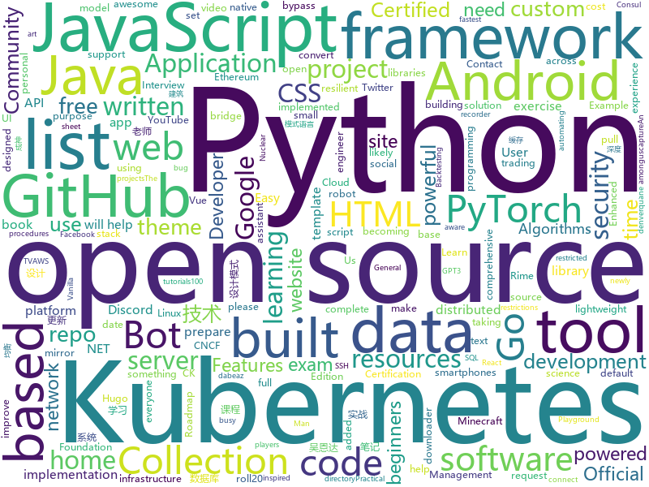

# 2020-11-23
See what the GitHub community is most excited about.

## python
+ [tinygrad](https://github.com/geohot/tinygrad)(**70 stars today**): You like pytorch? You like micrograd? You love tinygrad!❤️
+ [Python](https://github.com/TheAlgorithms/Python)(**280 stars today**): All Algorithms implemented in Python
+ [DeDRM_tools](https://github.com/apprenticeharper/DeDRM_tools)(**14 stars today**): DeDRM tools for ebooks
+ [learn-python](https://github.com/trekhleb/learn-python)(**451 stars today**): 📚Playground and cheatsheet for learning Python. Collection of Python scripts that are split by topics and contain code examples with explanations.
+ [learn-python3](https://github.com/jerry-git/learn-python3)(**203 stars today**): Jupyter notebooks for teaching/learning Python 3
+ [U-2-Net](https://github.com/NathanUA/U-2-Net)(**322 stars today**): The code for our newly accepted paper in Pattern Recognition 2020: "U^2-Net: Going Deeper with Nested U-Structure for Salient Object Detection."
+ [stylegan2-pytorch](https://github.com/lucidrains/stylegan2-pytorch)(**11 stars today**): Simplest working implementation of Stylegan2, state of the art generative adversarial network, in Pytorch. Enabling everyone to experience disentanglement
+ [rich](https://github.com/willmcgugan/rich)(**119 stars today**): Rich is a Python library for rich text and beautiful formatting in the terminal.
+ [discord.py](https://github.com/Rapptz/discord.py)(**17 stars today**): An API wrapper for Discord written in Python.
+ [awesome-python](https://github.com/vinta/awesome-python)(**186 stars today**): A curated list of awesome Python frameworks, libraries, software and resources
+ [tez](https://github.com/abhishekkrthakur/tez)(**55 stars today**): Tez is a super-simple and lightweight Trainer for PyTorch. It also comes with many utils that you can use to tackle over 90% of deep learning projects in PyTorch.
+ [backtrader](https://github.com/mementum/backtrader)(**8 stars today**): Python Backtesting library for trading strategies
+ [sherlock](https://github.com/sherlock-project/sherlock)(**27 stars today**): 🔎Hunt down social media accounts by username across social networks
+ [stylegan2](https://github.com/NVlabs/stylegan2)(**20 stars today**): StyleGAN2 - Official TensorFlow Implementation
+ [yfinance](https://github.com/ranaroussi/yfinance)(**10 stars today**): Yahoo! Finance market data downloader (+faster Pandas Datareader)
+ [wtfpython](https://github.com/satwikkansal/wtfpython)(**18 stars today**): What the f*ck Python?
+ [BurpSuite_403Bypasser](https://github.com/sting8k/BurpSuite_403Bypasser)(**39 stars today**): Burpsuite Extension to bypass 403 restricted directory
+ [practical-python](https://github.com/dabeaz-course/practical-python)(**10 stars today**): Practical Python Programming (course by @dabeaz)
+ [yolov5](https://github.com/ultralytics/yolov5)(**47 stars today**): YOLOv5 in PyTorch > ONNX > CoreML > TFLite
+ [PhoenixBot](https://github.com/Strip3s/PhoenixBot)(**3 stars today**): Phoenix Bot - A Bird Bot Resurrection
+ [integration](https://github.com/hacs/integration)(**4 stars today**): HACS gives you a powerful UI to handle downloads of all your custom needs.
+ [pyTelegramBotAPI](https://github.com/eternnoir/pyTelegramBotAPI)(**4 stars today**): Python Telegram bot api.
+ [freqtrade](https://github.com/freqtrade/freqtrade)(**14 stars today**): Free, open source crypto trading bot
+ [gef](https://github.com/hugsy/gef)(**7 stars today**): GEF - GDB Enhanced Features for exploit devs & reversers
+ [ru-gpts](https://github.com/sberbank-ai/ru-gpts)(**7 stars today**): Russian GPT3 models.

## java
+ [SuperMarket](https://github.com/GoogleLLP/SuperMarket)(**116 stars today**): 设计精良的网上商城系统，包括前端、后端、数据库、负载均衡、数据库缓存等，使用SpringCloud框架，基于Java开发。该项目可部署到服务器上，不断完善中……
+ [CS-Notes](https://github.com/CyC2018/CS-Notes)(**61 stars today**): 📚技术面试必备基础知识、Leetcode、计算机操作系统、计算机网络、系统设计、Java、Python、C++
+ [Mindustry](https://github.com/Anuken/Mindustry)(**32 stars today**): A sandbox tower defense game
+ [NewPipe](https://github.com/TeamNewPipe/NewPipe)(**44 stars today**): A libre lightweight streaming front-end for Android.
+ [hmily](https://github.com/dromara/hmily)(**18 stars today**): 金融级柔性分布式事务解决方案
+ [shardingsphere](https://github.com/apache/shardingsphere)(**135 stars today**): Distributed database middleware
+ [zookeeper](https://github.com/apache/zookeeper)(**9 stars today**): Apache ZooKeeper
+ [runelite](https://github.com/runelite/runelite)(**5 stars today**): Open source Old School RuneScape client
+ [MinecraftForge](https://github.com/MinecraftForge/MinecraftForge)(**5 stars today**): Modifications to the Minecraft base files to assist in compatibility between mods.
+ [Algorithms](https://github.com/williamfiset/Algorithms)(**14 stars today**): A collection of algorithms and data structures
+ [toBeTopJavaer](https://github.com/hollischuang/toBeTopJavaer)(**54 stars today**): To Be Top Javaer - Java工程师成神之路
+ [OpenBot](https://github.com/intel-isl/OpenBot)(**18 stars today**): OpenBot leverages smartphones as brains for low-cost robots. We have designed a small electric vehicle that costs about $50 and serves as a robot body. Our software stack for Android smartphones supports advanced robotics workloads such as person following and real-time autonomous navigation.
+ [itstack-demo-design](https://github.com/fuzhengwei/itstack-demo-design)(**80 stars today**): 小傅哥微信：fustack |《重学Java设计模式「22个互联网真实案例实战」》技术好就一定能写出好代码吗？不能！再漂亮的马桶放到厨房都略显尴尬！无论是家里装修还是上道开车，只有通过实战才能快速将理论转变为技能。毕竟设计模式也是源于 克里斯托佛·亚历山大 的著作 《建筑模式语言》。
+ [SmartTubeNext](https://github.com/yuliskov/SmartTubeNext)(**7 stars today**): Better YouTube experience on Android TV
+ [eureka](https://github.com/Netflix/eureka)(**8 stars today**): AWS Service registry for resilient mid-tier load balancing and failover.
+ [AarogyaSetu_Android](https://github.com/nic-delhi/AarogyaSetu_Android)(**3 stars today**): Aarogya Setu Android app native code
+ [openhab-addons](https://github.com/openhab/openhab-addons)(**1 stars today**): Add-ons for openHAB
+ [Arduino](https://github.com/arduino/Arduino)(**4 stars today**): open-source electronics platform
+ [Java](https://github.com/TheAlgorithms/Java)(**29 stars today**): All Algorithms implemented in Java
+ [soul](https://github.com/dromara/soul)(**30 stars today**): High-Performance Java API Gateway
+ [Nukkit](https://github.com/CloudburstMC/Nukkit)(**1 stars today**): Cloudburst Nukkit - Nuclear-Powered Minecraft: Bedrock Edition Server Software
+ [fabric](https://github.com/FabricMC/fabric)(**4 stars today**): Essential hooks and patches for modding with Fabric.
+ [baritone](https://github.com/cabaletta/baritone)(**5 stars today**): google maps for block game
+ [tutorials](https://github.com/eugenp/tutorials)(**48 stars today**): Just Announced - "Learn Spring Security OAuth":
+ [interview](https://github.com/mission-peace/interview)(**3 stars today**): Interview questions

## unknown
+ [COVID-19](https://github.com/CSSEGISandData/COVID-19)(**16 stars today**): Novel Coronavirus (COVID-19) Cases, provided by JHU CSSE
+ [project-based-learning](https://github.com/tuvtran/project-based-learning)(**216 stars today**): Curated list of project-based tutorials
+ [Python-programming-exercises](https://github.com/zhiwehu/Python-programming-exercises)(**236 stars today**): 100+ Python challenging programming exercises
+ [architect-awesome](https://github.com/xingshaocheng/architect-awesome)(**158 stars today**): 后端架构师技术图谱
+ [javascript-code-challenges](https://github.com/sadanandpai/javascript-code-challenges)(**32 stars today**): Collection of JavaScript modern interview code challenges for beginners to experts
+ [my-cs-degree](https://github.com/logancyang/my-cs-degree)(**25 stars today**): A CS degree with a focus on full-stack ML engineering, 2020
+ [data-science](https://github.com/ossu/data-science)(**157 stars today**): 📊Path to a free self-taught education in Data Science!
+ [awesome-security](https://github.com/sbilly/awesome-security)(**16 stars today**): A collection of awesome software, libraries, documents, books, resources and cools stuffs about security.
+ [CKAD-exercises](https://github.com/dgkanatsios/CKAD-exercises)(**6 stars today**): A set of exercises to prepare for Certified Kubernetes Application Developer exam by Cloud Native Computing Foundation
+ [upptime](https://github.com/upptime/upptime)(**370 stars today**): ⬆️Uptime monitor and status page powered by GitHub
+ [Profiles](https://github.com/DivineEngine/Profiles)(**9 stars today**): 🌐Dial-up Internet access
+ [evil-man](https://github.com/CNwoman-bot/evil-man)(**95 stars today**): Evil Man - 中国男性之恶
+ [HEU_KMS_Activator](https://github.com/zbezj/HEU_KMS_Activator)(**50 stars today**): 
+ [Certified-Kubernetes-Security-Specialist](https://github.com/walidshaari/Certified-Kubernetes-Security-Specialist)(**74 stars today**): Online resources that will help you prepare for taking the CNCF/Linux Foundation CKS 2020 "Kubernetes Certified Security Specialist" Certification exam. with time, This is not likely the comprehensive up to date list - please make a pull request if there something that should be added here.
+ [pikvm](https://github.com/pikvm/pikvm)(**34 stars today**): Open and cheap DIY IP-KVM based on Raspberry Pi
+ [data-engineer-roadmap](https://github.com/datastacktv/data-engineer-roadmap)(**54 stars today**): Roadmap to becoming a data engineer in 2020
+ [CommunityWriterPrograms](https://github.com/malgamves/CommunityWriterPrograms)(**28 stars today**): A list of Developer Community Writer Programs
+ [Kubernetes-Certified-Administrator](https://github.com/walidshaari/Kubernetes-Certified-Administrator)(**9 stars today**): Online resources that will help you prepare for taking the CNCF CKA 2020 "Kubernetes Certified Administrator" Certification exam. with time, This is not likely the comprehensive up to date list - please make a pull request if there something that should be added here.
+ [coding-interview-university](https://github.com/jwasham/coding-interview-university)(**68 stars today**): A complete computer science study plan to become a software engineer.
+ [Resources-for-Beginner-Bug-Bounty-Hunters](https://github.com/nahamsec/Resources-for-Beginner-Bug-Bounty-Hunters)(**8 stars today**): A list of resources for those interested in getting started in bug bounties
+ [HowToHunt](https://github.com/KathanP19/HowToHunt)(**7 stars today**): Tutorials and Things to Do while Hunting Vulnerability.
+ [site-policy](https://github.com/github/site-policy)(**3 stars today**): Collaborative development on GitHub's site policies, procedures, and guidelines
+ [daily-reading](https://github.com/daily-reading/daily-reading)(**2 stars today**): 
+ [You-Dont-Know-JS](https://github.com/getify/You-Dont-Know-JS)(**37 stars today**): A book series on JavaScript. @YDKJS on twitter.
+ [first-contributions](https://github.com/firstcontributions/first-contributions)(**12 stars today**): 🚀✨Help beginners to contribute to open source projects

## javascript
+ [screenity](https://github.com/alyssaxuu/screenity)(**530 stars today**): The most powerful screen recorder & annotation tool for Chrome🎥
+ [AI-Expert-Roadmap](https://github.com/AMAI-GmbH/AI-Expert-Roadmap)(**586 stars today**): Roadmap to becoming an Artificial Intelligence Expert in 2020
+ [brave-browser](https://github.com/brave/brave-browser)(**20 stars today**): Next generation Brave browser for macOS, Windows, Linux, Android.
+ [discord.js](https://github.com/discordjs/discord.js)(**25 stars today**): A powerful JavaScript library for interacting with the Discord API
+ [nuxt.js](https://github.com/nuxt/nuxt.js)(**220 stars today**): The Intuitive Vue Framework
+ [zigbee2mqtt](https://github.com/Koenkk/zigbee2mqtt)(**8 stars today**): Zigbee🐝to MQTT bridge🌉, get rid of your proprietary Zigbee bridges🔨
+ [opensource.guide](https://github.com/github/opensource.guide)(**8 stars today**): 📚Community guides for open source creators
+ [freeCodeCamp](https://github.com/freeCodeCamp/freeCodeCamp)(**56 stars today**): freeCodeCamp.org's open source codebase and curriculum. Learn to code at home.
+ [docs](https://github.com/github/docs)(**9 stars today**): The open-source repo for docs.github.com
+ [jd_scripts](https://github.com/lxk0301/jd_scripts)(**114 stars today**): 
+ [lossless-cut](https://github.com/mifi/lossless-cut)(**12 stars today**): The swiss army knife of lossless video/audio editing
+ [bootstrap](https://github.com/twbs/bootstrap)(**28 stars today**): The most popular HTML, CSS, and JavaScript framework for developing responsive, mobile first projects on the web.
+ [v4](https://github.com/bchiang7/v4)(**8 stars today**): Fourth iteration of my personal website
+ [MagicMirror](https://github.com/MichMich/MagicMirror)(**7 stars today**): MagicMirror² is an open source modular smart mirror platform. With a growing list of installable modules, the MagicMirror² allows you to convert your hallway or bathroom mirror into your personal assistant.
+ [Full-Weatherline-Widget](https://github.com/italoboy/Full-Weatherline-Widget)(**12 stars today**): 
+ [homebridgeStatusWidget](https://github.com/lwitzani/homebridgeStatusWidget)(**16 stars today**): 
+ [node-express-realworld-example-app](https://github.com/gothinkster/node-express-realworld-example-app)(**2 stars today**): 
+ [abp-samples](https://github.com/abpframework/abp-samples)(**8 stars today**): Sample solutions built with the ABP Framework
+ [fullstack-course4](https://github.com/jhu-ep-coursera/fullstack-course4)(**8 stars today**): Example code for HTML, CSS, and Javascript for Web Developers Coursera Course
+ [coc.nvim](https://github.com/neoclide/coc.nvim)(**32 stars today**): Intellisense engine for Vim8 & Neovim, full language server protocol support as VSCode
+ [Frapper](https://github.com/saineshwar/Frapper)(**13 stars today**): ASP.NET Core 3.1 Beginners project template with complete Custom User Management and lot's of other useful Features Which Helps you for Rapid Application Development.
+ [wildfire-tracker](https://github.com/bradtraversy/wildfire-tracker)(**13 stars today**): React app tp track wildfires
+ [QuantumultX](https://github.com/w37fhy/QuantumultX)(**12 stars today**): 同步和更新大佬脚本库，更新懒人配置
+ [esercizi-di-programmazione-javascript](https://github.com/AlbertoOlla/esercizi-di-programmazione-javascript)(**3 stars today**): Esercizi di informatica! Impara a programmare, metti alla prova!
+ [proshop_mern](https://github.com/bradtraversy/proshop_mern)(**7 stars today**): Shopping cart built with MERN & Redux

## html
+ [Coursera-ML-AndrewNg-Notes](https://github.com/fengdu78/Coursera-ML-AndrewNg-Notes)(**21 stars today**): 吴恩达老师的机器学习课程个人笔记
+ [node-ytdl-core](https://github.com/fent/node-ytdl-core)(**6 stars today**): YouTube video downloader in javascript.
+ [OpenClash](https://github.com/vernesong/OpenClash)(**13 stars today**): A Clash Client For OpenWrt
+ [JavaScript30](https://github.com/wesbos/JavaScript30)(**10 stars today**): 30 Day Vanilla JS Challenge
+ [mvp](https://github.com/andybrewer/mvp)(**56 stars today**): MVP.css — Minimalist stylesheet for HTML elements
+ [deeplearning_ai_books](https://github.com/fengdu78/deeplearning_ai_books)(**19 stars today**): deeplearning.ai（吴恩达老师的深度学习课程笔记及资源）
+ [windmill-dashboard](https://github.com/estevanmaito/windmill-dashboard)(**6 stars today**): 📊A multi theme, completely accessible, ready for production dashboard.
+ [gohugo-theme-ananke](https://github.com/theNewDynamic/gohugo-theme-ananke)(**0 stars today**): Ananke: A theme for Hugo Sites
+ [home-assistant.io](https://github.com/home-assistant/home-assistant.io)(**1 stars today**): 📘Home Assistant User documentation
+ [shellphish](https://github.com/suljot/shellphish)(**2 stars today**): Phishing Tool for Instagram, Facebook, Twitter, Snapchat, Github
+ [hugo-theme-stack](https://github.com/CaiJimmy/hugo-theme-stack)(**2 stars today**): Card-style Hugo theme designed for bloggers
+ [fluxion](https://github.com/FluxionNetwork/fluxion)(**3 stars today**): Fluxion is a remake of linset by vk496 with enhanced functionality.
+ [bulma-templates](https://github.com/BulmaTemplates/bulma-templates)(**6 stars today**): free flexbox templates built with the bulma css framework
+ [web-moderno](https://github.com/cod3rcursos/web-moderno)(**4 stars today**): 
+ [roll20-character-sheets](https://github.com/Roll20/roll20-character-sheets)(**0 stars today**): Character sheet templates created by the community for use in Roll20 VTT. Contact team@roll20.net if critical hotfixes need to be requested.
+ [learning-area](https://github.com/mdn/learning-area)(**6 stars today**): Github repo for the MDN Learning Area.
+ [discord-bot-client](https://github.com/Flam3rboy/discord-bot-client)(**4 stars today**): A custom version of discord, with bot login support
+ [Spoon-Knife](https://github.com/octocat/Spoon-Knife)(**3 stars today**): This repo is for demonstration purposes only.
+ [salty-747](https://github.com/saltysimulations/salty-747)(**7 stars today**): An open-source modification for the default MSFS 747-8, aiming to improve the lacking features and realism of the default aircraft.
+ [learn-to-send-email-via-google-script-html-no-server](https://github.com/dwyl/learn-to-send-email-via-google-script-html-no-server)(**1 stars today**): ✉️An Example of using an HTML form (e.g: "Contact Us" on a website) to send Email without a Backend Server (using a Google Script) perfect for static websites that need to collect data.
+ [ESPEasy](https://github.com/letscontrolit/ESPEasy)(**2 stars today**): Easy MultiSensor device based on ESP8266
+ [dragon-book-exercise-answers](https://github.com/fool2fish/dragon-book-exercise-answers)(**2 stars today**): Compilers Principles, Techniques, & Tools (purple dragon book) second edition exercise answers. 编译原理（紫龙书）第2版习题答案。
+ [home](https://github.com/rime/home)(**4 stars today**): Rime::Home is home to Rime users and developers
+ [text-to-handwriting](https://github.com/saurabhdaware/text-to-handwriting)(**8 stars today**): So your teacher asked you to upload written assignments? Hate writing assigments? This tool will help you convert your text to handwriting xD
+ [GDIndex](https://github.com/maple3142/GDIndex)(**4 stars today**): A Google Drive Index built with Vue Running on CloudFlare Workers

## go
+ [fractal](https://github.com/kochampsy/fractal)(**24 stars today**): A small mandelbrot set renderer in Go
+ [go-zero](https://github.com/tal-tech/go-zero)(**53 stars today**): go-zero is a web and rpc framework written in Go. It's born to ensure the stability of the busy sites with resilient design. Builtin goctl greatly improves the development productivity.
+ [ent](https://github.com/facebook/ent)(**17 stars today**): An entity framework for Go
+ [DevSecOps](https://github.com/hahwul/DevSecOps)(**20 stars today**): 🔱Collection and Roadmap for everyone who wants DevSecOps.
+ [cloudquery](https://github.com/cloudquery/cloudquery)(**22 stars today**): cloudquery transforms your cloud infrastructure into queryable SQL tables for easy monitoring, governance and security.
+ [clash](https://github.com/Dreamacro/clash)(**39 stars today**): A rule-based tunnel in Go.
+ [fiber](https://github.com/gofiber/fiber)(**22 stars today**): ⚡️Express inspired web framework written in Go
+ [watchtower](https://github.com/containrrr/watchtower)(**25 stars today**): A process for automating Docker container base image updates.
+ [consul](https://github.com/hashicorp/consul)(**9 stars today**): Consul is a distributed, highly available, and data center aware solution to connect and configure applications across dynamic, distributed infrastructure.
+ [cli](https://github.com/cli/cli)(**27 stars today**): GitHub’s official command line tool
+ [prysm](https://github.com/prysmaticlabs/prysm)(**6 stars today**): Go implementation of the Ethereum 2.0 blockchain
+ [v2ray-core](https://github.com/v2fly/v2ray-core)(**39 stars today**): A platform for building proxies to bypass network restrictions.
+ [esbuild](https://github.com/evanw/esbuild)(**43 stars today**): An extremely fast JavaScript bundler and minifier
+ [photoprism](https://github.com/photoprism/photoprism)(**14 stars today**): Personal Photo Management powered by Go and Google TensorFlow
+ [hugo](https://github.com/gohugoio/hugo)(**25 stars today**): The world’s fastest framework for building websites.
+ [AdGuardHome](https://github.com/AdguardTeam/AdGuardHome)(**15 stars today**): Network-wide ads & trackers blocking DNS server
+ [karpenter](https://github.com/awslabs/karpenter)(**62 stars today**): Kubernetes Autoscaling: built for scalability and extensibility from the ground up.
+ [k3sup](https://github.com/alexellis/k3sup)(**8 stars today**): bootstrap Kubernetes with k3s over SSH < 1 min🚀
+ [maddy](https://github.com/foxcpp/maddy)(**327 stars today**): ✉️Composable all-in-one mail server.
+ [go-ethereum](https://github.com/ethereum/go-ethereum)(**14 stars today**): Official Go implementation of the Ethereum protocol
+ [rf](https://github.com/rsc/rf)(**48 stars today**): A refactoring tool for Go
+ [automuteus](https://github.com/denverquane/automuteus)(**4 stars today**): Discord Bot to automute Among Us players at round transitions, in conjunction with https://github.com/denverquane/amonguscapture
+ [kubevela](https://github.com/oam-dev/kubevela)(**103 stars today**): An Easy-to-use yet Fully Extensible App Platform based on Kubernetes and Open Application Model.
+ [dashboard](https://github.com/kubernetes/dashboard)(**8 stars today**): General-purpose web UI for Kubernetes clusters
+ [argo-cd](https://github.com/argoproj/argo-cd)(**14 stars today**): Declarative continuous deployment for Kubernetes.

## WordCloud

