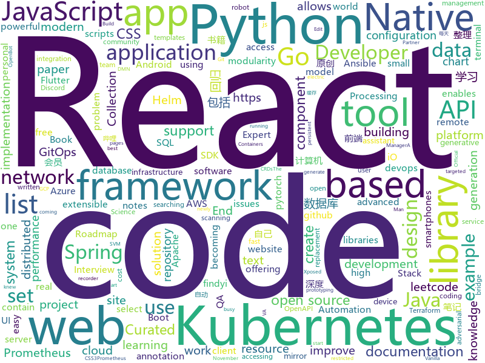

# 2020-11-24
See what the GitHub community is most excited about.

## python
+ [U-2-Net](https://github.com/NathanUA/U-2-Net)(**351 stars today**): The code for our newly accepted paper in Pattern Recognition 2020: "U^2-Net: Going Deeper with Nested U-Structure for Salient Object Detection."
+ [Python](https://github.com/TheAlgorithms/Python)(**350 stars today**): All Algorithms implemented in Python
+ [rich](https://github.com/willmcgugan/rich)(**121 stars today**): Rich is a Python library for rich text and beautiful formatting in the terminal.
+ [BurpSuite_403Bypasser](https://github.com/sting8k/BurpSuite_403Bypasser)(**64 stars today**): Burpsuite Extension to bypass 403 restricted directory
+ [tinygrad](https://github.com/geohot/tinygrad)(**104 stars today**): You like pytorch? You like micrograd? You love tinygrad!❤️
+ [WebSiteBot_PS5](https://github.com/dkkocab/WebSiteBot_PS5)(**28 stars today**): This is a bot that will buy a PS5 through Walmart. It's written in python and uses selenium to interact with web pages. *WORK IN PROGRESS*
+ [learn-python](https://github.com/trekhleb/learn-python)(**223 stars today**): 📚Playground and cheatsheet for learning Python. Collection of Python scripts that are split by topics and contain code examples with explanations.
+ [MiNLP](https://github.com/XiaoMi/MiNLP)(**139 stars today**): XiaoMi Natural Language Processing Toolkits
+ [wagtail](https://github.com/wagtail/wagtail)(**17 stars today**): A Django content management system focused on flexibility and user experience
+ [django](https://github.com/django/django)(**43 stars today**): The Web framework for perfectionists with deadlines.
+ [tuya-convert](https://github.com/ct-Open-Source/tuya-convert)(**10 stars today**): A collection of scripts to flash Tuya IoT devices to alternative firmwares
+ [eth2.0-deposit-cli](https://github.com/ethereum/eth2.0-deposit-cli)(**8 stars today**): Secure key generation for eth2 deposits
+ [diagrams](https://github.com/mingrammer/diagrams)(**40 stars today**): 🎨Diagram as Code for prototyping cloud system architectures
+ [stylegan2-pytorch](https://github.com/lucidrains/stylegan2-pytorch)(**38 stars today**): Simplest working implementation of Stylegan2, state of the art generative adversarial network, in Pytorch. Enabling everyone to experience disentanglement
+ [PyTorch-GAN](https://github.com/eriklindernoren/PyTorch-GAN)(**14 stars today**): PyTorch implementations of Generative Adversarial Networks.
+ [learn-python3](https://github.com/jerry-git/learn-python3)(**86 stars today**): Jupyter notebooks for teaching/learning Python 3
+ [evil-jar](https://github.com/banteg/evil-jar)(**15 stars today**): evil jar attack technical post-mortem
+ [devops-exercises](https://github.com/bregman-arie/devops-exercises)(**25 stars today**): Linux, Jenkins, AWS, SRE, Prometheus, Docker, Python, Ansible, Git, Kubernetes, Terraform, OpenStack, SQL, NoSQL, Azure, GCP, DNS, Elastic, Network, Virtualization. DevOps Interview Questions
+ [leedeeprl-notes](https://github.com/datawhalechina/leedeeprl-notes)(**86 stars today**): 李宏毅《深度强化学习》笔记，在线阅读地址：https://datawhalechina.github.io/leedeeprl-notes/
+ [data-scientist-roadmap](https://github.com/MrMimic/data-scientist-roadmap)(**12 stars today**): Toturial coming with "data science roadmap" graphe.
+ [black](https://github.com/psf/black)(**13 stars today**): The uncompromising Python code formatter
+ [sentence-transformers](https://github.com/UKPLab/sentence-transformers)(**20 stars today**): Sentence Embeddings with BERT & XLNet
+ [doccano](https://github.com/doccano/doccano)(**10 stars today**): Open source text annotation tool for machine learning practitioner.
+ [espnet](https://github.com/espnet/espnet)(**7 stars today**): End-to-End Speech Processing Toolkit
+ [tabnet](https://github.com/dreamquark-ai/tabnet)(**11 stars today**): PyTorch implementation of TabNet paper : https://arxiv.org/pdf/1908.07442.pdf

## java
+ [EdXposed](https://github.com/ElderDrivers/EdXposed)(**13 stars today**): Elder driver Xposed Framework.
+ [SuperMarket](https://github.com/GoogleLLP/SuperMarket)(**114 stars today**): 设计精良的网上商城系统，包括前端、后端、数据库、负载均衡、数据库缓存等，使用SpringCloud框架，基于Java开发。该项目可部署到服务器上，不断完善中……
+ [OpenBot](https://github.com/intel-isl/OpenBot)(**11 stars today**): OpenBot leverages smartphones as brains for low-cost robots. We have designed a small electric vehicle that costs about $50 and serves as a robot body. Our software stack for Android smartphones supports advanced robotics workloads such as person following and real-time autonomous navigation.
+ [proguard](https://github.com/Guardsquare/proguard)(**3 stars today**): ProGuard, Java optimizer and obfuscator
+ [openapi-generator](https://github.com/OpenAPITools/openapi-generator)(**8 stars today**): OpenAPI Generator allows generation of API client libraries (SDK generation), server stubs, documentation and configuration automatically given an OpenAPI Spec (v2, v3)
+ [flink](https://github.com/apache/flink)(**17 stars today**): Apache Flink
+ [react-native-camera](https://github.com/react-native-camera/react-native-camera)(**3 stars today**): A Camera component for React Native. Also supports barcode scanning!
+ [geoserver](https://github.com/geoserver/geoserver)(**0 stars today**): Official GeoServer repository
+ [Mindustry](https://github.com/Anuken/Mindustry)(**11 stars today**): A sandbox tower defense game
+ [selling-partner-api-models](https://github.com/amzn/selling-partner-api-models)(**2 stars today**): This repository contains OpenAPI models for developers to use when developing software to call Selling Partner APIs.
+ [flutter_boost](https://github.com/alibaba/flutter_boost)(**7 stars today**): FlutterBoost is a Flutter plugin which enables hybrid integration of Flutter for your existing native apps with minimum efforts
+ [springboot-guide](https://github.com/Snailclimb/springboot-guide)(**6 stars today**): Not only Spring Boot but also important knowledge of Spring（不只是SpringBoot还有Spring重要知识点）
+ [BILIBILI-HELPER](https://github.com/JunzhouLiu/BILIBILI-HELPER)(**26 stars today**): B站，哔哩哔哩（Bilibili）自动签到每日自动投币，银瓜子兑换硬币，领取大会员福利，大会员月底给自己充电等。每天轻松获取65经验值。赶快和我一起成为Lv6吧！
+ [react-native-push-notification](https://github.com/zo0r/react-native-push-notification)(**4 stars today**): React Native Local and Remote Notifications
+ [seata](https://github.com/seata/seata)(**21 stars today**): 🔥Seata is an easy-to-use, high-performance, open source distributed transaction solution.
+ [camunda-bpm-platform](https://github.com/camunda/camunda-bpm-platform)(**3 stars today**): Flexible framework for workflow and decision automation with BPMN and DMN. Integration with Spring, Spring Boot, CDI.
+ [react-native-video](https://github.com/react-native-video/react-native-video)(**2 stars today**): A <Video /> component for react-native
+ [debezium](https://github.com/debezium/debezium)(**6 stars today**): Change data capture for a variety of databases. Please log issues at https://issues.redhat.com/browse/DBZ.
+ [TPScan](https://github.com/tangxiaofeng7/TPScan)(**36 stars today**): 
+ [kafka-streams-examples](https://github.com/confluentinc/kafka-streams-examples)(**0 stars today**): Demo applications and code examples for Apache Kafka's Streams API.
+ [JsonPath](https://github.com/json-path/JsonPath)(**4 stars today**): Java JsonPath implementation
+ [hbase](https://github.com/apache/hbase)(**5 stars today**): Apache HBase
+ [react-native-keychain](https://github.com/oblador/react-native-keychain)(**1 stars today**): 🔑Keychain Access for React Native
+ [jabref](https://github.com/JabRef/jabref)(**1 stars today**): Graphical Java application for managing BibTeX and biblatex (.bib) databases
+ [seata-samples](https://github.com/seata/seata-samples)(**0 stars today**): seata-samples

## unknown
+ [javascript-code-challenges](https://github.com/sadanandpai/javascript-code-challenges)(**158 stars today**): Collection of JavaScript modern interview code challenges for beginners to experts
+ [SS-Rule-Snippet](https://github.com/Hackl0us/SS-Rule-Snippet)(**28 stars today**): 搜集、整理、维护 Surge / Quantumult / Shadowrocket / Surfboard / clash(X) 实用规则。
+ [CS-Growing-book](https://github.com/pinefor1983/CS-Growing-book)(**102 stars today**): 计算机类常用电子书及程序员成长书籍整理，并且附带下载链接，包括Java，Python，Linux，Go，C，C++，数据结构与算法，人工智能，计算机基础，面试，设计模式，数据库，前端等，同时还包括findyi原创内容和findyi团队原创，及程序世界外的认知书籍。
+ [awesome-datascience](https://github.com/academic/awesome-datascience)(**23 stars today**): 📝An awesome Data Science repository to learn and apply for real world problems.
+ [architect-awesome](https://github.com/xingshaocheng/architect-awesome)(**175 stars today**): 后端架构师技术图谱
+ [project-based-learning](https://github.com/tuvtran/project-based-learning)(**224 stars today**): Curated list of project-based tutorials
+ [evil-man](https://github.com/CNwoman-bot/evil-man)(**34 stars today**): Evil Man - 中国男性之恶
+ [data-engineer-roadmap](https://github.com/datastacktv/data-engineer-roadmap)(**38 stars today**): Roadmap to becoming a data engineer in 2020
+ [app-ideas](https://github.com/florinpop17/app-ideas)(**40 stars today**): A Collection of application ideas which can be used to improve your coding skills.
+ [GNNPapers](https://github.com/thunlp/GNNPapers)(**20 stars today**): Must-read papers on graph neural networks (GNN)
+ [Dork-Admin](https://github.com/ffffffff0x/Dork-Admin)(**99 stars today**): 盘点近年来的数据泄露、供应链污染事件
+ [Python-programming-exercises](https://github.com/zhiwehu/Python-programming-exercises)(**86 stars today**): 100+ Python challenging programming exercises
+ [Workarounds-for-ARM-mac](https://github.com/mikelxc/Workarounds-for-ARM-mac)(**68 stars today**): This repository describes how I get most of my configurations work on the new Apple Silicon Mac
+ [project-based-tutorials-in-c](https://github.com/rby90/project-based-tutorials-in-c)(**12 stars today**): A curated list of project-based tutorials in C
+ [conference](https://github.com/gopherchina/conference)(**166 stars today**): 
+ [CommunityWriterPrograms](https://github.com/malgamves/CommunityWriterPrograms)(**9 stars today**): A list of Developer Community Writer Programs
+ [gitops-working-group](https://github.com/fluxcd/gitops-working-group)(**63 stars today**): Documenting the GitOps principles & other GitOps WG
+ [Best-websites-a-programmer-should-visit](https://github.com/sdmg15/Best-websites-a-programmer-should-visit)(**9 stars today**): 🔗Some useful websites for programmers.
+ [golang-cheat-sheet](https://github.com/a8m/golang-cheat-sheet)(**12 stars today**): An overview of Go syntax and features.
+ [You-Dont-Know-JS](https://github.com/getify/You-Dont-Know-JS)(**33 stars today**): A book series on JavaScript. @YDKJS on twitter.
+ [CKAD-exercises](https://github.com/dgkanatsios/CKAD-exercises)(**8 stars today**): A set of exercises to prepare for Certified Kubernetes Application Developer exam by Cloud Native Computing Foundation
+ [common-words](https://github.com/yoksel/common-words)(**4 stars today**): 🧐Слова, часто используемые в CSS-классах
+ [design-resources-for-developers](https://github.com/bradtraversy/design-resources-for-developers)(**17 stars today**): Curated list of design and UI resources from stock photos, web templates, CSS frameworks, UI libraries, tools and much more
+ [QA_bible](https://github.com/Vladislav610/QA_bible)(**5 stars today**): Библия QA/тестировщика это 200++ страниц обновляемой смеси ответов на вопросы с реальных собеседований на QA, перевода интересного контента с зарубежных ресурсов и агрегации материала с отечественных.
+ [pikvm](https://github.com/pikvm/pikvm)(**23 stars today**): Open and cheap DIY IP-KVM based on Raspberry Pi

## javascript
+ [react-native](https://github.com/facebook/react-native)(**45 stars today**): A framework for building native apps with React.
+ [screenity](https://github.com/alyssaxuu/screenity)(**579 stars today**): The most powerful screen recorder & annotation tool for Chrome🎥
+ [create-react-app](https://github.com/facebook/create-react-app)(**45 stars today**): Set up a modern web app by running one command.
+ [carbon](https://github.com/carbon-design-system/carbon)(**8 stars today**): A design system built by IBM
+ [jupyterlab](https://github.com/jupyterlab/jupyterlab)(**12 stars today**): JupyterLab computational environment.
+ [wildfire-tracker](https://github.com/bradtraversy/wildfire-tracker)(**11 stars today**): React app tp track wildfires
+ [javascript](https://github.com/airbnb/javascript)(**46 stars today**): JavaScript Style Guide
+ [trilium](https://github.com/zadam/trilium)(**27 stars today**): Build your personal knowledge base with Trilium Notes
+ [discord.js](https://github.com/discordjs/discord.js)(**23 stars today**): A powerful JavaScript library for interacting with the Discord API
+ [AI-Expert-Roadmap](https://github.com/AMAI-GmbH/AI-Expert-Roadmap)(**258 stars today**): Roadmap to becoming an Artificial Intelligence Expert in 2020
+ [zigbee2mqtt](https://github.com/Koenkk/zigbee2mqtt)(**11 stars today**): Zigbee🐝to MQTT bridge🌉, get rid of your proprietary Zigbee bridges🔨
+ [appium](https://github.com/appium/appium)(**15 stars today**): 📱Automation for iOS, Android, and Windows Apps.
+ [notion-clone](https://github.com/konstantinmuenster/notion-clone)(**23 stars today**): Edit Notes like in Notion.so. Full-Stack App using React/Express.
+ [material-ui](https://github.com/mui-org/material-ui)(**39 stars today**): React components for faster and easier web development. Build your own design system, or start with Material Design.
+ [react-select](https://github.com/JedWatson/react-select)(**11 stars today**): The Select Component for React.js
+ [select2](https://github.com/select2/select2)(**2 stars today**): Select2 is a jQuery based replacement for select boxes. It supports searching, remote data sets, and infinite scrolling of results.
+ [fullstack-course4](https://github.com/jhu-ep-coursera/fullstack-course4)(**7 stars today**): Example code for HTML, CSS, and Javascript for Web Developers Coursera Course
+ [grommet](https://github.com/grommet/grommet)(**6 stars today**): a react-based framework that provides accessibility, modularity, responsiveness, and theming in a tidy package
+ [lodash](https://github.com/lodash/lodash)(**28 stars today**): A modern JavaScript utility library delivering modularity, performance, & extras.
+ [react-native-reanimated](https://github.com/software-mansion/react-native-reanimated)(**10 stars today**): React Native's Animated library reimplemented
+ [MagicMirror](https://github.com/MichMich/MagicMirror)(**15 stars today**): MagicMirror² is an open source modular smart mirror platform. With a growing list of installable modules, the MagicMirror² allows you to convert your hallway or bathroom mirror into your personal assistant.
+ [flowy](https://github.com/alyssaxuu/flowy)(**22 stars today**): The minimal javascript library to create flowcharts✨
+ [leetcode](https://github.com/azl397985856/leetcode)(**44 stars today**): LeetCode Solutions: A Record of My Problem Solving Journey.( leetcode题解，记录自己的leetcode解题之路。)
+ [nodebestpractices](https://github.com/goldbergyoni/nodebestpractices)(**39 stars today**): ✅The Node.js best practices list (November 2020)
+ [vue-grid-layout](https://github.com/jbaysolutions/vue-grid-layout)(**6 stars today**): A draggable and resizable grid layout, for Vue.js.

## html
+ [html-css](https://github.com/gustavoguanabara/html-css)(**13 stars today**): Curso de HTML5 e CSS3
+ [helm-charts](https://github.com/prometheus-community/helm-charts)(**7 stars today**): Prometheus community Helm charts
+ [html](https://github.com/whatwg/html)(**7 stars today**): HTML Standard
+ [msteams-docs](https://github.com/MicrosoftDocs/msteams-docs)(**0 stars today**): Source for the Microsoft Teams developer platform documentation.
+ [tiny-slider](https://github.com/ganlanyuan/tiny-slider)(**5 stars today**): Vanilla javascript slider for all purposes.
+ [coreui-free-bootstrap-admin-template](https://github.com/coreui/coreui-free-bootstrap-admin-template)(**1 stars today**): CoreUI is free bootstrap admin template
+ [fastText](https://github.com/facebookresearch/fastText)(**5 stars today**): Library for fast text representation and classification.
+ [helm-charts](https://github.com/codecentric/helm-charts)(**0 stars today**): A curated set of Helm charts brought to you by codecentric
+ [web-moderno](https://github.com/cod3rcursos/web-moderno)(**1 stars today**): 
+ [cosha](https://github.com/robinloeffel/cosha)(**72 stars today**): Colorful shadows for your images.🎨
+ [ansible-role-mysql](https://github.com/geerlingguy/ansible-role-mysql)(**1 stars today**): Ansible Role - MySQL
+ [raytracing.github.io](https://github.com/RayTracing/raytracing.github.io)(**4 stars today**): Main Web Site (Online Books)
+ [deeplearning_ai_books](https://github.com/fengdu78/deeplearning_ai_books)(**10 stars today**): deeplearning.ai（吴恩达老师的深度学习课程笔记及资源）
+ [ecma262](https://github.com/tc39/ecma262)(**8 stars today**): Status, process, and documents for ECMA-262
+ [va.gov-team](https://github.com/department-of-veterans-affairs/va.gov-team)(**0 stars today**): Public resources for building on and in support of VA.gov. Visit complete Knowledge Hub:
+ [home-assistant.io](https://github.com/home-assistant/home-assistant.io)(**6 stars today**): 📘Home Assistant User documentation
+ [free-for-dev](https://github.com/ripienaar/free-for-dev)(**172 stars today**): A list of SaaS, PaaS and IaaS offerings that have free tiers of interest to devops and infradev
+ [charts](https://github.com/bitnami/charts)(**8 stars today**): Helm Charts
+ [Machine-Learning](https://github.com/Jack-Cherish/Machine-Learning)(**4 stars today**): ⚡机器学习实战（Python3）：kNN、决策树、贝叶斯、逻辑回归、SVM、线性回归、树回归
+ [eks-charts](https://github.com/aws/eks-charts)(**0 stars today**): Amazon EKS Helm chart repository
+ [coding-fonts](https://github.com/chriscoyier/coding-fonts)(**5 stars today**): https://coding-fonts.css-tricks.com/
+ [docker-development-youtube-series](https://github.com/marcel-dempers/docker-development-youtube-series)(**6 stars today**): 
+ [website](https://github.com/kubernetes/website)(**2 stars today**): Kubernetes website and documentation repo:
+ [keycloak-documentation](https://github.com/keycloak/keycloak-documentation)(**0 stars today**): 
+ [foundation-sites](https://github.com/foundation/foundation-sites)(**4 stars today**): The most advanced responsive front-end framework in the world. Quickly create prototypes and production code for sites that work on any kind of device.

## go
+ [urlhunter](https://github.com/utkusen/urlhunter)(**86 stars today**): a recon tool that allows searching on URLs that are exposed via shortener services
+ [maddy](https://github.com/foxcpp/maddy)(**207 stars today**): ✉️Composable all-in-one mail server.
+ [vault](https://github.com/hashicorp/vault)(**8 stars today**): A tool for secrets management, encryption as a service, and privileged access management
+ [chainlink](https://github.com/smartcontractkit/chainlink)(**2 stars today**): node of the decentralized oracle network, bridging on and off-chain computation
+ [trivy](https://github.com/aquasecurity/trivy)(**22 stars today**): A Simple and Comprehensive Vulnerability Scanner for Containers, Suitable for CI
+ [fractal](https://github.com/kochampsy/fractal)(**35 stars today**): A small mandelbrot set renderer in Go
+ [kubebuilder](https://github.com/kubernetes-sigs/kubebuilder)(**25 stars today**): Kubebuilder - SDK for building Kubernetes APIs using CRDs
+ [cordless](https://github.com/Bios-Marcel/cordless)(**22 stars today**): The Discord terminal client you never knew you wanted.
+ [nuclei](https://github.com/projectdiscovery/nuclei)(**20 stars today**): Nuclei is a fast tool for configurable targeted scanning based on templates offering massive extensibility and ease of use.
+ [groupcache](https://github.com/golang/groupcache)(**9 stars today**): groupcache is a caching and cache-filling library, intended as a replacement for memcached in many cases.
+ [go-gin-example](https://github.com/eddycjy/go-gin-example)(**3 stars today**): An example of gin
+ [kubevela](https://github.com/oam-dev/kubevela)(**92 stars today**): An Easy-to-use yet Fully Extensible App Platform based on Kubernetes and Open Application Model.
+ [test-infra](https://github.com/kubernetes/test-infra)(**3 stars today**): Test infrastructure for the Kubernetes project.
+ [prometheus-operator](https://github.com/prometheus-operator/prometheus-operator)(**10 stars today**): Prometheus Operator creates/configures/manages Prometheus clusters atop Kubernetes
+ [helm](https://github.com/helm/helm)(**8 stars today**): The Kubernetes Package Manager
+ [aws-vault](https://github.com/99designs/aws-vault)(**12 stars today**): A vault for securely storing and accessing AWS credentials in development environments
+ [velero](https://github.com/vmware-tanzu/velero)(**4 stars today**): Backup and migrate Kubernetes applications and their persistent volumes
+ [terraform-provider-azurerm](https://github.com/terraform-providers/terraform-provider-azurerm)(**4 stars today**): Terraform provider for Azure Resource Manager
+ [cockroach](https://github.com/cockroachdb/cockroach)(**10 stars today**): CockroachDB - the open source, cloud-native distributed SQL database.
+ [terraform](https://github.com/hashicorp/terraform)(**13 stars today**): Terraform enables you to safely and predictably create, change, and improve infrastructure. It is an open source tool that codifies APIs into declarative configuration files that can be shared amongst team members, treated as code, edited, reviewed, and versioned.
+ [go-github](https://github.com/google/go-github)(**6 stars today**): Go library for accessing the GitHub API
+ [flux2](https://github.com/fluxcd/flux2)(**20 stars today**): Open and extensible continuous delivery solution for Kubernetes. Powered by GitOps Toolkit.
+ [go-zero](https://github.com/tal-tech/go-zero)(**84 stars today**): go-zero is a web and rpc framework written in Go. It's born to ensure the stability of the busy sites with resilient design. Builtin goctl greatly improves the development productivity.
+ [nightingale](https://github.com/didi/nightingale)(**22 stars today**): 💡A Distributed and High-Performance Monitoring System
+ [swag](https://github.com/swaggo/swag)(**7 stars today**): Automatically generate RESTful API documentation with Swagger 2.0 for Go.

## WordCloud

