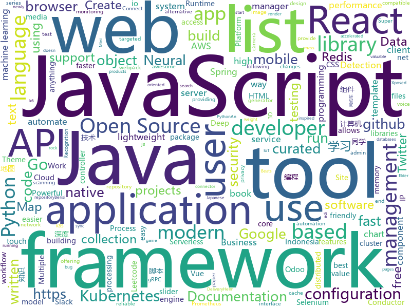

# 2020-11-26
See what the GitHub community is most excited about.

## python
+ [U-2-Net](https://github.com/NathanUA/U-2-Net)(**217 stars today**): The code for our newly accepted paper in Pattern Recognition 2020: "U^2-Net: Going Deeper with Nested U-Structure for Salient Object Detection."
+ [create-ml-app](https://github.com/shreyashankar/create-ml-app)(**83 stars today**): Template Makefile for ML projects in Python.
+ [EasyOCR](https://github.com/JaidedAI/EasyOCR)(**82 stars today**): Ready-to-use OCR with 40+ languages supported including Chinese, Japanese, Korean and Thai
+ [WebSiteBot_PS5](https://github.com/dkkocab/WebSiteBot_PS5)(**25 stars today**): This is a bot that will buy a PS5 through Walmart. It's written in python and uses selenium to interact with web pages. *WORK IN PROGRESS*
+ [YouTube-video-finder](https://github.com/chris-lovejoy/YouTube-video-finder)(**53 stars today**): A tool to intentionally discover valuable videos
+ [Python](https://github.com/TheAlgorithms/Python)(**394 stars today**): All Algorithms implemented in Python
+ [rich](https://github.com/willmcgugan/rich)(**121 stars today**): Rich is a Python library for rich text and beautiful formatting in the terminal.
+ [scikit-image](https://github.com/scikit-image/scikit-image)(**4 stars today**): Image processing in Python
+ [twint](https://github.com/twintproject/twint)(**14 stars today**): An advanced Twitter scraping & OSINT tool written in Python that doesn't use Twitter's API, allowing you to scrape a user's followers, following, Tweets and more while evading most API limitations.
+ [Bringing-Old-Photos-Back-to-Life](https://github.com/microsoft/Bringing-Old-Photos-Back-to-Life)(**105 stars today**): Bringing Old Photo Back to Life (CVPR 2020 oral)
+ [gpt-2](https://github.com/openai/gpt-2)(**15 stars today**): Code for the paper "Language Models are Unsupervised Multitask Learners"
+ [IntelOwl](https://github.com/intelowlproject/IntelOwl)(**39 stars today**): Intel Owl: analyze files, domains, IPs in multiple ways from a single API at scale
+ [PayloadsAllTheThings](https://github.com/swisskyrepo/PayloadsAllTheThings)(**36 stars today**): A list of useful payloads and bypass for Web Application Security and Pentest/CTF
+ [salt](https://github.com/saltstack/salt)(**6 stars today**): Software to automate the management and configuration of any infrastructure or application at scale. Get access to the Salt software package repository here:
+ [rasa](https://github.com/RasaHQ/rasa)(**7 stars today**): 💬Open source machine learning framework to automate text- and voice-based conversations: NLU, dialogue management, connect to Slack, Facebook, and more - Create chatbots and voice assistants
+ [leedeeprl-notes](https://github.com/datawhalechina/leedeeprl-notes)(**122 stars today**): 李宏毅《深度强化学习》笔记，在线阅读地址：https://datawhalechina.github.io/leedeeprl-notes/
+ [jina](https://github.com/jina-ai/jina)(**13 stars today**): An easier way to build neural search in the cloud
+ [python-telegram-bot](https://github.com/python-telegram-bot/python-telegram-bot)(**17 stars today**): We have made you a wrapper you can't refuse
+ [mlfinlab](https://github.com/hudson-and-thames/mlfinlab)(**14 stars today**): MlFinLab helps portfolio managers and traders who want to leverage the power of machine learning by providing reproducible, interpretable, and easy to use tools.
+ [nanodet](https://github.com/RangiLyu/nanodet)(**354 stars today**): ⚡Super fast and lightweight anchor-free object detection model.🔥Only 1.8mb and run 97FPS on cellphone🔥
+ [flax](https://github.com/google/flax)(**6 stars today**): Flax is a neural network ecosystem for JAX that is designed for flexibility.
+ [DeepCreamPy](https://github.com/deeppomf/DeepCreamPy)(**13 stars today**): Decensoring Hentai with Deep Neural Networks
+ [aws-cdk-examples](https://github.com/aws-samples/aws-cdk-examples)(**9 stars today**): Example projects using the AWS CDK
+ [mlcourse.ai](https://github.com/Yorko/mlcourse.ai)(**4 stars today**): Open Machine Learning Course
+ [CheatSheetSeries](https://github.com/OWASP/CheatSheetSeries)(**10 stars today**): The OWASP Cheat Sheet Series was created to provide a concise collection of high value information on specific application security topics.

## java
+ [antlr4](https://github.com/antlr/antlr4)(**10 stars today**): ANTLR (ANother Tool for Language Recognition) is a powerful parser generator for reading, processing, executing, or translating structured text or binary files.
+ [COLA](https://github.com/alibaba/COLA)(**20 stars today**): Clean Object-oriented & Layered Architecture
+ [BaseRecyclerViewAdapterHelper](https://github.com/CymChad/BaseRecyclerViewAdapterHelper)(**13 stars today**): BRVAH:Powerful and flexible RecyclerAdapter
+ [online-taxi](https://github.com/yueyi2019/online-taxi)(**34 stars today**): 网约车项目
+ [tutorials](https://github.com/eugenp/tutorials)(**30 stars today**): Just Announced - "Learn Spring Security OAuth":
+ [EdXposed](https://github.com/ElderDrivers/EdXposed)(**20 stars today**): Elder driver Xposed Framework.
+ [react-native-camera](https://github.com/react-native-camera/react-native-camera)(**4 stars today**): A Camera component for React Native. Also supports barcode scanning!
+ [keycloak](https://github.com/keycloak/keycloak)(**15 stars today**): Open Source Identity and Access Management For Modern Applications and Services
+ [react-native-video](https://github.com/react-native-video/react-native-video)(**3 stars today**): A <Video /> component for react-native
+ [skywalking](https://github.com/apache/skywalking)(**16 stars today**): APM, Application Performance Monitoring System
+ [redisson](https://github.com/redisson/redisson)(**19 stars today**): Redisson - Redis Java client with features of In-Memory Data Grid. Over 50 Redis based Java objects and services: Set, Multimap, SortedSet, Map, List, Queue, Deque, Semaphore, Lock, AtomicLong, Map Reduce, Publish / Subscribe, Bloom filter, Spring Cache, Tomcat, Scheduler, JCache API, Hibernate, MyBatis, RPC, local cache ...
+ [spring-cloud-kubernetes](https://github.com/spring-cloud/spring-cloud-kubernetes)(**3 stars today**): Kubernetes integration with Spring Cloud Discovery Client, Configuration, etc...
+ [Mindustry](https://github.com/Anuken/Mindustry)(**12 stars today**): A sandbox tower defense game
+ [react-native-image-picker](https://github.com/react-native-image-picker/react-native-image-picker)(**6 stars today**): 🌄A React Native module that allows you to use native UI to select media from the device library or directly from the camera.
+ [advanced-java](https://github.com/doocs/advanced-java)(**77 stars today**): 😮互联网 Java 工程师进阶知识完全扫盲：涵盖高并发、分布式、高可用、微服务、海量数据处理等领域知识，后端同学必看，前端同学也可学习
+ [byte-buddy](https://github.com/raphw/byte-buddy)(**6 stars today**): Runtime code generation for the Java virtual machine.
+ [kafka-connect-jdbc](https://github.com/confluentinc/kafka-connect-jdbc)(**1 stars today**): Kafka Connect connector for JDBC-compatible databases
+ [Activiti](https://github.com/Activiti/Activiti)(**8 stars today**): Activiti is a light-weight workflow and Business Process Management (BPM) Platform targeted at business people, developers and system admins. Its core is a super-fast and rock-solid BPMN 2 process engine for Java. It's open-source and distributed under the Apache license. Activiti runs in any Java application, on a server, on a cluster or in the…
+ [user-interface-samples](https://github.com/android/user-interface-samples)(**5 stars today**): Multiple samples showing the best practices in the user interface on Android.
+ [conductor](https://github.com/Netflix/conductor)(**4 stars today**): Conductor is a microservices orchestration engine - https://netflix.github.io/conductor/
+ [ExoPlayer](https://github.com/google/ExoPlayer)(**15 stars today**): An extensible media player for Android
+ [zuul](https://github.com/Netflix/zuul)(**9 stars today**): Zuul is a gateway service that provides dynamic routing, monitoring, resiliency, security, and more.
+ [testcontainers-java](https://github.com/testcontainers/testcontainers-java)(**3 stars today**): Testcontainers is a Java library that supports JUnit tests, providing lightweight, throwaway instances of common databases, Selenium web browsers, or anything else that can run in a Docker container.
+ [CS-Notes](https://github.com/CyC2018/CS-Notes)(**98 stars today**): 📚技术面试必备基础知识、Leetcode、计算机操作系统、计算机网络、系统设计、Java、Python、C++
+ [azkaban](https://github.com/azkaban/azkaban)(**3 stars today**): Azkaban workflow manager.

## unknown
+ [javascript-code-challenges](https://github.com/sadanandpai/javascript-code-challenges)(**291 stars today**): A collection of JavaScript modern interview code challenges for beginners to experts
+ [free-programming-books-zh_CN](https://github.com/justjavac/free-programming-books-zh_CN)(**84 stars today**): 📚免费的计算机编程类中文书籍，欢迎投稿
+ [Infosec-Deals-2020](https://github.com/instadoodledavid/Infosec-Deals-2020)(**15 stars today**): Ongoing Infosec Deals 2020
+ [eloquente-javascript](https://github.com/braziljs/eloquente-javascript)(**6 stars today**): Tradução do livro Eloquent JavaScript - 2ª edição.
+ [conference](https://github.com/gopherchina/conference)(**78 stars today**): 
+ [developer-roadmap](https://github.com/kamranahmedse/developer-roadmap)(**157 stars today**): Roadmap to becoming a web developer in 2020
+ [freebsd-commands](https://github.com/sbz/freebsd-commands)(**21 stars today**): 
+ [coding-interview-university](https://github.com/jwasham/coding-interview-university)(**522 stars today**): A complete computer science study plan to become a software engineer.
+ [degoogle](https://github.com/tycrek/degoogle)(**31 stars today**): A huge list of alternatives to Google products. Privacy tips, tricks, and links.
+ [Rainbow-Fart-MBG](https://github.com/Nanguage/Rainbow-Fart-MBG)(**53 stars today**): 程序员要讲码德，耗子尾汁，好好反思！
+ [pikvm](https://github.com/pikvm/pikvm)(**35 stars today**): Open and cheap DIY IP-KVM based on Raspberry Pi
+ [architect-awesome](https://github.com/xingshaocheng/architect-awesome)(**154 stars today**): 后端架构师技术图谱
+ [OnJava8](https://github.com/LingCoder/OnJava8)(**38 stars today**): 《On Java 8》中文版，又名《Java编程思想》 第5版
+ [attack-guardduty-navigator](https://github.com/amrandazz/attack-guardduty-navigator)(**5 stars today**): A MITRE ATT&CK Navigator export for AWS GuardDuty Findings
+ [KingOfBugBountyTips](https://github.com/KingOfBugbounty/KingOfBugBountyTips)(**16 stars today**): 
+ [binance-official-api-docs](https://github.com/binance-exchange/binance-official-api-docs)(**3 stars today**): Official Documentation for the Binance APIs and Streams
+ [frontend-dev-bookmarks](https://github.com/dypsilon/frontend-dev-bookmarks)(**16 stars today**): Manually curated collection of resources for frontend web developers.
+ [COVID-19](https://github.com/pcm-dpc/COVID-19)(**2 stars today**): COVID-19 Italia - Monitoraggio situazione
+ [You-Dont-Know-JS](https://github.com/getify/You-Dont-Know-JS)(**54 stars today**): A book series on JavaScript. @YDKJS on twitter.
+ [free-programming-books](https://github.com/EbookFoundation/free-programming-books)(**108 stars today**): 📚Freely available programming books
+ [awesome-vue](https://github.com/vuejs/awesome-vue)(**26 stars today**): 🎉A curated list of awesome things related to Vue.js
+ [awesome-wechat-weapp](https://github.com/justjavac/awesome-wechat-weapp)(**21 stars today**): 微信小程序开发资源汇总💯
+ [awesome-test-automation](https://github.com/atinfo/awesome-test-automation)(**7 stars today**): A curated list of awesome test automation frameworks, tools, libraries, and software for different programming languages. Sponsored by http://sdclabs.com
+ [awesome-mlops](https://github.com/visenger/awesome-mlops)(**19 stars today**): A curated list of references for MLOps
+ [bug-bounty-dorks](https://github.com/sushiwushi/bug-bounty-dorks)(**7 stars today**): List of Google Dorks for sites that have responsible disclosure program / bug bounty program

## javascript
+ [odoo](https://github.com/odoo/odoo)(**16 stars today**): Odoo. Open Source Apps To Grow Your Business.
+ [material-ui](https://github.com/mui-org/material-ui)(**131 stars today**): React components for faster and easier web development. Build your own design system, or start with Material Design.
+ [react-native](https://github.com/facebook/react-native)(**162 stars today**): A framework for building native apps with React.
+ [lazysizes](https://github.com/aFarkas/lazysizes)(**11 stars today**): High performance and SEO friendly lazy loader for images (responsive and normal), iframes and more, that detects any visibility changes triggered through user interaction, CSS or JavaScript without configuration.
+ [AdminLTE](https://github.com/ColorlibHQ/AdminLTE)(**24 stars today**): AdminLTE - Free admin dashboard template based on Bootstrap 4
+ [LeetHub](https://github.com/QasimWani/LeetHub)(**26 stars today**): Automatically sync your leetcode solutions to your github account - top 10 trending GitHub repository
+ [ramda](https://github.com/ramda/ramda)(**26 stars today**): 🐏Practical functional Javascript
+ [33-js-concepts](https://github.com/leonardomso/33-js-concepts)(**21 stars today**): 📜33 concepts every JavaScript developer should know.
+ [webpack-dev-server](https://github.com/webpack/webpack-dev-server)(**4 stars today**): Serves a webpack app. Updates the browser on changes. Documentation https://webpack.js.org/configuration/dev-server/.
+ [untrusted-types](https://github.com/filedescriptor/untrusted-types)(**21 stars today**): 
+ [UserScript](https://github.com/XIU2/UserScript)(**33 stars today**): 🔨自用的一些乱七八糟 油猴脚本
+ [Detox](https://github.com/wix/Detox)(**11 stars today**): Gray box end-to-end testing and automation framework for mobile apps
+ [Leaflet](https://github.com/Leaflet/Leaflet)(**19 stars today**): 🍃JavaScript library for mobile-friendly interactive maps
+ [alpine](https://github.com/alpinejs/alpine)(**27 stars today**): A rugged, minimal framework for composing JavaScript behavior in your markup.
+ [realworld](https://github.com/gothinkster/realworld)(**32 stars today**): "The mother of all demo apps" — Exemplary fullstack Medium.com clone powered by React, Angular, Node, Django, and many more🏅
+ [cesium](https://github.com/CesiumGS/cesium)(**15 stars today**): An open-source JavaScript library for world-class 3D globes and maps🌎
+ [cypress](https://github.com/cypress-io/cypress)(**18 stars today**): Fast, easy and reliable testing for anything that runs in a browser.
+ [vanillawebprojects](https://github.com/bradtraversy/vanillawebprojects)(**10 stars today**): Mini projects built with HTML5, CSS & JavaScript. No frameworks or libraries
+ [vue-amap](https://github.com/ElemeFE/vue-amap)(**5 stars today**): 🌍基于 Vue 2.x 和高德地图的地图组件
+ [Motrix](https://github.com/agalwood/Motrix)(**58 stars today**): A full-featured download manager.
+ [locomotive-scroll](https://github.com/locomotivemtl/locomotive-scroll)(**26 stars today**): 🛤Detection of elements in viewport & smooth scrolling with parallax.
+ [markdown-here](https://github.com/adam-p/markdown-here)(**26 stars today**): Google Chrome, Firefox, and Thunderbird extension that lets you write email in Markdown and render it before sending.
+ [serverless](https://github.com/serverless/serverless)(**15 stars today**): ⚡Serverless Framework – Build web, mobile and IoT applications with serverless architectures using AWS Lambda, Azure Functions, Google CloudFunctions & more! –
+ [sortablejs](https://github.com/SortableJS/sortablejs)(**17 stars today**): Create and reorder lists with drag-and-drop. For use with modern browsers and touch devices
+ [swiper](https://github.com/nolimits4web/swiper)(**15 stars today**): Most modern mobile touch slider with hardware accelerated transitions

## html
+ [introduction-to-bash-scripting](https://github.com/bobbyiliev/introduction-to-bash-scripting)(**192 stars today**): Free Introduction to Bash Scripting eBook
+ [Modern-HTML-Starter-Template](https://github.com/harryheman/Modern-HTML-Starter-Template)(**59 stars today**): Modern HTML Starter Template
+ [free-for-dev](https://github.com/ripienaar/free-for-dev)(**178 stars today**): A list of SaaS, PaaS and IaaS offerings that have free tiers of interest to devops and infradev
+ [hugo-PaperMod](https://github.com/adityatelange/hugo-PaperMod)(**8 stars today**): Hugo Theme PaperMod
+ [tiny-slider](https://github.com/ganlanyuan/tiny-slider)(**7 stars today**): Vanilla javascript slider for all purposes.
+ [helm-charts](https://github.com/prometheus-community/helm-charts)(**8 stars today**): Prometheus community Helm charts
+ [nndl.github.io](https://github.com/nndl/nndl.github.io)(**17 stars today**): 《神经网络与深度学习》 邱锡鹏著 Neural Network and Deep Learning
+ [ansible-role-mysql](https://github.com/geerlingguy/ansible-role-mysql)(**2 stars today**): Ansible Role - MySQL
+ [EIPs](https://github.com/ethereum/EIPs)(**3 stars today**): The Ethereum Improvement Proposal repository
+ [charts](https://github.com/bitnami/charts)(**7 stars today**): Helm Charts
+ [msteams-docs](https://github.com/MicrosoftDocs/msteams-docs)(**1 stars today**): Source for the Microsoft Teams developer platform documentation.
+ [docker-development-youtube-series](https://github.com/marcel-dempers/docker-development-youtube-series)(**4 stars today**): 
+ [flutter-in-action](https://github.com/flutterchina/flutter-in-action)(**6 stars today**): 《Flutter实战》电子书
+ [kubeasz](https://github.com/easzlab/kubeasz)(**5 stars today**): 使用Ansible脚本安装K8S集群，介绍组件交互原理，方便直接，不受国内网络环境影响
+ [server-tools](https://github.com/OCA/server-tools)(**0 stars today**): Tools for Odoo Administrators to improve some technical features on Odoo.
+ [raytracing.github.io](https://github.com/RayTracing/raytracing.github.io)(**15 stars today**): Main Web Site (Online Books)
+ [hugo-book](https://github.com/alex-shpak/hugo-book)(**1 stars today**): Hugo documentation theme as simple as plain book
+ [csswg-drafts](https://github.com/w3c/csswg-drafts)(**6 stars today**): CSS Working Group Editor Drafts
+ [pup](https://github.com/ericchiang/pup)(**3 stars today**): Parsing HTML at the command line
+ [beginner-javascript](https://github.com/wesbos/beginner-javascript)(**11 stars today**): Slam Dunk JavaScript
+ [privacytools.io](https://github.com/privacytools/privacytools.io)(**6 stars today**): 🛡🛠You are being watched. Protect your privacy against global mass surveillance.
+ [1-pixel-wealth](https://github.com/MKorostoff/1-pixel-wealth)(**5 stars today**): 
+ [glTF](https://github.com/KhronosGroup/glTF)(**5 stars today**): glTF – Runtime 3D Asset Delivery
+ [charts](https://github.com/Oteemo/charts)(**0 stars today**): Helm chart repository
+ [DAFTAR-API-LOKAL-INDONESIA](https://github.com/farizdotid/DAFTAR-API-LOKAL-INDONESIA)(**2 stars today**): Berisi API tentang Data Indonesia ataupun API yang dibuat oleh developer Indonesia <3

## go
+ [k6](https://github.com/loadimpact/k6)(**160 stars today**): A modern load testing tool, using Go and JavaScript - https://k6.io
+ [urlhunter](https://github.com/utkusen/urlhunter)(**164 stars today**): a recon tool that allows searching on URLs that are exposed via shortener services
+ [Xray-core](https://github.com/XTLS/Xray-core)(**102 stars today**): Xray, Penetrates Everything. Also the best v2ray-core, with XTLS support. Fully compatible configuration.
+ [kruise](https://github.com/openkruise/kruise)(**11 stars today**): Automate application workloads management on Kubernetes
+ [fiber](https://github.com/gofiber/fiber)(**27 stars today**): ⚡️Express inspired web framework written in Go
+ [etcd](https://github.com/etcd-io/etcd)(**26 stars today**): Distributed reliable key-value store for the most critical data of a distributed system
+ [loki](https://github.com/grafana/loki)(**18 stars today**): Like Prometheus, but for logs.
+ [go-echarts](https://github.com/go-echarts/go-echarts)(**28 stars today**): 🎨The adorable charts library for Golang
+ [temporal](https://github.com/temporalio/temporal)(**48 stars today**): Temporal service and CLI
+ [golang-lru](https://github.com/hashicorp/golang-lru)(**15 stars today**): Golang LRU cache
+ [kratos](https://github.com/ory/kratos)(**31 stars today**): Never build user login, user registration, 2fa, profile management ever again! Works on any operating system, cloud, with any programming language, user interface, and user experience! Written in Go.
+ [ent](https://github.com/facebook/ent)(**103 stars today**): An entity framework for Go
+ [telegraf](https://github.com/influxdata/telegraf)(**2 stars today**): The plugin-driven server agent for collecting & reporting metrics.
+ [beats](https://github.com/elastic/beats)(**10 stars today**): 🐠Beats - Lightweight shippers for Elasticsearch & Logstash
+ [grpc-go](https://github.com/grpc/grpc-go)(**18 stars today**): The Go language implementation of gRPC. HTTP/2 based RPC
+ [sealed-secrets](https://github.com/bitnami-labs/sealed-secrets)(**6 stars today**): A Kubernetes controller and tool for one-way encrypted Secrets
+ [fasthttp](https://github.com/valyala/fasthttp)(**11 stars today**): Fast HTTP package for Go. Tuned for high performance. Zero memory allocations in hot paths. Up to 10x faster than net/http
+ [redis](https://github.com/go-redis/redis)(**11 stars today**): Type-safe Redis client for Golang
+ [chi](https://github.com/go-chi/chi)(**10 stars today**): lightweight, idiomatic and composable router for building Go HTTP services
+ [minikube](https://github.com/kubernetes/minikube)(**18 stars today**): Run Kubernetes locally
+ [ingress-nginx](https://github.com/kubernetes/ingress-nginx)(**21 stars today**): NGINX Ingress Controller for Kubernetes
+ [nuclei](https://github.com/projectdiscovery/nuclei)(**22 stars today**): Nuclei is a fast tool for configurable targeted scanning based on templates offering massive extensibility and ease of use.
+ [mattermost-server](https://github.com/mattermost/mattermost-server)(**7 stars today**): Open source Slack-alternative in Golang and React - Mattermost
+ [grpc-gateway](https://github.com/grpc-ecosystem/grpc-gateway)(**5 stars today**): gRPC to JSON proxy generator following the gRPC HTTP spec
+ [postgres-operator](https://github.com/zalando/postgres-operator)(**4 stars today**): Postgres operator creates and manages PostgreSQL clusters running in Kubernetes

## WordCloud

