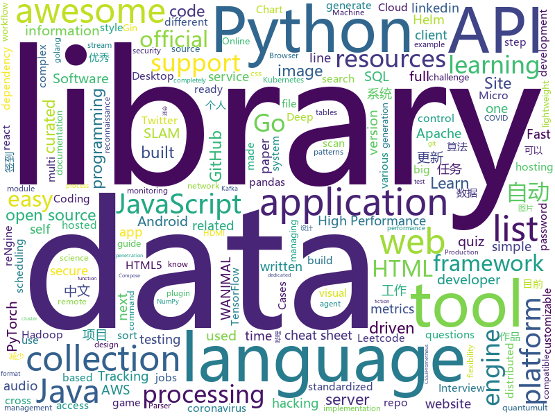

# 2020-12-01
See what the GitHub community is most excited about.

## python
+ [datasets](https://github.com/huggingface/datasets)(**217 stars today**): 🤗Fast, efficient, open-access datasets and evaluation metrics in PyTorch, TensorFlow, NumPy and Pandas
+ [inventory-hunter](https://github.com/EricJMarti/inventory-hunter)(**138 stars today**): ⚡️Get notified as soon as your next CPU, GPU, or game console is in stock
+ [python-telegram-bot](https://github.com/python-telegram-bot/python-telegram-bot)(**203 stars today**): We have made you a wrapper you can't refuse
+ [gallery-dl](https://github.com/mikf/gallery-dl)(**127 stars today**): Command-line program to download image-galleries and -collections from several image hosting sites
+ [locust](https://github.com/locustio/locust)(**16 stars today**): Scalable user load testing tool written in Python
+ [lux](https://github.com/lux-org/lux)(**42 stars today**): Python API for Intelligent Visual Data Discovery
+ [python](https://github.com/kubernetes-client/python)(**5 stars today**): Official Python client library for kubernetes
+ [hackingtool](https://github.com/Z4nzu/hackingtool)(**32 stars today**): ALL IN ONE Hacking Tool For Hackers
+ [asteroid](https://github.com/asteroid-team/asteroid)(**9 stars today**): The PyTorch-based audio source separation toolkit for researchers
+ [caer](https://github.com/jasmcaus/caer)(**18 stars today**): A lightweight Computer Vision library for high-performance AI research.
+ [holehe](https://github.com/megadose/holehe)(**18 stars today**): holehe allows you to check if the mail is used on different sites like twitter, instagram and will retrieve information on sites with the forgotten password function.
+ [backtrader](https://github.com/mementum/backtrader)(**10 stars today**): Python Backtesting library for trading strategies
+ [languagepod101-scraper](https://github.com/nedlir/languagepod101-scraper)(**46 stars today**): Python scraper for Language Pods such as Japanesepod101.com👹🗾🍣Compatible with Japanese, Chinese, French, German, Italian, Korean, Portuguese, Russian, Spanish and many more!✨
+ [rengine](https://github.com/yogeshojha/rengine)(**15 stars today**): reNgine is an automated reconnaissance framework meant for information gathering during penetration testing of web applications. reNgine has customizable scan engines, which can be used to scan the websites, endpoints, and gather information.
+ [r0capture](https://github.com/r0ysue/r0capture)(**133 stars today**): 安卓应用层抓包通杀脚本
+ [cheat.sh](https://github.com/chubin/cheat.sh)(**78 stars today**): the only cheat sheet you need
+ [poetry](https://github.com/python-poetry/poetry)(**24 stars today**): Python dependency management and packaging made easy.
+ [stylized-neural-painting](https://github.com/jiupinjia/stylized-neural-painting)(**47 stars today**): Official Pytorch implementation of the preprint paper "Stylized Neural Painting", in arXiv:2011.08114.
+ [isort](https://github.com/PyCQA/isort)(**3 stars today**): A Python utility / library to sort imports.
+ [albert_zh](https://github.com/brightmart/albert_zh)(**8 stars today**): A LITE BERT FOR SELF-SUPERVISED LEARNING OF LANGUAGE REPRESENTATIONS, 海量中文预训练ALBERT模型
+ [luigi](https://github.com/spotify/luigi)(**7 stars today**): Luigi is a Python module that helps you build complex pipelines of batch jobs. It handles dependency resolution, workflow management, visualization etc. It also comes with Hadoop support built in.
+ [recommenders](https://github.com/microsoft/recommenders)(**7 stars today**): Best Practices on Recommendation Systems
+ [deep_sort](https://github.com/nwojke/deep_sort)(**6 stars today**): Simple Online Realtime Tracking with a Deep Association Metric
+ [data-science-ipython-notebooks](https://github.com/donnemartin/data-science-ipython-notebooks)(**13 stars today**): Data science Python notebooks: Deep learning (TensorFlow, Theano, Caffe, Keras), scikit-learn, Kaggle, big data (Spark, Hadoop MapReduce, HDFS), matplotlib, pandas, NumPy, SciPy, Python essentials, AWS, and various command lines.
+ [mmdetection3d](https://github.com/open-mmlab/mmdetection3d)(**5 stars today**): OpenMMLab's next-generation platform for general 3D object detection.

## java
+ [soul](https://github.com/dromara/soul)(**41 stars today**): High-Performance Java API Gateway
+ [Mindustry](https://github.com/Anuken/Mindustry)(**17 stars today**): A sandbox tower defense game
+ [Damn-Vulnerable-Bank](https://github.com/rewanth1997/Damn-Vulnerable-Bank)(**11 stars today**): Vulnerable Banking Application for Android
+ [GitHub-Chinese-Top-Charts](https://github.com/kon9chunkit/GitHub-Chinese-Top-Charts)(**111 stars today**): 🇨🇳GitHub中文排行榜，帮助你发现高分优秀中文项目、更高效地吸收国人的优秀经验成果；榜单每周更新一次，敬请关注！
+ [kafka](https://github.com/apache/kafka)(**13 stars today**): Mirror of Apache Kafka
+ [BilibiliTask](https://github.com/srcrs/BilibiliTask)(**29 stars today**): 哔哩哔哩(B站)自动完成每日任务，投币，点赞，直播签到，自动兑换银瓜子为硬币，自动送出即将过期礼物，漫画App签到。
+ [CS-Notes](https://github.com/CyC2018/CS-Notes)(**204 stars today**): 📚技术面试必备基础知识、Leetcode、计算机操作系统、计算机网络、系统设计、Java、Python、C++
+ [DeepVision](https://github.com/peng-zhihui/DeepVision)(**13 stars today**): 在我很多项目中用到的CV算法推理框架应用。
+ [lucene-solr](https://github.com/apache/lucene-solr)(**4 stars today**): Apache Lucene and Solr open-source search software
+ [presto](https://github.com/prestodb/presto)(**6 stars today**): The official home of the Presto distributed SQL query engine for big data
+ [quarkus](https://github.com/quarkusio/quarkus)(**9 stars today**): Quarkus: Supersonic Subatomic Java.
+ [CtCI-6th-Edition](https://github.com/careercup/CtCI-6th-Edition)(**6 stars today**): Cracking the Coding Interview 6th Ed. Solutions
+ [spring-boot](https://github.com/spring-projects/spring-boot)(**28 stars today**): Spring Boot
+ [tutorials](https://github.com/eugenp/tutorials)(**16 stars today**): Just Announced - "Learn Spring Security OAuth":
+ [java-design-patterns](https://github.com/iluwatar/java-design-patterns)(**25 stars today**): Design patterns implemented in Java
+ [react-native-track-player](https://github.com/react-native-kit/react-native-track-player)(**1 stars today**): A fully fledged audio module created for music apps. Provides audio playback, external media controls, chromecast support, background mode and more!
+ [incubator-dolphinscheduler](https://github.com/apache/incubator-dolphinscheduler)(**7 stars today**): Dolphin Scheduler is a distributed and easy-to-extend visual workflow scheduling platform, dedicated to solving the complex dependencies in data processing, making the scheduling system out of the box for data processing.(分布式易扩展的可视化工作流任务调度)
+ [ksql](https://github.com/confluentinc/ksql)(**8 stars today**): The event streaming database purpose-built for stream processing applications
+ [antlr4](https://github.com/antlr/antlr4)(**10 stars today**): ANTLR (ANother Tool for Language Recognition) is a powerful parser generator for reading, processing, executing, or translating structured text or binary files.
+ [wildfly](https://github.com/wildfly/wildfly)(**1 stars today**): WildFly Application Server
+ [zxing](https://github.com/zxing/zxing)(**9 stars today**): ZXing ("Zebra Crossing") barcode scanning library for Java, Android
+ [spring-framework](https://github.com/spring-projects/spring-framework)(**16 stars today**): Spring Framework
+ [kafka-streams-examples](https://github.com/confluentinc/kafka-streams-examples)(**4 stars today**): Demo applications and code examples for Apache Kafka's Streams API.
+ [libgdx](https://github.com/libgdx/libgdx)(**5 stars today**): Desktop/Android/HTML5/iOS Java game development framework
+ [okhttp](https://github.com/square/okhttp)(**13 stars today**): Square’s meticulous HTTP client for the JVM, Android, and GraalVM.

## unknown
+ [HDMI-PI](https://github.com/peng-zhihui/HDMI-PI)(**109 stars today**): 我设计的一个HDMI转MIPI模块，可以用于驱动各种手机屏幕当显示器用。
+ [PocketLCD](https://github.com/peng-zhihui/PocketLCD)(**327 stars today**): 
+ [awesome-osint](https://github.com/jivoi/awesome-osint)(**151 stars today**): 😱A curated list of amazingly awesome OSINT
+ [dna-3d-engine](https://github.com/pallada-92/dna-3d-engine)(**102 stars today**): 3d engine implementation in DNA code!
+ [Resources-for-Beginner-Bug-Bounty-Hunters](https://github.com/nahamsec/Resources-for-Beginner-Bug-Bounty-Hunters)(**49 stars today**): A list of resources for those interested in getting started in bug bounties
+ [COVID-19](https://github.com/CSSEGISandData/COVID-19)(**26 stars today**): Novel Coronavirus (COVID-19) Cases, provided by JHU CSSE
+ [frontend-dev-bookmarks](https://github.com/dypsilon/frontend-dev-bookmarks)(**23 stars today**): Manually curated collection of resources for frontend web developers.
+ [Kyuu](https://github.com/Quantrik/Kyuu)(**12 stars today**): Kyuu Keyboard Design
+ [NewGrad-2021](https://github.com/Pitt-CSC/NewGrad-2021)(**14 stars today**): A collection of New Grad full time roles in SWE, Quant, and PM.
+ [stat_rethinking_2020](https://github.com/rmcelreath/stat_rethinking_2020)(**20 stars today**): Statistical Rethinking Course Winter 2020/2021
+ [PENTESTING-BIBLE](https://github.com/blaCCkHatHacEEkr/PENTESTING-BIBLE)(**11 stars today**): Learn ethical hacking.Learn about reconnaissance,windows/linux hacking,attacking web technologies,and pen testing wireless networks.Resources for learning malware analysis and reverse engineering.
+ [curriculum](https://github.com/cncf/curriculum)(**7 stars today**): 📚Open Source Curriculum for CNCF Certification Courses
+ [HdmiPi-Streaming](https://github.com/PrawnMan/HdmiPi-Streaming)(**11 stars today**): Streaming using a cheap HDMI capture card and a raspberry Pi to an RTMP Receiver.
+ [app-ideas](https://github.com/florinpop17/app-ideas)(**41 stars today**): A Collection of application ideas which can be used to improve your coding skills.
+ [awesome-remote-job](https://github.com/lukasz-madon/awesome-remote-job)(**7 stars today**): A curated list of awesome remote jobs and resources. Inspired by https://github.com/vinta/awesome-python
+ [awesome-design-patterns](https://github.com/DovAmir/awesome-design-patterns)(**15 stars today**): A curated list of software and architecture related design patterns.
+ [WANIMAL-1983](https://github.com/Winans7310/WANIMAL-1983)(**8 stars today**): WANIMAL(王动)全部原版资源免费分享，目前WANIMAL作品在黑市上最高被炒到了5000多元，本项目整理了WANIMAL从2013年到现在的所有作品，建议在电脑查看图片效果会更好（目前更新到2020年3月，共8765张图片，大小16.1G，还会持续更新）
+ [awesome-dotnet](https://github.com/quozd/awesome-dotnet)(**8 stars today**): A collection of awesome .NET libraries, tools, frameworks and software
+ [benchmark_results](https://github.com/foolwood/benchmark_results)(**2 stars today**): Visual Tracking Paper List
+ [the-art-of-command-line](https://github.com/jlevy/the-art-of-command-line)(**37 stars today**): Master the command line, in one page
+ [Recent_SLAM_Research](https://github.com/YiChenCityU/Recent_SLAM_Research)(**10 stars today**): Track Advancement of SLAM 跟踪SLAM前沿动态【2020 version】
+ [CSharp-9-CheatSheet](https://github.com/alugili/CSharp-9-CheatSheet)(**67 stars today**): C# 9 Cheat Sheet with code example and pros and cons.
+ [fucking-algorithm](https://github.com/labuladong/fucking-algorithm)(**212 stars today**): 刷算法全靠套路，认准 labuladong 就够了！English version supported! Crack LeetCode, not only how, but also why.
+ [covid-19-data](https://github.com/nytimes/covid-19-data)(**8 stars today**): An ongoing repository of data on coronavirus cases and deaths in the U.S.
+ [ABigSurvey](https://github.com/NiuTrans/ABigSurvey)(**91 stars today**): A collection of 400+ survey papers on Natural Language Processing (NLP) and Machine Learning (ML)

## javascript
+ [edex-ui](https://github.com/GitSquared/edex-ui)(**215 stars today**): A cross-platform, customizable science fiction terminal emulator with advanced monitoring & touchscreen support.
+ [x](https://github.com/DustinBrett/x)(**327 stars today**): Desktop environment in the browser.
+ [reveal.js](https://github.com/hakimel/reveal.js)(**218 stars today**): The HTML Presentation Framework
+ [SuperTinyIcons](https://github.com/edent/SuperTinyIcons)(**390 stars today**): Under 1KB each! Super Tiny Icons are miniscule SVG versions of your favourite website and app logos
+ [twin.macro](https://github.com/ben-rogerson/twin.macro)(**126 stars today**): 🦹‍♂️Twin blends the magic of Tailwind with the flexibility of css-in-js (emotion, styled-components and goober) at build time.
+ [awesome-cheatsheets](https://github.com/LeCoupa/awesome-cheatsheets)(**42 stars today**): 👩‍💻👨‍💻Awesome cheatsheets for popular programming languages, frameworks and development tools. They include everything you should know in one single file.
+ [proshop_mern](https://github.com/bradtraversy/proshop_mern)(**10 stars today**): Shopping cart built with MERN & Redux
+ [lerna](https://github.com/lerna/lerna)(**18 stars today**): 🐉A tool for managing JavaScript projects with multiple packages.
+ [nextra](https://github.com/shuding/nextra)(**173 stars today**): The Next Static Site Generator
+ [list.js](https://github.com/javve/list.js)(**83 stars today**): The perfect library for adding search, sort, filters and flexibility to tables, lists and various HTML elements. Built to be invisible and work on existing HTML.
+ [awesome-advent-of-code](https://github.com/Bogdanp/awesome-advent-of-code)(**15 stars today**): A collection of awesome resources related to the yearly Advent of Code challenge.
+ [30-Days-Of-JavaScript](https://github.com/Asabeneh/30-Days-Of-JavaScript)(**12 stars today**): 30 days of JavaScript programming challenge is a step by step guide to learn JavaScript programming language in 30 days
+ [awesome-selfhosted](https://github.com/awesome-selfhosted/awesome-selfhosted)(**43 stars today**): A list of Free Software network services and web applications which can be hosted locally. Selfhosting is the process of hosting and managing applications instead of renting from Software-as-a-Service providers
+ [keeweb](https://github.com/keeweb/keeweb)(**14 stars today**): Free cross-platform password manager compatible with KeePass
+ [fullPage.js](https://github.com/alvarotrigo/fullPage.js)(**7 stars today**): fullPage plugin by Alvaro Trigo. Create full screen pages fast and simple
+ [33-js-concepts](https://github.com/leonardomso/33-js-concepts)(**36 stars today**): 📜33 concepts every JavaScript developer should know.
+ [JavaScript](https://github.com/ziye12/JavaScript)(**29 stars today**): 本人quantumult x，优先适配quantumult x， surge loon应该也能用
+ [react-grid-layout](https://github.com/STRML/react-grid-layout)(**6 stars today**): A draggable and resizable grid layout with responsive breakpoints, for React.
+ [coc.nvim](https://github.com/neoclide/coc.nvim)(**22 stars today**): Intellisense engine for Vim8 & Neovim, full language server protocol support as VSCode
+ [in-quiz-questions](https://github.com/Ebazhanov/in-quiz-questions)(**19 stars today**): Linkedin quiz assessment, linkedin test, questions and answers (aws-lambda, rest-api, javascript, react, git, html, jquery, mongodb, java, css, python, machine-learning ...) ответы на квиз, LinkedIn quiz lösungen, linkedin quiz las respuestas
+ [dropzone](https://github.com/enyo/dropzone)(**4 stars today**): Dropzone is an easy to use drag'n'drop library. It supports image previews and shows nice progress bars.
+ [label-studio](https://github.com/heartexlabs/label-studio)(**5 stars today**): Label Studio is a multi-type data labeling and annotation tool with standardized output format
+ [RSSHub-Radar](https://github.com/DIYgod/RSSHub-Radar)(**2 stars today**): 🍰Browser extension that simplifies finding and subscribing RSS and RSSHub
+ [TIMSDK](https://github.com/tencentyun/TIMSDK)(**4 stars today**): 腾讯云即时通信 IM 服务，国内下载镜像：
+ [bigbluebutton](https://github.com/bigbluebutton/bigbluebutton)(**9 stars today**): Complete open source web conferencing system.

## html
+ [openwrt-passwall](https://github.com/xiaorouji/openwrt-passwall)(**41 stars today**): 
+ [raytracing.github.io](https://github.com/RayTracing/raytracing.github.io)(**68 stars today**): Main Web Site (Online Books)
+ [tidytuesday](https://github.com/rfordatascience/tidytuesday)(**3 stars today**): Official repo for the #tidytuesday project
+ [kubespray](https://github.com/kubernetes-sigs/kubespray)(**11 stars today**): Deploy a Production Ready Kubernetes Cluster
+ [argo-helm](https://github.com/argoproj/argo-helm)(**1 stars today**): ArgoProj Helm Charts
+ [Front-end-Developer-Interview-Questions](https://github.com/h5bp/Front-end-Developer-Interview-Questions)(**13 stars today**): A list of helpful front-end related questions you can use to interview potential candidates, test yourself or completely ignore.
+ [amundsen](https://github.com/amundsen-io/amundsen)(**3 stars today**): Amundsen is a metadata driven application for improving the productivity of data analysts, data scientists and engineers when interacting with data.
+ [rellax](https://github.com/dixonandmoe/rellax)(**4 stars today**): Lightweight, vanilla javascript parallax library
+ [windmill-dashboard](https://github.com/estevanmaito/windmill-dashboard)(**6 stars today**): 📊A multi theme, completely accessible, ready for production dashboard.
+ [beginner-javascript](https://github.com/wesbos/beginner-javascript)(**19 stars today**): Slam Dunk JavaScript
+ [eks-charts](https://github.com/aws/eks-charts)(**2 stars today**): Amazon EKS Helm chart repository
+ [charts](https://github.com/bitnami/charts)(**5 stars today**): Helm Charts
+ [peng-zhihui.github.io](https://github.com/peng-zhihui/peng-zhihui.github.io)(**4 stars today**): 稚晖的个人站
+ [styleguide](https://github.com/google/styleguide)(**14 stars today**): Style guides for Google-originated open-source projects
+ [website](https://github.com/kubernetes/website)(**2 stars today**): Kubernetes website and documentation repo:
+ [html-css](https://github.com/gustavoguanabara/html-css)(**11 stars today**): Curso de HTML5 e CSS3
+ [helm-charts](https://github.com/prometheus-community/helm-charts)(**5 stars today**): Prometheus community Helm charts
+ [covid19-forecast-hub](https://github.com/reichlab/covid19-forecast-hub)(**1 stars today**): Projections of COVID-19, in standardized format
+ [ru.javascript.info](https://github.com/javascript-tutorial/ru.javascript.info)(**6 stars today**): Современный учебник JavaScript
+ [training-kit](https://github.com/github/training-kit)(**5 stars today**): Open source cheat sheets for Git and GitHub
+ [spotMicro](https://github.com/mike4192/spotMicro)(**4 stars today**): Spot Micro Quadripeg Project
+ [swagger-codegen](https://github.com/swagger-api/swagger-codegen)(**7 stars today**): swagger-codegen contains a template-driven engine to generate documentation, API clients and server stubs in different languages by parsing your OpenAPI / Swagger definition.
+ [awesome-compose](https://github.com/docker/awesome-compose)(**8 stars today**): Awesome Docker Compose samples
+ [ecma262](https://github.com/tc39/ecma262)(**8 stars today**): Status, process, and documents for ECMA-262
+ [electron-api-demos](https://github.com/electron/electron-api-demos)(**6 stars today**): Explore the Electron APIs

## go
+ [privacy](https://github.com/kallydev/privacy)(**464 stars today**): 个人数据泄漏检测网站，适用于近期流传的 40GB+ 数据。
+ [Neurax](https://github.com/redcode-labs/Neurax)(**131 stars today**): A library for constructing self-spreading binaries
+ [pbgopy](https://github.com/nakabonne/pbgopy)(**64 stars today**): Copy and paste between devices
+ [go-github](https://github.com/google/go-github)(**7 stars today**): Go library for accessing the GitHub API
+ [telegraf](https://github.com/influxdata/telegraf)(**8 stars today**): The plugin-driven server agent for collecting & reporting metrics.
+ [dicom](https://github.com/suyashkumar/dicom)(**44 stars today**): ⚡High Performance DICOM Medical Image Parser in Go.
+ [aws-sdk-go](https://github.com/aws/aws-sdk-go)(**4 stars today**): AWS SDK for the Go programming language.
+ [twtxt](https://github.com/jointwt/twtxt)(**23 stars today**): 📕twtxt is a Self-Hosted, Twitter™-like Decentralised microBlogging platform. No ads, no tracking, your content, your data!
+ [errors](https://github.com/pkg/errors)(**14 stars today**): Simple error handling primitives
+ [istio](https://github.com/istio/istio)(**20 stars today**): Connect, secure, control, and observe services.
+ [cloudquery](https://github.com/cloudquery/cloudquery)(**36 stars today**): cloudquery transforms your cloud infrastructure into queryable SQL tables for easy monitoring, governance and security.
+ [gin](https://github.com/gin-gonic/gin)(**52 stars today**): Gin is a HTTP web framework written in Go (Golang). It features a Martini-like API with much better performance -- up to 40 times faster. If you need smashing performance, get yourself some Gin.
+ [imgproxy](https://github.com/imgproxy/imgproxy)(**11 stars today**): Fast and secure standalone server for resizing and converting remote images
+ [kube-state-metrics](https://github.com/kubernetes/kube-state-metrics)(**10 stars today**): Add-on agent to generate and expose cluster-level metrics.
+ [age](https://github.com/FiloSottile/age)(**27 stars today**): A simple, modern and secure encryption tool (and Go library) with small explicit keys, no config options, and UNIX-style composability.
+ [cloud-on-k8s](https://github.com/elastic/cloud-on-k8s)(**4 stars today**): Elastic Cloud on Kubernetes
+ [teleport](https://github.com/gravitational/teleport)(**5 stars today**): Secure Access for Developers that doesn't get in the way.
+ [ferry](https://github.com/lanyulei/ferry)(**21 stars today**): 本系统是集工单统计、任务钩子、权限管理、灵活配置流程与模版等等于一身的开源工单系统，当然也可以称之为工作流引擎。 致力于减少跨部门之间的沟通，自动任务的执行，提升工作效率与工作质量，减少不必要的工作量与人为出错率。
+ [terraform-provider-github](https://github.com/terraform-providers/terraform-provider-github)(**1 stars today**): Terraform GitHub provider
+ [flux](https://github.com/fluxcd/flux)(**6 stars today**): The GitOps Kubernetes operator
+ [blackbox_exporter](https://github.com/prometheus/blackbox_exporter)(**4 stars today**): Blackbox prober exporter
+ [eksctl](https://github.com/weaveworks/eksctl)(**2 stars today**): The official CLI for Amazon EKS
+ [concourse](https://github.com/concourse/concourse)(**3 stars today**): Concourse is a container-based continuous thing-doer written in Go and Elm.
+ [micro](https://github.com/micro/micro)(**12 stars today**): Micro is a platform for API driven development
+ [squirrel](https://github.com/Masterminds/squirrel)(**6 stars today**): Fluent SQL generation for golang

## WordCloud

