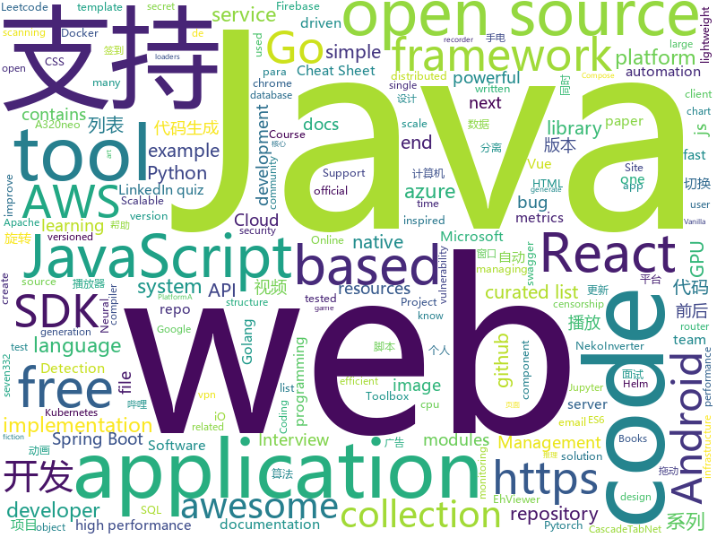

# 2020-12-02
See what the GitHub community is most excited about.

## python
+ [r0capture](https://github.com/r0ysue/r0capture)(**253 stars today**): 安卓应用层抓包通杀脚本
+ [datasets](https://github.com/huggingface/datasets)(**169 stars today**): 🤗Fast, efficient, open-access datasets and evaluation metrics in PyTorch, TensorFlow, NumPy and Pandas
+ [inventory-hunter](https://github.com/EricJMarti/inventory-hunter)(**84 stars today**): ⚡️Get notified as soon as your next CPU, GPU, or game console is in stock
+ [eth2.0-specs](https://github.com/ethereum/eth2.0-specs)(**7 stars today**): Ethereum 2.0 Specifications
+ [azure-cli](https://github.com/Azure/azure-cli)(**3 stars today**): Azure Command-Line Interface
+ [languagepod101-scraper](https://github.com/nedlir/languagepod101-scraper)(**7 stars today**): Python scraper for Language Pods such as Japanesepod101.com👹🗾🍣Compatible with Japanese, Chinese, French, German, Italian, Korean, Portuguese, Russian, Spanish and many more!✨
+ [GitDorker](https://github.com/obheda12/GitDorker)(**24 stars today**): A Python program to scrape secrets from GitHub through usage of a large repository of dorks.
+ [python-telegram-bot](https://github.com/python-telegram-bot/python-telegram-bot)(**167 stars today**): We have made you a wrapper you can't refuse
+ [mmdetection](https://github.com/open-mmlab/mmdetection)(**23 stars today**): OpenMMLab Detection Toolbox and Benchmark
+ [stylized-neural-painting](https://github.com/jiupinjia/stylized-neural-painting)(**23 stars today**): Official Pytorch implementation of the preprint paper "Stylized Neural Painting", in arXiv:2011.08114.
+ [django](https://github.com/django/django)(**37 stars today**): The Web framework for perfectionists with deadlines.
+ [cheat.sh](https://github.com/chubin/cheat.sh)(**50 stars today**): the only cheat sheet you need
+ [docker-stacks](https://github.com/jupyter/docker-stacks)(**7 stars today**): Ready-to-run Docker images containing Jupyter applications
+ [models](https://github.com/tensorflow/models)(**35 stars today**): Models and examples built with TensorFlow
+ [Deformable-DETR](https://github.com/fundamentalvision/Deformable-DETR)(**85 stars today**): Deformable DETR: Deformable Transformers for End-to-End Object Detection.
+ [great_expectations](https://github.com/great-expectations/great_expectations)(**15 stars today**): Always know what to expect from your data.
+ [Awesome-Bugbounty-Writeups](https://github.com/devanshbatham/Awesome-Bugbounty-Writeups)(**18 stars today**): A curated list of bugbounty writeups (Bug type wise) , inspired from https://github.com/ngalongc/bug-bounty-reference
+ [caer](https://github.com/jasmcaus/caer)(**69 stars today**): A lightweight, GPU-accelerated Computer Vision library for high-performance AI research.
+ [vedadet](https://github.com/Media-Smart/vedadet)(**18 stars today**): A single stage object detector toolbox based on PyTorch
+ [jupyterhub](https://github.com/jupyterhub/jupyterhub)(**3 stars today**): Multi-user server for Jupyter notebooks
+ [CascadeTabNet](https://github.com/DevashishPrasad/CascadeTabNet)(**0 stars today**): This repository contains the code and implementation details of the CascadeTabNet paper "CascadeTabNet: An approach for end to end table detection and structure recognition from image-based documents"
+ [black](https://github.com/psf/black)(**12 stars today**): The uncompromising Python code formatter
+ [recommenders](https://github.com/microsoft/recommenders)(**15 stars today**): Best Practices on Recommendation Systems
+ [flair](https://github.com/flairNLP/flair)(**5 stars today**): A very simple framework for state-of-the-art Natural Language Processing (NLP)
+ [tvm](https://github.com/apache/tvm)(**7 stars today**): Open deep learning compiler stack for cpu, gpu and specialized accelerators

## java
+ [soul](https://github.com/dromara/soul)(**99 stars today**): High-Performance Java API Gateway
+ [CS-Notes](https://github.com/CyC2018/CS-Notes)(**167 stars today**): 📚技术面试必备基础知识、Leetcode、计算机操作系统、计算机网络、系统设计、Java、Python、C++
+ [BilibiliTask](https://github.com/srcrs/BilibiliTask)(**33 stars today**): 哔哩哔哩(B站)自动完成每日任务，投币，点赞，直播签到，自动兑换银瓜子为硬币，自动送出即将过期礼物，漫画App签到。
+ [nifi](https://github.com/apache/nifi)(**5 stars today**): Apache NiFi
+ [cassandra](https://github.com/apache/cassandra)(**1 stars today**): Mirror of Apache Cassandra
+ [DeepVision](https://github.com/peng-zhihui/DeepVision)(**17 stars today**): 在我很多项目中用到的CV算法推理框架应用。
+ [GSYVideoPlayer](https://github.com/CarGuo/GSYVideoPlayer)(**17 stars today**): 视频播放器（IJKplayer、ExoPlayer、MediaPlayer），HTTPS，支持弹幕，外挂字幕，支持滤镜、水印、gif截图，片头广告、中间广告，多个同时播放，支持基本的拖动，声音、亮度调节，支持边播边缓存，支持视频自带rotation的旋转（90,270之类），重力旋转与手动旋转的同步支持，支持列表播放 ，列表全屏动画，视频加载速度，列表小窗口支持拖动，动画效果，调整比例，多分辨率切换，支持切换播放器，进度条小窗口预览，列表切换详情页面无缝播放，rtsp、concat、mpeg。
+ [spring-cloud-netflix](https://github.com/spring-cloud/spring-cloud-netflix)(**2 stars today**): Integration with Netflix OSS components
+ [Damn-Vulnerable-Bank](https://github.com/rewanth1997/Damn-Vulnerable-Bank)(**5 stars today**): Vulnerable Banking Application for Android
+ [jeecg-boot](https://github.com/zhangdaiscott/jeecg-boot)(**38 stars today**): 基于代码生成器的低代码平台，超越传统商业平台！前后端分离架构SpringBoot 2.x，SpringCloud，Ant Design&Vue，Mybatis-plus，Shiro，JWT。强大的代码生成器让前后端代码一键生成，无需写任何代码! 引领新低代码开发模式OnlineCoding->代码生成->手工MERGE，帮助Java项目解决70%重复工作，让开发更关注业务，既能快速提高开发效率，帮助公司节省成本，同时又不失灵活性。
+ [azure-sdk-for-java](https://github.com/Azure/azure-sdk-for-java)(**2 stars today**): This repository is for active development of the Azure SDK for Java. For consumers of the SDK we recommend visiting our public developer docs at https://docs.microsoft.com/en-us/java/azure/ or our versioned developer docs at https://azure.github.io/azure-sdk-for-java.
+ [zaproxy](https://github.com/zaproxy/zaproxy)(**2 stars today**): The OWASP ZAP core project
+ [pinpoint](https://github.com/pinpoint-apm/pinpoint)(**9 stars today**): APM, (Application Performance Management) tool for large-scale distributed systems.
+ [AndroidUtilCode](https://github.com/Blankj/AndroidUtilCode)(**10 stars today**): 🔥Android developers should collect the following utils(updating).
+ [jenkins](https://github.com/jenkinsci/jenkins)(**9 stars today**): Jenkins automation server
+ [ghidra](https://github.com/NationalSecurityAgency/ghidra)(**10 stars today**): Ghidra is a software reverse engineering (SRE) framework
+ [White-Jotter](https://github.com/Antabot/White-Jotter)(**5 stars today**): 白卷是一款使用 Vue+Spring Boot 开发的前后端分离项目，附带全套开发教程。（A simple CMS developed by Spring Boot and Vue.js with development tutorials）
+ [spring-boot](https://github.com/spring-projects/spring-boot)(**29 stars today**): Spring Boot
+ [EhViewer](https://github.com/NuclearVGA/EhViewer)(**13 stars today**): 由于原作者 seven332 停止更新 https://github.com/seven332/EhViewer ，第二任作者 NekoInverter 删库跑路，所以接手了 NekoInverter/EhViewer 的最新版本v1.7.16，试着更新一下。
+ [jabref](https://github.com/JabRef/jabref)(**2 stars today**): Graphical Java application for managing BibTeX and biblatex (.bib) databases
+ [android-interview-questions](https://github.com/MindorksOpenSource/android-interview-questions)(**2 stars today**): Your Cheat Sheet For Android Interview - Android Interview Questions
+ [aws-doc-sdk-examples](https://github.com/awsdocs/aws-doc-sdk-examples)(**6 stars today**): Welcome to the AWS Code Examples Repository. This repo contains code examples used in the AWS documentation, AWS SDK Developer Guides, and more. For more information, see the Readme.rst file below.
+ [YCSB](https://github.com/brianfrankcooper/YCSB)(**4 stars today**): Yahoo! Cloud Serving Benchmark
+ [CtCI-6th-Edition](https://github.com/careercup/CtCI-6th-Edition)(**6 stars today**): Cracking the Coding Interview 6th Ed. Solutions
+ [grpc-java](https://github.com/grpc/grpc-java)(**3 stars today**): The Java gRPC implementation. HTTP/2 based RPC

## unknown
+ [Resources-for-Beginner-Bug-Bounty-Hunters](https://github.com/nahamsec/Resources-for-Beginner-Bug-Bounty-Hunters)(**31 stars today**): A list of resources for those interested in getting started in bug bounties
+ [fucking-algorithm](https://github.com/labuladong/fucking-algorithm)(**324 stars today**): 刷算法全靠套路，认准 labuladong 就够了！English version supported! Crack LeetCode, not only how, but also why.
+ [privacy](https://github.com/kallydev/privacy)(**125 stars today**): 个人数据泄漏检测网站，适用于近期流传的 40GB+ 数据。
+ [A-Red-Teamer-diaries](https://github.com/ihebski/A-Red-Teamer-diaries)(**12 stars today**): RedTeam/Pentest notes and experiments tested on several infrastructures related to professional engagements.
+ [Go-000](https://github.com/Go-000/Go-000)(**2 stars today**): 
+ [awesome-NeRF](https://github.com/yenchenlin/awesome-NeRF)(**33 stars today**): A curated list of awesome neural radiance fields papers
+ [vagas](https://github.com/frontendbr/vagas)(**6 stars today**): 🔬Espaço para divulgação de vagas para front-enders.
+ [awesome-osint](https://github.com/jivoi/awesome-osint)(**118 stars today**): 😱A curated list of amazingly awesome OSINT
+ [COVID-19](https://github.com/CSSEGISandData/COVID-19)(**14 stars today**): Novel Coronavirus (COVID-19) Cases, provided by JHU CSSE
+ [gitignore](https://github.com/github/gitignore)(**100 stars today**): A collection of useful .gitignore templates
+ [Anime-Girls-Holding-Programming-Books](https://github.com/laynH/Anime-Girls-Holding-Programming-Books)(**47 stars today**): Anime Girls Holding Programming Books
+ [CSharp-9-CheatSheet](https://github.com/alugili/CSharp-9-CheatSheet)(**29 stars today**): C# 9 Cheat Sheet with code example and pros and cons.
+ [ExoMy](https://github.com/esa-prl/ExoMy)(**13 stars today**): ExoMy - The 3D Printed Rover
+ [xiazai](https://github.com/xiaoshoudian/xiazai)(**23 stars today**): 小手电官方版本下载 小手电 翻墙 代理 科学上网 外网 加速器 梯子 路由 Xiaoshoudian proxy vpn censorship-circumvention censorship gfw accelerator
+ [fromthetransistor](https://github.com/geohot/fromthetransistor)(**6 stars today**): From the Transistor to the Web Browser, a rough outline for a 12 week course
+ [stat_rethinking_2020](https://github.com/rmcelreath/stat_rethinking_2020)(**26 stars today**): Statistical Rethinking Course Winter 2020/2021
+ [kubernetes-the-hard-way](https://github.com/kelseyhightower/kubernetes-the-hard-way)(**10 stars today**): Bootstrap Kubernetes the hard way on Google Cloud Platform. No scripts.
+ [awscon-onepager](https://github.com/zoph-io/awscon-onepager)(**7 stars today**): 📝AWS Conferences One-Pagers
+ [NewGrad-2021](https://github.com/Pitt-CSC/NewGrad-2021)(**6 stars today**): A collection of New Grad full time roles in SWE, Quant, and PM.
+ [app-ideas](https://github.com/florinpop17/app-ideas)(**34 stars today**): A Collection of application ideas which can be used to improve your coding skills.
+ [T-Rex](https://github.com/trexminer/T-Rex)(**3 stars today**): T-Rex NVIDIA GPU miner with web control monitoring page
+ [Blog](https://github.com/mqyqingfeng/Blog)(**27 stars today**): 冴羽写博客的地方，预计写四个系列：JavaScript深入系列、JavaScript专题系列、ES6系列、React系列。
+ [free-programming-books-zh_CN](https://github.com/justjavac/free-programming-books-zh_CN)(**125 stars today**): 📚免费的计算机编程类中文书籍，欢迎投稿
+ [HDMI-PI](https://github.com/peng-zhihui/HDMI-PI)(**257 stars today**): 我设计的一个HDMI转MIPI模块，可以用于驱动各种手机屏幕当显示器用。
+ [JavaFamily](https://github.com/AobingJava/JavaFamily)(**35 stars today**): 【Java面试+Java学习指南】 一份涵盖大部分Java程序员所需要掌握的核心知识。

## javascript
+ [SuperTinyIcons](https://github.com/edent/SuperTinyIcons)(**232 stars today**): Under 1KB each! Super Tiny Icons are miniscule SVG versions of your favourite website and app logos
+ [edex-ui](https://github.com/GitSquared/edex-ui)(**377 stars today**): A cross-platform, customizable science fiction terminal emulator with advanced monitoring & touchscreen support.
+ [bigbluebutton](https://github.com/bigbluebutton/bigbluebutton)(**16 stars today**): Complete open source web conferencing system.
+ [webpack](https://github.com/webpack/webpack)(**19 stars today**): A bundler for javascript and friends. Packs many modules into a few bundled assets. Code Splitting allows for loading parts of the application on demand. Through "loaders", modules can be CommonJs, AMD, ES6 modules, CSS, Images, JSON, Coffeescript, LESS, ... and your custom stuff.
+ [hiring-without-whiteboards](https://github.com/poteto/hiring-without-whiteboards)(**12 stars today**): ⭐️Companies that don't have a broken hiring process
+ [a32nx](https://github.com/flybywiresim/a32nx)(**13 stars today**): The A32NX Project is a community driven open source project to create a free Airbus A320neo in Microsoft Flight Simulator that is as close to reality as possible. It aims to enhance the default A320neo by improving the systems depth and functionality to bring it up to payware-level, all for free.
+ [in-quiz-questions](https://github.com/Ebazhanov/in-quiz-questions)(**11 stars today**): Linkedin quiz assessment, linkedin test, questions and answers (aws-lambda, rest-api, javascript, react, git, html, jquery, mongodb, java, css, python, machine-learning ...) ответы на квиз, LinkedIn quiz lösungen, linkedin quiz las respuestas
+ [plugins](https://github.com/rollup/plugins)(**5 stars today**): 🍣The one-stop shop for official Rollup plugins
+ [awesome-advent-of-code](https://github.com/Bogdanp/awesome-advent-of-code)(**36 stars today**): A collection of awesome resources related to the yearly Advent of Code challenge.
+ [project_e_commerce](https://github.com/adrianhajdin/project_e_commerce)(**19 stars today**): 
+ [hundun](https://github.com/whyour/hundun)(**16 stars today**): 自用脚本与服务 https://t.me/joinchat/O1WgnBbM18YjQQVFQ_D86w
+ [Rocket.Chat](https://github.com/RocketChat/Rocket.Chat)(**22 stars today**): The ultimate Free Open Source Solution for team communications.
+ [awesome-cheatsheets](https://github.com/LeCoupa/awesome-cheatsheets)(**35 stars today**): 👩‍💻👨‍💻Awesome cheatsheets for popular programming languages, frameworks and development tools. They include everything you should know in one single file.
+ [react-native-firebase](https://github.com/invertase/react-native-firebase)(**5 stars today**): 🔥A well-tested feature-rich modular Firebase implementation for React Native. Supports both iOS & Android platforms for all Firebase services.
+ [Luckysheet](https://github.com/mengshukeji/Luckysheet)(**66 stars today**): Luckysheet is an online spreadsheet like excel that is powerful, simple to configure, and completely open source.
+ [nextra](https://github.com/shuding/nextra)(**56 stars today**): The Next Static Site Generator
+ [notebook](https://github.com/jupyter/notebook)(**9 stars today**): Jupyter Interactive Notebook
+ [listen1_chrome_extension](https://github.com/listen1/listen1_chrome_extension)(**41 stars today**): one for all free music in china (chrome extension, also works for firefox)
+ [highlight.js](https://github.com/highlightjs/highlight.js)(**16 stars today**): Javascript syntax highlighter
+ [screenity](https://github.com/alyssaxuu/screenity)(**149 stars today**): The most powerful screen recorder & annotation tool for Chrome🎥
+ [baseweb](https://github.com/uber/baseweb)(**14 stars today**): A React Component library implementing the Base design language
+ [discord.js](https://github.com/discordjs/discord.js)(**9 stars today**): A powerful JavaScript library for interacting with the Discord API
+ [awesome-selfhosted](https://github.com/awesome-selfhosted/awesome-selfhosted)(**48 stars today**): A list of Free Software network services and web applications which can be hosted locally. Selfhosting is the process of hosting and managing applications instead of renting from Software-as-a-Service providers
+ [babel](https://github.com/babel/babel)(**6 stars today**): 🐠Babel is a compiler for writing next generation JavaScript.
+ [kubernetes-external-secrets](https://github.com/external-secrets/kubernetes-external-secrets)(**2 stars today**): Integrate external secret management systems with Kubernetes

## html
+ [raytracing.github.io](https://github.com/RayTracing/raytracing.github.io)(**35 stars today**): Main Web Site (Online Books)
+ [beginner-javascript](https://github.com/wesbos/beginner-javascript)(**16 stars today**): Slam Dunk JavaScript
+ [helm-charts](https://github.com/prometheus-community/helm-charts)(**8 stars today**): Prometheus community Helm charts
+ [msteams-docs](https://github.com/MicrosoftDocs/msteams-docs)(**0 stars today**): Source for the Microsoft Teams developer platform documentation.
+ [swagger-codegen](https://github.com/swagger-api/swagger-codegen)(**5 stars today**): swagger-codegen contains a template-driven engine to generate documentation, API clients and server stubs in different languages by parsing your OpenAPI / Swagger definition.
+ [wpt](https://github.com/web-platform-tests/wpt)(**1 stars today**): Test suites for Web platform specs — including WHATWG, W3C, and others
+ [openwrt-passwall](https://github.com/xiaorouji/openwrt-passwall)(**24 stars today**): 
+ [learning-area](https://github.com/mdn/learning-area)(**6 stars today**): Github repo for the MDN Learning Area.
+ [django-DefectDojo](https://github.com/DefectDojo/django-DefectDojo)(**1 stars today**): DefectDojo is an open-source application vulnerability correlation and security orchestration tool.
+ [html-css](https://github.com/gustavoguanabara/html-css)(**6 stars today**): Curso de HTML5 e CSS3
+ [tagify](https://github.com/yairEO/tagify)(**5 stars today**): 🔖lightweight, efficient Tags input component in Vanilla JS / React / Angular / Vue
+ [awesome-modern-cpp](https://github.com/rigtorp/awesome-modern-cpp)(**33 stars today**): A collection of resources on modern C++
+ [Server](https://github.com/PanDownloadServer/Server)(**70 stars today**): PanDownload的个人维护版本
+ [eks-charts](https://github.com/aws/eks-charts)(**4 stars today**): Amazon EKS Helm chart repository
+ [GML](https://github.com/Muhammad4hmed/GML)(**14 stars today**): 
+ [WebGazer](https://github.com/brownhci/WebGazer)(**1 stars today**): WebGazer.js: Scalable Webcam EyeTracking Using User Interactions
+ [kubespray](https://github.com/kubernetes-sigs/kubespray)(**6 stars today**): Deploy a Production Ready Kubernetes Cluster
+ [element-web](https://github.com/vector-im/element-web)(**10 stars today**): A glossy Matrix collaboration client for the web.
+ [tidytuesday](https://github.com/rfordatascience/tidytuesday)(**4 stars today**): Official repo for the #tidytuesday project
+ [eth2-beaconchain-explorer](https://github.com/gobitfly/eth2-beaconchain-explorer)(**17 stars today**): Open source golang based explorer for the eth2 beacon chain
+ [awesome-compose](https://github.com/docker/awesome-compose)(**8 stars today**): Awesome Docker Compose samples
+ [workshops](https://github.com/ansible/workshops)(**0 stars today**): Training Course for Ansible Automation Platform
+ [responsive-html-email-template](https://github.com/leemunroe/responsive-html-email-template)(**5 stars today**): A free simple responsive HTML email template
+ [charts](https://github.com/Kong/charts)(**0 stars today**): Helm chart for Kong
+ [fastText](https://github.com/facebookresearch/fastText)(**11 stars today**): Library for fast text representation and classification.

## go
+ [prysm](https://github.com/prysmaticlabs/prysm)(**29 stars today**): Go implementation of the Ethereum 2.0 blockchain
+ [drone](https://github.com/drone/drone)(**14 stars today**): Drone is a Container-Native, Continuous Delivery Platform
+ [mapstructure](https://github.com/mitchellh/mapstructure)(**13 stars today**): Go library for decoding generic map values into native Go structures and vice versa.
+ [influxdb](https://github.com/influxdata/influxdb)(**7 stars today**): Scalable datastore for metrics, events, and real-time analytics
+ [go-notify](https://github.com/Harry-027/go-notify)(**21 stars today**): An email automation solution, written in Golang.
+ [fortiscan](https://github.com/anasbousselham/fortiscan)(**16 stars today**): A high performance FortiGate SSL-VPN vulnerability scanning and exploitation tool.
+ [photoprism](https://github.com/photoprism/photoprism)(**37 stars today**): Personal Photo Management powered by Go and Google TensorFlow
+ [chi](https://github.com/go-chi/chi)(**4 stars today**): lightweight, idiomatic and composable router for building Go HTTP services
+ [fiber](https://github.com/gofiber/fiber)(**62 stars today**): ⚡️Express inspired web framework written in Go
+ [pbgopy](https://github.com/nakabonne/pbgopy)(**121 stars today**): Copy and paste between devices
+ [nuclei](https://github.com/projectdiscovery/nuclei)(**16 stars today**): Nuclei is a fast tool for configurable targeted scanning based on templates offering massive extensibility and ease of use.
+ [telegraf](https://github.com/influxdata/telegraf)(**6 stars today**): The plugin-driven server agent for collecting & reporting metrics.
+ [cert-manager](https://github.com/jetstack/cert-manager)(**6 stars today**): Automatically provision and manage TLS certificates in Kubernetes
+ [k3s](https://github.com/k3s-io/k3s)(**15 stars today**): Lightweight Kubernetes
+ [azure-sdk-for-go](https://github.com/Azure/azure-sdk-for-go)(**1 stars today**): Microsoft Azure SDK for Go
+ [cockroach](https://github.com/cockroachdb/cockroach)(**6 stars today**): CockroachDB - the open source, cloud-native distributed SQL database.
+ [httprouter](https://github.com/julienschmidt/httprouter)(**6 stars today**): A high performance HTTP request router that scales well
+ [terraform](https://github.com/hashicorp/terraform)(**22 stars today**): Terraform enables you to safely and predictably create, change, and improve infrastructure. It is an open source tool that codifies APIs into declarative configuration files that can be shared amongst team members, treated as code, edited, reviewed, and versioned.
+ [aws-sdk-go](https://github.com/aws/aws-sdk-go)(**8 stars today**): AWS SDK for the Go programming language.
+ [squirrel](https://github.com/Masterminds/squirrel)(**14 stars today**): Fluent SQL generation for golang
+ [awesome-go](https://github.com/avelino/awesome-go)(**37 stars today**): A curated list of awesome Go frameworks, libraries and software
+ [mattermost-server](https://github.com/mattermost/mattermost-server)(**17 stars today**): Open source Slack-alternative in Golang and React - Mattermost
+ [uuid](https://github.com/google/uuid)(**7 stars today**): Go package for UUIDs based on RFC 4122 and DCE 1.1: Authentication and Security Services.
+ [testify](https://github.com/stretchr/testify)(**12 stars today**): A toolkit with common assertions and mocks that plays nicely with the standard library
+ [vitess](https://github.com/vitessio/vitess)(**20 stars today**): Vitess is a database clustering system for horizontal scaling of MySQL.

## WordCloud

