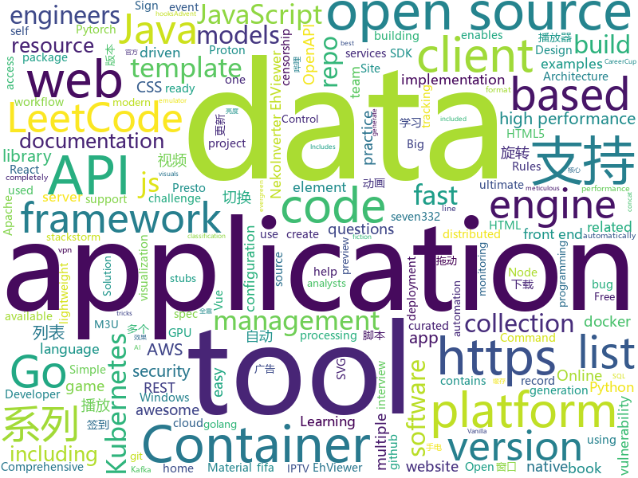

# 2020-12-03
See what the GitHub community is most excited about.

## python
+ [pulse](https://github.com/adamian98/pulse)(**175 stars today**): PULSE: Self-Supervised Photo Upsampling via Latent Space Exploration of Generative Models
+ [r0capture](https://github.com/r0ysue/r0capture)(**289 stars today**): 安卓应用层抓包通杀脚本
+ [Python](https://github.com/geekcomputers/Python)(**51 stars today**): My Python Examples
+ [datasets](https://github.com/huggingface/datasets)(**149 stars today**): 🤗Fast, efficient, open-access datasets and evaluation metrics in PyTorch, TensorFlow, NumPy and Pandas
+ [dvc](https://github.com/iterative/dvc)(**5 stars today**): 🦉Data Version Control | Git for Data & Models
+ [jupyterhub](https://github.com/jupyterhub/jupyterhub)(**8 stars today**): Multi-user server for Jupyter notebooks
+ [xmly_speed](https://github.com/Zero-S1/xmly_speed)(**5 stars today**): xmly_speed
+ [fastapi](https://github.com/tiangolo/fastapi)(**42 stars today**): FastAPI framework, high performance, easy to learn, fast to code, ready for production
+ [st2](https://github.com/StackStorm/st2)(**2 stars today**): StackStorm (aka "IFTTT for Ops") is event-driven automation for auto-remediation, security responses, troubleshooting, deployments, and more. Includes rules engine, workflow, 160 integration packs with 6000+ actions (see https://exchange.stackstorm.org) and ChatOps. Installer at https://docs.stackstorm.com/install/index.html. Questions? https://…
+ [PaddleHub](https://github.com/PaddlePaddle/PaddleHub)(**380 stars today**): Awesome pre-trained models toolkit based on PaddlePaddle.（180+ models including CV, NLP, Audio and Video with Easy Inference & Serving deployment)
+ [hypnotix](https://github.com/linuxmint/hypnotix)(**38 stars today**): An M3U IPTV Player
+ [Udemy-Course-Grabber](https://github.com/techtanic/Udemy-Course-Grabber)(**20 stars today**): 
+ [azure-cli](https://github.com/Azure/azure-cli)(**10 stars today**): Azure Command-Line Interface
+ [Paddle](https://github.com/PaddlePaddle/Paddle)(**30 stars today**): PArallel Distributed Deep LEarning: Machine Learning Framework from Industrial Practice （『飞桨』核心框架，深度学习&机器学习高性能单机、分布式训练和跨平台部署）
+ [detection-rules](https://github.com/elastic/detection-rules)(**5 stars today**): Rules for Elastic Security's detection engine
+ [eth2.0-specs](https://github.com/ethereum/eth2.0-specs)(**87 stars today**): Ethereum 2.0 Specifications
+ [fairgame](https://github.com/Hari-Nagarajan/fairgame)(**27 stars today**): Tool to help us buy a GPU in 2020
+ [spack](https://github.com/spack/spack)(**1 stars today**): A flexible package manager that supports multiple versions, configurations, platforms, and compilers.
+ [dbt](https://github.com/fishtown-analytics/dbt)(**3 stars today**): dbt (data build tool) enables data analysts and engineers to transform their data using the same practices that software engineers use to build applications.
+ [caer](https://github.com/jasmcaus/caer)(**17 stars today**): A lightweight, GPU-accelerated Computer Vision library for high-performance AI research.
+ [restler-fuzzer](https://github.com/microsoft/restler-fuzzer)(**7 stars today**): RESTler is the first stateful REST API fuzzing tool for automatically testing cloud services through their REST APIs and finding security and reliability bugs in these services.
+ [core](https://github.com/home-assistant/core)(**30 stars today**): 🏡Open source home automation that puts local control and privacy first
+ [alphafold2](https://github.com/lucidrains/alphafold2)(**14 stars today**): To eventually become a Pytorch implementation of Alphafold2, as details of the architecture get released
+ [prefect](https://github.com/PrefectHQ/prefect)(**7 stars today**): The easiest way to automate your data
+ [black](https://github.com/psf/black)(**22 stars today**): The uncompromising Python code formatter

## java
+ [Mindustry](https://github.com/Anuken/Mindustry)(**80 stars today**): A sandbox tower defense game
+ [soul](https://github.com/dromara/soul)(**104 stars today**): High-Performance Java API Gateway
+ [presto](https://github.com/prestosql/presto)(**3 stars today**): Home of the community managed version of Presto, the distributed SQL query engine for big data, under the auspices of the Presto Software Foundation.
+ [openapi-generator](https://github.com/OpenAPITools/openapi-generator)(**13 stars today**): OpenAPI Generator allows generation of API client libraries (SDK generation), server stubs, documentation and configuration automatically given an OpenAPI Spec (v2, v3)
+ [GSYVideoPlayer](https://github.com/CarGuo/GSYVideoPlayer)(**18 stars today**): 视频播放器（IJKplayer、ExoPlayer、MediaPlayer），HTTPS，支持弹幕，外挂字幕，支持滤镜、水印、gif截图，片头广告、中间广告，多个同时播放，支持基本的拖动，声音、亮度调节，支持边播边缓存，支持视频自带rotation的旋转（90,270之类），重力旋转与手动旋转的同步支持，支持列表播放 ，列表全屏动画，视频加载速度，列表小窗口支持拖动，动画效果，调整比例，多分辨率切换，支持切换播放器，进度条小窗口预览，列表切换详情页面无缝播放，rtsp、concat、mpeg。
+ [CS-Notes](https://github.com/CyC2018/CS-Notes)(**218 stars today**): 📚技术面试必备基础知识、Leetcode、计算机操作系统、计算机网络、系统设计、Java、Python、C++
+ [BilibiliTask](https://github.com/srcrs/BilibiliTask)(**46 stars today**): 哔哩哔哩(B站)自动完成每日任务，投币，点赞，直播签到，自动兑换银瓜子为硬币，自动送出即将过期礼物，漫画App签到。
+ [LuckysheetServer](https://github.com/mengshukeji/LuckysheetServer)(**35 stars today**): Luckysheet java backend
+ [skywalking](https://github.com/apache/skywalking)(**14 stars today**): APM, Application Performance Monitoring System
+ [EhViewer](https://github.com/NuclearVGA/EhViewer)(**13 stars today**): 在 seven332/EhViewer (停止更新) 和 NekoInverter/EhViewer ( 删库跑路 ) 的基础上试着更新一下。。。。。。An Unofficial E-Hentai Application for Android based on https://github.com/seven332/EhViewer [Deprecated] and NekoInverter/EhViewer-1.7.16 [Deleted] ( https://github.com/NuclearVGA/NekoInverter-EhViewer-1.7.16 is its fork ).
+ [hudi](https://github.com/apache/hudi)(**3 stars today**): Upserts, Deletes And Incremental Processing on Big Data.
+ [kafka](https://github.com/apache/kafka)(**18 stars today**): Mirror of Apache Kafka
+ [quartz](https://github.com/quartz-scheduler/quartz)(**3 stars today**): Code for Quartz Scheduler
+ [hadoop](https://github.com/apache/hadoop)(**4 stars today**): Apache Hadoop
+ [aws-lambda-developer-guide](https://github.com/awsdocs/aws-lambda-developer-guide)(**2 stars today**): The AWS Lambda Developer Guide
+ [druid](https://github.com/apache/druid)(**8 stars today**): Apache Druid: a high performance real-time analytics database.
+ [jib](https://github.com/GoogleContainerTools/jib)(**6 stars today**): 🏗Build container images for your Java applications.
+ [cas](https://github.com/apereo/cas)(**6 stars today**): Apereo CAS - Enterprise Single Sign On for all earthlings and beyond.
+ [wildfly](https://github.com/wildfly/wildfly)(**0 stars today**): WildFly Application Server
+ [SDE-Interview-Questions](https://github.com/twowaits/SDE-Interview-Questions)(**8 stars today**): Most comprehensive list📋of tech interview questions📘of companies scraped from Geeksforgeeks, CareerCup and Glassdoor.
+ [kafdrop](https://github.com/obsidiandynamics/kafdrop)(**11 stars today**): Kafka Web UI
+ [keycloak](https://github.com/keycloak/keycloak)(**14 stars today**): Open Source Identity and Access Management For Modern Applications and Services
+ [JFoenix](https://github.com/jfoenixadmin/JFoenix)(**12 stars today**): JavaFX Material Design Library
+ [lombok](https://github.com/rzwitserloot/lombok)(**8 stars today**): Very spicy additions to the Java programming language.
+ [thingsboard](https://github.com/thingsboard/thingsboard)(**7 stars today**): Open-source IoT Platform - Device management, data collection, processing and visualization.

## unknown
+ [Go-000](https://github.com/Go-000/Go-000)(**5 stars today**): 
+ [Resources-for-Beginner-Bug-Bounty-Hunters](https://github.com/nahamsec/Resources-for-Beginner-Bug-Bounty-Hunters)(**120 stars today**): A list of resources for those interested in getting started in bug bounties
+ [aws-proton-sample-templates](https://github.com/aws-samples/aws-proton-sample-templates)(**17 stars today**): Sample templates for AWS Proton, available in preview
+ [fucking-algorithm](https://github.com/labuladong/fucking-algorithm)(**293 stars today**): 刷算法全靠套路，认准 labuladong 就够了！English version supported! Crack LeetCode, not only how, but also why.
+ [Front-End-Checklist](https://github.com/thedaviddias/Front-End-Checklist)(**187 stars today**): 🗂The perfect Front-End Checklist for modern websites and meticulous developers
+ [gitignore](https://github.com/github/gitignore)(**63 stars today**): A collection of useful .gitignore templates
+ [awesome-mlops](https://github.com/visenger/awesome-mlops)(**17 stars today**): A curated list of references for MLOps
+ [you-dont-know-js-ru](https://github.com/azat-io/you-dont-know-js-ru)(**8 stars today**): 📚Russian translation of "You Don't Know JS" book series
+ [aws-proton-public-roadmap](https://github.com/aws/aws-proton-public-roadmap)(**28 stars today**): This is the public roadmap for AWS Proton, available in preview
+ [evergreen-skills-developers](https://github.com/romenrg/evergreen-skills-developers)(**79 stars today**): List of evergreen skills that should serve as a fair assessment of software developers / engineers; as opposed to framework trends
+ [online-opsec](https://github.com/devbret/online-opsec)(**14 stars today**): Threat models and tools for staying safe, private and informed while Online, used by the average person.
+ [You-Dont-Know-JS](https://github.com/getify/You-Dont-Know-JS)(**125 stars today**): A book series on JavaScript. @YDKJS on twitter.
+ [xiazai](https://github.com/xiaoshoudian/xiazai)(**22 stars today**): 小手电官方版本下载 小手电 翻墙 代理 科学上网 外网 加速器 梯子 路由 Xiaoshoudian proxy vpn censorship-circumvention censorship gfw accelerator
+ [Countries](https://github.com/Free-IPTV/Countries)(**30 stars today**): Free legally receivable IPTV channels as .m3u for Kodi. :-)
+ [books](https://github.com/programthink/books)(**18 stars today**): 【编程随想】收藏的电子书清单（多个学科，含下载链接）
+ [Blog](https://github.com/mqyqingfeng/Blog)(**27 stars today**): 冴羽写博客的地方，预计写四个系列：JavaScript深入系列、JavaScript专题系列、ES6系列、React系列。
+ [architecture_decision_record](https://github.com/joelparkerhenderson/architecture_decision_record)(**6 stars today**): Architecture decision record (ADR) examples for software planning, IT leadership, and template documentation
+ [Windows-classic-samples](https://github.com/microsoft/Windows-classic-samples)(**6 stars today**): This repo contains samples that demonstrate the API used in Windows classic desktop applications.
+ [Vape](https://github.com/VenTaz/Vape)(**2 stars today**): Study on hooks
+ [coding_challenge-33](https://github.com/zero-to-mastery/coding_challenge-33)(**1 stars today**): Advent of Code 2020
+ [COVID-19](https://github.com/pcm-dpc/COVID-19)(**3 stars today**): COVID-19 Italia - Monitoraggio situazione
+ [TrackerIssues](https://github.com/polyend/TrackerIssues)(**1 stars today**): Firmware and issues
+ [hello-world](https://github.com/bigdongdongCLUB/hello-world)(**5 stars today**): 
+ [awesome-fastapi](https://github.com/mjhea0/awesome-fastapi)(**11 stars today**): A curated list of awesome things related to FastAPI
+ [rust-by-example](https://github.com/rust-lang/rust-by-example)(**3 stars today**): Learn Rust with examples (Live code editor included)

## javascript
+ [SuperTinyIcons](https://github.com/edent/SuperTinyIcons)(**455 stars today**): Under 1KB each! Super Tiny Icons are miniscule SVG versions of your favourite website and app logos
+ [awesome-advent-of-code](https://github.com/Bogdanp/awesome-advent-of-code)(**30 stars today**): A collection of awesome resources related to the yearly Advent of Code challenge.
+ [leetcode](https://github.com/azl397985856/leetcode)(**42 stars today**): LeetCode Solutions: A Record of My Problem Solving Journey.( leetcode题解，记录自己的leetcode解题之路。)
+ [vue-select](https://github.com/sagalbot/vue-select)(**4 stars today**): Everything you wish the HTML <select> element could do, wrapped up into a lightweight, extensible Vue component.
+ [html5-boilerplate](https://github.com/h5bp/html5-boilerplate)(**70 stars today**): A professional front-end template for building fast, robust, and adaptable web apps or sites.
+ [Fifa21-AutoBuyer](https://github.com/chithakumar13/Fifa21-AutoBuyer)(**4 stars today**): Fifa 21 AutoBuyer / Snipping Bot for fifa 21 ultimate team web app
+ [javascript](https://github.com/airbnb/javascript)(**101 stars today**): JavaScript Style Guide
+ [edex-ui](https://github.com/GitSquared/edex-ui)(**310 stars today**): A cross-platform, customizable science fiction terminal emulator with advanced monitoring & touchscreen support.
+ [realworld](https://github.com/gothinkster/realworld)(**168 stars today**): "The mother of all demo apps" — Exemplary fullstack Medium.com clone powered by React, Angular, Node, Django, and many more🏅
+ [nodebestpractices](https://github.com/goldbergyoni/nodebestpractices)(**122 stars today**): ✅The Node.js best practices list (December 2020)
+ [procedural-gl-js](https://github.com/felixpalmer/procedural-gl-js)(**39 stars today**): 3D mapping engine for the web
+ [shaka-player](https://github.com/google/shaka-player)(**7 stars today**): JavaScript player library / DASH & HLS client / MSE-EME player
+ [Luckysheet](https://github.com/mengshukeji/Luckysheet)(**126 stars today**): Luckysheet is an online spreadsheet like excel that is powerful, simple to configure, and completely open source.
+ [cube.js](https://github.com/cube-js/cube.js)(**8 stars today**): 📊Cube.js — Open-Source Analytical API Platform
+ [Chart.js](https://github.com/chartjs/Chart.js)(**22 stars today**): Simple HTML5 Charts using the <canvas> tag
+ [monaco-editor](https://github.com/microsoft/monaco-editor)(**17 stars today**): A browser based code editor
+ [engine](https://github.com/cocos-creator/engine)(**1 stars today**): Cocos Creator is a complete package of game development tools and workflow, including a game engine, resource management, scene editing, game preview, debug and publish one project to multiple platforms.
+ [Rocket.Chat](https://github.com/RocketChat/Rocket.Chat)(**22 stars today**): The ultimate Free Open Source Solution for team communications.
+ [insomnia](https://github.com/Kong/insomnia)(**10 stars today**): The Open Source API Client and Design Platform for GraphQL, REST and gRPC
+ [Weather-Cal](https://github.com/mzeryck/Weather-Cal)(**7 stars today**): This is a Scriptable widget that lets you display, position, and format multiple elements, including dates and events, weather information, battery level, and more. You can even create your own elements.
+ [jd_scripts](https://github.com/lxk0301/jd_scripts)(**23 stars today**): 京东薅羊毛脚本 TG群组：https://t.me/JD_fruit_pet
+ [vue](https://github.com/vuejs/vue)(**78 stars today**): 🖖Vue.js is a progressive, incrementally-adoptable JavaScript framework for building UI on the web.
+ [listen1_chrome_extension](https://github.com/listen1/listen1_chrome_extension)(**16 stars today**): one for all free music in china (chrome extension, also works for firefox)
+ [jsoneditor](https://github.com/josdejong/jsoneditor)(**10 stars today**): A web-based tool to view, edit, format, and validate JSON
+ [portainer](https://github.com/portainer/portainer)(**11 stars today**): Making Docker and Kubernetes management easy.

## html
+ [raytracing.github.io](https://github.com/RayTracing/raytracing.github.io)(**216 stars today**): Main Web Site (Online Books)
+ [Server](https://github.com/PanDownloadServer/Server)(**75 stars today**): PanDownload的个人维护版本
+ [GML](https://github.com/Muhammad4hmed/GML)(**2 stars today**): 
+ [html-css](https://github.com/gustavoguanabara/html-css)(**10 stars today**): Curso de HTML5 e CSS3
+ [charts](https://github.com/bitnami/charts)(**5 stars today**): Helm Charts
+ [eth2-beaconchain-explorer](https://github.com/gobitfly/eth2-beaconchain-explorer)(**5 stars today**): Open source golang based explorer for the eth2 beacon chain
+ [element-web](https://github.com/vector-im/element-web)(**3 stars today**): A glossy Matrix collaboration client for the web.
+ [charts](https://github.com/airflow-helm/charts)(**2 stars today**): the home of the stable/airflow Helm chart
+ [beginner-javascript](https://github.com/wesbos/beginner-javascript)(**16 stars today**): Slam Dunk JavaScript
+ [amundsen](https://github.com/amundsen-io/amundsen)(**7 stars today**): Amundsen is a metadata driven application for improving the productivity of data analysts, data scientists and engineers when interacting with data.
+ [django-DefectDojo](https://github.com/DefectDojo/django-DefectDojo)(**8 stars today**): DefectDojo is an open-source application vulnerability correlation and security orchestration tool.
+ [coding-fonts](https://github.com/chriscoyier/coding-fonts)(**15 stars today**): https://coding-fonts.css-tricks.com/
+ [kubespray](https://github.com/kubernetes-sigs/kubespray)(**6 stars today**): Deploy a Production Ready Kubernetes Cluster
+ [html](https://github.com/whatwg/html)(**5 stars today**): HTML Standard
+ [fastText](https://github.com/facebookresearch/fastText)(**6 stars today**): Library for fast text representation and classification.
+ [JavaScript30](https://github.com/wesbos/JavaScript30)(**13 stars today**): 30 Day Vanilla JS Challenge
+ [flag-icon-css](https://github.com/lipis/flag-icon-css)(**8 stars today**): 🎏A collection of all country flags in SVG — plus the CSS for easier integration
+ [learning-area](https://github.com/mdn/learning-area)(**2 stars today**): Github repo for the MDN Learning Area.
+ [PowerBI-visuals](https://github.com/microsoft/PowerBI-visuals)(**1 stars today**): Documentation for creating visuals for Power BI
+ [learning-library](https://github.com/oracle/learning-library)(**0 stars today**): Learning Material for Oracle Technologies
+ [wpt](https://github.com/web-platform-tests/wpt)(**2 stars today**): Test suites for Web platform specs — including WHATWG, W3C, and others
+ [swagger-codegen](https://github.com/swagger-api/swagger-codegen)(**5 stars today**): swagger-codegen contains a template-driven engine to generate documentation, API clients and server stubs in different languages by parsing your OpenAPI / Swagger definition.
+ [Landing-Page](https://github.com/tailwindtoolbox/Landing-Page)(**2 stars today**): Tailwind CSS Starter Template - Landing Page
+ [Front-end-Developer-Interview-Questions](https://github.com/h5bp/Front-end-Developer-Interview-Questions)(**13 stars today**): A list of helpful front-end related questions you can use to interview potential candidates, test yourself or completely ignore.
+ [website](https://github.com/kubernetes/website)(**5 stars today**): Kubernetes website and documentation repo:

## go
+ [prysm](https://github.com/prysmaticlabs/prysm)(**211 stars today**): Go implementation of the Ethereum 2.0 blockchain
+ [kubernetes](https://github.com/kubernetes/kubernetes)(**71 stars today**): Production-Grade Container Scheduling and Management
+ [gitea](https://github.com/go-gitea/gitea)(**30 stars today**): Git with a cup of tea, painless self-hosted git service
+ [sarama](https://github.com/Shopify/sarama)(**9 stars today**): Sarama is a Go library for Apache Kafka 0.8, and up.
+ [elastic](https://github.com/olivere/elastic)(**4 stars today**): Elasticsearch client for Go.
+ [harbor](https://github.com/goharbor/harbor)(**18 stars today**): An open source trusted cloud native registry project that stores, signs, and scans content.
+ [terraform-provider-azurerm](https://github.com/terraform-providers/terraform-provider-azurerm)(**2 stars today**): Terraform provider for Azure Resource Manager
+ [mapstructure](https://github.com/mitchellh/mapstructure)(**15 stars today**): Go library for decoding generic map values into native Go structures and vice versa.
+ [esbuild](https://github.com/evanw/esbuild)(**43 stars today**): An extremely fast JavaScript bundler and minifier
+ [clair](https://github.com/quay/clair)(**3 stars today**): Vulnerability Static Analysis for Containers
+ [terraform](https://github.com/hashicorp/terraform)(**22 stars today**): Terraform enables you to safely and predictably create, change, and improve infrastructure. It is an open source tool that codifies APIs into declarative configuration files that can be shared amongst team members, treated as code, edited, reviewed, and versioned.
+ [cri-o](https://github.com/cri-o/cri-o)(**44 stars today**): Open Container Initiative-based implementation of Kubernetes Container Runtime Interface
+ [terraform-provider-aws](https://github.com/hashicorp/terraform-provider-aws)(**4 stars today**): Terraform AWS provider
+ [amazon-ecr-credential-helper](https://github.com/awslabs/amazon-ecr-credential-helper)(**4 stars today**): Automatically gets credentials for Amazon ECR on docker push/docker pull
+ [enhancements](https://github.com/kubernetes/enhancements)(**5 stars today**): Enhancements tracking repo for Kubernetes
+ [fortiscan](https://github.com/anasbousselham/fortiscan)(**10 stars today**): A high performance FortiGate SSL-VPN vulnerability scanning and exploitation tool.
+ [go-admin](https://github.com/GoAdminGroup/go-admin)(**7 stars today**): A golang framework helps gopher to build a data visualization and admin panel in ten minutes
+ [trivy](https://github.com/aquasecurity/trivy)(**16 stars today**): A Simple and Comprehensive Vulnerability Scanner for Containers, Suitable for CI
+ [WindowsSpyBlocker](https://github.com/crazy-max/WindowsSpyBlocker)(**4 stars today**): Block spying and tracking on Windows
+ [fzf](https://github.com/junegunn/fzf)(**48 stars today**): 🌸A command-line fuzzy finder
+ [aws-sdk-go](https://github.com/aws/aws-sdk-go)(**3 stars today**): AWS SDK for the Go programming language.
+ [client-go](https://github.com/kubernetes/client-go)(**4 stars today**): Go client for Kubernetes.
+ [podman](https://github.com/containers/podman)(**36 stars today**): Podman: A tool for managing OCI containers and pods
+ [rancher](https://github.com/rancher/rancher)(**12 stars today**): Complete container management platform
+ [drone](https://github.com/drone/drone)(**18 stars today**): Drone is a Container-Native, Continuous Delivery Platform

## WordCloud

