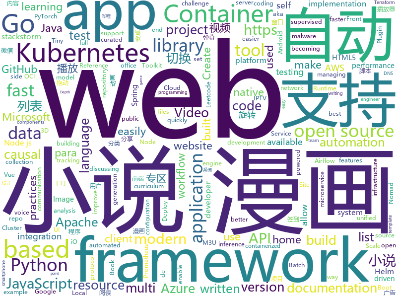

# 2020-12-04
See what the GitHub community is most excited about.

## python
+ [pulse](https://github.com/adamian98/pulse)(**205 stars today**): PULSE: Self-Supervised Photo Upsampling via Latent Space Exploration of Generative Models
+ [Udemy-Course-Grabber](https://github.com/techtanic/Udemy-Course-Grabber)(**19 stars today**): 
+ [lightly](https://github.com/lightly-ai/lightly)(**29 stars today**): A python library for self-supervised learning.
+ [core](https://github.com/home-assistant/core)(**30 stars today**): 🏡Open source home automation that puts local control and privacy first
+ [Python](https://github.com/geekcomputers/Python)(**68 stars today**): My Python Examples
+ [models](https://github.com/tensorflow/models)(**29 stars today**): Models and examples built with TensorFlow
+ [theZoo](https://github.com/ytisf/theZoo)(**16 stars today**): A repository of LIVE malwares for your own joy and pleasure. theZoo is a project created to make the possibility of malware analysis open and available to the public.
+ [Invisible-Cloak-or-Adrishya-Choga](https://github.com/Devashi-Choudhary/Invisible-Cloak-or-Adrishya-Choga)(**8 stars today**): 
+ [DAIN](https://github.com/baowenbo/DAIN)(**78 stars today**): Depth-Aware Video Frame Interpolation (CVPR 2019)
+ [advent-of-code-2020](https://github.com/arknave/advent-of-code-2020)(**8 stars today**): 
+ [airflow](https://github.com/apache/airflow)(**12 stars today**): Apache Airflow - A platform to programmatically author, schedule, and monitor workflows
+ [rasa](https://github.com/RasaHQ/rasa)(**4 stars today**): 💬Open source machine learning framework to automate text- and voice-based conversations: NLU, dialogue management, connect to Slack, Facebook, and more - Create chatbots and voice assistants
+ [dash](https://github.com/plotly/dash)(**4 stars today**): Analytical Web Apps for Python, R, Julia, and Jupyter. No JavaScript Required.
+ [r0capture](https://github.com/r0ysue/r0capture)(**156 stars today**): 安卓应用层抓包通杀脚本
+ [readthedocs.org](https://github.com/readthedocs/readthedocs.org)(**7 stars today**): The source code that powers readthedocs.org
+ [horovod](https://github.com/horovod/horovod)(**10 stars today**): Distributed training framework for TensorFlow, Keras, PyTorch, and Apache MXNet.
+ [playwright-python](https://github.com/microsoft/playwright-python)(**137 stars today**): Python version of the Playwright testing and automation library.
+ [TinyCheck](https://github.com/KasperskyLab/TinyCheck)(**451 stars today**): TinyCheck allows you to easily capture network communications from a smartphone or any device which can be associated to a Wi-Fi access point in order to quickly analyze them. This can be used to check if any suspect or malicious communication is outgoing from a smartphone, by using heuristics or specific Indicators of Compromise (IoCs). In orde…
+ [st2](https://github.com/StackStorm/st2)(**6 stars today**): StackStorm (aka "IFTTT for Ops") is event-driven automation for auto-remediation, security responses, troubleshooting, deployments, and more. Includes rules engine, workflow, 160 integration packs with 6000+ actions (see https://exchange.stackstorm.org) and ChatOps. Installer at https://docs.stackstorm.com/install/index.html. Questions? https://…
+ [writehat](https://github.com/blacklanternsecurity/writehat)(**36 stars today**): A pentest reporting tool written in Python. Free yourself from Microsoft Word.
+ [yolov5](https://github.com/ultralytics/yolov5)(**31 stars today**): YOLOv5 in PyTorch > ONNX > CoreML > TFLite
+ [vmaf](https://github.com/Netflix/vmaf)(**3 stars today**): Perceptual video quality assessment based on multi-method fusion.
+ [MONAI](https://github.com/Project-MONAI/MONAI)(**2 stars today**): AI Toolkit for Healthcare Imaging
+ [hypnotix](https://github.com/linuxmint/hypnotix)(**34 stars today**): An M3U IPTV Player
+ [dowhy](https://github.com/microsoft/dowhy)(**18 stars today**): DoWhy is a Python library for causal inference that supports explicit modeling and testing of causal assumptions. DoWhy is based on a unified language for causal inference, combining causal graphical models and potential outcomes frameworks.

## java
+ [micronaut-core](https://github.com/micronaut-projects/micronaut-core)(**13 stars today**): Micronaut Application Framework
+ [Mindustry](https://github.com/Anuken/Mindustry)(**213 stars today**): A sandbox tower defense game
+ [react-native-push-notification](https://github.com/zo0r/react-native-push-notification)(**8 stars today**): React Native Local and Remote Notifications
+ [presto](https://github.com/prestodb/presto)(**9 stars today**): The official home of the Presto distributed SQL query engine for big data
+ [camel](https://github.com/apache/camel)(**2 stars today**): Apache Camel is an open source integration framework that empowers you to quickly and easily integrate various systems consuming or producing data.
+ [nifi](https://github.com/apache/nifi)(**5 stars today**): Apache NiFi
+ [spring-cloud-gateway](https://github.com/spring-cloud/spring-cloud-gateway)(**3 stars today**): A Gateway built on Spring Framework 5.x and Spring Boot 2.x providing routing and more.
+ [hazelcast](https://github.com/hazelcast/hazelcast)(**7 stars today**): Open Source In-Memory Data Grid
+ [GSYVideoPlayer](https://github.com/CarGuo/GSYVideoPlayer)(**21 stars today**): 视频播放器（IJKplayer、ExoPlayer、MediaPlayer），HTTPS，支持弹幕，外挂字幕，支持滤镜、水印、gif截图，片头广告、中间广告，多个同时播放，支持基本的拖动，声音、亮度调节，支持边播边缓存，支持视频自带rotation的旋转（90,270之类），重力旋转与手动旋转的同步支持，支持列表播放 ，列表全屏动画，视频加载速度，列表小窗口支持拖动，动画效果，调整比例，多分辨率切换，支持切换播放器，进度条小窗口预览，列表切换详情页面无缝播放，rtsp、concat、mpeg。
+ [litemall](https://github.com/linlinjava/litemall)(**17 stars today**): 又一个小商城。litemall = Spring Boot后端 + Vue管理员前端 + 微信小程序用户前端 + Vue用户移动端
+ [fiction_house](https://github.com/201206030/fiction_house)(**42 stars today**): 小说精品屋是一个多平台（web、安卓app、微信小程序）、功能完善的屏幕自适应小说漫画连载系统，包含精品小说专区、轻小说专区和漫画专区。包括小说/漫画分类、小说/漫画搜索、小说/漫画排行、完本小说/漫画、小说/漫画评分、小说/漫画在线阅读、小说/漫画书架、小说/漫画阅读记录、小说下载、小说弹幕、小说/漫画自动采集/更新/纠错、小说内容自动分享到微博、邮件自动推广、链接自动推送到百度搜索引擎等功能。
+ [CS-Notes](https://github.com/CyC2018/CS-Notes)(**119 stars today**): 📚技术面试必备基础知识、Leetcode、计算机操作系统、计算机网络、系统设计、Java、Python、C++
+ [lucene-solr](https://github.com/apache/lucene-solr)(**3 stars today**): Apache Lucene and Solr open-source search software
+ [firebase-android-sdk](https://github.com/firebase/firebase-android-sdk)(**0 stars today**): Firebase Android SDK
+ [openapi-generator](https://github.com/OpenAPITools/openapi-generator)(**18 stars today**): OpenAPI Generator allows generation of API client libraries (SDK generation), server stubs, documentation and configuration automatically given an OpenAPI Spec (v2, v3)
+ [libgdx](https://github.com/libgdx/libgdx)(**6 stars today**): Desktop/Android/HTML5/iOS Java game development framework
+ [Java](https://github.com/TheAlgorithms/Java)(**21 stars today**): All Algorithms implemented in Java
+ [cordova-plugin-inappbrowser](https://github.com/apache/cordova-plugin-inappbrowser)(**0 stars today**): Apache Cordova Plugin inappbrowser
+ [material-components-android](https://github.com/material-components/material-components-android)(**9 stars today**): Modular and customizable Material Design UI components for Android
+ [beam](https://github.com/apache/beam)(**7 stars today**): Apache Beam is a unified programming model for Batch and Streaming
+ [bazel](https://github.com/bazelbuild/bazel)(**10 stars today**): a fast, scalable, multi-language and extensible build system
+ [BilibiliTask](https://github.com/srcrs/BilibiliTask)(**29 stars today**): 哔哩哔哩(B站)自动完成每日任务，投币，点赞，直播签到，自动兑换银瓜子为硬币，自动送出即将过期礼物，漫画App签到。
+ [aws-lambda-developer-guide](https://github.com/awsdocs/aws-lambda-developer-guide)(**5 stars today**): The AWS Lambda Developer Guide
+ [jib](https://github.com/GoogleContainerTools/jib)(**7 stars today**): 🏗Build container images for your Java applications.
+ [YCSB](https://github.com/brianfrankcooper/YCSB)(**3 stars today**): Yahoo! Cloud Serving Benchmark

## unknown
+ [aws-proton-sample-templates](https://github.com/aws-samples/aws-proton-sample-templates)(**45 stars today**): Sample templates for AWS Proton, available in preview
+ [Front-End-Checklist](https://github.com/thedaviddias/Front-End-Checklist)(**387 stars today**): 🗂The perfect Front-End Checklist for modern websites and meticulous developers
+ [Countries](https://github.com/Free-IPTV/Countries)(**23 stars today**): Free legally receivable IPTV channels as .m3u for Kodi. :-)
+ [fucking-algorithm](https://github.com/labuladong/fucking-algorithm)(**323 stars today**): 刷算法全靠套路，认准 labuladong 就够了！English version supported! Crack LeetCode, not only how, but also why.
+ [open-source-cs](https://github.com/ForrestKnight/open-source-cs)(**26 stars today**): Video discussing this curriculum:
+ [You-Dont-Know-JS](https://github.com/getify/You-Dont-Know-JS)(**168 stars today**): A book series on JavaScript. @YDKJS on twitter.
+ [open-source-cs-python](https://github.com/ForrestKnight/open-source-cs-python)(**10 stars today**): Video discussing this curriculum:
+ [vagas](https://github.com/backend-br/vagas)(**6 stars today**): ✌️Espaço para divulgação de vagas para backenders
+ [app-ideas](https://github.com/florinpop17/app-ideas)(**58 stars today**): A Collection of application ideas which can be used to improve your coding skills.
+ [kubernetes-the-hard-way](https://github.com/kelseyhightower/kubernetes-the-hard-way)(**15 stars today**): Bootstrap Kubernetes the hard way on Google Cloud Platform. No scripts.
+ [Resources-for-Beginner-Bug-Bounty-Hunters](https://github.com/nahamsec/Resources-for-Beginner-Bug-Bounty-Hunters)(**152 stars today**): A list of resources for those interested in getting started in bug bounties
+ [winXray](https://github.com/winXray/winXray)(**27 stars today**): Xray / V2Ray( vmess/vless )、Shadowsocks、Trojan 通用客户端（Windows），可自动维持稳定上网 - 代理服务器异常自动切换，并提供一键部署代理服务端工具，使用 aardio 编写，绿色便携版免安装仅740KB、不需要.Net等外部运行库。
+ [Go-000](https://github.com/Go-000/Go-000)(**3 stars today**): 
+ [roadmap](https://github.com/github/roadmap)(**2 stars today**): GitHub public roadmap
+ [selling-partner-api-docs](https://github.com/amzn/selling-partner-api-docs)(**3 stars today**): This repository contains documentation for developers to use to call Selling Partner APIs.
+ [WSL](https://github.com/microsoft/WSL)(**7 stars today**): Issues found on WSL
+ [fair](https://github.com/wuba/fair)(**28 stars today**): Flutter Fair是为Flutter设计的，UI&模板动态化框架
+ [data-engineer-roadmap](https://github.com/datastacktv/data-engineer-roadmap)(**18 stars today**): Roadmap to becoming a data engineer in 2020
+ [README-template](https://github.com/iuricode/README-template)(**30 stars today**): 📜Modelos README para qualquer pessoa copiar e usar em seu GitHub.
+ [Specs](https://github.com/CocoaPods/Specs)(**4 stars today**): The CocoaPods Master Repo
+ [GitHubDaily](https://github.com/GitHubDaily/GitHubDaily)(**14 stars today**): GitHubDaily 分享内容定期整理与分类。欢迎推荐、自荐项目，让更多人知道你的项目。
+ [awesome-nlp](https://github.com/keon/awesome-nlp)(**9 stars today**): 📖A curated list of resources dedicated to Natural Language Processing (NLP)
+ [patches](https://github.com/ITotalJustice/patches)(**8 stars today**): 
+ [iPhoneOSDeviceSupport](https://github.com/filsv/iPhoneOSDeviceSupport)(**5 stars today**): Xcode iPhoneOS DeviceSupport files (6.0 - 14.2)
+ [first-contributions](https://github.com/firstcontributions/first-contributions)(**10 stars today**): 🚀✨Help beginners to contribute to open source projects

## javascript
+ [nodebestpractices](https://github.com/goldbergyoni/nodebestpractices)(**190 stars today**): ✅The Node.js best practices list (December 2020)
+ [realworld](https://github.com/gothinkster/realworld)(**262 stars today**): "The mother of all demo apps" — Exemplary fullstack Medium.com clone powered by React, Angular, Node, Django, and many more🏅
+ [wmr](https://github.com/preactjs/wmr)(**845 stars today**): 👩‍🚀The tiny all-in-one development tool for modern web apps.
+ [html5-boilerplate](https://github.com/h5bp/html5-boilerplate)(**127 stars today**): A professional front-end template for building fast, robust, and adaptable web apps or sites.
+ [javascript](https://github.com/airbnb/javascript)(**150 stars today**): JavaScript Style Guide
+ [awesome-advent-of-code](https://github.com/Bogdanp/awesome-advent-of-code)(**41 stars today**): A collection of awesome resources related to the yearly Advent of Code challenge.
+ [SuperTinyIcons](https://github.com/edent/SuperTinyIcons)(**327 stars today**): Under 1KB each! Super Tiny Icons are miniscule SVG versions of your favourite website and app logos
+ [AI-Expert-Roadmap](https://github.com/AMAI-GmbH/AI-Expert-Roadmap)(**38 stars today**): Roadmap to becoming an Artificial Intelligence Expert in 2020
+ [taobao-1212](https://github.com/YBQ789/taobao-1212)(**26 stars today**): 🚀2020淘宝双十二活动自动化脚本【全额奖励，防检测】
+ [Full-Weatherline-Widget](https://github.com/italoboy/Full-Weatherline-Widget)(**5 stars today**): 
+ [FileSaver.js](https://github.com/eligrey/FileSaver.js)(**56 stars today**): An HTML5 saveAs() FileSaver implementation
+ [plotly.js](https://github.com/plotly/plotly.js)(**7 stars today**): Open-source JavaScript charting library behind Plotly and Dash
+ [nw.js](https://github.com/nwjs/nw.js)(**73 stars today**): Call all Node.js modules directly from DOM/WebWorker and enable a new way of writing applications with all Web technologies.
+ [NodeBB](https://github.com/NodeBB/NodeBB)(**3 stars today**): Node.js based forum software built for the modern web
+ [snowpack](https://github.com/snowpackjs/snowpack)(**133 stars today**): WASM-powered frontend build tool. Fast, lightweight, unbundled ESM.✌️
+ [pdf.js](https://github.com/mozilla/pdf.js)(**21 stars today**): PDF Reader in JavaScript
+ [lighthouse](https://github.com/GoogleChrome/lighthouse)(**21 stars today**): Automated auditing, performance metrics, and best practices for the web.
+ [fastify](https://github.com/fastify/fastify)(**11 stars today**): Fast and low overhead web framework, for Node.js
+ [api-platform](https://github.com/api-platform/api-platform)(**14 stars today**): REST and GraphQL framework to build modern API-driven projects (server-side and client-side)
+ [node-express-realworld-example-app](https://github.com/gothinkster/node-express-realworld-example-app)(**7 stars today**): 
+ [office-docs-powershell](https://github.com/MicrosoftDocs/office-docs-powershell)(**0 stars today**): PowerShell Reference for Office Products - Short URL: aka.ms/office-powershell
+ [catalyst](https://github.com/github/catalyst)(**27 stars today**): Catalyst is a set of patterns and techniques for developing components within a complex application.
+ [three.js](https://github.com/mrdoob/three.js)(**38 stars today**): JavaScript 3D library.
+ [AR.js](https://github.com/AR-js-org/AR.js)(**35 stars today**): Image tracking, Location Based AR, Marker tracking. All on the Web.
+ [fullPage.js](https://github.com/alvarotrigo/fullPage.js)(**71 stars today**): fullPage plugin by Alvaro Trigo. Create full screen pages fast and simple

## html
+ [raytracing.github.io](https://github.com/RayTracing/raytracing.github.io)(**110 stars today**): Main Web Site (Online Books)
+ [coding-fonts](https://github.com/chriscoyier/coding-fonts)(**11 stars today**): https://coding-fonts.css-tricks.com/
+ [zju-icicles](https://github.com/QSCTech/zju-icicles)(**24 stars today**): 浙江大学课程攻略共享计划
+ [learning-area](https://github.com/mdn/learning-area)(**4 stars today**): Github repo for the MDN Learning Area.
+ [JavaScript30](https://github.com/wesbos/JavaScript30)(**14 stars today**): 30 Day Vanilla JS Challenge
+ [web-moderno](https://github.com/cod3rcursos/web-moderno)(**2 stars today**): 
+ [nbnhhsh](https://github.com/itorr/nbnhhsh)(**68 stars today**): 😩「能不能好好说话？」 拼音首字母缩写翻译工具
+ [helm-charts](https://github.com/prometheus-community/helm-charts)(**7 stars today**): Prometheus community Helm charts
+ [aks-secure-baseline](https://github.com/mspnp/aks-secure-baseline)(**5 stars today**): This is the Azure Kubernetes Service (AKS) Baseline Cluster reference implementation as produced by the Microsoft Azure Architecture Center.
+ [node-demo](https://github.com/hua1995116/node-demo)(**1 stars today**): 
+ [helm-charts](https://github.com/codecentric/helm-charts)(**0 stars today**): A curated set of Helm charts brought to you by codecentric
+ [html-css](https://github.com/gustavoguanabara/html-css)(**6 stars today**): Curso de HTML5 e CSS3
+ [WebFundamentals](https://github.com/google/WebFundamentals)(**0 stars today**): Best practices for modern web development
+ [charts](https://github.com/bitnami/charts)(**7 stars today**): Helm Charts
+ [amundsen](https://github.com/amundsen-io/amundsen)(**3 stars today**): Amundsen is a metadata driven application for improving the productivity of data analysts, data scientists and engineers when interacting with data.
+ [cypress-example-kitchensink](https://github.com/cypress-io/cypress-example-kitchensink)(**1 stars today**): This is an example app used to showcase Cypress.io testing.
+ [website](https://github.com/kubernetes/website)(**0 stars today**): Kubernetes website and documentation repo:
+ [web-dev-starter](https://github.com/pluralsight/web-dev-starter)(**0 stars today**): 
+ [keycloak-documentation](https://github.com/keycloak/keycloak-documentation)(**0 stars today**): 
+ [charts](https://github.com/airflow-helm/charts)(**0 stars today**): the home of the stable/airflow Helm chart
+ [blackeye](https://github.com/x3rz/blackeye)(**2 stars today**): This is the updated version of blackeye with ngrok
+ [serenity-core](https://github.com/serenity-bdd/serenity-core)(**1 stars today**): Serenity BDD is a test automation library designed to make writing automated acceptance tests easier, and more fun.
+ [kubespray](https://github.com/kubernetes-sigs/kubespray)(**5 stars today**): Deploy a Production Ready Kubernetes Cluster
+ [glTF](https://github.com/KhronosGroup/glTF)(**5 stars today**): glTF – Runtime 3D Asset Delivery
+ [msteams-docs](https://github.com/MicrosoftDocs/msteams-docs)(**0 stars today**): Source for the Microsoft Teams developer platform documentation.

## go
+ [podman](https://github.com/containers/podman)(**85 stars today**): Podman: A tool for managing OCI containers and pods
+ [gitea](https://github.com/go-gitea/gitea)(**197 stars today**): Git with a cup of tea, painless self-hosted git service
+ [kubernetes](https://github.com/kubernetes/kubernetes)(**144 stars today**): Production-Grade Container Scheduling and Management
+ [chainlink](https://github.com/smartcontractkit/chainlink)(**4 stars today**): node of the decentralized oracle network, bridging on and off-chain computation
+ [thanos](https://github.com/thanos-io/thanos)(**11 stars today**): Highly available Prometheus setup with long term storage capabilities. A CNCF Incubating project.
+ [terraform](https://github.com/hashicorp/terraform)(**22 stars today**): Terraform enables you to safely and predictably create, change, and improve infrastructure. It is an open source tool that codifies APIs into declarative configuration files that can be shared amongst team members, treated as code, edited, reviewed, and versioned.
+ [cri-o](https://github.com/cri-o/cri-o)(**54 stars today**): Open Container Initiative-based implementation of Kubernetes Container Runtime Interface
+ [rpcx](https://github.com/smallnest/rpcx)(**7 stars today**): A zero cost, faster multi-language bidirectional microservices framework in Go, like alibaba Dubbo, but with more features, Scale easily. Try it. Test it. If you feel it's better, use it! 𝐉𝐚𝐯𝐚有𝐝𝐮𝐛𝐛𝐨, 𝐆𝐨𝐥𝐚𝐧𝐠有𝐫𝐩𝐜𝐱!
+ [nomad](https://github.com/hashicorp/nomad)(**7 stars today**): Nomad is an easy-to-use, flexible, and performant workload orchestrator that can deploy a mix of microservice, batch, containerized, and non-containerized applications. Nomad is easy to operate and scale and has native Consul and Vault integrations.
+ [client-go](https://github.com/kubernetes/client-go)(**9 stars today**): Go client for Kubernetes.
+ [go](https://github.com/golang/go)(**45 stars today**): The Go programming language
+ [kaniko](https://github.com/GoogleContainerTools/kaniko)(**21 stars today**): Build Container Images In Kubernetes
+ [gin](https://github.com/gin-gonic/gin)(**36 stars today**): Gin is a HTTP web framework written in Go (Golang). It features a Martini-like API with much better performance -- up to 40 times faster. If you need smashing performance, get yourself some Gin.
+ [terratest](https://github.com/gruntwork-io/terratest)(**4 stars today**): Terratest is a Go library that makes it easier to write automated tests for your infrastructure code.
+ [prysm](https://github.com/prysmaticlabs/prysm)(**96 stars today**): Go implementation of the Ethereum 2.0 blockchain
+ [gardener](https://github.com/gardener/gardener)(**2 stars today**): Kubernetes-native system managing the full lifecycle of conformant Kubernetes clusters as a service on Alicloud, AWS, Azure, GCP, OpenStack, Packet, MetalStack, and vSphere with minimal TCO.
+ [aws-lambda-runtime-interface-emulator](https://github.com/aws/aws-lambda-runtime-interface-emulator)(**21 stars today**): 
+ [buildah](https://github.com/containers/buildah)(**35 stars today**): A tool that facilitates building OCI images
+ [lotus](https://github.com/filecoin-project/lotus)(**7 stars today**): Implementation of the Filecoin protocol, written in Go
+ [concourse](https://github.com/concourse/concourse)(**5 stars today**): Concourse is a container-based continuous thing-doer written in Go and Elm.
+ [terraform-provider-azurerm](https://github.com/terraform-providers/terraform-provider-azurerm)(**5 stars today**): Terraform provider for Azure Resource Manager
+ [clair](https://github.com/quay/clair)(**8 stars today**): Vulnerability Static Analysis for Containers
+ [dnsx](https://github.com/projectdiscovery/dnsx)(**19 stars today**): dnsx is a fast and multi-purpose DNS toolkit allow to run multiple DNS queries of your choice with a list of user-supplied resolvers.
+ [protobuf](https://github.com/golang/protobuf)(**4 stars today**): Go support for Google's protocol buffers
+ [argo](https://github.com/argoproj/argo)(**9 stars today**): Argo Workflows: Get stuff done with Kubernetes.

## WordCloud

