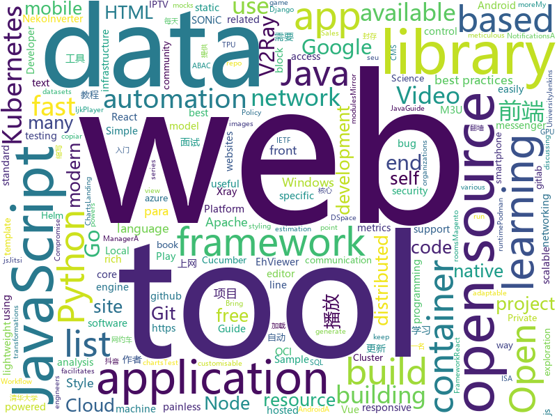

# 2020-12-05
See what the GitHub community is most excited about.

## python
+ [hostifi-mvp](https://github.com/reillychase/hostifi-mvp)(**250 stars today**): 
+ [TinyCheck](https://github.com/KasperskyLab/TinyCheck)(**257 stars today**): TinyCheck allows you to easily capture network communications from a smartphone or any device which can be associated to a Wi-Fi access point in order to quickly analyze them. This can be used to check if any suspect or malicious communication is outgoing from a smartphone, by using heuristics or specific Indicators of Compromise (IoCs). In orde…
+ [pulse](https://github.com/adamian98/pulse)(**177 stars today**): PULSE: Self-Supervised Photo Upsampling via Latent Space Exploration of Generative Models
+ [playwright-python](https://github.com/microsoft/playwright-python)(**118 stars today**): Python version of the Playwright testing and automation library.
+ [jax](https://github.com/google/jax)(**45 stars today**): Composable transformations of Python+NumPy programs: differentiate, vectorize, JIT to GPU/TPU, and more
+ [Python](https://github.com/geekcomputers/Python)(**56 stars today**): My Python Examples
+ [public-apis](https://github.com/public-apis/public-apis)(**108 stars today**): A collective list of free APIs for use in software and web development.
+ [wfuzz](https://github.com/xmendez/wfuzz)(**16 stars today**): Web application fuzzer
+ [writehat](https://github.com/blacklanternsecurity/writehat)(**41 stars today**): A pentest reporting tool written in Python. Free yourself from Microsoft Word.
+ [gunicorn](https://github.com/benoitc/gunicorn)(**2 stars today**): gunicorn 'Green Unicorn' is a WSGI HTTP Server for UNIX, fast clients and sleepy applications.
+ [Udemy-Course-Grabber](https://github.com/techtanic/Udemy-Course-Grabber)(**75 stars today**): 
+ [hypnotix](https://github.com/linuxmint/hypnotix)(**27 stars today**): An M3U IPTV Player
+ [rich](https://github.com/willmcgugan/rich)(**159 stars today**): Rich is a Python library for rich text and beautiful formatting in the terminal.
+ [Invisible-Cloak-or-Adrishya-Choga](https://github.com/Devashi-Choudhary/Invisible-Cloak-or-Adrishya-Choga)(**6 stars today**): 
+ [semgrep](https://github.com/returntocorp/semgrep)(**15 stars today**): Lightweight static analysis for many languages. Find bug variants with patterns that look like source code.
+ [core](https://github.com/home-assistant/core)(**39 stars today**): 🏡Open source home automation that puts local control and privacy first
+ [uiautomator2](https://github.com/openatx/uiautomator2)(**7 stars today**): Android Uiautomator2 Python Wrapper
+ [detection-rules](https://github.com/elastic/detection-rules)(**4 stars today**): Rules for Elastic Security's detection engine
+ [autosub](https://github.com/agermanidis/autosub)(**6 stars today**): [NO LONGER MAINTAINED] Command-line utility for auto-generating subtitles for any video file
+ [horovod](https://github.com/horovod/horovod)(**10 stars today**): Distributed training framework for TensorFlow, Keras, PyTorch, and Apache MXNet.
+ [raic-2020](https://github.com/MailRuChamps/raic-2020)(**5 stars today**): 
+ [holoviews](https://github.com/holoviz/holoviews)(**13 stars today**): With Holoviews, your data visualizes itself.
+ [manim](https://github.com/3b1b/manim)(**65 stars today**): Animation engine for explanatory math videos
+ [trt_pose](https://github.com/NVIDIA-AI-IOT/trt_pose)(**5 stars today**): Real-time pose estimation accelerated with NVIDIA TensorRT
+ [binwalk](https://github.com/ReFirmLabs/binwalk)(**7 stars today**): Firmware Analysis Tool

## java
+ [bazel](https://github.com/bazelbuild/bazel)(**12 stars today**): a fast, scalable, multi-language and extensible build system
+ [hutool](https://github.com/looly/hutool)(**61 stars today**): A set of tools that keep Java sweet.
+ [micronaut-core](https://github.com/micronaut-projects/micronaut-core)(**49 stars today**): Micronaut Application Framework
+ [react-native-push-notification](https://github.com/zo0r/react-native-push-notification)(**6 stars today**): React Native Local and Remote Notifications
+ [Mindustry](https://github.com/Anuken/Mindustry)(**278 stars today**): A sandbox tower defense game
+ [beam](https://github.com/apache/beam)(**7 stars today**): Apache Beam is a unified programming model for Batch and Streaming
+ [karate](https://github.com/intuit/karate)(**6 stars today**): Test Automation Made Simple
+ [quickstart-android](https://github.com/firebase/quickstart-android)(**5 stars today**): Firebase Quickstart Samples for Android
+ [Signal-Android](https://github.com/signalapp/Signal-Android)(**8 stars today**): A private messenger for Android.
+ [baritone](https://github.com/cabaletta/baritone)(**4 stars today**): google maps for block game
+ [spring-security](https://github.com/spring-projects/spring-security)(**2 stars today**): Spring Security
+ [yang](https://github.com/YangModels/yang)(**2 stars today**): YANG modules from standards organizations such as the IETF, The IEEE, The Metro Ethernet Forum, open source such as Open Daylight or vendor specific modules
+ [kafka](https://github.com/apache/kafka)(**19 stars today**): Mirror of Apache Kafka
+ [nifi](https://github.com/apache/nifi)(**5 stars today**): Apache NiFi
+ [rocketmq](https://github.com/apache/rocketmq)(**18 stars today**): Mirror of Apache RocketMQ
+ [android](https://github.com/owncloud/android)(**0 stars today**): ☎️The ownCloud Android App
+ [JavaGuide](https://github.com/Snailclimb/JavaGuide)(**88 stars today**): 「Java学习+面试指南」一份涵盖大部分 Java 程序员所需要掌握的核心知识。准备 Java 面试，首选 JavaGuide！
+ [jdk](https://github.com/openjdk/jdk)(**20 stars today**): JDK main-line development
+ [online-taxi](https://github.com/yueyi2019/online-taxi)(**17 stars today**): 网约车项目
+ [tech-interview-for-developer](https://github.com/gyoogle/tech-interview-for-developer)(**16 stars today**): 👶🏻 신입 개발자 전공 지식 & 기술 면접 백과사전📖
+ [jib](https://github.com/GoogleContainerTools/jib)(**9 stars today**): 🏗Build container images for your Java applications.
+ [DSpace](https://github.com/DSpace/DSpace)(**0 stars today**): (Official) The DSpace digital asset management system that powers your Institutional Repository
+ [DKVideoPlayer](https://github.com/Doikki/DKVideoPlayer)(**8 stars today**): Android Video Player. 安卓视频播放器，封装MediaPlayer、ExoPlayer、IjkPlayer。模仿抖音并实现预加载，列表播放，悬浮播放，广告播放，弹幕
+ [cucumber](https://github.com/cucumber/cucumber)(**3 stars today**): Cucumber monorepo - building blocks for Cucumber in various languages
+ [EhViewer](https://github.com/NuclearVGA/EhViewer)(**9 stars today**): 前任作者NekoInverter在gitlab重新更新EhViewer了，我不再独立维护项目，本项目暂时封存。 请前往 https://gitlab.com/NekoInverter/EhViewer 获取最新版本。

## unknown
+ [Front-End-Checklist](https://github.com/thedaviddias/Front-End-Checklist)(**416 stars today**): 🗂The perfect Front-End Checklist for modern websites and meticulous developers
+ [Resources-for-Beginner-Bug-Bounty-Hunters](https://github.com/nahamsec/Resources-for-Beginner-Bug-Bounty-Hunters)(**143 stars today**): A list of resources for those interested in getting started in bug bounties
+ [Countries](https://github.com/Free-IPTV/Countries)(**78 stars today**): Free legally receivable IPTV channels as .m3u for Kodi. :-)
+ [free-programming-books](https://github.com/EbookFoundation/free-programming-books)(**118 stars today**): 📚Freely available programming books
+ [Learn-Vim](https://github.com/iggredible/Learn-Vim)(**46 stars today**): A book for learning the Vim editor the smart way.
+ [open-source-cs](https://github.com/ForrestKnight/open-source-cs)(**26 stars today**): Video discussing this curriculum:
+ [laravel-best-practices](https://github.com/alexeymezenin/laravel-best-practices)(**8 stars today**): Laravel best practices
+ [project-based-learning](https://github.com/tuvtran/project-based-learning)(**44 stars today**): Curated list of project-based tutorials
+ [golang-developer-roadmap](https://github.com/Alikhll/golang-developer-roadmap)(**14 stars today**): Roadmap to becoming a Go developer in 2020
+ [You-Dont-Know-JS](https://github.com/getify/You-Dont-Know-JS)(**90 stars today**): A book series on JavaScript. @YDKJS on twitter.
+ [patches](https://github.com/ITotalJustice/patches)(**17 stars today**): 
+ [README-template](https://github.com/iuricode/README-template)(**22 stars today**): 📜Modelos README para qualquer pessoa copiar e usar em seu GitHub.
+ [Awesome-Federated-Learning](https://github.com/chaoyanghe/Awesome-Federated-Learning)(**10 stars today**): Federated Learning Library: https://fedml.ai
+ [Papers-Literature-ML-DL-RL-AI](https://github.com/tirthajyoti/Papers-Literature-ML-DL-RL-AI)(**15 stars today**): Highly cited and useful papers related to machine learning, deep learning, AI, game theory, reinforcement learning
+ [vagas](https://github.com/frontendbr/vagas)(**11 stars today**): 🔬Espaço para divulgação de vagas para front-enders.
+ [Best-websites-a-programmer-should-visit](https://github.com/sdmg15/Best-websites-a-programmer-should-visit)(**14 stars today**): 🔗Some useful websites for programmers.
+ [COVID-19](https://github.com/pcm-dpc/COVID-19)(**2 stars today**): COVID-19 Italia - Monitoraggio situazione
+ [kubernetes-the-hard-way](https://github.com/kelseyhightower/kubernetes-the-hard-way)(**28 stars today**): Bootstrap Kubernetes the hard way on Google Cloud Platform. No scripts.
+ [Xray-examples](https://github.com/XTLS/Xray-examples)(**4 stars today**): Some examples of uses for Xray-core.
+ [awesome-public-datasets](https://github.com/awesomedata/awesome-public-datasets)(**25 stars today**): A topic-centric list of HQ open datasets.
+ [OSCP](https://github.com/joker2a/OSCP)(**7 stars today**): OSCP cheatsheet
+ [go](https://github.com/datasciencemasters/go)(**19 stars today**): The Open Source Data Science Masters
+ [winXray](https://github.com/winXray/winXray)(**32 stars today**): Xray / V2Ray( vmess/vless )、Shadowsocks、Trojan 通用客户端（Windows），可自动维持稳定上网 - 代理服务器异常自动切换，并提供一键部署代理服务端工具，使用 aardio 编写，绿色便携版免安装仅740KB、不需要.Net等外部运行库。
+ [aws-proton-sample-templates](https://github.com/aws-samples/aws-proton-sample-templates)(**50 stars today**): Sample templates for AWS Proton, available in preview
+ [machine-learning-roadmap](https://github.com/mrdbourke/machine-learning-roadmap)(**13 stars today**): A roadmap connecting many of the most important concepts in machine learning, how to learn them and what tools to use to perform them.

## javascript
+ [wmr](https://github.com/preactjs/wmr)(**441 stars today**): 👩‍🚀The tiny all-in-one development tool for modern web apps.
+ [html5-boilerplate](https://github.com/h5bp/html5-boilerplate)(**183 stars today**): A professional front-end template for building fast, robust, and adaptable web apps or sites.
+ [realworld](https://github.com/gothinkster/realworld)(**244 stars today**): "The mother of all demo apps" — Exemplary fullstack Medium.com clone powered by React, Angular, Node, Django, and many more🏅
+ [awesome-advent-of-code](https://github.com/Bogdanp/awesome-advent-of-code)(**58 stars today**): A collection of awesome resources related to the yearly Advent of Code challenge.
+ [javascript](https://github.com/airbnb/javascript)(**204 stars today**): JavaScript Style Guide
+ [javascript-algorithms](https://github.com/trekhleb/javascript-algorithms)(**148 stars today**): 📝Algorithms and data structures implemented in JavaScript with explanations and links to further readings
+ [Web](https://github.com/qianguyihao/Web)(**60 stars today**): 前端入门到进阶图文教程，超详细的Web前端学习笔记。从零开始学前端，做一名精致优雅的前端工程师。公众号「千古壹号」作者。
+ [nodebestpractices](https://github.com/goldbergyoni/nodebestpractices)(**247 stars today**): ✅The Node.js best practices list (December 2020)
+ [three.js](https://github.com/mrdoob/three.js)(**40 stars today**): JavaScript 3D library.
+ [d3](https://github.com/d3/d3)(**21 stars today**): Bring data to life with SVG, Canvas and HTML.📊📈🎉
+ [evergreen](https://github.com/segmentio/evergreen)(**2 stars today**): 🌲Evergreen React UI Framework by Segment
+ [snowpack](https://github.com/snowpackjs/snowpack)(**119 stars today**): WASM-powered frontend build tool. Fast, lightweight, unbundled ESM.✌️
+ [jsoneditor](https://github.com/josdejong/jsoneditor)(**36 stars today**): A web-based tool to view, edit, format, and validate JSON
+ [strapi](https://github.com/strapi/strapi)(**25 stars today**): 🚀Open source Node.js Headless CMS to easily build customisable APIs
+ [sql.js](https://github.com/sql-js/sql.js)(**73 stars today**): A javascript library to run SQLite on the web.
+ [WebGL-Fluid-Simulation](https://github.com/PavelDoGreat/WebGL-Fluid-Simulation)(**20 stars today**): Play with fluids in your browser (works even on mobile)
+ [tiptap](https://github.com/ueberdosis/tiptap)(**11 stars today**): A renderless rich-text editor for Vue.js
+ [lighthouse](https://github.com/GoogleChrome/lighthouse)(**13 stars today**): Automated auditing, performance metrics, and best practices for the web.
+ [bootstrap](https://github.com/twbs/bootstrap)(**34 stars today**): The most popular HTML, CSS, and JavaScript framework for developing responsive, mobile first projects on the web.
+ [aframe](https://github.com/aframevr/aframe)(**6 stars today**): 🅰️web framework for building virtual reality experiences.
+ [Signal-Desktop](https://github.com/signalapp/Signal-Desktop)(**8 stars today**): Signal — Private Messenger for Windows, Mac, and Linux
+ [unleash](https://github.com/Unleash/unleash)(**19 stars today**): Unleash is the open source feature toggle service.
+ [Vue.Draggable](https://github.com/SortableJS/Vue.Draggable)(**15 stars today**): Vue drag-and-drop component based on Sortable.js
+ [jitsi-meet](https://github.com/jitsi/jitsi-meet)(**14 stars today**): Jitsi Meet - Secure, Simple and Scalable Video Conferences that you use as a standalone app or embed in your web application.
+ [Detox](https://github.com/wix/Detox)(**7 stars today**): Gray box end-to-end testing and automation framework for mobile apps

## html
+ [introduction-to-bash-scripting](https://github.com/bobbyiliev/introduction-to-bash-scripting)(**82 stars today**): Free Introduction to Bash Scripting eBook
+ [fonts](https://github.com/google/fonts)(**9 stars today**): Font files available from Google Fonts
+ [helm-charts](https://github.com/prometheus-community/helm-charts)(**7 stars today**): Prometheus community Helm charts
+ [wpt](https://github.com/web-platform-tests/wpt)(**1 stars today**): Test suites for Web platform specs — including WHATWG, W3C, and others
+ [tidytuesday](https://github.com/rfordatascience/tidytuesday)(**4 stars today**): Official repo for the #tidytuesday project
+ [calico](https://github.com/projectcalico/calico)(**4 stars today**): Cloud native networking and network security
+ [free-v2ray](https://github.com/iwxf/free-v2ray)(**8 stars today**): 每天更新，分享免费V2Ray账号、订阅链接，V2Ray翻墙科学上网教程。
+ [pengukuran_tanah_google_map](https://github.com/egooktafanda97/pengukuran_tanah_google_map)(**10 stars today**): 
+ [amundsen](https://github.com/amundsen-io/amundsen)(**7 stars today**): Amundsen is a metadata driven application for improving the productivity of data analysts, data scientists and engineers when interacting with data.
+ [ISA8019](https://github.com/Manawyrm/ISA8019)(**12 stars today**): RTL8019-based ISA network card, NE2000-compatible
+ [charts](https://github.com/bitnami/charts)(**11 stars today**): Helm Charts
+ [SONiC](https://github.com/Azure/SONiC)(**0 stars today**): Landing page for Software for Open Networking in the Cloud (SONiC) - http://azure.github.io/SONiC/
+ [styleguide](https://github.com/google/styleguide)(**20 stars today**): Style guides for Google-originated open-source projects
+ [nyt-2020-election-scraper](https://github.com/alex/nyt-2020-election-scraper)(**2 stars today**): 
+ [sale-workflow](https://github.com/OCA/sale-workflow)(**0 stars today**): Odoo Sales, Workflow and Organization
+ [destyle.css](https://github.com/nicolas-cusan/destyle.css)(**0 stars today**): Opinionated reset stylesheet that provides a clean styling slate for your project.
+ [WebFundamentals](https://github.com/google/WebFundamentals)(**2 stars today**): Best practices for modern web development
+ [chatcord](https://github.com/bradtraversy/chatcord)(**2 stars today**): Realtime chat app with rooms
+ [devdocs](https://github.com/magento/devdocs)(**1 stars today**): Magento Developer Documentation
+ [charts](https://github.com/Kong/charts)(**0 stars today**): Helm chart for Kong
+ [nbnhhsh](https://github.com/itorr/nbnhhsh)(**21 stars today**): 😩「能不能好好说话？」 拼音首字母缩写翻译工具
+ [eleventy-base-blog](https://github.com/11ty/eleventy-base-blog)(**0 stars today**): A starter repository for a blog web site using the Eleventy static site generator.
+ [REKCARC-TSC-UHT](https://github.com/PKUanonym/REKCARC-TSC-UHT)(**13 stars today**): 清华大学计算机系课程攻略 Guidance for courses in Department of Computer Science and Technology, Tsinghua University
+ [helm-charts](https://github.com/jenkinsci/helm-charts)(**3 stars today**): Jenkins community Helm charts
+ [responsive-html-email-template](https://github.com/leemunroe/responsive-html-email-template)(**6 stars today**): A free simple responsive HTML email template

## go
+ [containerd](https://github.com/containerd/containerd)(**103 stars today**): An open and reliable container runtime
+ [podman](https://github.com/containers/podman)(**165 stars today**): Podman: A tool for managing OCI containers and pods
+ [client_golang](https://github.com/prometheus/client_golang)(**5 stars today**): Prometheus instrumentation library for Go applications
+ [cockroach](https://github.com/cockroachdb/cockroach)(**12 stars today**): CockroachDB - the open source, cloud-native distributed SQL database.
+ [gogs](https://github.com/gogs/gogs)(**12 stars today**): Gogs is a painless self-hosted Git service
+ [atlantis](https://github.com/runatlantis/atlantis)(**5 stars today**): Terraform Pull Request Automation
+ [crypto](https://github.com/golang/crypto)(**2 stars today**): [mirror] Go supplementary cryptography libraries
+ [opentelemetry-collector](https://github.com/open-telemetry/opentelemetry-collector)(**4 stars today**): OpenTelemetry Collector
+ [helm](https://github.com/helm/helm)(**10 stars today**): The Kubernetes Package Manager
+ [testify](https://github.com/stretchr/testify)(**18 stars today**): A toolkit with common assertions and mocks that plays nicely with the standard library
+ [ethr](https://github.com/microsoft/ethr)(**224 stars today**): Ethr is a Comprehensive Network Measurement Tool for TCP, UDP & ICMP.
+ [gitea](https://github.com/go-gitea/gitea)(**171 stars today**): Git with a cup of tea, painless self-hosted git service
+ [terratest](https://github.com/gruntwork-io/terratest)(**5 stars today**): Terratest is a Go library that makes it easier to write automated tests for your infrastructure code.
+ [cri-o](https://github.com/cri-o/cri-o)(**47 stars today**): Open Container Initiative-based implementation of Kubernetes Container Runtime Interface
+ [fibratus](https://github.com/rabbitstack/fibratus)(**35 stars today**): Tool for exploration and tracing of the Windows kernel
+ [buildah](https://github.com/containers/buildah)(**36 stars today**): A tool that facilitates building OCI images
+ [casbin](https://github.com/casbin/casbin)(**14 stars today**): An authorization library that supports access control models like ACL, RBAC, ABAC in Golang
+ [esbuild](https://github.com/evanw/esbuild)(**59 stars today**): An extremely fast JavaScript bundler and minifier
+ [terraform-provider-azurerm](https://github.com/terraform-providers/terraform-provider-azurerm)(**5 stars today**): Terraform provider for Azure Resource Manager
+ [kube-state-metrics](https://github.com/kubernetes/kube-state-metrics)(**7 stars today**): Add-on agent to generate and expose cluster-level metrics.
+ [consul](https://github.com/hashicorp/consul)(**7 stars today**): Consul is a distributed, highly available, and data center aware solution to connect and configure applications across dynamic, distributed infrastructure.
+ [go-admin](https://github.com/GoAdminGroup/go-admin)(**40 stars today**): A golang framework helps gopher to build a data visualization and admin panel in ten minutes
+ [gatekeeper](https://github.com/open-policy-agent/gatekeeper)(**4 stars today**): Gatekeeper - Policy Controller for Kubernetes
+ [k9s](https://github.com/derailed/k9s)(**20 stars today**): 🐶Kubernetes CLI To Manage Your Clusters In Style!
+ [Xray-core](https://github.com/XTLS/Xray-core)(**44 stars today**): Xray, Penetrates Everything. Also the best v2ray-core, with XTLS support. Fully compatible configuration.

## WordCloud

