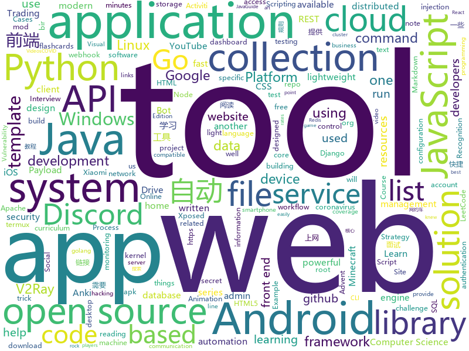

# 2020-12-07
See what the GitHub community is most excited about.

## python
+ [manim](https://github.com/3b1b/manim)(**77 stars today**): Animation engine for explanatory math videos
+ [public-apis](https://github.com/public-apis/public-apis)(**396 stars today**): A collective list of free APIs for use in software and web development.
+ [PayloadsAllTheThings](https://github.com/swisskyrepo/PayloadsAllTheThings)(**117 stars today**): A list of useful payloads and bypass for Web Application Security and Pentest/CTF
+ [restler-fuzzer](https://github.com/microsoft/restler-fuzzer)(**136 stars today**): RESTler is the first stateful REST API fuzzing tool for automatically testing cloud services through their REST APIs and finding security and reliability bugs in these services.
+ [core](https://github.com/home-assistant/core)(**203 stars today**): 🏡Open source home automation that puts local control and privacy first
+ [GuitarLSTM](https://github.com/GuitarML/GuitarLSTM)(**52 stars today**): Deep learning models for guitar amp/pedal emulation using LSTM with Keras.
+ [playwright-python](https://github.com/microsoft/playwright-python)(**173 stars today**): Python version of the Playwright testing and automation library.
+ [TinyCheck](https://github.com/KasperskyLab/TinyCheck)(**179 stars today**): TinyCheck allows you to easily capture network communications from a smartphone or any device which can be associated to a Wi-Fi access point in order to quickly analyze them. This can be used to check if any suspect or malicious communication is outgoing from a smartphone, by using heuristics or specific Indicators of Compromise (IoCs). In orde…
+ [python-cheatsheet](https://github.com/gto76/python-cheatsheet)(**93 stars today**): Comprehensive Python Cheatsheet
+ [face_recognition](https://github.com/ageitgey/face_recognition)(**35 stars today**): The world's simplest facial recognition api for Python and the command line
+ [system-design-primer](https://github.com/donnemartin/system-design-primer)(**70 stars today**): Learn how to design large-scale systems. Prep for the system design interview. Includes Anki flashcards.
+ [Tool-X](https://github.com/rajkumardusad/Tool-X)(**15 stars today**): Tool-X is a kali linux hacking Tool installer. Tool-X developed for termux and other Linux based systems. using Tool-X you can install almost 370+ hacking tools in termux app and other linux based distributions.
+ [youtube-dl](https://github.com/ytdl-org/youtube-dl)(**171 stars today**): Command-line program to download videos from YouTube.com and other video sites
+ [python-miio](https://github.com/rytilahti/python-miio)(**4 stars today**): Python library & console tool for controlling Xiaomi smart appliances
+ [scikit-learn](https://github.com/scikit-learn/scikit-learn)(**25 stars today**): scikit-learn: machine learning in Python
+ [Xiaomi-cloud-tokens-extractor](https://github.com/PiotrMachowski/Xiaomi-cloud-tokens-extractor)(**11 stars today**): This tool/script retrieves tokens for all devices connected to Xiaomi cloud.
+ [Python-100-Days](https://github.com/jackfrued/Python-100-Days)(**62 stars today**): Python - 100天从新手到大师
+ [CheatSheetSeries](https://github.com/OWASP/CheatSheetSeries)(**42 stars today**): The OWASP Cheat Sheet Series was created to provide a concise collection of high value information on specific application security topics.
+ [anki](https://github.com/ankitects/anki)(**10 stars today**): Anki for desktop computers
+ [django-allauth](https://github.com/pennersr/django-allauth)(**3 stars today**): Integrated set of Django applications addressing authentication, registration, account management as well as 3rd party (social) account authentication.
+ [sqlmap](https://github.com/sqlmapproject/sqlmap)(**22 stars today**): Automatic SQL injection and database takeover tool
+ [discord.py](https://github.com/Rapptz/discord.py)(**12 stars today**): An API wrapper for Discord written in Python.
+ [spotify-downloader](https://github.com/spotDL/spotify-downloader)(**8 stars today**): Download your Spotify playlists and songs along with album art and metadata (from YouTube if a match is found).
+ [Summer2021-Internships](https://github.com/Pitt-CSC/Summer2021-Internships)(**5 stars today**): Collection of Summer 2021 tech internships!
+ [GooglePhotosTakeoutHelper](https://github.com/TheLastGimbus/GooglePhotosTakeoutHelper)(**24 stars today**): Script that organizes the Google Takeout archive into one big chronological folder

## java
+ [online-taxi](https://github.com/yueyi2019/online-taxi)(**29 stars today**): 网约车项目
+ [CtCI-6th-Edition](https://github.com/careercup/CtCI-6th-Edition)(**8 stars today**): Cracking the Coding Interview 6th Ed. Solutions
+ [Cimoc](https://github.com/Haleydu/Cimoc)(**14 stars today**): 漫画阅读器
+ [micronaut-core](https://github.com/micronaut-projects/micronaut-core)(**44 stars today**): Micronaut Application Framework
+ [MinecraftForge](https://github.com/MinecraftForge/MinecraftForge)(**4 stars today**): Modifications to the Minecraft base files to assist in compatibility between mods.
+ [groovy](https://github.com/apache/groovy)(**1 stars today**): Apache Groovy: A powerful multi-faceted programming language for the JVM platform
+ [springCloud](https://github.com/acloudyh/springCloud)(**8 stars today**): 尚硅谷springCloud学习
+ [HackerRank_solutions](https://github.com/RodneyShag/HackerRank_solutions)(**3 stars today**): 317 efficient solutions to HackerRank problems
+ [sodium-fabric](https://github.com/jellysquid3/sodium-fabric)(**3 stars today**): A Fabric mod designed to improve frame rates and reduce micro-stutter
+ [EdXposedManager](https://github.com/ElderDrivers/EdXposedManager)(**5 stars today**): Companion Android application for EdXposed
+ [JavaGuide](https://github.com/Snailclimb/JavaGuide)(**85 stars today**): 「Java学习+面试指南」一份涵盖大部分 Java 程序员所需要掌握的核心知识。准备 Java 面试，首选 JavaGuide！
+ [libgdx](https://github.com/libgdx/libgdx)(**9 stars today**): Desktop/Android/HTML5/iOS Java game development framework
+ [zeebe](https://github.com/zeebe-io/zeebe)(**4 stars today**): Distributed Workflow Engine for Microservices Orchestration
+ [antlr4](https://github.com/antlr/antlr4)(**15 stars today**): ANTLR (ANother Tool for Language Recognition) is a powerful parser generator for reading, processing, executing, or translating structured text or binary files.
+ [Activiti](https://github.com/Activiti/Activiti)(**8 stars today**): Activiti is a light-weight workflow and Business Process Management (BPM) Platform targeted at business people, developers and system admins. Its core is a super-fast and rock-solid BPMN 2 process engine for Java. It's open-source and distributed under the Apache license. Activiti runs in any Java application, on a server, on a cluster or in the…
+ [PlatformaticaQA](https://github.com/SergeiDemyanenko/PlatformaticaQA)(**2 stars today**): 
+ [PojavLauncher](https://github.com/PojavLauncherTeam/PojavLauncher)(**1 stars today**): A Minecraft: Java Edition Launcher for Android based on Boardwalk. Note that v2 will not able to run Minecraft 1.12+.
+ [Xpatch](https://github.com/WindySha/Xpatch)(**15 stars today**): 免Root实现app加载Xposed插件工具。This is a tool to repackage apk file, then the apk can load any xposed modules installed in the device. It is another way to hook an app without root device.
+ [barinsta](https://github.com/austinhuang0131/barinsta)(**13 stars today**): Open-source alternative Instagram client on Android.
+ [NewPipe](https://github.com/TeamNewPipe/NewPipe)(**14 stars today**): A libre lightweight streaming front-end for Android.
+ [tech-interview-for-developer](https://github.com/gyoogle/tech-interview-for-developer)(**20 stars today**): 👶🏻 신입 개발자 전공 지식 & 기술 면접 백과사전📖
+ [keepass2android](https://github.com/PhilippC/keepass2android)(**4 stars today**): Password manager app for Android
+ [gnirehtet](https://github.com/Genymobile/gnirehtet)(**3 stars today**): Gnirehtet provides reverse tethering for Android
+ [MyBookshelf](https://github.com/gedoor/MyBookshelf)(**11 stars today**): 阅读是一款可以自定义来源阅读网络内容的工具，为广大网络文学爱好者提供一种方便、快捷舒适的试读体验。
+ [Anki-Android](https://github.com/ankidroid/Anki-Android)(**4 stars today**): AnkiDroid: Anki flashcards on Android. Your secret trick to achieve superhuman information retention.

## unknown
+ [coding-interview-university](https://github.com/jwasham/coding-interview-university)(**761 stars today**): A complete computer science study plan to become a software engineer.
+ [COVID-19](https://github.com/CSSEGISandData/COVID-19)(**39 stars today**): Novel Coronavirus (COVID-19) Cases, provided by JHU CSSE
+ [Front-End-Checklist](https://github.com/thedaviddias/Front-End-Checklist)(**1,101 stars today**): 🗂The perfect Front-End Checklist for modern websites and meticulous developers
+ [TeachYourselfCS-CN](https://github.com/keithnull/TeachYourselfCS-CN)(**216 stars today**): TeachYourselfCS 的中文翻译 | A Chinese translation of TeachYourselfCS
+ [winXray](https://github.com/winXray/winXray)(**52 stars today**): Xray / V2Ray( vmess/vless )、Shadowsocks、Trojan 通用客户端（Windows），可自动维持稳定上网 - 代理服务器异常自动切换，并提供一键部署代理服务端工具，使用 aardio 编写，绿色便携版免安装仅740KB、不需要.Net等外部运行库。
+ [covid-19-data](https://github.com/nytimes/covid-19-data)(**8 stars today**): An ongoing repository of data on coronavirus cases and deaths in the U.S.
+ [HowToHunt](https://github.com/KathanP19/HowToHunt)(**4 stars today**): Tutorials and Things to Do while Hunting Vulnerability.
+ [xss-payload-list](https://github.com/payloadbox/xss-payload-list)(**40 stars today**): 🎯Cross Site Scripting ( XSS ) Vulnerability Payload List
+ [sql-injection-payload-list](https://github.com/payloadbox/sql-injection-payload-list)(**21 stars today**): 🎯SQL Injection Payload List
+ [redteam_vul](https://github.com/r0eXpeR/redteam_vul)(**180 stars today**): 红队作战中比较常遇到的一些重点系统漏洞整理。
+ [computer-science](https://github.com/ossu/computer-science)(**51 stars today**): 🎓Path to a free self-taught education in Computer Science!
+ [gustave](https://github.com/airbus-seclab/gustave)(**44 stars today**): 
+ [youtube-videos](https://github.com/techno-tim/youtube-videos)(**3 stars today**): Documentation for Techno Tim YouTube Videos
+ [COVID-19](https://github.com/pcm-dpc/COVID-19)(**4 stars today**): COVID-19 Italia - Monitoraggio situazione
+ [open-source-cs](https://github.com/ForrestKnight/open-source-cs)(**12 stars today**): Video discussing this curriculum:
+ [shortcuts](https://github.com/leecobaby/shortcuts)(**15 stars today**): 自动养猫|自动淘金币|自动欢乐造|抢购助手|快捷指令
+ [eng-practices](https://github.com/google/eng-practices)(**16 stars today**): Google's Engineering Practices documentation
+ [market-toolkit](https://github.com/ckz8780/market-toolkit)(**5 stars today**): A collection of stock market resources and tools
+ [hello-world](https://github.com/bigdongdongCLUB/hello-world)(**2 stars today**): 
+ [free-programming-books](https://github.com/EbookFoundation/free-programming-books)(**153 stars today**): 📚Freely available programming books
+ [awesome-mlops](https://github.com/visenger/awesome-mlops)(**15 stars today**): A curated list of references for MLOps
+ [vmware-exploitation](https://github.com/xairy/vmware-exploitation)(**10 stars today**): A collection of links related to VMware escape exploits
+ [You-Dont-Know-JS](https://github.com/getify/You-Dont-Know-JS)(**80 stars today**): A book series on JavaScript. @YDKJS on twitter.
+ [T-Rex](https://github.com/trexminer/T-Rex)(**2 stars today**): T-Rex NVIDIA GPU miner with web control monitoring page
+ [speedchallenge](https://github.com/commaai/speedchallenge)(**3 stars today**): The comma.ai Speed Prediction Challenge!

## javascript
+ [docs](https://github.com/github/docs)(**24 stars today**): The open-source repo for docs.github.com
+ [discord.js](https://github.com/discordjs/discord.js)(**100 stars today**): A powerful JavaScript library for interacting with the Discord API
+ [magnetW](https://github.com/xiandanin/magnetW)(**169 stars today**): 磁力链接聚合搜索
+ [html5-boilerplate](https://github.com/h5bp/html5-boilerplate)(**163 stars today**): A professional front-end template for building fast, robust, and adaptable web apps or sites.
+ [javascript-algorithms](https://github.com/trekhleb/javascript-algorithms)(**146 stars today**): 📝Algorithms and data structures implemented in JavaScript with explanations and links to further readings
+ [realworld](https://github.com/gothinkster/realworld)(**260 stars today**): "The mother of all demo apps" — Exemplary fullstack Medium.com clone powered by React, Angular, Node, Django, and many more🏅
+ [wmr](https://github.com/preactjs/wmr)(**301 stars today**): 👩‍🚀The tiny all-in-one development tool for modern web apps.
+ [awesome-advent-of-code](https://github.com/Bogdanp/awesome-advent-of-code)(**28 stars today**): A collection of awesome resources related to the yearly Advent of Code challenge.
+ [freeCodeCamp](https://github.com/freeCodeCamp/freeCodeCamp)(**49 stars today**): freeCodeCamp.org's open source codebase and curriculum. Learn to code at home.
+ [widgets](https://github.com/thewaytozion/widgets)(**7 stars today**): 
+ [iptv](https://github.com/iptv-org/iptv)(**25 stars today**): Collection of 5000+ publicly available IPTV channels from all over the world
+ [Superalgos](https://github.com/Superalgos/Superalgos)(**11 stars today**): Crypto Trading Bots and Strategy Automation Platform: Visual Scripting Designer, Integrated Charting System, Visual Strategy Debugger, Trading Farm Deployments.
+ [puppeteer-extra](https://github.com/berstend/puppeteer-extra)(**13 stars today**): 💯Teach puppeteer new tricks through plugins.
+ [fullstack-course4](https://github.com/jhu-ep-coursera/fullstack-course4)(**5 stars today**): Example code for HTML, CSS, and Javascript for Web Developers Coursera Course
+ [SingleFile](https://github.com/gildas-lormeau/SingleFile)(**13 stars today**): Web Extension for Firefox/Chrome/MS Edge and CLI tool to save a faithful copy of an entire web page in a single HTML file
+ [Web](https://github.com/qianguyihao/Web)(**55 stars today**): 前端入门到进阶图文教程，超详细的Web前端学习笔记。从零开始学前端，做一名精致优雅的前端工程师。公众号「千古壹号」作者。
+ [devconnector_2.0](https://github.com/bradtraversy/devconnector_2.0)(**6 stars today**): Social network for developers, built on the MERN stack
+ [Windows-universal-samples](https://github.com/microsoft/Windows-universal-samples)(**4 stars today**): API samples for the Universal Windows Platform.
+ [ios_rule_script](https://github.com/blackmatrix7/ios_rule_script)(**12 stars today**): iOS平台的分流规则、复写规则和一些自动化脚本。
+ [nuxt.js](https://github.com/nuxt/nuxt.js)(**31 stars today**): The Intuitive Vue Framework
+ [parcel](https://github.com/parcel-bundler/parcel)(**10 stars today**): 📦🚀Blazing fast, zero configuration web application bundler
+ [plugins](https://github.com/rollup/plugins)(**5 stars today**): 🍣The one-stop shop for official Rollup plugins
+ [advent-of-code-2020](https://github.com/adriennetacke/advent-of-code-2020)(**1 stars today**): My JavaScript solutions for Advent of Code 2020
+ [joplin](https://github.com/laurent22/joplin)(**20 stars today**): Joplin - an open source note taking and to-do application with synchronization capabilities for Windows, macOS, Linux, Android and iOS. Forum: https://discourse.joplinapp.org/
+ [lax.js](https://github.com/alexfoxy/lax.js)(**28 stars today**): Simple & lightweight (<4kb gzipped) vanilla JavaScript library to create smooth & beautiful animations when you scroll.

## html
+ [DWAdmin-Template](https://github.com/andre12001/DWAdmin-Template)(**15 stars today**): DWAdmin is a dashboard website made of bootstrap 4 and css and other libraries. This template is very light and suitable for use by companies and other things.
+ [emacs-application-framework](https://github.com/manateelazycat/emacs-application-framework)(**6 stars today**): Emacs application framework
+ [Markdown-Resume](https://github.com/CyC2018/Markdown-Resume)(**13 stars today**): ⭐️Markdown 简历模版
+ [zenbot](https://github.com/DeviaVir/zenbot)(**6 stars today**): Zenbot is a command-line cryptocurrency trading bot using Node.js and MongoDB.
+ [hugo-theme-stack](https://github.com/CaiJimmy/hugo-theme-stack)(**1 stars today**): Card-style Hugo theme designed for bloggers
+ [text-to-handwriting](https://github.com/saurabhdaware/text-to-handwriting)(**15 stars today**): So your teacher asked you to upload written assignments? Hate writing assigments? This tool will help you convert your text to handwriting xD
+ [home-assistant.io](https://github.com/home-assistant/home-assistant.io)(**2 stars today**): 📘Home Assistant User documentation
+ [tidytuesday](https://github.com/rfordatascience/tidytuesday)(**4 stars today**): Official repo for the #tidytuesday project
+ [html-css](https://github.com/gustavoguanabara/html-css)(**8 stars today**): Curso de HTML5 e CSS3
+ [acgimgurl](https://github.com/Suxiaoqinx/acgimgurl)(**22 stars today**): 
+ [EasyGrid](https://github.com/BMSVieira/EasyGrid)(**15 stars today**): EasyGrid - VanillaJS Responsive Grid
+ [fluxion](https://github.com/FluxionNetwork/fluxion)(**2 stars today**): Fluxion is a remake of linset by vk496 with enhanced functionality.
+ [chatcord](https://github.com/bradtraversy/chatcord)(**3 stars today**): Realtime chat app with rooms
+ [webpage-template](https://github.com/richzhang/webpage-template)(**9 stars today**): Simple project webpage template. Originally used in Colorful Image Colorization. ECCV, 2016.
+ [free-v2ray](https://github.com/iwxf/free-v2ray)(**8 stars today**): 每天更新，分享免费V2Ray账号、订阅链接，V2Ray翻墙科学上网教程。
+ [ctf-wiki](https://github.com/ctf-wiki/ctf-wiki)(**8 stars today**): CTF Wiki Online. Come and join us, we need you!
+ [tasarim-desenleri-turkce-kaynak](https://github.com/yusufyilmazfr/tasarim-desenleri-turkce-kaynak)(**12 stars today**): Türkçe kaynağa destek olması amacıyla oluşturulmuş bir kaynaktır. Konu anlatımın yanı sıra C# ve Java gibi birçok dilde tasarım desenlerinin uygulamasını içermektedir.
+ [pcc_2e](https://github.com/ehmatthes/pcc_2e)(**3 stars today**): Online resources for Python Crash Course (Second Edition), from No Starch Press
+ [docker-development-youtube-series](https://github.com/marcel-dempers/docker-development-youtube-series)(**7 stars today**): 
+ [github-markdown-css](https://github.com/sindresorhus/github-markdown-css)(**6 stars today**): The minimal amount of CSS to replicate the GitHub Markdown style
+ [Adminator-admin-dashboard](https://github.com/puikinsh/Adminator-admin-dashboard)(**3 stars today**): Adminator is a easy to use and well design admin dashboard template for web apps, websites, services and more
+ [ML-notes](https://github.com/Sakura-gh/ML-notes)(**9 stars today**): notes about machine learning
+ [REKCARC-TSC-UHT](https://github.com/PKUanonym/REKCARC-TSC-UHT)(**11 stars today**): 清华大学计算机系课程攻略 Guidance for courses in Department of Computer Science and Technology, Tsinghua University
+ [Server](https://github.com/PanDownloadServer/Server)(**51 stars today**): PanDownload的个人维护版本
+ [nyt-2020-election-scraper](https://github.com/alex/nyt-2020-election-scraper)(**3 stars today**): 

## go
+ [rclone](https://github.com/rclone/rclone)(**68 stars today**): "rsync for cloud storage" - Google Drive, Amazon Drive, S3, Dropbox, Backblaze B2, One Drive, Swift, Hubic, Cloudfiles, Google Cloud Storage, Yandex Files
+ [nerdctl](https://github.com/AkihiroSuda/nerdctl)(**55 stars today**): Docker-compatible CLI for containerd
+ [fibratus](https://github.com/rabbitstack/fibratus)(**129 stars today**): A modern tool for the Windows kernel exploration and tracing
+ [Xray-core](https://github.com/XTLS/Xray-core)(**72 stars today**): Xray, Penetrates Everything. Also the best v2ray-core, with XTLS support. Fully compatible configuration.
+ [mortar](https://github.com/go-masonry/mortar)(**43 stars today**): Mortar is a GO framework/library for building gRPC (and REST) web services.
+ [vitess](https://github.com/vitessio/vitess)(**31 stars today**): Vitess is a database clustering system for horizontal scaling of MySQL.
+ [webhook](https://github.com/adnanh/webhook)(**12 stars today**): webhook is a lightweight incoming webhook server to run shell commands
+ [LeetCode-Go](https://github.com/halfrost/LeetCode-Go)(**62 stars today**): ✅Solutions to LeetCode by Go, 100% test coverage, runtime beats 100% / LeetCode 题解
+ [consul](https://github.com/hashicorp/consul)(**8 stars today**): Consul is a distributed, highly available, and data center aware solution to connect and configure applications across dynamic, distributed infrastructure.
+ [Cloudreve](https://github.com/cloudreve/Cloudreve)(**23 stars today**): 🌩支持多家云存储的云盘系统 (A project helps you build your own cloud in minutes)
+ [automuteus](https://github.com/denverquane/automuteus)(**3 stars today**): Discord Bot to automute Among Us players at round transitions, in conjunction with https://github.com/denverquane/amonguscapture
+ [go-admin](https://github.com/GoAdminGroup/go-admin)(**52 stars today**): A golang framework helps gopher to build a data visualization and admin panel in ten minutes
+ [recipes](https://github.com/gofiber/recipes)(**8 stars today**): 📁Examples for🚀Fiber
+ [clash](https://github.com/Dreamacro/clash)(**36 stars today**): A rule-based tunnel in Go.
+ [discordgo](https://github.com/bwmarrin/discordgo)(**4 stars today**): (Golang) Go bindings for Discord
+ [filebrowser](https://github.com/filebrowser/filebrowser)(**18 stars today**): 📂Web File Browser which can be used as a middleware or standalone app.
+ [learn-go-with-tests](https://github.com/quii/learn-go-with-tests)(**15 stars today**): Learn Go with test-driven development
+ [cordless](https://github.com/Bios-Marcel/cordless)(**5 stars today**): The Discord terminal client you never knew you wanted.
+ [iavl](https://github.com/cosmos/iavl)(**6 stars today**): Merkleized IAVL+ Tree implementation in Go
+ [vault](https://github.com/hashicorp/vault)(**10 stars today**): A tool for secrets management, encryption as a service, and privileged access management
+ [redis](https://github.com/go-redis/redis)(**6 stars today**): Type-safe Redis client for Golang
+ [prometheus](https://github.com/prometheus/prometheus)(**33 stars today**): The Prometheus monitoring system and time series database.
+ [yay](https://github.com/Jguer/yay)(**5 stars today**): Yet another Yogurt - An AUR Helper written in Go
+ [syzkaller](https://github.com/google/syzkaller)(**8 stars today**): syzkaller is an unsupervised coverage-guided kernel fuzzer
+ [aws-vault](https://github.com/99designs/aws-vault)(**6 stars today**): A vault for securely storing and accessing AWS credentials in development environments

## WordCloud

