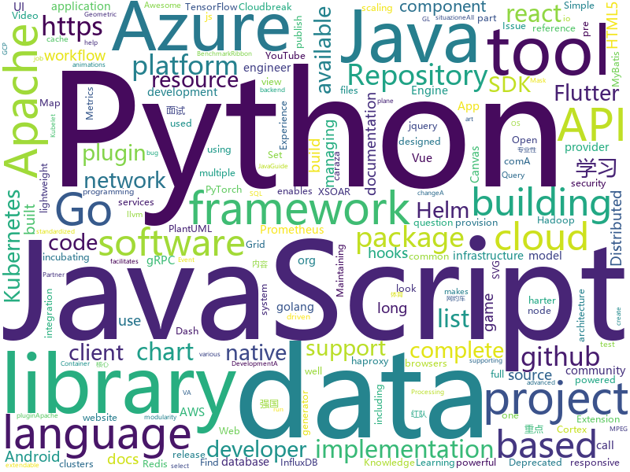

# 2020-12-08
See what the GitHub community is most excited about.

## python
+ [Depix](https://github.com/beurtschipper/Depix)(**4,271 stars today**): Recovers passwords from pixelized screenshots
+ [content](https://github.com/demisto/content)(**1 stars today**): Demisto is now Cortex XSOAR. Automate and orchestrate your Security Operations with Cortex XSOAR's ever-growing Content Repository. Pull Requests are always welcome and highly appreciated!
+ [hue](https://github.com/cloudera/hue)(**56 stars today**): Hue Editor: Open source SQL Query Assistant for Databases/Warehouses
+ [awx](https://github.com/ansible/awx)(**9 stars today**): AWX Project
+ [moto](https://github.com/spulec/moto)(**3 stars today**): A library that allows you to easily mock out tests based on AWS infrastructure.
+ [mne-python](https://github.com/mne-tools/mne-python)(**2 stars today**): MNE: Magnetoencephalography (MEG) and Electroencephalography (EEG) in Python
+ [transformers](https://github.com/huggingface/transformers)(**66 stars today**): 🤗Transformers: State-of-the-art Natural Language Processing for Pytorch and TensorFlow 2.0.
+ [semgrep](https://github.com/returntocorp/semgrep)(**16 stars today**): Lightweight static analysis for many languages. Find bug variants with patterns that look like source code.
+ [pre-commit](https://github.com/pre-commit/pre-commit)(**14 stars today**): A framework for managing and maintaining multi-language pre-commit hooks.
+ [mlflow](https://github.com/mlflow/mlflow)(**10 stars today**): Open source platform for the machine learning lifecycle
+ [wait-for-it](https://github.com/vishnubob/wait-for-it)(**7 stars today**): Pure bash script to test and wait on the availability of a TCP host and port
+ [bandit](https://github.com/PyCQA/bandit)(**4 stars today**): Bandit is a tool designed to find common security issues in Python code.
+ [Python-100-Days](https://github.com/jackfrued/Python-100-Days)(**98 stars today**): Python - 100天从新手到大师
+ [pycodestyle](https://github.com/PyCQA/pycodestyle)(**1 stars today**): Simple Python style checker in one Python file
+ [httprunner](https://github.com/httprunner/httprunner)(**2 stars today**): One-stop solution for HTTP(S) testing.
+ [dbt](https://github.com/fishtown-analytics/dbt)(**11 stars today**): dbt (data build tool) enables data analysts and engineers to transform their data using the same practices that software engineers use to build applications.
+ [horovod](https://github.com/horovod/horovod)(**11 stars today**): Distributed training framework for TensorFlow, Keras, PyTorch, and Apache MXNet.
+ [azure-sdk-for-python](https://github.com/Azure/azure-sdk-for-python)(**5 stars today**): This repository is for active development of the Azure SDK for Python. For consumers of the SDK we recommend visiting our public developer docs at https://docs.microsoft.com/en-us/python/azure/ or our versioned developer docs at https://azure.github.io/azure-sdk-for-python.
+ [aws-cdk-examples](https://github.com/aws-samples/aws-cdk-examples)(**2 stars today**): Example projects using the AWS CDK
+ [chia-blockchain](https://github.com/Chia-Network/chia-blockchain)(**0 stars today**): Chia blockchain python implementation (full node, farmer, harvester, timelord, and wallet)
+ [pytorch_geometric](https://github.com/rusty1s/pytorch_geometric)(**19 stars today**): Geometric Deep Learning Extension Library for PyTorch
+ [evo](https://github.com/MichaelGrupp/evo)(**3 stars today**): Python package for the evaluation of odometry and SLAM
+ [synapse](https://github.com/matrix-org/synapse)(**11 stars today**): Synapse: Matrix reference homeserver
+ [kafka-python](https://github.com/dpkp/kafka-python)(**4 stars today**): Python client for Apache Kafka
+ [pre-commit-hooks](https://github.com/pre-commit/pre-commit-hooks)(**7 stars today**): Some out-of-the-box hooks for pre-commit

## java
+ [MPAndroidChart](https://github.com/PhilJay/MPAndroidChart)(**27 stars today**): A powerful🚀Android chart view / graph view library, supporting line- bar- pie- radar- bubble- and candlestick charts as well as scaling, panning and animations.
+ [flutter_boost](https://github.com/alibaba/flutter_boost)(**7 stars today**): FlutterBoost is a Flutter plugin which enables hybrid integration of Flutter for your existing native apps with minimum efforts
+ [online-taxi](https://github.com/yueyi2019/online-taxi)(**95 stars today**): 网约车项目
+ [ARouter](https://github.com/alibaba/ARouter)(**11 stars today**): 💪A framework for assisting in the renovation of Android componentization (帮助 Android App 进行组件化改造的路由框架)
+ [generator](https://github.com/mybatis/generator)(**2 stars today**): A code generator for MyBatis.
+ [netbeans](https://github.com/apache/netbeans)(**3 stars today**): Apache NetBeans
+ [Java](https://github.com/TheAlgorithms/Java)(**40 stars today**): All Algorithms implemented in Java
+ [aem-core-wcm-components](https://github.com/adobe/aem-core-wcm-components)(**1 stars today**): Set of standardized components to build websites on AEM.
+ [react-native-video](https://github.com/react-native-video/react-native-video)(**4 stars today**): A <Video /> component for react-native
+ [keycloak-quickstarts](https://github.com/keycloak/keycloak-quickstarts)(**2 stars today**): 
+ [caffeine](https://github.com/ben-manes/caffeine)(**15 stars today**): A high performance caching library for Java 8
+ [Leaf](https://github.com/Meituan-Dianping/Leaf)(**10 stars today**): Distributed ID Generate Service
+ [schema-registry](https://github.com/confluentinc/schema-registry)(**1 stars today**): Confluent Schema Registry for Kafka
+ [resilience4j](https://github.com/resilience4j/resilience4j)(**5 stars today**): Resilience4j is a fault tolerance library designed for Java8 and functional programming
+ [RIBs](https://github.com/uber/RIBs)(**1 stars today**): Uber's cross-platform mobile architecture framework.
+ [cassandra](https://github.com/apache/cassandra)(**1 stars today**): Mirror of Apache Cassandra
+ [AppAuth-Android](https://github.com/openid/AppAuth-Android)(**1 stars today**): Android client SDK for communicating with OAuth 2.0 and OpenID Connect providers.
+ [zeebe](https://github.com/zeebe-io/zeebe)(**6 stars today**): Distributed Workflow Engine for Microservices Orchestration
+ [JavaGuide](https://github.com/Snailclimb/JavaGuide)(**146 stars today**): 「Java学习+面试指南」一份涵盖大部分 Java 程序员所需要掌握的核心知识。准备 Java 面试，首选 JavaGuide！
+ [redisson](https://github.com/redisson/redisson)(**26 stars today**): Redisson - Redis Java client with features of In-Memory Data Grid. Over 50 Redis based Java objects and services: Set, Multimap, SortedSet, Map, List, Queue, Deque, Semaphore, Lock, AtomicLong, Map Reduce, Publish / Subscribe, Bloom filter, Spring Cache, Tomcat, Scheduler, JCache API, Hibernate, MyBatis, RPC, local cache ...
+ [parquet-mr](https://github.com/apache/parquet-mr)(**2 stars today**): Apache Parquet
+ [cloudbreak](https://github.com/hortonworks/cloudbreak)(**0 stars today**): A tool for provisioning and managing Apache Hadoop clusters in the cloud. Cloudbreak, as part of the Hortonworks Data Platform, makes it easy to provision, configure and elastically grow HDP clusters on cloud infrastructure. Cloudbreak can be used to provision Hadoop across cloud infrastructure providers including AWS, Azure, GCP and OpenStack.
+ [YCSB](https://github.com/brianfrankcooper/YCSB)(**5 stars today**): Yahoo! Cloud Serving Benchmark
+ [ribbon](https://github.com/Netflix/ribbon)(**7 stars today**): Ribbon is a Inter Process Communication (remote procedure calls) library with built in software load balancers. The primary usage model involves REST calls with various serialization scheme support.
+ [lombok](https://github.com/rzwitserloot/lombok)(**5 stars today**): Very spicy additions to the Java programming language.

## unknown
+ [selling-partner-api-docs](https://github.com/amzn/selling-partner-api-docs)(**7 stars today**): This repository contains documentation for developers to use to call Selling Partner APIs.
+ [Specs](https://github.com/CocoaPods/Specs)(**3 stars today**): The CocoaPods Master Repo
+ [Flutter-Course-Resources](https://github.com/londonappbrewery/Flutter-Course-Resources)(**5 stars today**): Learn to Code While Building Apps - The Complete Flutter Development Bootcamp
+ [free-programming-books](https://github.com/EbookFoundation/free-programming-books)(**337 stars today**): 📚Freely available programming books
+ [COVID-19](https://github.com/pcm-dpc/COVID-19)(**1 stars today**): COVID-19 Italia - Monitoraggio situazione
+ [flutter-beginners-tutorial](https://github.com/iamshaunjp/flutter-beginners-tutorial)(**2 stars today**): All course files for the Flutter Beginners playlist on The Net Ninja YouTube channel.
+ [compose-postgres](https://github.com/khezen/compose-postgres)(**1 stars today**): Postgresql & pgadmin4 powered by compose
+ [C4-PlantUML](https://github.com/plantuml-stdlib/C4-PlantUML)(**1 stars today**): C4-PlantUML combines the benefits of PlantUML and the C4 model for providing a simple way of describing and communicate software architectures
+ [awesome](https://github.com/sindresorhus/awesome)(**312 stars today**): 😎Awesome lists about all kinds of interesting topics
+ [llvm](https://github.com/intel/llvm)(**1 stars today**): Intel staging area for llvm.org contribution. Home for Intel LLVM-based projects.
+ [cti](https://github.com/mitre/cti)(**2 stars today**): Cyber Threat Intelligence Repository expressed in STIX 2.0
+ [javascript-questions](https://github.com/lydiahallie/javascript-questions)(**159 stars today**): A long list of (advanced) JavaScript questions, and their explanations✨
+ [coding-interview-university](https://github.com/jwasham/coding-interview-university)(**794 stars today**): A complete computer science study plan to become a software engineer.
+ [msgpack-c](https://github.com/msgpack/msgpack-c)(**1 stars today**): MessagePack implementation for C and C++ / msgpack.org[C/C++]
+ [public](https://github.com/openconfig/public)(**2 stars today**): Repository for publishing OpenConfig models, documentation, and other material for the community.
+ [developer-roadmap](https://github.com/kamranahmedse/developer-roadmap)(**435 stars today**): Roadmap to becoming a web developer in 2020
+ [test_project](https://github.com/testedrin/test_project)(**0 stars today**): test
+ [awesome-gog-galaxy](https://github.com/Mixaill/awesome-gog-galaxy)(**20 stars today**): A list of GOG Galaxy 2.0 integrations and upcoming features
+ [NozomiDownloader](https://github.com/developerlala/NozomiDownloader)(**0 stars today**): https://github.com/Alfa-Q/python-nozomi 에서 파생된 프로젝트
+ [.github](https://github.com/supabase/.github)(**0 stars today**): Org-wide default community health files & templates.
+ [PojavLauncher](https://github.com/khanhduytran0/PojavLauncher)(****): Maintaining https://khanhduytran0.github.io/PojavLauncher/changelog.html (old link used on v2.4.2 and below)
+ [EHole](https://github.com/ShiHuang-ESec/EHole)(**79 stars today**): EHole(棱洞)-红队重点攻击系统指纹探测工具
+ [redteam_vul](https://github.com/r0eXpeR/redteam_vul)(**216 stars today**): 红队作战中比较常遇到的一些重点系统漏洞整理。
+ [data-engineering-book](https://github.com/oleg-agapov/data-engineering-book)(**23 stars today**): Accumulated knowledge and experience in the field of Data Engineering
+ [people-playground-changelog](https://github.com/studio-minus/people-playground-changelog)(****): 

## javascript
+ [flot](https://github.com/flot/flot)(**0 stars today**): Attractive JavaScript charts for jQuery
+ [eslint-plugin-import](https://github.com/benmosher/eslint-plugin-import)(**1 stars today**): ESLint plugin with rules that help validate proper imports.
+ [maps](https://github.com/react-native-mapbox-gl/maps)(**2 stars today**): A Mapbox GL react native module for creating custom maps
+ [engine](https://github.com/cocos-creator/engine)(**1 stars today**): Cocos Creator is a complete package of game development tools and workflow, including a game engine, resource management, scene editing, game preview, debug and publish one project to multiple platforms.
+ [grommet](https://github.com/grommet/grommet)(**3 stars today**): a react-based framework that provides accessibility, modularity, responsiveness, and theming in a tidy package
+ [lerna](https://github.com/lerna/lerna)(**37 stars today**): 🐉A tool for managing JavaScript projects with multiple packages.
+ [Vulkan-Docs](https://github.com/KhronosGroup/Vulkan-Docs)(**2 stars today**): The Vulkan API Specification and related tools
+ [react-redux-realworld-example-app](https://github.com/gothinkster/react-redux-realworld-example-app)(**12 stars today**): Exemplary real world application built with React + Redux
+ [handsontable](https://github.com/handsontable/handsontable)(**6 stars today**): Handsontable is a JavaScript/HTML5 data grid with spreadsheet look & feel. Available for React, Vue and Angular.
+ [FlexSlider](https://github.com/woocommerce/FlexSlider)(**0 stars today**): An awesome, fully responsive jQuery slider plugin
+ [vue-echarts](https://github.com/ecomfe/vue-echarts)(**8 stars today**): Apache ECharts (incubating) component for Vue.js.
+ [cropper](https://github.com/fengyuanchen/cropper)(**0 stars today**): ⚠️[Deprecated] No longer maintained, please use https://github.com/fengyuanchen/jquery-cropper
+ [react-table](https://github.com/tannerlinsley/react-table)(**10 stars today**): ⚛️Hooks for building fast and extendable tables and datagrids for React
+ [wp-calypso](https://github.com/Automattic/wp-calypso)(**0 stars today**): The JavaScript and API powered WordPress.com
+ [dash.js](https://github.com/Dash-Industry-Forum/dash.js)(**6 stars today**): A reference client implementation for the playback of MPEG DASH via Javascript and compliant browsers.
+ [protobuf.js](https://github.com/protobufjs/protobuf.js)(**5 stars today**): Protocol Buffers for JavaScript (& TypeScript).
+ [knockout](https://github.com/knockout/knockout)(**1 stars today**): Knockout makes it easier to create rich, responsive UIs with JavaScript
+ [winston](https://github.com/winstonjs/winston)(**6 stars today**): A logger for just about everything.
+ [fabric.js](https://github.com/fabricjs/fabric.js)(**9 stars today**): Javascript Canvas Library, SVG-to-Canvas (& canvas-to-SVG) Parser
+ [country-flags](https://github.com/hjnilsson/country-flags)(**8 stars today**): SVG and PNG renders of all countries' flags.
+ [carbon](https://github.com/carbon-design-system/carbon)(**5 stars today**): A design system built by IBM
+ [Inputmask](https://github.com/RobinHerbots/Inputmask)(**3 stars today**): Input Mask plugin
+ [mediaelement](https://github.com/mediaelement/mediaelement)(**7 stars today**): HTML5 <audio> or <video> player with support for MP4, WebM, and MP3 as well as HLS, Dash, YouTube, Facebook, SoundCloud and others with a common HTML5 MediaElement API, enabling a consistent UI in all browsers.
+ [discord.js](https://github.com/discordjs/discord.js)(**125 stars today**): A powerful JavaScript library for interacting with the Discord API
+ [element3](https://github.com/hug-sun/element3)(**146 stars today**): A Vue.js 3.0 UI Toolkit for Web.

## html
+ [embeddedsw](https://github.com/Xilinx/embeddedsw)(**1 stars today**): Xilinx Embedded Software (embeddedsw) Development
+ [helm-charts](https://github.com/codecentric/helm-charts)(**0 stars today**): A curated set of Helm charts brought to you by codecentric
+ [docker-development-youtube-series](https://github.com/marcel-dempers/docker-development-youtube-series)(**9 stars today**): 
+ [web-dev-starter](https://github.com/pluralsight/web-dev-starter)(**1 stars today**): 
+ [stickyfill](https://github.com/wilddeer/stickyfill)(**0 stars today**): Polyfill for CSS `position: sticky`
+ [chosen](https://github.com/harvesthq/chosen)(**1 stars today**): Deprecated - Chosen is a library for making long, unwieldy select boxes more friendly.
+ [calico](https://github.com/projectcalico/calico)(**3 stars today**): Cloud native networking and network security
+ [helm-charts](https://github.com/jaegertracing/helm-charts)(**1 stars today**): Helm Charts for Jaeger backend
+ [fdty](https://github.com/KevinWang15/fdty)(**3 stars today**): 复旦体育理论考试 自动做题器
+ [en.javascript.info](https://github.com/javascript-tutorial/en.javascript.info)(**407 stars today**): Modern JavaScript Tutorial
+ [haproxy-boshrelease](https://github.com/cloudfoundry-incubator/haproxy-boshrelease)(**0 stars today**): A BOSH release for haproxy (based on cf-release's haproxy job)
+ [lovexuexi](https://github.com/james-bond-007/lovexuexi)(**0 stars today**): 我爱学习强国。学习强国聚合了大量可免费阅读的期刊、古籍、公开课、歌曲、戏曲、电影、图书等资料，内容严谨，专业性强。没有博眼球，无下限的自媒体内容和虚假新闻。推荐大家自发积极学习使用。
+ [caraza-harter-com](https://github.com/tylerharter/caraza-harter-com)(**0 stars today**): For www.caraza-harter.com and tyler.caraza-harter.com
+ [free-for-dev](https://github.com/ripienaar/free-for-dev)(**174 stars today**): A list of SaaS, PaaS and IaaS offerings that have free tiers of interest to devops and infradev
+ [va.gov-team](https://github.com/department-of-veterans-affairs/va.gov-team)(**0 stars today**): Public resources for building on and in support of VA.gov. Visit complete Knowledge Hub:
+ [helm-charts](https://github.com/prometheus-community/helm-charts)(**3 stars today**): Prometheus community Helm charts
+ [EGL-Registry](https://github.com/KhronosGroup/EGL-Registry)(**0 stars today**): EGL API and Extension Registry
+ [html-css](https://github.com/gustavoguanabara/html-css)(**8 stars today**): Curso de HTML5 e CSS3
+ [charts](https://github.com/bitnami/charts)(**11 stars today**): Helm Charts
+ [iblenv](https://github.com/int-brain-lab/iblenv)(**0 stars today**): Unified environment and Issue tracker for all IBL
+ [xnxxx](https://github.com/tuantigabelas/xnxxx)(**0 stars today**): situsbokep
+ [samples](https://github.com/azure-ad-b2c/samples)(**1 stars today**): Azure AD B2C Identity Experience Framework sample User Journeys.
+ [paper.lnmiit](https://github.com/OpenSouce-LNMIIT/paper.lnmiit)(**0 stars today**): A collection of question papers for all subjects for all available years.
+ [website](https://github.com/kubernetes/website)(**3 stars today**): Kubernetes website and documentation repo:

## go
+ [magma](https://github.com/magma/magma)(**14 stars today**): Platform for building access networks and modular network services
+ [yaml](https://github.com/go-yaml/yaml)(**11 stars today**): YAML support for the Go language.
+ [kured](https://github.com/weaveworks/kured)(**13 stars today**): Kubernetes Reboot Daemon
+ [velero](https://github.com/vmware-tanzu/velero)(**6 stars today**): Backup and migrate Kubernetes applications and their persistent volumes
+ [thanos](https://github.com/thanos-io/thanos)(**39 stars today**): Highly available Prometheus setup with long term storage capabilities. A CNCF Incubating project.
+ [telegraf](https://github.com/influxdata/telegraf)(**8 stars today**): The plugin-driven server agent for collecting & reporting metrics.
+ [argo-cd](https://github.com/argoproj/argo-cd)(**14 stars today**): Declarative continuous deployment for Kubernetes.
+ [helm-diff](https://github.com/databus23/helm-diff)(**5 stars today**): A helm plugin that shows a diff explaining what a helm upgrade would change
+ [pipeline](https://github.com/tektoncd/pipeline)(**6 stars today**): A K8s-native Pipeline resource.
+ [go-grpc-middleware](https://github.com/grpc-ecosystem/go-grpc-middleware)(**7 stars today**): Golang gRPC Middlewares: interceptor chaining, auth, logging, retries and more.
+ [go-control-plane](https://github.com/envoyproxy/go-control-plane)(**2 stars today**): Go implementation of data-plane-api
+ [autoscaler](https://github.com/kubernetes/autoscaler)(**7 stars today**): Autoscaling components for Kubernetes
+ [buildah](https://github.com/containers/buildah)(**34 stars today**): A tool that facilitates building OCI images
+ [vitess](https://github.com/vitessio/vitess)(**28 stars today**): Vitess is a database clustering system for horizontal scaling of MySQL.
+ [m3](https://github.com/m3db/m3)(**4 stars today**): M3 monorepo - Distributed TSDB, Aggregator and Query Engine, Prometheus Sidecar, Graphite Compatible, Metrics Platform
+ [btcd](https://github.com/btcsuite/btcd)(**3 stars today**): An alternative full node bitcoin implementation written in Go (golang)
+ [color](https://github.com/fatih/color)(**10 stars today**): Color package for Go (golang)
+ [go-git](https://github.com/src-d/go-git)(**0 stars today**): Project has been moved to: https://github.com/go-git/go-git
+ [CBL-Mariner](https://github.com/microsoft/CBL-Mariner)(**1 stars today**): Linux OS for Azure 1P services and edge appliances
+ [flux](https://github.com/influxdata/flux)(**2 stars today**): Flux is a lightweight scripting language for querying databases (like InfluxDB) and working with data. It's part of InfluxDB 1.7 and 2.0, but can be run independently of those.
+ [terraform-provider-azurerm](https://github.com/terraform-providers/terraform-provider-azurerm)(**1 stars today**): Terraform provider for Azure Resource Manager
+ [lnd](https://github.com/lightningnetwork/lnd)(**1 stars today**): Lightning Network Daemon⚡️
+ [argo-events](https://github.com/argoproj/argo-events)(**1 stars today**): Event-driven workflow automation framework
+ [cri-tools](https://github.com/kubernetes-sigs/cri-tools)(**7 stars today**): CLI and validation tools for Kubelet Container Runtime Interface (CRI) .
+ [grpc-gateway](https://github.com/grpc-ecosystem/grpc-gateway)(**16 stars today**): gRPC to JSON proxy generator following the gRPC HTTP spec

## WordCloud

