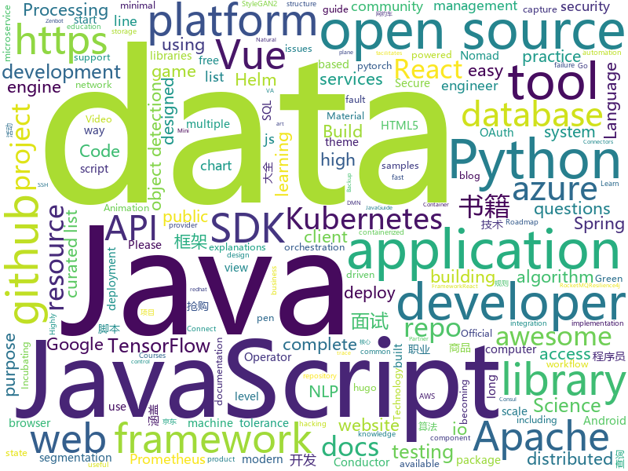

# 2020-12-09
See what the GitHub community is most excited about.

## python
+ [Depix](https://github.com/beurtschipper/Depix)(**1,650 stars today**): Recovers passwords from pixelized screenshots
+ [iPERCore](https://github.com/iPERDance/iPERCore)(**68 stars today**): Liquid Warping GAN with Attention: A Unified Framework for Human Image Synthesis
+ [hue](https://github.com/cloudera/hue)(**367 stars today**): Hue Editor: Open source SQL Query Assistant for Databases/Warehouses
+ [tinygrad](https://github.com/geohot/tinygrad)(**160 stars today**): You like pytorch? You like micrograd? You love tinygrad!❤️
+ [arXiv2020-RIFE](https://github.com/hzwer/arXiv2020-RIFE)(**18 stars today**): RIFE: Real Time Video Frame Rate Enhancement
+ [azure-sdk-for-python](https://github.com/Azure/azure-sdk-for-python)(**3 stars today**): This repository is for active development of the Azure SDK for Python. For consumers of the SDK we recommend visiting our public developer docs at https://docs.microsoft.com/en-us/python/azure/ or our versioned developer docs at https://azure.github.io/azure-sdk-for-python.
+ [detectron2](https://github.com/facebookresearch/detectron2)(**41 stars today**): Detectron2 is FAIR's next-generation platform for object detection and segmentation.
+ [jd-assistant](https://github.com/tychxn/jd-assistant)(**73 stars today**): 京东抢购助手：包含登录，查询商品库存/价格，添加/清空购物车，抢购商品(下单)，查询订单等功能
+ [mne-python](https://github.com/mne-tools/mne-python)(**5 stars today**): MNE: Magnetoencephalography (MEG) and Electroencephalography (EEG) in Python
+ [nnUNet](https://github.com/MIC-DKFZ/nnUNet)(**45 stars today**): 
+ [python](https://github.com/kubernetes-client/python)(**9 stars today**): Official Python client library for kubernetes
+ [mmsegmentation](https://github.com/open-mmlab/mmsegmentation)(**16 stars today**): OpenMMLab Semantic Segmentation Toolbox and Benchmark.
+ [stylegan2-ada](https://github.com/NVlabs/stylegan2-ada)(**53 stars today**): StyleGAN2 with adaptive discriminator augmentation (ADA) - Official TensorFlow implementation
+ [keras](https://github.com/keras-team/keras)(**18 stars today**): Deep Learning for humans
+ [frappe](https://github.com/frappe/frappe)(**6 stars today**): Low Code Open Source Framework in Python and JS
+ [horovod](https://github.com/horovod/horovod)(**18 stars today**): Distributed training framework for TensorFlow, Keras, PyTorch, and Apache MXNet.
+ [faker](https://github.com/joke2k/faker)(**19 stars today**): Faker is a Python package that generates fake data for you.
+ [python-cheatsheet](https://github.com/gto76/python-cheatsheet)(**160 stars today**): Comprehensive Python Cheatsheet
+ [EasyTransfer](https://github.com/alibaba/EasyTransfer)(**23 stars today**): EasyTransfer is designed to make the development of transfer learning in NLP applications easier.
+ [stylegan2](https://github.com/NVlabs/stylegan2)(**14 stars today**): StyleGAN2 - Official TensorFlow Implementation
+ [TensorFlow-Object-Detection-API-Tutorial-Train-Multiple-Objects-Windows-10](https://github.com/EdjeElectronics/TensorFlow-Object-Detection-API-Tutorial-Train-Multiple-Objects-Windows-10)(**7 stars today**): How to train a TensorFlow Object Detection Classifier for multiple object detection on Windows
+ [gunicorn](https://github.com/benoitc/gunicorn)(**6 stars today**): gunicorn 'Green Unicorn' is a WSGI HTTP Server for UNIX, fast clients and sleepy applications.
+ [incubator-superset](https://github.com/apache/incubator-superset)(**30 stars today**): Apache Superset is a Data Visualization and Data Exploration Platform
+ [NLP-progress](https://github.com/sebastianruder/NLP-progress)(**18 stars today**): Repository to track the progress in Natural Language Processing (NLP), including the datasets and the current state-of-the-art for the most common NLP tasks.
+ [moto](https://github.com/spulec/moto)(**9 stars today**): A library that allows you to easily mock out tests based on AWS infrastructure.

## java
+ [online-taxi](https://github.com/yueyi2019/online-taxi)(**116 stars today**): 网约车项目
+ [tutorials](https://github.com/eugenp/tutorials)(**35 stars today**): Just Announced - "Learn Spring Security OAuth":
+ [conductor](https://github.com/Netflix/conductor)(**4 stars today**): Conductor is a microservices orchestration engine - https://netflix.github.io/conductor/
+ [incubator-pinot](https://github.com/apache/incubator-pinot)(**8 stars today**): Apache Pinot (Incubating) - A realtime distributed OLAP datastore
+ [elasticsearch](https://github.com/elastic/elasticsearch)(**31 stars today**): Open Source, Distributed, RESTful Search Engine
+ [react-native-video](https://github.com/react-native-video/react-native-video)(**8 stars today**): A <Video /> component for react-native
+ [generator](https://github.com/mybatis/generator)(**13 stars today**): A code generator for MyBatis.
+ [nuxeo](https://github.com/nuxeo/nuxeo)(**0 stars today**): Content management platform to build modern business applications
+ [camunda-bpm-platform](https://github.com/camunda/camunda-bpm-platform)(**7 stars today**): Flexible framework for workflow and decision automation with BPMN and DMN. Integration with Spring, Spring Boot, CDI.
+ [AppAuth-Android](https://github.com/openid/AppAuth-Android)(**9 stars today**): Android client SDK for communicating with OAuth 2.0 and OpenID Connect providers.
+ [jdk](https://github.com/openjdk/jdk)(**40 stars today**): JDK main-line development
+ [caffeine](https://github.com/ben-manes/caffeine)(**24 stars today**): A high performance caching library for Java 8
+ [Hystrix](https://github.com/Netflix/Hystrix)(**13 stars today**): Hystrix is a latency and fault tolerance library designed to isolate points of access to remote systems, services and 3rd party libraries, stop cascading failure and enable resilience in complex distributed systems where failure is inevitable.
+ [MPAndroidChart](https://github.com/PhilJay/MPAndroidChart)(**92 stars today**): A powerful🚀Android chart view / graph view library, supporting line- bar- pie- radar- bubble- and candlestick charts as well as scaling, panning and animations.
+ [flink-cdc-connectors](https://github.com/ververica/flink-cdc-connectors)(**6 stars today**): Change Data Capture (CDC) Connectors for Apache Flink
+ [ballerina-lang](https://github.com/ballerina-platform/ballerina-lang)(**6 stars today**): The Ballerina Programming Language
+ [ksql](https://github.com/confluentinc/ksql)(**3 stars today**): The event streaming database purpose-built for stream processing applications
+ [libsvm](https://github.com/cjlin1/libsvm)(**5 stars today**): 
+ [hudi](https://github.com/apache/hudi)(**6 stars today**): Upserts, Deletes And Incremental Processing on Big Data.
+ [rocketmq](https://github.com/apache/rocketmq)(**35 stars today**): Mirror of Apache RocketMQ
+ [resilience4j](https://github.com/resilience4j/resilience4j)(**18 stars today**): Resilience4j is a fault tolerance library designed for Java8 and functional programming
+ [dbeaver](https://github.com/dbeaver/dbeaver)(**39 stars today**): Free universal database tool and SQL client
+ [jenkins](https://github.com/jenkinsci/jenkins)(**5 stars today**): Jenkins automation server
+ [debezium](https://github.com/debezium/debezium)(**15 stars today**): Change data capture for a variety of databases. Please log issues at https://issues.redhat.com/browse/DBZ.
+ [JavaGuide](https://github.com/Snailclimb/JavaGuide)(**181 stars today**): 「Java学习+面试指南」一份涵盖大部分 Java 程序员所需要掌握的核心知识。准备 Java 面试，首选 JavaGuide！

## unknown
+ [ms-teams-rce](https://github.com/oskarsve/ms-teams-rce)(**436 stars today**): 
+ [Profiles](https://github.com/DivineEngine/Profiles)(**77 stars today**): 🌐Dial-up Internet access
+ [architect-awesome](https://github.com/xingshaocheng/architect-awesome)(**324 stars today**): 后端架构师技术图谱
+ [roadmap](https://github.com/github/roadmap)(**43 stars today**): GitHub public roadmap
+ [coding-interview-university](https://github.com/jwasham/coding-interview-university)(**337 stars today**): A complete computer science study plan to become a software engineer.
+ [developer-roadmap](https://github.com/kamranahmedse/developer-roadmap)(**360 stars today**): Roadmap to becoming a web developer in 2020
+ [awesome-cs-books](https://github.com/imarvinle/awesome-cs-books)(**161 stars today**): 经典编程书籍大全，涵盖：计算机系统与网络、系统架构、算法与数据结构、前端开发、后端开发、移动开发、数据库、测试、项目与团队、程序员职业修炼、求职面试等
+ [data-engineer-roadmap](https://github.com/datastacktv/data-engineer-roadmap)(**27 stars today**): Roadmap to becoming a data engineer in 2020
+ [foundation-faq-2020](https://github.com/rust-lang/foundation-faq-2020)(**50 stars today**): Have questions on the Rust Foundation? Ask here!
+ [selling-partner-api-docs](https://github.com/amzn/selling-partner-api-docs)(**43 stars today**): This repository contains documentation for developers to use to call Selling Partner APIs.
+ [forum](https://github.com/frontendbr/forum)(**27 stars today**): 🍺Portando discussões feitas em grupos (Facebook, Google Groups, Slack, Disqus) para o GitHub Discussions
+ [awesome-algorithms](https://github.com/tayllan/awesome-algorithms)(**38 stars today**): A curated list of awesome places to learn and/or practice algorithms.
+ [gpt-3](https://github.com/openai/gpt-3)(**28 stars today**): GPT-3: Language Models are Few-Shot Learners
+ [DescomplicandoKubernetes](https://github.com/badtuxx/DescomplicandoKubernetes)(**8 stars today**): 
+ [awesome-vue](https://github.com/vuejs/awesome-vue)(**43 stars today**): 🎉A curated list of awesome things related to Vue.js
+ [YubiKey-Guide](https://github.com/drduh/YubiKey-Guide)(**12 stars today**): Guide to using YubiKey for GPG and SSH
+ [hacker-roadmap](https://github.com/sundowndev/hacker-roadmap)(**12 stars today**): 📌Your beginner pen-testing start guide. A guide for amateur pen testers and a collection of hacking tools, resources and references to practice ethical hacking and web security.
+ [data-science](https://github.com/ossu/data-science)(**8 stars today**): 📊Path to a free self-taught education in Data Science!
+ [awesome-java-books](https://github.com/sorenduan/awesome-java-books)(**24 stars today**): Java开发者技术书籍大全 - Java入门书籍，Java基础及进阶书籍，框架与中间件，架构设计，设计模式，数学与算法，JVM周边语言，项目管理&领导力&流程，职业素养与个人成长，格局与视野，面试参考书等。
+ [awesome](https://github.com/sindresorhus/awesome)(**212 stars today**): 😎Awesome lists about all kinds of interesting topics
+ [kubernetes-the-hard-way](https://github.com/kelseyhightower/kubernetes-the-hard-way)(**33 stars today**): Bootstrap Kubernetes the hard way on Google Cloud Platform. No scripts.
+ [Best-websites-a-programmer-should-visit](https://github.com/sdmg15/Best-websites-a-programmer-should-visit)(**25 stars today**): 🔗Some useful websites for programmers.
+ [build-your-own-x](https://github.com/danistefanovic/build-your-own-x)(**112 stars today**): 🤓Build your own (insert technology here)
+ [javascript-questions](https://github.com/lydiahallie/javascript-questions)(**82 stars today**): A long list of (advanced) JavaScript questions, and their explanations✨
+ [awesome-production-machine-learning](https://github.com/EthicalML/awesome-production-machine-learning)(**41 stars today**): A curated list of awesome open source libraries to deploy, monitor, version and scale your machine learning

## javascript
+ [javascript-algorithms](https://github.com/trekhleb/javascript-algorithms)(**193 stars today**): 📝Algorithms and data structures implemented in JavaScript with explanations and links to further readings
+ [mapbox-gl-js](https://github.com/mapbox/mapbox-gl-js)(**39 stars today**): Interactive, thoroughly customizable maps in the browser, powered by vector tiles and WebGL
+ [procedural-gl-js](https://github.com/felixpalmer/procedural-gl-js)(**128 stars today**): 3D mapping engine for the web
+ [github-readme-stats](https://github.com/anuraghazra/github-readme-stats)(**109 stars today**): ⚡Dynamically generated stats for your github readmes
+ [cypress](https://github.com/cypress-io/cypress)(**50 stars today**): Fast, easy and reliable testing for anything that runs in a browser.
+ [odoo](https://github.com/odoo/odoo)(**25 stars today**): Odoo. Open Source Apps To Grow Your Business.
+ [chrome-extensions-samples](https://github.com/GoogleChrome/chrome-extensions-samples)(**23 stars today**): Chrome Extensions Samples
+ [vuex](https://github.com/vuejs/vuex)(**16 stars today**): 🗃️Centralized State Management for Vue.js.
+ [ios_rule_script](https://github.com/blackmatrix7/ios_rule_script)(**105 stars today**): iOS平台的分流规则、复写规则和一些自动化脚本。
+ [docs](https://github.com/github/docs)(**67 stars today**): The open-source repo for docs.github.com
+ [Index](https://github.com/HowProgrammingWorks/Index)(**3 stars today**): Metarhia educational program index📖
+ [Twake](https://github.com/TwakeApp/Twake)(**159 stars today**): Twake is a collaborative platform which improves teamwork
+ [apps-script-samples](https://github.com/googleworkspace/apps-script-samples)(**3 stars today**): Apps Script samples for Google Workspace products.
+ [taojinbi](https://github.com/JavisPeng/taojinbi)(**10 stars today**): 淘宝双12活动和淘金币活动，脚本兼容
+ [QuantumultX](https://github.com/Orz-3/QuantumultX)(**23 stars today**): 
+ [handsontable](https://github.com/handsontable/handsontable)(**19 stars today**): Handsontable is a JavaScript/HTML5 data grid with spreadsheet look & feel. Available for React, Vue and Angular.
+ [typed.js](https://github.com/mattboldt/typed.js)(**6 stars today**): A JavaScript Typing Animation Library
+ [next.js](https://github.com/vercel/next.js)(**77 stars today**): The React Framework
+ [material-ui](https://github.com/mui-org/material-ui)(**54 stars today**): React components for faster and simpler web development. Build your own design system, or start with Material Design.
+ [taro](https://github.com/NervJS/taro)(**32 stars today**): 开放式跨端跨框架解决方案，支持使用 React/Vue/Nerv 等框架来开发微信/京东/百度/支付宝/字节跳动/ QQ 小程序/H5 等应用。 https://taro.zone/
+ [engine](https://github.com/cocos-creator/engine)(**14 stars today**): Cocos Creator is a complete package of game development tools and workflow, including a game engine, resource management, scene editing, game preview, debug and publish one project to multiple platforms.
+ [bootstrap](https://github.com/twbs/bootstrap)(**54 stars today**): The most popular HTML, CSS, and JavaScript framework for developing responsive, mobile first projects on the web.
+ [The-API-Book](https://github.com/twirl/The-API-Book)(**32 stars today**): ‘The API’ book by Sergey Konstantinov
+ [vue-cli](https://github.com/vuejs/vue-cli)(**18 stars today**): 🛠️Standard Tooling for Vue.js Development
+ [devconnector_2.0](https://github.com/bradtraversy/devconnector_2.0)(**0 stars today**): Social network for developers, built on the MERN stack

## html
+ [school-of-sre](https://github.com/linkedin/school-of-sre)(**1,178 stars today**): At LinkedIn, we are using this curriculum for onboarding our entry level talents into the SRE role.
+ [en.javascript.info](https://github.com/javascript-tutorial/en.javascript.info)(**368 stars today**): Modern JavaScript Tutorial
+ [html-css](https://github.com/gustavoguanabara/html-css)(**16 stars today**): Curso de HTML5 e CSS3
+ [charts](https://github.com/bitnami/charts)(**18 stars today**): Helm Charts
+ [azureclass](https://github.com/elbuenizzy/azureclass)(**36 stars today**): 
+ [amundsen](https://github.com/amundsen-io/amundsen)(**10 stars today**): Amundsen is a metadata driven application for improving the productivity of data analysts, data scientists and engineers when interacting with data.
+ [free-for-dev](https://github.com/ripienaar/free-for-dev)(**85 stars today**): A list of SaaS, PaaS and IaaS offerings that have free tiers of interest to devops and infradev
+ [REKCARC-TSC-UHT](https://github.com/PKUanonym/REKCARC-TSC-UHT)(**25 stars today**): 清华大学计算机系课程攻略 Guidance for courses in Department of Computer Science and Technology, Tsinghua University
+ [website](https://github.com/kubernetes/website)(**6 stars today**): Kubernetes website and documentation repo:
+ [va.gov-team](https://github.com/department-of-veterans-affairs/va.gov-team)(**0 stars today**): Public resources for building on and in support of VA.gov. Visit complete Knowledge Hub:
+ [django-DefectDojo](https://github.com/DefectDojo/django-DefectDojo)(**6 stars today**): DefectDojo is an open-source application vulnerability correlation and security orchestration tool.
+ [openshift-docs](https://github.com/openshift/openshift-docs)(**1 stars today**): OpenShift 3 and 4 product and community documentation
+ [tiny-slider](https://github.com/ganlanyuan/tiny-slider)(**12 stars today**): Vanilla javascript slider for all purposes.
+ [zenbot](https://github.com/DeviaVir/zenbot)(**2 stars today**): Zenbot is a command-line cryptocurrency trading bot using Node.js and MongoDB.
+ [hugo-coder](https://github.com/luizdepra/hugo-coder)(**6 stars today**): A minimalist blog theme for hugo.
+ [datasciencecoursera](https://github.com/mGalarnyk/datasciencecoursera)(**2 stars today**): Data Science Repo and blog for John Hopkins Coursera Courses. Please let me know if you have any questions.
+ [helm-charts](https://github.com/jenkinsci/helm-charts)(**1 stars today**): Jenkins community Helm charts
+ [harbor-helm](https://github.com/goharbor/harbor-helm)(**2 stars today**): The helm chart to deploy Harbor
+ [argo-helm](https://github.com/argoproj/argo-helm)(**0 stars today**): ArgoProj Helm Charts
+ [Spoon-Knife](https://github.com/octocat/Spoon-Knife)(**2 stars today**): This repo is for demonstration purposes only.
+ [computer-science-flash-cards](https://github.com/jwasham/computer-science-flash-cards)(**8 stars today**): Mini website for testing both general CS knowledge and enforce coding practice and common algorithm/data structure memorization.
+ [docker-development-youtube-series](https://github.com/marcel-dempers/docker-development-youtube-series)(**9 stars today**): 
+ [hermit](https://github.com/Track3/hermit)(**2 stars today**): A minimal & fast Hugo theme for bloggers
+ [ai-edu](https://github.com/microsoft/ai-edu)(**13 stars today**): AI education materials for Chinese students, teachers and IT professionals.
+ [core](https://github.com/stackblitz/core)(**5 stars today**): Online IDE powered by Visual Studio Code⚡️

## go
+ [crowdsec](https://github.com/crowdsecurity/crowdsec)(**104 stars today**): Crowdsec - An open-source, lightweight agent to detect and respond to bad behaviours. It also automatically benefits from our global community-wide IP reputation database.
+ [thanos](https://github.com/thanos-io/thanos)(**216 stars today**): Highly available Prometheus setup with long term storage capabilities. A CNCF Incubating project.
+ [go-git](https://github.com/go-git/go-git)(**32 stars today**): A highly extensible Git implementation in pure Go.
+ [nomad](https://github.com/hashicorp/nomad)(**42 stars today**): Nomad is an easy-to-use, flexible, and performant workload orchestrator that can deploy a mix of microservice, batch, containerized, and non-containerized applications. Nomad is easy to operate and scale and has native Consul and Vault integrations.
+ [prometheus-operator](https://github.com/prometheus-operator/prometheus-operator)(**7 stars today**): Prometheus Operator creates/configures/manages Prometheus clusters atop Kubernetes
+ [k3s](https://github.com/k3s-io/k3s)(**30 stars today**): Lightweight Kubernetes
+ [chainlink](https://github.com/smartcontractkit/chainlink)(**3 stars today**): node of the decentralized oracle network, bridging on and off-chain computation
+ [buildah](https://github.com/containers/buildah)(**35 stars today**): A tool that facilitates building OCI images
+ [yaml](https://github.com/go-yaml/yaml)(**76 stars today**): YAML support for the Go language.
+ [velero](https://github.com/vmware-tanzu/velero)(**91 stars today**): Backup and migrate Kubernetes applications and their persistent volumes
+ [micro](https://github.com/micro/micro)(**28 stars today**): Micro is a platform for API driven services development
+ [tempo](https://github.com/grafana/tempo)(**18 stars today**): Grafana Tempo is a high volume, minimal dependency trace storage.
+ [istio](https://github.com/istio/istio)(**36 stars today**): Connect, secure, control, and observe services.
+ [terraform-provider-azurerm](https://github.com/terraform-providers/terraform-provider-azurerm)(**3 stars today**): Terraform provider for Azure Resource Manager
+ [terraform-provider-aws](https://github.com/hashicorp/terraform-provider-aws)(**9 stars today**): Terraform AWS provider
+ [descheduler](https://github.com/kubernetes-sigs/descheduler)(**6 stars today**): Descheduler for Kubernetes
+ [go-control-plane](https://github.com/envoyproxy/go-control-plane)(**8 stars today**): Go implementation of data-plane-api
+ [MailHog](https://github.com/mailhog/MailHog)(**26 stars today**): Web and API based SMTP testing
+ [node_exporter](https://github.com/prometheus/node_exporter)(**10 stars today**): Exporter for machine metrics
+ [cri-tools](https://github.com/kubernetes-sigs/cri-tools)(**11 stars today**): CLI and validation tools for Kubelet Container Runtime Interface (CRI) .
+ [go-grpc-middleware](https://github.com/grpc-ecosystem/go-grpc-middleware)(**14 stars today**): Golang gRPC Middlewares: interceptor chaining, auth, logging, retries and more.
+ [teleport](https://github.com/gravitational/teleport)(**5 stars today**): Secure Access for Developers that doesn't get in the way.
+ [operator-sdk](https://github.com/operator-framework/operator-sdk)(**10 stars today**): SDK for building Kubernetes applications. Provides high level APIs, useful abstractions, and project scaffolding.
+ [argo-cd](https://github.com/argoproj/argo-cd)(**14 stars today**): Declarative continuous deployment for Kubernetes.
+ [flagger](https://github.com/weaveworks/flagger)(**8 stars today**): Progressive delivery Kubernetes operator (Canary, A/B Testing and Blue/Green deployments)

## WordCloud

