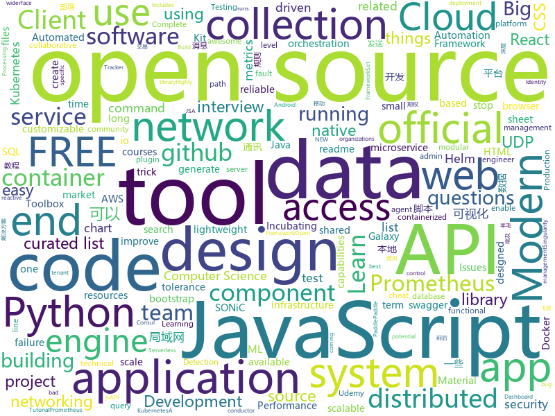

# 2020-12-10
See what the GitHub community is most excited about.

## python
+ [PaddleX](https://github.com/PaddlePaddle/PaddleX)(**64 stars today**): PaddlePaddle End-to-End Development Toolkit（『飞桨』深度学习全流程开发工具）
+ [Automatic-Udemy-Course-Enroller-GET-PAID-UDEMY-COURSES-for-FREE](https://github.com/aapatre/Automatic-Udemy-Course-Enroller-GET-PAID-UDEMY-COURSES-for-FREE)(**13 stars today**): Do you want to LEARN NEW STUFF for FREE? Don't worry, with the power of web-scraping and automation, this script will find the necessary Udemy coupons & enroll you for PAID UDEMY COURSES, ABSOLUTELY FREE!
+ [system-design-primer](https://github.com/donnemartin/system-design-primer)(**161 stars today**): Learn how to design large-scale systems. Prep for the system design interview. Includes Anki flashcards.
+ [hue](https://github.com/cloudera/hue)(**166 stars today**): Hue Editor: Open source SQL Query Assistant for Databases/Warehouses
+ [dirsearch](https://github.com/maurosoria/dirsearch)(**15 stars today**): Web path scanner
+ [frappe](https://github.com/frappe/frappe)(**6 stars today**): Low Code Open Source Framework in Python and JS
+ [capa](https://github.com/fireeye/capa)(**20 stars today**): The FLARE team's open-source tool to identify capabilities in executable files.
+ [romantic-alexa](https://github.com/ProgrammingHero1/romantic-alexa)(**10 stars today**): 
+ [AdelaiDet](https://github.com/aim-uofa/AdelaiDet)(**27 stars today**): AdelaiDet is an open source toolbox for multiple instance-level detection and recognition tasks.
+ [galaxy-integrations-python-api](https://github.com/gogcom/galaxy-integrations-python-api)(**6 stars today**): NOTE: Please report here only issues related to the python API. Issues and general feedback regarding the Galaxy Client 2.0 shall be sent via Galaxy Client menu
+ [python-cheatsheet](https://github.com/gto76/python-cheatsheet)(**100 stars today**): Comprehensive Python Cheatsheet
+ [pipelines](https://github.com/kubeflow/pipelines)(**4 stars today**): Machine Learning Pipelines for Kubeflow
+ [faker](https://github.com/joke2k/faker)(**15 stars today**): Faker is a Python package that generates fake data for you.
+ [QUANTAXIS](https://github.com/QUANTAXIS/QUANTAXIS)(**58 stars today**): QUANTAXIS 支持任务调度 分布式部署的 股票/期货/期权/港股/虚拟货币 数据/回测/模拟/交易/可视化/多账户 纯本地量化解决方案
+ [impacket](https://github.com/SecureAuthCorp/impacket)(**20 stars today**): Impacket is a collection of Python classes for working with network protocols.
+ [stylegan2-ada](https://github.com/NVlabs/stylegan2-ada)(**24 stars today**): StyleGAN2 with adaptive discriminator augmentation (ADA) - Official TensorFlow implementation
+ [tfx](https://github.com/tensorflow/tfx)(**6 stars today**): TFX is an end-to-end platform for deploying production ML pipelines
+ [nnUNet](https://github.com/MIC-DKFZ/nnUNet)(**20 stars today**): 
+ [boto3](https://github.com/boto/boto3)(**7 stars today**): AWS SDK for Python
+ [hummingbot](https://github.com/CoinAlpha/hummingbot)(**3 stars today**): Hummingbot: a client for crypto market making
+ [PyTorch-GAN](https://github.com/eriklindernoren/PyTorch-GAN)(**26 stars today**): PyTorch implementations of Generative Adversarial Networks.
+ [Pytorch_Retinaface](https://github.com/biubug6/Pytorch_Retinaface)(**5 stars today**): Retinaface get 80.99% in widerface hard val using mobilenet0.25.
+ [localstack](https://github.com/localstack/localstack)(**30 stars today**): 💻A fully functional local AWS cloud stack. Develop and test your cloud & Serverless apps offline!
+ [iPERCore](https://github.com/iPERDance/iPERCore)(**32 stars today**): Liquid Warping GAN with Attention: A Unified Framework for Human Image Synthesis
+ [OpenPCDet](https://github.com/open-mmlab/OpenPCDet)(**8 stars today**): OpenPCDet Toolbox for LiDAR-based 3D Object Detection.

## java
+ [tutorials](https://github.com/eugenp/tutorials)(**23 stars today**): Just Announced - "Learn Spring Security OAuth":
+ [presto](https://github.com/prestodb/presto)(**9 stars today**): The official home of the Presto distributed SQL query engine for big data
+ [spring-framework](https://github.com/spring-projects/spring-framework)(**43 stars today**): Spring Framework
+ [elasticsearch](https://github.com/elastic/elasticsearch)(**35 stars today**): Open Source, Distributed, RESTful Search Engine
+ [lancomm](https://github.com/fighter-lee/lancomm)(**31 stars today**): Android局域网通讯，基于UDP和TCP封装的局域网通讯协议框架，处于同一个局域网下的设备，可以相互发现，可以发送广播消息，可以发送点对点消息。
+ [material-components-android](https://github.com/material-components/material-components-android)(**19 stars today**): Modular and customizable Material Design UI components for Android
+ [incubator-pinot](https://github.com/apache/incubator-pinot)(**9 stars today**): Apache Pinot (Incubating) - A realtime distributed OLAP datastore
+ [lucene-solr](https://github.com/apache/lucene-solr)(**8 stars today**): Apache Lucene and Solr open-source search software
+ [strimzi-kafka-operator](https://github.com/strimzi/strimzi-kafka-operator)(**3 stars today**): Apache Kafka running on Kubernetes
+ [karate](https://github.com/intuit/karate)(**8 stars today**): Test Automation Made Simple
+ [Hystrix](https://github.com/Netflix/Hystrix)(**18 stars today**): Hystrix is a latency and fault tolerance library designed to isolate points of access to remote systems, services and 3rd party libraries, stop cascading failure and enable resilience in complex distributed systems where failure is inevitable.
+ [hudi](https://github.com/apache/hudi)(**9 stars today**): Upserts, Deletes And Incremental Processing on Big Data.
+ [keycloak](https://github.com/keycloak/keycloak)(**14 stars today**): Open Source Identity and Access Management For Modern Applications and Services
+ [hive](https://github.com/apache/hive)(**5 stars today**): Apache Hive
+ [spring-security](https://github.com/spring-projects/spring-security)(**10 stars today**): Spring Security
+ [calcite](https://github.com/apache/calcite)(**1 stars today**): Apache Calcite
+ [vert.x](https://github.com/eclipse-vertx/vert.x)(**14 stars today**): Vert.x is a tool-kit for building reactive applications on the JVM
+ [quarkus](https://github.com/quarkusio/quarkus)(**13 stars today**): Quarkus: Supersonic Subatomic Java.
+ [jedis](https://github.com/redis/jedis)(**9 stars today**): A blazingly small and sane redis java client
+ [disruptor](https://github.com/LMAX-Exchange/disruptor)(**7 stars today**): High Performance Inter-Thread Messaging Library
+ [mlkit](https://github.com/googlesamples/mlkit)(**8 stars today**): A collection of sample apps to demonstrate how to use Google's ML Kit APIs on Android and iOS
+ [conductor](https://github.com/Netflix/conductor)(**6 stars today**): Conductor is a microservices orchestration engine - https://netflix.github.io/conductor/
+ [react-native-camera](https://github.com/react-native-camera/react-native-camera)(**2 stars today**): A Camera component for React Native. Also supports barcode scanning!
+ [resilience4j](https://github.com/resilience4j/resilience4j)(**12 stars today**): Resilience4j is a fault tolerance library designed for Java8 and functional programming
+ [aeron](https://github.com/real-logic/aeron)(**5 stars today**): Efficient reliable UDP unicast, UDP multicast, and IPC message transport

## unknown
+ [css-in-readme-like-wat](https://github.com/sindresorhus/css-in-readme-like-wat)(**1,534 stars today**): Style your readme using CSS with this simple trick
+ [architect-awesome](https://github.com/xingshaocheng/architect-awesome)(**376 stars today**): 后端架构师技术图谱
+ [awesome-cs-books](https://github.com/imarvinle/awesome-cs-books)(**147 stars today**): 经典编程书籍大全，涵盖：计算机系统与网络、系统架构、算法与数据结构、前端开发、后端开发、移动开发、数据库、测试、项目与团队、程序员职业修炼、求职面试等
+ [Profiles](https://github.com/DivineEngine/Profiles)(**69 stars today**): 🌐Dial-up Internet access
+ [market-toolkit](https://github.com/ckz8780/market-toolkit)(**23 stars today**): A collection of stock market resources and tools
+ [universe2020](https://github.com/githubevents/universe2020)(**73 stars today**): All things GitHub Universe 2020!
+ [cs-video-courses](https://github.com/Developer-Y/cs-video-courses)(**13 stars today**): List of Computer Science courses with video lectures.
+ [redteam_vul](https://github.com/r0eXpeR/redteam_vul)(**201 stars today**): 红队作战中比较常遇到的一些重点系统漏洞整理。
+ [bugbounty-cheatsheet](https://github.com/EdOverflow/bugbounty-cheatsheet)(**5 stars today**): A list of interesting payloads, tips and tricks for bug bounty hunters.
+ [rocky](https://github.com/hpcng/rocky)(**1,572 stars today**): 
+ [interview](https://github.com/Olshansk/interview)(**97 stars today**): Everything you need to prepare for your technical interview
+ [Go-000](https://github.com/Go-000/Go-000)(**11 stars today**): 
+ [github-university-2020](https://github.com/education/github-university-2020)(**23 stars today**): 
+ [roadmap](https://github.com/github/roadmap)(**46 stars today**): GitHub public roadmap
+ [frontend-development](https://github.com/mojpm/frontend-development)(**26 stars today**): A curated list of resources for Frontend development
+ [every-programmer-should-know](https://github.com/mtdvio/every-programmer-should-know)(**26 stars today**): A collection of (mostly) technical things every software developer should know about
+ [awesome-actions](https://github.com/sdras/awesome-actions)(**54 stars today**): A curated list of awesome actions to use on GitHub
+ [Red-Teaming-Toolkit](https://github.com/infosecn1nja/Red-Teaming-Toolkit)(**13 stars today**): A collection of open source and commercial tools that aid in red team operations.
+ [applied-ml](https://github.com/eugeneyan/applied-ml)(**15 stars today**): 📚Papers by organizations sharing their work on applied data science & machine learning.
+ [docker-cheat-sheet](https://github.com/wsargent/docker-cheat-sheet)(**13 stars today**): Docker Cheat Sheet
+ [computer-science](https://github.com/ossu/computer-science)(**75 stars today**): 🎓Path to a free self-taught education in Computer Science!
+ [awesome-vue](https://github.com/vuejs/awesome-vue)(**48 stars today**): 🎉A curated list of awesome things related to Vue.js
+ [pix-api](https://github.com/bacen/pix-api)(**7 stars today**): API Pix: a API do Arranjo de Pagamentos Instantâneos Brasileiro.
+ [coding-interview-university](https://github.com/jwasham/coding-interview-university)(**252 stars today**): A complete computer science study plan to become a software engineer.
+ [Flutter-Course-Resources](https://github.com/londonappbrewery/Flutter-Course-Resources)(**9 stars today**): Learn to Code While Building Apps - The Complete Flutter Development Bootcamp

## javascript
+ [mapbox-gl-js](https://github.com/mapbox/mapbox-gl-js)(**43 stars today**): Interactive, thoroughly customizable maps in the browser, powered by vector tiles and WebGL
+ [cypress](https://github.com/cypress-io/cypress)(**34 stars today**): Fast, easy and reliable testing for anything that runs in a browser.
+ [javascript-algorithms](https://github.com/trekhleb/javascript-algorithms)(**330 stars today**): 📝Algorithms and data structures implemented in JavaScript with explanations and links to further readings
+ [material-ui](https://github.com/mui-org/material-ui)(**39 stars today**): React components for faster and simpler web development. Build your own design system, or start with Material Design.
+ [uPlot](https://github.com/leeoniya/uPlot)(**143 stars today**): 📈A small, fast chart for time series, lines, areas, ohlc & bars
+ [ios_rule_script](https://github.com/blackmatrix7/ios_rule_script)(**74 stars today**): iOS平台的分流规则、复写规则和一些自动化脚本。
+ [next.js](https://github.com/vercel/next.js)(**61 stars today**): The React Framework
+ [create-react-app](https://github.com/facebook/create-react-app)(**35 stars today**): Set up a modern web app by running one command.
+ [iDataV](https://github.com/yyhsong/iDataV)(**29 stars today**): 大屏数据可视化 Big screen data visualization demo
+ [jd_scripts](https://github.com/lxk0301/jd_scripts)(**64 stars today**): 京东薅羊毛脚本
+ [Viewers](https://github.com/OHIF/Viewers)(**4 stars today**): OHIF zero-footprint DICOM viewer and oncology specific Lesion Tracker, plus shared extension packages
+ [create-sas-app](https://github.com/Boemska/create-sas-app)(**26 stars today**): Set up a modern SAS backed web app by running just a couple of commands.
+ [Twake](https://github.com/TwakeApp/Twake)(**103 stars today**): Twake is a collaborative platform which improves teamwork
+ [lighthouse](https://github.com/GoogleChrome/lighthouse)(**15 stars today**): Automated auditing, performance metrics, and best practices for the web.
+ [plugins](https://github.com/rollup/plugins)(**11 stars today**): 🍣The one-stop shop for official Rollup plugins
+ [yapi](https://github.com/YMFE/yapi)(**73 stars today**): YApi 是一个可本地部署的、打通前后端及QA的、可视化的接口管理平台
+ [github-readme-stats](https://github.com/anuraghazra/github-readme-stats)(**79 stars today**): ⚡Dynamically generated stats for your github readmes
+ [leerob.io](https://github.com/leerob/leerob.io)(**50 stars today**): ✨My portfolio built with Next.js, MDX, Tailwind CSS, and Vercel.
+ [Rocket.Chat.ReactNative](https://github.com/RocketChat/Rocket.Chat.ReactNative)(**2 stars today**): Rocket.Chat mobile clients
+ [typed.js](https://github.com/mattboldt/typed.js)(**9 stars today**): A JavaScript Typing Animation Library
+ [reactjs-interview-questions](https://github.com/sudheerj/reactjs-interview-questions)(**22 stars today**): List of top 500 ReactJS Interview Questions & Answers....Coding exercise questions are coming soon!!
+ [BrasilAPI](https://github.com/BrasilAPI/BrasilAPI)(**20 stars today**): Vamos transformar o Brasil em uma API?
+ [enzyme](https://github.com/enzymejs/enzyme)(**4 stars today**): JavaScript Testing utilities for React
+ [procedural-gl-js](https://github.com/felixpalmer/procedural-gl-js)(**59 stars today**): 3D mapping engine for the web
+ [jsPDF](https://github.com/MrRio/jsPDF)(**21 stars today**): Client-side JavaScript PDF generation for everyone.

## html
+ [school-of-sre](https://github.com/linkedin/school-of-sre)(**945 stars today**): At LinkedIn, we are using this curriculum for onboarding our entry level talents into the SRE role.
+ [en.javascript.info](https://github.com/javascript-tutorial/en.javascript.info)(**239 stars today**): Modern JavaScript Tutorial
+ [helm-charts](https://github.com/prometheus-community/helm-charts)(**10 stars today**): Prometheus community Helm charts
+ [i-book.in_Archive](https://github.com/SaltyLeo/i-book.in_Archive)(**25 stars today**): 
+ [zh.javascript.info](https://github.com/javascript-tutorial/zh.javascript.info)(**34 stars today**): 现代 JavaScript 教程（The Modern JavaScript Tutorial）
+ [charts](https://github.com/bitnami/charts)(**14 stars today**): Helm Charts
+ [kubespray](https://github.com/kubernetes-sigs/kubespray)(**7 stars today**): Deploy a Production Ready Kubernetes Cluster
+ [amundsen](https://github.com/amundsen-io/amundsen)(**9 stars today**): Amundsen is a metadata driven application for improving the productivity of data analysts, data scientists and engineers when interacting with data.
+ [calico](https://github.com/projectcalico/calico)(**4 stars today**): Cloud native networking and network security
+ [django-DefectDojo](https://github.com/DefectDojo/django-DefectDojo)(**3 stars today**): DefectDojo is an open-source application vulnerability correlation and security orchestration tool.
+ [speedtest-rs](https://github.com/zhanghanyun/speedtest-rs)(**25 stars today**): 
+ [swagger-codegen](https://github.com/swagger-api/swagger-codegen)(**12 stars today**): swagger-codegen contains a template-driven engine to generate documentation, API clients and server stubs in different languages by parsing your OpenAPI / Swagger definition.
+ [gentelella](https://github.com/ColorlibHQ/gentelella)(**11 stars today**): Free Bootstrap 4 Admin Dashboard Template
+ [coreui-free-bootstrap-admin-template](https://github.com/coreui/coreui-free-bootstrap-admin-template)(**4 stars today**): CoreUI is free bootstrap admin template
+ [SONiC](https://github.com/Azure/SONiC)(**2 stars today**): Landing page for Software for Open Networking in the Cloud (SONiC) - http://azure.github.io/SONiC/
+ [embeddedsw](https://github.com/Xilinx/embeddedsw)(**1 stars today**): Xilinx Embedded Software (embeddedsw) Development
+ [joyful-pandas](https://github.com/datawhalechina/joyful-pandas)(**20 stars today**): Pandas中文教程
+ [html](https://github.com/whatwg/html)(**4 stars today**): HTML Standard
+ [rdkit](https://github.com/rdkit/rdkit)(**3 stars today**): The official sources for the RDKit library
+ [training-kit](https://github.com/github/training-kit)(**1 stars today**): Open source cheat sheets for Git and GitHub
+ [material-design-lite](https://github.com/google/material-design-lite)(**6 stars today**): Material Design Components in HTML/CSS/JS
+ [Front-end-Developer-Interview-Questions](https://github.com/h5bp/Front-end-Developer-Interview-Questions)(**29 stars today**): A list of helpful front-end related questions you can use to interview potential candidates, test yourself or completely ignore.
+ [keycloak-documentation](https://github.com/keycloak/keycloak-documentation)(**1 stars today**): 
+ [eks-charts](https://github.com/aws/eks-charts)(**4 stars today**): Amazon EKS Helm chart repository
+ [rellax](https://github.com/dixonandmoe/rellax)(**6 stars today**): Lightweight, vanilla javascript parallax library

## go
+ [thanos](https://github.com/thanos-io/thanos)(**178 stars today**): Highly available Prometheus setup with long term storage capabilities. A CNCF Incubating project.
+ [crowdsec](https://github.com/crowdsecurity/crowdsec)(**99 stars today**): Crowdsec - An open-source, lightweight agent to detect and respond to bad behaviours. It also automatically benefits from our global community-wide IP reputation database.
+ [terraform-provider-aws](https://github.com/hashicorp/terraform-provider-aws)(**11 stars today**): Terraform AWS provider
+ [nomad](https://github.com/hashicorp/nomad)(**148 stars today**): Nomad is an easy-to-use, flexible, and performant workload orchestrator that can deploy a mix of microservice, batch, containerized, and non-containerized applications. Nomad is easy to operate and scale and has native Consul and Vault integrations.
+ [mattermost-server](https://github.com/mattermost/mattermost-server)(**15 stars today**): Open source Slack-alternative in Golang and React - Mattermost
+ [argo-cd](https://github.com/argoproj/argo-cd)(**7 stars today**): Declarative continuous deployment for Kubernetes.
+ [influxdb](https://github.com/influxdata/influxdb)(**19 stars today**): Scalable datastore for metrics, events, and real-time analytics
+ [cortex](https://github.com/cortexproject/cortex)(**7 stars today**): A horizontally scalable, highly available, multi-tenant, long term Prometheus.
+ [podman](https://github.com/containers/podman)(**106 stars today**): Podman: A tool for managing OCI containers and pods
+ [istio](https://github.com/istio/istio)(**32 stars today**): Connect, secure, control, and observe services.
+ [prometheus-operator](https://github.com/prometheus-operator/prometheus-operator)(**28 stars today**): Prometheus Operator creates/configures/manages Prometheus clusters atop Kubernetes
+ [vault](https://github.com/hashicorp/vault)(**14 stars today**): A tool for secrets management, encryption as a service, and privileged access management
+ [singularity](https://github.com/hpcng/singularity)(**22 stars today**): Singularity: Application containers for Linux
+ [reviewdog](https://github.com/reviewdog/reviewdog)(**35 stars today**): 🐶Automated code review tool integrated with any code analysis tools regardless of programming language
+ [terratest](https://github.com/gruntwork-io/terratest)(**6 stars today**): Terratest is a Go library that makes it easier to write automated tests for your infrastructure code.
+ [argo-rollouts](https://github.com/argoproj/argo-rollouts)(**5 stars today**): Progressive Delivery for Kubernetes
+ [cli](https://github.com/docker/cli)(**5 stars today**): The Docker CLI
+ [terraform](https://github.com/hashicorp/terraform)(**27 stars today**): Terraform enables you to safely and predictably create, change, and improve infrastructure. It is an open source tool that codifies APIs into declarative configuration files that can be shared amongst team members, treated as code, edited, reviewed, and versioned.
+ [k3s](https://github.com/k3s-io/k3s)(**25 stars today**): Lightweight Kubernetes
+ [magma](https://github.com/magma/magma)(**55 stars today**): Platform for building access networks and modular network services
+ [cli](https://github.com/cli/cli)(**55 stars today**): GitHub’s official command line tool
+ [linkerd2](https://github.com/linkerd/linkerd2)(**9 stars today**): Ultralight, security-first service mesh for Kubernetes. Main repo for Linkerd 2.x.
+ [plugins](https://github.com/containernetworking/plugins)(**5 stars today**): Some reference and example networking plugins, maintained by the CNI team.
+ [moby](https://github.com/moby/moby)(**22 stars today**): Moby Project - a collaborative project for the container ecosystem to assemble container-based systems
+ [telegraf](https://github.com/influxdata/telegraf)(**11 stars today**): The plugin-driven server agent for collecting & reporting metrics.

## WordCloud

