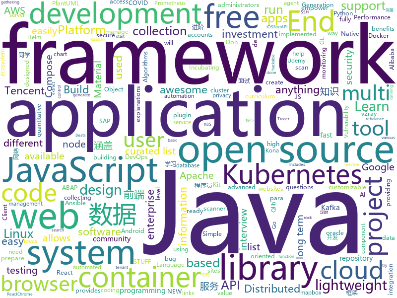

# 2020-12-11
See what the GitHub community is most excited about.

## python
+ [qlib](https://github.com/microsoft/qlib)(**668 stars today**): Qlib is an AI-oriented quantitative investment platform, which aims to realize the potential, empower the research, and create the value of AI technologies in quantitative investment. With Qlib, you can easily try your ideas to create better Quant investment strategies.
+ [consoleme](https://github.com/Netflix/consoleme)(**110 stars today**): ConsoleMe consolidates the management of multiple AWS accounts into a single interface. It allows your end-users and administrators to get credentials for your different accounts, and allows your users/administrators to manage or request cloud permissions.
+ [thetagang](https://github.com/brndnmtthws/thetagang)(**102 stars today**): ThetaGang is an IBKR bot for collecting money
+ [rengine](https://github.com/yogeshojha/rengine)(**79 stars today**): reNgine is an automated reconnaissance framework meant for information gathering during penetration testing of web applications. reNgine has customizable scan engines, which can be used to scan the websites, endpoints, and gather information.
+ [Automatic-Udemy-Course-Enroller-GET-PAID-UDEMY-COURSES-for-FREE](https://github.com/aapatre/Automatic-Udemy-Course-Enroller-GET-PAID-UDEMY-COURSES-for-FREE)(**60 stars today**): Do you want to LEARN NEW STUFF for FREE? Don't worry, with the power of web-scraping and automation, this script will find the necessary Udemy coupons & enroll you for PAID UDEMY COURSES, ABSOLUTELY FREE!
+ [system-design-primer](https://github.com/donnemartin/system-design-primer)(**242 stars today**): Learn how to design large-scale systems. Prep for the system design interview. Includes Anki flashcards.
+ [MODNet](https://github.com/ZHKKKe/MODNet)(**49 stars today**): A Trimap-Free Solution for Portrait Matting in Real Time
+ [DeFCN](https://github.com/Megvii-BaseDetection/DeFCN)(**70 stars today**): End-to-End Object Detection with Fully Convolutional Network
+ [awx](https://github.com/ansible/awx)(**11 stars today**): AWX Project
+ [mne-python](https://github.com/mne-tools/mne-python)(**3 stars today**): MNE: Magnetoencephalography (MEG) and Electroencephalography (EEG) in Python
+ [aws-cdk-examples](https://github.com/aws-samples/aws-cdk-examples)(**4 stars today**): Example projects using the AWS CDK
+ [Python](https://github.com/TheAlgorithms/Python)(**90 stars today**): All Algorithms implemented in Python
+ [oppia](https://github.com/oppia/oppia)(**4 stars today**): A free, online learning platform to make quality education accessible for all.
+ [degoogle](https://github.com/deepseagirl/degoogle)(**63 stars today**): search Google and extract results directly. skip all the click-through links and other sketchiness
+ [holehe](https://github.com/megadose/holehe)(**30 stars today**): holehe allows you to check if the mail is used on different sites like twitter, instagram and will retrieve information on sites with the forgotten password function.
+ [romantic-alexa](https://github.com/ProgrammingHero1/romantic-alexa)(**8 stars today**): 
+ [PaddleX](https://github.com/PaddlePaddle/PaddleX)(**86 stars today**): PaddlePaddle End-to-End Development Toolkit（『飞桨』深度学习全流程开发工具）
+ [horovod](https://github.com/horovod/horovod)(**9 stars today**): Distributed training framework for TensorFlow, Keras, PyTorch, and Apache MXNet.
+ [gopup](https://github.com/justinzm/gopup)(**53 stars today**): 数据接口：百度、谷歌、头条、微博指数,宏观数据，利率数据，货币汇率，千里马、独角兽公司，新闻联播文字稿，影视票房数据，高校名单，疫情数据…
+ [kivy](https://github.com/kivy/kivy)(**46 stars today**): Open source UI framework written in Python, running on Windows, Linux, macOS, Android and iOS
+ [fastapi](https://github.com/tiangolo/fastapi)(**54 stars today**): FastAPI framework, high performance, easy to learn, fast to code, ready for production
+ [compose](https://github.com/docker/compose)(**24 stars today**): Define and run multi-container applications with Docker
+ [simpletransformers](https://github.com/ThilinaRajapakse/simpletransformers)(**16 stars today**): Transformers for Classification, NER, QA, Language Modelling, Language Generation, T5, Multi-Modal, and Conversational AI
+ [PaddleGAN](https://github.com/PaddlePaddle/PaddleGAN)(**94 stars today**): PaddlePaddle GAN library and applications.
+ [awesome-python](https://github.com/vinta/awesome-python)(**146 stars today**): A curated list of awesome Python frameworks, libraries, software and resources

## java
+ [spring-boot](https://github.com/spring-projects/spring-boot)(**57 stars today**): Spring Boot
+ [react-native-camera](https://github.com/react-native-camera/react-native-camera)(**3 stars today**): A Camera component for React Native. Also supports barcode scanning!
+ [jib](https://github.com/GoogleContainerTools/jib)(**5 stars today**): 🏗Build container images for your Java applications.
+ [camel](https://github.com/apache/camel)(**4 stars today**): Apache Camel is an open source integration framework that empowers you to quickly and easily integrate various systems consuming or producing data.
+ [TencentKona-8](https://github.com/Tencent/TencentKona-8)(**25 stars today**): Tencent Kona is a no-cost, production-ready distribution of the Open Java Development Kit (OpenJDK), Long-term support(LTS) with quarterly updates. Tencent Kona serves as the default JDK internally at Tencent Cloud for cloud computing and other Java applications.
+ [testcontainers-java](https://github.com/testcontainers/testcontainers-java)(**5 stars today**): Testcontainers is a Java library that supports JUnit tests, providing lightweight, throwaway instances of common databases, Selenium web browsers, or anything else that can run in a Docker container.
+ [arthas](https://github.com/alibaba/arthas)(**31 stars today**): Alibaba Java Diagnostic Tool Arthas/Alibaba Java诊断利器Arthas
+ [COLA](https://github.com/alibaba/COLA)(**21 stars today**): Clean Object-oriented & Layered Architecture
+ [zookeeper](https://github.com/apache/zookeeper)(**14 stars today**): Apache ZooKeeper
+ [cruise-control](https://github.com/linkedin/cruise-control)(**3 stars today**): Cruise-control is the first of its kind to fully automate the dynamic workload rebalance and self-healing of a Kafka cluster. It provides great value to Kafka users by simplifying the operation of Kafka clusters.
+ [hive](https://github.com/apache/hive)(**7 stars today**): Apache Hive
+ [incubator-pinot](https://github.com/apache/incubator-pinot)(**5 stars today**): Apache Pinot (Incubating) - A realtime distributed OLAP datastore
+ [quarkus](https://github.com/quarkusio/quarkus)(**11 stars today**): Quarkus: Supersonic Subatomic Java.
+ [che](https://github.com/eclipse/che)(**2 stars today**): The Kubernetes-Native IDE for Developer Teams
+ [vert.x](https://github.com/eclipse-vertx/vert.x)(**13 stars today**): Vert.x is a tool-kit for building reactive applications on the JVM
+ [advanced-java](https://github.com/doocs/advanced-java)(**41 stars today**): 😮互联网 Java 工程师进阶知识完全扫盲：涵盖高并发、分布式、高可用、微服务、海量数据处理等领域知识，后端同学必看，前端同学也可学习
+ [resilience4j](https://github.com/resilience4j/resilience4j)(**6 stars today**): Resilience4j is a fault tolerance library designed for Java8 and functional programming
+ [guice](https://github.com/google/guice)(**2 stars today**): Guice (pronounced 'juice') is a lightweight dependency injection framework for Java 6 and above, brought to you by Google.
+ [grpc-java](https://github.com/grpc/grpc-java)(**3 stars today**): The Java gRPC implementation. HTTP/2 based RPC
+ [springfox](https://github.com/springfox/springfox)(**2 stars today**): Automated JSON API documentation for API's built with Spring
+ [zxing-android-embedded](https://github.com/journeyapps/zxing-android-embedded)(**7 stars today**): Barcode scanner library for Android, based on the ZXing decoder
+ [openpnp](https://github.com/openpnp/openpnp)(**4 stars today**): Open Source SMT Pick and Place Hardware and Software
+ [selenium](https://github.com/SeleniumHQ/selenium)(**11 stars today**): A browser automation framework and ecosystem.
+ [testing-samples](https://github.com/android/testing-samples)(**2 stars today**): A collection of samples demonstrating different frameworks and techniques for automated testing
+ [flink](https://github.com/apache/flink)(**26 stars today**): Apache Flink

## unknown
+ [rocky](https://github.com/rocky-linux/rocky)(**1,907 stars today**): Rocky Linux is a community enterprise Operating System designed to be 100% bug-for-bug compatible with Enterprise Linux created in response to the effective discontinuation of CentOS.
+ [interview](https://github.com/Olshansk/interview)(**75 stars today**): Everything you need to prepare for your technical interview
+ [how-to-secure-anything](https://github.com/veeral-patel/how-to-secure-anything)(**90 stars today**): How to systematically secure anything: a repository about security engineering
+ [kubernetes-kitap](https://github.com/mstrYoda/kubernetes-kitap)(**44 stars today**): 
+ [app-ideas](https://github.com/florinpop17/app-ideas)(**77 stars today**): A Collection of application ideas which can be used to improve your coding skills.
+ [free-programming-books](https://github.com/EbookFoundation/free-programming-books)(**150 stars today**): 📚Freely available programming books
+ [trackerslist](https://github.com/ngosang/trackerslist)(**22 stars today**): Updated list of public BitTorrent trackers
+ [Profiles](https://github.com/DivineEngine/Profiles)(**80 stars today**): 🌐Dial-up Internet access
+ [awesome-cs-books](https://github.com/imarvinle/awesome-cs-books)(**106 stars today**): 经典编程书籍大全，涵盖：计算机系统与网络、系统架构、算法与数据结构、前端开发、后端开发、移动开发、数据库、测试、项目与团队、程序员职业修炼、求职面试等
+ [ToolsOfTheTrade](https://github.com/cjbarber/ToolsOfTheTrade)(**11 stars today**): Tools of The Trade, from Hacker News.
+ [architect-awesome](https://github.com/xingshaocheng/architect-awesome)(**164 stars today**): 后端架构师技术图谱
+ [everyone-can-use-english](https://github.com/xiaolai/everyone-can-use-english)(**29 stars today**): 人人都能用英语
+ [Flutter-Course-Resources](https://github.com/londonappbrewery/Flutter-Course-Resources)(**7 stars today**): Learn to Code While Building Apps - The Complete Flutter Development Bootcamp
+ [nzcovidtracer-docs](https://github.com/minhealthnz/nzcovidtracer-docs)(**9 stars today**): Information about the technology and architecture of the NZ COVID Tracer app
+ [C4-PlantUML](https://github.com/plantuml-stdlib/C4-PlantUML)(**2 stars today**): C4-PlantUML combines the benefits of PlantUML and the C4 model for providing a simple way of describing and communicate software architectures
+ [awesome-NeRF](https://github.com/yenchenlin/awesome-NeRF)(**5 stars today**): A curated list of awesome neural radiance fields papers
+ [teched2020-DEV260](https://github.com/SAP-samples/teched2020-DEV260)(**4 stars today**): DEV260 - Build SAP Fiori Apps with the ABAP RESTful Application Programming Model
+ [awesome-privacy](https://github.com/pluja/awesome-privacy)(**14 stars today**): A curated list of services and alternatives that respect your privacy because PRIVACY MATTERS.
+ [JavaFamily](https://github.com/AobingJava/JavaFamily)(**51 stars today**): 【Java面试+Java学习指南】 一份涵盖大部分Java程序员所需要掌握的核心知识。
+ [you-dont-know-js-ru](https://github.com/azat-io/you-dont-know-js-ru)(**6 stars today**): 📚Russian translation of "You Don't Know JS" book series
+ [COVID-19](https://github.com/CSSEGISandData/COVID-19)(**12 stars today**): Novel Coronavirus (COVID-19) Cases, provided by JHU CSSE
+ [javascript-questions](https://github.com/lydiahallie/javascript-questions)(**48 stars today**): A long list of (advanced) JavaScript questions, and their explanations✨
+ [teched2020-DEV268](https://github.com/SAP-samples/teched2020-DEV268)(**1 stars today**): DEV268 - SAP Cloud Platform, ABAP Environment Connectivity and Integration
+ [vagas](https://github.com/frontendbr/vagas)(**6 stars today**): 🔬Espaço para divulgação de vagas para front-enders.

## javascript
+ [get-my-ps5](https://github.com/camtheperson/get-my-ps5)(**42 stars today**): A CLI utility to help people secure a PlayStation 5 (PS5).
+ [mapbox-gl-js](https://github.com/mapbox/mapbox-gl-js)(**137 stars today**): Interactive, thoroughly customizable maps in the browser, powered by vector tiles and WebGL
+ [cypress](https://github.com/cypress-io/cypress)(**183 stars today**): Fast, easy and reliable testing for anything that runs in a browser.
+ [angular.js](https://github.com/angular/angular.js)(**6 stars today**): AngularJS - HTML enhanced for web apps!
+ [maplibre-gl-js](https://github.com/maplibre/maplibre-gl-js)(**140 stars today**): MapLibre GL is a free and open-source fork of @mapbox/mapbox-gl
+ [javascript-algorithms](https://github.com/trekhleb/javascript-algorithms)(**421 stars today**): 📝Algorithms and data structures implemented in JavaScript with explanations and links to further readings
+ [30-seconds-of-code](https://github.com/30-seconds/30-seconds-of-code)(**77 stars today**): Short JavaScript code snippets for all your development needs
+ [tech-interview-handbook](https://github.com/yangshun/tech-interview-handbook)(**141 stars today**): 💯Materials to help you rock your next coding interview
+ [uPlot](https://github.com/leeoniya/uPlot)(**68 stars today**): 📈A small, fast chart for time series, lines, areas, ohlc & bars
+ [material-ui](https://github.com/mui-org/material-ui)(**38 stars today**): React components for faster and simpler web development. Build your own design system, or start with Material Design.
+ [axios](https://github.com/axios/axios)(**66 stars today**): Promise based HTTP client for the browser and node.js
+ [gatsby](https://github.com/gatsbyjs/gatsby)(**34 stars today**): Build blazing fast, modern apps and websites with React
+ [chrome-extensions-samples](https://github.com/GoogleChrome/chrome-extensions-samples)(**29 stars today**): Chrome Extensions Samples
+ [next.js](https://github.com/vercel/next.js)(**59 stars today**): The React Framework
+ [typed.js](https://github.com/mattboldt/typed.js)(**18 stars today**): A JavaScript Typing Animation Library
+ [freeCodeCamp](https://github.com/freeCodeCamp/freeCodeCamp)(**98 stars today**): freeCodeCamp.org's open source codebase and curriculum. Learn to code at home.
+ [Daily-Interview-Question](https://github.com/Advanced-Frontend/Daily-Interview-Question)(**27 stars today**): 我是木易杨，公众号「高级前端进阶」作者，每天搞定一道前端大厂面试题，祝大家天天进步，一年后会看到不一样的自己。
+ [budibase](https://github.com/Budibase/budibase)(**94 stars today**): 🚀Budibase is an open-source low-code development platform
+ [pkg](https://github.com/vercel/pkg)(**184 stars today**): Package your Node.js project into an executable
+ [atom](https://github.com/atom/atom)(**26 stars today**): The hackable text editor
+ [github-readme-stats](https://github.com/anuraghazra/github-readme-stats)(**119 stars today**): ⚡Dynamically generated stats for your github readmes
+ [CodeceptJS](https://github.com/codeceptjs/CodeceptJS)(**4 stars today**): Supercharged End 2 End Testing Framework for NodeJS
+ [spark-joy](https://github.com/sw-yx/spark-joy)(**49 stars today**): ✨😂easy ways to add design flair, user delight, and whimsy to your product.
+ [jsPDF](https://github.com/MrRio/jsPDF)(**17 stars today**): Client-side JavaScript PDF generation for everyone.
+ [three.js](https://github.com/mrdoob/three.js)(**51 stars today**): JavaScript 3D library.

## html
+ [school-of-sre](https://github.com/linkedin/school-of-sre)(**934 stars today**): At LinkedIn, we are using this curriculum for onboarding our entry level talents into the SRE role.
+ [v2-ui](https://github.com/sprov065/v2-ui)(**49 stars today**): 支持多协议多用户的 v2ray 面板，Support multi-protocol multi-user v2ray panel
+ [en.javascript.info](https://github.com/javascript-tutorial/en.javascript.info)(**114 stars today**): Modern JavaScript Tutorial
+ [almanac.httparchive.org](https://github.com/HTTPArchive/almanac.httparchive.org)(**2 stars today**): HTTP Archive's annual "State of the Web" report made by the web community
+ [content](https://github.com/mdn/content)(**5 stars today**): The content behind MDN Web Docs
+ [eks-charts](https://github.com/aws/eks-charts)(**1 stars today**): Amazon EKS Helm chart repository
+ [free-for-dev](https://github.com/ripienaar/free-for-dev)(**63 stars today**): A list of SaaS, PaaS and IaaS offerings that have free tiers of interest to devops and infradev
+ [django-DefectDojo](https://github.com/DefectDojo/django-DefectDojo)(**3 stars today**): DefectDojo is an open-source application vulnerability correlation and security orchestration tool.
+ [ansible-collection-hardening](https://github.com/dev-sec/ansible-collection-hardening)(**4 stars today**): This Ansible collection provides battle tested hardening for Linux, SSH, nginx, MySQL
+ [helm-charts](https://github.com/prometheus-community/helm-charts)(**7 stars today**): Prometheus community Helm charts
+ [acgimgurl](https://github.com/Suxiaoqinx/acgimgurl)(**11 stars today**): 
+ [joyful-pandas](https://github.com/datawhalechina/joyful-pandas)(**4 stars today**): Pandas中文教程
+ [awesome-compose](https://github.com/docker/awesome-compose)(**5 stars today**): Awesome Docker Compose samples
+ [embeddedsw](https://github.com/Xilinx/embeddedsw)(**0 stars today**): Xilinx Embedded Software (embeddedsw) Development
+ [charts](https://github.com/bitnami/charts)(**3 stars today**): Helm Charts
+ [html](https://github.com/whatwg/html)(**4 stars today**): HTML Standard
+ [tech-talks](https://github.com/databricks/tech-talks)(**3 stars today**): This repository contains the notebooks and presentations we use for our Databricks Tech Talks
+ [apijam](https://github.com/apigee/apijam)(**1 stars today**): GitHub repo for API Jam Workshop
+ [kubeasz](https://github.com/easzlab/kubeasz)(**5 stars today**): 使用Ansible脚本安装K8S集群，介绍组件交互原理，方便直接，不受国内网络环境影响
+ [html-css](https://github.com/gustavoguanabara/html-css)(**12 stars today**): Curso de HTML5 e CSS3
+ [icons](https://github.com/twbs/icons)(**5 stars today**): Official open source SVG icon library for Bootstrap.
+ [CKSS-Certified-Kubernetes-Security-Specialist](https://github.com/ibrahimjelliti/CKSS-Certified-Kubernetes-Security-Specialist)(**14 stars today**): This repository is a collection of resources to prepare for the Certified Kubernetes Security Specialist (CKSS) exam.
+ [DevOps-Guide](https://github.com/Tikam02/DevOps-Guide)(**5 stars today**): DevOps Guide from basic to advanced with Interview Questions and Notes🔥
+ [jamstack.org](https://github.com/jamstack/jamstack.org)(**6 stars today**): The official Jamstack site
+ [learning-library](https://github.com/oracle/learning-library)(**0 stars today**): Learning Material for Oracle Technologies

## go
+ [thanos](https://github.com/thanos-io/thanos)(**114 stars today**): Highly available Prometheus setup with long term storage capabilities. A CNCF Incubating project.
+ [kratos](https://github.com/go-kratos/kratos)(**23 stars today**): Kratos是bilibili开源的一套Go微服务框架，包含大量微服务相关框架及工具。
+ [compose-cli](https://github.com/docker/compose-cli)(**14 stars today**): Easily run your Compose application to the cloud with compose-cli
+ [argo-cd](https://github.com/argoproj/argo-cd)(**9 stars today**): Declarative continuous deployment for Kubernetes.
+ [moby](https://github.com/moby/moby)(**18 stars today**): Moby Project - a collaborative project for the container ecosystem to assemble container-based systems
+ [ent](https://github.com/facebook/ent)(**43 stars today**): An entity framework for Go
+ [cron](https://github.com/robfig/cron)(**15 stars today**): a cron library for go
+ [external-dns](https://github.com/kubernetes-sigs/external-dns)(**6 stars today**): Configure external DNS servers (AWS Route53, Google CloudDNS and others) for Kubernetes Ingresses and Services
+ [go](https://github.com/golang/go)(**44 stars today**): The Go programming language
+ [trivy](https://github.com/aquasecurity/trivy)(**22 stars today**): A Simple and Comprehensive Vulnerability Scanner for Containers, Suitable for CI
+ [crowdsec](https://github.com/crowdsecurity/crowdsec)(**89 stars today**): Crowdsec - An open-source, lightweight agent to detect and respond to bad behaviours. It also automatically benefits from our global community-wide IP reputation database.
+ [argo](https://github.com/argoproj/argo)(**15 stars today**): Argo Workflows: Get stuff done with Kubernetes.
+ [nightingale](https://github.com/didi/nightingale)(**17 stars today**): 💡A Distributed and High-Performance Monitoring System
+ [tendermint](https://github.com/tendermint/tendermint)(**3 stars today**): ⟁ Tendermint Core (BFT Consensus) in Go
+ [falcon-plus](https://github.com/open-falcon/falcon-plus)(**6 stars today**): An open-source and enterprise-level monitoring system.
+ [beats](https://github.com/elastic/beats)(**4 stars today**): 🐠Beats - Lightweight shippers for Elasticsearch & Logstash
+ [gocron](https://github.com/ouqiang/gocron)(**7 stars today**): 定时任务管理系统
+ [chainlink](https://github.com/smartcontractkit/chainlink)(**3 stars today**): node of the decentralized oracle network, bridging on and off-chain computation
+ [chaos-mesh](https://github.com/chaos-mesh/chaos-mesh)(**2 stars today**): A Chaos Engineering Platform for Kubernetes.
+ [cortex](https://github.com/cortexproject/cortex)(**5 stars today**): A horizontally scalable, highly available, multi-tenant, long term Prometheus.
+ [vault](https://github.com/hashicorp/vault)(**13 stars today**): A tool for secrets management, encryption as a service, and privileged access management
+ [kubevirt](https://github.com/kubevirt/kubevirt)(**6 stars today**): Kubernetes Virtualization API and runtime in order to define and manage virtual machines.
+ [telegraf](https://github.com/influxdata/telegraf)(**4 stars today**): The plugin-driven server agent for collecting & reporting metrics.
+ [k3s](https://github.com/k3s-io/k3s)(**16 stars today**): Lightweight Kubernetes
+ [protoc-gen-validate](https://github.com/envoyproxy/protoc-gen-validate)(**2 stars today**): protoc plugin to generate polyglot message validators

## WordCloud

