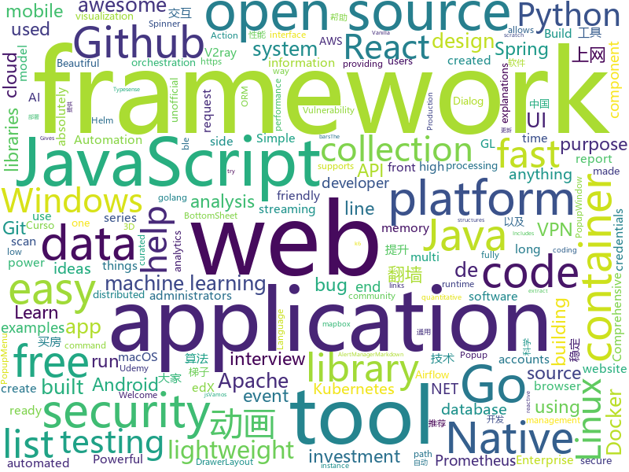

# 2020-12-12
See what the GitHub community is most excited about.

## python
+ [consoleme](https://github.com/Netflix/consoleme)(**151 stars today**): ConsoleMe consolidates the management of multiple AWS accounts into a single interface. It allows your end-users and administrators to get credentials for your different accounts, and allows your users/administrators to manage or request cloud permissions.
+ [awesome-python](https://github.com/vinta/awesome-python)(**99 stars today**): A curated list of awesome Python frameworks, libraries, software and resources
+ [thetagang](https://github.com/brndnmtthws/thetagang)(**88 stars today**): ThetaGang is an IBKR bot for collecting money
+ [qlib](https://github.com/microsoft/qlib)(**363 stars today**): Qlib is an AI-oriented quantitative investment platform, which aims to realize the potential, empower the research, and create the value of AI technologies in quantitative investment. With Qlib, you can easily try your ideas to create better Quant investment strategies.
+ [criticality_score](https://github.com/ossf/criticality_score)(**193 stars today**): Gives criticality score for an open source project
+ [Automatic-Udemy-Course-Enroller-GET-PAID-UDEMY-COURSES-for-FREE](https://github.com/aapatre/Automatic-Udemy-Course-Enroller-GET-PAID-UDEMY-COURSES-for-FREE)(**118 stars today**): Do you want to LEARN NEW STUFF for FREE? Don't worry, with the power of web-scraping and automation, this script will find the necessary Udemy coupons & enroll you for PAID UDEMY COURSES, ABSOLUTELY FREE!
+ [airflow](https://github.com/apache/airflow)(**14 stars today**): Apache Airflow - A platform to programmatically author, schedule, and monitor workflows
+ [models](https://github.com/tensorflow/models)(**17 stars today**): Models and examples built with TensorFlow
+ [rengine](https://github.com/yogeshojha/rengine)(**74 stars today**): reNgine is an automated reconnaissance framework meant for information gathering during penetration testing of web applications. reNgine has customizable scan engines, which can be used to scan the websites, endpoints, and gather information.
+ [spaCy](https://github.com/explosion/spaCy)(**14 stars today**): 💫Industrial-strength Natural Language Processing (NLP) with Python and Cython
+ [great_expectations](https://github.com/great-expectations/great_expectations)(**8 stars today**): Always know what to expect from your data.
+ [posthog](https://github.com/PostHog/posthog)(**8 stars today**): 🦔PostHog is developer-friendly, open-source product analytics.
+ [pixie](https://github.com/pixie-labs/pixie)(**37 stars today**): Instant Kubernetes-Native Application Observability
+ [degoogle](https://github.com/deepseagirl/degoogle)(**40 stars today**): search Google and extract results directly. skip all the click-through links and other sketchiness
+ [kivy](https://github.com/kivy/kivy)(**30 stars today**): Open source UI framework written in Python, running on Windows, Linux, macOS, Android and iOS
+ [hydra](https://github.com/facebookresearch/hydra)(**13 stars today**): Hydra is a framework for elegantly configuring complex applications
+ [dirsearch](https://github.com/maurosoria/dirsearch)(**11 stars today**): Web path scanner
+ [fastapi](https://github.com/tiangolo/fastapi)(**40 stars today**): FastAPI framework, high performance, easy to learn, fast to code, ready for production
+ [Mobile-Security-Framework-MobSF](https://github.com/MobSF/Mobile-Security-Framework-MobSF)(**16 stars today**): Mobile Security Framework (MobSF) is an automated, all-in-one mobile application (Android/iOS/Windows) pen-testing, malware analysis and security assessment framework capable of performing static and dynamic analysis.
+ [pipelines](https://github.com/kubeflow/pipelines)(**3 stars today**): Machine Learning Pipelines for Kubeflow
+ [bert4keras](https://github.com/bojone/bert4keras)(**9 stars today**): keras implement of transformers for humans
+ [system-design-primer](https://github.com/donnemartin/system-design-primer)(**158 stars today**): Learn how to design large-scale systems. Prep for the system design interview. Includes Anki flashcards.
+ [frappe](https://github.com/frappe/frappe)(**5 stars today**): Low Code Open Source Framework in Python and JS
+ [edx-platform](https://github.com/edx/edx-platform)(**2 stars today**): The Open edX platform, the software that powers edX!
+ [prefect](https://github.com/PrefectHQ/prefect)(**6 stars today**): The easiest way to automate your data

## java
+ [EhViewer](https://github.com/seven332/EhViewer)(**6 stars today**): [DEPRECATED] An Unofficial E-Hentai Application for Android
+ [vert.x](https://github.com/eclipse-vertx/vert.x)(**18 stars today**): Vert.x is a tool-kit for building reactive applications on the JVM
+ [hazelcast](https://github.com/hazelcast/hazelcast)(**0 stars today**): Open Source In-Memory Data Grid
+ [java](https://github.com/FanZeros/java)(**9 stars today**): 
+ [jib](https://github.com/GoogleContainerTools/jib)(**7 stars today**): 🏗Build container images for your Java applications.
+ [NewPipe](https://github.com/TeamNewPipe/NewPipe)(**21 stars today**): A libre lightweight streaming front-end for Android.
+ [webmagic](https://github.com/code4craft/webmagic)(**9 stars today**): A scalable web crawler framework for Java.
+ [vertx-web](https://github.com/vert-x3/vertx-web)(**0 stars today**): HTTP web applications for Vert.x
+ [XPopup](https://github.com/li-xiaojun/XPopup)(**7 stars today**): 🔥XPopup2.0版本重磅来袭，2倍以上性能提升，带来可观的动画性能优化和交互细节的提升！！！功能强大，交互优雅，动画丝滑的通用弹窗！可以替代Dialog，PopupWindow，PopupMenu，BottomSheet，DrawerLayout，Spinner等组件，自带十几种效果良好的动画， 支持完全的UI和动画自定义！(Powerful and Beautiful Popup，can absolutely replace Dialog，PopupWindow，PopupMenu，BottomSheet，DrawerLayout，Spinner. With built-in animators , very easy to custom popup view.)
+ [zookeeper](https://github.com/apache/zookeeper)(**7 stars today**): Apache ZooKeeper
+ [CobaltStrike](https://github.com/Freakboy/CobaltStrike)(**9 stars today**): CobaltStrike's source code
+ [RIBs](https://github.com/uber/RIBs)(**4 stars today**): Uber's cross-platform mobile architecture framework.
+ [react-native-camera](https://github.com/react-native-camera/react-native-camera)(**4 stars today**): A Camera component for React Native. Also supports barcode scanning!
+ [ksql](https://github.com/confluentinc/ksql)(**2 stars today**): The event streaming database purpose-built for stream processing applications
+ [testcontainers-java](https://github.com/testcontainers/testcontainers-java)(**11 stars today**): Testcontainers is a Java library that supports JUnit tests, providing lightweight, throwaway instances of common databases, Selenium web browsers, or anything else that can run in a Docker container.
+ [quarkus](https://github.com/quarkusio/quarkus)(**15 stars today**): Quarkus: Supersonic Subatomic Java.
+ [tutorials](https://github.com/eugenp/tutorials)(**20 stars today**): Just Announced - "Learn Spring Security OAuth":
+ [alluxio](https://github.com/Alluxio/alluxio)(**3 stars today**): Alluxio, data orchestration for analytics and machine learning in the cloud
+ [karate](https://github.com/intuit/karate)(**7 stars today**): Test Automation Made Simple
+ [spring-cloud-gateway](https://github.com/spring-cloud/spring-cloud-gateway)(**3 stars today**): A Gateway built on Spring Framework 5.x and Spring Boot 2.x providing routing and more.
+ [hbase](https://github.com/apache/hbase)(**3 stars today**): Apache HBase
+ [graphql-java](https://github.com/graphql-java/graphql-java)(**2 stars today**): GraphQL Java implementation
+ [SpringCloud-Learning](https://github.com/dyc87112/SpringCloud-Learning)(**3 stars today**): Spring Cloud基础教程，持续连载更新中
+ [FairEmail](https://github.com/M66B/FairEmail)(**5 stars today**): Fully featured, open source, privacy friendly email app for Android
+ [che](https://github.com/eclipse/che)(**2 stars today**): The Kubernetes-Native IDE for Developer Teams

## unknown
+ [rocky](https://github.com/rocky-linux/rocky)(**1,424 stars today**): Rocky Linux is a community enterprise Operating System designed to be 100% bug-for-bug compatible with Enterprise Linux created in response to the effective discontinuation of CentOS.
+ [winXray](https://github.com/winXray/winXray)(**85 stars today**): About Xray / V2Ray( vmess/vless )、Shadowsocks、Trojan 通用客户端（Windows），可自动维持稳定上网 - 代理服务器异常自动切换，并提供一键部署代理服务端工具，使用 aardio 编写，绿色便携版免安装仅5MB、不需要.Net等外部运行库。
+ [interview](https://github.com/Olshansk/interview)(**121 stars today**): Everything you need to prepare for your technical interview
+ [fucking-algorithm](https://github.com/labuladong/fucking-algorithm)(**287 stars today**): 刷算法全靠套路，认准 labuladong 就够了！English version supported! Crack LeetCode, not only how, but also why.
+ [kubernetes-kitap](https://github.com/mstrYoda/kubernetes-kitap)(**58 stars today**): 
+ [shanghai_house_knowledge](https://github.com/ayuer/shanghai_house_knowledge)(**62 stars today**): 2020年11月在上海买房经历总结出来的买房购房做的一些功课分享给大家，技术人帮助技术人，希望对大家有所帮助。
+ [javascript-questions](https://github.com/lydiahallie/javascript-questions)(**53 stars today**): A long list of (advanced) JavaScript questions, and their explanations✨
+ [app-ideas](https://github.com/florinpop17/app-ideas)(**73 stars today**): A Collection of application ideas which can be used to improve your coding skills.
+ [for-mac](https://github.com/docker/for-mac)(**14 stars today**): Bug reports for Docker Desktop for Mac
+ [pytorch-styleguide](https://github.com/IgorSusmelj/pytorch-styleguide)(**111 stars today**): An unofficial styleguide and best practices summary for PyTorch
+ [organization](https://github.com/rocky-linux/organization)(**15 stars today**): 
+ [jd_scripts](https://github.com/lxk0301/jd_scripts)(**37 stars today**): 京东薅羊毛脚本
+ [roadmap](https://github.com/docker/roadmap)(**3 stars today**): Welcome to the Public Roadmap for All Things Docker! We welcome your ideas.
+ [how-to-secure-anything](https://github.com/veeral-patel/how-to-secure-anything)(**56 stars today**): How to systematically secure anything: a repository about security engineering
+ [git-github](https://github.com/gustavoguanabara/git-github)(**3 stars today**): Material do Curso de Git e GitHub
+ [awesome-dotnet](https://github.com/quozd/awesome-dotnet)(**14 stars today**): A collection of awesome .NET libraries, tools, frameworks and software
+ [You-Dont-Know-JS](https://github.com/getify/You-Dont-Know-JS)(**71 stars today**): A book series on JavaScript. @YDKJS on twitter.
+ [awesome-react](https://github.com/enaqx/awesome-react)(**21 stars today**): A collection of awesome things regarding React ecosystem
+ [design-resources-for-developers](https://github.com/bradtraversy/design-resources-for-developers)(**34 stars today**): Curated list of design and UI resources from stock photos, web templates, CSS frameworks, UI libraries, tools and much more
+ [dockprom](https://github.com/stefanprodan/dockprom)(**10 stars today**): Docker hosts and containers monitoring with Prometheus, Grafana, cAdvisor, NodeExporter and AlertManager
+ [markdown-cheatsheet](https://github.com/tchapi/markdown-cheatsheet)(**5 stars today**): Markdown Cheatsheet for Github Readme.md
+ [teslaprep](https://github.com/mykeln/teslaprep)(**1 stars today**): A comprehensive guide on preparing for, taking delivery of, and owning a Model 3
+ [the-art-of-command-line](https://github.com/jlevy/the-art-of-command-line)(**31 stars today**): Master the command line, in one page
+ [Xiaomi_Kernel_OpenSource](https://github.com/MiCode/Xiaomi_Kernel_OpenSource)(**6 stars today**): Xiaomi Mobile Phone Kernel OpenSource
+ [awesome-cs-books](https://github.com/imarvinle/awesome-cs-books)(**77 stars today**): 经典编程书籍大全，涵盖：计算机系统与网络、系统架构、算法与数据结构、前端开发、后端开发、移动开发、数据库、测试、项目与团队、程序员职业修炼、求职面试等

## javascript
+ [get-my-ps5](https://github.com/camtheperson/get-my-ps5)(**64 stars today**): A CLI utility to help people secure a PlayStation 5 (PS5).
+ [cypress](https://github.com/cypress-io/cypress)(**304 stars today**): Fast, easy and reliable testing for anything that runs in a browser.
+ [tech-interview-handbook](https://github.com/yangshun/tech-interview-handbook)(**99 stars today**): 💯Materials to help you rock your next coding interview
+ [javascript-algorithms](https://github.com/trekhleb/javascript-algorithms)(**337 stars today**): 📝Algorithms and data structures implemented in JavaScript with explanations and links to further readings
+ [showcase-recipe-search](https://github.com/typesense/showcase-recipe-search)(**40 stars today**): An app showing Typesense Search in action on a 2M recipe database
+ [three.js](https://github.com/mrdoob/three.js)(**35 stars today**): JavaScript 3D library.
+ [iDataV](https://github.com/yyhsong/iDataV)(**103 stars today**): 大屏数据可视化 Big screen data visualization demo
+ [pdf.js](https://github.com/mozilla/pdf.js)(**22 stars today**): PDF Reader in JavaScript
+ [jsPDF](https://github.com/MrRio/jsPDF)(**22 stars today**): Client-side JavaScript PDF generation for everyone.
+ [amphtml](https://github.com/ampproject/amphtml)(**3 stars today**): The AMP web component framework.
+ [sequelize](https://github.com/sequelize/sequelize)(**10 stars today**): An easy-to-use multi SQL dialect ORM for Node.js
+ [BrasilAPI](https://github.com/BrasilAPI/BrasilAPI)(**22 stars today**): Vamos transformar o Brasil em uma API?
+ [lwc-recipes](https://github.com/trailheadapps/lwc-recipes)(**4 stars today**): A collection of easy-to-digest code examples for Lightning Web Components on Salesforce Platform
+ [github-readme-stats](https://github.com/anuraghazra/github-readme-stats)(**91 stars today**): ⚡Dynamically generated stats for your github readmes
+ [react-native-web](https://github.com/necolas/react-native-web)(**11 stars today**): React Native for Web
+ [angular.js](https://github.com/angular/angular.js)(**27 stars today**): AngularJS - HTML enhanced for web apps!
+ [typed.js](https://github.com/mattboldt/typed.js)(**14 stars today**): A JavaScript Typing Animation Library
+ [uPlot](https://github.com/leeoniya/uPlot)(**36 stars today**): 📈A small, fast chart for time series, lines, areas, ohlc & bars
+ [next.js](https://github.com/vercel/next.js)(**53 stars today**): The React Framework
+ [maplibre-gl-js](https://github.com/maplibre/maplibre-gl-js)(**120 stars today**): MapLibre GL is a free and open-source fork of @mapbox/mapbox-gl
+ [clean-code-javascript](https://github.com/ryanmcdermott/clean-code-javascript)(**67 stars today**): 🛁Clean Code concepts adapted for JavaScript
+ [cors-anywhere](https://github.com/Rob--W/cors-anywhere)(**4 stars today**): CORS Anywhere is a NodeJS reverse proxy which adds CORS headers to the proxied request.
+ [alpine](https://github.com/alpinejs/alpine)(**29 stars today**): A rugged, minimal framework for composing JavaScript behavior in your markup.
+ [react-native](https://github.com/facebook/react-native)(**22 stars today**): A framework for building native apps with React.
+ [budibase](https://github.com/Budibase/budibase)(**38 stars today**): 🚀Budibase is an open-source low-code development platform

## html
+ [infrastructure](https://github.com/rocky-linux/infrastructure)(**14 stars today**): 
+ [content](https://github.com/mdn/content)(**8 stars today**): The content behind MDN Web Docs
+ [school-of-sre](https://github.com/linkedin/school-of-sre)(**590 stars today**): At LinkedIn, we are using this curriculum for onboarding our entry level talents into the SRE role.
+ [helm-charts](https://github.com/prometheus-community/helm-charts)(**6 stars today**): Prometheus community Helm charts
+ [html-css](https://github.com/gustavoguanabara/html-css)(**10 stars today**): Curso de HTML5 e CSS3
+ [FreeTouchDeck](https://github.com/DustinWatts/FreeTouchDeck)(**6 stars today**): For interfacing with Windows/macOS/Linux using an ESP32, a touchscreen and BLE.
+ [awesome-piracy](https://github.com/Igglybuff/awesome-piracy)(**15 stars today**): A curated list of awesome warez and piracy links
+ [charts](https://github.com/bitnami/charts)(**7 stars today**): Helm Charts
+ [vpncn.github.io](https://github.com/vpncn/vpncn.github.io)(**11 stars today**): 2020中国翻墙软件VPN推荐指南，以及对比VPS搭建梯子、SSR机场、蓝灯、WireGuard、V2ray、老王VPN等科学上网软件与翻墙方法，中国最新科学上网翻墙VPN梯子下载推荐，稳定好用。
+ [glTF](https://github.com/KhronosGroup/glTF)(**9 stars today**): glTF – Runtime 3D Asset Delivery
+ [uikit](https://github.com/uikit/uikit)(**6 stars today**): A lightweight and modular front-end framework for developing fast and powerful web interfaces
+ [beautiful-jekyll](https://github.com/daattali/beautiful-jekyll)(**4 stars today**): ✨Build a beautiful and simple website in literally minutes. Demo at https://beautifuljekyll.com
+ [machine-learning-systems-design](https://github.com/chiphuyen/machine-learning-systems-design)(**14 stars today**): A booklet on machine learning systems design with exercises
+ [free-for-dev](https://github.com/ripienaar/free-for-dev)(**59 stars today**): A list of SaaS, PaaS and IaaS offerings that have free tiers of interest to devops and infradev
+ [hyperblog](https://github.com/freddier/hyperblog)(**17 stars today**): Un blog increíble para el curso de Git y Github de Platzi
+ [kubespray](https://github.com/kubernetes-sigs/kubespray)(**9 stars today**): Deploy a Production Ready Kubernetes Cluster
+ [django-DefectDojo](https://github.com/DefectDojo/django-DefectDojo)(**3 stars today**): DefectDojo is an open-source application vulnerability correlation and security orchestration tool.
+ [almanac.httparchive.org](https://github.com/HTTPArchive/almanac.httparchive.org)(**5 stars today**): HTTP Archive's annual "State of the Web" report made by the web community
+ [startbootstrap-sb-admin-2](https://github.com/StartBootstrap/startbootstrap-sb-admin-2)(**3 stars today**): A free, open source, Bootstrap admin theme created by Start Bootstrap
+ [loruki-website](https://github.com/bradtraversy/loruki-website)(**1 stars today**): Cloud hosting website
+ [mxgraph](https://github.com/jgraph/mxgraph)(**4 stars today**): mxGraph is a fully client side JavaScript diagramming library
+ [docker.github.io](https://github.com/docker/docker.github.io)(**2 stars today**): Source repo for Docker's Documentation
+ [wow_api](https://github.com/illidan33/wow_api)(**4 stars today**): Documents of wow API -- 魔兽世界API资料以及宏工具
+ [tiny-slider](https://github.com/ganlanyuan/tiny-slider)(**7 stars today**): Vanilla javascript slider for all purposes.
+ [charts](https://github.com/airflow-helm/charts)(**2 stars today**): the home of the stable/airflow Helm chart

## go
+ [thanos](https://github.com/thanos-io/thanos)(**121 stars today**): Highly available Prometheus setup with long term storage capabilities. A CNCF Incubating project.
+ [k6](https://github.com/loadimpact/k6)(**48 stars today**): A modern load testing tool, using Go and JavaScript - https://k6.io
+ [influxdb](https://github.com/influxdata/influxdb)(**11 stars today**): Scalable datastore for metrics, events, and real-time analytics
+ [rancher](https://github.com/rancher/rancher)(**5 stars today**): Complete container management platform
+ [cel-spec](https://github.com/google/cel-spec)(**150 stars today**): Common Expression Language -- specification and binary representation
+ [fasthttp](https://github.com/valyala/fasthttp)(**9 stars today**): Fast HTTP package for Go. Tuned for high performance. Zero memory allocations in hot paths. Up to 10x faster than net/http
+ [mongo-go-driver](https://github.com/mongodb/mongo-go-driver)(**3 stars today**): The Go driver for MongoDB
+ [trivy](https://github.com/aquasecurity/trivy)(**20 stars today**): A Simple and Comprehensive Vulnerability Scanner for Containers, Suitable for CI
+ [sarama](https://github.com/Shopify/sarama)(**9 stars today**): Sarama is a Go library for Apache Kafka 0.8, and up.
+ [act](https://github.com/nektos/act)(**29 stars today**): Run your GitHub Actions locally🚀
+ [k3s](https://github.com/k3s-io/k3s)(**17 stars today**): Lightweight Kubernetes
+ [cilium](https://github.com/cilium/cilium)(**11 stars today**): eBPF-based Networking, Security, and Observability
+ [pprof](https://github.com/google/pprof)(**8 stars today**): pprof is a tool for visualization and analysis of profiling data
+ [kubectx](https://github.com/ahmetb/kubectx)(**8 stars today**): Faster way to switch between clusters and namespaces in kubectl
+ [learngo](https://github.com/inancgumus/learngo)(**10 stars today**): 1000+ Hand-Crafted Go Examples, Exercises, and Quizzes
+ [dapr](https://github.com/dapr/dapr)(**10 stars today**): Dapr is a portable, event-driven, runtime for building distributed applications across cloud and edge.
+ [caddy](https://github.com/caddyserver/caddy)(**25 stars today**): Fast, multi-platform web server with automatic HTTPS
+ [7days-golang](https://github.com/geektutu/7days-golang)(**11 stars today**): 7 days golang programs from scratch (web framework Gee, distributed cache GeeCache, object relational mapping ORM framework GeeORM, rpc framework GeeRPC etc) 7天用Go动手写/从零实现系列
+ [hub](https://github.com/github/hub)(**6 stars today**): A command-line tool that makes git easier to use with GitHub.
+ [chaosmonkey](https://github.com/Netflix/chaosmonkey)(**8 stars today**): Chaos Monkey is a resiliency tool that helps applications tolerate random instance failures.
+ [evilginx2](https://github.com/kgretzky/evilginx2)(**7 stars today**): Standalone man-in-the-middle attack framework used for phishing login credentials along with session cookies, allowing for the bypass of 2-factor authentication
+ [cron](https://github.com/robfig/cron)(**9 stars today**): a cron library for go
+ [aws-lambda-go](https://github.com/aws/aws-lambda-go)(**5 stars today**): Libraries, samples and tools to help Go developers develop AWS Lambda functions.
+ [sqlx](https://github.com/jmoiron/sqlx)(**5 stars today**): general purpose extensions to golang's database/sql
+ [cortex](https://github.com/cortexlabs/cortex)(**63 stars today**): Deploy machine learning models to production

## WordCloud

