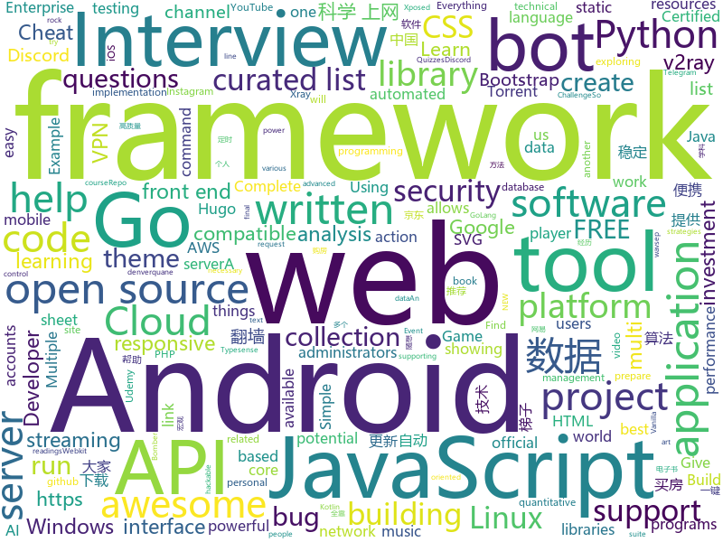

# 2020-12-13
See what the GitHub community is most excited about.

## python
+ [thetagang](https://github.com/brndnmtthws/thetagang)(**110 stars today**): ThetaGang is an IBKR bot for collecting money
+ [Automatic-Udemy-Course-Enroller-GET-PAID-UDEMY-COURSES-for-FREE](https://github.com/aapatre/Automatic-Udemy-Course-Enroller-GET-PAID-UDEMY-COURSES-for-FREE)(**96 stars today**): Do you want to LEARN NEW STUFF for FREE? Don't worry, with the power of web-scraping and automation, this script will find the necessary Udemy coupons & enroll you for PAID UDEMY COURSES, ABSOLUTELY FREE!
+ [DeepFaceLab](https://github.com/iperov/DeepFaceLab)(**27 stars today**): DeepFaceLab is the leading software for creating deepfakes.
+ [consoleme](https://github.com/Netflix/consoleme)(**158 stars today**): ConsoleMe consolidates the management of multiple AWS accounts into a single interface. It allows your end-users and administrators to get credentials for your different accounts, and allows your users/administrators to manage or request cloud permissions.
+ [awesome-python](https://github.com/vinta/awesome-python)(**187 stars today**): A curated list of awesome Python frameworks, libraries, software and resources
+ [gopup](https://github.com/justinzm/gopup)(**204 stars today**): 数据接口：百度、谷歌、头条、微博指数,宏观数据，利率数据，货币汇率，千里马、独角兽公司，新闻联播文字稿，影视票房数据，高校名单，疫情数据…
+ [criticality_score](https://github.com/ossf/criticality_score)(**188 stars today**): Gives criticality score for an open source project
+ [qlib](https://github.com/microsoft/qlib)(**421 stars today**): Qlib is an AI-oriented quantitative investment platform, which aims to realize the potential, empower the research, and create the value of AI technologies in quantitative investment. With Qlib, you can easily try your ideas to create better Quant investment strategies.
+ [learn-python3](https://github.com/jerry-git/learn-python3)(**15 stars today**): Jupyter notebooks for teaching/learning Python 3
+ [Mobile-Security-Framework-MobSF](https://github.com/MobSF/Mobile-Security-Framework-MobSF)(**17 stars today**): Mobile Security Framework (MobSF) is an automated, all-in-one mobile application (Android/iOS/Windows) pen-testing, malware analysis and security assessment framework capable of performing static and dynamic analysis.
+ [OctoPrint](https://github.com/OctoPrint/OctoPrint)(**6 stars today**): OctoPrint is the snappy web interface for your 3D printer!
+ [dirsearch](https://github.com/maurosoria/dirsearch)(**17 stars today**): Web path scanner
+ [xsscrapy](https://github.com/DanMcInerney/xsscrapy)(**5 stars today**): XSS spider - 66/66 wavsep XSS detected
+ [datasette](https://github.com/simonw/datasette)(**84 stars today**): An open source multi-tool for exploring and publishing data
+ [discord.py](https://github.com/Rapptz/discord.py)(**11 stars today**): An API wrapper for Discord written in Python.
+ [searx](https://github.com/searx/searx)(**9 stars today**): Privacy-respecting metasearch engine
+ [beginner-projects](https://github.com/kying18/beginner-projects)(**6 stars today**): 
+ [scikit-learn](https://github.com/scikit-learn/scikit-learn)(**20 stars today**): scikit-learn: machine learning in Python
+ [TBomb](https://github.com/TheSpeedX/TBomb)(**5 stars today**): This is a SMS And Call Bomber For Linux And Termux
+ [tinygrad](https://github.com/geohot/tinygrad)(**69 stars today**): You like pytorch? You like micrograd? You love tinygrad!❤️
+ [InstaPy](https://github.com/timgrossmann/InstaPy)(**10 stars today**): 📷Instagram Bot - Tool for automated Instagram interactions
+ [spotify-downloader](https://github.com/spotDL/spotify-downloader)(**8 stars today**): Download your Spotify playlists and songs along with album art and metadata (from YouTube if a match is found).
+ [pyTelegramBotAPI](https://github.com/eternnoir/pyTelegramBotAPI)(**11 stars today**): Python Telegram bot api.
+ [fairgame](https://github.com/Hari-Nagarajan/fairgame)(**14 stars today**): Tool to help us buy a GPU in 2020
+ [romantic-alexa](https://github.com/ProgrammingHero1/romantic-alexa)(**9 stars today**): 

## java
+ [EdXposed](https://github.com/ElderDrivers/EdXposed)(**10 stars today**): Elder driver Xposed Framework.
+ [FtcRobotController](https://github.com/FIRST-Tech-Challenge/FtcRobotController)(**1 stars today**): 
+ [Essentials](https://github.com/EssentialsX/Essentials)(**5 stars today**): The essential plugin suite for Minecraft servers.
+ [baritone](https://github.com/cabaletta/baritone)(**6 stars today**): google maps for block game
+ [stargate](https://github.com/stargate/stargate)(**11 stars today**): An open source API framework for data
+ [NewPipe](https://github.com/TeamNewPipe/NewPipe)(**9 stars today**): A libre lightweight streaming front-end for Android.
+ [media-samples](https://github.com/android/media-samples)(**0 stars today**): Multiple samples showing the best practices in media APIs on Android (audio, video, etc.).
+ [jackson-databind](https://github.com/FasterXML/jackson-databind)(**1 stars today**): General data-binding package for Jackson (2.x): works on streaming API (core) implementation(s)
+ [EhViewer](https://github.com/seven332/EhViewer)(**12 stars today**): [DEPRECATED] An Unofficial E-Hentai Application for Android
+ [MusicBot](https://github.com/jagrosh/MusicBot)(**3 stars today**): 🎶A Discord music bot that's easy to set up and run yourself!
+ [android-interview-questions](https://github.com/MindorksOpenSource/android-interview-questions)(**8 stars today**): Your Cheat Sheet For Android Interview - Android Interview Questions
+ [libgdx](https://github.com/libgdx/libgdx)(**7 stars today**): Desktop/Android/HTML5/iOS Java game development framework
+ [ghidra](https://github.com/NationalSecurityAgency/ghidra)(**16 stars today**): Ghidra is a software reverse engineering (SRE) framework
+ [Ehviewer_CN_SXJ](https://github.com/xiaojieonly/Ehviewer_CN_SXJ)(**26 stars today**): 因为ehviewer近一年多没更新了，所以想copy过来试着更新下
+ [FXGL](https://github.com/AlmasB/FXGL)(**4 stars today**): Java / JavaFX / Kotlin Game Library (Engine)
+ [easy163](https://github.com/ndroi/easy163)(**3 stars today**): 安卓端一键解锁网易云音乐，无须 ROOT
+ [interview](https://github.com/mission-peace/interview)(**6 stars today**): Interview questions
+ [algorithmbasic2020](https://github.com/algorithmzuo/algorithmbasic2020)(**3 stars today**): 算法和数据结构基础班代码
+ [graal](https://github.com/oracle/graal)(**12 stars today**): GraalVM: Run Programs Faster Anywhere🚀
+ [Mindustry](https://github.com/Anuken/Mindustry)(**18 stars today**): A sandbox tower defense game
+ [Signal-Server](https://github.com/signalapp/Signal-Server)(**3 stars today**): Server supporting the Signal Private Messenger applications on Android, Desktop, and iOS
+ [GmsCore](https://github.com/microg/GmsCore)(**4 stars today**): Free implementation of Play Services
+ [EdXposedManager](https://github.com/ElderDrivers/EdXposedManager)(**3 stars today**): Companion Android application for EdXposed
+ [java](https://github.com/FanZeros/java)(**7 stars today**): 

## unknown
+ [rocky](https://github.com/rocky-linux/rocky)(**1,034 stars today**): Rocky Linux is a community enterprise Operating System designed to be 100% bug-for-bug compatible with Enterprise Linux created in response to the effective discontinuation of CentOS.
+ [winXray](https://github.com/winXray/winXray)(**152 stars today**): About Xray / V2Ray( vmess/vless )、Shadowsocks、Trojan 通用客户端（Windows），可自动维持稳定上网 - 代理服务器异常自动切换，并提供一键部署代理服务端工具，使用 aardio 编写，绿色便携版免安装仅5MB、不需要.Net等外部运行库。
+ [interview](https://github.com/Olshansk/interview)(**225 stars today**): Everything you need to prepare for your technical interview
+ [free-programming-books](https://github.com/EbookFoundation/free-programming-books)(**137 stars today**): 📚Freely available programming books
+ [fucking-algorithm](https://github.com/labuladong/fucking-algorithm)(**242 stars today**): 刷算法全靠套路，认准 labuladong 就够了！English version supported! Crack LeetCode, not only how, but also why.
+ [build-your-own-x](https://github.com/danistefanovic/build-your-own-x)(**62 stars today**): 🤓Build your own (insert technology here)
+ [PocketLCD](https://github.com/peng-zhihui/PocketLCD)(**86 stars today**): 带充电宝功能的便携显示器
+ [COVID-19](https://github.com/CSSEGISandData/COVID-19)(**16 stars today**): Novel Coronavirus (COVID-19) Cases, provided by JHU CSSE
+ [You-Dont-Know-JS](https://github.com/getify/You-Dont-Know-JS)(**74 stars today**): A book series on JavaScript. @YDKJS on twitter.
+ [fancyss_history_package](https://github.com/hq450/fancyss_history_package)(**13 stars today**): 科学上网插件的离线安装包储存在这里
+ [Office-Tool](https://github.com/YerongAI/Office-Tool)(**13 stars today**): Office Tool Projects
+ [Awesome-Hacking](https://github.com/Hack-with-Github/Awesome-Hacking)(**27 stars today**): A collection of various awesome lists for hackers, pentesters and security researchers
+ [trace-ark-trades](https://github.com/Allen1212/trace-ark-trades)(**48 stars today**): Record all purchases and sales made by ARK Invest from 11/12/2019 to the present and visualize these trades via TradingView
+ [AWS-SAA-C02-Study-Guide](https://github.com/keenanromain/AWS-SAA-C02-Study-Guide)(**4 stars today**): How to become a certified AWS Solutions Architect
+ [TNT-Weekly](https://github.com/tnfe/TNT-Weekly)(**17 stars today**): 每周为你提供高质量的关于小程序、h5等前端领域的文章和项目
+ [shanghai_house_knowledge](https://github.com/ayuer/shanghai_house_knowledge)(**41 stars today**): 2020年11月在上海买房经历总结出来的买房购房做的一些功课分享给大家，技术人帮助技术人，希望对大家有所帮助。
+ [awesome-osint](https://github.com/jivoi/awesome-osint)(**12 stars today**): 😱A curated list of amazingly awesome OSINT
+ [trackerslist](https://github.com/ngosang/trackerslist)(**20 stars today**): Updated list of public BitTorrent trackers
+ [google-cloud-4-words](https://github.com/gregsramblings/google-cloud-4-words)(**5 stars today**): The Google Cloud Developer's Cheat Sheet
+ [machine-learning-interview](https://github.com/khangich/machine-learning-interview)(**35 stars today**): Machine Learning Interviews from FAAG, Snapchat, LinkedIn.
+ [jd_scripts](https://github.com/lxk0301/jd_scripts)(**36 stars today**): 京东薅羊毛脚本
+ [awesome-tailwindcss](https://github.com/aniftyco/awesome-tailwindcss)(**20 stars today**): 😎Awesome things related to Tailwind CSS
+ [patches](https://github.com/ITotalJustice/patches)(**22 stars today**): 
+ [books](https://github.com/programthink/books)(**13 stars today**): 【编程随想】收藏的电子书清单（多个学科，含下载链接）
+ [every-programmer-should-know](https://github.com/mtdvio/every-programmer-should-know)(**13 stars today**): A collection of (mostly) technical things every software developer should know about

## javascript
+ [get-my-ps5](https://github.com/camtheperson/get-my-ps5)(**95 stars today**): A CLI utility to help people secure a PlayStation 5 (PS5).
+ [showcase-recipe-search](https://github.com/typesense/showcase-recipe-search)(**69 stars today**): An app showing Typesense Search in action on a 2M recipe database
+ [tech-interview-handbook](https://github.com/yangshun/tech-interview-handbook)(**130 stars today**): 💯Materials to help you rock your next coding interview
+ [javascript-algorithms](https://github.com/trekhleb/javascript-algorithms)(**430 stars today**): 📝Algorithms and data structures implemented in JavaScript with explanations and links to further readings
+ [PS4-webkit-exploit-6.XX](https://github.com/synacktiv/PS4-webkit-exploit-6.XX)(**5 stars today**): Webkit exploit that give arbitrary R/W on 6.XX PS4 firmwares
+ [cypress](https://github.com/cypress-io/cypress)(**444 stars today**): Fast, easy and reliable testing for anything that runs in a browser.
+ [freeCodeCamp](https://github.com/freeCodeCamp/freeCodeCamp)(**80 stars today**): freeCodeCamp.org's open source codebase and curriculum. Learn to code at home.
+ [spectrum](https://github.com/withspectrum/spectrum)(**4 stars today**): Simple, powerful online communities.
+ [ccxt](https://github.com/ccxt/ccxt)(**11 stars today**): A JavaScript / Python / PHP cryptocurrency trading API with support for more than 120 bitcoin/altcoin exchanges
+ [Baileys](https://github.com/adiwajshing/Baileys)(**5 stars today**): Lightweight full-featured typescript/javascript WhatsApp Web API
+ [complete-javascript-course](https://github.com/jonasschmedtmann/complete-javascript-course)(**9 stars today**): Starter files, final projects and FAQ for my Complete JavaScript course
+ [OpenCore-Install-Guide](https://github.com/dortania/OpenCore-Install-Guide)(**6 stars today**): Repo for the OpenCore Install Guide
+ [semgrep](https://github.com/returntocorp/semgrep)(**22 stars today**): Lightweight static analysis for many languages. Find bug variants with patterns that look like source code.
+ [fullstack-course4](https://github.com/jhu-ep-coursera/fullstack-course4)(**8 stars today**): Example code for HTML, CSS, and Javascript for Web Developers Coursera Course
+ [bootstrap](https://github.com/twbs/bootstrap)(**44 stars today**): The most popular HTML, CSS, and JavaScript framework for developing responsive, mobile first projects on the web.
+ [pickr](https://github.com/Simonwep/pickr)(**14 stars today**): 🎨Flat, simple, multi-themed, responsive and hackable Color-Picker library. No dependencies, no jQuery. Compatible with all CSS Frameworks e.g. Bootstrap, Materialize. Supports alpha channel, rgba, hsla, hsva and more!
+ [AdminLTE](https://github.com/ColorlibHQ/AdminLTE)(**15 stars today**): AdminLTE - Free admin dashboard template based on Bootstrap 4
+ [shields](https://github.com/badges/shields)(**16 stars today**): Concise, consistent, and legible badges in SVG and raster format
+ [electron-react-boilerplate](https://github.com/electron-react-boilerplate/electron-react-boilerplate)(**26 stars today**): A Foundation for Scalable Cross-Platform Apps
+ [iptv](https://github.com/iptv-org/iptv)(**26 stars today**): Collection of 5000+ publicly available IPTV channels from all over the world
+ [JD_Sign_Action](https://github.com/ZHDeveloper/JD_Sign_Action)(**9 stars today**): 基于github actions的京东签到、领京豆
+ [open-event-frontend](https://github.com/fossasia/open-event-frontend)(**3 stars today**): The frontend for the Open Event API Server
+ [Music-bot](https://github.com/ZerioDev/Music-bot)(**2 stars today**): A complete code to download for a music bot. Using a module (discord-player).
+ [netflix](https://github.com/karlhadwen/netflix)(**9 stars today**): Subscribe to my YouTube channel: https://bit.ly/CognitiveSurge - Building Netflix Using React
+ [javascript-interview-questions](https://github.com/sudheerj/javascript-interview-questions)(**6 stars today**): List of 1000 JavaScript Interview Questions

## html
+ [infrastructure](https://github.com/rocky-linux/infrastructure)(**35 stars today**): 
+ [minimal-mistakes](https://github.com/mmistakes/minimal-mistakes)(**11 stars today**): 📐Jekyll theme for building a personal site, blog, project documentation, or portfolio.
+ [content](https://github.com/mdn/content)(**10 stars today**): The content behind MDN Web Docs
+ [WADComs.github.io](https://github.com/WADComs/WADComs.github.io)(**109 stars today**): WADComs is an interactive cheat sheet, containing a curated list of Unix/Windows offensive tools and their respective commands.
+ [CamPhish](https://github.com/techchipnet/CamPhish)(**3 stars today**): Grab cam shots from target's phone front camera or PC webcam just sending a link.
+ [rockylinux.org](https://github.com/rocky-linux/rockylinux.org)(**19 stars today**): The official website of the Rocky Linux Project.
+ [OpenClash](https://github.com/vernesong/OpenClash)(**17 stars today**): A Clash Client For OpenWrt
+ [Spoon-Knife](https://github.com/octocat/Spoon-Knife)(**3 stars today**): This repo is for demonstration purposes only.
+ [JavaScript30](https://github.com/wesbos/JavaScript30)(**10 stars today**): 30 Day Vanilla JS Challenge
+ [text-to-handwriting](https://github.com/saurabhdaware/text-to-handwriting)(**8 stars today**): So your teacher asked you to upload written assignments? Hate writing assigments? This tool will help you convert your text to handwriting xD
+ [cs6120](https://github.com/sampsyo/cs6120)(**51 stars today**): advanced compilers
+ [christmas_tree](https://github.com/Resten1497/christmas_tree)(**16 stars today**): 크리스마스 트리
+ [openwrt-packages](https://github.com/kenzok8/openwrt-packages)(**12 stars today**): openwet常用软件包
+ [icons](https://github.com/twbs/icons)(**6 stars today**): Official open source SVG icon library for Bootstrap.
+ [new-browserhax-XL](https://github.com/zoogie/new-browserhax-XL)(**5 stars today**): Another one!
+ [fluxion](https://github.com/FluxionNetwork/fluxion)(**4 stars today**): Fluxion is a remake of linset by vk496 with enhanced functionality.
+ [vpncn.github.io](https://github.com/vpncn/vpncn.github.io)(**12 stars today**): 2020中国翻墙软件VPN推荐指南，以及对比VPS搭建梯子、SSR机场、蓝灯、WireGuard、V2ray、老王VPN等科学上网软件与翻墙方法，中国最新科学上网翻墙VPN梯子下载推荐，稳定好用。
+ [Front-end-Developer-Interview-Questions](https://github.com/h5bp/Front-end-Developer-Interview-Questions)(**18 stars today**): A list of helpful front-end related questions you can use to interview potential candidates, test yourself or completely ignore.
+ [Server](https://github.com/PanDownloadServer/Server)(**16 stars today**): PanDownload的个人维护版本
+ [foundation-sites](https://github.com/foundation/foundation-sites)(**4 stars today**): The most advanced responsive front-end framework in the world. Quickly create prototypes and production code for sites that work on any kind of device.
+ [hugo-clarity](https://github.com/chipzoller/hugo-clarity)(**3 stars today**): A theme for Hugo based on VMware Clarity
+ [import-maps](https://github.com/WICG/import-maps)(**3 stars today**): How to control the behavior of JavaScript imports
+ [joyful-pandas](https://github.com/datawhalechina/joyful-pandas)(**7 stars today**): Pandas中文教程
+ [hugo-PaperMod](https://github.com/adityatelange/hugo-PaperMod)(**3 stars today**): Hugo Theme PaperMod
+ [CKSS-Certified-Kubernetes-Security-Specialist](https://github.com/ibrahimjelliti/CKSS-Certified-Kubernetes-Security-Specialist)(**3 stars today**): This repository is a collection of resources to prepare for the Certified Kubernetes Security Specialist (CKSS) exam.

## go
+ [learngo](https://github.com/inancgumus/learngo)(**10 stars today**): 1000+ Hand-Crafted Go Examples, Exercises, and Quizzes
+ [automuteus](https://github.com/denverquane/automuteus)(**5 stars today**): Discord Bot to automute Among Us players at round transitions, in conjunction with https://github.com/denverquane/amonguscapture
+ [mux](https://github.com/gorilla/mux)(**11 stars today**): A powerful HTTP router and URL matcher for building Go web servers with🦍
+ [AdGuardHome](https://github.com/AdguardTeam/AdGuardHome)(**20 stars today**): Network-wide ads & trackers blocking DNS server
+ [awesome-go](https://github.com/avelino/awesome-go)(**30 stars today**): A curated list of awesome Go frameworks, libraries and software
+ [cloud-torrent](https://github.com/jpillora/cloud-torrent)(**18 stars today**): ☁️Cloud Torrent: a self-hosted remote torrent client
+ [livego](https://github.com/gwuhaolin/livego)(**7 stars today**): live video streaming server in golang
+ [k3s](https://github.com/k3s-io/k3s)(**17 stars today**): Lightweight Kubernetes
+ [roadrunner](https://github.com/spiral/roadrunner)(**21 stars today**): High-performance PHP application server, load-balancer and process manager written in Golang
+ [graphik](https://github.com/graphikDB/graphik)(**62 stars today**): An identity-aware document & graph database written in Go with support for gRPC and graphQL
+ [Cloudreve](https://github.com/cloudreve/Cloudreve)(**21 stars today**): 🌩支持多家云存储的云盘系统 (A project helps you build your own cloud in minutes)
+ [dive](https://github.com/wagoodman/dive)(**14 stars today**): A tool for exploring each layer in a docker image
+ [proxify](https://github.com/projectdiscovery/proxify)(**377 stars today**): Swiss Army knife Proxy tool for HTTP/HTTPS traffic capture, manipulation and replay
+ [arduino-cli](https://github.com/arduino/arduino-cli)(**5 stars today**): Arduino command line interface
+ [gocron](https://github.com/ouqiang/gocron)(**18 stars today**): 定时任务管理系统
+ [yay](https://github.com/Jguer/yay)(**7 stars today**): Yet another Yogurt - An AUR Helper written in Go
+ [v2ray-core](https://github.com/v2ray/v2ray-core)(**14 stars today**): A platform for building proxies to bypass network restrictions.
+ [photoprism](https://github.com/photoprism/photoprism)(**25 stars today**): Personal Photo Management powered by Go and Google TensorFlow
+ [gosnmp](https://github.com/gosnmp/gosnmp)(**8 stars today**): An SNMP library written in GoLang.
+ [traefik](https://github.com/traefik/traefik)(**13 stars today**): The Cloud Native Application Proxy
+ [caddy](https://github.com/caddyserver/caddy)(**24 stars today**): Fast, multi-platform web server with automatic HTTPS
+ [service](https://github.com/kardianos/service)(**6 stars today**): Run go programs as a service on major platforms.
+ [kit](https://github.com/go-kit/kit)(**7 stars today**): A standard library for microservices.
+ [Xray-core](https://github.com/XTLS/Xray-core)(**42 stars today**): Xray, Penetrates Everything. Also the best v2ray-core, with XTLS support. Fully compatible configuration.
+ [beego](https://github.com/astaxie/beego)(**13 stars today**): beego is an open-source, high-performance web framework for the Go programming language.

## WordCloud

