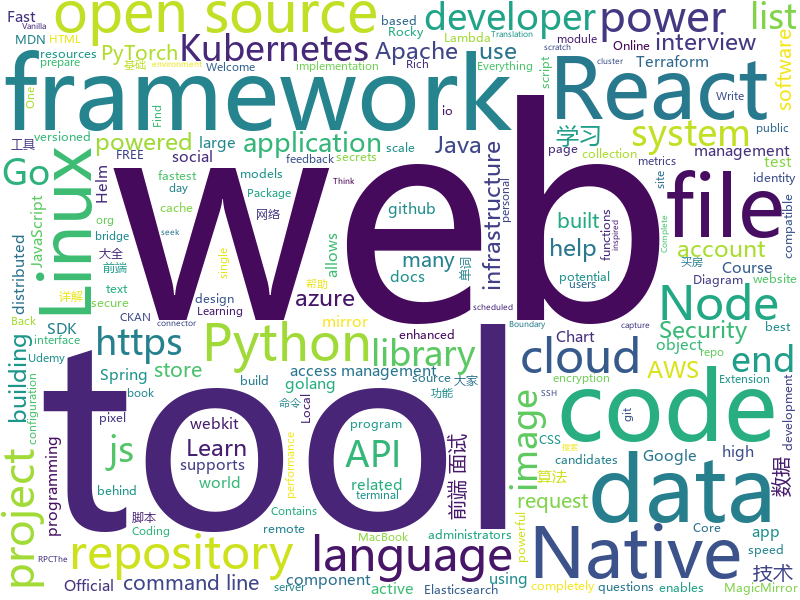

# 2020-12-15
See what the GitHub community is most excited about.

## python
+ [Automatic-Udemy-Course-Enroller-GET-PAID-UDEMY-COURSES-for-FREE](https://github.com/aapatre/Automatic-Udemy-Course-Enroller-GET-PAID-UDEMY-COURSES-for-FREE)(**178 stars today**): Do you want to LEARN NEW STUFF for FREE? Don't worry, with the power of web-scraping and automation, this script will find the necessary Udemy coupons & enroll you for PAID UDEMY COURSES, ABSOLUTELY FREE!
+ [rich](https://github.com/willmcgugan/rich)(**513 stars today**): Rich is a Python library for rich text and beautiful formatting in the terminal.
+ [consoleme](https://github.com/Netflix/consoleme)(**275 stars today**): ConsoleMe consolidates the management of multiple AWS accounts into a single interface. It allows your end-users and administrators to get credentials for your different accounts, and allows your users/administrators to manage or request cloud permissions.
+ [sherlock](https://github.com/sherlock-project/sherlock)(**35 stars today**): 🔎Hunt down social media accounts by username across social networks
+ [wsl-windows-toolbar-launcher](https://github.com/cascadium/wsl-windows-toolbar-launcher)(**107 stars today**): Adds linux GUI application menu to a windows toolbar
+ [DeepFaceLab](https://github.com/iperov/DeepFaceLab)(**196 stars today**): DeepFaceLab is the leading software for creating deepfakes.
+ [HMMs_Stock_Market](https://github.com/Jays-code-collection/HMMs_Stock_Market)(**18 stars today**): Contains all code related to using HMMs to predict stock market prices.
+ [Bringing-Old-Photos-Back-to-Life](https://github.com/microsoft/Bringing-Old-Photos-Back-to-Life)(**62 stars today**): Bringing Old Photo Back to Life (CVPR 2020 oral)
+ [system-design-primer](https://github.com/donnemartin/system-design-primer)(**231 stars today**): Learn how to design large-scale systems. Prep for the system design interview. Includes Anki flashcards.
+ [openlibrary](https://github.com/internetarchive/openlibrary)(**43 stars today**): One webpage for every book ever published!
+ [iPERCore](https://github.com/iPERDance/iPERCore)(**38 stars today**): Liquid Warping GAN with Attention: A Unified Framework for Human Image Synthesis
+ [pytorch-CycleGAN-and-pix2pix](https://github.com/junyanz/pytorch-CycleGAN-and-pix2pix)(**18 stars today**): Image-to-Image Translation in PyTorch
+ [azure-sdk-for-python](https://github.com/Azure/azure-sdk-for-python)(**4 stars today**): This repository is for active development of the Azure SDK for Python. For consumers of the SDK we recommend visiting our public developer docs at https://docs.microsoft.com/en-us/python/azure/ or our versioned developer docs at https://azure.github.io/azure-sdk-for-python.
+ [BurpSuite_403Bypasser](https://github.com/sting8k/BurpSuite_403Bypasser)(**51 stars today**): Burpsuite Extension to bypass 403 restricted directory
+ [paperai](https://github.com/neuml/paperai)(**78 stars today**): AI-powered literature discovery and review engine for medical/scientific papers
+ [readthedocs.org](https://github.com/readthedocs/readthedocs.org)(**4 stars today**): The source code that powers readthedocs.org
+ [sigma](https://github.com/Neo23x0/sigma)(**7 stars today**): Generic Signature Format for SIEM Systems
+ [DarkSide](https://github.com/ultrasecurity/DarkSide)(**15 stars today**): Tool Information Gathering & social engineering Write By [Python,JS,PHP]
+ [tinygrad](https://github.com/geohot/tinygrad)(**69 stars today**): You like pytorch? You like micrograd? You love tinygrad!❤️
+ [fairscale](https://github.com/facebookresearch/fairscale)(**13 stars today**): PyTorch extensions for high performance and large scale training.
+ [diagrams](https://github.com/mingrammer/diagrams)(**23 stars today**): 🎨Diagram as Code for prototyping cloud system architectures
+ [checkov](https://github.com/bridgecrewio/checkov)(**9 stars today**): Prevent cloud misconfigurations during build-time for Terraform, Cloudformation, Kubernetes, Serverless framework and other infrastructure-as-code-languages with Checkov by Bridgecrew.
+ [ckan](https://github.com/ckan/ckan)(**4 stars today**): CKAN is an open-source DMS (data management system) for powering data hubs and data portals. CKAN makes it easy to publish, share and use data. It powers catalog.data.gov, europeandataportal.eu/data, data.humdata.org among many other sites.
+ [dgl](https://github.com/dmlc/dgl)(**13 stars today**): Python package built to ease deep learning on graph, on top of existing DL frameworks.
+ [pytorch-image-models](https://github.com/rwightman/pytorch-image-models)(**20 stars today**): PyTorch image models, scripts, pretrained weights -- (SE)ResNet/ResNeXT, DPN, EfficientNet, MixNet, MobileNet-V3/V2, MNASNet, Single-Path NAS, FBNet, and more

## java
+ [checkstyle](https://github.com/checkstyle/checkstyle)(**7 stars today**): Checkstyle is a development tool to help programmers write Java code that adheres to a coding standard. By default it supports the Google Java Style Guide and Sun Code Conventions, but is highly configurable. It can be invoked with an ANT task and a command line program.
+ [mvnd](https://github.com/mvndaemon/mvnd)(**9 stars today**): Maven Daemon
+ [ShedLock](https://github.com/lukas-krecan/ShedLock)(**9 stars today**): Distributed lock for your scheduled tasks
+ [commons-lang](https://github.com/apache/commons-lang)(**1 stars today**): Mirror of Apache Commons Lang
+ [react-native-video](https://github.com/react-native-video/react-native-video)(**6 stars today**): A <Video /> component for react-native
+ [termux-app](https://github.com/termux/termux-app)(**17 stars today**): Android terminal and Linux environment - app repository.
+ [easyexcel](https://github.com/alibaba/easyexcel)(**23 stars today**): 快速、简单避免OOM的java处理Excel工具
+ [dubbo-spring-boot-project](https://github.com/apache/dubbo-spring-boot-project)(**3 stars today**): Spring Boot Project for Apache Dubbo
+ [mybatis-plus](https://github.com/baomidou/mybatis-plus)(**8 stars today**): An powerful enhanced toolkit of MyBatis for simplify development
+ [react-native-push-notification](https://github.com/zo0r/react-native-push-notification)(**2 stars today**): React Native Local and Remote Notifications
+ [tutorials](https://github.com/eugenp/tutorials)(**16 stars today**): Just Announced - "Learn Spring Security OAuth":
+ [hive](https://github.com/apache/hive)(**2 stars today**): Apache Hive
+ [kafka-connect-jdbc](https://github.com/confluentinc/kafka-connect-jdbc)(**0 stars today**): Kafka Connect connector for JDBC-compatible databases
+ [spring-graalvm-native](https://github.com/spring-projects-experimental/spring-graalvm-native)(**8 stars today**): Spring Native for GraalVM
+ [antlr4](https://github.com/antlr/antlr4)(**7 stars today**): ANTLR (ANother Tool for Language Recognition) is a powerful parser generator for reading, processing, executing, or translating structured text or binary files.
+ [strimzi-kafka-operator](https://github.com/strimzi/strimzi-kafka-operator)(**3 stars today**): Apache Kafka running on Kubernetes
+ [DeepVision](https://github.com/peng-zhihui/DeepVision)(**10 stars today**): 在我很多项目中用到的CV算法推理框架应用。
+ [quarkus](https://github.com/quarkusio/quarkus)(**10 stars today**): Quarkus: Supersonic Subatomic Java.
+ [interview](https://github.com/mission-peace/interview)(**9 stars today**): Interview questions
+ [micrometer](https://github.com/micrometer-metrics/micrometer)(**3 stars today**): An application metrics facade for the most popular monitoring tools. Think SLF4J, but for metrics.
+ [guava](https://github.com/google/guava)(**26 stars today**): Google core libraries for Java
+ [react-native-svg](https://github.com/react-native-svg/react-native-svg)(**5 stars today**): SVG library for React Native, React Native Web, and plain React web projects.
+ [spring-security](https://github.com/spring-projects/spring-security)(**6 stars today**): Spring Security
+ [selling-partner-api-models](https://github.com/amzn/selling-partner-api-models)(**2 stars today**): This repository contains OpenAPI models for developers to use when developing software to call Selling Partner APIs.
+ [YCSB](https://github.com/brianfrankcooper/YCSB)(**4 stars today**): Yahoo! Cloud Serving Benchmark

## unknown
+ [build-your-own-x](https://github.com/danistefanovic/build-your-own-x)(**379 stars today**): 🤓Build your own (insert technology here)
+ [ssh-tutorial](https://github.com/wangdoc/ssh-tutorial)(**71 stars today**): SSH 教程
+ [interview](https://github.com/Olshansk/interview)(**243 stars today**): Everything you need to prepare for your technical interview
+ [developer-roadmap](https://github.com/kamranahmedse/developer-roadmap)(**187 stars today**): Roadmap to becoming a web developer in 2020
+ [free-programming-books](https://github.com/EbookFoundation/free-programming-books)(**445 stars today**): 📚Freely available programming books
+ [PocketLCD](https://github.com/peng-zhihui/PocketLCD)(**89 stars today**): 带充电宝功能的便携显示器
+ [home](https://github.com/JanssenProject/home)(**32 stars today**): Welcome to Janssen: the world's fastest cloud native identity and access management platform
+ [Licensing](https://github.com/AaronDinnage/Licensing)(**27 stars today**): Microsoft 365 licensing diagrams
+ [if-then-else](https://github.com/ericfischer/if-then-else)(**38 stars today**): !!Con West 2019 talk
+ [the-art-of-command-line](https://github.com/jlevy/the-art-of-command-line)(**74 stars today**): Master the command line, in one page
+ [fucking-algorithm](https://github.com/labuladong/fucking-algorithm)(**437 stars today**): 刷算法全靠套路，认准 labuladong 就够了！English version supported! Crack LeetCode, not only how, but also why.
+ [jd_scripts](https://github.com/lxk0301/jd_scripts)(**51 stars today**): 京东薅羊毛脚本
+ [WebKit](https://github.com/WebKit/WebKit)(**10 stars today**): Official mirror of the WebKit repository, https://svn.webkit.org/repository/webkit.
+ [shanghai_house_knowledge](https://github.com/ayuer/shanghai_house_knowledge)(**39 stars today**): 2020年11月在上海买房经历总结出来的买房购房做的一些功课分享给大家，技术人帮助技术人，希望对大家有所帮助。
+ [m1-test](https://github.com/SchelleyYuki/m1-test)(**14 stars today**): Compilation speed test on M1 MacBook Air vs Intel Core i9 MacBook Pro
+ [architecture_decision_record](https://github.com/joelparkerhenderson/architecture_decision_record)(**7 stars today**): Architecture decision record (ADR) examples for software planning, IT leadership, and template documentation
+ [Loon-Script](https://github.com/Tartarus2014/Loon-Script)(**4 stars today**): Loon脚本收集
+ [live-study](https://github.com/whiteship/live-study)(**8 stars today**): 온라인 스터디
+ [post-mortems](https://github.com/danluu/post-mortems)(**7 stars today**): A collection of postmortems. Sorry for the delay in merging PRs!
+ [awesome-datascience](https://github.com/academic/awesome-datascience)(**13 stars today**): 📝An awesome Data Science repository to learn and apply for real world problems.
+ [Certified-Kubernetes-Security-Specialist](https://github.com/walidshaari/Certified-Kubernetes-Security-Specialist)(**3 stars today**): Online resources help you prepare for the CNCF/Linux Foundation CKS 2020 "Kubernetes Certified Security Specialist" Certification exam. Please provide feedback or requests by raising issues, or making a pull request. All feedback for improvements are welcome. thank you .
+ [ShanghaiCCPMember](https://github.com/ccpdata/ShanghaiCCPMember)(**9 stars today**): 
+ [gitignore](https://github.com/github/gitignore)(**80 stars today**): A collection of useful .gitignore templates
+ [how-web-works](https://github.com/vasanthk/how-web-works)(**69 stars today**): What happens behind the scenes when we type www.google.com in a browser?
+ [Back-End-Developer-Interview-Questions](https://github.com/arialdomartini/Back-End-Developer-Interview-Questions)(**4 stars today**): A list of back-end related questions you can be inspired from to interview potential candidates, test yourself or completely ignore

## javascript
+ [snapdrop](https://github.com/RobinLinus/snapdrop)(**419 stars today**): A Progressive Web App for local file sharing
+ [BlueSea](https://github.com/jiangqizheng/BlueSea)(**27 stars today**): BlueSea，是一个有趣的英语学习扩展程序。支持划词翻译、单词高亮、单词弹幕、记忆曲线复习、词频统计...等功能。
+ [MagicMirror](https://github.com/MichMich/MagicMirror)(**75 stars today**): MagicMirror² is an open source modular smart mirror platform. With a growing list of installable modules, the MagicMirror² allows you to convert your hallway or bathroom mirror into your personal assistant.
+ [nodebestpractices](https://github.com/goldbergyoni/nodebestpractices)(**117 stars today**): ✅The Node.js best practices list (December 2020)
+ [BrasilAPI](https://github.com/BrasilAPI/BrasilAPI)(**17 stars today**): Vamos transformar o Brasil em uma API?
+ [react-native](https://github.com/facebook/react-native)(**24 stars today**): A framework for building native apps with React.
+ [elasticsearch-js](https://github.com/elastic/elasticsearch-js)(**2 stars today**): Official Elasticsearch client library for Node.js
+ [parse-server](https://github.com/parse-community/parse-server)(**6 stars today**): API server module for Node/Express
+ [hyperbeam](https://github.com/mafintosh/hyperbeam)(**82 stars today**): A 1-1 end-to-end encrypted internet pipe powered by Hyperswarm
+ [zigbee2mqtt](https://github.com/Koenkk/zigbee2mqtt)(**7 stars today**): Zigbee🐝to MQTT bridge🌉, get rid of your proprietary Zigbee bridges🔨
+ [FE-Interview](https://github.com/lgwebdream/FE-Interview)(**21 stars today**): 前端面试大全，独有前端面试题详解，前端面试刷题必备，1000+前端面试真题，Html、Css、JavaScript、Vue、React、Node、TypeScript、Webpack、算法、网络与安全、浏览器
+ [express](https://github.com/expressjs/express)(**23 stars today**): Fast, unopinionated, minimalist web framework for node.
+ [winston](https://github.com/winstonjs/winston)(**10 stars today**): A logger for just about everything.
+ [OSINT-Framework](https://github.com/lockfale/OSINT-Framework)(**12 stars today**): OSINT Framework
+ [react-window](https://github.com/bvaughn/react-window)(**14 stars today**): React components for efficiently rendering large lists and tabular data
+ [semgrep](https://github.com/returntocorp/semgrep)(**12 stars today**): Lightweight static analysis for many languages. Find bug variants with patterns that look like source code.
+ [react-native-swiper](https://github.com/leecade/react-native-swiper)(**5 stars today**): The best Swiper component for React Native.
+ [complete-javascript-course](https://github.com/jonasschmedtmann/complete-javascript-course)(**14 stars today**): Starter files, final projects and FAQ for my Complete JavaScript course
+ [node-express-mongoose-boilerplate](https://github.com/hagopj13/node-express-mongoose-boilerplate)(**11 stars today**): A boilerplate for building production-ready RESTful APIs using Node.js, Express, and Mongoose
+ [commander.js](https://github.com/tj/commander.js)(**17 stars today**): node.js command-line interfaces made easy
+ [fullstack-course4](https://github.com/jhu-ep-coursera/fullstack-course4)(**9 stars today**): Example code for HTML, CSS, and Javascript for Web Developers Coursera Course
+ [svelte](https://github.com/sveltejs/svelte)(**42 stars today**): Cybernetically enhanced web apps
+ [deck.gl](https://github.com/visgl/deck.gl)(**9 stars today**): WebGL2 powered geospatial visualization layers
+ [django-ecommerce](https://github.com/justdjango/django-ecommerce)(**3 stars today**): An e-commerce website built with Django
+ [aws-lambda-power-tuning](https://github.com/alexcasalboni/aws-lambda-power-tuning)(**20 stars today**): AWS Lambda Power Tuning is an open-source tool that can help you visualize and fine-tune the memory/power configuration of Lambda functions. It runs in your own AWS account - powered by AWS Step Functions - and it supports three optimization strategies: cost, speed, and balanced.

## html
+ [rockylinux.org](https://github.com/rocky-linux/rockylinux.org)(**63 stars today**): The official website of the Rocky Linux Project.
+ [content](https://github.com/mdn/content)(**215 stars today**): The content behind MDN Web Docs
+ [dirtycow.github.io](https://github.com/dirtycow/dirtycow.github.io)(**6 stars today**): Dirty COW
+ [infrastructure](https://github.com/rocky-linux/infrastructure)(**52 stars today**): The infrastructure monorepo for The Rocky Linux Foundation
+ [eks-charts](https://github.com/aws/eks-charts)(**2 stars today**): Amazon EKS Helm chart repository
+ [html-css](https://github.com/gustavoguanabara/html-css)(**8 stars today**): Curso de HTML5 e CSS3
+ [charts](https://github.com/bitnami/charts)(**7 stars today**): Helm Charts
+ [minimal-mistakes](https://github.com/mmistakes/minimal-mistakes)(**5 stars today**): 📐Jekyll theme for building a personal site, blog, project documentation, or portfolio.
+ [JavaScript30](https://github.com/wesbos/JavaScript30)(**34 stars today**): 30 Day Vanilla JS Challenge
+ [linux-command](https://github.com/jaywcjlove/linux-command)(**10 stars today**): Linux命令大全搜索工具，内容包含Linux命令手册、详解、学习、搜集。https://git.io/linux
+ [Coursera-ML-AndrewNg-Notes](https://github.com/fengdu78/Coursera-ML-AndrewNg-Notes)(**21 stars today**): 吴恩达老师的机器学习课程个人笔记
+ [learning-area](https://github.com/mdn/learning-area)(**5 stars today**): Github repo for the MDN Learning Area.
+ [django-DefectDojo](https://github.com/DefectDojo/django-DefectDojo)(**3 stars today**): DefectDojo is an open-source application vulnerability correlation and security orchestration tool.
+ [pcc_2e](https://github.com/ehmatthes/pcc_2e)(**2 stars today**): Online resources for Python Crash Course (Second Edition), from No Starch Press
+ [keycloak-documentation](https://github.com/keycloak/keycloak-documentation)(**0 stars today**): 
+ [openshift-docs](https://github.com/openshift/openshift-docs)(**0 stars today**): OpenShift 3 and 4 product and community documentation
+ [charts](https://github.com/minio/charts)(**0 stars today**): MinIO Helm Charts
+ [Front-end-Developer-Interview-Questions](https://github.com/h5bp/Front-end-Developer-Interview-Questions)(**17 stars today**): A list of helpful front-end related questions you can use to interview potential candidates, test yourself or completely ignore.
+ [argo-helm](https://github.com/argoproj/argo-helm)(**1 stars today**): ArgoProj Helm Charts
+ [technical-books](https://github.com/doocs/technical-books)(**4 stars today**): 😆国内外互联网技术大牛们都写了哪些书籍：计算机基础、网络、前端、后端、数据库、架构、大数据、深度学习...
+ [18S191](https://github.com/mitmath/18S191)(**6 stars today**): Course 18.S191 at MIT, fall 2020 - Introduction to computational thinking with Julia:
+ [SVG-Loaders](https://github.com/SamHerbert/SVG-Loaders)(**3 stars today**): Loading icons and small animations built with pure SVG.
+ [gh-pages-url-shortener](https://github.com/nelsontky/gh-pages-url-shortener)(**3 stars today**): Minimal URL shortener that can be entirely hosted on GitHub pages.
+ [RateMySupervisor](https://github.com/kgco/RateMySupervisor)(**41 stars today**): 永久免费开源的导师评价数据、数据爬虫、无需编程基础的展示网页以及新信息补充平台
+ [covid19-forecast-hub](https://github.com/reichlab/covid19-forecast-hub)(**2 stars today**): Projections of COVID-19, in standardized format

## go
+ [proxify](https://github.com/projectdiscovery/proxify)(**243 stars today**): Swiss Army knife Proxy tool for HTTP/HTTPS traffic capture, manipulation, and replay on the go.
+ [gosnmp](https://github.com/gosnmp/gosnmp)(**10 stars today**): An SNMP library written in GoLang.
+ [ingress-nginx](https://github.com/kubernetes/ingress-nginx)(**8 stars today**): NGINX Ingress Controller for Kubernetes
+ [imgdiff](https://github.com/n7olkachev/imgdiff)(**296 stars today**): Faster than the fastest in the world pixel-by-pixel image difference tool.
+ [chaosmonkey](https://github.com/Netflix/chaosmonkey)(**13 stars today**): Chaos Monkey is a resiliency tool that helps applications tolerate random instance failures.
+ [groupcache](https://github.com/golang/groupcache)(**14 stars today**): groupcache is a caching and cache-filling library, intended as a replacement for memcached in many cases.
+ [seaweedfs](https://github.com/chrislusf/seaweedfs)(**9 stars today**): SeaweedFS is a distributed object store and file system to store and serve billions of files fast! Object store has O(1) disk seek, transparent cloud integration. Filer supports cross-cluster active-active replication, Kubernetes, POSIX, S3 API, encryption, Erasure Coding for warm storage, FUSE mount, Hadoop, WebDAV.
+ [gitleaks](https://github.com/zricethezav/gitleaks)(**53 stars today**): Scan git repos (or files) for secrets using regex and entropy🔑
+ [jwt-go](https://github.com/dgrijalva/jwt-go)(**13 stars today**): Golang implementation of JSON Web Tokens (JWT)
+ [boundary](https://github.com/hashicorp/boundary)(**4 stars today**): Boundary enables identity-based access management for dynamic infrastructure.
+ [charts](https://github.com/helm/charts)(**6 stars today**): ⚠️(OBSOLETE) Curated applications for Kubernetes
+ [beego](https://github.com/beego/beego)(**33 stars today**): beego is an open-source, high-performance web framework for the Go programming language.
+ [7days-golang](https://github.com/geektutu/7days-golang)(**106 stars today**): 7 days golang programs from scratch (web framework Gee, distributed cache GeeCache, object relational mapping ORM framework GeeORM, rpc framework GeeRPC etc) 7天用Go动手写/从零实现系列
+ [go](https://github.com/golang/go)(**48 stars today**): The Go programming language
+ [beats](https://github.com/elastic/beats)(**5 stars today**): 🐠Beats - Lightweight shippers for Elasticsearch & Logstash
+ [helm](https://github.com/helm/helm)(**10 stars today**): The Kubernetes Package Manager
+ [tidb](https://github.com/pingcap/tidb)(**20 stars today**): TiDB is an open source distributed HTAP database compatible with the MySQL protocol
+ [tfsec](https://github.com/tfsec/tfsec)(**7 stars today**): 🔒🌍Security scanner for your Terraform code
+ [terraform-provider-aws](https://github.com/hashicorp/terraform-provider-aws)(**6 stars today**): Terraform AWS provider
+ [vault](https://github.com/hashicorp/vault)(**7 stars today**): A tool for secrets management, encryption as a service, and privileged access management
+ [cosmos-sdk](https://github.com/cosmos/cosmos-sdk)(**4 stars today**): ⛓️A Framework for Building High Value Public Blockchains✨
+ [terraform](https://github.com/hashicorp/terraform)(**13 stars today**): Terraform enables you to safely and predictably create, change, and improve infrastructure. It is an open source tool that codifies APIs into declarative configuration files that can be shared amongst team members, treated as code, edited, reviewed, and versioned.
+ [grpc-go](https://github.com/grpc/grpc-go)(**13 stars today**): The Go language implementation of gRPC. HTTP/2 based RPC
+ [tailscale](https://github.com/tailscale/tailscale)(**13 stars today**): The easiest, most secure way to use WireGuard and 2FA.
+ [imgproxy](https://github.com/imgproxy/imgproxy)(**5 stars today**): Fast and secure standalone server for resizing and converting remote images

## WordCloud

