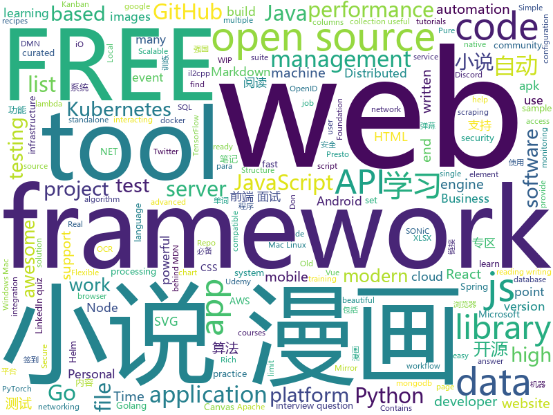

# 2020-12-17
See what the GitHub community is most excited about.

## python
+ [sherlock](https://github.com/sherlock-project/sherlock)(**341 stars today**): 🔎Hunt down social media accounts by username across social networks
+ [BackgroundMattingV2](https://github.com/PeterL1n/BackgroundMattingV2)(**123 stars today**): Real-Time High-Resolution Background Matting
+ [Automatic-Udemy-Course-Enroller-GET-PAID-UDEMY-COURSES-for-FREE](https://github.com/aapatre/Automatic-Udemy-Course-Enroller-GET-PAID-UDEMY-COURSES-for-FREE)(**237 stars today**): Do you want to LEARN NEW STUFF for FREE? Don't worry, with the power of web-scraping and automation, this script will find the necessary Udemy coupons & enroll you for PAID UDEMY COURSES, ABSOLUTELY FREE!
+ [fastapi](https://github.com/tiangolo/fastapi)(**95 stars today**): FastAPI framework, high performance, easy to learn, fast to code, ready for production
+ [PaddleOCR](https://github.com/PaddlePaddle/PaddleOCR)(**145 stars today**): Awesome multilingual OCR toolkits based on PaddlePaddle （practical ultra lightweight OCR system, provide data annotation and synthesis tools, support training and deployment among server, mobile, embedded and IoT devices）
+ [MODNet](https://github.com/ZHKKKe/MODNet)(**48 stars today**): A Trimap-Free Solution for Portrait Matting in Real Time under Changing Scenes
+ [playwright-python](https://github.com/microsoft/playwright-python)(**184 stars today**): Python version of the Playwright testing and automation library.
+ [HMMs_Stock_Market](https://github.com/Jays-code-collection/HMMs_Stock_Market)(**70 stars today**): Contains all code related to using HMMs to predict stock market prices.
+ [transformers](https://github.com/huggingface/transformers)(**62 stars today**): 🤗Transformers: State-of-the-art Natural Language Processing for Pytorch and TensorFlow 2.0.
+ [rich](https://github.com/willmcgugan/rich)(**311 stars today**): Rich is a Python library for rich text and beautiful formatting in the terminal.
+ [writehat](https://github.com/blacklanternsecurity/writehat)(**37 stars today**): A pentest reporting tool written in Python. Free yourself from Microsoft Word.
+ [lumina_server](https://github.com/synacktiv/lumina_server)(**30 stars today**): Local server for IDA Lumina feature
+ [jumpserver](https://github.com/jumpserver/jumpserver)(**34 stars today**): JumpServer 是全球首款开源的堡垒机，是符合 4A 的专业运维安全审计系统。
+ [wave](https://github.com/h2oai/wave)(**42 stars today**): Realtime Web Apps and Dashboards for Python
+ [traingenerator](https://github.com/jrieke/traingenerator)(**103 stars today**): 🧙A web app to generate template code for machine learning
+ [dcs_liberation](https://github.com/Khopa/dcs_liberation)(**3 stars today**): DCS World single-player liberation dynamic campaign.
+ [SOREL-20M](https://github.com/sophos-ai/SOREL-20M)(**39 stars today**): Sophos-ReversingLabs 20 million sample dataset
+ [twint](https://github.com/twintproject/twint)(**7 stars today**): An advanced Twitter scraping & OSINT tool written in Python that doesn't use Twitter's API, allowing you to scrape a user's followers, following, Tweets and more while evading most API limitations.
+ [zulip](https://github.com/zulip/zulip)(**5 stars today**): Zulip server and webapp - powerful open source team chat
+ [aws-cloudformation-templates](https://github.com/awslabs/aws-cloudformation-templates)(**4 stars today**): A collection of useful CloudFormation templates
+ [Bringing-Old-Photos-Back-to-Life](https://github.com/microsoft/Bringing-Old-Photos-Back-to-Life)(**120 stars today**): Bringing Old Photo Back to Life (CVPR 2020 oral)
+ [wait-for-it](https://github.com/vishnubob/wait-for-it)(**5 stars today**): Pure bash script to test and wait on the availability of a TCP host and port
+ [netbox](https://github.com/netbox-community/netbox)(**10 stars today**): IP address management (IPAM) and data center infrastructure management (DCIM) tool.
+ [Paddle](https://github.com/PaddlePaddle/Paddle)(**15 stars today**): PArallel Distributed Deep LEarning: Machine Learning Framework from Industrial Practice （『飞桨』核心框架，深度学习&机器学习高性能单机、分布式训练和跨平台部署）
+ [horovod](https://github.com/horovod/horovod)(**7 stars today**): Distributed training framework for TensorFlow, Keras, PyTorch, and Apache MXNet.

## java
+ [metersphere](https://github.com/metersphere/metersphere)(**46 stars today**): An open source continuous testing platform. MeterSphere 是一站式开源持续测试平台，涵盖测试跟踪、接口测试、性能测试、团队协作等功能，全面兼容 JMeter、Postman 等开源、主流标准。项目采用 SpringBoot 2.x + MyBatis + Vue.js + Element + Docker + Kafka + MySQL等开发。
+ [hello-algorithm](https://github.com/geekxh/hello-algorithm)(**44 stars today**): 🌍「算法面试+算法知识」针对小白的算法训练 | 还包括：1、阿里、字节、滴滴 百篇大厂面经汇总 2、千本开源电子书 3、百张思维导图 （右侧来个 star 吧🌹，English version supported）
+ [fiction_house](https://github.com/201206030/fiction_house)(**63 stars today**): 小说精品屋是一个多平台（web、安卓app、微信小程序）、功能完善的屏幕自适应小说漫画连载系统，包含精品小说专区、轻小说专区和漫画专区。包括小说/漫画分类、小说/漫画搜索、小说/漫画排行、完本小说/漫画、小说/漫画评分、小说/漫画在线阅读、小说/漫画书架、小说/漫画阅读记录、小说下载、小说弹幕、小说/漫画自动采集/更新/纠错、小说内容自动分享到微博、邮件自动推广、链接自动推送到百度搜索引擎等功能。
+ [Digital](https://github.com/hneemann/Digital)(**55 stars today**): A digital logic designer and circuit simulator.
+ [BilibiliTask](https://github.com/srcrs/BilibiliTask)(**20 stars today**): 哔哩哔哩(B站)自动完成每日任务，投币，点赞，直播签到，自动兑换银瓜子为硬币，自动送出即将过期礼物，漫画App签到。
+ [camunda-bpm-platform](https://github.com/camunda/camunda-bpm-platform)(**3 stars today**): Flexible framework for workflow and decision automation with BPMN and DMN. Integration with Spring, Spring Boot, CDI.
+ [BaseRecyclerViewAdapterHelper](https://github.com/CymChad/BaseRecyclerViewAdapterHelper)(**12 stars today**): BRVAH:Powerful and flexible RecyclerAdapter
+ [presto](https://github.com/prestosql/presto)(**5 stars today**): Home of the community managed version of Presto, the distributed SQL query engine for big data, under the auspices of the Presto Software Foundation.
+ [hutool](https://github.com/looly/hutool)(**10 stars today**): A set of tools that keep Java sweet.
+ [aem-core-wcm-components](https://github.com/adobe/aem-core-wcm-components)(**1 stars today**): Set of standardized components to build websites on AEM.
+ [keycloak](https://github.com/keycloak/keycloak)(**9 stars today**): Open Source Identity and Access Management For Modern Applications and Services
+ [dubbo](https://github.com/apache/dubbo)(**12 stars today**): Apache Dubbo is a high-performance, java based, open source RPC framework.
+ [okhttp](https://github.com/square/okhttp)(**20 stars today**): Square’s meticulous HTTP client for the JVM, Android, and GraalVM.
+ [skywalking](https://github.com/apache/skywalking)(**19 stars today**): APM, Application Performance Monitoring System
+ [CS-Notes](https://github.com/CyC2018/CS-Notes)(**86 stars today**): 📚技术面试必备基础知识、Leetcode、计算机操作系统、计算机网络、系统设计、Java、Python、C++
+ [drools](https://github.com/kiegroup/drools)(**4 stars today**): Drools is a rule engine, DMN engine and complex event processing (CEP) engine for Java.
+ [quarkus](https://github.com/quarkusio/quarkus)(**13 stars today**): Quarkus: Supersonic Subatomic Java.
+ [FakerAndroid](https://github.com/Efaker/FakerAndroid)(**76 stars today**): A tool translate a apk file to stantard android project include so hook api and il2cpp c++ scaffolding when apk is a unity il2cpp game. Write code on a apk file elegantly.
+ [ksql](https://github.com/confluentinc/ksql)(**4 stars today**): The event streaming database purpose-built for stream processing applications
+ [spring-petclinic](https://github.com/spring-projects/spring-petclinic)(**3 stars today**): A sample Spring-based application
+ [FrameworkBenchmarks](https://github.com/TechEmpower/FrameworkBenchmarks)(**5 stars today**): Source for the TechEmpower Framework Benchmarks project
+ [shardingsphere-elasticjob](https://github.com/apache/shardingsphere-elasticjob)(**3 stars today**): Distributed scheduled job framework
+ [Signal-Android](https://github.com/signalapp/Signal-Android)(**8 stars today**): A private messenger for Android.
+ [kafka](https://github.com/apache/kafka)(**12 stars today**): Mirror of Apache Kafka
+ [flowable-engine](https://github.com/flowable/flowable-engine)(**7 stars today**): A compact and highly efficient workflow and Business Process Management (BPM) platform for developers, system admins and business users.

## unknown
+ [coding-interview-university](https://github.com/jwasham/coding-interview-university)(**1,145 stars today**): A complete computer science study plan to become a software engineer.
+ [research](https://github.com/bambenek/research)(**21 stars today**): 
+ [ssh-tutorial](https://github.com/wangdoc/ssh-tutorial)(**133 stars today**): SSH 教程
+ [solutions-architecture-patterns](https://github.com/chanakaudaya/solutions-architecture-patterns)(**40 stars today**): This repository contains solutions architecture patterns which can be reused to build enterprise software systems
+ [awesome-codepoints](https://github.com/Codepoints/awesome-codepoints)(**43 stars today**): Awesome Code Points
+ [developer-roadmap](https://github.com/kamranahmedse/developer-roadmap)(**206 stars today**): Roadmap to becoming a web developer in 2020
+ [build-your-own-x](https://github.com/danistefanovic/build-your-own-x)(**442 stars today**): 🤓Build your own (insert technology here)
+ [kubernetes-network-policy-recipes](https://github.com/ahmetb/kubernetes-network-policy-recipes)(**8 stars today**): Example recipes for Kubernetes Network Policies that you can just copy paste
+ [awesome-NeRF](https://github.com/yenchenlin/awesome-NeRF)(**35 stars today**): A curated list of awesome neural radiance fields papers
+ [Free-Certifications](https://github.com/cloudcommunity/Free-Certifications)(**8 stars today**): Curated list of free courses & certifications
+ [awesome-interview-questions](https://github.com/MaximAbramchuck/awesome-interview-questions)(**32 stars today**): A curated awesome list of lists of interview questions. Feel free to contribute!🎓
+ [self-hosted-cookbook](https://github.com/tborychowski/self-hosted-cookbook)(**30 stars today**): A cookbook, for docker-compose based recipes, for self-hosted applications and services.
+ [flutter_example_apps](https://github.com/bizz84/flutter_example_apps)(**33 stars today**): A directory of all my open source Flutter apps and projects.
+ [siyuan](https://github.com/siyuan-note/siyuan)(**17 stars today**): 📕思源笔记是一款 Markdown 块级引用和双向链接的网状笔记应用，支持 Windows、Mac 和 Linux，可在浏览器上直接使用，支持移动端适配。SiYuan is a Markdown Block-Reference and Bidirectional-Link note-taking application, supports Windows, Mac and Linux, can be used directly on the browser, and supports mobile-end adaptation.
+ [the-art-of-command-line](https://github.com/jlevy/the-art-of-command-line)(**120 stars today**): Master the command line, in one page
+ [vagas](https://github.com/backend-br/vagas)(**8 stars today**): ✌️Espaço para divulgação de vagas para backenders
+ [project-based-learning](https://github.com/tuvtran/project-based-learning)(**43 stars today**): Curated list of project-based tutorials
+ [frontend-challenges](https://github.com/felipefialho/frontend-challenges)(**19 stars today**): 💥Listing some playful open-source's challenges of jobs to test your knowledge
+ [bootcamp-gostack-desafios](https://github.com/rocketseat-education/bootcamp-gostack-desafios)(**4 stars today**): Repositório contendo todos os desafios dos módulos do Bootcamp Gostack
+ [what-happens-when](https://github.com/alex/what-happens-when)(**26 stars today**): An attempt to answer the age old interview question "What happens when you type google.com into your browser and press enter?"
+ [awesome-competitive-programming](https://github.com/lnishan/awesome-competitive-programming)(**10 stars today**): 💎A curated list of awesome Competitive Programming, Algorithm and Data Structure resources
+ [Specs](https://github.com/CocoaPods/Specs)(**2 stars today**): The CocoaPods Master Repo
+ [you-dont-know-js-ru](https://github.com/azat-io/you-dont-know-js-ru)(**6 stars today**): 📚Russian translation of "You Don't Know JS" book series
+ [gitignore](https://github.com/github/gitignore)(**100 stars today**): A collection of useful .gitignore templates
+ [angular-interview-questions](https://github.com/sudheerj/angular-interview-questions)(**3 stars today**): List of 300 Angular Interview Questions and answers

## javascript
+ [discord.js](https://github.com/discordjs/discord.js)(**14 stars today**): A powerful JavaScript library for interacting with the Discord API
+ [pipedream](https://github.com/PipedreamHQ/pipedream)(**3 stars today**): Serverless integration and compute platform. Free for developers.
+ [snapdrop](https://github.com/RobinLinus/snapdrop)(**436 stars today**): A Progressive Web App for local file sharing
+ [discord-api-docs](https://github.com/discord/discord-api-docs)(**15 stars today**): Official Discord API Documentation
+ [locomotive-scroll](https://github.com/locomotivemtl/locomotive-scroll)(**98 stars today**): 🛤Detection of elements in viewport & smooth scrolling with parallax.
+ [next.js](https://github.com/vercel/next.js)(**52 stars today**): The React Framework
+ [swiper](https://github.com/nolimits4web/swiper)(**5 stars today**): Most modern mobile touch slider with hardware accelerated transitions
+ [Formality](https://github.com/moonad/Formality)(**29 stars today**): A modern proof language
+ [carbon](https://github.com/carbon-app/carbon)(**33 stars today**): 🖤Create and share beautiful images of your source code
+ [javascript-testing-best-practices](https://github.com/goldbergyoni/javascript-testing-best-practices)(**27 stars today**): 📗🌐🚢Comprehensive and exhaustive JavaScript & Node.js testing best practices (December 2020)
+ [builderbook](https://github.com/builderbook/builderbook)(**210 stars today**): Open source web application to learn JS stack: React, Material-UI, Next.js, Node.js, Express.js, Mongoose, MongoDB database.
+ [BlueSea](https://github.com/jiangqizheng/BlueSea)(**113 stars today**): BlueSea，是一个有趣的英语学习扩展程序。支持划词翻译、单词高亮、单词弹幕、记忆曲线复习、词频统计...等功能。
+ [js.org](https://github.com/js-org/js.org)(**7 stars today**): Dedicated to JavaScript and its awesome community since 2015
+ [FE-Interview](https://github.com/lgwebdream/FE-Interview)(**52 stars today**): 前端面试，独有前端面试题详解，前端面试刷题必备，1000+前端面试真题，Html、Css、JavaScript、Vue、React、Node、TypeScript、Webpack、算法、网络与安全、浏览器
+ [fspackages](https://github.com/Working-Title-MSFS-Mods/fspackages)(**8 stars today**): Working Title FS Packages
+ [fabric.js](https://github.com/fabricjs/fabric.js)(**16 stars today**): Javascript Canvas Library, SVG-to-Canvas (& canvas-to-SVG) Parser
+ [corona-widget](https://github.com/rphl/corona-widget)(**6 stars today**): COVID-19 Inzidenz-Widget für iOS innerhalb Deutschlands🇩🇪(Kreis/Stadt + Bundesland + Trend)
+ [cube.js](https://github.com/cube-js/cube.js)(**5 stars today**): 📊Cube.js — Open-Source Analytical API Platform
+ [Detox](https://github.com/wix/Detox)(**3 stars today**): Gray box end-to-end testing and automation framework for mobile apps
+ [gatsby](https://github.com/gatsbyjs/gatsby)(**22 stars today**): Build blazing fast, modern apps and websites with React
+ [pdfmake](https://github.com/bpampuch/pdfmake)(**5 stars today**): Client/server side PDF printing in pure JavaScript
+ [jitsi-meet](https://github.com/jitsi/jitsi-meet)(**16 stars today**): Jitsi Meet - Secure, Simple and Scalable Video Conferences that you use as a standalone app or embed in your web application.
+ [country-flags](https://github.com/hjnilsson/country-flags)(**10 stars today**): SVG and PNG renders of all countries' flags.
+ [in-quiz-questions](https://github.com/Ebazhanov/in-quiz-questions)(**19 stars today**): Linkedin quiz assessment, linkedin test, questions and answers (aws-lambda, rest-api, javascript, react, git, html, jquery, mongodb, java, css, python, machine-learning ...) ответы на квиз, LinkedIn quiz lösungen, linkedin quiz las respuestas
+ [three.js](https://github.com/mrdoob/three.js)(**26 stars today**): JavaScript 3D library.

## html
+ [content](https://github.com/mdn/content)(**320 stars today**): The content behind MDN Web Docs
+ [JavaScript30](https://github.com/wesbos/JavaScript30)(**18 stars today**): 30 Day Vanilla JS Challenge
+ [free_r_tips](https://github.com/business-science/free_r_tips)(**89 stars today**): Free R-Tips is a FREE Newsletter provided by Business Science. It comes with bite-sized code tutorials every Tuesday.
+ [charts](https://github.com/rancher/charts)(**0 stars today**): 
+ [personal-kanban](https://github.com/nishantpainter/personal-kanban)(**56 stars today**): 📌Personal Kanban Board is an agile project management tool that helps you visualise your work, limit your work-in-progress (WIP) and to craft & optimise your work flow to get the maximum output. To achieve this, it makes use of columns and cards. Personal Kanban offers visual clue, columns, WIP limits, start point and end point to set you up f…
+ [charts](https://github.com/bitnami/charts)(**14 stars today**): Helm Charts
+ [html-css](https://github.com/gustavoguanabara/html-css)(**5 stars today**): Curso de HTML5 e CSS3
+ [web-moderno](https://github.com/cod3rcursos/web-moderno)(**2 stars today**): 
+ [kubespray](https://github.com/kubernetes-sigs/kubespray)(**11 stars today**): Deploy a Production Ready Kubernetes Cluster
+ [yari](https://github.com/mdn/yari)(**7 stars today**): The platform code behind MDN Web Docs
+ [SONiC](https://github.com/Azure/SONiC)(**2 stars today**): Landing page for Software for Open Networking in the Cloud (SONiC) - http://azure.github.io/SONiC/
+ [computer-science-flash-cards](https://github.com/jwasham/computer-science-flash-cards)(**8 stars today**): Mini website for testing both general CS knowledge and enforce coding practice and common algorithm/data structure memorization.
+ [github-markdown-css](https://github.com/sindresorhus/github-markdown-css)(**3 stars today**): The minimal amount of CSS to replicate the GitHub Markdown style
+ [docker-development-youtube-series](https://github.com/marcel-dempers/docker-development-youtube-series)(**3 stars today**): 
+ [helm-charts](https://github.com/DataDog/helm-charts)(**1 stars today**): Helm charts for Datadog products
+ [dotnet](https://github.com/microsoft/dotnet)(**5 stars today**): This repo is the official home of .NET on GitHub. It's a great starting point to find many .NET OSS projects from Microsoft and the community, including many that are part of the .NET Foundation.
+ [lovexuexi](https://github.com/james-bond-007/lovexuexi)(**1 stars today**): 我爱学习强国。学习强国聚合了大量可免费阅读的期刊、古籍、公开课、歌曲、戏曲、电影、图书等资料，内容严谨，专业性强。没有博眼球，无下限的自媒体内容和虚假新闻。推荐大家自发积极学习使用。
+ [amundsen](https://github.com/amundsen-io/amundsen)(**1 stars today**): Amundsen is a metadata driven application for improving the productivity of data analysts, data scientists and engineers when interacting with data.
+ [responsive-html-email-template](https://github.com/leemunroe/responsive-html-email-template)(**5 stars today**): A free simple responsive HTML email template
+ [calico](https://github.com/projectcalico/calico)(**4 stars today**): Cloud native networking and network security
+ [personal-website](https://github.com/github/personal-website)(**3 stars today**): Code that'll help you kickstart a personal website that showcases your work as a software developer.
+ [Coursera-ML-AndrewNg-Notes](https://github.com/fengdu78/Coursera-ML-AndrewNg-Notes)(**12 stars today**): 吴恩达老师的机器学习课程个人笔记
+ [keycloak-documentation](https://github.com/keycloak/keycloak-documentation)(**1 stars today**): 
+ [eks-charts](https://github.com/aws/eks-charts)(**4 stars today**): Amazon EKS Helm chart repository
+ [quickstart-js](https://github.com/firebase/quickstart-js)(**3 stars today**): Firebase Quickstart Samples for Web

## go
+ [packer](https://github.com/hashicorp/packer)(**86 stars today**): Packer is a tool for creating identical machine images for multiple platforms from a single source configuration.
+ [k0s](https://github.com/k0sproject/k0s)(**24 stars today**): k0s - Zero Friction Kubernetes
+ [cloudquery](https://github.com/cloudquery/cloudquery)(**122 stars today**): cloudquery transforms your cloud infrastructure into queryable SQL tables for easy monitoring, governance and security.
+ [hydra](https://github.com/ory/hydra)(**12 stars today**): OAuth2 Server and OpenID Certified™ OpenID Connect Provider written in Go - cloud native, security-first, open source API security for your infrastructure. SDKs for any language. Compatible with MITREid.
+ [vault](https://github.com/hashicorp/vault)(**9 stars today**): A tool for secrets management, encryption as a service, and privileged access management
+ [go-tools](https://github.com/dominikh/go-tools)(**5 stars today**): Staticcheck - The advanced Go linter
+ [act](https://github.com/nektos/act)(**34 stars today**): Run your GitHub Actions locally🚀
+ [excelize](https://github.com/360EntSecGroup-Skylar/excelize)(**50 stars today**): Golang library for reading and writing Microsoft Excel™ (XLSX) files.
+ [groupcache](https://github.com/golang/groupcache)(**15 stars today**): groupcache is a caching and cache-filling library, intended as a replacement for memcached in many cases.
+ [helmfile](https://github.com/roboll/helmfile)(**4 stars today**): Deploy Kubernetes Helm Charts
+ [rancher](https://github.com/rancher/rancher)(**7 stars today**): Complete container management platform
+ [gin](https://github.com/gin-gonic/gin)(**40 stars today**): Gin is a HTTP web framework written in Go (Golang). It features a Martini-like API with much better performance -- up to 40 times faster. If you need smashing performance, get yourself some Gin.
+ [influxdb](https://github.com/influxdata/influxdb)(**7 stars today**): Scalable datastore for metrics, events, and real-time analytics
+ [imgproxy](https://github.com/imgproxy/imgproxy)(**12 stars today**): Fast and secure standalone server for resizing and converting remote images
+ [cosmos-sdk](https://github.com/cosmos/cosmos-sdk)(**2 stars today**): ⛓️A Framework for Building High Value Public Blockchains✨
+ [esbuild](https://github.com/evanw/esbuild)(**30 stars today**): An extremely fast JavaScript bundler and minifier
+ [go-swagger](https://github.com/go-swagger/go-swagger)(**7 stars today**): Swagger 2.0 implementation for go
+ [origin](https://github.com/openshift/origin)(**3 stars today**): Conformance test suite for OpenShift
+ [iris](https://github.com/kataras/iris)(**16 stars today**): The fastest HTTP/2 Go Web Framework. AWS Lambda, gRPC, MVC, Unique Router, Websockets, Sessions, Test suite, Dependency Injection and more. A true successor of expressjs and laravel | 谢谢 https://github.com/kataras/iris/issues/1329 |
+ [xlsx](https://github.com/tealeg/xlsx)(**5 stars today**): Go (golang) library for reading and writing XLSX files.
+ [aws-vault](https://github.com/99designs/aws-vault)(**6 stars today**): A vault for securely storing and accessing AWS credentials in development environments
+ [tools](https://github.com/golang/tools)(**22 stars today**): [mirror] Go Tools
+ [kubeval](https://github.com/instrumenta/kubeval)(**4 stars today**): Validate your Kubernetes configuration files, supports multiple Kubernetes versions
+ [go](https://github.com/json-iterator/go)(**8 stars today**): A high-performance 100% compatible drop-in replacement of "encoding/json"
+ [oauth2-proxy](https://github.com/oauth2-proxy/oauth2-proxy)(**8 stars today**): A reverse proxy that provides authentication with Google, Github or other providers.

## WordCloud

