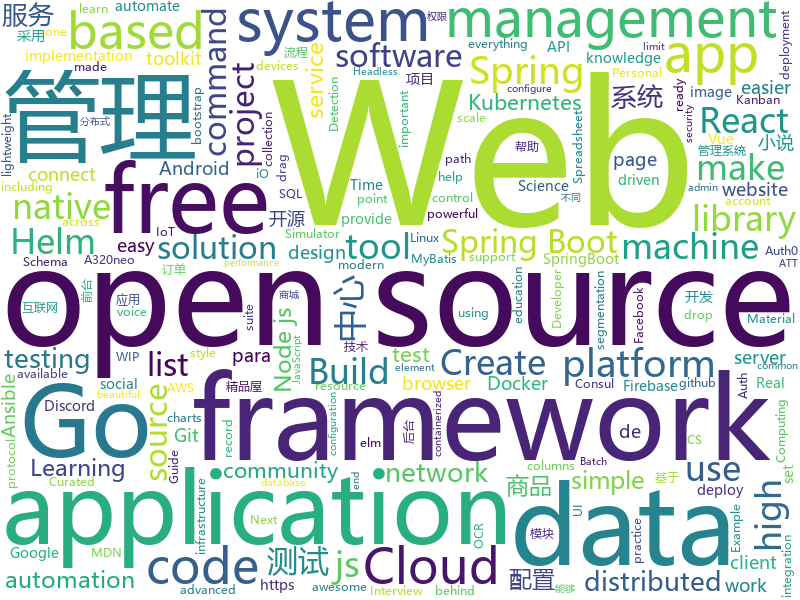

# 2020-12-18
See what the GitHub community is most excited about.

## python
+ [SunBurst_DGA_Decode](https://github.com/RedDrip7/SunBurst_DGA_Decode)(**36 stars today**): SunBurst DGA Decode Script
+ [wave](https://github.com/h2oai/wave)(**199 stars today**): Realtime Web Apps and Dashboards for Python
+ [PaddleOCR](https://github.com/PaddlePaddle/PaddleOCR)(**166 stars today**): Awesome multilingual OCR toolkits based on PaddlePaddle （practical ultra lightweight OCR system, provide data annotation and synthesis tools, support training and deployment among server, mobile, embedded and IoT devices）
+ [r0capture](https://github.com/r0ysue/r0capture)(**79 stars today**): 安卓应用层抓包通杀脚本
+ [sherlock](https://github.com/sherlock-project/sherlock)(**334 stars today**): 🔎Hunt down social media accounts by username across social networks
+ [system-design-primer](https://github.com/donnemartin/system-design-primer)(**267 stars today**): Learn how to design large-scale systems. Prep for the system design interview. Includes Anki flashcards.
+ [fastapi](https://github.com/tiangolo/fastapi)(**257 stars today**): FastAPI framework, high performance, easy to learn, fast to code, ready for production
+ [public-apis](https://github.com/public-apis/public-apis)(**290 stars today**): A collective list of free APIs for use in software and web development.
+ [BackgroundMattingV2](https://github.com/PeterL1n/BackgroundMattingV2)(**314 stars today**): Real-Time High-Resolution Background Matting
+ [django](https://github.com/django/django)(**33 stars today**): The Web framework for perfectionists with deadlines.
+ [traingenerator](https://github.com/jrieke/traingenerator)(**58 stars today**): 🧙A web app to generate template code for machine learning
+ [jumpserver](https://github.com/jumpserver/jumpserver)(**87 stars today**): JumpServer 是全球首款开源的堡垒机，是符合 4A 的专业运维安全审计系统。
+ [rasa](https://github.com/RasaHQ/rasa)(**8 stars today**): 💬Open source machine learning framework to automate text- and voice-based conversations: NLU, dialogue management, connect to Slack, Facebook, and more - Create chatbots and voice assistants
+ [VIBE](https://github.com/mkocabas/VIBE)(**13 stars today**): Official implementation of CVPR2020 paper "VIBE: Video Inference for Human Body Pose and Shape Estimation"
+ [996Quant](https://github.com/Rgveda/996Quant)(**31 stars today**): 35岁程序员退路之量化投资学习笔记
+ [dask](https://github.com/dask/dask)(**12 stars today**): Parallel computing with task scheduling
+ [discord-py-slash-command](https://github.com/eunwoo1104/discord-py-slash-command)(**12 stars today**): Simple Discord Slash Command extension for discord.py.
+ [ansible](https://github.com/ansible/ansible)(**20 stars today**): Ansible is a radically simple IT automation platform that makes your applications and systems easier to deploy and maintain. Automate everything from code deployment to network configuration to cloud management, in a language that approaches plain English, using SSH, with no agents to install on remote systems. https://docs.ansible.com.
+ [RAASNet](https://github.com/leonv024/RAASNet)(**25 stars today**): Open-Source Ransomware As A Service for Linux, MacOS and Windows
+ [detectron2](https://github.com/facebookresearch/detectron2)(**13 stars today**): Detectron2 is FAIR's next-generation platform for object detection and segmentation.
+ [attack-control-framework-mappings](https://github.com/center-for-threat-informed-defense/attack-control-framework-mappings)(**14 stars today**): Security control framework mappings to MITRE ATT&CK provide a critically important resource for organizations to assess their security control coverage against real-world threats and provide a bridge for integrating ATT&CK-based threat information into the risk management process.
+ [MODNet](https://github.com/ZHKKKe/MODNet)(**46 stars today**): A Trimap-Free Solution for Portrait Matting in Real Time under Changing Scenes
+ [Pytorch-UNet](https://github.com/milesial/Pytorch-UNet)(**11 stars today**): PyTorch implementation of the U-Net for image semantic segmentation with high quality images
+ [Genshin-Artifact-Rater](https://github.com/shrubin/Genshin-Artifact-Rater)(**14 stars today**): 
+ [prefect](https://github.com/PrefectHQ/prefect)(**12 stars today**): The easiest way to automate your data

## java
+ [metersphere](https://github.com/metersphere/metersphere)(**147 stars today**): 【求 Star!】【求 Fork!】【求关注!】An open source continuous testing platform. MeterSphere 是一站式开源持续测试平台，涵盖测试跟踪、接口测试、性能测试、团队协作等功能，全面兼容 JMeter、Postman 等开源、主流标准。项目采用 SpringBoot 2.x + MyBatis + Vue.js + Element + Docker + Kafka + MySQL等开发。
+ [Digital](https://github.com/hneemann/Digital)(**30 stars today**): A digital logic designer and circuit simulator.
+ [quarkus](https://github.com/quarkusio/quarkus)(**9 stars today**): Quarkus: Supersonic Subatomic Java.
+ [ghidra](https://github.com/NationalSecurityAgency/ghidra)(**71 stars today**): Ghidra is a software reverse engineering (SRE) framework
+ [supertokens-core](https://github.com/supertokens/supertokens-core)(**554 stars today**): Open source alternative to Auth0 / Firebase Auth / AWS Cognito
+ [elasticsearch](https://github.com/elastic/elasticsearch)(**26 stars today**): Open Source, Distributed, RESTful Search Engine
+ [jenkins](https://github.com/jenkinsci/jenkins)(**10 stars today**): Jenkins automation server
+ [schema-registry](https://github.com/confluentinc/schema-registry)(**3 stars today**): Confluent Schema Registry for Kafka
+ [expo](https://github.com/expo/expo)(**6 stars today**): An open-source platform for making universal native apps with React. Expo runs on Android, iOS, and the web.
+ [zaproxy](https://github.com/zaproxy/zaproxy)(**6 stars today**): The OWASP ZAP core project
+ [mall](https://github.com/macrozheng/mall)(**50 stars today**): mall项目是一套电商系统，包括前台商城系统及后台管理系统，基于SpringBoot+MyBatis实现，采用Docker容器化部署。 前台商城系统包含首页门户、商品推荐、商品搜索、商品展示、购物车、订单流程、会员中心、客户服务、帮助中心等模块。 后台管理系统包含商品管理、订单管理、会员管理、促销管理、运营管理、内容管理、统计报表、财务管理、权限管理、设置等模块。
+ [springboot-guide](https://github.com/Snailclimb/springboot-guide)(**7 stars today**): Not only Spring Boot but also important knowledge of Spring（不只是SpringBoot还有Spring重要知识点）
+ [flink](https://github.com/apache/flink)(**15 stars today**): Apache Flink
+ [karate](https://github.com/intuit/karate)(**4 stars today**): Test Automation Made Simple
+ [micronaut-core](https://github.com/micronaut-projects/micronaut-core)(**6 stars today**): Micronaut Application Framework
+ [zeppelin](https://github.com/apache/zeppelin)(**6 stars today**): Web-based notebook that enables data-driven, interactive data analytics and collaborative documents with SQL, Scala and more.
+ [firebase-android-sdk](https://github.com/firebase/firebase-android-sdk)(**3 stars today**): Firebase Android SDK
+ [netty](https://github.com/netty/netty)(**15 stars today**): Netty project - an event-driven asynchronous network application framework
+ [hmily](https://github.com/dromara/hmily)(**4 stars today**): Distributed transaction solutions
+ [beam](https://github.com/apache/beam)(**3 stars today**): Apache Beam is a unified programming model for Batch and Streaming
+ [okhttp](https://github.com/square/okhttp)(**18 stars today**): Square’s meticulous HTTP client for the JVM, Android, and GraalVM.
+ [apollo](https://github.com/ctripcorp/apollo)(**18 stars today**): Apollo（阿波罗）是携程框架部门研发的分布式配置中心，能够集中化管理应用不同环境、不同集群的配置，配置修改后能够实时推送到应用端，并且具备规范的权限、流程治理等特性，适用于微服务配置管理场景。
+ [camunda-bpm-platform](https://github.com/camunda/camunda-bpm-platform)(**1 stars today**): Flexible framework for workflow and decision automation with BPMN and DMN. Integration with Spring, Spring Boot, CDI.
+ [novel-cloud](https://github.com/201206030/novel-cloud)(**10 stars today**): 小说精品屋-微服务版是基于小说精品屋-plus构建的Spring Cloud 微服务技术栈学习型小说项目，致力于原创文学阅读与写作，提供了爬虫工具用于开发过程中测试数据的采集。采用了时下最新的Spring Boot 2.2.5.RELEASE 、Spring Cloud Hoxton.SR4、 MyBatis3DynamicSql、Sharding-Jdbc、Redis、RabbitMq、Elasticsearch、Docker等流行技术，集成了Nacos注册中心/配置中心、Spring Cloud Gateway网关、Spring Boot Admin监控中心、ELK分布式日志分析等基础服务。前端计划使用Vue开发。
+ [feast](https://github.com/feast-dev/feast)(**4 stars today**): Feature Store for Machine Learning

## unknown
+ [coding-interview-university](https://github.com/jwasham/coding-interview-university)(**1,122 stars today**): A complete computer science study plan to become a software engineer.
+ [solutions-architecture-patterns](https://github.com/chanakaudaya/solutions-architecture-patterns)(**118 stars today**): This repository contains solutions architecture patterns which can be reused to build enterprise software systems
+ [the-art-of-command-line](https://github.com/jlevy/the-art-of-command-line)(**158 stars today**): Master the command line, in one page
+ [build-your-own-x](https://github.com/danistefanovic/build-your-own-x)(**358 stars today**): 🤓Build your own (insert technology here)
+ [research](https://github.com/bambenek/research)(**28 stars today**): 
+ [kubernetes-network-policy-recipes](https://github.com/ahmetb/kubernetes-network-policy-recipes)(**5 stars today**): Example recipes for Kubernetes Network Policies that you can just copy paste
+ [stanford-cs-229-machine-learning](https://github.com/afshinea/stanford-cs-229-machine-learning)(**16 stars today**): VIP cheatsheets for Stanford's CS 229 Machine Learning
+ [golang-open-source-projects](https://github.com/hackstoic/golang-open-source-projects)(**11 stars today**): 为互联网IT人打造的中文版awesome-go
+ [ShameCom](https://github.com/ShameCom/ShameCom)(**35 stars today**): 收集校招污点公司或组织，帮助学弟学妹避雷。互联网不曾遗忘！
+ [how-web-works](https://github.com/vasanthk/how-web-works)(**57 stars today**): What happens behind the scenes when we type www.google.com in a browser?
+ [recursos-gratuitos](https://github.com/iuricode/recursos-gratuitos)(**14 stars today**): 🌈Uma coleção com links de recursos gratuitos para desenvolvimentos e estudos.
+ [Specs](https://github.com/CocoaPods/Specs)(**2 stars today**): The CocoaPods Master Repo
+ [Awesome-Hacking-Resources](https://github.com/vitalysim/Awesome-Hacking-Resources)(**23 stars today**): A collection of hacking / penetration testing resources to make you better!
+ [vagas](https://github.com/backend-br/vagas)(**6 stars today**): ✌️Espaço para divulgação de vagas para backenders
+ [AZ-900FAQ](https://github.com/davidcervigonluna/AZ-900FAQ)(**0 stars today**): 
+ [docs](https://github.com/laravel/docs)(**2 stars today**): 
+ [solarwinds-threathunt](https://github.com/sophos-cybersecurity/solarwinds-threathunt)(**5 stars today**): Threathunt details for the Solarwinds compromise
+ [CKAD-exercises](https://github.com/dgkanatsios/CKAD-exercises)(**7 stars today**): A set of exercises to prepare for Certified Kubernetes Application Developer exam by Cloud Native Computing Foundation
+ [gitignore](https://github.com/github/gitignore)(**133 stars today**): A collection of useful .gitignore templates
+ [frontend-challenges](https://github.com/felipefialho/frontend-challenges)(**12 stars today**): 💥Listing some playful open-source's challenges of jobs to test your knowledge
+ [data-science](https://github.com/ossu/data-science)(**6 stars today**): 📊Path to a free self-taught education in Data Science!
+ [guide](https://github.com/uber-go/guide)(**22 stars today**): The Uber Go Style Guide.
+ [raft-zh_cn](https://github.com/maemual/raft-zh_cn)(**7 stars today**): Raft一致性算法论文的中文翻译
+ [angular-interview-questions](https://github.com/sudheerj/angular-interview-questions)(**3 stars today**): List of 300 Angular Interview Questions and answers
+ [free-programming-books](https://github.com/EbookFoundation/free-programming-books)(**221 stars today**): 📚Freely available programming books

## javascript
+ [strapi](https://github.com/strapi/strapi)(**45 stars today**): 🚀Open source Node.js Headless CMS to easily build customisable APIs
+ [locomotive-scroll](https://github.com/locomotivemtl/locomotive-scroll)(**69 stars today**): 🛤Detection of elements in viewport & smooth scrolling with parallax.
+ [discord.js](https://github.com/discordjs/discord.js)(**21 stars today**): A powerful JavaScript library for interacting with the Discord API
+ [create-react-app](https://github.com/facebook/create-react-app)(**29 stars today**): Set up a modern web app by running one command.
+ [builderbook](https://github.com/builderbook/builderbook)(**119 stars today**): Open source web application to learn JS stack: React, Material-UI, Next.js, Node.js, Express.js, Mongoose, MongoDB database.
+ [nodebestpractices](https://github.com/goldbergyoni/nodebestpractices)(**149 stars today**): ✅The Node.js best practices list (December 2020)
+ [quasar](https://github.com/quasarframework/quasar)(**13 stars today**): Quasar Framework - Build high-performance VueJS user interfaces in record time
+ [bigbluebutton](https://github.com/bigbluebutton/bigbluebutton)(**13 stars today**): Complete open source web conferencing system.
+ [element3](https://github.com/hug-sun/element3)(**21 stars today**): A Vue.js 3.0 UI Toolkit for Web.
+ [winston](https://github.com/winstonjs/winston)(**9 stars today**): A logger for just about everything.
+ [react-native](https://github.com/facebook/react-native)(**29 stars today**): A framework for building native apps with React.
+ [carbon](https://github.com/carbon-app/carbon)(**28 stars today**): 🖤Create and share beautiful images of your source code
+ [eslint-plugin-import](https://github.com/benmosher/eslint-plugin-import)(**4 stars today**): ESLint plugin with rules that help validate proper imports.
+ [a32nx](https://github.com/flybywiresim/a32nx)(**9 stars today**): The A32NX Project is a community driven open source project to create a free Airbus A320neo in Microsoft Flight Simulator that is as close to reality as possible. It aims to enhance the default A320neo by improving the systems depth and functionality to bring it up to payware-level, all for free.
+ [elementor](https://github.com/elementor/elementor)(**1 stars today**): The most advanced frontend drag & drop page builder. Create high-end, pixel perfect websites at record speeds. Any theme, any page, any design.
+ [axios](https://github.com/axios/axios)(**40 stars today**): Promise based HTTP client for the browser and node.js
+ [dva](https://github.com/dvajs/dva)(**3 stars today**): 🌱React and redux based, lightweight and elm-style framework. (Inspired by elm and choo)
+ [react-player](https://github.com/cookpete/react-player)(**13 stars today**): A React component for playing a variety of URLs, including file paths, YouTube, Facebook, Twitch, SoundCloud, Streamable, Vimeo, Wistia and DailyMotion
+ [Luckysheet](https://github.com/mengshukeji/Luckysheet)(**40 stars today**): Luckysheet is an online spreadsheet like excel that is powerful, simple to configure, and completely open source.
+ [js.org](https://github.com/js-org/js.org)(**9 stars today**): Dedicated to JavaScript and its awesome community since 2015
+ [sheetjs](https://github.com/SheetJS/sheetjs)(**19 stars today**): 📗SheetJS Community Edition -- Spreadsheet Data Toolkit
+ [prettier](https://github.com/prettier/prettier)(**14 stars today**): Prettier is an opinionated code formatter.
+ [vue-admin-template](https://github.com/PanJiaChen/vue-admin-template)(**16 stars today**): a vue2.0 minimal admin template
+ [bootstrap-datepicker](https://github.com/uxsolutions/bootstrap-datepicker)(**1 stars today**): A datepicker for twitter bootstrap (@twbs)
+ [sortablejs](https://github.com/SortableJS/sortablejs)(**4 stars today**): Create and reorder lists with drag-and-drop. For use with modern browsers and touch devices

## html
+ [personal-kanban](https://github.com/nishantpainter/personal-kanban)(**21 stars today**): 📌Personal Kanban Board is an agile project management tool that helps you visualise your work, limit your work-in-progress (WIP) and to craft & optimise your work flow to get the maximum output. To achieve this, it makes use of columns and cards. Personal Kanban offers visual clue, columns, WIP limits, start point and end point to set you up f…
+ [matrix-docker-ansible-deploy](https://github.com/spantaleev/matrix-docker-ansible-deploy)(**19 stars today**): Matrix (An open network for secure, decentralized communication) server setup using Ansible and Docker
+ [content](https://github.com/mdn/content)(**110 stars today**): The content behind MDN Web Docs
+ [argo-helm](https://github.com/argoproj/argo-helm)(**1 stars today**): ArgoProj Helm Charts
+ [helm-charts](https://github.com/codecentric/helm-charts)(**0 stars today**): A curated set of Helm charts brought to you by codecentric
+ [computer-science-flash-cards](https://github.com/jwasham/computer-science-flash-cards)(**17 stars today**): Mini website for testing both general CS knowledge and enforce coding practice and common algorithm/data structure memorization.
+ [free_r_tips](https://github.com/business-science/free_r_tips)(**1 stars today**): Free R-Tips is a FREE Newsletter provided by Business Science. It comes with bite-sized code tutorials every Tuesday.
+ [blackeye](https://github.com/x3rz/blackeye)(**1 stars today**): This is the updated version of blackeye with ngrok
+ [styleguide](https://github.com/google/styleguide)(**16 stars today**): Style guides for Google-originated open-source projects
+ [kubespray](https://github.com/kubernetes-sigs/kubespray)(**7 stars today**): Deploy a Production Ready Kubernetes Cluster
+ [almanac.httparchive.org](https://github.com/HTTPArchive/almanac.httparchive.org)(**6 stars today**): HTTP Archive's annual "State of the Web" report made by the web community
+ [icons](https://github.com/twbs/icons)(**8 stars today**): Official open source SVG icon library for Bootstrap.
+ [quickstart-js](https://github.com/firebase/quickstart-js)(**3 stars today**): Firebase Quickstart Samples for Web
+ [devdocs](https://github.com/magento/devdocs)(**0 stars today**): Magento Developer Documentation
+ [html-css](https://github.com/gustavoguanabara/html-css)(**9 stars today**): Curso de HTML5 e CSS3
+ [tools](https://github.com/googlecodelabs/tools)(**6 stars today**): Codelabs management & hosting tools
+ [charts](https://github.com/bitnami/charts)(**7 stars today**): Helm Charts
+ [learning-area](https://github.com/mdn/learning-area)(**6 stars today**): Github repo for the MDN Learning Area.
+ [git-it-electron](https://github.com/jlord/git-it-electron)(**2 stars today**): 💻🎓Git-it is a (Mac, Win, Linux) Desktop App for Learning Git and GitHub
+ [helm-charts](https://github.com/jenkinsci/helm-charts)(**1 stars today**): Jenkins community Helm charts
+ [ai-edu](https://github.com/microsoft/ai-edu)(**7 stars today**): AI education materials for Chinese students, teachers and IT professionals.
+ [helm-charts](https://github.com/DataDog/helm-charts)(**1 stars today**): Helm charts for Datadog products
+ [beautiful-jekyll](https://github.com/daattali/beautiful-jekyll)(**3 stars today**): ✨Build a beautiful and simple website in literally minutes. Demo at https://beautifuljekyll.com
+ [cypress-example-kitchensink](https://github.com/cypress-io/cypress-example-kitchensink)(**0 stars today**): This is an example app used to showcase Cypress.io testing.
+ [wpt](https://github.com/web-platform-tests/wpt)(**4 stars today**): Test suites for Web platform specs — including WHATWG, W3C, and others

## go
+ [packer](https://github.com/hashicorp/packer)(**247 stars today**): Packer is a tool for creating identical machine images for multiple platforms from a single source configuration.
+ [consul](https://github.com/hashicorp/consul)(**12 stars today**): Consul is a distributed, highly available, and data center aware solution to connect and configure applications across dynamic, distributed infrastructure.
+ [k0s](https://github.com/k0sproject/k0s)(**100 stars today**): k0s - Zero Friction Kubernetes
+ [nomad](https://github.com/hashicorp/nomad)(**5 stars today**): Nomad is an easy-to-use, flexible, and performant workload orchestrator that can deploy a mix of microservice, batch, containerized, and non-containerized applications. Nomad is easy to operate and scale and has native Consul and Vault integrations.
+ [iris](https://github.com/kataras/iris)(**17 stars today**): The fastest HTTP/2 Go Web Framework. AWS Lambda, gRPC, MVC, Unique Router, Websockets, Sessions, Test suite, Dependency Injection and more. A true successor of expressjs and laravel | 谢谢 https://github.com/kataras/iris/issues/1329 |
+ [ebiten](https://github.com/hajimehoshi/ebiten)(**11 stars today**): A dead simple 2D game library for Go
+ [vault](https://github.com/hashicorp/vault)(**8 stars today**): A tool for secrets management, encryption as a service, and privileged access management
+ [lotus](https://github.com/filecoin-project/lotus)(**2 stars today**): Implementation of the Filecoin protocol, written in Go
+ [kubernetes](https://github.com/kubernetes/kubernetes)(**37 stars today**): Production-Grade Container Scheduling and Management
+ [opentelemetry-collector](https://github.com/open-telemetry/opentelemetry-collector)(**4 stars today**): OpenTelemetry Collector
+ [VictoriaMetrics](https://github.com/VictoriaMetrics/VictoriaMetrics)(**17 stars today**): VictoriaMetrics: fast, cost-effective monitoring solution and time series database
+ [kratos](https://github.com/ory/kratos)(**28 stars today**): Next-gen Go identity server (think Auth0, Okta, KeyCloak) with ORY-hardened authentication, MFA, FIDO2, profile management, identity schemas, social sign in, registration, account recovery, service-to-service and IoT auth. Optional an OAuth2 / OpenID Connect Provider. Headless and API-only, without templating or theming headaches.
+ [protobuf](https://github.com/golang/protobuf)(**5 stars today**): Go support for Google's protocol buffers
+ [gotk3](https://github.com/gotk3/gotk3)(**3 stars today**): Go bindings for GTK3
+ [charts](https://github.com/helm/charts)(**4 stars today**): ⚠️(OBSOLETE) Curated applications for Kubernetes
+ [cockroach](https://github.com/cockroachdb/cockroach)(**15 stars today**): CockroachDB - the open source, cloud-native distributed SQL database.
+ [testify](https://github.com/stretchr/testify)(**7 stars today**): A toolkit with common assertions and mocks that plays nicely with the standard library
+ [ingress-nginx](https://github.com/kubernetes/ingress-nginx)(**11 stars today**): NGINX Ingress Controller for Kubernetes
+ [dns](https://github.com/miekg/dns)(**3 stars today**): DNS library in Go
+ [terratest](https://github.com/gruntwork-io/terratest)(**6 stars today**): Terratest is a Go library that makes it easier to write automated tests for your infrastructure code.
+ [redigo](https://github.com/gomodule/redigo)(**4 stars today**): Go client for Redis
+ [hub](https://github.com/github/hub)(**4 stars today**): A command-line tool that makes git easier to use with GitHub.
+ [helmfile](https://github.com/roboll/helmfile)(**12 stars today**): Deploy Kubernetes Helm Charts
+ [jwt-go](https://github.com/dgrijalva/jwt-go)(**6 stars today**): Golang implementation of JSON Web Tokens (JWT)
+ [go-tools](https://github.com/dominikh/go-tools)(**4 stars today**): Staticcheck - The advanced Go linter

## WordCloud

