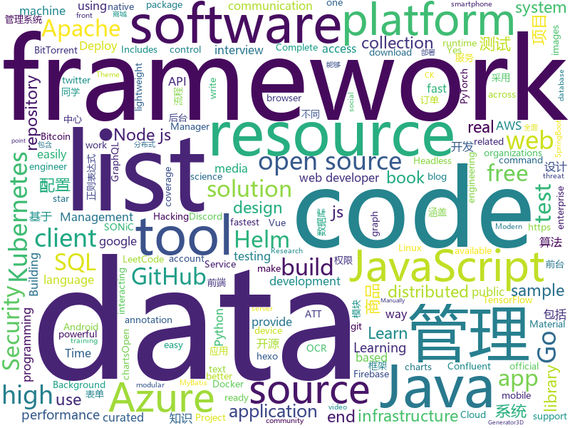

# 2020-12-19
See what the GitHub community is most excited about.

## python
+ [BackgroundMattingV2](https://github.com/PeterL1n/BackgroundMattingV2)(**543 stars today**): Real-Time High-Resolution Background Matting
+ [wave](https://github.com/h2oai/wave)(**370 stars today**): Realtime Web Apps and Dashboards for Python
+ [public-apis](https://github.com/public-apis/public-apis)(**342 stars today**): A collective list of free APIs for use in software and web development.
+ [system-design-primer](https://github.com/donnemartin/system-design-primer)(**290 stars today**): Learn how to design large-scale systems. Prep for the system design interview. Includes Anki flashcards.
+ [airflow](https://github.com/apache/airflow)(**20 stars today**): Apache Airflow - A platform to programmatically author, schedule, and monitor workflows
+ [thefuck](https://github.com/nvbn/thefuck)(**53 stars today**): Magnificent app which corrects your previous console command.
+ [TinyCheck](https://github.com/KasperskyLab/TinyCheck)(**75 stars today**): TinyCheck allows you to easily capture network communications from a smartphone or any device which can be associated to a Wi-Fi access point in order to quickly analyze them. This can be used to check if any suspect or malicious communication is outgoing from a smartphone, by using heuristics or specific Indicators of Compromise (IoCs). In orde…
+ [fastapi](https://github.com/tiangolo/fastapi)(**268 stars today**): FastAPI framework, high performance, easy to learn, fast to code, ready for production
+ [RAASNet](https://github.com/leonv024/RAASNet)(**11 stars today**): Open-Source Ransomware As A Service for Linux, MacOS and Windows
+ [PaddleOCR](https://github.com/PaddlePaddle/PaddleOCR)(**187 stars today**): Awesome multilingual OCR toolkits based on PaddlePaddle （practical ultra lightweight OCR system, provide data annotation and synthesis tools, support training and deployment among server, mobile, embedded and IoT devices）
+ [streamlit](https://github.com/streamlit/streamlit)(**24 stars today**): Streamlit — The fastest way to build data apps in Python
+ [django](https://github.com/django/django)(**45 stars today**): The Web framework for perfectionists with deadlines.
+ [discord.py](https://github.com/Rapptz/discord.py)(**11 stars today**): An API wrapper for Discord written in Python.
+ [Real-Time-Voice-Cloning](https://github.com/CorentinJ/Real-Time-Voice-Cloning)(**29 stars today**): Clone a voice in 5 seconds to generate arbitrary speech in real-time
+ [bpytop](https://github.com/aristocratos/bpytop)(**92 stars today**): Linux/OSX/FreeBSD resource monitor
+ [rembg](https://github.com/danielgatis/rembg)(**33 stars today**): Rembg is a tool to remove images background.
+ [attack-control-framework-mappings](https://github.com/center-for-threat-informed-defense/attack-control-framework-mappings)(**7 stars today**): Security control framework mappings to MITRE ATT&CK provide a critically important resource for organizations to assess their security control coverage against real-world threats and provide a bridge for integrating ATT&CK-based threat information into the risk management process.
+ [r0capture](https://github.com/r0ysue/r0capture)(**75 stars today**): 安卓应用层抓包通杀脚本
+ [sherlock](https://github.com/sherlock-project/sherlock)(**269 stars today**): 🔎Hunt down social media accounts by username across social networks
+ [zoomout](https://github.com/lanewinfield/zoomout)(**102 stars today**): a pull switch (or BYO button) that gets you out of video calls, quick
+ [electrum](https://github.com/spesmilo/electrum)(**6 stars today**): Electrum Bitcoin Wallet
+ [horovod](https://github.com/horovod/horovod)(**8 stars today**): Distributed training framework for TensorFlow, Keras, PyTorch, and Apache MXNet.
+ [Hub](https://github.com/activeloopai/Hub)(**26 stars today**): The fastest way to access and manage datasets for PyTorch and TensorFlow. Easily build scalable data pipelines. Leading Data 2.0 http://activeloop.ai
+ [mmf](https://github.com/facebookresearch/mmf)(**4 stars today**): A modular framework for vision & language multimodal research from Facebook AI Research (FAIR)
+ [saleor](https://github.com/mirumee/saleor)(**15 stars today**): A modular, high performance, headless e-commerce platform built with Python, GraphQL, Django, and ReactJS.

## java
+ [ghidra](https://github.com/NationalSecurityAgency/ghidra)(**75 stars today**): Ghidra is a software reverse engineering (SRE) framework
+ [supertokens-core](https://github.com/supertokens/supertokens-core)(**329 stars today**): Open source alternative to Auth0 / Firebase Auth / AWS Cognito
+ [jedis](https://github.com/redis/jedis)(**4 stars today**): A blazingly small and sane redis java client
+ [metersphere](https://github.com/metersphere/metersphere)(**74 stars today**): 【求 Star!】【求 Fork!】【求关注!】An open source continuous testing platform. MeterSphere 是一站式开源持续测试平台，涵盖测试跟踪、接口测试、性能测试、团队协作等功能，全面兼容 JMeter、Postman 等开源、主流标准。项目采用 SpringBoot 2.x + MyBatis + Vue.js + Element + Docker + Kafka + MySQL等开发。
+ [hello-algorithm](https://github.com/geekxh/hello-algorithm)(**73 stars today**): 🌍「算法面试+算法知识」针对小白的算法训练 | 还包括：1、阿里、字节、滴滴 百篇大厂面经汇总 2、千本开源电子书 3、百张思维导图 （右侧来个 star 吧🌹，English version supported）
+ [serve](https://github.com/pytorch/serve)(**7 stars today**): Model Serving on PyTorch
+ [tutorials](https://github.com/eugenp/tutorials)(**27 stars today**): Just Announced - "Learn Spring Security OAuth":
+ [quarkus](https://github.com/quarkusio/quarkus)(**12 stars today**): Quarkus: Supersonic Subatomic Java.
+ [baritone](https://github.com/cabaletta/baritone)(**8 stars today**): google maps for block game
+ [mall](https://github.com/macrozheng/mall)(**55 stars today**): mall项目是一套电商系统，包括前台商城系统及后台管理系统，基于SpringBoot+MyBatis实现，采用Docker容器化部署。 前台商城系统包含首页门户、商品推荐、商品搜索、商品展示、购物车、订单流程、会员中心、客户服务、帮助中心等模块。 后台管理系统包含商品管理、订单管理、会员管理、促销管理、运营管理、内容管理、统计报表、财务管理、权限管理、设置等模块。
+ [presto](https://github.com/prestodb/presto)(**6 stars today**): The official home of the Presto distributed SQL query engine for big data
+ [dubbo-samples](https://github.com/apache/dubbo-samples)(**2 stars today**): samples for Apache Dubbo
+ [soul](https://github.com/dromara/soul)(**9 stars today**): High-Performance Java API Gateway
+ [NewPipe](https://github.com/TeamNewPipe/NewPipe)(**19 stars today**): A libre lightweight streaming front-end for Android.
+ [firebase-android-sdk](https://github.com/firebase/firebase-android-sdk)(**4 stars today**): Firebase Android SDK
+ [apollo](https://github.com/ctripcorp/apollo)(**22 stars today**): Apollo（阿波罗）是携程框架部门研发的分布式配置中心，能够集中化管理应用不同环境、不同集群的配置，配置修改后能够实时推送到应用端，并且具备规范的权限、流程治理等特性，适用于微服务配置管理场景。
+ [xdm](https://github.com/subhra74/xdm)(**8 stars today**): Powerfull download accelerator and video downloader
+ [SuperMarket](https://github.com/GoogleLLP/SuperMarket)(**30 stars today**): 设计精良的网上商城系统，包括前端、后端、数据库、负载均衡、数据库缓存、分库分表、读写分离、全文检索、消息队列等，使用SpringCloud框架，基于Java开发。该项目可部署到服务器上，不断完善中……
+ [seata](https://github.com/seata/seata)(**19 stars today**): 🔥Seata is an easy-to-use, high-performance, open source distributed transaction solution.
+ [micronaut-core](https://github.com/micronaut-projects/micronaut-core)(**4 stars today**): Micronaut Application Framework
+ [advanced-java](https://github.com/doocs/advanced-java)(**34 stars today**): 😮互联网 Java 工程师进阶知识完全扫盲：涵盖高并发、分布式、高可用、微服务、海量数据处理等领域知识，后端同学必看，前端同学也可学习
+ [keycloak](https://github.com/keycloak/keycloak)(**11 stars today**): Open Source Identity and Access Management For Modern Applications and Services
+ [besu](https://github.com/hyperledger/besu)(**2 stars today**): An enterprise-grade Java-based, Apache 2.0 licensed Ethereum client https://wiki.hyperledger.org/display/besu
+ [ftgo-application](https://github.com/microservices-patterns/ftgo-application)(**6 stars today**): Example code for the book Microservice patterns
+ [ranger](https://github.com/apache/ranger)(**0 stars today**): Mirror of Apache Ranger

## unknown
+ [coding-interview-university](https://github.com/jwasham/coding-interview-university)(**937 stars today**): A complete computer science study plan to become a software engineer.
+ [applied-ml](https://github.com/eugeneyan/applied-ml)(**30 stars today**): 📚Papers by organizations sharing their work on applied data science & machine learning.
+ [solutions-architecture-patterns](https://github.com/chanakaudaya/solutions-architecture-patterns)(**285 stars today**): This repository contains solutions architecture patterns which can be reused to build enterprise software systems
+ [common-regex](https://github.com/cdoco/common-regex)(**292 stars today**): 🎃常用正则表达式 - 收集一些在平时项目开发中经常用到的正则表达式。
+ [machine-learning-interview](https://github.com/khangich/machine-learning-interview)(**68 stars today**): Machine Learning Interviews from FAAG, Snapchat, LinkedIn.
+ [frontend-dev-bookmarks](https://github.com/dypsilon/frontend-dev-bookmarks)(**22 stars today**): Manually curated collection of resources for frontend web developers.
+ [the-art-of-command-line](https://github.com/jlevy/the-art-of-command-line)(**201 stars today**): Master the command line, in one page
+ [awesome-deep-learning](https://github.com/ChristosChristofidis/awesome-deep-learning)(**21 stars today**): A curated list of awesome Deep Learning tutorials, projects and communities.
+ [backendlore](https://github.com/fpereiro/backendlore)(**44 stars today**): How I write backends
+ [Hacking-Security-Ebooks](https://github.com/yeahhub/Hacking-Security-Ebooks)(**29 stars today**): Top 100 Hacking & Security E-Books (Free Download)
+ [developer-roadmap](https://github.com/kamranahmedse/developer-roadmap)(**210 stars today**): Roadmap to becoming a web developer in 2020
+ [Anime-Girls-Holding-Programming-Books](https://github.com/laynH/Anime-Girls-Holding-Programming-Books)(**28 stars today**): Anime Girls Holding Programming Books
+ [covid-19-data](https://github.com/nytimes/covid-19-data)(**6 stars today**): An ongoing repository of data on coronavirus cases and deaths in the U.S.
+ [how-web-works](https://github.com/vasanthk/how-web-works)(**52 stars today**): What happens behind the scenes when we type www.google.com in a browser?
+ [Flutter-Course-Resources](https://github.com/londonappbrewery/Flutter-Course-Resources)(**10 stars today**): Learn to Code While Building Apps - The Complete Flutter Development Bootcamp
+ [the-book-of-secret-knowledge](https://github.com/trimstray/the-book-of-secret-knowledge)(**24 stars today**): A collection of inspiring lists, manuals, cheatsheets, blogs, hacks, one-liners, cli/web tools and more.
+ [gitignore](https://github.com/github/gitignore)(**115 stars today**): A collection of useful .gitignore templates
+ [build-your-own-x](https://github.com/danistefanovic/build-your-own-x)(**297 stars today**): 🤓Build your own (insert technology here)
+ [Awesome-Hacking-Resources](https://github.com/vitalysim/Awesome-Hacking-Resources)(**14 stars today**): A collection of hacking / penetration testing resources to make you better!
+ [sql-server-samples](https://github.com/microsoft/sql-server-samples)(**8 stars today**): Azure Data SQL Samples - Official Microsoft GitHub Repository containing code samples for SQL Server, Azure SQL, Azure Synapse, and Azure SQL Edge
+ [how-to-secure-anything](https://github.com/veeral-patel/how-to-secure-anything)(**55 stars today**): How to systematically secure anything: a repository about security engineering
+ [you-dont-know-js-ru](https://github.com/azat-io/you-dont-know-js-ru)(**7 stars today**): 📚Russian translation of "You Don't Know JS" book series
+ [trackerslist](https://github.com/ngosang/trackerslist)(**29 stars today**): Updated list of public BitTorrent trackers
+ [ps4-ipv6-uaf](https://github.com/ChendoChap/ps4-ipv6-uaf)(**4 stars today**): 
+ [You-Dont-Know-JS](https://github.com/getify/You-Dont-Know-JS)(**61 stars today**): A book series on JavaScript. @YDKJS on twitter.

## javascript
+ [strapi](https://github.com/strapi/strapi)(**88 stars today**): 🚀Open source Node.js Headless CMS to easily build customisable APIs
+ [hls.js](https://github.com/video-dev/hls.js)(**4 stars today**): JavaScript HLS client using Media Source Extension
+ [nodebestpractices](https://github.com/goldbergyoni/nodebestpractices)(**195 stars today**): ✅The Node.js best practices list (December 2020)
+ [discord.js](https://github.com/discordjs/discord.js)(**22 stars today**): A powerful JavaScript library for interacting with the Discord API
+ [Scriptable](https://github.com/dompling/Scriptable)(**10 stars today**): scriptable widget
+ [Rocket.Chat](https://github.com/RocketChat/Rocket.Chat)(**14 stars today**): The ultimate Free Open Source Solution for team communications.
+ [Web-Dev-For-Beginners](https://github.com/microsoft/Web-Dev-For-Beginners)(**26 stars today**): 24 Lessons, 12 Weeks, Get Started as a Web Developer
+ [cli](https://github.com/npm/cli)(**7 stars today**): the package manager for JavaScript
+ [WebGL-Fluid-Simulation](https://github.com/PavelDoGreat/WebGL-Fluid-Simulation)(**41 stars today**): Play with fluids in your browser (works even on mobile)
+ [vuex](https://github.com/vuejs/vuex)(**11 stars today**): 🗃️Centralized State Management for Vue.js.
+ [fullstack-course4](https://github.com/jhu-ep-coursera/fullstack-course4)(**10 stars today**): Example code for HTML, CSS, and Javascript for Web Developers Coursera Course
+ [ps4jb](https://github.com/sleirsgoevy/ps4jb)(**7 stars today**): PS4 6.72 jailbreak
+ [awesome-ctf](https://github.com/apsdehal/awesome-ctf)(**13 stars today**): A curated list of CTF frameworks, libraries, resources and softwares
+ [javascript-algorithms](https://github.com/trekhleb/javascript-algorithms)(**228 stars today**): 📝Algorithms and data structures implemented in JavaScript with explanations and links to further readings
+ [learnGitBranching](https://github.com/pcottle/learnGitBranching)(**37 stars today**): An interactive git visualization to challenge and educate!
+ [dynamoose](https://github.com/dynamoose/dynamoose)(**14 stars today**): Dynamoose is a modeling tool for Amazon's DynamoDB
+ [react-native](https://github.com/facebook/react-native)(**31 stars today**): A framework for building native apps with React.
+ [form-render](https://github.com/alibaba/form-render)(**14 stars today**): 🚴‍♀️易用的跨组件体系的表单渲染引擎 - 通过 JSON Schema 快速生成自定义表单配置界面
+ [highlight.js](https://github.com/highlightjs/highlight.js)(**11 stars today**): Javascript syntax highlighter
+ [screenity](https://github.com/alyssaxuu/screenity)(**68 stars today**): The most powerful screen recorder & annotation tool for Chrome🎥
+ [node](https://github.com/nodejs/node)(**34 stars today**): Node.js JavaScript runtime✨🐢🚀✨
+ [testcafe](https://github.com/DevExpress/testcafe)(**11 stars today**): A Node.js tool to automate end-to-end web testing.
+ [Inputmask](https://github.com/RobinHerbots/Inputmask)(**0 stars today**): Input Mask plugin
+ [You-Dont-Need-Momentjs](https://github.com/you-dont-need/You-Dont-Need-Momentjs)(**18 stars today**): List of functions which you can use to replace moment.js + ESLint Plugin
+ [popcorn-desktop](https://github.com/popcorn-official/popcorn-desktop)(**9 stars today**): Popcorn Time is a multi-platform, free software BitTorrent client that includes an integrated media player ( Windows / Mac / Linux ) A Butter-Project Fork

## html
+ [docker-development-youtube-series](https://github.com/marcel-dempers/docker-development-youtube-series)(**6 stars today**): 
+ [Front-end-Developer-Interview-Questions](https://github.com/h5bp/Front-end-Developer-Interview-Questions)(**21 stars today**): A list of helpful front-end related questions you can use to interview potential candidates, test yourself or completely ignore.
+ [fastText](https://github.com/facebookresearch/fastText)(**6 stars today**): Library for fast text representation and classification.
+ [fonts](https://github.com/google/fonts)(**6 stars today**): Font files available from Google Fonts
+ [helm-charts](https://github.com/prometheus-community/helm-charts)(**7 stars today**): Prometheus community Helm charts
+ [training-kit](https://github.com/github/training-kit)(**5 stars today**): Open source cheat sheets for Git and GitHub
+ [bitaddress.org](https://github.com/pointbiz/bitaddress.org)(**1 stars today**): JavaScript Client-Side Bitcoin Wallet Generator
+ [3d-force-graph](https://github.com/vasturiano/3d-force-graph)(**6 stars today**): 3D force-directed graph component using ThreeJS/WebGL
+ [html-css](https://github.com/gustavoguanabara/html-css)(**10 stars today**): Curso de HTML5 e CSS3
+ [SONiC](https://github.com/Azure/SONiC)(**1 stars today**): Landing page for Software for Open Networking in the Cloud (SONiC) - http://azure.github.io/SONiC/
+ [sample-code](https://github.com/appium-boneyard/sample-code)(**2 stars today**): appium sample code (dotnet, java, node, perl, php, python, ruby, etc.)
+ [malware-samples](https://github.com/jstrosch/malware-samples)(**2 stars today**): Malware samples, analysis exercises and other interesting resources.
+ [learning-area](https://github.com/mdn/learning-area)(**4 stars today**): Github repo for the MDN Learning Area.
+ [twemoji](https://github.com/twitter/twemoji)(**10 stars today**): Emoji for everyone. https://twemoji.twitter.com/
+ [hugo-PaperMod](https://github.com/adityatelange/hugo-PaperMod)(**3 stars today**): Hugo Theme PaperMod
+ [cp-helm-charts](https://github.com/confluentinc/cp-helm-charts)(**0 stars today**): The Confluent Platform Helm charts enable you to deploy Confluent Platform services on Kubernetes for development, test, and proof of concept environments.
+ [free-for-dev](https://github.com/ripienaar/free-for-dev)(**39 stars today**): A list of SaaS, PaaS and IaaS offerings that have free tiers of interest to devops and infradev
+ [helm-charts](https://github.com/vmware-tanzu/helm-charts)(**0 stars today**): Contains Helm charts for Kubernetes related open source tools
+ [IntroLabs](https://github.com/strandjs/IntroLabs)(**4 stars today**): These are the labs for my Intro class. Yes, this is public. Yes, this is intentional.
+ [amundsen](https://github.com/amundsen-io/amundsen)(**5 stars today**): Amundsen is a metadata driven application for improving the productivity of data analysts, data scientists and engineers when interacting with data.
+ [kubespray](https://github.com/kubernetes-sigs/kubespray)(**10 stars today**): Deploy a Production Ready Kubernetes Cluster
+ [trellis](https://github.com/roots/trellis)(**4 stars today**): Ansible playbooks for a WordPress LEMP stack
+ [hexo-theme-matery](https://github.com/blinkfox/hexo-theme-matery)(**7 stars today**): A beautiful hexo blog theme with material design and responsive design.一个基于材料设计和响应式设计而成的全面、美观的Hexo主题。国内访问：http://blinkfox.com
+ [learning-library](https://github.com/oracle/learning-library)(**1 stars today**): Learning Material for Oracle Technologies
+ [helm-charts](https://github.com/jenkinsci/helm-charts)(**1 stars today**): Jenkins community Helm charts

## go
+ [harvester](https://github.com/rancher/harvester)(**87 stars today**): Open source hyperconverged infrastructure (HCI) software
+ [packer](https://github.com/hashicorp/packer)(**233 stars today**): Packer is a tool for creating identical machine images for multiple platforms from a single source configuration.
+ [k0s](https://github.com/k0sproject/k0s)(**215 stars today**): k0s - Zero Friction Kubernetes
+ [go-github](https://github.com/google/go-github)(**5 stars today**): Go library for accessing the GitHub API
+ [argo](https://github.com/argoproj/argo)(**12 stars today**): Argo Workflows: Get stuff done with Kubernetes.
+ [LeetCode-Go](https://github.com/halfrost/LeetCode-Go)(**75 stars today**): ✅Solutions to LeetCode by Go, 100% test coverage, runtime beats 100% / LeetCode 题解
+ [redigo](https://github.com/gomodule/redigo)(**5 stars today**): Go client for Redis
+ [aws-nuke](https://github.com/rebuy-de/aws-nuke)(**7 stars today**): Nuke a whole AWS account and delete all its resources.
+ [consul](https://github.com/hashicorp/consul)(**31 stars today**): Consul is a distributed, highly available, and data center aware solution to connect and configure applications across dynamic, distributed infrastructure.
+ [esbuild](https://github.com/evanw/esbuild)(**24 stars today**): An extremely fast JavaScript bundler and minifier
+ [go-sqlmock](https://github.com/DATA-DOG/go-sqlmock)(**8 stars today**): Sql mock driver for golang to test database interactions
+ [terratest](https://github.com/gruntwork-io/terratest)(**4 stars today**): Terratest is a Go library that makes it easier to write automated tests for your infrastructure code.
+ [helmfile](https://github.com/roboll/helmfile)(**9 stars today**): Deploy Kubernetes Helm Charts
+ [act](https://github.com/nektos/act)(**35 stars today**): Run your GitHub Actions locally🚀
+ [velero](https://github.com/vmware-tanzu/velero)(**5 stars today**): Backup and migrate Kubernetes applications and their persistent volumes
+ [gofpdf](https://github.com/jung-kurt/gofpdf)(**3 stars today**): A PDF document generator with high level support for text, drawing and images
+ [influxdb](https://github.com/influxdata/influxdb)(**13 stars today**): Scalable datastore for metrics, events, and real-time analytics
+ [go](https://github.com/golang/go)(**65 stars today**): The Go programming language
+ [logrus](https://github.com/sirupsen/logrus)(**10 stars today**): Structured, pluggable logging for Go.
+ [aws-sdk-go](https://github.com/aws/aws-sdk-go)(**7 stars today**): AWS SDK for the Go programming language.
+ [cosmos-sdk](https://github.com/cosmos/cosmos-sdk)(**3 stars today**): ⛓️A Framework for Building High Value Public Blockchains✨
+ [dgraph](https://github.com/dgraph-io/dgraph)(**17 stars today**): Native GraphQL Database with graph backend
+ [pulumi](https://github.com/pulumi/pulumi)(**9 stars today**): Pulumi - Modern Infrastructure as Code. Any cloud, any language🚀
+ [tcell](https://github.com/gdamore/tcell)(**4 stars today**): Tcell is an alternate terminal package, similar in some ways to termbox, but better in others.
+ [terraform-provider-azurerm](https://github.com/terraform-providers/terraform-provider-azurerm)(**3 stars today**): Terraform provider for Azure Resource Manager

## WordCloud

