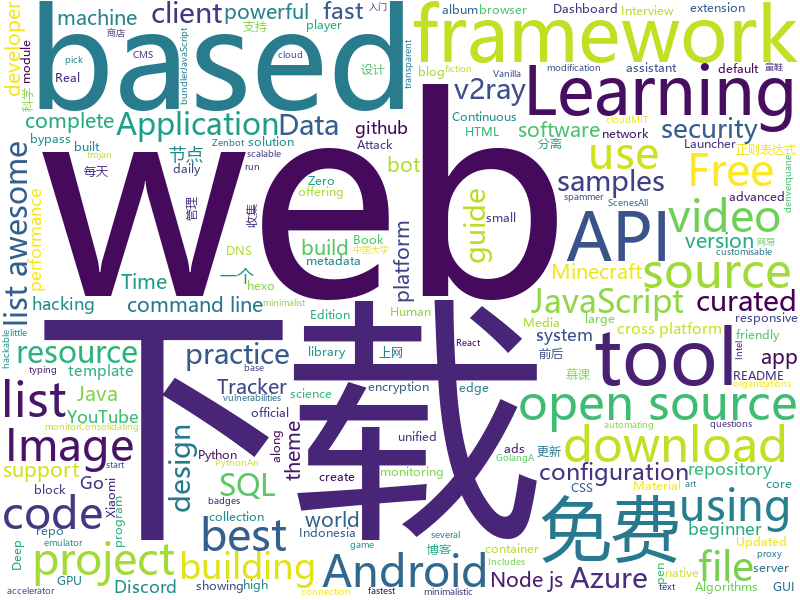

# 2020-12-20
See what the GitHub community is most excited about.

## python
+ [wave](https://github.com/h2oai/wave)(**326 stars today**): Realtime Web Apps and Dashboards for Python
+ [byob](https://github.com/malwaredllc/byob)(**12 stars today**): An open-source post-exploitation framework for students, researchers and developers.
+ [BackgroundMattingV2](https://github.com/PeterL1n/BackgroundMattingV2)(**374 stars today**): Real-Time High-Resolution Background Matting
+ [public-apis](https://github.com/public-apis/public-apis)(**414 stars today**): A collective list of free APIs for use in software and web development.
+ [system-design-primer](https://github.com/donnemartin/system-design-primer)(**251 stars today**): Learn how to design large-scale systems. Prep for the system design interview. Includes Anki flashcards.
+ [PayloadsAllTheThings](https://github.com/swisskyrepo/PayloadsAllTheThings)(**35 stars today**): A list of useful payloads and bypass for Web Application Security and Pentest/CTF
+ [zoomout](https://github.com/lanewinfield/zoomout)(**36 stars today**): a pull switch (or BYO button) that gets you out of video calls, quick
+ [Xiaomi-cloud-tokens-extractor](https://github.com/PiotrMachowski/Xiaomi-cloud-tokens-extractor)(**7 stars today**): This tool/script retrieves tokens for all devices connected to Xiaomi cloud.
+ [liif](https://github.com/yinboc/liif)(**59 stars today**): Learning Continuous Image Representation with Local Implicit Image Function
+ [django-ninja](https://github.com/vitalik/django-ninja)(**53 stars today**): 💨Fast, Async-ready, Openapi, type hints based framework for building APIs
+ [calibre](https://github.com/kovidgoyal/calibre)(**9 stars today**): The official source code repository for the calibre ebook manager
+ [bpytop](https://github.com/aristocratos/bpytop)(**86 stars today**): Linux/OSX/FreeBSD resource monitor
+ [hosts](https://github.com/StevenBlack/hosts)(**17 stars today**): Consolidating and extending hosts files from several well-curated sources. You can optionally pick extensions to block pornography, social media, and other categories.
+ [jax](https://github.com/google/jax)(**21 stars today**): Composable transformations of Python+NumPy programs: differentiate, vectorize, JIT to GPU/TPU, and more
+ [MODNet](https://github.com/ZHKKKe/MODNet)(**51 stars today**): A Trimap-Free Solution for Portrait Matting in Real Time under Changing Scenes
+ [Python](https://github.com/TheAlgorithms/Python)(**66 stars today**): All Algorithms implemented in Python
+ [spotify-downloader](https://github.com/spotDL/spotify-downloader)(**10 stars today**): Download your Spotify playlists and songs along with album art and metadata (from YouTube if a match is found).
+ [DeDRM_tools](https://github.com/apprenticeharper/DeDRM_tools)(**15 stars today**): DeDRM tools for ebooks
+ [spymer](https://github.com/FSystem88/spymer)(**1 stars today**): Simple and relatively powerful SMS spammer | Простой и относительно мощный СМС спамер
+ [A-Hackers-AI-Voice-Assistant](https://github.com/LearnedVector/A-Hackers-AI-Voice-Assistant)(**7 stars today**): A hackers AI voice assistant, built using Python and PyTorch.
+ [Mooc_Downloader](https://github.com/PyJun/Mooc_Downloader)(**12 stars today**): 学无止下载器，慕课下载器，Mooc下载，慕课网下载，中国大学下载，爱课程下载，网易云课堂下载，学堂在线下载，超星学习通下载；支持视频，课件同时下载
+ [instaloader](https://github.com/instaloader/instaloader)(**10 stars today**): Download pictures (or videos) along with their captions and other metadata from Instagram.
+ [sktime](https://github.com/alan-turing-institute/sktime)(**5 stars today**): A unified framework for machine learning with time series
+ [youtube-dl](https://github.com/ytdl-org/youtube-dl)(**135 stars today**): Command-line program to download videos from YouTube.com and other video sites
+ [iPERCore](https://github.com/iPERDance/iPERCore)(**53 stars today**): Liquid Warping GAN with Attention: A Unified Framework for Human Image Synthesis

## java
+ [ghidra](https://github.com/NationalSecurityAgency/ghidra)(**106 stars today**): Ghidra is a software reverse engineering (SRE) framework
+ [supertokens-core](https://github.com/supertokens/supertokens-core)(**281 stars today**): Open source alternative to Auth0 / Firebase Auth / AWS Cognito
+ [Algorithms](https://github.com/williamfiset/Algorithms)(**28 stars today**): A collection of algorithms and data structures
+ [xdm](https://github.com/subhra74/xdm)(**8 stars today**): Powerfull download accelerator and video downloader
+ [baritone](https://github.com/cabaletta/baritone)(**6 stars today**): google maps for block game
+ [jvm](https://github.com/doocs/jvm)(**47 stars today**): 🤗JVM 底层原理知识总结
+ [HikariCP](https://github.com/brettwooldridge/HikariCP)(**10 stars today**): 光 HikariCP・A solid, high-performance, JDBC connection pool at last.
+ [xDrip](https://github.com/NightscoutFoundation/xDrip)(**2 stars today**): Nightscout version of xDrip+
+ [shopizer](https://github.com/shopizer-ecommerce/shopizer)(**4 stars today**): Shopizer java e-commerce software
+ [MCinaBox](https://github.com/AOF-Dev/MCinaBox)(**11 stars today**): MCinaBox - A Minecraft Java Edition Launcher on Android
+ [storage-samples](https://github.com/android/storage-samples)(**3 stars today**): Multiple samples showing the best practices in storage APIs on Android.
+ [halo](https://github.com/halo-dev/halo)(**16 stars today**): ✍An excellent open source blog publishing application. | 一个优秀的开源博客发布应用。
+ [cryptomator](https://github.com/cryptomator/cryptomator)(**9 stars today**): Multi-platform transparent client-side encryption of your files in the cloud
+ [mit-deep-learning-book-pdf](https://github.com/janishar/mit-deep-learning-book-pdf)(**7 stars today**): MIT Deep Learning Book in PDF format (complete and parts) by Ian Goodfellow, Yoshua Bengio and Aaron Courville
+ [reactor-netty](https://github.com/reactor/reactor-netty)(**3 stars today**): TCP/HTTP/UDP client/server with Reactor over Netty
+ [Create](https://github.com/Creators-of-Create/Create)(**19 stars today**): [Forge Mod] Building Tools and Aesthetic Technology
+ [Mindustry](https://github.com/Anuken/Mindustry)(**19 stars today**): A sandbox tower defense game
+ [PojavLauncher](https://github.com/PojavLauncherTeam/PojavLauncher)(**3 stars today**): A Minecraft: Java Edition Launcher for Android based on Boardwalk. Note that v2 will not able to run Minecraft 1.12+.
+ [ebatis](https://github.com/ymm-tech/ebatis)(**53 stars today**): ORM Framework for Elasticsearch
+ [animation-samples](https://github.com/android/animation-samples)(**2 stars today**): Multiple samples showing the best practices in animation on Android.
+ [SmartTubeNext](https://github.com/yuliskov/SmartTubeNext)(**6 stars today**): Better YouTube experience on Android TV
+ [skywalking](https://github.com/apache/skywalking)(**15 stars today**): APM, Application Performance Monitoring System
+ [ripme](https://github.com/RipMeApp/ripme)(**0 stars today**): Downloads albums in bulk
+ [vueblog](https://github.com/MarkerHub/vueblog)(**5 stars today**): 一个前后端分离的简单博客案例，适合刚入门vue，学前后端分离的童鞋！

## unknown
+ [applied-ml](https://github.com/eugeneyan/applied-ml)(**70 stars today**): 📚Papers by organizations sharing their work on applied data science & machine learning.
+ [Hacking-Security-Ebooks](https://github.com/yeahhub/Hacking-Security-Ebooks)(**16 stars today**): Top 100 Hacking & Security E-Books (Free Download)
+ [Profiles](https://github.com/DivineEngine/Profiles)(**22 stars today**): 🌐Dial-up Internet access
+ [the-art-of-command-line](https://github.com/jlevy/the-art-of-command-line)(**215 stars today**): Master the command line, in one page
+ [useful](https://github.com/YauhenKavalchuk/useful)(**12 stars today**): 
+ [solutions-architecture-patterns](https://github.com/chanakaudaya/solutions-architecture-patterns)(**290 stars today**): This repository contains solutions architecture patterns which can be reused to build enterprise software systems
+ [machine-learning-interview](https://github.com/khangich/machine-learning-interview)(**70 stars today**): Machine Learning Interviews from FAAG, Snapchat, LinkedIn.
+ [Xiaomi_Kernel_OpenSource](https://github.com/MiCode/Xiaomi_Kernel_OpenSource)(**5 stars today**): Xiaomi Mobile Phone Kernel OpenSource
+ [Rules](https://github.com/lhie1/Rules)(**4 stars today**): 
+ [javascript-questions](https://github.com/lydiahallie/javascript-questions)(**72 stars today**): A long list of (advanced) JavaScript questions, and their explanations✨
+ [live-study](https://github.com/whiteship/live-study)(**11 stars today**): 온라인 스터디
+ [clash_for_windows_pkg](https://github.com/Fndroid/clash_for_windows_pkg)(**33 stars today**): A Windows/macOS GUI based on Clash
+ [brunch](https://github.com/sebanc/brunch)(**10 stars today**): Boot ChromeOS on x86_64 PC (supports most Intel CPU/GPU or AMD Stoney Ridge)
+ [ClashForAndroid](https://github.com/Kr328/ClashForAndroid)(**24 stars today**): A rule-based tunnel for Android.
+ [awesome-computer-vision](https://github.com/jbhuang0604/awesome-computer-vision)(**9 stars today**): A curated list of awesome computer vision resources
+ [common-regex](https://github.com/cdoco/common-regex)(**147 stars today**): 🎃常用正则表达式 - 收集一些在平时项目开发中经常用到的正则表达式。
+ [awesome-for-beginners](https://github.com/MunGell/awesome-for-beginners)(**43 stars today**): A list of awesome beginners-friendly projects.
+ [free](https://github.com/freefq/free)(**29 stars today**): 免费科学上网,免费节点,免费ssr,免费v2ray,免费vmess节点,免费trojan节点,蓝灯,谷歌商店
+ [sql-server-samples](https://github.com/microsoft/sql-server-samples)(**3 stars today**): Azure Data SQL Samples - Official Microsoft GitHub Repository containing code samples for SQL Server, Azure SQL, Azure Synapse, and Azure SQL Edge
+ [discordjs-bot-guide](https://github.com/AnIdiotsGuide/discordjs-bot-guide)(**3 stars today**): The basic new coder friendly "idiot's guide", Created by Hindsight#2020 and maintained by the community.
+ [awesome-deep-learning](https://github.com/ChristosChristofidis/awesome-deep-learning)(**14 stars today**): A curated list of awesome Deep Learning tutorials, projects and communities.
+ [Clash_Chinese_Patch](https://github.com/BoyceLig/Clash_Chinese_Patch)(**9 stars today**): 
+ [hacker-roadmap](https://github.com/sundowndev/hacker-roadmap)(**10 stars today**): 📌Your beginner pen-testing start guide. A guide for amateur pen testers and a collection of hacking tools, resources and references to practice ethical hacking and web security.
+ [ShameCom](https://github.com/ShameCom/ShameCom)(**22 stars today**): 收集校招污点公司或组织，帮助学弟学妹避雷。互联网不曾遗忘！
+ [TrackersListCollection](https://github.com/XIU2/TrackersListCollection)(**33 stars today**): 🎈Updated daily! A list of popular BitTorrent Trackers! / 每天更新！全网热门 BT Tracker 列表！⭐++

## javascript
+ [edex-ui](https://github.com/GitSquared/edex-ui)(**34 stars today**): A cross-platform, customizable science fiction terminal emulator with advanced monitoring & touchscreen support.
+ [SpaceX-API](https://github.com/r-spacex/SpaceX-API)(**8 stars today**): 🚀Open Source REST API for rocket, core, capsule, pad, and launch data
+ [discord.js](https://github.com/discordjs/discord.js)(**9 stars today**): A powerful JavaScript library for interacting with the Discord API
+ [github-readme-stats](https://github.com/anuraghazra/github-readme-stats)(**82 stars today**): ⚡Dynamically generated stats for your github readmes
+ [fullstack-course4](https://github.com/jhu-ep-coursera/fullstack-course4)(**8 stars today**): Example code for HTML, CSS, and Javascript for Web Developers Coursera Course
+ [strapi](https://github.com/strapi/strapi)(**231 stars today**): 🚀Open source Node.js Headless CMS to easily build customisable APIs
+ [AdminLTE](https://github.com/ColorlibHQ/AdminLTE)(**15 stars today**): AdminLTE - Free admin dashboard template based on Bootstrap 4
+ [getting-started](https://github.com/docker/getting-started)(**4 stars today**): Getting started with Docker
+ [ttv-ublock](https://github.com/odensc/ttv-ublock)(**19 stars today**): Blocking ads on that certain streaming website
+ [iptv](https://github.com/iptv-org/iptv)(**39 stars today**): Collection of 5000+ publicly available IPTV channels from all over the world
+ [nodebestpractices](https://github.com/goldbergyoni/nodebestpractices)(**217 stars today**): ✅The Node.js best practices list (December 2020)
+ [metamask-extension](https://github.com/MetaMask/metamask-extension)(**8 stars today**): 🌐🔌The MetaMask browser extension enables browsing Ethereum blockchain enabled websites
+ [monkeytype](https://github.com/Miodec/monkeytype)(**24 stars today**): A minimalistic typing test
+ [parcel](https://github.com/parcel-bundler/parcel)(**13 stars today**): 📦🚀Blazing fast, zero configuration web application bundler
+ [hls.js](https://github.com/video-dev/hls.js)(**47 stars today**): JavaScript HLS client using Media Source Extension
+ [express](https://github.com/expressjs/express)(**22 stars today**): Fast, unopinionated, minimalist web framework for node.
+ [webhooks-course](https://github.com/TwilioDevEd/webhooks-course)(**5 stars today**): 
+ [pure](https://github.com/pure-css/pure)(**55 stars today**): A set of small, responsive CSS modules that you can use in every web project.
+ [esercizi-di-programmazione-javascript](https://github.com/AlbertoOlla/esercizi-di-programmazione-javascript)(**3 stars today**): Esercizi di informatica! Impara a programmare, metti alla prova!
+ [ark-funds-monitor](https://github.com/KarlZhu-SE/ark-funds-monitor)(**4 stars today**): A small React app to monitor ARK funds daily transactions
+ [webui-aria2](https://github.com/ziahamza/webui-aria2)(**2 stars today**): The aim for this project is to create the worlds best and hottest interface to interact with aria2. Very simple to use, just download and open index.html in any web browser.
+ [react-website-v1](https://github.com/briancodex/react-website-v1)(**0 stars today**): 
+ [Music-bot](https://github.com/ZerioDev/Music-bot)(**3 stars today**): A complete code to download for a music bot. Using a module (discord-player).
+ [atom](https://github.com/atom/atom)(**22 stars today**): The hackable text editor
+ [10-projects-10-hours](https://github.com/florinpop17/10-projects-10-hours)(**3 stars today**): 

## html
+ [html-css](https://github.com/gustavoguanabara/html-css)(**9 stars today**): Curso de HTML5 e CSS3
+ [home-assistant.io](https://github.com/home-assistant/home-assistant.io)(**4 stars today**): 📘Home Assistant User documentation
+ [awesome-piracy](https://github.com/Igglybuff/awesome-piracy)(**13 stars today**): A curated list of awesome warez and piracy links
+ [SocialPhish](https://github.com/xHak9x/SocialPhish)(**1 stars today**): The most complete Phishing Tool, with 32 templates +1 customizable
+ [free-for-dev](https://github.com/ripienaar/free-for-dev)(**28 stars today**): A list of SaaS, PaaS and IaaS offerings that have free tiers of interest to devops and infradev
+ [hugo-PaperMod](https://github.com/adityatelange/hugo-PaperMod)(**3 stars today**): Hugo Theme PaperMod
+ [aave-protocol](https://github.com/aave/aave-protocol)(**1 stars today**): Aave Protocol Version 1.0 - Decentralized Lending Pools
+ [fluxion](https://github.com/FluxionNetwork/fluxion)(**6 stars today**): Fluxion is a remake of linset by vk496 with enhanced functionality.
+ [repo-badges](https://github.com/dwyl/repo-badges)(**3 stars today**): ⭐Use repo badges (build passing, coverage, etc) in your readme/markdown file to signal code quality in a project.
+ [zenbot](https://github.com/DeviaVir/zenbot)(**7 stars today**): Zenbot is a command-line cryptocurrency trading bot using Node.js and MongoDB.
+ [TinDog-Start](https://github.com/londonappbrewery/TinDog-Start)(**2 stars today**): 
+ [free-v2ray](https://github.com/iwxf/free-v2ray)(**14 stars today**): 每天更新，分享免费V2Ray账号、订阅链接，V2Ray翻墙科学上网教程。
+ [thmsgbrt](https://github.com/thmsgbrt/thmsgbrt)(**1 stars today**): My awesome README.md
+ [helm-charts](https://github.com/jaegertracing/helm-charts)(**0 stars today**): Helm Charts for Jaeger backend
+ [JavaScript30](https://github.com/wesbos/JavaScript30)(**11 stars today**): 30 Day Vanilla JS Challenge
+ [gohugo-theme-ananke](https://github.com/theNewDynamic/gohugo-theme-ananke)(**0 stars today**): Ananke: A theme for Hugo Sites
+ [salty-747](https://github.com/saltysimulations/salty-747)(**3 stars today**): An open-source modification for the default MSFS 747-8, aiming to improve the lacking features and realism of the default aircraft.
+ [blackeye](https://github.com/x3rz/blackeye)(**1 stars today**): This is the updated version of blackeye with ngrok
+ [learning-area](https://github.com/mdn/learning-area)(**2 stars today**): Github repo for the MDN Learning Area.
+ [DAFTAR-API-LOKAL-INDONESIA](https://github.com/farizdotid/DAFTAR-API-LOKAL-INDONESIA)(**7 stars today**): Berisi API tentang Data Indonesia ataupun API yang dibuat oleh developer Indonesia <3
+ [beginners-guide-to-react](https://github.com/kentcdodds/beginners-guide-to-react)(**1 stars today**): The Beginner's Guide To ReactJS
+ [Bthub](https://github.com/fwonggh/Bthub)(**0 stars today**): Bthub最新地址发布页
+ [metasploitable3](https://github.com/rapid7/metasploitable3)(**3 stars today**): Metasploitable3 is a VM that is built from the ground up with a large amount of security vulnerabilities.
+ [esx_identity](https://github.com/esx-framework/esx_identity)(**0 stars today**): 
+ [hexo-theme-matery](https://github.com/blinkfox/hexo-theme-matery)(**2 stars today**): A beautiful hexo blog theme with material design and responsive design.一个基于材料设计和响应式设计而成的全面、美观的Hexo主题。国内访问：http://blinkfox.com

## go
+ [v2ray-core](https://github.com/v2fly/v2ray-core)(**39 stars today**): A platform for building proxies to bypass network restrictions.
+ [doggo](https://github.com/mr-karan/doggo)(**67 stars today**): 🐶Command-line DNS Client for Humans. Written in Golang
+ [nebula](https://github.com/slackhq/nebula)(**23 stars today**): A scalable overlay networking tool with a focus on performance, simplicity and security
+ [AdGuardHome](https://github.com/AdguardTeam/AdGuardHome)(**24 stars today**): Network-wide ads & trackers blocking DNS server
+ [harvester](https://github.com/rancher/harvester)(**120 stars today**): Open source hyperconverged infrastructure (HCI) software
+ [nuclei](https://github.com/projectdiscovery/nuclei)(**41 stars today**): Nuclei is a fast tool for configurable targeted scanning based on templates offering massive extensibility and ease of use.
+ [wails](https://github.com/wailsapp/wails)(**28 stars today**): Create desktop apps using Go and Web Technologies.
+ [fyne](https://github.com/fyne-io/fyne)(**25 stars today**): Cross platform GUI in Go based on Material Design
+ [hugo](https://github.com/gohugoio/hugo)(**17 stars today**): The world’s fastest framework for building websites.
+ [syncthing](https://github.com/syncthing/syncthing)(**27 stars today**): Open Source Continuous File Synchronization
+ [bettercap](https://github.com/bettercap/bettercap)(**9 stars today**): The Swiss Army knife for 802.11, BLE and Ethernet networks reconnaissance and MITM attacks.
+ [Amass](https://github.com/OWASP/Amass)(**6 stars today**): In-depth Attack Surface Mapping and Asset Discovery
+ [trojan](https://github.com/Jrohy/trojan)(**7 stars today**): trojan多用户管理部署程序, 支持web页面管理
+ [sarama](https://github.com/Shopify/sarama)(**16 stars today**): Sarama is a Go library for Apache Kafka 0.8, and up.
+ [packer](https://github.com/hashicorp/packer)(**293 stars today**): Packer is a tool for creating identical machine images for multiple platforms from a single source configuration.
+ [go-ipfs](https://github.com/ipfs/go-ipfs)(**6 stars today**): IPFS implementation in Go
+ [watchtower](https://github.com/containrrr/watchtower)(**5 stars today**): A process for automating Docker container base image updates.
+ [superedge](https://github.com/superedge/superedge)(**49 stars today**): An edge-native container management system for edge computing
+ [bubbletea](https://github.com/charmbracelet/bubbletea)(**14 stars today**): A powerful little TUI framework🏗
+ [brook](https://github.com/txthinking/brook)(**11 stars today**): Brook is a cross-platform strong encryption and not detectable proxy. Zero-Configuration.
+ [esbuild](https://github.com/evanw/esbuild)(**20 stars today**): An extremely fast JavaScript bundler and minifier
+ [MailHog](https://github.com/mailhog/MailHog)(**13 stars today**): Web and API based SMTP testing
+ [pipeline](https://github.com/tektoncd/pipeline)(**5 stars today**): A K8s-native Pipeline resource.
+ [automuteus](https://github.com/denverquane/automuteus)(**3 stars today**): Discord Bot to automute Among Us players at round transitions, in conjunction with https://github.com/denverquane/amonguscapture
+ [Xray-core](https://github.com/XTLS/Xray-core)(**34 stars today**): Xray, Penetrates Everything. Also the best v2ray-core, with XTLS support. Fully compatible configuration.

## WordCloud

