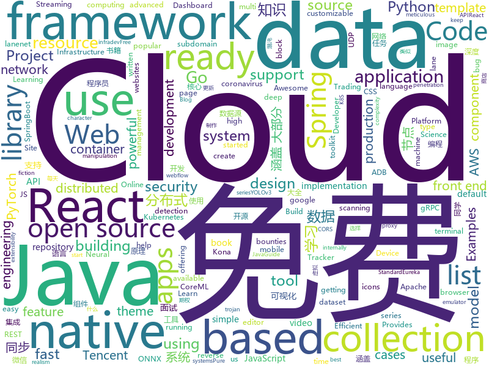

# 2020-12-22
See what the GitHub community is most excited about.

## python
+ [turkce-wordlist](https://github.com/utkusen/turkce-wordlist)(**75 stars today**): Türk kullanıcıların parola seçimlerinin analizi için yapılmış bir çalışmadır
+ [ml-hypersim](https://github.com/apple/ml-hypersim)(**246 stars today**): Hypersim: A Photorealistic Synthetic Dataset for Holistic Indoor Scene Understanding
+ [wave](https://github.com/h2oai/wave)(**470 stars today**): Realtime Web Apps and Dashboards for Python
+ [fairgame](https://github.com/Hari-Nagarajan/fairgame)(**12 stars today**): Tool to help us buy a GPU in 2020
+ [bpytop](https://github.com/aristocratos/bpytop)(**59 stars today**): Linux/OSX/FreeBSD resource monitor
+ [kivy](https://github.com/kivy/kivy)(**52 stars today**): Open source UI framework written in Python, running on Windows, Linux, macOS, Android and iOS
+ [lanenet-lane-detection](https://github.com/MaybeShewill-CV/lanenet-lane-detection)(**8 stars today**): Unofficial implemention of lanenet model for real time lane detection using deep neural network model https://maybeshewill-cv.github.io/lanenet-lane-detection/
+ [pyodide](https://github.com/iodide-project/pyodide)(**8 stars today**): The Python scientific stack, compiled to WebAssembly
+ [diagrams](https://github.com/mingrammer/diagrams)(**78 stars today**): 🎨Diagram as Code for prototyping cloud system architectures
+ [PayloadsAllTheThings](https://github.com/swisskyrepo/PayloadsAllTheThings)(**35 stars today**): A list of useful payloads and bypass for Web Application Security and Pentest/CTF
+ [insightface](https://github.com/deepinsight/insightface)(**12 stars today**): Face Analysis Project on MXNet
+ [sigma](https://github.com/Neo23x0/sigma)(**7 stars today**): Generic Signature Format for SIEM Systems
+ [python-ai-trading-system](https://github.com/ruromgar/python-ai-trading-system)(**11 stars today**): Code for How To Create A Fully Automated AI Based Trading System With Python
+ [FairMOT](https://github.com/ifzhang/FairMOT)(**6 stars today**): A simple baseline for one-shot multi-object tracking
+ [seq2seq-couplet](https://github.com/wb14123/seq2seq-couplet)(**5 stars today**): Play couplet with seq2seq model. 用深度学习对对联。
+ [Python-100-Days](https://github.com/jackfrued/Python-100-Days)(**64 stars today**): Python - 100天从新手到大师
+ [instagram-scraper](https://github.com/arc298/instagram-scraper)(**7 stars today**): Scrapes an instagram user's photos and videos
+ [django-ninja](https://github.com/vitalik/django-ninja)(**33 stars today**): 💨Fast, Async-ready, Openapi, type hints based framework for building APIs
+ [datasets](https://github.com/huggingface/datasets)(**27 stars today**): 🤗The largest hub of ready-to-use NLP datasets for ML models with fast, easy-to-use and efficient data manipulation tools
+ [QUANTAXIS](https://github.com/QUANTAXIS/QUANTAXIS)(**8 stars today**): QUANTAXIS 支持任务调度 分布式部署的 股票/期货/期权/港股/虚拟货币 数据/回测/模拟/交易/可视化/多账户 纯本地量化解决方案
+ [face.evoLVe.PyTorch](https://github.com/ZhaoJ9014/face.evoLVe.PyTorch)(**5 stars today**): 🔥🔥High-Performance Face Recognition Library on PyTorch🔥🔥
+ [yolov5](https://github.com/ultralytics/yolov5)(**26 stars today**): YOLOv5 in PyTorch > ONNX > CoreML > TFLite
+ [sktime](https://github.com/alan-turing-institute/sktime)(**10 stars today**): A unified framework for machine learning with time series
+ [yolov3](https://github.com/ultralytics/yolov3)(**15 stars today**): YOLOv3 in PyTorch > ONNX > CoreML > TFLite
+ [freqtrade](https://github.com/freqtrade/freqtrade)(**11 stars today**): Free, open source crypto trading bot

## java
+ [jvm](https://github.com/doocs/jvm)(**116 stars today**): 🤗JVM 底层原理知识总结
+ [ghidra](https://github.com/NationalSecurityAgency/ghidra)(**142 stars today**): Ghidra is a software reverse engineering (SRE) framework
+ [thingsboard](https://github.com/thingsboard/thingsboard)(**16 stars today**): Open-source IoT Platform - Device management, data collection, processing and visualization.
+ [tech-interview-for-developer](https://github.com/gyoogle/tech-interview-for-developer)(**14 stars today**): 👶🏻 신입 개발자 전공 지식 & 기술 면접 백과사전📖
+ [spring-cloud-gateway](https://github.com/spring-cloud/spring-cloud-gateway)(**3 stars today**): A Gateway built on Spring Framework 5.x and Spring Boot 2.x providing routing and more.
+ [TencentKona-8](https://github.com/Tencent/TencentKona-8)(**5 stars today**): Tencent Kona is a no-cost, production-ready distribution of the Open Java Development Kit (OpenJDK), Long-term support(LTS) with quarterly updates. Tencent Kona serves as the default JDK internally at Tencent Cloud for cloud computing and other Java applications.
+ [advanced-java](https://github.com/doocs/advanced-java)(**35 stars today**): 😮互联网 Java 工程师进阶知识完全扫盲：涵盖高并发、分布式、高可用、微服务、海量数据处理等领域知识，后端同学必看，前端同学也可学习
+ [react-native-video](https://github.com/react-native-video/react-native-video)(**2 stars today**): A <Video /> component for react-native
+ [springcloud-learning](https://github.com/macrozheng/springcloud-learning)(**6 stars today**): 一套涵盖大部分核心组件使用的Spring Cloud教程，包括Spring Cloud Alibaba及分布式事务Seata，基于Spring Cloud Greenwich及SpringBoot 2.1.7。21篇文章，篇篇精华，32个Demo，涵盖大部分应用场景。
+ [grpc-java](https://github.com/grpc/grpc-java)(**8 stars today**): The Java gRPC implementation. HTTP/2 based RPC
+ [karate](https://github.com/intuit/karate)(**7 stars today**): Test Automation Made Simple
+ [hazelcast](https://github.com/hazelcast/hazelcast)(**3 stars today**): Open Source In-Memory Data Grid
+ [Algorithms](https://github.com/williamfiset/Algorithms)(**30 stars today**): A collection of algorithms and data structures
+ [JavaGuide](https://github.com/Snailclimb/JavaGuide)(**85 stars today**): 「Java学习+面试指南」一份涵盖大部分 Java 程序员所需要掌握的核心知识。准备 Java 面试，首选 JavaGuide！
+ [aeron](https://github.com/real-logic/aeron)(**2 stars today**): Efficient reliable UDP unicast, UDP multicast, and IPC message transport
+ [react-native-camera](https://github.com/react-native-camera/react-native-camera)(**3 stars today**): A Camera component for React Native. Also supports barcode scanning!
+ [quarkus-quickstarts](https://github.com/quarkusio/quarkus-quickstarts)(**4 stars today**): Quarkus quickstart code
+ [react-native-share](https://github.com/react-native-share/react-native-share)(**3 stars today**): Social share, sending simple data to other apps.
+ [baritone](https://github.com/cabaletta/baritone)(**7 stars today**): google maps for block game
+ [PowerJob](https://github.com/KFCFans/PowerJob)(**2 stars today**): Enterprise job scheduling middleware with distributed computing ability.
+ [datax-web](https://github.com/WeiYe-Jing/datax-web)(**7 stars today**): DataX集成可视化页面，选择数据源即可一键生成数据同步任务，支持批量创建RDBMS数据同步任务，集成开源调度系统，支持分布式、增量同步数据、实时查看运行日志、监控执行器资源、KILL运行进程、数据源信息加密等。
+ [jib](https://github.com/GoogleContainerTools/jib)(**6 stars today**): 🏗Build container images for your Java applications.
+ [tutorials](https://github.com/eugenp/tutorials)(**22 stars today**): Just Announced - "Learn Spring Security OAuth":
+ [aws-doc-sdk-examples](https://github.com/awsdocs/aws-doc-sdk-examples)(**8 stars today**): Welcome to the AWS Code Examples Repository. This repo contains code examples used in the AWS documentation, AWS SDK Developer Guides, and more. For more information, see the Readme.rst file below.
+ [VBlog](https://github.com/lenve/VBlog)(**5 stars today**): V部落，Vue+SpringBoot实现的多用户博客管理平台!

## unknown
+ [Python-Core-50-Courses](https://github.com/jackfrued/Python-Core-50-Courses)(**9 stars today**): Python语言基础50课
+ [You-Dont-Know-JS](https://github.com/getify/You-Dont-Know-JS)(**154 stars today**): A book series on JavaScript. @YDKJS on twitter.
+ [free-programming-books-zh_CN](https://github.com/justjavac/free-programming-books-zh_CN)(**71 stars today**): 📚免费的计算机编程类中文书籍，欢迎投稿
+ [covid-19-data](https://github.com/nytimes/covid-19-data)(**4 stars today**): An ongoing repository of data on coronavirus cases and deaths in the U.S.
+ [css-protips](https://github.com/AllThingsSmitty/css-protips)(**207 stars today**): A collection of tips to help take your CSS skills pro
+ [material-design-icons](https://github.com/google/material-design-icons)(**11 stars today**): Material Design icons by Google
+ [market-toolkit](https://github.com/ckz8780/market-toolkit)(**62 stars today**): A collection of stock market resources and tools
+ [DSC-30-Days-of-Web](https://github.com/30DaysofWebDEV/DSC-30-Days-of-Web)(**16 stars today**): 
+ [Resources-for-Beginner-Bug-Bounty-Hunters](https://github.com/nahamsec/Resources-for-Beginner-Bug-Bounty-Hunters)(**21 stars today**): A list of resources for those interested in getting started in bug bounties
+ [awesome](https://github.com/sindresorhus/awesome)(**61 stars today**): 😎Awesome lists about all kinds of interesting topics
+ [Cookbook](https://github.com/andkret/Cookbook)(**7 stars today**): The Data Engineering Cookbook
+ [BurpSuitePro-2.1](https://github.com/TrojanAZhen/BurpSuitePro-2.1)(**18 stars today**): 什么? 你想用免费的BurpSuitePro版本!!!
+ [100-days-of-code](https://github.com/kallaway/100-days-of-code)(**8 stars today**): Fork this template for the 100 days journal - to keep yourself accountable (multiple languages available)
+ [awesome-adb](https://github.com/mzlogin/awesome-adb)(**12 stars today**): ADB Usage Complete / ADB 用法大全
+ [live-study](https://github.com/whiteship/live-study)(**4 stars today**): 온라인 스터디
+ [Front-End-Checklist](https://github.com/thedaviddias/Front-End-Checklist)(**42 stars today**): 🗂The perfect Front-End Checklist for modern websites and meticulous developers
+ [ArchitectureWeekly](https://github.com/oskardudycz/ArchitectureWeekly)(**11 stars today**): Architecture Weekly - links and resources to boost your knowledge and developer experience
+ [you-dont-know-js-ru](https://github.com/azat-io/you-dont-know-js-ru)(**8 stars today**): 📚Russian translation of "You Don't Know JS" book series
+ [awesome-cs-books](https://github.com/imarvinle/awesome-cs-books)(**30 stars today**): 经典编程书籍大全，涵盖：计算机系统与网络、系统架构、算法与数据结构、前端开发、后端开发、移动开发、数据库、测试、项目与团队、程序员职业修炼、求职面试等
+ [awesome-javascript](https://github.com/sorrycc/awesome-javascript)(**29 stars today**): 🐢A collection of awesome browser-side JavaScript libraries, resources and shiny things.
+ [TrackersListCollection](https://github.com/XIU2/TrackersListCollection)(**22 stars today**): 🎈Updated daily! A list of popular BitTorrent Trackers! / 每天更新！全网热门 BT Tracker 列表！⭐++
+ [OpenLineage](https://github.com/OpenLineage/OpenLineage)(**11 stars today**): 
+ [COVID-19](https://github.com/CSSEGISandData/COVID-19)(**17 stars today**): Novel Coronavirus (COVID-19) Cases, provided by JHU CSSE
+ [free](https://github.com/freefq/free)(**29 stars today**): 免费科学上网,免费节点,免费ssr,免费v2ray,免费vmess节点,免费trojan节点,蓝灯,谷歌商店,免费翻墙
+ [what-happens-when](https://github.com/alex/what-happens-when)(**107 stars today**): An attempt to answer the age old interview question "What happens when you type google.com into your browser and press enter?"

## javascript
+ [edex-ui](https://github.com/GitSquared/edex-ui)(**351 stars today**): A cross-platform, customizable science fiction terminal emulator with advanced monitoring & touchscreen support.
+ [SpaceX-API](https://github.com/r-spacex/SpaceX-API)(**184 stars today**): 🚀Open Source REST API for rocket, core, capsule, pad, and launch data
+ [iptv](https://github.com/iptv-org/iptv)(**26 stars today**): Collection of 5000+ publicly available IPTV channels from all over the world
+ [luban-h5](https://github.com/ly525/luban-h5)(**29 stars today**): [WIP]en: web design tool || mobile page builder/editor || mini webflow for mobile page. zh: 类似易企秀的H5制作、建站工具、可视化搭建系统.
+ [nodebestpractices](https://github.com/goldbergyoni/nodebestpractices)(**122 stars today**): ✅The Node.js best practices list (December 2020)
+ [getting-started](https://github.com/docker/getting-started)(**9 stars today**): Getting started with Docker
+ [ttv-ublock](https://github.com/odensc/ttv-ublock)(**43 stars today**): Blocking ads on that certain streaming website
+ [react-native](https://github.com/facebook/react-native)(**33 stars today**): A framework for building native apps with React.
+ [html5-boilerplate](https://github.com/h5bp/html5-boilerplate)(**23 stars today**): A professional front-end template for building fast, robust, and adaptable web apps or sites.
+ [modular](https://github.com/jpmorganchase/modular)(**74 stars today**): A modular front end development framework
+ [discord.js](https://github.com/discordjs/discord.js)(**18 stars today**): A powerful JavaScript library for interacting with the Discord API
+ [material-ui](https://github.com/mui-org/material-ui)(**41 stars today**): React components for faster and simpler web development. Build your own design system, or start with Material Design.
+ [spectrum](https://github.com/withspectrum/spectrum)(**16 stars today**): Simple, powerful online communities.
+ [tailblocks](https://github.com/mertJF/tailblocks)(**12 stars today**): 🎉Ready-to-use Tailwind CSS blocks.
+ [Recoil](https://github.com/facebookexperimental/Recoil)(**28 stars today**): Recoil is an experimental state management library for React apps. It provides several capabilities that are difficult to achieve with React alone, while being compatible with the newest features of React.
+ [freeCodeCamp](https://github.com/freeCodeCamp/freeCodeCamp)(**54 stars today**): freeCodeCamp.org's open source codebase and curriculum. Learn to code at home.
+ [functions-samples](https://github.com/firebase/functions-samples)(**8 stars today**): Collection of sample apps showcasing popular use cases using Cloud Functions for Firebase
+ [react-native-vector-icons](https://github.com/oblador/react-native-vector-icons)(**10 stars today**): Customizable Icons for React Native with support for NavBar/TabBar, image source and full styling.
+ [grocery_store](https://github.com/zzc10086/grocery_store)(**7 stars today**): 
+ [clean-code-javascript](https://github.com/ryanmcdermott/clean-code-javascript)(**41 stars today**): 🛁Clean Code concepts adapted for JavaScript
+ [laravel-mix](https://github.com/JeffreyWay/laravel-mix)(**4 stars today**): The power of webpack, distilled for the rest of us.
+ [wechat-app-mall](https://github.com/EastWorld/wechat-app-mall)(**8 stars today**): 微信小程序商城，微信小程序微店
+ [react-big-calendar](https://github.com/jquense/react-big-calendar)(**5 stars today**): gcal/outlook like calendar component
+ [gulp](https://github.com/gulpjs/gulp)(**3 stars today**): A toolkit to automate & enhance your workflow
+ [cors-anywhere](https://github.com/Rob--W/cors-anywhere)(**2 stars today**): CORS Anywhere is a NodeJS reverse proxy which adds CORS headers to the proxied request.

## html
+ [raytracing.github.io](https://github.com/RayTracing/raytracing.github.io)(**11 stars today**): Main Web Site (Online Books)
+ [free-for-dev](https://github.com/ripienaar/free-for-dev)(**32 stars today**): A list of SaaS, PaaS and IaaS offerings that have free tiers of interest to devops and infradev
+ [stisla](https://github.com/stisla/stisla)(**3 stars today**): Free Bootstrap Admin Template
+ [html-css](https://github.com/gustavoguanabara/html-css)(**10 stars today**): Curso de HTML5 e CSS3
+ [salty-747](https://github.com/saltysimulations/salty-747)(**3 stars today**): An open-source modification for the default MSFS 747-8, aiming to improve the lacking features and realism of the default aircraft.
+ [calico](https://github.com/projectcalico/calico)(**4 stars today**): Cloud native networking and network security
+ [ML-notes](https://github.com/Sakura-gh/ML-notes)(**3 stars today**): notes about machine learning
+ [beginner-javascript](https://github.com/wesbos/beginner-javascript)(**5 stars today**): Slam Dunk JavaScript
+ [helm-charts](https://github.com/jenkinsci/helm-charts)(**0 stars today**): Jenkins community Helm charts
+ [html](https://github.com/whatwg/html)(**2 stars today**): HTML Standard
+ [hugo-eureka](https://github.com/wangchucheng/hugo-eureka)(**6 stars today**): Eureka is a feature-rich and highly customizable Hugo theme.
+ [django-DefectDojo](https://github.com/DefectDojo/django-DefectDojo)(**0 stars today**): DefectDojo is an open-source application vulnerability correlation and security orchestration tool.
+ [gopl-zh](https://github.com/golang-china/gopl-zh)(**4 stars today**): 📚Go语言圣经中文版
+ [scalable-data-science](https://github.com/lamastex/scalable-data-science)(**12 stars today**): Scalable Data Science, course sets in big data Using Apache Spark over databricks and their mathematical, statistical and computational foundations using SageMath.
+ [fluxion](https://github.com/FluxionNetwork/fluxion)(**2 stars today**): Fluxion is a remake of linset by vk496 with enhanced functionality.
+ [cui_character](https://github.com/PainedPsyche/cui_character)(**2 stars today**): An advanced character and clothes editor for esx framework that aims to be comfortable to use, hide complexity and blend in with original GTA V interface elements.
+ [huxpro.github.io](https://github.com/Huxpro/huxpro.github.io)(**6 stars today**): My Blog / Jekyll Themes / PWA
+ [charts](https://github.com/bitnami/charts)(**8 stars today**): Helm Charts
+ [ESPEasy](https://github.com/letscontrolit/ESPEasy)(**0 stars today**): Easy MultiSensor device based on ESP8266
+ [windmill-dashboard](https://github.com/estevanmaito/windmill-dashboard)(**4 stars today**): 📊A multi theme, completely accessible, ready for production dashboard.
+ [EIPs](https://github.com/ethereum/EIPs)(**5 stars today**): The Ethereum Improvement Proposal repository
+ [docker-development-youtube-series](https://github.com/marcel-dempers/docker-development-youtube-series)(**7 stars today**): 
+ [nndl.github.io](https://github.com/nndl/nndl.github.io)(**13 stars today**): 《神经网络与深度学习》 邱锡鹏著 Neural Network and Deep Learning
+ [kubeasz](https://github.com/easzlab/kubeasz)(**9 stars today**): 使用Ansible脚本安装K8S集群，介绍组件交互原理，方便直接，不受国内网络环境影响
+ [kubespray](https://github.com/kubernetes-sigs/kubespray)(**8 stars today**): Deploy a Production Ready Kubernetes Cluster

## go
+ [owncast](https://github.com/owncast/owncast)(**666 stars today**): Take control over your live stream video by running it yourself. Streaming + chat out of the box.
+ [nuclei](https://github.com/projectdiscovery/nuclei)(**80 stars today**): Nuclei is a fast tool for configurable targeted scanning based on templates offering massive extensibility and ease of use.
+ [k3s](https://github.com/k3s-io/k3s)(**16 stars today**): Lightweight Kubernetes
+ [yq](https://github.com/mikefarah/yq)(**15 stars today**): yq is a portable command-line YAML processor
+ [terrascan](https://github.com/accurics/terrascan)(**5 stars today**): Detect compliance and security violations across Infrastructure as Code to mitigate risk before provisioning cloud native infrastructure.
+ [moby](https://github.com/moby/moby)(**19 stars today**): Moby Project - a collaborative project for the container ecosystem to assemble container-based systems
+ [paho.mqtt.golang](https://github.com/eclipse/paho.mqtt.golang)(**1 stars today**): 
+ [webrtc](https://github.com/pion/webrtc)(**10 stars today**): Pure Go implementation of the WebRTC API
+ [go-micro](https://github.com/asim/go-micro)(**12 stars today**): Go Micro is a framework for distributed systems development
+ [gopsutil](https://github.com/shirou/gopsutil)(**6 stars today**): psutil for golang
+ [cockroach](https://github.com/cockroachdb/cockroach)(**3 stars today**): CockroachDB - the open source, cloud-native distributed SQL database.
+ [learngo](https://github.com/inancgumus/learngo)(**12 stars today**): 1000+ Hand-Crafted Go Examples, Exercises, and Quizzes
+ [eksctl](https://github.com/weaveworks/eksctl)(**5 stars today**): The official CLI for Amazon EKS
+ [lotus](https://github.com/filecoin-project/lotus)(**4 stars today**): Implementation of the Filecoin protocol, written in Go
+ [sarama](https://github.com/Shopify/sarama)(**14 stars today**): Sarama is a Go library for Apache Kafka 0.8, and up.
+ [termui](https://github.com/gizak/termui)(**6 stars today**): Golang terminal dashboard
+ [subfinder](https://github.com/projectdiscovery/subfinder)(**7 stars today**): Subfinder is a subdomain discovery tool that discovers valid subdomains for websites. Designed as a passive framework to be useful for bug bounties and safe for penetration testing.
+ [traefik](https://github.com/traefik/traefik)(**17 stars today**): The Cloud Native Application Proxy
+ [cortex](https://github.com/cortexlabs/cortex)(**46 stars today**): Run inference at scale
+ [govmomi](https://github.com/vmware/govmomi)(**2 stars today**): Go library for the VMware vSphere API
+ [kafka-go](https://github.com/segmentio/kafka-go)(**5 stars today**): Kafka library in Go
+ [operator-sdk](https://github.com/operator-framework/operator-sdk)(**12 stars today**): SDK for building Kubernetes applications. Provides high level APIs, useful abstractions, and project scaffolding.
+ [grpc-go](https://github.com/grpc/grpc-go)(**12 stars today**): The Go language implementation of gRPC. HTTP/2 based RPC
+ [prometheus-operator](https://github.com/prometheus-operator/prometheus-operator)(**6 stars today**): Prometheus Operator creates/configures/manages Prometheus clusters atop Kubernetes
+ [chaosblade](https://github.com/chaosblade-io/chaosblade)(**4 stars today**): An easy to use and powerful chaos engineering experiment toolkit.（阿里巴巴开源的一款简单易用、功能强大的混沌实验注入工具）

## WordCloud

