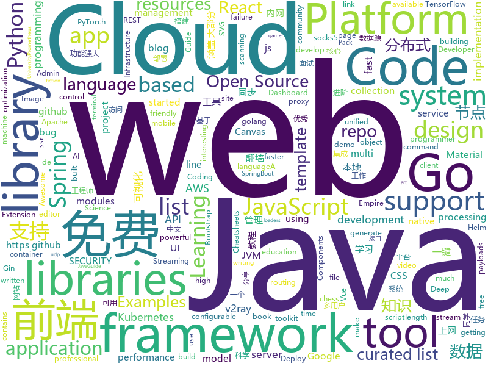

# 2020-12-23
See what the GitHub community is most excited about.

## python
+ [bert](https://github.com/google-research/bert)(**34 stars today**): TensorFlow code and pre-trained models for BERT
+ [sktime](https://github.com/alan-turing-institute/sktime)(**31 stars today**): A unified framework for machine learning with time series
+ [Awesome-Bugbounty-Writeups](https://github.com/devanshbatham/Awesome-Bugbounty-Writeups)(**24 stars today**): A curated list of bugbounty writeups (Bug type wise) , inspired from https://github.com/ngalongc/bug-bounty-reference
+ [neural-networks-and-deep-learning](https://github.com/mnielsen/neural-networks-and-deep-learning)(**16 stars today**): Code samples for my book "Neural Networks and Deep Learning"
+ [transformers](https://github.com/huggingface/transformers)(**80 stars today**): 🤗Transformers: State-of-the-art Natural Language Processing for Pytorch and TensorFlow 2.0.
+ [PayloadsAllTheThings](https://github.com/swisskyrepo/PayloadsAllTheThings)(**40 stars today**): A list of useful payloads and bypass for Web Application Security and Pentest/CTF
+ [turkce-wordlist](https://github.com/utkusen/turkce-wordlist)(**69 stars today**): Türk kullanıcıların parola seçimlerinin analizi için yapılmış bir çalışmadır
+ [helm-charts](https://github.com/elastic/helm-charts)(**3 stars today**): You know, for Kubernetes
+ [pytorch_geometric](https://github.com/rusty1s/pytorch_geometric)(**18 stars today**): Geometric Deep Learning Extension Library for PyTorch
+ [diagrams](https://github.com/mingrammer/diagrams)(**106 stars today**): 🎨Diagram as Code for prototyping cloud system architectures
+ [StockAnalysisInPython](https://github.com/INVESTAR/StockAnalysisInPython)(**6 stars today**): 
+ [DeathStar](https://github.com/byt3bl33d3r/DeathStar)(**13 stars today**): Uses Empire's (https://github.com/BC-SECURITY/Empire) RESTful API to automate gaining Domain and/or Enterprise Admin rights in Active Directory environments using some of the most common offensive TTPs.
+ [Scripts](https://github.com/TNanko/Scripts)(**3 stars today**): Support message push in the script written in Python language
+ [optuna](https://github.com/optuna/optuna)(**12 stars today**): A hyperparameter optimization framework
+ [bert-as-service](https://github.com/hanxiao/bert-as-service)(**14 stars today**): Mapping a variable-length sentence to a fixed-length vector using BERT model
+ [wave](https://github.com/h2oai/wave)(**120 stars today**): Realtime Web Apps and Dashboards for Python
+ [QUANTAXIS](https://github.com/QUANTAXIS/QUANTAXIS)(**11 stars today**): QUANTAXIS 支持任务调度 分布式部署的 股票/期货/期权/港股/虚拟货币 数据/回测/模拟/交易/可视化/多账户 纯本地量化解决方案
+ [email-bot](https://github.com/ProgrammingHero1/email-bot)(**4 stars today**): 
+ [PaddleDetection](https://github.com/PaddlePaddle/PaddleDetection)(**111 stars today**): Object detection and instance segmentation toolkit based on PaddlePaddle.
+ [fuzzDicts](https://github.com/TheKingOfDuck/fuzzDicts)(**10 stars today**): Web Pentesting Fuzz 字典,一个就够了。
+ [ml-hypersim](https://github.com/apple/ml-hypersim)(**159 stars today**): Hypersim: A Photorealistic Synthetic Dataset for Holistic Indoor Scene Understanding
+ [examples-of-web-crawlers](https://github.com/shengqiangzhang/examples-of-web-crawlers)(**13 stars today**): 一些非常有趣的python爬虫例子,对新手比较友好,主要爬取淘宝、天猫、微信、豆瓣、QQ等网站。(Some interesting examples of python crawlers that are friendly to beginners. )
+ [localstack](https://github.com/localstack/localstack)(**25 stars today**): 💻A fully functional local AWS cloud stack. Develop and test your cloud & Serverless apps offline!
+ [pifuhd](https://github.com/facebookresearch/pifuhd)(**21 stars today**): High-Resolution 3D Human Digitization from A Single Image.
+ [oppia](https://github.com/oppia/oppia)(**3 stars today**): A free, online learning platform to make quality education accessible for all.

## java
+ [jvm](https://github.com/doocs/jvm)(**262 stars today**): 🤗JVM 底层原理知识总结
+ [thingsboard](https://github.com/thingsboard/thingsboard)(**19 stars today**): Open-source IoT Platform - Device management, data collection, processing and visualization.
+ [JavaGuide](https://github.com/Snailclimb/JavaGuide)(**77 stars today**): 「Java学习+面试指南」一份涵盖大部分 Java 程序员所需要掌握的核心知识。准备 Java 面试，首选 JavaGuide！
+ [Hystrix](https://github.com/Netflix/Hystrix)(**11 stars today**): Hystrix is a latency and fault tolerance library designed to isolate points of access to remote systems, services and 3rd party libraries, stop cascading failure and enable resilience in complex distributed systems where failure is inevitable.
+ [jdk](https://github.com/openjdk/jdk)(**23 stars today**): JDK main-line development
+ [GitHub-Chinese-Top-Charts](https://github.com/kon9chunkit/GitHub-Chinese-Top-Charts)(**42 stars today**): 🇨🇳GitHub中文排行榜，帮助你发现高分优秀中文项目、更高效地吸收国人的优秀经验成果；榜单每周更新一次，敬请关注！
+ [bazel](https://github.com/bazelbuild/bazel)(**12 stars today**): a fast, scalable, multi-language and extensible build system
+ [springcloud-learning](https://github.com/macrozheng/springcloud-learning)(**7 stars today**): 一套涵盖大部分核心组件使用的Spring Cloud教程，包括Spring Cloud Alibaba及分布式事务Seata，基于Spring Cloud Greenwich及SpringBoot 2.1.7。21篇文章，篇篇精华，32个Demo，涵盖大部分应用场景。
+ [ysoserial](https://github.com/frohoff/ysoserial)(**7 stars today**): A proof-of-concept tool for generating payloads that exploit unsafe Java object deserialization.
+ [beam](https://github.com/apache/beam)(**8 stars today**): Apache Beam is a unified programming model for Batch and Streaming
+ [junit5](https://github.com/junit-team/junit5)(**2 stars today**): ✅The 5th major version of the programmer-friendly testing framework for Java and the JVM
+ [testable-mock](https://github.com/alibaba/testable-mock)(**71 stars today**): 换种思路写Mock，让单元测试更简单
+ [advanced-java](https://github.com/doocs/advanced-java)(**41 stars today**): 😮互联网 Java 工程师进阶知识完全扫盲：涵盖高并发、分布式、高可用、微服务、海量数据处理等领域知识，后端同学必看，前端同学也可学习
+ [datax-web](https://github.com/WeiYe-Jing/datax-web)(**11 stars today**): DataX集成可视化页面，选择数据源即可一键生成数据同步任务，支持批量创建RDBMS数据同步任务，集成开源调度系统，支持分布式、增量同步数据、实时查看运行日志、监控执行器资源、KILL运行进程、数据源信息加密等。
+ [aws-doc-sdk-examples](https://github.com/awsdocs/aws-doc-sdk-examples)(**10 stars today**): Welcome to the AWS Code Examples Repository. This repo contains code examples used in the AWS documentation, AWS SDK Developer Guides, and more. For more information, see the Readme.rst file below.
+ [VBlog](https://github.com/lenve/VBlog)(**7 stars today**): V部落，Vue+SpringBoot实现的多用户博客管理平台!
+ [feign](https://github.com/OpenFeign/feign)(**8 stars today**): Feign makes writing java http clients easier
+ [reactor-core](https://github.com/reactor/reactor-core)(**2 stars today**): Non-Blocking Reactive Foundation for the JVM
+ [tech-interview-for-developer](https://github.com/gyoogle/tech-interview-for-developer)(**14 stars today**): 👶🏻 신입 개발자 전공 지식 & 기술 면접 백과사전📖
+ [serve](https://github.com/pytorch/serve)(**7 stars today**): Model Serving on PyTorch
+ [spring-cloud-gateway](https://github.com/spring-cloud/spring-cloud-gateway)(**7 stars today**): A Gateway built on Spring Framework 5.x and Spring Boot 2.x providing routing and more.
+ [spring-security](https://github.com/spring-projects/spring-security)(**5 stars today**): Spring Security
+ [dubbo-admin](https://github.com/apache/dubbo-admin)(**4 stars today**): The ops and reference implementation for Apache Dubbo
+ [checkstyle](https://github.com/checkstyle/checkstyle)(**3 stars today**): Checkstyle is a development tool to help programmers write Java code that adheres to a coding standard. By default it supports the Google Java Style Guide and Sun Code Conventions, but is highly configurable. It can be invoked with an ANT task and a command line program.
+ [zxing](https://github.com/zxing/zxing)(**10 stars today**): ZXing ("Zebra Crossing") barcode scanning library for Java, Android

## unknown
+ [Best_AI_paper_2020](https://github.com/louisfb01/Best_AI_paper_2020)(**230 stars today**): A curated list of the latest breakthroughs in AI by release date with a clear video explanation, link to a more in-depth article, and code
+ [DSC-30-Days-of-Web](https://github.com/30DaysofWebDEV/DSC-30-Days-of-Web)(**20 stars today**): 
+ [project-based-learning](https://github.com/tuvtran/project-based-learning)(**81 stars today**): Curated list of project-based tutorials
+ [Resources-for-Beginner-Bug-Bounty-Hunters](https://github.com/nahamsec/Resources-for-Beginner-Bug-Bounty-Hunters)(**29 stars today**): A list of resources for those interested in getting started in bug bounties
+ [free](https://github.com/freefq/free)(**22 stars today**): 免费科学上网,免费节点,免费ssr,免费v2ray,免费vmess节点,免费trojan节点,蓝灯,谷歌商店,免费翻墙
+ [the-book-of-secret-knowledge](https://github.com/trimstray/the-book-of-secret-knowledge)(**13 stars today**): A collection of inspiring lists, manuals, cheatsheets, blogs, hacks, one-liners, cli/web tools and more.
+ [15th](https://github.com/d2forum/15th)(**92 stars today**): 第十五届D2前端技术论坛「无界」
+ [rfcs](https://github.com/reactjs/rfcs)(**38 stars today**): RFCs for changes to React
+ [InterviewPrepResources](https://github.com/yash0530/InterviewPrepResources)(**31 stars today**): Resources for Coding Interviews for Undergrads for Internships and FTE
+ [MotherVR](https://github.com/Nibre/MotherVR)(**4 stars today**): This Mod brings current generation VR support to the game Alien: Isolation
+ [100-days-of-code](https://github.com/kallaway/100-days-of-code)(**12 stars today**): Fork this template for the 100 days journal - to keep yourself accountable (multiple languages available)
+ [system_design](https://github.com/shashank88/system_design)(**11 stars today**): Preparation links and resources for system design questions
+ [awesome-jax](https://github.com/n2cholas/awesome-jax)(**23 stars today**): JAX - A curated list of resources https://github.com/google/jax
+ [design-resources-for-developers](https://github.com/bradtraversy/design-resources-for-developers)(**26 stars today**): Curated list of design and UI resources from stock photos, web templates, CSS frameworks, UI libraries, tools and much more
+ [academy](https://github.com/cloudnativeto/academy)(**3 stars today**): 云原生学院
+ [jd_scripts](https://github.com/lxk0301/jd_scripts)(**48 stars today**): 基于JavaScript的京东薅羊毛工具
+ [kotlin](https://github.com/JetBrains/kotlin)(**15 stars today**): The Kotlin Programming Language
+ [You-Dont-Know-JS](https://github.com/getify/You-Dont-Know-JS)(**46 stars today**): A book series on JavaScript. @YDKJS on twitter.
+ [kubernetes-the-hard-way](https://github.com/kelseyhightower/kubernetes-the-hard-way)(**19 stars today**): Bootstrap Kubernetes the hard way on Google Cloud Platform. No scripts.
+ [new-pac](https://github.com/Alvin9999/new-pac)(**22 stars today**): 科学上网/自由上网/翻墙/软件/方法，一键翻墙浏览器，免费shadowsocks/ss/ssr/v2ray/goflyway账号/节点分享，vps一键搭建脚本/教程
+ [books](https://github.com/programthink/books)(**21 stars today**): 【编程随想】收藏的电子书清单（多个学科，含下载链接）
+ [useful](https://github.com/YauhenKavalchuk/useful)(**1 stars today**): 
+ [Pan](https://github.com/ligl0702/Pan)(**5 stars today**): 存储和分享电视盒子上好用的APP
+ [955.WLB](https://github.com/formulahendry/955.WLB)(**31 stars today**): 955 不加班的公司名单 - 工作 955，work–life balance (工作与生活的平衡)
+ [awesome](https://github.com/sindresorhus/awesome)(**71 stars today**): 😎Awesome lists about all kinds of interesting topics

## javascript
+ [server-components-demo](https://github.com/reactjs/server-components-demo)(**996 stars today**): Demo app of React Server Components.
+ [edex-ui](https://github.com/GitSquared/edex-ui)(**459 stars today**): A cross-platform, customizable science fiction terminal emulator with advanced monitoring & touchscreen support.
+ [iptv](https://github.com/iptv-org/iptv)(**107 stars today**): Collection of 5000+ publicly available IPTV channels from all over the world
+ [SpaceX-API](https://github.com/r-spacex/SpaceX-API)(**162 stars today**): 🚀Open Source REST API for rocket, core, capsule, pad, and launch data
+ [UnblockNeteaseMusic](https://github.com/nondanee/UnblockNeteaseMusic)(**38 stars today**): Revive unavailable songs for Netease Cloud Music
+ [Web-Dev-For-Beginners](https://github.com/microsoft/Web-Dev-For-Beginners)(**38 stars today**): 24 Lessons, 12 Weeks, Get Started as a Web Developer
+ [material-ui](https://github.com/mui-org/material-ui)(**44 stars today**): React components for faster and simpler web development. Build your own design system, or start with Material Design.
+ [react-native](https://github.com/facebook/react-native)(**34 stars today**): A framework for building native apps with React.
+ [luban-h5](https://github.com/ly525/luban-h5)(**51 stars today**): [WIP]en: web design tool || mobile page builder/editor || mini webflow for mobile page. zh: 类似易企秀的H5制作、建站工具、可视化搭建系统.
+ [react](https://github.com/typescript-cheatsheets/react)(**53 stars today**): Cheatsheets for experienced React developers getting started with TypeScript
+ [odoo](https://github.com/odoo/odoo)(**20 stars today**): Odoo. Open Source Apps To Grow Your Business.
+ [html5-boilerplate](https://github.com/h5bp/html5-boilerplate)(**23 stars today**): A professional front-end template for building fast, robust, and adaptable web apps or sites.
+ [fabric.js](https://github.com/fabricjs/fabric.js)(**17 stars today**): Javascript Canvas Library, SVG-to-Canvas (& canvas-to-SVG) Parser
+ [generator-jhipster](https://github.com/jhipster/generator-jhipster)(**8 stars today**): JHipster is a development platform to quickly generate, develop, & deploy modern web applications & microservice architectures.
+ [webpack](https://github.com/webpack/webpack)(**20 stars today**): A bundler for javascript and friends. Packs many modules into a few bundled assets. Code Splitting allows for loading parts of the application on demand. Through "loaders", modules can be CommonJs, AMD, ES6 modules, CSS, Images, JSON, Coffeescript, LESS, ... and your custom stuff.
+ [chess-ai](https://github.com/zeyu2001/chess-ai)(**12 stars today**): Simple chess AI in Javascript. Uses the chess.js and chessboard.js libraries.
+ [ccxt](https://github.com/ccxt/ccxt)(**19 stars today**): A JavaScript / Python / PHP cryptocurrency trading API with support for more than 120 bitcoin/altcoin exchanges
+ [mediasoup-demo](https://github.com/versatica/mediasoup-demo)(**6 stars today**): mediasoup official demo application
+ [cors-anywhere](https://github.com/Rob--W/cors-anywhere)(**8 stars today**): CORS Anywhere is a NodeJS reverse proxy which adds CORS headers to the proxied request.
+ [yapi](https://github.com/YMFE/yapi)(**42 stars today**): YApi 是一个可本地部署的、打通前后端及QA的、可视化的接口管理平台
+ [node-oidc-provider](https://github.com/panva/node-oidc-provider)(**6 stars today**): OpenID Certified™ OAuth 2.0 Authorization Server implementation for Node.js
+ [materialize](https://github.com/Dogfalo/materialize)(**9 stars today**): Materialize, a CSS Framework based on Material Design
+ [vue-devtools](https://github.com/vuejs/vue-devtools)(**13 stars today**): ⚙️Browser devtools extension for debugging Vue.js applications.
+ [Web](https://github.com/qianguyihao/Web)(**30 stars today**): 前端入门到进阶图文教程，超详细的Web前端学习笔记。从零开始学前端，做一名精致优雅的前端工程师。公众号「千古壹号」作者。
+ [react-router](https://github.com/ReactTraining/react-router)(**18 stars today**): Declarative routing for React

## html
+ [REKCARC-TSC-UHT](https://github.com/PKUanonym/REKCARC-TSC-UHT)(**11 stars today**): 清华大学计算机系课程攻略 Guidance for courses in Department of Computer Science and Technology, Tsinghua University
+ [helm-charts](https://github.com/prometheus-community/helm-charts)(**2 stars today**): Prometheus community Helm charts
+ [hyperblog](https://github.com/freddier/hyperblog)(**6 stars today**): Un blog increíble para el curso de Git y Github de Platzi
+ [tidytuesday](https://github.com/rfordatascience/tidytuesday)(**5 stars today**): Official repo for the #tidytuesday project
+ [boost](https://github.com/boostorg/boost)(**3 stars today**): Super-project for modularized Boost
+ [charts](https://github.com/bitnami/charts)(**8 stars today**): Helm Charts
+ [keycloak-documentation](https://github.com/keycloak/keycloak-documentation)(**1 stars today**): 
+ [stisla](https://github.com/stisla/stisla)(**4 stars today**): Free Bootstrap Admin Template
+ [ai-edu](https://github.com/microsoft/ai-edu)(**11 stars today**): AI education materials for Chinese students, teachers and IT professionals.
+ [nbnhhsh](https://github.com/itorr/nbnhhsh)(**7 stars today**): 😩「能不能好好说话？」 拼音首字母缩写翻译工具
+ [school-of-sre](https://github.com/linkedin/school-of-sre)(**37 stars today**): At LinkedIn, we are using this curriculum for onboarding our entry level talents into the SRE role.
+ [web-moderno](https://github.com/cod3rcursos/web-moderno)(**4 stars today**): 
+ [docker-development-youtube-series](https://github.com/marcel-dempers/docker-development-youtube-series)(**4 stars today**): 
+ [tabler](https://github.com/tabler/tabler)(**8 stars today**): Tabler is free and open-source HTML Dashboard UI Kit built on Bootstrap
+ [py4e](https://github.com/csev/py4e)(**5 stars today**): Web site for www.py4e.com and source to the Python 3.0 textbook
+ [openwrt-packages](https://github.com/kenzok8/openwrt-packages)(**7 stars today**): openwet常用软件包
+ [Spoon-Knife](https://github.com/octocat/Spoon-Knife)(**3 stars today**): This repo is for demonstration purposes only.
+ [openwrt-passwall](https://github.com/xiaorouji/openwrt-passwall)(**3 stars today**): 
+ [varharrie.github.io](https://github.com/varHarrie/varharrie.github.io)(**2 stars today**): 📘Personal blog.
+ [learning-area](https://github.com/mdn/learning-area)(**3 stars today**): Github repo for the MDN Learning Area.
+ [kubespray](https://github.com/kubernetes-sigs/kubespray)(**8 stars today**): Deploy a Production Ready Kubernetes Cluster
+ [fastText](https://github.com/facebookresearch/fastText)(**7 stars today**): Library for fast text representation and classification.
+ [v2-ui](https://github.com/sprov065/v2-ui)(**11 stars today**): 支持多协议多用户的 v2ray 面板，Support multi-protocol multi-user v2ray panel
+ [helm-charts](https://github.com/jenkinsci/helm-charts)(**2 stars today**): Jenkins community Helm charts
+ [csswg-drafts](https://github.com/w3c/csswg-drafts)(**4 stars today**): CSS Working Group Editor Drafts

## go
+ [owncast](https://github.com/owncast/owncast)(**506 stars today**): Take control over your live stream video by running it yourself. Streaming + chat out of the box.
+ [nps](https://github.com/ehang-io/nps)(**26 stars today**): 一款轻量级、高性能、功能强大的内网穿透代理服务器。支持tcp、udp、socks5、http等几乎所有流量转发，可用来访问内网网站、本地支付接口调试、ssh访问、远程桌面，内网dns解析、内网socks5代理等等……，并带有功能强大的web管理端。a lightweight, high-performance, powerful intranet penetration proxy server, with a powerful web management terminal.
+ [chaos-mesh](https://github.com/chaos-mesh/chaos-mesh)(**15 stars today**): A Chaos Engineering Platform for Kubernetes.
+ [gin](https://github.com/gin-gonic/gin)(**52 stars today**): Gin is a HTTP web framework written in Go (Golang). It features a Martini-like API with much better performance -- up to 40 times faster. If you need smashing performance, get yourself some Gin.
+ [awesome-go](https://github.com/avelino/awesome-go)(**47 stars today**): A curated list of awesome Go frameworks, libraries and software
+ [learngo](https://github.com/inancgumus/learngo)(**16 stars today**): 1000+ Hand-Crafted Go Examples, Exercises, and Quizzes
+ [resty](https://github.com/go-resty/resty)(**13 stars today**): Simple HTTP and REST client library for Go
+ [go-ethereum](https://github.com/ethereum/go-ethereum)(**19 stars today**): Official Go implementation of the Ethereum protocol
+ [gonum](https://github.com/gonum/gonum)(**7 stars today**): Gonum is a set of numeric libraries for the Go programming language. It contains libraries for matrices, statistics, optimization, and more
+ [go-streams](https://github.com/reugn/go-streams)(**44 stars today**): Go stream processing library
+ [yq](https://github.com/mikefarah/yq)(**24 stars today**): yq is a portable command-line YAML processor
+ [nuclei](https://github.com/projectdiscovery/nuclei)(**121 stars today**): Nuclei is a fast tool for configurable targeted scanning based on templates offering massive extensibility and ease of use.
+ [istio](https://github.com/istio/istio)(**26 stars today**): Connect, secure, control, and observe services.
+ [kiali](https://github.com/kiali/kiali)(**4 stars today**): Kiali project, observability for the Istio service mesh
+ [terrascan](https://github.com/accurics/terrascan)(**21 stars today**): Detect compliance and security violations across Infrastructure as Code to mitigate risk before provisioning cloud native infrastructure.
+ [traefik](https://github.com/traefik/traefik)(**28 stars today**): The Cloud Native Application Proxy
+ [distribution](https://github.com/docker/distribution)(**4 stars today**): The toolkit to pack, ship, store, and deliver container content
+ [go](https://github.com/golang/go)(**72 stars today**): The Go programming language
+ [node_exporter](https://github.com/prometheus/node_exporter)(**8 stars today**): Exporter for machine metrics
+ [argo-cd](https://github.com/argoproj/argo-cd)(**12 stars today**): Declarative continuous deployment for Kubernetes.
+ [rancher](https://github.com/rancher/rancher)(**10 stars today**): Complete container management platform
+ [webrtc](https://github.com/pion/webrtc)(**23 stars today**): Pure Go implementation of the WebRTC API
+ [cortex](https://github.com/cortexlabs/cortex)(**28 stars today**): Run inference at scale
+ [xlsx](https://github.com/tealeg/xlsx)(**3 stars today**): Go (golang) library for reading and writing XLSX files.
+ [gqlgen](https://github.com/99designs/gqlgen)(**7 stars today**): go generate based graphql server library

## WordCloud

