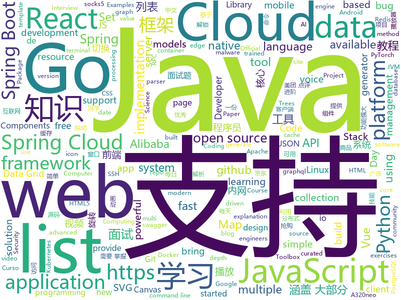

# 2020-12-24
See what the GitHub community is most excited about.

## python
+ [uncertainty-toolbox](https://github.com/uncertainty-toolbox/uncertainty-toolbox)(**242 stars today**): A python toolbox for predictive uncertainty quantification, calibration, metrics, and visualization
+ [sktime](https://github.com/alan-turing-institute/sktime)(**77 stars today**): A unified framework for machine learning with time series
+ [Awesome-Bugbounty-Writeups](https://github.com/devanshbatham/Awesome-Bugbounty-Writeups)(**47 stars today**): A curated list of bugbounty writeups (Bug type wise) , inspired from https://github.com/ngalongc/bug-bounty-reference
+ [jd_seckill](https://github.com/huanghyw/jd_seckill)(**80 stars today**): 京东秒杀商品抢购，目前只支持茅台抢购，不支持其他商品！
+ [zenml](https://github.com/maiot-io/zenml)(**104 stars today**): ZenML: Bring Zen to your ML with reproducible pipelines
+ [manim](https://github.com/3b1b/manim)(**50 stars today**): Animation engine for explanatory math videos
+ [svoice](https://github.com/facebookresearch/svoice)(**116 stars today**): We provide a PyTorch implementation of the paper Voice Separation with an Unknown Number of Multiple Speakers In which, we present a new method for separating a mixed audio sequence, in which multiple voices speak simultaneously. The new method employs gated neural networks that are trained to separate the voices at multiple processing steps, wh…
+ [yolov3](https://github.com/ultralytics/yolov3)(**16 stars today**): YOLOv3 in PyTorch > ONNX > CoreML > TFLite
+ [mmcv](https://github.com/open-mmlab/mmcv)(**6 stars today**): OpenMMLab Computer Vision Foundation
+ [fairgame](https://github.com/Hari-Nagarajan/fairgame)(**26 stars today**): Tool to help us buy a GPU in 2020
+ [bert](https://github.com/google-research/bert)(**60 stars today**): TensorFlow code and pre-trained models for BERT
+ [ParlAI](https://github.com/facebookresearch/ParlAI)(**6 stars today**): A framework for training and evaluating AI models on a variety of openly available dialogue datasets.
+ [ec2-spot-converter](https://github.com/jcjorel/ec2-spot-converter)(**51 stars today**): A tool to convert AWS EC2 instances back and forth between On-Demand and Spot billing models.
+ [Red-DiscordBot](https://github.com/Cog-Creators/Red-DiscordBot)(**3 stars today**): A multi-function Discord bot
+ [StockAnalysisInPython](https://github.com/INVESTAR/StockAnalysisInPython)(**8 stars today**): 
+ [dgl](https://github.com/dmlc/dgl)(**41 stars today**): Python package built to ease deep learning on graph, on top of existing DL frameworks.
+ [mmsegmentation](https://github.com/open-mmlab/mmsegmentation)(**12 stars today**): OpenMMLab Semantic Segmentation Toolbox and Benchmark.
+ [pytorch-cifar](https://github.com/kuangliu/pytorch-cifar)(**20 stars today**): 95.47% on CIFAR10 with PyTorch
+ [elastalert](https://github.com/Yelp/elastalert)(**6 stars today**): Easy & Flexible Alerting With ElasticSearch
+ [muzero-general](https://github.com/werner-duvaud/muzero-general)(**28 stars today**): MuZero
+ [Python](https://github.com/TheAlgorithms/Python)(**71 stars today**): All Algorithms implemented in Python
+ [pyjwt](https://github.com/jpadilla/pyjwt)(**3 stars today**): JSON Web Token implementation in Python
+ [dbt](https://github.com/fishtown-analytics/dbt)(**9 stars today**): dbt (data build tool) enables data analysts and engineers to transform their data using the same practices that software engineers use to build applications.
+ [full-stack-fastapi-postgresql](https://github.com/tiangolo/full-stack-fastapi-postgresql)(**13 stars today**): Full stack, modern web application generator. Using FastAPI, PostgreSQL as database, Docker, automatic HTTPS and more.
+ [diagrams](https://github.com/mingrammer/diagrams)(**45 stars today**): 🎨Diagram as Code for prototyping cloud system architectures

## java
+ [jvm](https://github.com/doocs/jvm)(**250 stars today**): 🤗JVM 底层原理知识总结
+ [SpringAll](https://github.com/wuyouzhuguli/SpringAll)(**29 stars today**): 循序渐进，学习Spring Boot、Spring Boot & Shiro、Spring Batch、Spring Cloud、Spring Cloud Alibaba、Spring Security & Spring Security OAuth2，博客Spring系列源码：https://mrbird.cc
+ [JavaGuide](https://github.com/Snailclimb/JavaGuide)(**82 stars today**): 「Java学习+面试指南」一份涵盖大部分 Java 程序员所需要掌握的核心知识。准备 Java 面试，首选 JavaGuide！
+ [advanced-java](https://github.com/doocs/advanced-java)(**55 stars today**): 😮互联网 Java 工程师进阶知识完全扫盲：涵盖高并发、分布式、高可用、微服务、海量数据处理等领域知识，后端同学必看，前端同学也可学习
+ [micronaut-core](https://github.com/micronaut-projects/micronaut-core)(**5 stars today**): Micronaut Application Framework
+ [GitHub-Chinese-Top-Charts](https://github.com/kon9chunkit/GitHub-Chinese-Top-Charts)(**31 stars today**): 🇨🇳GitHub中文排行榜，帮助你发现高分优秀中文项目、更高效地吸收国人的优秀经验成果；榜单每周更新一次，敬请关注！
+ [fastjson](https://github.com/alibaba/fastjson)(**11 stars today**): A fast JSON parser/generator for Java.
+ [react-native-share](https://github.com/react-native-share/react-native-share)(**3 stars today**): Social share, sending simple data to other apps.
+ [cat](https://github.com/dianping/cat)(**18 stars today**): CAT 作为服务端项目基础组件，提供了 Java, C/C++, Node.js, Python, Go 等多语言客户端，已经在美团点评的基础架构中间件框架（MVC框架，RPC框架，数据库框架，缓存框架等，消息队列，配置系统等）深度集成，为美团点评各业务线提供系统丰富的性能指标、健康状况、实时告警等。
+ [AndroidUtilCode](https://github.com/Blankj/AndroidUtilCode)(**24 stars today**): 🔥Android developers should collect the following utils(updating).
+ [spring-boot](https://github.com/spring-projects/spring-boot)(**44 stars today**): Spring Boot
+ [GSYVideoPlayer](https://github.com/CarGuo/GSYVideoPlayer)(**17 stars today**): 视频播放器（IJKplayer、ExoPlayer、MediaPlayer），HTTPS，支持弹幕，外挂字幕，支持滤镜、水印、gif截图，片头广告、中间广告，多个同时播放，支持基本的拖动，声音、亮度调节，支持边播边缓存，支持视频自带rotation的旋转（90,270之类），重力旋转与手动旋转的同步支持，支持列表播放 ，列表全屏动画，视频加载速度，列表小窗口支持拖动，动画效果，调整比例，多分辨率切换，支持切换播放器，进度条小窗口预览，列表切换详情页面无缝播放，rtsp、concat、mpeg。
+ [hive](https://github.com/apache/hive)(**3 stars today**): Apache Hive
+ [spring-cloud-alibaba](https://github.com/alibaba/spring-cloud-alibaba)(**35 stars today**): Spring Cloud Alibaba provides a one-stop solution for application development for the distributed solutions of Alibaba middleware.
+ [thingsboard](https://github.com/thingsboard/thingsboard)(**22 stars today**): Open-source IoT Platform - Device management, data collection, processing and visualization.
+ [proguard](https://github.com/Guardsquare/proguard)(**6 stars today**): ProGuard, Java optimizer and obfuscator
+ [ShiroExploit-Deprecated](https://github.com/feihong-cs/ShiroExploit-Deprecated)(**4 stars today**): Shiro550/Shiro721 一键化利用工具，支持多种回显方式
+ [spring-boot-examples](https://github.com/ityouknow/spring-boot-examples)(**18 stars today**): about learning Spring Boot via examples. Spring Boot 教程、技术栈示例代码，快速简单上手教程。
+ [redisson](https://github.com/redisson/redisson)(**25 stars today**): Redisson - Redis Java client with features of In-Memory Data Grid. Over 50 Redis based Java objects and services: Set, Multimap, SortedSet, Map, List, Queue, Deque, Semaphore, Lock, AtomicLong, Map Reduce, Publish / Subscribe, Bloom filter, Spring Cache, Tomcat, Scheduler, JCache API, Hibernate, MyBatis, RPC, local cache ...
+ [maven](https://github.com/apache/maven)(**3 stars today**): Apache Maven core
+ [springcloud-learning](https://github.com/macrozheng/springcloud-learning)(**27 stars today**): 一套涵盖大部分核心组件使用的Spring Cloud教程，包括Spring Cloud Alibaba及分布式事务Seata，基于Spring Cloud Greenwich及SpringBoot 2.1.7。21篇文章，篇篇精华，32个Demo，涵盖大部分应用场景。
+ [AntennaPod](https://github.com/AntennaPod/AntennaPod)(**4 stars today**): A podcast manager for Android
+ [grpc-java](https://github.com/grpc/grpc-java)(**9 stars today**): The Java gRPC implementation. HTTP/2 based RPC
+ [groovy](https://github.com/apache/groovy)(**5 stars today**): Apache Groovy: A powerful multi-faceted programming language for the JVM platform
+ [SpringCloudLearning](https://github.com/forezp/SpringCloudLearning)(**11 stars today**): 《史上最简单的Spring Cloud教程源码》

## unknown
+ [jd_scripts](https://github.com/lxk0301/jd_scripts)(**99 stars today**): 基于JavaScript的京东薅羊毛工具
+ [Best_AI_paper_2020](https://github.com/louisfb01/Best_AI_paper_2020)(**225 stars today**): A curated list of the latest breakthroughs in AI by release date with a clear video explanation, link to a more in-depth article, and code
+ [DSC-30-Days-of-Web](https://github.com/30DaysofWebDEV/DSC-30-Days-of-Web)(**27 stars today**): 
+ [InterviewPrepResources](https://github.com/yash0530/InterviewPrepResources)(**30 stars today**): Resources for Coding Interviews for Undergrads for Internships and FTE
+ [Resources-for-Beginner-Bug-Bounty-Hunters](https://github.com/nahamsec/Resources-for-Beginner-Bug-Bounty-Hunters)(**23 stars today**): A list of resources for those interested in getting started in bug bounties
+ [google-cloud-4-words](https://github.com/gregsramblings/google-cloud-4-words)(**14 stars today**): The Google Cloud Developer's Cheat Sheet
+ [MyActions](https://github.com/sazs34/MyActions)(**5 stars today**): 
+ [RedTeaming2020](https://github.com/RedTeamWing/RedTeaming2020)(**39 stars today**): RedTeaming知识星球2020年安全知识汇总
+ [css-in-readme-like-wat](https://github.com/sindresorhus/css-in-readme-like-wat)(**49 stars today**): Style your readme using CSS with this simple trick
+ [malware-gems](https://github.com/0x4143/malware-gems)(**16 stars today**): A not so awesome list of malware gems for aspiring malware analysts
+ [rfcs](https://github.com/reactjs/rfcs)(**23 stars today**): RFCs for changes to React
+ [leetcode](https://github.com/grandyang/leetcode)(**11 stars today**): Provide all my solutions and explanations in Chinese for all the Leetcode coding problems.
+ [python_for_data_analysis_2nd_chinese_version](https://github.com/iamseancheney/python_for_data_analysis_2nd_chinese_version)(**9 stars today**): 《利用Python进行数据分析·第2版》
+ [awesome-gcp-certifications](https://github.com/sathishvj/awesome-gcp-certifications)(**10 stars today**): Google Cloud Platform Certification resources.
+ [autoware.ai](https://github.com/Autoware-AI/autoware.ai)(**4 stars today**): Open-source software for self-driving vehicles
+ [CKAD-exercises](https://github.com/dgkanatsios/CKAD-exercises)(**3 stars today**): A set of exercises to prepare for Certified Kubernetes Application Developer exam by Cloud Native Computing Foundation
+ [kotlin](https://github.com/JetBrains/kotlin)(**19 stars today**): The Kotlin Programming Language
+ [100-days-of-code](https://github.com/kallaway/100-days-of-code)(**6 stars today**): Fork this template for the 100 days journal - to keep yourself accountable (multiple languages available)
+ [pumpkin-book](https://github.com/datawhalechina/pumpkin-book)(**25 stars today**): 《机器学习》（西瓜书）公式推导解析，在线阅读地址：https://datawhalechina.github.io/pumpkin-book
+ [MotherVR](https://github.com/Nibre/MotherVR)(**3 stars today**): This Mod brings current generation VR support to the game Alien: Isolation
+ [JavaFamily](https://github.com/AobingJava/JavaFamily)(**39 stars today**): 【Java面试+Java学习指南】 一份涵盖大部分Java程序员所需要掌握的核心知识。
+ [Rules](https://github.com/lhie1/Rules)(**7 stars today**): 
+ [COVID-19](https://github.com/CSSEGISandData/COVID-19)(**9 stars today**): Novel Coronavirus (COVID-19) Cases, provided by JHU CSSE
+ [bugcrowd_university](https://github.com/bugcrowd/bugcrowd_university)(**7 stars today**): Open source education content for the researcher community

## javascript
+ [UnblockNeteaseMusic](https://github.com/nondanee/UnblockNeteaseMusic)(**51 stars today**): Revive unavailable songs for Netease Cloud Music
+ [turbo-rails](https://github.com/hotwired/turbo-rails)(**131 stars today**): Turbo gives you the speed of a single-page web application without having to write any JavaScript.
+ [SpaceX-API](https://github.com/r-spacex/SpaceX-API)(**163 stars today**): 🚀Open Source REST API for rocket, core, capsule, pad, and launch data
+ [iptv](https://github.com/iptv-org/iptv)(**247 stars today**): Collection of 5000+ publicly available IPTV channels from all over the world
+ [server-components-demo](https://github.com/reactjs/server-components-demo)(**431 stars today**): Demo app of React Server Components.
+ [edex-ui](https://github.com/GitSquared/edex-ui)(**421 stars today**): A cross-platform, customizable science fiction terminal emulator with advanced monitoring & touchscreen support.
+ [unlock-music](https://github.com/ix64/unlock-music)(**39 stars today**): Unlock encrypted music file in browser. 在浏览器中解锁加密的音乐文件。
+ [material-ui](https://github.com/mui-org/material-ui)(**38 stars today**): React components for faster and simpler web development. Build your own design system, or start with Material Design.
+ [a32nx](https://github.com/flybywiresim/a32nx)(**17 stars today**): The A32NX Project is a community driven open source project to create a free Airbus A320neo in Microsoft Flight Simulator that is as close to reality as possible. It aims to enhance the default A320neo by improving the systems depth and functionality to bring it up to payware-level, all for free.
+ [next.js](https://github.com/vercel/next.js)(**77 stars today**): The React Framework
+ [ccxt](https://github.com/ccxt/ccxt)(**17 stars today**): A JavaScript / Python / PHP cryptocurrency trading API with support for more than 120 bitcoin/altcoin exchanges
+ [angular.js](https://github.com/angular/angular.js)(**7 stars today**): AngularJS - HTML enhanced for web apps!
+ [luban-h5](https://github.com/ly525/luban-h5)(**111 stars today**): [WIP]en: web design tool || mobile page builder/editor || mini webflow for mobile page. zh: 类似易企秀的H5制作、建站工具、可视化搭建系统.
+ [fabric.js](https://github.com/fabricjs/fabric.js)(**12 stars today**): Javascript Canvas Library, SVG-to-Canvas (& canvas-to-SVG) Parser
+ [nuxt.js](https://github.com/nuxt/nuxt.js)(**32 stars today**): The Intuitive Vue Framework
+ [vant](https://github.com/youzan/vant)(**78 stars today**): Lightweight Mobile UI Components built on Vue
+ [moment](https://github.com/moment/moment)(**9 stars today**): Parse, validate, manipulate, and display dates in javascript.
+ [ag-grid](https://github.com/ag-grid/ag-grid)(**7 stars today**): Advanced Data Grid / Data Table supporting Javascript / React / AngularJS / Web Components
+ [Web-Dev-For-Beginners](https://github.com/microsoft/Web-Dev-For-Beginners)(**24 stars today**): 24 Lessons, 12 Weeks, Get Started as a Web Developer
+ [simple-icons](https://github.com/simple-icons/simple-icons)(**34 stars today**): SVG icons for popular brands
+ [handsontable](https://github.com/handsontable/handsontable)(**10 stars today**): Handsontable is a JavaScript/HTML5 data grid with spreadsheet look & feel. Available for React, Vue and Angular.
+ [fspackages](https://github.com/Working-Title-MSFS-Mods/fspackages)(**14 stars today**): Working Title FS Packages
+ [fe-interview](https://github.com/haizlin/fe-interview)(**20 stars today**): 前端面试每日 3+1，以面试题来驱动学习，提倡每日学习与思考，每天进步一点！每天早上5点纯手工发布面试题（死磕自己，愉悦大家），3000+道前端面试题全面覆盖，HTML/CSS/JavaScript/Vue/React/Nodejs/TypeScript/ECMAScritpt/Webpack/Jquery/小程序/软技能……
+ [Unlock-netease-cloud-music](https://github.com/meng-chuan/Unlock-netease-cloud-music)(**19 stars today**): 解锁网易云音乐客户端变灰歌曲
+ [exceljs](https://github.com/exceljs/exceljs)(**12 stars today**): Excel Workbook Manager

## html
+ [hyperblog](https://github.com/freddier/hyperblog)(**13 stars today**): Un blog increíble para el curso de Git y Github de Platzi
+ [JavaScript30](https://github.com/wesbos/JavaScript30)(**19 stars today**): 30 Day Vanilla JS Challenge
+ [skill-map](https://github.com/TeamStuQ/skill-map)(**12 stars today**): 程序员技能图谱
+ [openwrt-packages](https://github.com/kenzok8/openwrt-packages)(**9 stars today**): openwet常用软件包
+ [icons](https://github.com/twbs/icons)(**7 stars today**): Official open source SVG icon library for Bootstrap.
+ [REKCARC-TSC-UHT](https://github.com/PKUanonym/REKCARC-TSC-UHT)(**14 stars today**): 清华大学计算机系课程攻略 Guidance for courses in Department of Computer Science and Technology, Tsinghua University
+ [30-Days-of-Python](https://github.com/codingforentrepreneurs/30-Days-of-Python)(**3 stars today**): A New Version of 30 Days of Python is nearly here. Get started today.
+ [html-css](https://github.com/gustavoguanabara/html-css)(**9 stars today**): Curso de HTML5 e CSS3
+ [helm-charts](https://github.com/prometheus-community/helm-charts)(**9 stars today**): Prometheus community Helm charts
+ [free-for-dev](https://github.com/ripienaar/free-for-dev)(**46 stars today**): A list of SaaS, PaaS and IaaS offerings that have free tiers of interest to devops and infradev
+ [pdfs](https://github.com/tpn/pdfs)(**3 stars today**): Technically-oriented PDF Collection (Papers, Specs, Decks, Manuals, etc)
+ [1-pixel-wealth](https://github.com/MKorostoff/1-pixel-wealth)(**6 stars today**): 
+ [18S191](https://github.com/mitmath/18S191)(**5 stars today**): Course 18.S191 at MIT, fall 2020 - Introduction to computational thinking with Julia:
+ [tidytuesday](https://github.com/rfordatascience/tidytuesday)(**5 stars today**): Official repo for the #tidytuesday project
+ [blackeye](https://github.com/x3rz/blackeye)(**2 stars today**): This is the updated version of blackeye with ngrok
+ [Java-Interview-Advanced](https://github.com/shishan100/Java-Interview-Advanced)(**8 stars today**): 中华石杉--互联网Java进阶面试训练营
+ [linux-command](https://github.com/jaywcjlove/linux-command)(**14 stars today**): Linux命令大全搜索工具，内容包含Linux命令手册、详解、学习、搜集。https://git.io/linux
+ [v-calendar](https://github.com/nathanreyes/v-calendar)(**3 stars today**): An elegant calendar and datepicker plugin for Vue.
+ [Front-end-Developer-Interview-Questions](https://github.com/h5bp/Front-end-Developer-Interview-Questions)(**17 stars today**): A list of helpful front-end related questions you can use to interview potential candidates, test yourself or completely ignore.
+ [swagger-codegen](https://github.com/swagger-api/swagger-codegen)(**5 stars today**): swagger-codegen contains a template-driven engine to generate documentation, API clients and server stubs in different languages by parsing your OpenAPI / Swagger definition.
+ [fastText](https://github.com/facebookresearch/fastText)(**6 stars today**): Library for fast text representation and classification.
+ [ansible-collection-hardening](https://github.com/dev-sec/ansible-collection-hardening)(**5 stars today**): This Ansible collection provides battle tested hardening for Linux, SSH, nginx, MySQL
+ [eleventy-base-blog](https://github.com/11ty/eleventy-base-blog)(**1 stars today**): A starter repository for a blog web site using the Eleventy static site generator.
+ [docker.github.io](https://github.com/docker/docker.github.io)(**2 stars today**): Source repo for Docker's Documentation

## go
+ [learngo](https://github.com/inancgumus/learngo)(**20 stars today**): 1000+ Hand-Crafted Go Examples, Exercises, and Quizzes
+ [gqlgen](https://github.com/99designs/gqlgen)(**6 stars today**): go generate based graphql server library
+ [owncast](https://github.com/owncast/owncast)(**272 stars today**): Take control over your live stream video by running it yourself. Streaming + chat out of the box.
+ [badger](https://github.com/dgraph-io/badger)(**12 stars today**): Fast key-value DB in Go.
+ [mkcert](https://github.com/FiloSottile/mkcert)(**45 stars today**): A simple zero-config tool to make locally trusted development certificates with any names you'd like.
+ [flagger](https://github.com/fluxcd/flagger)(**5 stars today**): Progressive delivery Kubernetes operator (Canary, A/B Testing and Blue/Green deployments)
+ [yq](https://github.com/mikefarah/yq)(**12 stars today**): yq is a portable command-line YAML processor
+ [pulumi](https://github.com/pulumi/pulumi)(**15 stars today**): Pulumi - Modern Infrastructure as Code. Any cloud, any language🚀
+ [pgx](https://github.com/jackc/pgx)(**12 stars today**): PostgreSQL driver and toolkit for Go
+ [gods](https://github.com/emirpasic/gods)(**12 stars today**): GoDS (Go Data Structures). Containers (Sets, Lists, Stacks, Maps, Trees), Sets (HashSet, TreeSet, LinkedHashSet), Lists (ArrayList, SinglyLinkedList, DoublyLinkedList), Stacks (LinkedListStack, ArrayStack), Maps (HashMap, TreeMap, HashBidiMap, TreeBidiMap, LinkedHashMap), Trees (RedBlackTree, AVLTree, BTree, BinaryHeap), Comparators, Iterators, …
+ [paho.mqtt.golang](https://github.com/eclipse/paho.mqtt.golang)(**3 stars today**): 
+ [go](https://github.com/golang/go)(**40 stars today**): The Go programming language
+ [go-ethereum](https://github.com/ethereum/go-ethereum)(**13 stars today**): Official Go implementation of the Ethereum protocol
+ [gomail](https://github.com/go-gomail/gomail)(**5 stars today**): The best way to send emails in Go.
+ [chat](https://github.com/tinode/chat)(**5 stars today**): Instant messaging platform. Backend in Go. Clients: Swift iOS, Java Android, JS webapp, scriptable command line; chatbots
+ [zap](https://github.com/uber-go/zap)(**23 stars today**): Blazing fast, structured, leveled logging in Go.
+ [hugo](https://github.com/gohugoio/hugo)(**35 stars today**): The world’s fastest framework for building websites.
+ [gjson](https://github.com/tidwall/gjson)(**9 stars today**): Get JSON values quickly - JSON parser for Go
+ [pipeline](https://github.com/tektoncd/pipeline)(**8 stars today**): A K8s-native Pipeline resource.
+ [nps](https://github.com/ehang-io/nps)(**20 stars today**): 一款轻量级、高性能、功能强大的内网穿透代理服务器。支持tcp、udp、socks5、http等几乎所有流量转发，可用来访问内网网站、本地支付接口调试、ssh访问、远程桌面，内网dns解析、内网socks5代理等等……，并带有功能强大的web管理端。a lightweight, high-performance, powerful intranet penetration proxy server, with a powerful web management terminal.
+ [micro](https://github.com/micro/micro)(**28 stars today**): Micro is a platform for cloud native development
+ [rook](https://github.com/rook/rook)(**6 stars today**): Storage Orchestration for Kubernetes
+ [dgraph](https://github.com/dgraph-io/dgraph)(**15 stars today**): Native GraphQL Database with graph backend
+ [go-git](https://github.com/go-git/go-git)(**7 stars today**): A highly extensible Git implementation in pure Go.
+ [superedge](https://github.com/superedge/superedge)(**76 stars today**): An edge-native container management system for edge computing

## WordCloud

