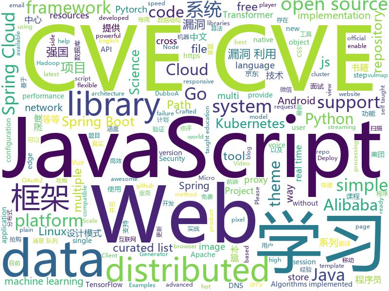

# 2020-12-26
See what the GitHub community is most excited about.

## python
+ [deit](https://github.com/facebookresearch/deit)(**194 stars today**): Official DeiT repository
+ [jd_seckill](https://github.com/huanghyw/jd_seckill)(**108 stars today**): 京东秒杀商品抢购，目前只支持茅台抢购，不支持其他商品！
+ [muzero-general](https://github.com/werner-duvaud/muzero-general)(**74 stars today**): MuZero
+ [Python](https://github.com/TheAlgorithms/Python)(**189 stars today**): All Algorithms implemented in Python
+ [yolact_edge](https://github.com/haotian-liu/yolact_edge)(**194 stars today**): The first competitive instance segmentation approach that runs on small edge devices at real-time speeds.
+ [xmastree2020](https://github.com/standupmaths/xmastree2020)(**91 stars today**): My 500 LED xmas tree
+ [svoice](https://github.com/facebookresearch/svoice)(**190 stars today**): We provide a PyTorch implementation of the paper Voice Separation with an Unknown Number of Multiple Speakers In which, we present a new method for separating a mixed audio sequence, in which multiple voices speak simultaneously. The new method employs gated neural networks that are trained to separate the voices at multiple processing steps, wh…
+ [qiling](https://github.com/qilingframework/qiling)(**24 stars today**): Qiling Advanced Binary Emulation Framework
+ [pytorch-image-models](https://github.com/rwightman/pytorch-image-models)(**53 stars today**): PyTorch image models, scripts, pretrained weights -- (SE)ResNet/ResNeXT, DPN, EfficientNet, MixNet, MobileNet-V3/V2, MNASNet, Single-Path NAS, FBNet, and more
+ [interview_internal_reference](https://github.com/0voice/interview_internal_reference)(**34 stars today**): 2020年最新总结，阿里，腾讯，百度，美团，头条等技术面试题目，以及答案，专家出题人分析汇总。
+ [sktime](https://github.com/alan-turing-institute/sktime)(**485 stars today**): A unified framework for machine learning with time series
+ [DNFCalculating](https://github.com/wxh0402/DNFCalculating)(**10 stars today**): 主体实现By纸飞机
+ [vit-pytorch](https://github.com/lucidrains/vit-pytorch)(**89 stars today**): Implementation of Vision Transformer, a simple way to achieve SOTA in vision classification with only a single transformer encoder, in Pytorch
+ [pandas](https://github.com/pandas-dev/pandas)(**37 stars today**): Flexible and powerful data analysis / manipulation library for Python, providing labeled data structures similar to R data.frame objects, statistical functions, and much more
+ [stock-bot](https://github.com/ryantcullen/stock-bot)(**158 stars today**): A script that can allow you to design a paper trading algorithm in an attempt to beat the market.
+ [vulmap](https://github.com/zhzyker/vulmap)(**31 stars today**): Vulmap - Web漏洞扫描和验证工具，可对Web容器、Web服务器、Web中间件以及CMS等Web程序进行漏洞扫描，并且具备漏洞利用功能。 相关测试人员可以使用vulmap检测目标是否存在特定漏洞，并且可以使用漏洞利用功能验证漏洞是否真实存在。CVE-2020-14882, CVE-2020-2555, CVE-2020-2883, S2-061, CVE-2020-13942, CVE-2020-17530
+ [exphub](https://github.com/zhzyker/exphub)(**8 stars today**): Exphub[漏洞利用脚本库] 包括Webloigc、Struts2、Tomcat、Nexus、Solr、Jboss、Drupal的漏洞利用脚本，最新添加CVE-2020-14882、CVE-2020-11444、CVE-2020-10204、CVE-2020-10199、CVE-2020-1938、CVE-2020-2551、CVE-2020-2555、CVE-2020-2883、CVE-2019-17558、CVE-2019-6340
+ [ansible](https://github.com/ansible/ansible)(**36 stars today**): Ansible is a radically simple IT automation platform that makes your applications and systems easier to deploy and maintain. Automate everything from code deployment to network configuration to cloud management, in a language that approaches plain English, using SSH, with no agents to install on remote systems. https://docs.ansible.com.
+ [Python-100-Days](https://github.com/jackfrued/Python-100-Days)(**108 stars today**): Python - 100天从新手到大师
+ [FGVC](https://github.com/vt-vl-lab/FGVC)(**22 stars today**): [ECCV 2020] Flow-edge Guided Video Completion
+ [transformers](https://github.com/huggingface/transformers)(**106 stars today**): 🤗Transformers: State-of-the-art Natural Language Processing for Pytorch and TensorFlow 2.0.
+ [keras](https://github.com/keras-team/keras)(**32 stars today**): Deep Learning for humans
+ [Watcher](https://github.com/Felix83000/Watcher)(**24 stars today**): Watcher - Open Source Cybersecurity Threat Hunting Platform. Developed with Django & React JS.
+ [erpnext](https://github.com/frappe/erpnext)(**24 stars today**): Free and Open Source Alternative to SAP
+ [scikit-learn](https://github.com/scikit-learn/scikit-learn)(**47 stars today**): scikit-learn: machine learning in Python

## java
+ [dubbo-samples](https://github.com/apache/dubbo-samples)(**11 stars today**): samples for Apache Dubbo
+ [MPAndroidChart](https://github.com/PhilJay/MPAndroidChart)(**19 stars today**): A powerful🚀Android chart view / graph view library, supporting line- bar- pie- radar- bubble- and candlestick charts as well as scaling, panning and animations.
+ [itstack-demo-design](https://github.com/fuzhengwei/itstack-demo-design)(**30 stars today**): 🎨小傅哥微信：fustack |《重学Java设计模式「22个互联网真实案例实战」》技术好就一定能写出好代码吗？不能！再漂亮的马桶放到厨房都略显尴尬！无论是家里装修还是上道开车，只有通过实战才能快速将理论转变为技能。毕竟设计模式也是源于 克里斯托佛·亚历山大 的著作 《建筑模式语言》。
+ [GitHub-Chinese-Top-Charts](https://github.com/kon9chunkit/GitHub-Chinese-Top-Charts)(**58 stars today**): 🇨🇳GitHub中文排行榜，帮助你发现高分优秀中文项目、更高效地吸收国人的优秀经验成果；榜单每周更新一次，敬请关注！
+ [mall-swarm](https://github.com/macrozheng/mall-swarm)(**18 stars today**): mall-swarm是一套微服务商城系统，采用了 Spring Cloud Hoxton & Alibaba、Spring Boot 2.3、Oauth2、MyBatis、Docker、Elasticsearch等核心技术，同时提供了基于Vue的管理后台方便快速搭建系统。mall-swarm在电商业务的基础集成了注册中心、配置中心、监控中心、网关等系统功能。文档齐全，附带全套Spring Cloud教程。
+ [SpringBoot-Labs](https://github.com/YunaiV/SpringBoot-Labs)(**39 stars today**): 一个涵盖六个专栏：Spring Boot 2.X、Spring Cloud、Spring Cloud Alibaba、Dubbo、分布式消息队列、分布式事务的仓库。希望胖友小手一抖，右上角来个 Star，感恩 1024
+ [Java](https://github.com/TheAlgorithms/Java)(**42 stars today**): All Algorithms implemented in Java
+ [NewPipe](https://github.com/TeamNewPipe/NewPipe)(**32 stars today**): A libre lightweight streaming front-end for Android.
+ [tinker](https://github.com/Tencent/tinker)(**8 stars today**): Tinker is a hot-fix solution library for Android, it supports dex, library and resources update without reinstall apk.
+ [cat](https://github.com/dianping/cat)(**25 stars today**): CAT 作为服务端项目基础组件，提供了 Java, C/C++, Node.js, Python, Go 等多语言客户端，已经在美团点评的基础架构中间件框架（MVC框架，RPC框架，数据库框架，缓存框架等，消息队列，配置系统等）深度集成，为美团点评各业务线提供系统丰富的性能指标、健康状况、实时告警等。
+ [JZVideo](https://github.com/Jzvd/JZVideo)(**10 stars today**): 高度自定义的安卓视频框架 MediaPlayer exoplayer ijkplayer ffmpeg
+ [zeppelin](https://github.com/apache/zeppelin)(**2 stars today**): Web-based notebook that enables data-driven, interactive data analytics and collaborative documents with SQL, Scala and more.
+ [fastjson](https://github.com/alibaba/fastjson)(**19 stars today**): A fast JSON parser/generator for Java.
+ [shardingsphere](https://github.com/apache/shardingsphere)(**24 stars today**): Distributed database middleware
+ [CC-Tweaked](https://github.com/SquidDev-CC/CC-Tweaked)(**5 stars today**): Just another ComputerCraft fork
+ [Hystrix](https://github.com/Netflix/Hystrix)(**20 stars today**): Hystrix is a latency and fault tolerance library designed to isolate points of access to remote systems, services and 3rd party libraries, stop cascading failure and enable resilience in complex distributed systems where failure is inevitable.
+ [litemall](https://github.com/linlinjava/litemall)(**14 stars today**): 又一个小商城。litemall = Spring Boot后端 + Vue管理员前端 + 微信小程序用户前端 + Vue用户移动端
+ [SpringAll](https://github.com/wuyouzhuguli/SpringAll)(**70 stars today**): 循序渐进，学习Spring Boot、Spring Boot & Shiro、Spring Batch、Spring Cloud、Spring Cloud Alibaba、Spring Security & Spring Security OAuth2，博客Spring系列源码：https://mrbird.cc
+ [dubbo-admin](https://github.com/apache/dubbo-admin)(**13 stars today**): The ops and reference implementation for Apache Dubbo
+ [Arduino](https://github.com/arduino/Arduino)(**11 stars today**): open-source electronics platform
+ [pinpoint](https://github.com/pinpoint-apm/pinpoint)(**7 stars today**): APM, (Application Performance Management) tool for large-scale distributed systems.
+ [zipkin](https://github.com/openzipkin/zipkin)(**11 stars today**): Zipkin is a distributed tracing system
+ [Signal-Android](https://github.com/signalapp/Signal-Android)(**10 stars today**): A private messenger for Android.
+ [canal](https://github.com/alibaba/canal)(**39 stars today**): 阿里巴巴 MySQL binlog 增量订阅&消费组件
+ [arthas](https://github.com/alibaba/arthas)(**41 stars today**): Alibaba Java Diagnostic Tool Arthas/Alibaba Java诊断利器Arthas

## unknown
+ [Loon-Script](https://github.com/Tartarus2014/Loon-Script)(**11 stars today**): Loon脚本收集
+ [jd_scripts](https://github.com/lxk0301/jd_scripts)(**241 stars today**): 基于JavaScript的京东薅羊毛工具
+ [Best_AI_paper_2020](https://github.com/louisfb01/Best_AI_paper_2020)(**561 stars today**): A curated list of the latest breakthroughs in AI by release date with a clear video explanation, link to a more in-depth article, and code
+ [css-in-readme-like-wat](https://github.com/sindresorhus/css-in-readme-like-wat)(**94 stars today**): Style your readme using CSS with this simple trick
+ [IT_book](https://github.com/XiangLinPro/IT_book)(**52 stars today**): 本项目收藏这些年来看过或者听过的一些不错的常用的上千本书籍，没准你想找的书就在这里呢，包含了互联网行业大多数书籍和面试经验题目等等。有人工智能系列（常用深度学习框架TensorFlow、pytorch、keras。NLP、机器学习，深度学习等等），大数据系列(Spark,Hadoop,Scala,kafka等)，程序员必修系列（C、C++、java、数据结构、linux，设计模式、数据库等等）
+ [data-science](https://github.com/ossu/data-science)(**36 stars today**): 📊Path to a free self-taught education in Data Science!
+ [awesome-iptv](https://github.com/iptv-org/awesome-iptv)(**21 stars today**): A curated list of resources related to IPTV
+ [computer-science](https://github.com/ossu/computer-science)(**261 stars today**): 🎓Path to a free self-taught education in Computer Science!
+ [gold-miner](https://github.com/xitu/gold-miner)(**24 stars today**): 🥇掘金翻译计划，可能是世界最大最好的英译中技术社区，最懂读者和译者的翻译平台：
+ [kotlin](https://github.com/JetBrains/kotlin)(**32 stars today**): The Kotlin Programming Language
+ [focal-frequency-loss](https://github.com/EndlessSora/focal-frequency-loss)(**60 stars today**): Focal Frequency Loss for Generative Models
+ [machine-learning-for-software-engineers](https://github.com/ZuzooVn/machine-learning-for-software-engineers)(**13 stars today**): A complete daily plan for studying to become a machine learning engineer.
+ [COVID-19](https://github.com/pcm-dpc/COVID-19)(**2 stars today**): COVID-19 Italia - Monitoraggio situazione
+ [100-days-of-code](https://github.com/kallaway/100-days-of-code)(**23 stars today**): Fork this template for the 100 days journal - to keep yourself accountable (multiple languages available)
+ [awesome-cs-books](https://github.com/imarvinle/awesome-cs-books)(**61 stars today**): 经典编程书籍大全，涵盖：计算机系统与网络、系统架构、算法与数据结构、前端开发、后端开发、移动开发、数据库、测试、项目与团队、程序员职业修炼、求职面试等
+ [Certified-Kubernetes-Security-Specialist](https://github.com/walidshaari/Certified-Kubernetes-Security-Specialist)(**17 stars today**): Online resources help you prepare for the CNCF/Linux Foundation CKS 2020 "Kubernetes Certified Security Specialist" Certification exam. Please provide feedback or requests by raising issues, or making a pull request. All feedback for improvements are welcome. thank you .
+ [AMD_Vanilla](https://github.com/AMD-OSX/AMD_Vanilla)(**6 stars today**): Native AMD macOS via Clover & OpenCore
+ [kubernetes-network-policy-recipes](https://github.com/ahmetb/kubernetes-network-policy-recipes)(**9 stars today**): Example recipes for Kubernetes Network Policies that you can just copy paste
+ [TeachYourselfCS-CN](https://github.com/keithnull/TeachYourselfCS-CN)(**39 stars today**): TeachYourselfCS 的中文翻译 | A Chinese translation of TeachYourselfCS
+ [first-contributions](https://github.com/firstcontributions/first-contributions)(**21 stars today**): 🚀✨Help beginners to contribute to open source projects
+ [HEU_KMS_Activator](https://github.com/zbezj/HEU_KMS_Activator)(**36 stars today**): 
+ [proposals](https://github.com/tc39/proposals)(**16 stars today**): Tracking ECMAScript Proposals
+ [GoBooks](https://github.com/dariubs/GoBooks)(**19 stars today**): List of Golang books
+ [AutoXue2](https://github.com/Jack-Laoyang/AutoXue2)(**12 stars today**): 学习强国助手，通过安装pc模拟器，彻底解放手机。除了强国运动，目前支持所有项目拿分，争上游胜率70%以上，专项答题和每周答题实时更新题库。
+ [fucking-algorithm](https://github.com/labuladong/fucking-algorithm)(**358 stars today**): 刷算法全靠套路，认准 labuladong 就够了！English version supported! Crack LeetCode, not only how, but also why.

## javascript
+ [iptv](https://github.com/iptv-org/iptv)(**553 stars today**): Collection of 5000+ publicly available IPTV channels from all over the world
+ [Web-Dev-For-Beginners](https://github.com/microsoft/Web-Dev-For-Beginners)(**1,215 stars today**): 24 Lessons, 12 Weeks, Get Started as a Web Developer
+ [DSC-30-Days-of-Web](https://github.com/30DaysofWebDEV/DSC-30-Days-of-Web)(**104 stars today**): 
+ [snapdrop](https://github.com/RobinLinus/snapdrop)(**633 stars today**): A Progressive Web App for local file sharing
+ [edex-ui](https://github.com/GitSquared/edex-ui)(**904 stars today**): A cross-platform, customizable science fiction terminal emulator with advanced monitoring & touchscreen support.
+ [ccxt](https://github.com/ccxt/ccxt)(**33 stars today**): A JavaScript / Python / PHP cryptocurrency trading API with support for more than 120 bitcoin/altcoin exchanges
+ [vant](https://github.com/youzan/vant)(**116 stars today**): Lightweight Mobile UI Components built on Vue
+ [docs](https://github.com/github/docs)(**22 stars today**): The open-source repo for docs.github.com
+ [turbo-rails](https://github.com/hotwired/turbo-rails)(**108 stars today**): Turbo gives you the speed of a single-page web application without having to write any JavaScript.
+ [Real-time-stock-market-prediction](https://github.com/victor369basu/Real-time-stock-market-prediction)(**103 stars today**): In this repository, I have developed the entire server-side principal architecture for real-time stock market prediction with Machine Learning. I have used Tensorflow.js for constructing ml model architecture, and Kafka for real-time data streaming and pipelining.
+ [NeteaseCloudMusicApi](https://github.com/Binaryify/NeteaseCloudMusicApi)(**36 stars today**): 网易云音乐 Node.js API service
+ [freeCodeCamp](https://github.com/freeCodeCamp/freeCodeCamp)(**115 stars today**): freeCodeCamp.org's open source codebase and curriculum. Learn to code at home.
+ [Javascript](https://github.com/TheAlgorithms/Javascript)(**24 stars today**): A repository for All algorithms implemented in Javascript (for educational purposes only)
+ [QuantumultX](https://github.com/Orz-3/QuantumultX)(**15 stars today**): 
+ [CodeMirror](https://github.com/codemirror/CodeMirror)(**33 stars today**): In-browser code editor
+ [popcorn-desktop](https://github.com/popcorn-official/popcorn-desktop)(**12 stars today**): Popcorn Time is a multi-platform, free software BitTorrent client that includes an integrated media player ( Windows / Mac / Linux ) A Butter-Project Fork
+ [UnblockNeteaseMusic](https://github.com/nondanee/UnblockNeteaseMusic)(**278 stars today**): Revive unavailable songs for Netease Cloud Music
+ [jd_sign_bot](https://github.com/ruicky/jd_sign_bot)(**79 stars today**): 京东签到机器人
+ [project_e_commerce](https://github.com/adrianhajdin/project_e_commerce)(**9 stars today**): 
+ [lazysizes](https://github.com/aFarkas/lazysizes)(**18 stars today**): High performance and SEO friendly lazy loader for images (responsive and normal), iframes and more, that detects any visibility changes triggered through user interaction, CSS or JavaScript without configuration.
+ [react](https://github.com/facebook/react)(**148 stars today**): A declarative, efficient, and flexible JavaScript library for building user interfaces.
+ [scripts](https://github.com/chavyleung/scripts)(**19 stars today**): 
+ [cesium](https://github.com/CesiumGS/cesium)(**7 stars today**): An open-source JavaScript library for world-class 3D globes and maps🌎
+ [30-seconds-of-code](https://github.com/30-seconds/30-seconds-of-code)(**105 stars today**): Short JavaScript code snippets for all your development needs
+ [flv.js](https://github.com/bilibili/flv.js)(**19 stars today**): HTML5 FLV Player

## html
+ [lovexuexi](https://github.com/james-bond-007/lovexuexi)(**6 stars today**): 我爱学习强国。学习强国聚合了大量可免费阅读的期刊、古籍、公开课、歌曲、戏曲、电影、图书等资料，内容严谨，专业性强。没有博眼球，无下限的自媒体内容和虚假新闻。推荐大家自发积极学习使用。
+ [bitaddress.org](https://github.com/pointbiz/bitaddress.org)(**4 stars today**): JavaScript Client-Side Bitcoin Wallet Generator
+ [Coursera-ML-AndrewNg-Notes](https://github.com/fengdu78/Coursera-ML-AndrewNg-Notes)(**30 stars today**): 吴恩达老师的机器学习课程个人笔记
+ [hugo-PaperMod](https://github.com/adityatelange/hugo-PaperMod)(**4 stars today**): Hugo Theme PaperMod
+ [hugo-book](https://github.com/alex-shpak/hugo-book)(**7 stars today**): Hugo documentation theme as simple as plain book
+ [awesome-piracy](https://github.com/Igglybuff/awesome-piracy)(**23 stars today**): A curated list of awesome warez and piracy links
+ [joyful-pandas](https://github.com/datawhalechina/joyful-pandas)(**7 stars today**): Pandas中文教程
+ [blackeye](https://github.com/x3rz/blackeye)(**4 stars today**): This is the updated version of blackeye with ngrok
+ [rockylinux.org](https://github.com/rocky-linux/rockylinux.org)(**7 stars today**): The official website of the Rocky Linux Project.
+ [craftinginterpreters](https://github.com/munificent/craftinginterpreters)(**11 stars today**): Repository for the book "Crafting Interpreters"
+ [huxpro.github.io](https://github.com/Huxpro/huxpro.github.io)(**7 stars today**): My Blog / Jekyll Themes / PWA
+ [windmill-dashboard](https://github.com/estevanmaito/windmill-dashboard)(**6 stars today**): 📊A multi theme, completely accessible, ready for production dashboard.
+ [kubespray](https://github.com/kubernetes-sigs/kubespray)(**13 stars today**): Deploy a Production Ready Kubernetes Cluster
+ [JavaScript30](https://github.com/wesbos/JavaScript30)(**30 stars today**): 30 Day Vanilla JS Challenge
+ [photo-stream](https://github.com/maxvoltar/photo-stream)(**5 stars today**): Self-hosted, super simple photo stream
+ [skill-map](https://github.com/TeamStuQ/skill-map)(**20 stars today**): 程序员技能图谱
+ [vex-hugo](https://github.com/themefisher/vex-hugo)(**0 stars today**): Vex is a product landing page theme/template created by Themefisher based on the latest Bootstrap 4 framework. It is fully responsive and beautifully crafted with Product Showcase, Testimonials, and Email Subscription sections
+ [zju-icicles](https://github.com/QSCTech/zju-icicles)(**21 stars today**): 浙江大学课程攻略共享计划
+ [datasciencecoursera](https://github.com/mGalarnyk/datasciencecoursera)(**3 stars today**): Data Science Repo and blog for John Hopkins Coursera Courses. Please let me know if you have any questions.
+ [screenfull.js](https://github.com/sindresorhus/screenfull.js)(**9 stars today**): Simple wrapper for cross-browser usage of the JavaScript Fullscreen API
+ [intro.js](https://github.com/usablica/intro.js)(**10 stars today**): A better way for new feature introduction and step-by-step users guide for your website and project.
+ [REKCARC-TSC-UHT](https://github.com/PKUanonym/REKCARC-TSC-UHT)(**18 stars today**): 清华大学计算机系课程攻略 Guidance for courses in Department of Computer Science and Technology, Tsinghua University
+ [python](https://github.com/Show-Me-the-Code/python)(**1 stars today**): Show Me the Code Python version.
+ [pihole-kubernetes](https://github.com/MoJo2600/pihole-kubernetes)(**0 stars today**): PiHole on kubernetes
+ [zfaka](https://github.com/zlkbdotnet/zfaka)(**2 stars today**): 免费、安全、稳定、高效的发卡系统，值得拥有!

## go
+ [learngo](https://github.com/inancgumus/learngo)(**381 stars today**): 1000+ Hand-Crafted Go Examples, Exercises, and Quizzes
+ [imgdiff](https://github.com/n7olkachev/imgdiff)(**113 stars today**): Faster than the fastest in the world pixel-by-pixel image difference tool.
+ [micro](https://github.com/micro/micro)(**38 stars today**): Micro is a platform for cloud native development
+ [awesome-go](https://github.com/avelino/awesome-go)(**71 stars today**): A curated list of awesome Go frameworks, libraries and software
+ [colly](https://github.com/gocolly/colly)(**26 stars today**): Elegant Scraper and Crawler Framework for Golang
+ [dnscrypt-proxy](https://github.com/DNSCrypt/dnscrypt-proxy)(**18 stars today**): dnscrypt-proxy 2 - A flexible DNS proxy, with support for encrypted DNS protocols.
+ [build-web-application-with-golang](https://github.com/astaxie/build-web-application-with-golang)(**34 stars today**): A golang ebook intro how to build a web with golang
+ [dubbo-go](https://github.com/apache/dubbo-go)(**10 stars today**): Go Implementation For Apache Dubbo
+ [nsq](https://github.com/nsqio/nsq)(**21 stars today**): A realtime distributed messaging platform
+ [gomail](https://github.com/go-gomail/gomail)(**16 stars today**): The best way to send emails in Go.
+ [seaweedfs](https://github.com/chrislusf/seaweedfs)(**19 stars today**): SeaweedFS is a distributed object store and file system to store and serve billions of files fast! Object store has O(1) disk seek, transparent cloud integration. Filer supports cross-cluster active-active replication, Kubernetes, POSIX, S3 API, encryption, Erasure Coding for warm storage, FUSE mount, Hadoop, WebDAV.
+ [examples](https://github.com/gin-gonic/examples)(**7 stars today**): A repository to host examples and tutorials for Gin.
+ [kit](https://github.com/go-kit/kit)(**32 stars today**): A standard library for microservices.
+ [gobuster](https://github.com/OJ/gobuster)(**18 stars today**): Directory/File, DNS and VHost busting tool written in Go
+ [kubesphere](https://github.com/kubesphere/kubesphere)(**14 stars today**): Enterprise-grade container platform tailored for multicloud and multi-cluster management
+ [tailscale](https://github.com/tailscale/tailscale)(**13 stars today**): The easiest, most secure way to use WireGuard and 2FA.
+ [tidb](https://github.com/pingcap/tidb)(**51 stars today**): TiDB is an open source distributed HTAP database compatible with the MySQL protocol
+ [glow](https://github.com/charmbracelet/glow)(**26 stars today**): Render markdown on the CLI, with pizzazz! 💅🏻
+ [ent](https://github.com/facebook/ent)(**28 stars today**): An entity framework for Go
+ [fasthttp](https://github.com/valyala/fasthttp)(**19 stars today**): Fast HTTP package for Go. Tuned for high performance. Zero memory allocations in hot paths. Up to 10x faster than net/http
+ [Xray-core](https://github.com/XTLS/Xray-core)(**74 stars today**): Xray, Penetrates Everything. Also the best v2ray-core, with XTLS support. Fully compatible configuration.
+ [go-micro](https://github.com/asim/go-micro)(**28 stars today**): Go Micro is a framework for distributed systems development
+ [bettercap](https://github.com/bettercap/bettercap)(**24 stars today**): The Swiss Army knife for 802.11, BLE and Ethernet networks reconnaissance and MITM attacks.
+ [mosn](https://github.com/mosn/mosn)(**3 stars today**): MOSN is a cloud native proxy for edge or service mesh. https://mosn.io
+ [sessions](https://github.com/gorilla/sessions)(**5 stars today**): Package gorilla/sessions provides cookie and filesystem sessions and infrastructure for custom session backends.

## WordCloud

