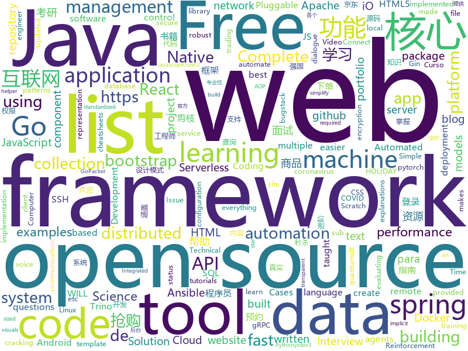

# 2020-12-30
See what the GitHub community is most excited about.

## python
+ [jd_seckill](https://github.com/huanghyw/jd_seckill)(**2,039 stars today**): 
+ [models](https://github.com/tensorflow/models)(**28 stars today**): Models and examples built with TensorFlow
+ [ansible](https://github.com/ansible/ansible)(**20 stars today**): Ansible is a radically simple IT automation platform that makes your applications and systems easier to deploy and maintain. Automate everything from code deployment to network configuration to cloud management, in a language that approaches plain English, using SSH, with no agents to install on remote systems. https://docs.ansible.com.
+ [core](https://github.com/home-assistant/core)(**156 stars today**): WE ARE ON HOLIDAY. REVIEWS WILL TAKE A WHILE. HAPPY HOLIDAYS!✨🏡Open source home automation that puts local control and privacy first
+ [covid-19-data](https://github.com/owid/covid-19-data)(**19 stars today**): Data on COVID-19 (coronavirus) cases, deaths, hospitalizations, tests • All countries • Updated daily by Our World in Data
+ [public-apis](https://github.com/public-apis/public-apis)(**181 stars today**): A collective list of free APIs for use in software and web development.
+ [stylegan2](https://github.com/NVlabs/stylegan2)(**11 stars today**): StyleGAN2 - Official TensorFlow Implementation
+ [dagster](https://github.com/dagster-io/dagster)(**6 stars today**): A data orchestrator for machine learning, analytics, and ETL.
+ [data-science-from-scratch](https://github.com/joelgrus/data-science-from-scratch)(**13 stars today**): code for Data Science From Scratch book
+ [ParlAI](https://github.com/facebookresearch/ParlAI)(**4 stars today**): A framework for training and evaluating AI models on a variety of openly available dialogue datasets.
+ [freqtrade](https://github.com/freqtrade/freqtrade)(**165 stars today**): Free, open source crypto trading bot
+ [PayloadsAllTheThings](https://github.com/swisskyrepo/PayloadsAllTheThings)(**45 stars today**): A list of useful payloads and bypass for Web Application Security and Pentest/CTF
+ [jd_mask](https://github.com/zhou-xiaojun/jd_mask)(**231 stars today**): 京东定时自动预约,抢购.(只针对性支持要先预约,到点抢购.然后直接下单的商品!)
+ [django](https://github.com/django/django)(**40 stars today**): The Web framework for perfectionists with deadlines.
+ [jd-assistant](https://github.com/tychxn/jd-assistant)(**64 stars today**): 京东抢购助手：包含登录，查询商品库存/价格，添加/清空购物车，抢购商品(下单)，查询订单等功能
+ [examples](https://github.com/pytorch/examples)(**16 stars today**): A set of examples around pytorch in Vision, Text, Reinforcement Learning, etc.
+ [MODNet](https://github.com/ZHKKKe/MODNet)(**49 stars today**): A Trimap-Free Solution for Portrait Matting in Real Time under Changing Scenes
+ [keras](https://github.com/keras-team/keras)(**14 stars today**): Deep Learning for humans
+ [Python](https://github.com/TheAlgorithms/Python)(**255 stars today**): All Algorithms implemented in Python
+ [fastapi](https://github.com/tiangolo/fastapi)(**60 stars today**): FastAPI framework, high performance, easy to learn, fast to code, ready for production
+ [netmiko](https://github.com/ktbyers/netmiko)(**4 stars today**): Multi-vendor library to simplify Paramiko SSH connections to network devices
+ [tensortrade](https://github.com/tensortrade-org/tensortrade)(**23 stars today**): An open source reinforcement learning framework for training, evaluating, and deploying robust trading agents.
+ [rasa](https://github.com/RasaHQ/rasa)(**11 stars today**): 💬Open source machine learning framework to automate text- and voice-based conversations: NLU, dialogue management, connect to Slack, Facebook, and more - Create chatbots and voice assistants
+ [python-patterns](https://github.com/faif/python-patterns)(**27 stars today**): A collection of design patterns/idioms in Python
+ [yolov3-channel-and-layer-pruning](https://github.com/tanluren/yolov3-channel-and-layer-pruning)(**3 stars today**): yolov3 yolov4 channel and layer pruning, Knowledge Distillation 层剪枝，通道剪枝，知识蒸馏

## java
+ [itstack-demo-design](https://github.com/fuzhengwei/itstack-demo-design)(**75 stars today**): 🎨《重学Java设计模式》是一本互联网真实案例实践书籍。以落地解决方案为核心，从实际业务中抽离出，交易、营销、秒杀、中间件、源码等22个真实场景，来学习设计模式的运用。欢迎关注小傅哥，微信(fustack)，公众号：bugstack虫洞栈，博客：https://bugstack.cn
+ [dbeaver](https://github.com/dbeaver/dbeaver)(**35 stars today**): Free universal database tool and SQL client
+ [trino](https://github.com/trinodb/trino)(**97 stars today**): Official repository of Trino, the distributed SQL query engine for big data, formerly known as PrestoSQL (https://trino.io)
+ [Recaf](https://github.com/Col-E/Recaf)(**123 stars today**): The modern Java bytecode editor
+ [miaosha](https://github.com/qiurunze123/miaosha)(**19 stars today**): ⭐⭐⭐⭐秒杀系统设计与实现.互联网工程师进阶与分析🙋🐓
+ [feign](https://github.com/OpenFeign/feign)(**3 stars today**): Feign makes writing java http clients easier
+ [Java-Tutorial](https://github.com/h2pl/Java-Tutorial)(**7 stars today**): 【Java工程师面试复习指南】本仓库涵盖大部分Java程序员所需要掌握的核心知识，整合了互联网上的很多优质Java技术文章，力求打造为最完整最实用的Java开发者学习指南，如果对你有帮助，给个star告诉我吧，谢谢！
+ [calcite](https://github.com/apache/calcite)(**5 stars today**): Apache Calcite
+ [spring-boot](https://github.com/spring-projects/spring-boot)(**21 stars today**): Spring Boot
+ [pulsar](https://github.com/apache/pulsar)(**9 stars today**): Apache Pulsar - distributed pub-sub messaging system
+ [cryptomator](https://github.com/cryptomator/cryptomator)(**6 stars today**): Multi-platform transparent client-side encryption of your files in the cloud
+ [nifi](https://github.com/apache/nifi)(**3 stars today**): Apache NiFi
+ [iceberg](https://github.com/apache/iceberg)(**4 stars today**): Apache Iceberg
+ [BigData-Notes](https://github.com/heibaiying/BigData-Notes)(**4 stars today**): 大数据入门指南⭐
+ [cordova-plugin-inappbrowser](https://github.com/apache/cordova-plugin-inappbrowser)(**1 stars today**): Apache Cordova Plugin inappbrowser
+ [java-design-patterns](https://github.com/iluwatar/java-design-patterns)(**17 stars today**): Design patterns implemented in Java
+ [react-native-video](https://github.com/react-native-video/react-native-video)(**3 stars today**): A <Video /> component for react-native
+ [selenium](https://github.com/SeleniumHQ/selenium)(**13 stars today**): A browser automation framework and ecosystem.
+ [mini-spring](https://github.com/DerekYRC/mini-spring)(**22 stars today**): mini-spring是简化版的spring框架，能帮助你快速熟悉spring源码和掌握spring的核心原理。抽取了spring的核心逻辑，代码极度简化，保留spring的核心功能，如IoC和AOP、资源加载器、事件监听器、类型转换、容器扩展点、bean生命周期和作用域、应用上下文等核心功能。
+ [elasticsearch](https://github.com/elastic/elasticsearch)(**23 stars today**): Open Source, Distributed, RESTful Search Engine
+ [react-native-gesture-handler](https://github.com/software-mansion/react-native-gesture-handler)(**5 stars today**): Declarative API exposing platform native touch and gesture system to React Native.
+ [termux-app](https://github.com/termux/termux-app)(**5 stars today**): Android terminal and Linux environment - app repository.
+ [react-native-camera](https://github.com/react-native-camera/react-native-camera)(**3 stars today**): A Camera component for React Native. Also supports barcode scanning!
+ [shardingsphere](https://github.com/apache/shardingsphere)(**8 stars today**): Distributed database middleware
+ [karate](https://github.com/intuit/karate)(**2 stars today**): Test Automation Made Simple

## unknown
+ [computer-science](https://github.com/ossu/computer-science)(**641 stars today**): 🎓Path to a free self-taught education in Computer Science!
+ [Cracking-The-Coding-Interview-Python-Solutions-and-Explanations](https://github.com/arpan74/Cracking-The-Coding-Interview-Python-Solutions-and-Explanations)(**186 stars today**): Cracking the Coding Interview in Python 3. The solutions all have detailed explanations with visuals.
+ [coding-interview-university](https://github.com/jwasham/coding-interview-university)(**690 stars today**): A complete computer science study plan to become a software engineer.
+ [Complete-Placement-Preparation](https://github.com/anushka23g/Complete-Placement-Preparation)(**188 stars today**): This repository consists of all the material required for cracking the coding rounds and technical interviews during placements.
+ [KingOfBugBountyTips](https://github.com/KingOfBugbounty/KingOfBugBountyTips)(**6 stars today**): 
+ [awesome-cs-books](https://github.com/imarvinle/awesome-cs-books)(**107 stars today**): 经典编程书籍大全，涵盖：计算机系统与网络、系统架构、算法与数据结构、前端开发、后端开发、移动开发、数据库、测试、项目与团队、程序员职业修炼、求职面试等
+ [stanford-cs-229-machine-learning](https://github.com/afshinea/stanford-cs-229-machine-learning)(**31 stars today**): VIP cheatsheets for Stanford's CS 229 Machine Learning
+ [the-book-of-secret-knowledge](https://github.com/trimstray/the-book-of-secret-knowledge)(**19 stars today**): A collection of inspiring lists, manuals, cheatsheets, blogs, hacks, one-liners, cli/web tools and more.
+ [upptime](https://github.com/upptime/upptime)(**431 stars today**): ⬆️Uptime monitor and status page powered by GitHub Actions, Issues, and Pages
+ [awesome-implicit-representations](https://github.com/vsitzmann/awesome-implicit-representations)(**149 stars today**): A curated list of resources on implicit neural representations.
+ [widevine-l3-decryptor](https://github.com/tomer8007/widevine-l3-decryptor)(**32 stars today**): A Chrome extension that demonstrates bypassing Widevine L3 DRM
+ [Awesome-CobaltStrike](https://github.com/zer0yu/Awesome-CobaltStrike)(**37 stars today**): cobaltstrike的相关资源汇总 / List of Awesome CobaltStrike Resources
+ [Awesome-pytorch-list](https://github.com/bharathgs/Awesome-pytorch-list)(**59 stars today**): A comprehensive list of pytorch related content on github,such as different models,implementations,helper libraries,tutorials etc.
+ [vagas](https://github.com/backend-br/vagas)(**12 stars today**): ✌️Espaço para divulgação de vagas para backenders
+ [cskaoyan](https://github.com/csseky/cskaoyan)(**107 stars today**): 提供计算机考研和软件工程考研专业的各个学校 考研真题
+ [open-source-cs](https://github.com/ForrestKnight/open-source-cs)(**123 stars today**): Video discussing this curriculum:
+ [Xiaomi_Kernel_OpenSource](https://github.com/MiCode/Xiaomi_Kernel_OpenSource)(**44 stars today**): Xiaomi Mobile Phone Kernel OpenSource
+ [Flutter-Course-Resources](https://github.com/londonappbrewery/Flutter-Course-Resources)(**9 stars today**): Learn to Code While Building Apps - The Complete Flutter Development Bootcamp
+ [you-dont-know-js-ru](https://github.com/azat-io/you-dont-know-js-ru)(**6 stars today**): 📚Russian translation of "You Don't Know JS" book series
+ [Lists](https://github.com/blocklistproject/Lists)(**8 stars today**): Primary Block Lists
+ [laravel-best-practices](https://github.com/alexeymezenin/laravel-best-practices)(**9 stars today**): Laravel best practices
+ [COVID-19](https://github.com/CSSEGISandData/COVID-19)(**20 stars today**): Novel Coronavirus (COVID-19) Cases, provided by JHU CSSE
+ [awesome-malware-analysis](https://github.com/rshipp/awesome-malware-analysis)(**10 stars today**): Defund the Police.
+ [ShameCom](https://github.com/ShameCom/ShameCom)(**43 stars today**): 收集校招污点公司或组织，帮助学弟学妹避雷。互联网不曾遗忘！
+ [javascript-questions](https://github.com/lydiahallie/javascript-questions)(**41 stars today**): A long list of (advanced) JavaScript questions, and their explanations✨

## javascript
+ [Tmall_Tickets](https://github.com/cehui0303/Tmall_Tickets)(**32 stars today**): 天猫超市茅台抢票功能
+ [social-analyzer](https://github.com/qeeqbox/social-analyzer)(**45 stars today**): API and Web App for analyzing & finding a person profile across 300+ social media websites (Detections are updated regularly)
+ [AI-Expert-Roadmap](https://github.com/AMAI-GmbH/AI-Expert-Roadmap)(**452 stars today**): Roadmap to becoming an Artificial Intelligence Expert in 2020
+ [JavaScript](https://github.com/ziye12/JavaScript)(**11 stars today**): 本人quantumult x，优先适配quantumult x， surge loon应该也能用
+ [lighthouse](https://github.com/GoogleChrome/lighthouse)(**15 stars today**): Automated auditing, performance metrics, and best practices for the web.
+ [joplin](https://github.com/laurent22/joplin)(**38 stars today**): Joplin - an open source note taking and to-do application with synchronization capabilities for Windows, macOS, Linux, Android and iOS. Forum: https://discourse.joplinapp.org/
+ [lerna](https://github.com/lerna/lerna)(**22 stars today**): 🐉A tool for managing JavaScript projects with multiple packages.
+ [clean-code-javascript](https://github.com/ryanmcdermott/clean-code-javascript)(**81 stars today**): 🛁Clean Code concepts adapted for JavaScript
+ [bigbluebutton](https://github.com/bigbluebutton/bigbluebutton)(**10 stars today**): Complete open source web conferencing system.
+ [Rocket.Chat](https://github.com/RocketChat/Rocket.Chat)(**47 stars today**): The ultimate Free Open Source Solution for team communications.
+ [examples](https://github.com/serverless/examples)(**3 stars today**): Serverless Examples – A collection of boilerplates and examples of serverless architectures built with the Serverless Framework on AWS Lambda, Microsoft Azure, Google Cloud Functions, and more.
+ [pdf.js](https://github.com/mozilla/pdf.js)(**10 stars today**): PDF Reader in JavaScript
+ [github-wrapped](https://github.com/ishandeveloper/github-wrapped)(**65 stars today**): Take a look back at all the contributions you as an individual made to the open-source community
+ [bitwarden_rs](https://github.com/dani-garcia/bitwarden_rs)(**18 stars today**): Unofficial Bitwarden compatible server written in Rust
+ [FileSaver.js](https://github.com/eligrey/FileSaver.js)(**8 stars today**): An HTML5 saveAs() FileSaver implementation
+ [react-beautiful-dnd](https://github.com/atlassian/react-beautiful-dnd)(**12 stars today**): Beautiful and accessible drag and drop for lists with React
+ [label-studio](https://github.com/heartexlabs/label-studio)(**8 stars today**): Label Studio is a multi-type data labeling and annotation tool with standardized output format
+ [semantic-release](https://github.com/semantic-release/semantic-release)(**8 stars today**): 📦🚀Fully automated version management and package publishing
+ [koa](https://github.com/koajs/koa)(**12 stars today**): Expressive middleware for node.js using ES2017 async functions
+ [openlayers](https://github.com/openlayers/openlayers)(**11 stars today**): OpenLayers
+ [corona-widget](https://github.com/rphl/corona-widget)(**2 stars today**): COVID-19 Inzidenz-Widget für iOS innerhalb Deutschlands🇩🇪(Kreis/Stadt + Bundesland + Trend)
+ [next.js](https://github.com/vercel/next.js)(**46 stars today**): The React Framework
+ [html5-boilerplate](https://github.com/h5bp/html5-boilerplate)(**17 stars today**): A professional front-end template for building fast, robust, and adaptable web apps or sites.
+ [react-bootstrap](https://github.com/react-bootstrap/react-bootstrap)(**6 stars today**): Bootstrap components built with React
+ [BrasilAPI](https://github.com/BrasilAPI/BrasilAPI)(**9 stars today**): Vamos transformar o Brasil em uma API?

## html
+ [free_r_tips](https://github.com/business-science/free_r_tips)(**6 stars today**): Free R-Tips is a FREE Newsletter provided by Business Science. It comes with bite-sized code tutorials every Tuesday.
+ [matrix-docker-ansible-deploy](https://github.com/spantaleev/matrix-docker-ansible-deploy)(**7 stars today**): Matrix (An open network for secure, decentralized communication) server setup using Ansible and Docker
+ [Java-Interview-Advanced](https://github.com/shishan100/Java-Interview-Advanced)(**7 stars today**): 中华石杉--互联网Java进阶面试训练营
+ [amundsen](https://github.com/amundsen-io/amundsen)(**2 stars today**): Amundsen is a metadata driven application for improving the productivity of data analysts, data scientists and engineers when interacting with data.
+ [html-css](https://github.com/gustavoguanabara/html-css)(**12 stars today**): Curso de HTML5 e CSS3
+ [fastText](https://github.com/facebookresearch/fastText)(**4 stars today**): Library for fast text representation and classification.
+ [ecma262](https://github.com/tc39/ecma262)(**8 stars today**): Status, process, and documents for ECMA-262
+ [awesome-compose](https://github.com/docker/awesome-compose)(**13 stars today**): Awesome Docker Compose samples
+ [genki-study-resources](https://github.com/SethClydesdale/genki-study-resources)(**15 stars today**): A collection of exercises for practicing what is taught in Genki: An Integrated Course in Elementary Japanese.
+ [charts](https://github.com/bitnami/charts)(**3 stars today**): Helm Charts
+ [docker-development-youtube-series](https://github.com/marcel-dempers/docker-development-youtube-series)(**5 stars today**): 
+ [Spoon-Knife](https://github.com/octocat/Spoon-Knife)(**1 stars today**): This repo is for demonstration purposes only.
+ [beginner-javascript](https://github.com/wesbos/beginner-javascript)(**6 stars today**): Slam Dunk JavaScript
+ [hyperblog](https://github.com/freddier/hyperblog)(**9 stars today**): Un blog increíble para el curso de Git y Github de Platzi
+ [Intro2CS_Ariel](https://github.com/benmoshe/Intro2CS_Ariel)(**0 stars today**): 
+ [ML-notes](https://github.com/Sakura-gh/ML-notes)(**4 stars today**): notes about machine learning
+ [turndown](https://github.com/domchristie/turndown)(**3 stars today**): 🛏An HTML to Markdown converter written in JavaScript
+ [coreui-free-bootstrap-admin-template](https://github.com/coreui/coreui-free-bootstrap-admin-template)(**2 stars today**): CoreUI is free bootstrap admin template
+ [keycloak-documentation](https://github.com/keycloak/keycloak-documentation)(**0 stars today**): 
+ [lovexuexi](https://github.com/james-bond-007/lovexuexi)(**3 stars today**): 我爱学习强国。学习强国聚合了大量可免费阅读的期刊、古籍、公开课、歌曲、戏曲、电影、图书等资料，内容严谨，专业性强。没有博眼球，无下限的自媒体内容和虚假新闻。推荐大家自发积极学习使用。
+ [ansible-role-mysql](https://github.com/geerlingguy/ansible-role-mysql)(**2 stars today**): Ansible Role - MySQL
+ [minimal-mistakes](https://github.com/mmistakes/minimal-mistakes)(**6 stars today**): 📐Jekyll theme for building a personal site, blog, project documentation, or portfolio.
+ [tools](https://github.com/googlecodelabs/tools)(**3 stars today**): Codelabs management & hosting tools
+ [qcloud-documents](https://github.com/tencentyun/qcloud-documents)(**4 stars today**): 腾讯云官方文档
+ [PortFolio_Website](https://github.com/akashyap2013/PortFolio_Website)(**2 stars today**): Complete Portfolio Website with Bootstrap - HTML/CSS In this project, we are going to learn and build how to create a complete portfolio website with bootstrap using HTML and CSS. We will understand everything from scratch.

## go
+ [logrus](https://github.com/sirupsen/logrus)(**14 stars today**): Structured, pluggable logging for Go.
+ [watson](https://github.com/genkami/watson)(**61 stars today**): WATSON: Wasted but Amazing Turing-incomplete Stack-based Object Notation
+ [esbuild](https://github.com/evanw/esbuild)(**92 stars today**): An extremely fast JavaScript bundler and minifier
+ [aws-sdk-go](https://github.com/aws/aws-sdk-go)(**2 stars today**): AWS SDK for the Go programming language.
+ [ent](https://github.com/facebook/ent)(**34 stars today**): An entity framework for Go
+ [chi](https://github.com/go-chi/chi)(**9 stars today**): lightweight, idiomatic and composable router for building Go HTTP services
+ [go-interview](https://github.com/shomali11/go-interview)(**11 stars today**): Collection of Technical Interview Questions solved with Go
+ [packer](https://github.com/hashicorp/packer)(**5 stars today**): Packer is a tool for creating identical machine images for multiple platforms from a single source configuration.
+ [nfs-subdir-external-provisioner](https://github.com/kubernetes-sigs/nfs-subdir-external-provisioner)(**3 stars today**): Dynamic sub-dir volume provisioner on a remote NFS server.
+ [dex](https://github.com/dexidp/dex)(**5 stars today**): OpenID Connect Identity (OIDC) and OAuth 2.0 Provider with Pluggable Connectors
+ [go-swagger](https://github.com/go-swagger/go-swagger)(**4 stars today**): Swagger 2.0 implementation for go
+ [apisix-dashboard](https://github.com/apache/apisix-dashboard)(**3 stars today**): Dashboard for Apache APISIX
+ [traefik](https://github.com/traefik/traefik)(**17 stars today**): The Cloud Native Application Proxy
+ [ingress-nginx](https://github.com/kubernetes/ingress-nginx)(**13 stars today**): NGINX Ingress Controller for Kubernetes
+ [argo-cd](https://github.com/argoproj/argo-cd)(**11 stars today**): Declarative continuous deployment for Kubernetes.
+ [filebrowser](https://github.com/filebrowser/filebrowser)(**29 stars today**): 📂Web File Browser
+ [client_golang](https://github.com/prometheus/client_golang)(**1 stars today**): Prometheus instrumentation library for Go applications
+ [vault](https://github.com/hashicorp/vault)(**9 stars today**): A tool for secrets management, encryption as a service, and privileged access management
+ [pgx](https://github.com/jackc/pgx)(**10 stars today**): PostgreSQL driver and toolkit for Go
+ [istio](https://github.com/istio/istio)(**14 stars today**): Connect, secure, control, and observe services.
+ [sys](https://github.com/golang/sys)(**1 stars today**): [mirror] Go packages for low-level interaction with the operating system
+ [kind](https://github.com/kubernetes-sigs/kind)(**5 stars today**): Kubernetes IN Docker - local clusters for testing Kubernetes
+ [gin](https://github.com/gin-gonic/gin)(**36 stars today**): Gin is a HTTP web framework written in Go (Golang). It features a Martini-like API with much better performance -- up to 40 times faster. If you need smashing performance, get yourself some Gin.
+ [grpc-gateway](https://github.com/grpc-ecosystem/grpc-gateway)(**6 stars today**): gRPC to JSON proxy generator following the gRPC HTTP spec
+ [gin-vue-admin](https://github.com/flipped-aurora/gin-vue-admin)(**22 stars today**): 基于gin+vue搭建的后台管理系统框架，集成jwt鉴权，权限管理，动态路由，分页封装，多点登录拦截，资源权限，上传下载，代码生成器，表单生成器，通用工作流等基础功能，五分钟一套CURD前后端代码，目前已支持VUE3，欢迎issue和pr~

## WordCloud

