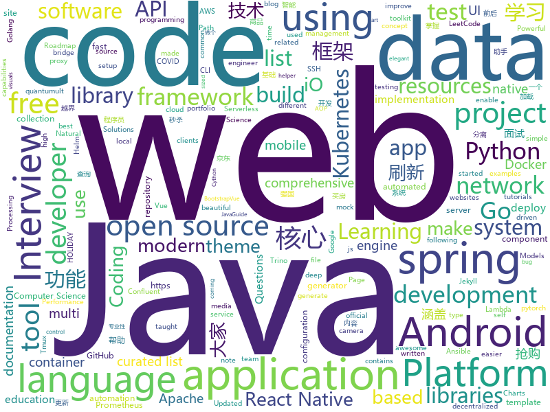

# 2020-12-31
See what the GitHub community is most excited about.

## python
+ [jd_seckill](https://github.com/huanghyw/jd_seckill)(**2,462 stars today**): 
+ [GHunt](https://github.com/mxrch/GHunt)(**174 stars today**): 🕵️‍♂️Investigate Google Accounts with emails.
+ [github_huanghyw_jd_seckill](https://github.com/back8/github_huanghyw_jd_seckill)(**41 stars today**): 
+ [models](https://github.com/tensorflow/models)(**47 stars today**): Models and examples built with TensorFlow
+ [covid-19-data](https://github.com/owid/covid-19-data)(**46 stars today**): Data on COVID-19 (coronavirus) cases, deaths, hospitalizations, tests • All countries • Updated daily by Our World in Data
+ [core](https://github.com/home-assistant/core)(**114 stars today**): WE ARE ON HOLIDAY. REVIEWS WILL TAKE A WHILE. HAPPY HOLIDAYS!✨🏡Open source home automation that puts local control and privacy first
+ [jd-assistant](https://github.com/tychxn/jd-assistant)(**69 stars today**): 京东抢购助手：包含登录，查询商品库存/价格，添加/清空购物车，抢购商品(下单)，查询订单等功能
+ [keras](https://github.com/keras-team/keras)(**14 stars today**): Deep Learning for humans
+ [rich](https://github.com/willmcgugan/rich)(**129 stars today**): Rich is a Python library for rich text and beautiful formatting in the terminal.
+ [jd_maotai](https://github.com/wlwwu/jd_maotai)(**65 stars today**): 
+ [transformers](https://github.com/huggingface/transformers)(**52 stars today**): 🤗Transformers: State-of-the-art Natural Language Processing for Pytorch and TensorFlow 2.0.
+ [jd_seckill](https://github.com/ghwswywps/jd_seckill)(**19 stars today**): 
+ [nginx-proxy](https://github.com/nginx-proxy/nginx-proxy)(**7 stars today**): Automated nginx proxy for Docker containers using docker-gen
+ [streamlit](https://github.com/streamlit/streamlit)(**23 stars today**): Streamlit — The fastest way to build data apps in Python
+ [oppia](https://github.com/oppia/oppia)(**4 stars today**): A free, online learning platform to make quality education accessible for all.
+ [wait-for-it](https://github.com/vishnubob/wait-for-it)(**3 stars today**): Pure bash script to test and wait on the availability of a TCP host and port
+ [12306](https://github.com/testerSunshine/12306)(**28 stars today**): 12306智能刷票，订票
+ [netmiko](https://github.com/ktbyers/netmiko)(**7 stars today**): Multi-vendor library to simplify Paramiko SSH connections to network devices
+ [public-apis](https://github.com/public-apis/public-apis)(**352 stars today**): A collective list of free APIs for use in software and web development.
+ [spaCy](https://github.com/explosion/spaCy)(**13 stars today**): 💫Industrial-strength Natural Language Processing (NLP) with Python and Cython
+ [traingenerator](https://github.com/jrieke/traingenerator)(**65 stars today**): 🧙A web app to generate template code for machine learning
+ [diagrams](https://github.com/mingrammer/diagrams)(**104 stars today**): 🎨Diagram as Code for prototyping cloud system architectures
+ [ansible](https://github.com/ansible/ansible)(**35 stars today**): Ansible is a radically simple IT automation platform that makes your applications and systems easier to deploy and maintain. Automate everything from code deployment to network configuration to cloud management, in a language that approaches plain English, using SSH, with no agents to install on remote systems. https://docs.ansible.com.
+ [typer](https://github.com/tiangolo/typer)(**99 stars today**): Typer, build great CLIs. Easy to code. Based on Python type hints.

## java
+ [trino](https://github.com/trinodb/trino)(**87 stars today**): Official repository of Trino, the distributed SQL query engine for big data, formerly known as PrestoSQL (https://trino.io)
+ [vueblog](https://github.com/MarkerHub/vueblog)(**23 stars today**): 一个前后端分离的简单博客案例，适合刚入门vue，学前后端分离的童鞋！
+ [SmartRefreshLayout](https://github.com/scwang90/SmartRefreshLayout)(**14 stars today**): 🔥下拉刷新、上拉加载、二级刷新、淘宝二楼、RefreshLayout、OverScroll，Android智能下拉刷新框架，支持越界回弹、越界拖动，具有极强的扩展性，集成了几十种炫酷的Header和 Footer。
+ [Mindustry](https://github.com/Anuken/Mindustry)(**18 stars today**): A sandbox tower defense game
+ [quarkus](https://github.com/quarkusio/quarkus)(**12 stars today**): Quarkus: Supersonic Subatomic Java.
+ [karate](https://github.com/intuit/karate)(**3 stars today**): Test Automation Made Simple
+ [feign](https://github.com/OpenFeign/feign)(**3 stars today**): Feign makes writing java http clients easier
+ [JavaGuide](https://github.com/Snailclimb/JavaGuide)(**79 stars today**): 「Java学习+面试指南」一份涵盖大部分 Java 程序员所需要掌握的核心知识。准备 Java 面试，首选 JavaGuide！
+ [calcite](https://github.com/apache/calcite)(**8 stars today**): Apache Calcite
+ [miaosha](https://github.com/qiurunze123/miaosha)(**21 stars today**): ⭐⭐⭐⭐秒杀系统设计与实现.互联网工程师进阶与分析🙋🐓
+ [spring-boot-starter](https://github.com/mybatis/spring-boot-starter)(**3 stars today**): MyBatis integration with Spring Boot
+ [AndroidUtilCode](https://github.com/Blankj/AndroidUtilCode)(**16 stars today**): 🔥Android developers should collect the following utils(updating).
+ [interview](https://github.com/mission-peace/interview)(**5 stars today**): Interview questions
+ [react-native-video](https://github.com/react-native-video/react-native-video)(**1 stars today**): A <Video /> component for react-native
+ [react-native-image-picker](https://github.com/react-native-image-picker/react-native-image-picker)(**4 stars today**): 🌄A React Native module that allows you to use native UI to select media from the device library or directly from the camera.
+ [spring-boot](https://github.com/spring-projects/spring-boot)(**23 stars today**): Spring Boot
+ [react-native-camera](https://github.com/react-native-camera/react-native-camera)(**1 stars today**): A Camera component for React Native. Also supports barcode scanning!
+ [mini-spring](https://github.com/DerekYRC/mini-spring)(**43 stars today**): mini-spring是简化版的spring框架，能帮助你快速熟悉spring源码和掌握spring的核心原理。抽取了spring的核心逻辑，代码极度简化，保留spring的核心功能，如IoC和AOP、资源加载器、事件监听器、类型转换、容器扩展点、bean生命周期和作用域、应用上下文等核心功能。
+ [BaseRecyclerViewAdapterHelper](https://github.com/CymChad/BaseRecyclerViewAdapterHelper)(**12 stars today**): BRVAH:Powerful and flexible RecyclerAdapter
+ [android-interview-questions](https://github.com/MindorksOpenSource/android-interview-questions)(**4 stars today**): Your Cheat Sheet For Android Interview - Android Interview Questions
+ [XUI](https://github.com/xuexiangjys/XUI)(**7 stars today**): 💍A simple and elegant Android native UI framework, free your hands! (一个简洁而优雅的Android原生UI框架，解放你的双手！)
+ [rocketmq](https://github.com/apache/rocketmq)(**13 stars today**): Mirror of Apache RocketMQ
+ [languagetool](https://github.com/languagetool-org/languagetool)(**6 stars today**): Style and Grammar Checker for 25+ Languages
+ [bazel](https://github.com/bazelbuild/bazel)(**5 stars today**): a fast, scalable, multi-language and extensible build system
+ [aws-lambda-developer-guide](https://github.com/awsdocs/aws-lambda-developer-guide)(**1 stars today**): The AWS Lambda Developer Guide

## unknown
+ [computer-science](https://github.com/ossu/computer-science)(**703 stars today**): 🎓Path to a free self-taught education in Computer Science!
+ [Xiaomi_Kernel_OpenSource](https://github.com/MiCode/Xiaomi_Kernel_OpenSource)(**48 stars today**): Xiaomi Mobile Phone Kernel OpenSource
+ [KingOfBugBountyTips](https://github.com/KingOfBugbounty/KingOfBugBountyTips)(**39 stars today**): 
+ [Resources-for-Beginner-Bug-Bounty-Hunters](https://github.com/nahamsec/Resources-for-Beginner-Bug-Bounty-Hunters)(**53 stars today**): A list of resources for those interested in getting started in bug bounties
+ [upptime](https://github.com/upptime/upptime)(**298 stars today**): ⬆️Uptime monitor and status page powered by GitHub Actions, Issues, and Pages
+ [Cracking-The-Coding-Interview-Python-Solutions-and-Explanations](https://github.com/arpan74/Cracking-The-Coding-Interview-Python-Solutions-and-Explanations)(**174 stars today**): Cracking the Coding Interview in Python 3. The solutions all have detailed explanations with visuals.
+ [coding-interview-university](https://github.com/jwasham/coding-interview-university)(**630 stars today**): A complete computer science study plan to become a software engineer.
+ [awesome-cs-books](https://github.com/imarvinle/awesome-cs-books)(**111 stars today**): 经典编程书籍大全，涵盖：计算机系统与网络、系统架构、算法与数据结构、前端开发、后端开发、移动开发、数据库、测试、项目与团队、程序员职业修炼、求职面试等
+ [MDTImport](https://github.com/Tomslack/MDTImport)(**5 stars today**): MDT Import for those who want to continue using nnoga's addon
+ [flutter_roadmap](https://github.com/olexale/flutter_roadmap)(**17 stars today**): Highly Subjective Roadmap to Flutter Development
+ [data-science](https://github.com/ossu/data-science)(**20 stars today**): 📊Path to a free self-taught education in Data Science!
+ [app-ideas](https://github.com/florinpop17/app-ideas)(**47 stars today**): A Collection of application ideas which can be used to improve your coding skills.
+ [3y](https://github.com/ZhongFuCheng3y/3y)(**15 stars today**): 📓从Java基础、JavaWeb基础到常用的框架再到面试题都有完整的教程，几乎涵盖了Java后端必备的知识点
+ [Awesome-pytorch-list](https://github.com/bharathgs/Awesome-pytorch-list)(**50 stars today**): A comprehensive list of pytorch related content on github,such as different models,implementations,helper libraries,tutorials etc.
+ [Interview_Question_for_Beginner](https://github.com/JaeYeopHan/Interview_Question_for_Beginner)(**20 stars today**): 👦👧Technical-Interview guidelines written for those who started studying programming. I wish you all the best.👾
+ [LiteratureDL4Graph](https://github.com/DeepGraphLearning/LiteratureDL4Graph)(**18 stars today**): A comprehensive collection of recent papers on graph deep learning
+ [awesome-implicit-representations](https://github.com/vsitzmann/awesome-implicit-representations)(**49 stars today**): A curated list of resources on implicit neural representations.
+ [Beginner-Network-Pentesting](https://github.com/hmaverickadams/Beginner-Network-Pentesting)(**5 stars today**): Notes for Beginner Network Pentesting Course
+ [.tmux](https://github.com/gpakosz/.tmux)(**10 stars today**): 🇫🇷Oh My Tmux! Pretty & versatile tmux configuration made with❤️
+ [awesome-java](https://github.com/akullpp/awesome-java)(**13 stars today**): A curated list of awesome frameworks, libraries and software for the Java programming language.
+ [shanghai_house_knowledge](https://github.com/ayuer/shanghai_house_knowledge)(**9 stars today**): 2020年11月在上海买房经历总结出来的买房购房做的一些功课分享给大家，技术人帮助技术人，希望对大家有所帮助。
+ [bootcamp-gostack-desafios](https://github.com/rocketseat-education/bootcamp-gostack-desafios)(**4 stars today**): Repositório contendo todos os desafios dos módulos do Bootcamp Gostack
+ [architecture_decision_record](https://github.com/joelparkerhenderson/architecture_decision_record)(**2 stars today**): Architecture decision record (ADR) examples for software planning, IT leadership, and template documentation
+ [ArchitectureWeekly](https://github.com/oskardudycz/ArchitectureWeekly)(**44 stars today**): Architecture Weekly - links and resources to boost your knowledge and developer experience
+ [awesome-php](https://github.com/ziadoz/awesome-php)(**15 stars today**): A curated list of amazingly awesome PHP libraries, resources and shiny things.

## javascript
+ [Tmall_Tickets](https://github.com/cehui0303/Tmall_Tickets)(**195 stars today**): 天猫超市茅台抢票功能
+ [social-analyzer](https://github.com/qeeqbox/social-analyzer)(**264 stars today**): API and Web App for analyzing & finding a person profile across 300+ social media websites (Detections are updated regularly)
+ [joplin](https://github.com/laurent22/joplin)(**82 stars today**): Joplin - an open source note taking and to-do application with synchronization capabilities for Windows, macOS, Linux, Android and iOS. Forum: https://discourse.joplinapp.org/
+ [nodebestpractices](https://github.com/goldbergyoni/nodebestpractices)(**141 stars today**): ✅The Node.js best practices list (December 2020)
+ [city-roads](https://github.com/anvaka/city-roads)(**26 stars today**): Visualization of all roads within any city
+ [clean-code-javascript](https://github.com/ryanmcdermott/clean-code-javascript)(**61 stars today**): 🛁Clean Code concepts adapted for JavaScript
+ [gatsby](https://github.com/gatsbyjs/gatsby)(**18 stars today**): Build blazing fast, modern apps and websites with React
+ [zigbee2mqtt](https://github.com/Koenkk/zigbee2mqtt)(**14 stars today**): Zigbee🐝to MQTT bridge🌉, get rid of your proprietary Zigbee bridges🔨
+ [AI-Expert-Roadmap](https://github.com/AMAI-GmbH/AI-Expert-Roadmap)(**296 stars today**): Roadmap to becoming an Artificial Intelligence Expert in 2020
+ [QuantumultX](https://github.com/w37fhy/QuantumultX)(**13 stars today**): 同步和更新大佬脚本库，更新懒人配置
+ [svelte](https://github.com/sveltejs/svelte)(**30 stars today**): Cybernetically enhanced web apps
+ [bitcore](https://github.com/bitpay/bitcore)(**4 stars today**): A full stack for bitcoin and blockchain-based applications
+ [JavaScript](https://github.com/ziye12/JavaScript)(**7 stars today**): 本人quantumult x，优先适配quantumult x， surge loon应该也能用
+ [responsively-app](https://github.com/responsively-org/responsively-app)(**29 stars today**): A modified web browser that helps in responsive web development. A web developer's must have dev-tool.
+ [Scripts](https://github.com/Sunert/Scripts)(**11 stars today**): 
+ [Index](https://github.com/HowProgrammingWorks/Index)(**11 stars today**): Metarhia educational program index📖
+ [swiper](https://github.com/nolimits4web/swiper)(**11 stars today**): Most modern mobile touch slider with hardware accelerated transitions
+ [serverless](https://github.com/serverless/serverless)(**23 stars today**): ⚡Serverless Framework – Build web, mobile and IoT applications with serverless architectures using AWS Lambda, Azure Functions, Google CloudFunctions & more! –
+ [bootstrap-vue](https://github.com/bootstrap-vue/bootstrap-vue)(**10 stars today**): BootstrapVue provides one of the most comprehensive implementations of Bootstrap v4 for Vue.js. With extensive and automated WAI-ARIA accessibility markup.
+ [jdms](https://github.com/Yx1aoq1/jdms)(**9 stars today**): 京东抢购秒杀助手
+ [label-studio](https://github.com/heartexlabs/label-studio)(**29 stars today**): Label Studio is a multi-type data labeling and annotation tool with standardized output format
+ [snow](https://github.com/wanglin2/snow)(**17 stars today**): 
+ [reactjs-interview-questions](https://github.com/sudheerj/reactjs-interview-questions)(**30 stars today**): List of top 500 ReactJS Interview Questions & Answers....Coding exercise questions are coming soon!!
+ [corona-widget](https://github.com/rphl/corona-widget)(**4 stars today**): COVID-19 Inzidenz-Widget für iOS innerhalb Deutschlands🇩🇪(Kreis/Stadt + Bundesland + Trend)
+ [cypress-example-recipes](https://github.com/cypress-io/cypress-example-recipes)(**3 stars today**): Various recipes for testing common scenarios with Cypress

## html
+ [html-css](https://github.com/gustavoguanabara/html-css)(**8 stars today**): Curso de HTML5 e CSS3
+ [matrix-docker-ansible-deploy](https://github.com/spantaleev/matrix-docker-ansible-deploy)(**4 stars today**): Matrix (An open network for secure, decentralized communication) server setup using Ansible and Docker
+ [swagger-codegen](https://github.com/swagger-api/swagger-codegen)(**6 stars today**): swagger-codegen contains a template-driven engine to generate documentation, API clients and server stubs in different languages by parsing your OpenAPI / Swagger definition.
+ [web-moderno](https://github.com/cod3rcursos/web-moderno)(**2 stars today**): 
+ [docker-development-youtube-series](https://github.com/marcel-dempers/docker-development-youtube-series)(**4 stars today**): 
+ [argo-helm](https://github.com/argoproj/argo-helm)(**1 stars today**): ArgoProj Helm Charts
+ [lovexuexi](https://github.com/james-bond-007/lovexuexi)(**4 stars today**): 我爱学习强国。学习强国聚合了大量可免费阅读的期刊、古籍、公开课、歌曲、戏曲、电影、图书等资料，内容严谨，专业性强。没有博眼球，无下限的自媒体内容和虚假新闻。推荐大家自发积极学习使用。
+ [django-DefectDojo](https://github.com/DefectDojo/django-DefectDojo)(**2 stars today**): DefectDojo is an open-source application vulnerability correlation and security orchestration tool.
+ [tradekit](https://github.com/hackingthemarkets/tradekit)(**6 stars today**): a collection of open source server components and Python libraries for financial data projects and automated trading
+ [learning-area](https://github.com/mdn/learning-area)(**2 stars today**): Github repo for the MDN Learning Area.
+ [amundsen](https://github.com/amundsen-io/amundsen)(**4 stars today**): Amundsen is a metadata driven application for improving the productivity of data analysts, data scientists and engineers when interacting with data.
+ [kubespray](https://github.com/kubernetes-sigs/kubespray)(**5 stars today**): Deploy a Production Ready Kubernetes Cluster
+ [hugo-PaperMod](https://github.com/adityatelange/hugo-PaperMod)(**8 stars today**): Hugo Theme PaperMod
+ [portfolYOU](https://github.com/YoussefRaafatNasry/portfolYOU)(**2 stars today**): A beautiful portfolio Jekyll theme that works with GitHub Pages.
+ [minimal-mistakes](https://github.com/mmistakes/minimal-mistakes)(**6 stars today**): 📐Jekyll theme for building a personal site, blog, project documentation, or portfolio.
+ [partner-contact](https://github.com/OCA/partner-contact)(**1 stars today**): Odoo Partner and Contact related addons
+ [free_r_tips](https://github.com/business-science/free_r_tips)(**3 stars today**): Free R-Tips is a FREE Newsletter provided by Business Science. It comes with bite-sized code tutorials every Tuesday.
+ [rdkit](https://github.com/rdkit/rdkit)(**0 stars today**): The official sources for the RDKit library
+ [msteams-docs](https://github.com/MicrosoftDocs/msteams-docs)(**0 stars today**): Source for the Microsoft Teams developer platform documentation.
+ [cp-helm-charts](https://github.com/confluentinc/cp-helm-charts)(**2 stars today**): The Confluent Platform Helm charts enable you to deploy Confluent Platform services on Kubernetes for development, test, and proof of concept environments.
+ [eleventy-base-blog](https://github.com/11ty/eleventy-base-blog)(**3 stars today**): A starter repository for a blog web site using the Eleventy static site generator.
+ [blog](https://github.com/biaochenxuying/blog)(**11 stars today**): 大前端技术为主，读书笔记、随笔、理财为辅，做个终身学习者。
+ [912_project](https://github.com/stellarkey/912_project)(**5 stars today**): 清华大学计算机系考研攻略 Guidance for postgraduate entrance examination in Department of Computer Science and Technology, Tsinghua University
+ [tech-talks](https://github.com/databricks/tech-talks)(**3 stars today**): This repository contains the notebooks and presentations we use for our Databricks Tech Talks
+ [typedoc](https://github.com/TypeStrong/typedoc)(**5 stars today**): Documentation generator for TypeScript projects.

## go
+ [LeetCode-Go](https://github.com/halfrost/LeetCode-Go)(**183 stars today**): ✅Solutions to LeetCode by Go, 100% test coverage, runtime beats 100% / LeetCode 题解
+ [vault](https://github.com/hashicorp/vault)(**8 stars today**): A tool for secrets management, encryption as a service, and privileged access management
+ [grpc-gateway](https://github.com/grpc-ecosystem/grpc-gateway)(**8 stars today**): gRPC to JSON proxy generator following the gRPC HTTP spec
+ [testify](https://github.com/stretchr/testify)(**12 stars today**): A toolkit with common assertions and mocks that plays nicely with the standard library
+ [alertmanager](https://github.com/prometheus/alertmanager)(**3 stars today**): Prometheus Alertmanager
+ [chainlink](https://github.com/smartcontractkit/chainlink)(**3 stars today**): node of the decentralized oracle network, bridging on and off-chain computation
+ [moby](https://github.com/moby/moby)(**17 stars today**): Moby Project - a collaborative project for the container ecosystem to assemble container-based systems
+ [logrus](https://github.com/sirupsen/logrus)(**18 stars today**): Structured, pluggable logging for Go.
+ [minio](https://github.com/minio/minio)(**20 stars today**): High Performance, Kubernetes Native Object Storage
+ [mockery](https://github.com/vektra/mockery)(**2 stars today**): A mock code autogenerator for Golang
+ [influxdb](https://github.com/influxdata/influxdb)(**9 stars today**): Scalable datastore for metrics, events, and real-time analytics
+ [chaos-mesh](https://github.com/chaos-mesh/chaos-mesh)(**11 stars today**): A Chaos Engineering Platform for Kubernetes.
+ [client_golang](https://github.com/prometheus/client_golang)(**2 stars today**): Prometheus instrumentation library for Go applications
+ [thanos](https://github.com/thanos-io/thanos)(**4 stars today**): Highly available Prometheus setup with long term storage capabilities. A CNCF Incubating project.
+ [fiber](https://github.com/gofiber/fiber)(**39 stars today**): ⚡️Express inspired web framework written in Go
+ [syncthing](https://github.com/syncthing/syncthing)(**20 stars today**): Open Source Continuous File Synchronization
+ [pgx](https://github.com/jackc/pgx)(**9 stars today**): PostgreSQL driver and toolkit for Go
+ [kind](https://github.com/kubernetes-sigs/kind)(**9 stars today**): Kubernetes IN Docker - local clusters for testing Kubernetes
+ [confluent-kafka-go](https://github.com/confluentinc/confluent-kafka-go)(**1 stars today**): Confluent's Apache Kafka Golang client
+ [cobra](https://github.com/spf13/cobra)(**19 stars today**): A Commander for modern Go CLI interactions
+ [websocket](https://github.com/gorilla/websocket)(**8 stars today**): A fast, well-tested and widely used WebSocket implementation for Go.
+ [opa](https://github.com/open-policy-agent/opa)(**5 stars today**): An open source, general-purpose policy engine.
+ [prometheus](https://github.com/prometheus/prometheus)(**24 stars today**): The Prometheus monitoring system and time series database.
+ [terraform](https://github.com/hashicorp/terraform)(**17 stars today**): Terraform enables you to safely and predictably create, change, and improve infrastructure. It is an open source tool that codifies APIs into declarative configuration files that can be shared amongst team members, treated as code, edited, reviewed, and versioned.
+ [gf](https://github.com/gogf/gf)(**62 stars today**): GoFrame is a modular, powerful, high-performance and enterprise-class application development framework of Golang.

## WordCloud

