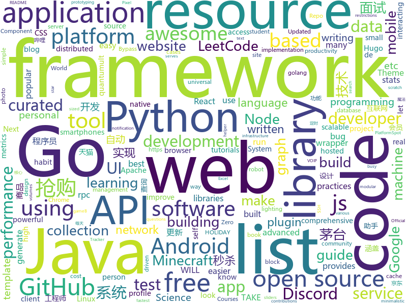

# 2021-01-01
See what the GitHub community is most excited about.

## python
+ [GHunt](https://github.com/mxrch/GHunt)(**204 stars today**): 🕵️‍♂️Investigate Google Accounts with emails.
+ [jd_maotai_seckill](https://github.com/ChinaVolvocars/jd_maotai_seckill)(**480 stars today**): 优化版本的京东茅台抢购神器
+ [AutoGL](https://github.com/THUMNLab/AutoGL)(**69 stars today**): An autoML framework & toolkit for machine learning on graphs.
+ [jd_seckill](https://github.com/huanghyw/jd_seckill)(**1,860 stars today**): 
+ [taobao_seckill](https://github.com/jerry3747/taobao_seckill)(**69 stars today**): 淘宝、天猫半价抢购，抢电视、抢茅台，干死黄牛党
+ [covid-19-data](https://github.com/owid/covid-19-data)(**166 stars today**): Data on COVID-19 (coronavirus) cases, deaths, hospitalizations, tests • All countries • Updated daily by Our World in Data
+ [rich](https://github.com/willmcgugan/rich)(**190 stars today**): Rich is a Python library for rich text and beautiful formatting in the terminal.
+ [jd-assistant](https://github.com/tychxn/jd-assistant)(**123 stars today**): 京东抢购助手：包含登录，查询商品库存/价格，添加/清空购物车，抢购商品(下单)，查询订单等功能
+ [AI-System](https://github.com/microsoft/AI-System)(**94 stars today**): Resources for AI System Education
+ [stock](https://github.com/pythonstock/stock)(**25 stars today**): stock，股票系统。使用python进行开发。
+ [github_huanghyw_jd_seckill](https://github.com/back8/github_huanghyw_jd_seckill)(**78 stars today**): 
+ [discord.py](https://github.com/Rapptz/discord.py)(**19 stars today**): An API wrapper for Discord written in Python.
+ [core](https://github.com/home-assistant/core)(**243 stars today**): WE ARE ON HOLIDAY. REVIEWS WILL TAKE A WHILE. HAPPY HOLIDAYS!✨🏡Open source home automation that puts local control and privacy first
+ [models](https://github.com/tensorflow/models)(**227 stars today**): Models and examples built with TensorFlow
+ [PrettyErrors](https://github.com/onelivesleft/PrettyErrors)(**153 stars today**): Prettify Python exception output to make it legible.
+ [Statistical-Learning-Methods](https://github.com/SleepyBag/Statistical-Learning-Methods)(**117 stars today**): Implement Statistical Leanring Methods, Li Hang the hard way. 李航《统计学习方法》一书的硬核 Python 实现
+ [jd_maotai](https://github.com/wlwwu/jd_maotai)(**101 stars today**): 
+ [ray](https://github.com/ray-project/ray)(**28 stars today**): An open source framework that provides a simple, universal API for building distributed applications. Ray is packaged with RLlib, a scalable reinforcement learning library, and Tune, a scalable hyperparameter tuning library.
+ [public-apis](https://github.com/public-apis/public-apis)(**508 stars today**): A collective list of free APIs for use in software and web development.
+ [traingenerator](https://github.com/jrieke/traingenerator)(**96 stars today**): 🧙A web app to generate template code for machine learning
+ [opencve](https://github.com/opencve/opencve)(**103 stars today**): CVE Alerting Platform
+ [spot-sdk](https://github.com/boston-dynamics/spot-sdk)(**12 stars today**): Spot SDK repo
+ [typer](https://github.com/tiangolo/typer)(**156 stars today**): Typer, build great CLIs. Easy to code. Based on Python type hints.
+ [JD_tools](https://github.com/Zero-S1/JD_tools)(**7 stars today**): 
+ [diagrams](https://github.com/mingrammer/diagrams)(**160 stars today**): 🎨Diagram as Code for prototyping cloud system architectures

## java
+ [Mindustry](https://github.com/Anuken/Mindustry)(**35 stars today**): A sandbox tower defense game
+ [BILIBILI-HELPER](https://github.com/JunzhouLiu/BILIBILI-HELPER)(**15 stars today**): B站，哔哩哔哩（Bilibili）自动签到每日自动投币，银瓜子兑换硬币，领取大会员福利，大会员月底给自己充电等。每天轻松获取65经验值。赶快和我一起成为Lv6吧！
+ [feign](https://github.com/OpenFeign/feign)(**12 stars today**): Feign makes writing java http clients easier
+ [miaosha](https://github.com/qiurunze123/miaosha)(**67 stars today**): ⭐⭐⭐⭐秒杀系统设计与实现.互联网工程师进阶与分析🙋🐓
+ [fabric](https://github.com/FabricMC/fabric)(**5 stars today**): Essential hooks for modding with Fabric.
+ [Starlight](https://github.com/Spottedleaf/Starlight)(**8 stars today**): Rewrites the light engine to fix lighting performance and lighting errors
+ [NetGuard](https://github.com/M66B/NetGuard)(**6 stars today**): A simple way to block access to the internet per app
+ [calcite](https://github.com/apache/calcite)(**9 stars today**): Apache Calcite
+ [ShizuruNotes](https://github.com/MalitsPlus/ShizuruNotes)(**6 stars today**): An unofficial Android tool application for "Princess Connect Re:Dive"
+ [JDA](https://github.com/DV8FromTheWorld/JDA)(**1 stars today**): Java wrapper for the popular chat & VOIP service: Discord https://discord.com
+ [mirai-console-loader](https://github.com/iTXTech/mirai-console-loader)(**8 stars today**): 模块化、轻量级且支持完全自定义的 mirai 加载器。
+ [uhabits](https://github.com/iSoron/uhabits)(**8 stars today**): Loop Habit Tracker, a mobile app for creating and maintaining long-term positive habits
+ [Java-Tutorial](https://github.com/h2pl/Java-Tutorial)(**39 stars today**): 【Java工程师面试复习指南】本仓库涵盖大部分Java程序员所需要掌握的核心知识，整合了互联网上的很多优质Java技术文章，力求打造为最完整最实用的Java开发者学习指南，如果对你有帮助，给个star告诉我吧，谢谢！
+ [zookeeper](https://github.com/apache/zookeeper)(**10 stars today**): Apache ZooKeeper
+ [PictureSelector](https://github.com/LuckSiege/PictureSelector)(**6 stars today**): Picture Selector Library for Android or 图片选择器
+ [jpexs-decompiler](https://github.com/jindrapetrik/jpexs-decompiler)(**9 stars today**): JPEXS Free Flash Decompiler
+ [spotless](https://github.com/diffplug/spotless)(**5 stars today**): Keep your code spotless
+ [aws-lambda-developer-guide](https://github.com/awsdocs/aws-lambda-developer-guide)(**3 stars today**): The AWS Lambda Developer Guide
+ [easyexcel](https://github.com/alibaba/easyexcel)(**43 stars today**): 快速、简单避免OOM的java处理Excel工具
+ [OpenBot](https://github.com/intel-isl/OpenBot)(**3 stars today**): OpenBot leverages smartphones as brains for low-cost robots. We have designed a small electric vehicle that costs about $50 and serves as a robot body. Our software stack for Android smartphones supports advanced robotics workloads such as person following and real-time autonomous navigation.
+ [cwa-server](https://github.com/corona-warn-app/cwa-server)(**16 stars today**): Backend implementation for the Apple/Google exposure notification API.
+ [SmartTubeNext](https://github.com/yuliskov/SmartTubeNext)(**11 stars today**): Better YouTube experience on Android TV
+ [PojavLauncher](https://github.com/PojavLauncherTeam/PojavLauncher)(**8 stars today**): A Minecraft: Java Edition Launcher for Android based on Boardwalk. Note that v2 will not able to run Minecraft 1.12+.
+ [CS-Notes](https://github.com/CyC2018/CS-Notes)(**102 stars today**): 📚技术面试必备基础知识、Leetcode、计算机操作系统、计算机网络、系统设计、Java、Python、C++
+ [Towny](https://github.com/TownyAdvanced/Towny)(**1 stars today**): Towny Advanced Minecraft plugin for Bukkit/Spigot.

## unknown
+ [computer-science](https://github.com/ossu/computer-science)(**966 stars today**): 🎓Path to a free self-taught education in Computer Science!
+ [Resources-for-Beginner-Bug-Bounty-Hunters](https://github.com/nahamsec/Resources-for-Beginner-Bug-Bounty-Hunters)(**126 stars today**): A list of resources for those interested in getting started in bug bounties
+ [KingOfBugBountyTips](https://github.com/KingOfBugbounty/KingOfBugBountyTips)(**199 stars today**): 
+ [build-your-own-x](https://github.com/danistefanovic/build-your-own-x)(**115 stars today**): 🤓Build your own (insert technology here)
+ [Antivirus-Artifacts](https://github.com/D3VI5H4/Antivirus-Artifacts)(**26 stars today**): Anti-virus artifacts. Listing APIs hooked by: Avira, BitDefender, F-Secure, MalwareBytes, Norton, TrendMicro, and WebRoot.
+ [awesome-cs-books](https://github.com/imarvinle/awesome-cs-books)(**266 stars today**): 经典编程书籍大全，涵盖：计算机系统与网络、系统架构、算法与数据结构、前端开发、后端开发、移动开发、数据库、测试、项目与团队、程序员职业修炼、求职面试等
+ [awesome-nodejs](https://github.com/sindresorhus/awesome-nodejs)(**46 stars today**): ⚡Delightful Node.js packages and resources
+ [Xiaomi_Kernel_OpenSource](https://github.com/MiCode/Xiaomi_Kernel_OpenSource)(**146 stars today**): Xiaomi Mobile Phone Kernel OpenSource
+ [ml-visuals](https://github.com/dair-ai/ml-visuals)(**155 stars today**): 🎨ML Visuals contains figures and templates which you can reuse and customize to improve your scientific writing.
+ [ES6-for-humans](https://github.com/metagrover/ES6-for-humans)(**113 stars today**): A kickstarter guide to writing ES6
+ [MDAT](https://github.com/SafeGroceryStore/MDAT)(**104 stars today**): MDAT - Multiple Database Attacking Tool
+ [macOS-Setup](https://github.com/marmmaz/macOS-Setup)(**19 stars today**): A curated macOS setup | v2
+ [books](https://github.com/sanigo/books)(**5 stars today**): 
+ [educative.io_courses](https://github.com/merry75/educative.io_courses)(**20 stars today**): this is downloadings of all educative.io free student subscription courses as pdf from GitHub student pack
+ [design-resources-for-developers](https://github.com/bradtraversy/design-resources-for-developers)(**45 stars today**): Curated list of design and UI resources from stock photos, web templates, CSS frameworks, UI libraries, tools and much more
+ [awesome-flask](https://github.com/humiaozuzu/awesome-flask)(**24 stars today**): A curated list of awesome Flask resources and plugins
+ [A-to-Z-Resources-for-Students](https://github.com/dipakkr/A-to-Z-Resources-for-Students)(**18 stars today**): ✅Curated list of resources for college students
+ [HowToHunt](https://github.com/KathanP19/HowToHunt)(**9 stars today**): Tutorials and Things to Do while Hunting Vulnerability.
+ [ArchitectureWeekly](https://github.com/oskardudycz/ArchitectureWeekly)(**50 stars today**): Architecture Weekly - links and resources to boost your knowledge and developer experience
+ [docker-cheat-sheet](https://github.com/wsargent/docker-cheat-sheet)(**12 stars today**): Docker Cheat Sheet
+ [Awesome-pytorch-list](https://github.com/bharathgs/Awesome-pytorch-list)(**58 stars today**): A comprehensive list of pytorch related content on github,such as different models,implementations,helper libraries,tutorials etc.
+ [LiteratureDL4Graph](https://github.com/DeepGraphLearning/LiteratureDL4Graph)(**30 stars today**): A comprehensive collection of recent papers on graph deep learning
+ [Awesome-Hacking](https://github.com/Hack-with-Github/Awesome-Hacking)(**37 stars today**): A collection of various awesome lists for hackers, pentesters and security researchers
+ [awesome-nextjs](https://github.com/unicodeveloper/awesome-nextjs)(**21 stars today**): 📔📚A curated list of awesome resources : books, videos, articles about using Next.js (A minimalistic framework for universal server-rendered React applications)
+ [awesome-spider](https://github.com/facert/awesome-spider)(**24 stars today**): 爬虫集合

## javascript
+ [Tmall_Tickets](https://github.com/cehui0303/Tmall_Tickets)(**355 stars today**): 天猫超市茅台抢票功能
+ [social-analyzer](https://github.com/qeeqbox/social-analyzer)(**750 stars today**): API and Web App for analyzing & finding a person profile across 300+ social media websites (Detections are updated regularly)
+ [thresh](https://github.com/ymm-tech/thresh)(**232 stars today**): Flutter-based mobile cross-platform dynamic UI framework
+ [nodebestpractices](https://github.com/goldbergyoni/nodebestpractices)(**275 stars today**): ✅The Node.js best practices list (January 2021)
+ [github-readme-stats](https://github.com/anuraghazra/github-readme-stats)(**124 stars today**): ⚡Dynamically generated stats for your github readmes
+ [awesome-selfhosted](https://github.com/awesome-selfhosted/awesome-selfhosted)(**100 stars today**): A list of Free Software network services and web applications which can be hosted locally. Selfhosting is the process of hosting and managing applications instead of renting from Software-as-a-Service providers
+ [tailblocks](https://github.com/mertJF/tailblocks)(**33 stars today**): 🎉Ready-to-use Tailwind CSS blocks.
+ [cube.js](https://github.com/cube-js/cube.js)(**11 stars today**): 📊Cube.js — Open-Source Analytical API Platform
+ [city-roads](https://github.com/anvaka/city-roads)(**208 stars today**): Visualization of all roads within any city
+ [JavaScript](https://github.com/ziye12/JavaScript)(**19 stars today**): 本人quantumult x，优先适配quantumult x， surge loon应该也能用
+ [awesome-cheatsheets](https://github.com/LeCoupa/awesome-cheatsheets)(**30 stars today**): 👩‍💻👨‍💻Awesome cheatsheets for popular programming languages, frameworks and development tools. They include everything you should know in one single file.
+ [discord.js](https://github.com/discordjs/discord.js)(**12 stars today**): A powerful JavaScript library for interacting with the Discord API
+ [cypress](https://github.com/cypress-io/cypress)(**39 stars today**): Fast, easy and reliable testing for anything that runs in a browser.
+ [github-wrapped](https://github.com/ishandeveloper/github-wrapped)(**94 stars today**): Take a look back at all the contributions you as an individual made to the open-source community
+ [mdx](https://github.com/mdx-js/mdx)(**18 stars today**): JSX in Markdown for ambitious projects
+ [lighthouse](https://github.com/GoogleChrome/lighthouse)(**29 stars today**): Automated auditing, performance metrics, and best practices for the web.
+ [bypass-paywalls-chrome](https://github.com/iamadamdev/bypass-paywalls-chrome)(**36 stars today**): Bypass Paywalls web browser extension for Chrome and Firefox.
+ [react-native-calendars](https://github.com/wix/react-native-calendars)(**7 stars today**): React Native Calendar Components🗓️📆
+ [github-profile-readme-generator](https://github.com/rahuldkjain/github-profile-readme-generator)(**15 stars today**): 🚀Generate GitHub profile README easily with the latest add-ons like visitors count, GitHub stats, etc using minimal UI.
+ [semgrep](https://github.com/returntocorp/semgrep)(**13 stars today**): Lightweight static analysis for many languages. Find bug variants with patterns that look like source code.
+ [next-auth](https://github.com/nextauthjs/next-auth)(**46 stars today**): Authentication for Next.js
+ [opensource.guide](https://github.com/github/opensource.guide)(**16 stars today**): 📚Community guides for open source creators
+ [webgl-globe](https://github.com/dataarts/webgl-globe)(**14 stars today**): WebGL Globe is a platform for visualizing latitude longitude based information using WebGL.
+ [QuantumultX](https://github.com/w37fhy/QuantumultX)(**25 stars today**): 同步和更新大佬脚本库，更新懒人配置
+ [seckill](https://github.com/gongjunhao/seckill)(**18 stars today**): Chrome浏览器 抢购、秒杀插件，秒杀助手，定时自动点击

## html
+ [hugo-PaperMod](https://github.com/adityatelange/hugo-PaperMod)(**12 stars today**): Hugo Theme PaperMod
+ [valorant-match-history](https://github.com/dylantheriot/valorant-match-history)(**4 stars today**): See your VALORANT match history with LP (VP??) gains
+ [free_r_tips](https://github.com/business-science/free_r_tips)(**6 stars today**): Free R-Tips is a FREE Newsletter provided by Business Science. It comes with bite-sized code tutorials every Tuesday.
+ [PixelCraft](https://github.com/rgab1508/PixelCraft)(**26 stars today**): A Pixel Art Editor
+ [magic-in-ten-mins](https://github.com/goldimax/magic-in-ten-mins)(**52 stars today**): 十分钟魔法练习
+ [personal-website](https://github.com/github/personal-website)(**9 stars today**): Code that'll help you kickstart a personal website that showcases your work as a software developer.
+ [school-of-sre](https://github.com/linkedin/school-of-sre)(**24 stars today**): At LinkedIn, we are using this curriculum for onboarding our entry level talents into the SRE role.
+ [wpt](https://github.com/web-platform-tests/wpt)(**1 stars today**): Test suites for Web platform specs — including WHATWG, W3C, and others
+ [raspberry-pi-pcie-devices](https://github.com/geerlingguy/raspberry-pi-pcie-devices)(**10 stars today**): Raspberry Pi PCI Express device compatibility database
+ [personalsit.es](https://github.com/xdesro/personalsit.es)(**8 stars today**): 📇A little directory of people's personal sites
+ [datasciencecoursera](https://github.com/mGalarnyk/datasciencecoursera)(**3 stars today**): Data Science Repo and blog for John Hopkins Coursera Courses. Please let me know if you have any questions.
+ [pml-book](https://github.com/probml/pml-book)(**41 stars today**): "Probabilistic Machine Learning" - a book series by Kevin Murphy
+ [py4e](https://github.com/csev/py4e)(**4 stars today**): Web site for www.py4e.com and source to the Python 3.0 textbook
+ [msteams-docs](https://github.com/MicrosoftDocs/msteams-docs)(**0 stars today**): Source for the Microsoft Teams developer platform documentation.
+ [SVG-Loaders](https://github.com/SamHerbert/SVG-Loaders)(**7 stars today**): Loading icons and small animations built with pure SVG.
+ [gohugo-theme-ananke](https://github.com/theNewDynamic/gohugo-theme-ananke)(**1 stars today**): Ananke: A theme for Hugo Sites
+ [hyperblog](https://github.com/freddier/hyperblog)(**14 stars today**): Un blog increíble para el curso de Git y Github de Platzi
+ [ansible-collection-hardening](https://github.com/dev-sec/ansible-collection-hardening)(**14 stars today**): This Ansible collection provides battle tested hardening for Linux, SSH, nginx, MySQL
+ [fluxion](https://github.com/FluxionNetwork/fluxion)(**6 stars today**): Fluxion is a remake of linset by vk496 with enhanced functionality.
+ [blog](https://github.com/biaochenxuying/blog)(**14 stars today**): 大前端技术为主，读书笔记、随笔、理财为辅，做个终身学习者。
+ [helm-charts](https://github.com/prometheus-community/helm-charts)(**5 stars today**): Prometheus community Helm charts
+ [docker-development-youtube-series](https://github.com/marcel-dempers/docker-development-youtube-series)(**11 stars today**): 
+ [3d-force-graph](https://github.com/vasturiano/3d-force-graph)(**2 stars today**): 3D force-directed graph component using ThreeJS/WebGL
+ [amundsen](https://github.com/amundsen-io/amundsen)(**5 stars today**): Amundsen is a metadata driven application for improving the productivity of data analysts, data scientists and engineers when interacting with data.
+ [tidytuesday](https://github.com/rfordatascience/tidytuesday)(**9 stars today**): Official repo for the #tidytuesday project

## go
+ [LeetCode-Go](https://github.com/halfrost/LeetCode-Go)(**165 stars today**): ✅Solutions to LeetCode by Go, 100% test coverage, runtime beats 100% / LeetCode 题解
+ [gf](https://github.com/gogf/gf)(**71 stars today**): GoFrame is a modular, powerful, high-performance and enterprise-class application development framework of Golang.
+ [photoprism](https://github.com/photoprism/photoprism)(**99 stars today**): Personal Photo Management powered by Go and Google TensorFlow
+ [rook](https://github.com/rook/rook)(**3 stars today**): Storage Orchestration for Kubernetes
+ [telegraf](https://github.com/influxdata/telegraf)(**2 stars today**): The plugin-driven server agent for collecting & reporting metrics.
+ [apisix-dashboard](https://github.com/apache/apisix-dashboard)(**1 stars today**): Dashboard for Apache APISIX
+ [lotus](https://github.com/filecoin-project/lotus)(**4 stars today**): Implementation of the Filecoin protocol, written in Go
+ [v2ray-core](https://github.com/v2fly/v2ray-core)(**17 stars today**): A platform for building proxies to bypass network restrictions.
+ [go-zero](https://github.com/tal-tech/go-zero)(**18 stars today**): go-zero is a web and rpc framework written in Go. It's born to ensure the stability of the busy sites with resilient design. Builtin goctl greatly improves the development productivity.
+ [cron](https://github.com/robfig/cron)(**2 stars today**): a cron library for go
+ [ent](https://github.com/facebook/ent)(**29 stars today**): An entity framework for Go
+ [elastic](https://github.com/olivere/elastic)(**3 stars today**): Elasticsearch client for Go.
+ [hugo](https://github.com/gohugoio/hugo)(**24 stars today**): The world’s fastest framework for building websites.
+ [beego](https://github.com/beego/beego)(**4 stars today**): beego is an open-source, high-performance web framework for the Go programming language.
+ [groupcache](https://github.com/golang/groupcache)(**4 stars today**): groupcache is a caching and cache-filling library, intended as a replacement for memcached in many cases.
+ [chainlink](https://github.com/smartcontractkit/chainlink)(**7 stars today**): node of the decentralized oracle network, bridging on and off-chain computation
+ [proxify](https://github.com/projectdiscovery/proxify)(**28 stars today**): Swiss Army knife Proxy tool for HTTP/HTTPS traffic capture, manipulation, and replay on the go.
+ [zerolog](https://github.com/rs/zerolog)(**3 stars today**): Zero Allocation JSON Logger
+ [sourcegraph](https://github.com/sourcegraph/sourcegraph)(**2 stars today**): Universal code search (self-hosted)
+ [go](https://github.com/golang/go)(**38 stars today**): The Go programming language
+ [vault](https://github.com/hashicorp/vault)(**12 stars today**): A tool for secrets management, encryption as a service, and privileged access management
+ [7days-golang](https://github.com/geektutu/7days-golang)(**8 stars today**): 7 days golang programs from scratch (web framework Gee, distributed cache GeeCache, object relational mapping ORM framework GeeORM, rpc framework GeeRPC etc) 7天用Go动手写/从零实现系列
+ [terratest](https://github.com/gruntwork-io/terratest)(**0 stars today**): Terratest is a Go library that makes it easier to write automated tests for your infrastructure code.
+ [pipeline](https://github.com/tektoncd/pipeline)(**1 stars today**): A K8s-native Pipeline resource.
+ [deej](https://github.com/omriharel/deej)(**1 stars today**): Set app volumes with real sliders! deej is an Arduino & Go project to let you build your own hardware mixer for Windows and Linux

## WordCloud

