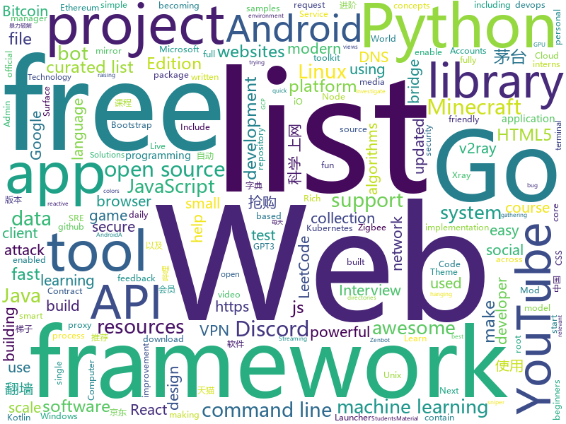

# 2021-01-03
See what the GitHub community is most excited about.

## python
+ [jd_maotai_seckill](https://github.com/ChinaVolvocars/jd_maotai_seckill)(**502 stars today**): 优化版本的京东茅台抢购神器
+ [GHunt](https://github.com/mxrch/GHunt)(**863 stars today**): 🕵️‍♂️Investigate Google Accounts with emails.
+ [youtube-dl](https://github.com/ytdl-org/youtube-dl)(**301 stars today**): Command-line program to download videos from YouTube.com and other video sites
+ [sherlock](https://github.com/sherlock-project/sherlock)(**235 stars today**): 🔎Hunt down social media accounts by username across social networks
+ [stock](https://github.com/pythonstock/stock)(**119 stars today**): stock，股票系统。使用python进行开发。
+ [taobao_seckill](https://github.com/jerry3747/taobao_seckill)(**123 stars today**): 淘宝、天猫半价抢购，抢电视、抢茅台，干死黄牛党
+ [rich](https://github.com/willmcgugan/rich)(**523 stars today**): Rich is a Python library for rich text and beautiful formatting in the terminal.
+ [system-design-primer](https://github.com/donnemartin/system-design-primer)(**312 stars today**): Learn how to design large-scale systems. Prep for the system design interview. Includes Anki flashcards.
+ [AutoGL](https://github.com/THUMNLab/AutoGL)(**211 stars today**): An autoML framework & toolkit for machine learning on graphs.
+ [public-apis](https://github.com/public-apis/public-apis)(**285 stars today**): A collective list of free APIs for use in software and web development.
+ [covid-19-data](https://github.com/owid/covid-19-data)(**215 stars today**): Data on COVID-19 (coronavirus) cases, deaths, hospitalizations, tests • All countries • Updated daily by Our World in Data
+ [oppia](https://github.com/oppia/oppia)(**4 stars today**): A free, online learning platform to make quality education accessible for all.
+ [videos](https://github.com/3b1b/videos)(**181 stars today**): Code for the manim-generated scenes used in 3blue1brown videos
+ [electrum](https://github.com/spesmilo/electrum)(**17 stars today**): Electrum Bitcoin Wallet
+ [bitcoinbook](https://github.com/bitcoinbook/bitcoinbook)(**29 stars today**): Mastering Bitcoin 2nd Edition - Programming the Open Blockchain
+ [tasmotizer](https://github.com/tasmota/tasmotizer)(**6 stars today**): ESP... The time has come to... Tasmotize!
+ [Python](https://github.com/geekcomputers/Python)(**34 stars today**): My Python Examples
+ [MACHIN3tools](https://github.com/machin3io/MACHIN3tools)(**13 stars today**): MACHIN3tools is a free, continuously evolving collection of blender tools and pie menus in a single customizable package.
+ [python-small-examples](https://github.com/jackzhenguo/python-small-examples)(**15 stars today**): 告别枯燥，致力于打造 Python 实用小例子
+ [devops-exercises](https://github.com/bregman-arie/devops-exercises)(**18 stars today**): Linux, Jenkins, AWS, SRE, Prometheus, Docker, Python, Ansible, Git, Kubernetes, Terraform, OpenStack, SQL, NoSQL, Azure, GCP, DNS, Elastic, Network, Virtualization. DevOps Interview Questions
+ [gpt-neo](https://github.com/EleutherAI/gpt-neo)(**37 stars today**): An implementation of model parallel GPT2& GPT3-like models, with the ability to scale up to full GPT3 sizes (and possibly more!), using the mesh-tensorflow library.
+ [scikit-learn](https://github.com/scikit-learn/scikit-learn)(**32 stars today**): scikit-learn: machine learning in Python
+ [gym](https://github.com/openai/gym)(**29 stars today**): A toolkit for developing and comparing reinforcement learning algorithms.
+ [pytest](https://github.com/pytest-dev/pytest)(**13 stars today**): The pytest framework makes it easy to write small tests, yet scales to support complex functional testing
+ [SonoffLAN](https://github.com/AlexxIT/SonoffLAN)(**9 stars today**): Control Sonoff Devices with eWeLink (original) firmware over LAN and/or Cloud from Home Assistant

## java
+ [AndroidAPS](https://github.com/nightscout/AndroidAPS)(**9 stars today**): 
+ [Mindustry](https://github.com/Anuken/Mindustry)(**518 stars today**): A sandbox tower defense game
+ [libgdx](https://github.com/libgdx/libgdx)(**14 stars today**): Desktop/Android/HTML5/iOS Java game development framework
+ [MCinaBox](https://github.com/AOF-Dev/MCinaBox)(**5 stars today**): MCinaBox - A Minecraft Java Edition Launcher on Android
+ [Create](https://github.com/Creators-of-Create/Create)(**6 stars today**): [Forge Mod] Building Tools and Aesthetic Technology
+ [BILIBILI-HELPER](https://github.com/JunzhouLiu/BILIBILI-HELPER)(**30 stars today**): B站，哔哩哔哩（Bilibili）自动签到每日自动投币，银瓜子兑换硬币，领取大会员福利，大会员月底给自己充电等。每天轻松获取65经验值。赶快和我一起成为Lv6吧！
+ [portfolio](https://github.com/buchen/portfolio)(**5 stars today**): A simple tool to calculate the overall performance of an investment portfolio.
+ [fabric](https://github.com/FabricMC/fabric)(**6 stars today**): Essential hooks for modding with Fabric.
+ [termux-app](https://github.com/termux/termux-app)(**20 stars today**): Android terminal and Linux environment - app repository.
+ [Discord4J](https://github.com/Discord4J/Discord4J)(**4 stars today**): Discord4J is a fast, powerful, unopinionated, reactive library to enable quick and easy development of Discord bots for Java, Kotlin, and other JVM languages using the official Discord Bot API.
+ [Leetcode](https://github.com/fishercoder1534/Leetcode)(**7 stars today**): Solutions to LeetCode problems; updated daily. Subscribe to my YouTube channel for more.
+ [SmartTubeNext](https://github.com/yuliskov/SmartTubeNext)(**74 stars today**): Better YouTube experience on Android TV
+ [AntennaPod](https://github.com/AntennaPod/AntennaPod)(**5 stars today**): A podcast manager for Android
+ [Algorithms](https://github.com/williamfiset/Algorithms)(**21 stars today**): A collection of algorithms and data structures
+ [api-samples](https://github.com/youtube/api-samples)(**7 stars today**): Code samples for YouTube APIs, including the YouTube Data API, YouTube Analytics API, and YouTube Live Streaming API. The repo contains language-specific directories that contain the samples.
+ [Signal-Android](https://github.com/signalapp/Signal-Android)(**12 stars today**): A private messenger for Android.
+ [ghidra](https://github.com/NationalSecurityAgency/ghidra)(**43 stars today**): Ghidra is a software reverse engineering (SRE) framework
+ [MinecraftForge](https://github.com/MinecraftForge/MinecraftForge)(**4 stars today**): Modifications to the Minecraft base files to assist in compatibility between mods.
+ [clientcommands](https://github.com/Earthcomputer/clientcommands)(**16 stars today**): How far can a Minecraft client be taken?
+ [openhab-core](https://github.com/openhab/openhab-core)(**1 stars today**): Core framework of openHAB
+ [PojavLauncher](https://github.com/PojavLauncherTeam/PojavLauncher)(**12 stars today**): A Minecraft: Java Edition Launcher for Android based on Boardwalk. Note that v2 will not able to run Minecraft 1.12+.
+ [picocli](https://github.com/remkop/picocli)(**9 stars today**): Picocli is a modern framework for building powerful, user-friendly, GraalVM-enabled command line apps with ease. It supports colors, autocompletion, subcommands, and more. In 1 source file so apps can include as source & avoid adding a dependency. Written in Java, usable from Groovy, Kotlin, Scala, etc.
+ [lucene-solr](https://github.com/apache/lucene-solr)(**6 stars today**): Apache Lucene and Solr open-source search software
+ [DiscordSRV](https://github.com/DiscordSRV/DiscordSRV)(**1 stars today**): The Minecraft <-> Discord bridge plugin your mother warned you about. https://www.spigotmc.org/resources/discordsrv.18494/

## unknown
+ [first-contributions](https://github.com/firstcontributions/first-contributions)(**196 stars today**): 🚀✨Help beginners to contribute to open source projects
+ [free-programming-books](https://github.com/EbookFoundation/free-programming-books)(**117 stars today**): 📚Freely available programming books
+ [winxray](https://github.com/TheMRLL/winxray)(**39 stars today**): winxray：Xray / V2Ray（vmess / vless），Shadowsocks，Trojan通用客户端（Windows）！
+ [build-your-own-x](https://github.com/danistefanovic/build-your-own-x)(**509 stars today**): 🤓Build your own (insert technology here)
+ [project-based-learning](https://github.com/tuvtran/project-based-learning)(**98 stars today**): Curated list of project-based tutorials
+ [Resources-for-Beginner-Bug-Bounty-Hunters](https://github.com/nahamsec/Resources-for-Beginner-Bug-Bounty-Hunters)(**154 stars today**): A list of resources for those interested in getting started in bug bounties
+ [awesome-for-beginners](https://github.com/MunGell/awesome-for-beginners)(**85 stars today**): A list of awesome beginners-friendly projects.
+ [diodata](https://github.com/disclose/diodata)(**146 stars today**): Tools, data, and contact lists relevant to The disclose.io Project.
+ [spreadsheets-for-investors](https://github.com/xiaolai/spreadsheets-for-investors)(**95 stars today**): 投资人必会知识 —— 电子表格简明进阶教程
+ [SaveAmphetamine](https://github.com/x74353/SaveAmphetamine)(**149 stars today**): Apple has threatened to remove Amphetamine from the App Store.
+ [brunch](https://github.com/sebanc/brunch)(**12 stars today**): Boot ChromeOS on x86_64 PC (supports most Intel CPU/GPU or AMD Stoney Ridge)
+ [awesome-certificates](https://github.com/PanXProject/awesome-certificates)(**82 stars today**): List of free dev courses with certificates & badges.
+ [machine-learning-interview](https://github.com/khangich/machine-learning-interview)(**65 stars today**): Machine Learning Interviews from FAAG, Snapchat, LinkedIn.
+ [app-ideas](https://github.com/florinpop17/app-ideas)(**88 stars today**): A Collection of application ideas which can be used to improve your coding skills.
+ [awesome](https://github.com/sindresorhus/awesome)(**124 stars today**): 😎Awesome lists about all kinds of interesting topics
+ [golang-developer-roadmap](https://github.com/Alikhll/golang-developer-roadmap)(**18 stars today**): Roadmap to becoming a Go developer in 2020
+ [awesome-public-datasets](https://github.com/awesomedata/awesome-public-datasets)(**45 stars today**): A topic-centric list of HQ open datasets.
+ [macOS-Setup](https://github.com/marmmaz/macOS-Setup)(**24 stars today**): A curated macOS setup | v2
+ [start-machine-learning-in-2020](https://github.com/louisfb01/start-machine-learning-in-2020)(**70 stars today**): A complete guide on how to start learning machine learning (ML), artificial intelligence (AI) in 2021 without ANY background in the field.
+ [Research-Internships-for-Undergraduates](https://github.com/himahuja/Research-Internships-for-Undergraduates)(**16 stars today**): List of Research Internships for Undergraduate Students
+ [material-design-icons](https://github.com/google/material-design-icons)(**16 stars today**): Material Design icons by Google
+ [awesome-remote-job](https://github.com/lukasz-madon/awesome-remote-job)(**29 stars today**): A curated list of awesome remote jobs and resources. Inspired by https://github.com/vinta/awesome-python
+ [fancyss_history_package](https://github.com/hq450/fancyss_history_package)(**18 stars today**): 科学上网插件的离线安装包储存在这里
+ [developer-roadmap](https://github.com/kamranahmedse/developer-roadmap)(**178 stars today**): Roadmap to becoming a web developer in 2020
+ [live-study](https://github.com/whiteship/live-study)(**15 stars today**): 온라인 스터디

## javascript
+ [TabFS](https://github.com/osnr/TabFS)(**999 stars today**): 🗄Mount your browser tabs as a filesystem.
+ [social-analyzer](https://github.com/qeeqbox/social-analyzer)(**1,065 stars today**): API and Web App for analyzing & finding a person profile across 300+ social media websites (Detections are updated regularly)
+ [alpine](https://github.com/alpinejs/alpine)(**58 stars today**): A rugged, minimal framework for composing JavaScript behavior in your markup.
+ [33-js-concepts](https://github.com/leonardomso/33-js-concepts)(**651 stars today**): 📜33 concepts every JavaScript developer should know.
+ [clean-code-javascript](https://github.com/ryanmcdermott/clean-code-javascript)(**250 stars today**): 🛁Clean Code concepts adapted for JavaScript
+ [next.js](https://github.com/vercel/next.js)(**107 stars today**): The React Framework
+ [MagicMirror](https://github.com/MichMich/MagicMirror)(**29 stars today**): MagicMirror² is an open source modular smart mirror platform. With a growing list of installable modules, the MagicMirror² allows you to convert your hallway or bathroom mirror into your personal assistant.
+ [tailblocks](https://github.com/mertJF/tailblocks)(**83 stars today**): Ready-to-use Tailwind CSS blocks.
+ [javascript-algorithms](https://github.com/trekhleb/javascript-algorithms)(**194 stars today**): 📝Algorithms and data structures implemented in JavaScript with explanations and links to further readings
+ [Motrix](https://github.com/agalwood/Motrix)(**49 stars today**): A full-featured download manager.
+ [Scripts](https://github.com/Sunert/Scripts)(**22 stars today**): 
+ [next-server-components](https://github.com/vercel/next-server-components)(**155 stars today**): Experimental demo of React Server Components with Next.js. Deployed serverlessly on Vercel.
+ [awesome-selfhosted](https://github.com/awesome-selfhosted/awesome-selfhosted)(**358 stars today**): A list of Free Software network services and web applications which can be hosted locally. Selfhosting is the process of hosting and managing applications instead of renting from Software-as-a-Service providers
+ [strapi](https://github.com/strapi/strapi)(**54 stars today**): 🚀Open source Node.js Headless CMS to easily build customisable APIs
+ [gatsby](https://github.com/gatsbyjs/gatsby)(**43 stars today**): Build blazing fast, modern apps and websites with React
+ [metamask-extension](https://github.com/MetaMask/metamask-extension)(**9 stars today**): 🌐🔌The MetaMask browser extension enables browsing Ethereum blockchain enabled websites
+ [Tmall_Tickets](https://github.com/cehui0303/Tmall_Tickets)(**222 stars today**): 天猫超市茅台抢票功能
+ [zigbee2mqtt](https://github.com/Koenkk/zigbee2mqtt)(**18 stars today**): Zigbee🐝to MQTT bridge🌉, get rid of your proprietary Zigbee bridges🔨
+ [vanillawebprojects](https://github.com/bradtraversy/vanillawebprojects)(**15 stars today**): Mini projects built with HTML5, CSS & JavaScript. No frameworks or libraries
+ [widgets](https://github.com/thewaytozion/widgets)(**7 stars today**): 
+ [openzeppelin-contracts](https://github.com/OpenZeppelin/openzeppelin-contracts)(**8 stars today**): OpenZeppelin Contracts is a library for secure smart contract development.
+ [WhatsAsena](https://github.com/Quiec/WhatsAsena)(**6 stars today**): WhatsAsena project - Makes it easy and fun to use Whatsapp. Also first userbot for Whatsapp
+ [discord.js](https://github.com/discordjs/discord.js)(**14 stars today**): A powerful JavaScript library for interacting with the Discord API
+ [phaser](https://github.com/photonstorm/phaser)(**19 stars today**): Phaser is a fun, free and fast 2D game framework for making HTML5 games for desktop and mobile web browsers, supporting Canvas and WebGL rendering.
+ [next-auth](https://github.com/nextauthjs/next-auth)(**35 stars today**): Authentication for Next.js

## html
+ [pml-book](https://github.com/probml/pml-book)(**252 stars today**): "Probabilistic Machine Learning" - a book series by Kevin Murphy
+ [Coursera-ML-AndrewNg-Notes](https://github.com/fengdu78/Coursera-ML-AndrewNg-Notes)(**109 stars today**): 吴恩达老师的机器学习课程个人笔记
+ [hugo-PaperMod](https://github.com/adityatelange/hugo-PaperMod)(**18 stars today**): Hugo Theme PaperMod
+ [startbootstrap-sb-admin-2](https://github.com/StartBootstrap/startbootstrap-sb-admin-2)(**9 stars today**): A free, open source, Bootstrap admin theme created by Start Bootstrap
+ [responsive-website-restaurant](https://github.com/bedimcode/responsive-website-restaurant)(**5 stars today**): 
+ [vpncn.github.io](https://github.com/vpncn/vpncn.github.io)(**19 stars today**): 2020中国翻墙软件VPN推荐指南，以及对比VPS搭建梯子、SSR机场、蓝灯、WireGuard、V2ray、老王VPN等科学上网软件与翻墙方法，中国最新科学上网翻墙VPN梯子下载推荐，稳定好用。
+ [zenbot](https://github.com/DeviaVir/zenbot)(**5 stars today**): Zenbot is a command-line cryptocurrency trading bot using Node.js and MongoDB.
+ [stisla](https://github.com/stisla/stisla)(**5 stars today**): Free Bootstrap Admin Template
+ [EIPs](https://github.com/ethereum/EIPs)(**4 stars today**): The Ethereum Improvement Proposal repository
+ [REKCARC-TSC-UHT](https://github.com/PKUanonym/REKCARC-TSC-UHT)(**19 stars today**): 清华大学计算机系课程攻略 Guidance for courses in Department of Computer Science and Technology, Tsinghua University
+ [bitaddress.org](https://github.com/pointbiz/bitaddress.org)(**5 stars today**): JavaScript Client-Side Bitcoin Wallet Generator
+ [pcc_2e](https://github.com/ehmatthes/pcc_2e)(**3 stars today**): Online resources for Python Crash Course (Second Edition), from No Starch Press
+ [html-css](https://github.com/gustavoguanabara/html-css)(**8 stars today**): Curso de HTML5 e CSS3
+ [content](https://github.com/mdn/content)(**15 stars today**): The content behind MDN Web Docs
+ [Internship-LMS-FrontEnd](https://github.com/praveenscience/Internship-LMS-FrontEnd)(**17 stars today**): We are in the mission of solving a crisis for a lot of small and medium enterprises, who are trying to recruit interns for their projects. This platform aims to onboard new interns, who have applied to the companies and help them understand the process and make the transition smooth.
+ [GDIndex](https://github.com/maple3142/GDIndex)(**4 stars today**): A Google Drive Index built with Vue Running on CloudFlare Workers
+ [Web-Fuzzing-Box](https://github.com/gh0stkey/Web-Fuzzing-Box)(**91 stars today**): Web Fuzzing Box - Web 模糊测试字典与一些Payloads，主要包含：弱口令暴力破解、目录以及文件枚举、Web漏洞...字典运用于实战案例：https://gh0st.cn/archives/2019-11-11/1
+ [Certified-Kubernetes-Security-Specialist](https://github.com/walidshaari/Certified-Kubernetes-Security-Specialist)(**10 stars today**): Online resources help you prepare for the CNCF/Linux Foundation CKS 2020 "Kubernetes Certified Security Specialist" Certification exam. Please provide feedback or requests by raising issues, or making a pull request. All feedback for improvements are welcome. thank you .
+ [discord-bot-client](https://github.com/Flam3rboy/discord-bot-client)(**4 stars today**): A custom version of discord, with bot login support
+ [openwrt-passwall](https://github.com/xiaorouji/openwrt-passwall)(**15 stars today**): 
+ [fluxion](https://github.com/FluxionNetwork/fluxion)(**3 stars today**): Fluxion is a remake of linset by vk496 with enhanced functionality.
+ [free-for-dev](https://github.com/ripienaar/free-for-dev)(**35 stars today**): A list of SaaS, PaaS and IaaS offerings that have free tiers of interest to devops and infradev
+ [wpt](https://github.com/web-platform-tests/wpt)(**3 stars today**): Test suites for Web platform specs — including WHATWG, W3C, and others
+ [awesome-piracy](https://github.com/Igglybuff/awesome-piracy)(**25 stars today**): A curated list of awesome warez and piracy links
+ [GTFOBins.github.io](https://github.com/GTFOBins/GTFOBins.github.io)(**10 stars today**): GTFOBins is a curated list of Unix binaries that can used to bypass local security restrictions in misconfigured systems

## go
+ [LeetCode-Go](https://github.com/halfrost/LeetCode-Go)(**413 stars today**): ✅Solutions to LeetCode by Go, 100% test coverage, runtime beats 100% / LeetCode 题解
+ [uroboros](https://github.com/evilsocket/uroboros)(**221 stars today**): A GNU/Linux monitoring and profiling tool focused on single processes.
+ [photoprism](https://github.com/photoprism/photoprism)(**362 stars today**): Personal Photo Management powered by Go and Google TensorFlow
+ [jd_seckill](https://github.com/ztino/jd_seckill)(**51 stars today**): go版本jd_seckill，京东茅台抢购，降低使用门栏。
+ [Xray-core](https://github.com/XTLS/Xray-core)(**70 stars today**): Xray, Penetrates Everything. Also the best v2ray-core, with XTLS support. Fully compatible configuration.
+ [hugo](https://github.com/gohugoio/hugo)(**63 stars today**): The world’s fastest framework for building websites.
+ [hardentools](https://github.com/securitywithoutborders/hardentools)(**27 stars today**): Hardentools simply reduces the attack surface on Microsoft Windows computers by disabling low-hanging fruit risky features.
+ [go-app](https://github.com/maxence-charriere/go-app)(**22 stars today**): A package to build progressive web apps with Go programming language and WebAssembly.
+ [Amass](https://github.com/OWASP/Amass)(**16 stars today**): In-depth Attack Surface Mapping and Asset Discovery
+ [OpenDiablo2](https://github.com/OpenDiablo2/OpenDiablo2)(**43 stars today**): An open source re-implementation of Diablo 2
+ [u-root](https://github.com/u-root/u-root)(**5 stars today**): A fully Go userland with Linux bootloaders! u-root can create a one-binary root file system (initramfs) containing a busybox-like set of tools written in Go.
+ [NitroSniperGo](https://github.com/Vedza/NitroSniperGo)(**0 stars today**): Discord Nitro sniper and Giveaway joiner in Go (Faster than Python)
+ [bettercap](https://github.com/bettercap/bettercap)(**23 stars today**): The Swiss Army knife for 802.11, BLE and Ethernet networks reconnaissance and MITM attacks.
+ [restic](https://github.com/restic/restic)(**34 stars today**): Fast, secure, efficient backup program
+ [telegram-bot-api](https://github.com/go-telegram-bot-api/telegram-bot-api)(**6 stars today**): Golang bindings for the Telegram Bot API
+ [dnscrypt-proxy](https://github.com/DNSCrypt/dnscrypt-proxy)(**9 stars today**): dnscrypt-proxy 2 - A flexible DNS proxy, with support for encrypted DNS protocols.
+ [cli](https://github.com/cli/cli)(**45 stars today**): GitHub’s official command line tool
+ [excelize](https://github.com/360EntSecGroup-Skylar/excelize)(**33 stars today**): Golang library for reading and writing Microsoft Excel™ (XLSX) files.
+ [live](https://github.com/jfyne/live)(**71 stars today**): Live views for golang
+ [arduino-cli](https://github.com/arduino/arduino-cli)(**5 stars today**): Arduino command line interface
+ [nezha](https://github.com/naiba/nezha)(**25 stars today**): 哪吒面板 可能是最优秀的探针了
+ [nats.go](https://github.com/nats-io/nats.go)(**7 stars today**): Golang client for NATS, the cloud native messaging system.
+ [go-demo](https://github.com/pibigstar/go-demo)(**6 stars today**): Go语言实例教程从入门到进阶，包括基础库使用、设计模式、面试易错点、工具类、对接第三方等
+ [age](https://github.com/FiloSottile/age)(**10 stars today**): A simple, modern and secure encryption tool (and Go library) with small explicit keys, no config options, and UNIX-style composability.
+ [PhoneInfoga](https://github.com/sundowndev/PhoneInfoga)(**8 stars today**): Advanced information gathering & OSINT framework for phone numbers

## WordCloud

